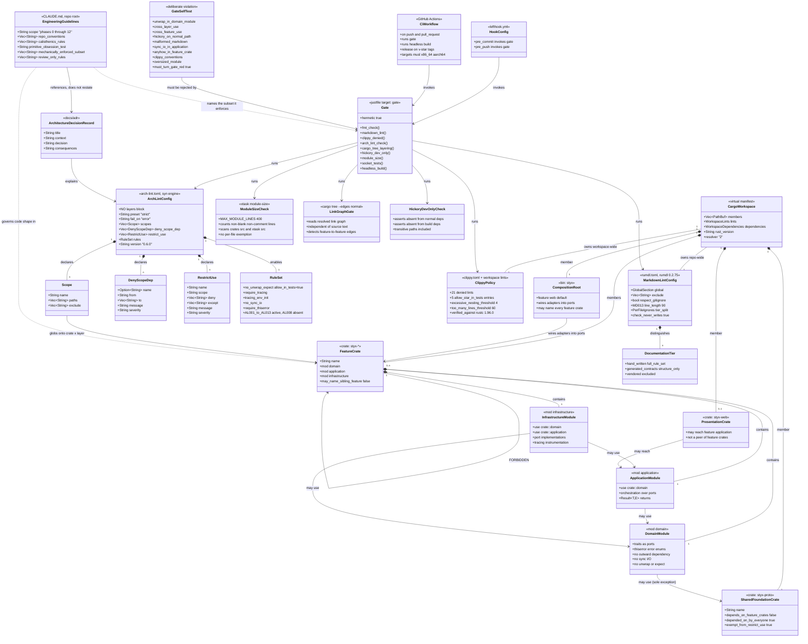

# styx Phase 0 — Foundation and Gates

> **Project**: `styx` — a filtering DNS resolver written from scratch in Rust, replacing
> Pi-hole's role on a home network: recursive/forwarding resolution, per-client blocking
> policy, and a Leptos admin UI. This is a build-it-properly project, not a
> ship-it-this-quarter project. v1 contains two hand-written security-critical subsystems
> (a recursive resolver and a DNSSEC validator), so the repo optimises for a long
> correctness grind: spec-first, socket-level behaviour tests, aggressive lints, CI from
> the first commit.
>
> **Repository state**: greenfield, no existing implementation. No git repository, no
> Cargo workspace, no Rust source file. The only files on disk are `arch-lint.toml` (an
> upstream Kotlin template — the artefact this phase destroys and rebuilds) and the design
> documents. This canvas is self-contained: every decision, rationale and accepted
> consequence it depends on is written out in full below, because the source documents are
> being retired.
>
> **Phase position**: Phase 0 is the first phase and depends on no other phase.
> **Every phase 1 through 12 depends on it**, because every one of them is gated by
> `just gate`. The tightest couplings are **Phase 1 — Wire codec (`styx-proto`)**, the
> first consumer of the workspace skeleton and the first crate written entirely under
> `indexing_slicing` and `arithmetic_side_effects` set to `deny`;
> **Phase 2 — Server loop and test harness**, the first consumer of the `hickory-proto`
> dev-dependency that the containment check exists to police;
> **Phase 11 — Web UI (`styx-web`)**, the first phase at which the `--no-default-features`
> headless build stops passing vacuously and the presentation-layer exception in the
> use-restrictions is first exercised; and **Phase 12 — Cutover hardening**, which reuses
> this phase's release workflow to publish `x86_64-unknown-linux-musl` and
> `aarch64-unknown-linux-musl` artifacts on `v*` tags.
>
> The full ordering, for reference: 0 Foundation and gates · 1 Wire codec · 2 Server loop
> and test harness · 3 `Upstream` port, forwarding, pool · 4 Answer cache · 5 Recursion ·
> 6 DNSSEC · 7 Encrypted inbound · 8 Filtering · 9 Storage · 10 Query log pipeline ·
> 11 Web UI · 12 Cutover hardening.

---

## Requirements

Establish the repository that the following twelve phases are built inside, and make every
structural rule they must obey an executable, *proven-to-fail* check before a single line
of DNS code exists.

Concretely, this phase must:

- **Create the repository and its build topology** — git, and a Cargo workspace in the
  crate-per-feature shape, where `domain`/`application`/`infrastructure` are modules
  inside a crate rather than crates of their own.
- **Replace the enforcement layer that currently enforces nothing.** The committed
  `arch-lint.toml` is an upstream Kotlin template whose very structure routes the tool
  into an engine that cannot read Rust. It exits 0 having analysed zero files. Replacing
  it — not amending it — is the central deliverable.
- **Surround that single check with independent corroboration**: a second layering gate
  that reads the resolved link graph rather than source text, and a containment check that
  keeps the test oracle out of the shipping binary.
- **Gate the repository's prose as well as its code.** Markdown is linted by the same
  gate, under the same three callers, with the tool pinned the same way. This repository
  carries **36 markdown files against 11 Rust files**: the SPDD contracts are what the
  code is generated from and the ADRs are the only surviving record of why the gate has
  its shape, so documentation is a deliverable here rather than a by-product. Two tiers,
  because the repository has two authors: hand-written prose, which a person controls, and
  the generated contracts under `spdd/`, whose line width is decided by a command that has
  never heard of the linter.
- **Aggregate all of it behind one command** (`just gate`) invoked identically by the
  developer, by pre-commit and pre-push hooks, and by CI, so the three can never disagree.
- **Prove the gate is live** by breaking it on purpose.
- **Record the three pieces of reasoning that would otherwise be lost** as ADRs: the
  layering model and the arch-lint engine mechanism, the `hickory-proto` exception to the
  from-scratch rule, and the pinned root trust anchor.
- **Write the durable engineering-norms document every later phase codes against** —
  `CLAUDE.md` at the repository root, covering this phase's own conventions (ports and
  adapters, `thiserror`, checked arithmetic, no synchronous I/O, `tracing`) and a
  Rust-adapted Object Calisthenics ruleset, so that "wrap a primitive when it carries
  domain rules" is written down once, in phase 0, rather than re-derived by every later
  phase's generation prompt.
- **Mechanise every `CLAUDE.md` rule a tool can check** *(amendment, 2026-09-24)* — no
  synchronous I/O in `domain`/`application`, `anyhow` only in the `styx` binary and
  `xtask`, `tracing` rather than print macros, and the measurable proxies of three Object
  Calisthenics rules: nesting depth, function length and module length, plus mixed field
  visibility. A convention that is written down but never checked is one that generated
  code can drift from without anyone noticing. The rules that need judgement stay a review
  discipline, and `CLAUDE.md` says which are which.

**Value**: the gate is the only continuous feedback signal this project has for most of
its life. The cutover is last — styx runs on a dev box until v1 is complete, so phases 1
through 7 produce nothing a human can look at except `dig` output, and nobody is waiting
on the result either. That removes both visible progress and external pressure from a
long, scope-heavy stretch. The gate has to be trustworthy, and it has to be fast.

**Boundary**: nothing DNS-related. No wire format, no resolver, no listener, no DNS type.
The workspace this phase delivers is empty of product code by design.

**The one thing that must not happen**: shipping a second enforcement configuration that
is silently inert. An enforcement tool that checks nothing and an enforcement tool that
finds nothing wrong emit the same exit code. That is not a hypothetical — it is the state
of the repository today.

---

## Entities

The "entities" of this phase are the repository's build topology and its enforcement
machinery. There is no runtime type here, and no DNS concept appears at all.



**Conservative note**: nothing here wraps a simpler thing in a more complex one. The
workspace skeleton is minimal — a shared foundation crate, the composition-root binary,
and the smallest set of feature-crate skeletons needed to make a scope, a layer denial and
a use-restriction all *exercisable*. Later phases add crates against the documented
convention; they do not reshape it.

---

## Approach

### 1. Repository topology

- **Crate per feature; `domain`/`application`/`infrastructure` are modules inside it.**
  Cargo enforces feature-to-feature isolation; arch-lint enforces layering within a crate.
  This is the settled shape and the workspace skeleton exists to express it.
  *Rationale for not splitting layers into crates*: three crates per feature triples the
  crate count, slows the build, and pushes every intra-feature refactor through manifest
  edits. The chosen split puts the crate boundary where isolation actually matters and
  leaves the layer axis to a linter.

- **Feature crates never depend on each other.** A cross-feature need is a
  **trait (a port) declared in the consumer's `domain` module**, implemented by an
  **adapter in the binary** — for example `styx-resolution` will declare a `FilterPolicy`
  port and the `styx` binary wires `styx-filtering` into it. The composition-root binary
  is consequently the one crate permitted to name every feature crate at once.
  *Rationale*: without this, three features reach into each other and the isolation is a
  rewrite to recover. It must be enforced from the first commit, which is why it is a
  phase 0 deliverable and not a phase 8 discovery.

- **`styx-proto` is shared foundation, not a feature crate, and is the single explicit
  exception.** Every crate parses through the wire codec, so the "feature crates never
  depend on each other" rule does not reach it. The use-restrictions must be written so as
  not to forbid it — a restriction phrased as "no crate may name another workspace crate"
  breaks the entire build.

- **`styx-web` is presentation, not a peer**, and may depend on a feature's `application`
  layer. Written carelessly, the isolation restriction forbids exactly this and the rules
  become unusable at phase 11, the point at which they are most inconvenient to change.

- **Single process, single binary.** DNS listeners, Leptos SSR and background workers will
  share state via `Arc`. The web UI is a compile-time Cargo feature (`web`, default on) so
  a headless resolver can be built — and CI builds and tests `--no-default-features` on
  every commit, *or the headless build rots within a month*.

### 2. Replacing the inert enforcement layer

**This is the central risk of the phase and it is already a realised defect, not a
hypothesis. Spiked 2026-09-21 against arch-lint 0.5.0; what was feared to be a
missing-capability risk turned out to be a configuration defect. The mechanism in full:**

- arch-lint has **two mutually exclusive engines**, selected by whether the config
  contains a `[[layers]]` block (`arch-lint-cli-0.5.0/src/main.rs:144`).
- **With `[[layers]]` present, the tree-sitter engine runs.** That engine ships exactly
  one grammar, `tree-sitter-kotlin-ng`, and filters discovery to `.kt`/`.kts`
  (`check_ts.rs:122`). On a Rust repo it analyses **zero files and exits 0**. Because it
  is selected, it also **silently disables AL001–AL013**.
- **The config committed to this repository contains `[[layers]]`.** So that is exactly
  what happens today: a green run that checked nothing.
- **Without `[[layers]]`, the syn engine runs.** It executes **AL001–AL013** *plus*
  `[[scopes]]`, `[[deny-scope-dep]]` and `[[restrict-use]]`
  (`arch-lint-core-0.5.0/src/declarative/config_dto.rs:27`), which enforce layering on
  Rust by path glob. `alloy/arch-lint.toml` is a working proof of this on a real Rust
  workspace.

**The conclusion carried forward verbatim**: *the crate-per-feature layering decision
stands; the fix is replacing the file in phase 0, and pairing it with an independent
`cargo tree` gate, since arch-lint reads source text while `cargo tree` reads the link
graph. Verify with a deliberate violation — an inert config looks identical to a passing
one.*

**Verified against arch-lint 0.6.0 on 2026-09-22 (the re-spike Task 4 mandates).** The
engine analysis holds, and five configuration details differ from what was assumed:

- **Engine selector confirmed.** `detect_engine` (`arch-lint-cli-0.6.0/src/main.rs:153`)
  still routes to the tree-sitter engine if and only if a non-empty `[[layers]]` array is
  present, and to the syn engine otherwise. 0.6.0 additionally ignores commented-out and
  quoted `[[layers]]` text, so only a real table flips the engine.
- **Rule codes.** `AL008` **does not exist**. The active set is `AL001`–`AL007` and
  `AL009`–`AL013` — twelve rules, not thirteen. All five named rules exist under the
  expected names, and `allow_in_tests` is still the spelling for the test exemption.
  Unknown rule options are a hard error, not a silent ignore.
- **`[[scopes]]` field is `paths`, not `paths_glob`**, and scope *names* are validated as
  `[a-z0-9-]` only. `styx-resolution::domain` is rejected outright; the separator must be
  a hyphen: `styx-resolution-domain`.
- **`[[deny-scope-dep]]` carries `message`, not `reason`**, and `[[restrict-use]]` carries
  `except`, not `allow`, plus a required `name` and `message`. Every declarative table is
  `deny_unknown_fields`, so a wrong key aborts the run rather than disabling the rule —
  this failure mode is loud, which is what this phase wants.
- **`[[deny-scope-dep]]` resolves `crate::` paths against the analyzer root, not the crate
  root.** `resolve_target_scopes`
  (`arch-lint-core-0.6.0/src/declarative/rules/scope_dep.rs:118`) maps `crate::a::b` to
  the candidate paths `src/a/b.rs` and `src/a/b/mod.rs`, relative to the analysis root. In
  a workspace the real file is `crates/<crate>/src/a/b/mod.rs`, which those candidates
  never match — so **with the obvious per-crate globs alone, the layering rule matches
  nothing and exits 0.** This was confirmed empirically: a
  `use crate::infrastructure::Thing` in a `domain` module produced no violation. *That is
  the inert-config failure in a new dress, and it is exactly what this phase exists to
  catch.* **The fix**: every layer scope carries a second, root-relative glob —
  `src/<layer>/**` — alongside its real `crates/<crate>/src/<layer>/**` glob, so the
  synthetic candidate path resolves to the intended scope. With it, the same violation is
  reported as `ALD003`. The synthetic glob matches no real file in a workspace layout, so
  it cannot mis-attribute one.
  **This glob is load-bearing and must never be "tidied away".**

Therefore:

- **Replace the file wholesale; do not amend it.** The defect is structural. Any amendment
  that leaves `[[layers]]` in place preserves the exact failure — and the commented-out
  `[[constraints]]` block in the template belongs to the tree-sitter engine, so adding
  rules there adds rules to a run that analyses zero files.
- **The absence of `[[layers]]` is load-bearing.** It is the engine selector. The ADR must
  say so in as many words, or a future reader "simplifies" the config back into inertness.
- **Express layers as path-glob `[[scopes]]`, one per feature crate × layer**, with
  `[[deny-scope-dep]]` carrying the layering denials and `[[restrict-use]]` carrying the
  feature-isolation rule plus its `styx-proto` and `styx-web` exemptions.
  *Rationale for globs over package prefixes*: Rust has no package-prefix concept for the
  tool to key on, and the glob-based scope model is the one the syn engine implements.
- **Enable the named rule set**: `no-unwrap-expect` with `allow_in_tests = true`,
  `require-tracing`, `tracing-env-init`, `no-sync-io`, `require-thiserror`. Bump the tool
  from 0.5.0 to 0.6.0 and pin the exact version.
- **`no-sync-io` is an architectural invariant here, not a style preference**, because the
  hot path touches no I/O: matcher state is in memory, built at boot and on reload, and
  the database holds config, adlist definitions, clients/groups and history only. A DB
  outage must degrade logging and admin, never resolution. A synchronous read that lands
  in `domain` or `application` is a latent violation of that guarantee.

### 3. Independent corroboration

- **Two layering gates, deliberately overlapping.** arch-lint reads source text; the
  link-graph gate built on `cargo tree --edges normal` reads what the build actually
  links. A misconfiguration in one is not a misconfiguration in the other, and a tool that
  fails open is caught by its neighbour. Given that this project's enforcement has already
  been silently inert once, the redundancy is bought on purpose and the ADR must say that
  the overlap *is* the point. *Accepted cost*: duplicated intent, two things to keep in
  sync, and a class of violation that fails twice with two different messages.
- **`hickory-dev-only`**: assert `hickory-proto` appears in no normal or build dependency
  path, transitively — not merely as a direct manifest entry. *Rationale*: `hickory-proto`
  is the **test oracle**, `[dev-dependencies]` only. The fake root/TLD/authoritative
  servers and the expected-byte fixtures have to encode DNS wire format; if our own codec
  encodes them, the resolver and its oracle share every bug and a green suite proves only
  self-consistency. The from-scratch ban — *the entire DNS stack is written from scratch:
  wire codec, server loop, caches, recursion algorithm, DNSSEC validation; no
  `hickory-dns`, no `domain` crate for the protocol* — is on shipping code, not the test
  rig. Without a check, the exception rots into a real dependency.

### 4. Lint policy

- **21 denied clippy lints workspace-wide, 5 `allow-*-in-tests` entries and 2 thresholds
  in `clippy.toml`, all names verified against rustc 1.96.0.** The original 15 guard
  checked arithmetic, panicking and truncation; the 6 added by the 2026-09-24 amendment
  mechanise `CLAUDE.md` conventions and are argued in §10.
- Three are fixed by the record and are load-bearing for later phases:
  - `indexing_slicing = deny` and `arithmetic_side_effects = deny` — every label offset
    and TTL decrement in the phase 1 wire codec becomes a checked operation.
    **That is the intended tax.** It makes the codec verbose and compression-pointer loop
    detection fiddly, and it is why fuzzing is not optional there.
  - `panic = deny` — **load-bearing**. In a single process, a panic in a Leptos request
    handler takes DNS down for the whole house. The lint helps; a `catch_unwind` boundary
    around the web layer and a supervised task model are the real mitigation, and **those
    arrive in phase 12, last**. Everything before phase 12 relies on the lint alone, so
    phase 0 must not weaken it.
- **Pin the toolchain.** Without a pinned rustc, an upgrade can rename or remove a lint
  and turn the gate red — or, worse, downgrade a denied lint into an ignored unknown-lint
  warning.

### 5. One gate, three callers

- **A lint that only runs locally is not enforcement**, and the converse — a lint that
  only runs remotely — makes every violation a round-trip through a failed pipeline.
  arch-lint is therefore enforced by lefthook (pre-commit and pre-push) **and** GitHub
  Actions.
- **Both callers invoke the single `gate` target rather than re-listing its steps.** Any
  drift between what CI runs and what the hooks run makes the hooks theatre.
- **Acceptance has two tiers and phase 0 owns the first.** Per push: hermetic and fast —
  formatting, clippy's denied lints, `arch-lint check`, the link-graph layering gate, the
  `hickory-dev-only` check, socket-level tests, and the `--no-default-features` headless
  build. Per phase: the exit criteria in that phase's spec, which for recursion and DNSSEC
  means a non-hermetic differential run against a local `unbound` over a corpus of real
  domains, diffing RCODE, AD bit and rrset contents. **That tier depends on the live
  internet and is flaky by nature, so it gates a phase and never a push — and it never
  enters `just gate`.**
- Accepted limitation: hooks are bypassable with `--no-verify`, so CI is the only
  non-bypassable gate. This is a conscious position, not an accident.

### 6. Proving the gate is alive

- **Make the deliberate violation an exit criterion, not a one-off confidence-builder.**
  "The config is inert" and "the config passes" are observationally identical from an exit
  code. The phase's entire value evaporates if the second mistake goes unnoticed the way
  the first did.
- Exercise **three** distinct rule families, not one: `no-unwrap-expect` (a `.unwrap()` in
  a `domain` module), `[[deny-scope-dep]]` (a cross-layer `use`), and `[[restrict-use]]`
  (one feature crate naming another). The stated exit criteria name the first two; the
  third is a distinct rule family that a cross-layer `use` does not necessarily reach, and
  it is the rule most likely to be silently wrong because of its `styx-proto` and
  `styx-web` exemptions.
- The violations must fail the gate **on demand** without failing it **permanently** — the
  workspace must otherwise stay green.

### 7. ADRs written now, not when the code lands

Two of the three document choices whose implementation is phases away. Both look like
mistakes to a reader who does not know the reasoning: a from-scratch DNS project that
lists a DNS library in its manifest, and a validator that does not implement automated
trust anchor rollover. Write them where the reasoning is freshest.

### 8. Documentation linting (amendment, 2026-09-22)

- **The gate lints markdown, using `rumdl` pinned to exactly 0.2.75.** It installs through
  `cargo install --locked`, exactly as arch-lint does, so the documentation gate reaches
  the repository by a route that already exists and is pinned by a mechanism already in
  place. *Rationale for not using `markdownlint-cli2`*: it is the better-known tool with
  the larger rule set, but adopting it makes a Node runtime a build requirement of a Rust
  project purely to check prose — a second toolchain to install in CI, pin, and keep
  current, on every machine, forever. *Accepted cost*: `rumdl` is pre-1.0 and its rule set
  will move. A minor bump can rename a rule or change a default. This is the same hazard
  already accepted for arch-lint and rustc and it takes the same mitigation — pin exactly,
  treat an upgrade as a change to verify. It is milder in one respect worth stating: a
  markdown rule change makes the gate *noisy*, not silently inert.

- **One policy over every document — after the two tiers were retired.** *(Updated
  2026-09-22: this decision originally split the repository into two tiers. The split has
  since been removed; the reasoning is kept because it is what the removal had to
  satisfy.)* The repository's markdown had two authors, and a single policy could not
  serve both. Measured against the real repository before this was written: at the tool's
  default width the hand-written

- **The `spdd/**` wrapping exemption has been retired, by removing its cause rather than
  by widening it.** The exemption existed because the SPDD commands did not implement a
  wrapping rule, so enforcing one would have failed on the next generated document through
  no author's fault. Both halves of that were fixed: the five `/spdd-*` command
  definitions now carry a **Markdown Output Norms** block, so generated documents are
  written to this policy in the first place; and the 26 existing contracts were reflowed
  to 90 columns in a single pass, with the few over-long headings no reflow can fix
  shortened by moving their qualifiers into the body. **If a generated document fails this
  gate in future, the fix is to correct what the command emits.** Reintroducing an
  exemption here is the failure mode, not the remedy.

- **What the line-length rule does *not* ask anyone to wrap**: tables, fenced code blocks
  and inline code spans. A table column cannot be broken; a directory tree or console
  transcript means exactly what its layout says, and rewrapping it corrupts it; a line
  whose length is a single type signature has no break point in it. These are exemptions
  for text that **cannot** be wrapped, not for text that is merely inconvenient to wrap.
  **Prose has no exemption.**

- **The gate checks and never writes.** The linter can rewrite documents in place and
  offers to reflow prose; run across `spdd/**` that reflows tables and mermaid blocks into
  a diff nobody can review. Auto-fix stays a deliberate developer action behind its own
  recipe, and reflow stays off.

- **The markdown step is placed with the other text-level checks, before anything
  compiles.** It runs in tens of milliseconds over the whole repository, so it costs
  nothing and fails fast.

- **The markdown gate gets a self-test fixture like every other rule family.** A linter
  whose exclusion list has quietly grown to cover everything passes vacuously and is
  indistinguishable from one finding nothing wrong —
  *this phase's founding failure, in a new medium*. The tier split makes that risk
  concrete rather than theoretical: `spdd/**` already has one rule switched off, and
  nothing but a fixture proves the rest are still on.

### 9. `CLAUDE.md` — the durable engineering-norms document

- **ADRs record why a past decision was made; `CLAUDE.md` records how code is written
  going forward.** They serve different readers and different lifespans: an ADR is written
  once and never edited except by superseding it, while `CLAUDE.md` is the document every
  later phase's generation prompt is expected to already comply with, and is revised in
  place as conventions are learned. Both live in the repository, both are gated as prose,
  and neither substitutes for the other.
- **Write it in phase 0, not when the first feature crate needs it.** Every rule it states
  — ports as traits, `thiserror` at boundaries, checked arithmetic, no synchronous I/O in
  `domain`/`application`, `tracing` over `println!` — is already decided above;
  `CLAUDE.md` is where those decisions become the guidance a later phase's generation
  reads before it writes a line of code, the same role Approach and Norms play inside this
  canvas.
- **Fold in a Rust-adapted Object Calisthenics ruleset**, because the original nine rules
  target Java-shaped OOP and several do not survive translation unchanged. Record which
  do, how, and — as importantly — which are consciously dropped or downgraded, so a later
  reader does not "fix" a deliberate omission:
  - *Wrap primitives that carry domain rules* — the rule this phase cares about most. A
    primitive is wrapped in a newtype when a value has a validated range, a checked
    arithmetic operation, a non-trivial wire encoding, or named constants attached to it —
    not merely because it is a primitive. Phase 1's `Ttl`, `RecordType`, `RecordClass` and
    `ResponseCode` are the precedent this rule generalises from, and `CLAUDE.md` cites them
    by name rather than inventing a fresh example. A plain named `bool` field on a struct
    like `Header::authoritative`, with no independent validation and no risk of being
    confused with an unrelated value at a call site, is not primitive obsession — the test
    is domain rules attached to the value, not the primitive-ness of its type.
  - *Guard clauses over nested conditionals* — the "one level of indentation" and "no
    `else`" rules collapse into one Rust-idiomatic instruction: prefer an early `return`,
    `?`, or a `match` with each arm doing one thing, over a pyramid of nested `if`/`else`.
  - *First-class collections* — a type that owns a `Vec<T>` or `HashMap<K, V>` exposes
    domain-meaningful methods over that collection rather than being a bag of an unrelated
    collection field plus other state. `TypeBitmap` in Phase 1 is the shape to point at.
  - *Small, single-purpose modules over god-modules* — split a layer's module by concept
    into its own file, the way `domain/rdata/basic.rs` and `domain/rdata/dnssec.rs` are
    already split out of a single `rdata` catch-all, rather than letting one file
    accumulate every type in a layer.
  - *No setter that hands back a mutable handle onto enforce-at-construction state* — a
    type whose invariant is checked in its constructor (`Label::new` rejecting more than
    63 octets is the precedent) must not also expose a way to mutate the field back into
    an invalid state. Prefer read accessors and reconstruction over in-place mutation for
    types with a validated invariant.
  - *Full words, no abbreviations* — already Norm 1's naming convention; restated here so
    the ruleset reads as one document rather than two.
  - **Downgraded to guidance, not a hard rule**: "one dot per line." Rust's `Result`,
    `Option` and iterator combinators are idiomatically chained, and forbidding it would
    fight the standard library. `CLAUDE.md` keeps the spirit — do not let a chain cross a
    domain boundary without a named intermediate binding — and drops the letter.
  - **Dropped outright**: a hard numeric cap on instance fields per type. Some domain types
    legitimately carry several named fields with no shared substructure to extract — `Opt`
    and `Header` are the existing examples — and an arbitrary field-count ceiling would
    force an artificial wrapper type with no behaviour of its own, the opposite of what the
    ruleset is for.
- **`CLAUDE.md` does not restate ADR content.** Where a rule's rationale is already an ADR
  (the layering model, the `hickory-proto` exception, the trust anchor), it is referenced
  by path rather than duplicated, so the two documents cannot drift apart silently.
- **Enforced where a tool can measure it, reviewed where it cannot.** *(Updated
  2026-09-24: this bullet originally said the whole Object Calisthenics section was
  unenforced. §10 mechanises the measurable part.)* Nesting depth, function length,
  module length and mixed field visibility are gated. "Wrap a primitive that carries
  domain rules", first-class collections and full words are not, because each needs a
  judgement no lint can make. `CLAUDE.md` names both lists in as many words, rather than
  implying a rigour the gate does not provide or hiding one it does.
- **Binds retroactively as precedent, not as a mandate to revise.** Phase 1's `styx-proto`
  is already implemented and is cited as the worked example the newtype rule generalises
  from; this phase does not modify it. A later phase that finds Phase 1 in violation of a
  rule stated here has found a defect in the rule's wording, not licence to silently
  rewrite shipped code — the SPDD "fix the prompt first" principle applies.

### 10. Mechanising the `CLAUDE.md` conventions (amendment, 2026-09-24)

**What prompted this**: Norms 3, 6 and 7 each claimed an arch-lint rule enforced them.
Read against the arch-lint 0.6.0 source, none of the three claims holds in full:

- `no-sync-io` (AL002) flags blocking calls **only inside async contexts**
  (`arch-lint-rules-0.6.0/src/no_sync_io.rs`). A synchronous `std::fs::read_to_string`
  in a plain `fn` in `domain` passes it. The invariant is about the *layer*, not about
  whether the enclosing function is async, so AL002 does not express it.
- `require-tracing` (AL006) flags the `log` crate's macros and nothing else.
  `println!` passes it.
- `require-thiserror` (AL005) checks that a type named `*Error` derives
  `thiserror::Error`. It says nothing about `anyhow`, which passes it in any crate.

These are silent gaps rather than inert configuration. They are still the phase's
founding failure: a check that is believed to exist, but does not.

**The decisions**:

- **Synchronous I/O: one `[[restrict-use]]` per feature crate × `domain`/`application`
  scope.** Each denies `std::fs` and everything under it; the blocking socket types
  `std::net::TcpStream`, `std::net::TcpListener`, `std::net::UdpSocket` and
  `std::net::ToSocketAddrs`; the traits `std::io::Read`, `std::io::Write`,
  `std::io::BufRead` and `std::io::Seek`; `std::io::prelude` and everything under it;
  and `std::io::stdin`, `std::io::stdout` and `std::io::stderr`. `restrict-use` expands
  grouped imports and also checks inline qualified paths
  (`arch-lint-core-0.6.0/src/declarative/rules/restrict_use.rs`), so both `use` and a
  fully qualified call are caught. *Rationale for not denying `std::net` or `std::io`
  outright*: `std::net::IpAddr` is a value type that Phase 2's `ClientId` wraps in
  `domain`, and a port's error enum may legitimately name `std::io::ErrorKind`. Denying
  the parent module forbids those as well. AL002 stays enabled: it still covers async
  code in `infrastructure`, which these rules deliberately do not reach. **`styx-proto`
  gets the same deny list scoped to the whole crate** (`no-sync-io-proto`). It is a
  pure codec with no `infrastructure` layer, and a guarantee of "no I/O in this crate"
  with nothing behind it is the kind of rule this amendment exists to close.
- **`anyhow`: one `[[restrict-use]]` per library crate** — `styx-proto` and every
  feature crate — denying `anyhow` and everything under it. The `styx` binary and
  `xtask` are exempt **by construction**, the same way `styx-web` is exempt from feature
  isolation: no rule is scoped to them. `styx-web` (Phase 11) is a library crate and
  gets its own rule when it arrives, per Norm 12.
- **`tracing`: clippy `print_stdout`, `print_stderr` and `dbg_macro` denied
  workspace-wide.** Clippy rather than arch-lint, because clippy resolves the macro and
  cannot be defeated by a `use std::println as p` alias. `allow-print-in-tests = true`
  joins the test allowances, because a test printing a diagnostic is not logging. There
  is no `allow-dbg-in-tests`: a `dbg!` is a leftover in any file. **`xtask` carries the
  one standing exemption**: a crate-level `expect` of `print_stdout` and `print_stderr`,
  with a `reason` stating that it reports a verdict to a human and is not a library
  boundary. It is `expect` rather than `allow`, so the exemption becomes an error the day
  it stops being needed.
- **Guard clauses: clippy `excessive_nesting` at threshold 4.** The lint is inert at its
  default threshold of 0, so the threshold in `clippy.toml` is what turns it on. Its
  count includes the enclosing `mod`, `impl` and `fn` blocks. At 4, a method in a
  file-level module may nest two control-flow blocks, which is where a guard clause or
  an extracted function should take over. *Measured before choosing*: at threshold 4 the
  existing code has three violations, all in `xtask`'s `hickory-dev-only` traversal,
  and they are fixed by restructuring rather than by raising the number.
- **Small functions: clippy `too_many_lines` at threshold 60** (default 100). It counts
  code lines, not comment or blank lines, so `missing_docs`-driven documentation is not
  taxed. The existing code has no violation at 60.
- **No setter reopening an invariant: clippy `partial_pub_fields` denied.** A struct
  either publishes every field (plain data, no invariant) or none (an abstract type
  guarding one behind its constructor). A mix is the shape in which one validated field
  sits next to one that anyone can write. *What it cannot see*: a type with all fields
  private that still exposes a `&mut` accessor or an unvalidated setter. That half stays
  a review item.
- **Small modules: an `xtask module-size` check, cap 400 lines per `.rs` file.** Clippy
  has no module-level length lint, and the file is the unit that the rule "split a layer's
  module by concept" is about. The check counts lines that are neither blank nor only a
  comment, so documentation is never the reason a file fails. Inline test modules count,
  and a test module that grows past the cap moves to its own `tests.rs` file. The check
  scans every `.rs` file under `crates/*/src/` and `xtask/src/`. It has **no per-file
  exemption mechanism**: the remedy for a failing file is to split it. The cap is one
  named constant in `xtask`, not a flag, so the self-test proves the real number.
  `xtask`'s own `main.rs` is split by subcommand at the same time, both to stay under the
  cap and to keep the tool in the shape it enforces.
- **Every new check gets a self-test fixture**, F through I (Operations 11), on the same
  argument as A through E. The clippy fixture asserts that the diagnostics **name each
  lint**, not merely that clippy exited non-zero. One exit code covers six lints, and a
  lint silently dropped from the root manifest would still leave the others failing.

**Judgement stays in review**: "wrap a primitive that carries domain rules", first-class
collections, full words, and the downgraded "one dot per line". No lint can decide
whether a `u16` has domain rules attached. A proxy such as `struct_excessive_bools` would
push against `CLAUDE.md`'s explicit permission for plain named `bool` fields.

### Alternatives considered and rejected

- **Amend the committed `arch-lint.toml` instead of replacing it.** Rejected: its
  `[[constraints]]` block belongs to the engine that cannot see Rust; adding rules there
  adds rules to a run over zero files.
- **Drop arch-lint and rely on the Cargo dependency graph alone.** Rejected: Cargo can
  express crate-to-crate isolation but has no concept of a module layer inside a crate,
  and the layers live inside crates. The link-graph gate is necessary but not sufficient.
- **One crate per layer so Cargo enforces layering too.** Rejected: triples crate count,
  slows builds, routes every intra-feature refactor through manifests.
- **Defer the gates until there is code to gate.** Rejected: the lints in question change
  how the wire codec is *written*, not merely whether it passes review. Retrofitting them
  after phase 1 means rewriting the codec.
- **Run arch-lint only in CI.** Rejected: see §5.
- **Use `markdownlint-cli2` for the documentation gate.** Rejected: a Node runtime becomes
  a build requirement of a Rust project, to lint prose. See §8.
- **Run a formatter in `--check` mode instead of a linter.** Rejected as the primary
  mechanism: it enforces one canonical shape, would reflow the SPDD contracts wholesale
  including tables and mermaid blocks, and does not report the structural defects that are
  actually worth catching. Auto-fix stays available as a convenience, deliberately outside
  the gate.
- **Lint `spdd/**` under the full rule set and reflow the 26 generated documents to
  match.** Rejected: it wins compliance once and loses it on the next `/spdd-generate`
  run. Fixing it properly means teaching the five SPDD command templates a formatting
  contract — real work, in a different part of the system, that this phase has no mandate
  to touch.
- **Defer markdown linting to a later phase.** Rejected on this phase's own logic: the
  cost is lowest now and rises with every document, the documentation set is already three
  times the size of the code, and deferring means the ADRs written *in this phase* are the
  ones that never get checked.
- **Trust `arch-lint check` exiting 0 as evidence the gate works.** Rejected: this is
  precisely the failure already recorded against the committed file.
- **Lint "wrap this primitive" with a custom `dylint` library.** Rejected: whether a value
  carries domain rules is exactly the judgement `CLAUDE.md` asks for, and a heuristic
  that flags bare integers in signatures would fire on the plain fields `CLAUDE.md`
  explicitly permits. The gate would start red and be taught to be ignored.
- **Enforce module size with clippy `too_many_lines` alone.** Rejected: it measures
  functions, not files, and a module of thirty short functions is exactly the god-module
  shape the rule exists to split.
- **Let a file opt out of the module-size cap with a marker comment.** Rejected: the cap
  then becomes negotiable one file at a time, and nothing in the tooling objects to the
  hundredth marker. This is the same reasoning that governs per-path markdown exemptions
  in §8.

---

## Structure

### Port and adapter relationships (the convention this phase establishes)

1. A **port** is a `trait` declared in a feature crate's `domain` module. It names no
   concrete infrastructure and no sibling feature crate.
2. An **adapter** is a type implementing that trait, living either in the same crate's
   `infrastructure` module (for its own infrastructure) or in the `styx` binary (for
   cross-feature wiring).
3. Every fallible operation returns `Result<T, E>` where `E` is a `thiserror`-derived enum
   owned by the crate that defines the port. Errors are enums, not strings, and never
   panics.
4. The `styx` binary is the **composition root**: it constructs adapters and injects them
   into ports by value at startup. There is no runtime service locator and no reflection.
5. `styx-proto` is depended upon by every crate and depends on none of them.

### Dependency rules (what the gates enforce)

1. `domain` may use `styx-proto` and third-party crates; it may not use `application`,
   `infrastructure`, or any sibling feature crate.
2. `application` may use `domain` and `styx-proto`; it may not use `infrastructure`.
3. `infrastructure` may use `domain`, `application` and `styx-proto`.
4. No feature crate may name another feature crate, in any layer.
5. `styx-proto` is exempt from rule 4 as a *target* — everyone may name it — and is bound
   by it as a *source*: it names no feature crate.
6. `styx-web` may name a feature crate's `application` layer. It is presentation, not a
   peer.
7. `styx` (the binary) may name every feature crate. It is the only crate that may.
8. `hickory-proto` may appear only under `[dev-dependencies]`, in any crate, and must not
   be reachable through any normal or build dependency path.

### Workspace layout

```text
styx/
├── Cargo.toml                  # virtual manifest: members, [workspace.lints], [workspace.dependencies]
├── CLAUDE.md                   # engineering guidelines every phase codes against
├── rust-toolchain.toml         # pinned rustc (the version the 21 lint names were verified against)
├── arch-lint.toml              # syn engine — NO [[layers]]
├── clippy.toml                 # 5 allow-*-in-tests entries, nesting and function-length thresholds
├── rumdl.toml                  # markdown: tier split, no [[layers]]-style trap here
├── justfile                    # `gate` and its constituent recipes
├── lefthook.yml                # pre-commit, pre-push -> just gate
├── .github/workflows/          # gate + headless build; release on v* tags
├── xtask/                      # link-graph layering, hickory-dev-only and module-size checks
│   └── src/                    # main.rs dispatches; deps.rs, hickory.rs, module_size.rs
├── docs/adr/                   # the three ADRs
├── crates/
│   ├── styx-proto/             # shared foundation
│   ├── styx-<feature>/         # src/domain, src/application, src/infrastructure
│   └── styx/                   # composition root, `web` feature
└── gate-selftest/              # deliberate violations, kept out of the normal gate run
                                # (NOT under tests/ — see Operations 11)
```

### Dependency inventory (the whole of it, this phase)

Declared once in `[workspace.dependencies]`; members reference them with
`workspace = true`.

| Crate | Where | Why |
|---|---|---|
| `tracing` | `styx` binary | Norm 7. The binary emits the one startup event that makes the subscriber observable. |
| `tracing-subscriber` (`env-filter`) | `styx` binary | Norm 7 and arch-lint's `tracing-env-init`: the subscriber is built from `RUST_LOG`, never a hardcoded level. |
| `anyhow` | `xtask` only | Tooling, not shipping code. Norm 3 bans it in library crates, enforced by a `[[restrict-use]]` per library crate; `xtask` is a binary that reports a verdict to a human. |
| `cargo_metadata` | `xtask` only | Reads the resolved link graph for the layering and containment checks. |

No other dependency is introduced. **No DNS crate of any kind**, and no `hickory-*` — not
even under `[dev-dependencies]`, which stays empty until Phase 1.

**Pinned external tools** are not Cargo dependencies of any crate — they are installed by
`just install-tools` and version-checked by the gate:

| Tool | Version | Why |
|---|---|---|
| `arch-lint` (`arch-lint-cli`) | exactly `0.6.0` | Layering, use-restrictions and the rule set. |
| `rumdl` | exactly `0.2.75` | The markdown gate. Pre-1.0, so the exact pin matters more, not less. |

### Crate classification (what the link-graph gate keys on)

| Class | Members | Rule |
|---|---|---|
| Shared foundation | `styx-proto` | Everyone may name it; it names no one. |
| Feature crate | `styx-resolution`, `styx-filtering` | May not name another feature crate. |
| Presentation | `styx-web` (from Phase 11) | May name a feature's `application`. Not a peer. |
| Composition root | `styx` | May name every feature crate. The only one that may. |
| Tooling | `xtask` | Outside the layering model entirely; bound by the lints, not by the scopes. The one crate that may print, via a crate-level `expect`. |

### Gate composition (execution order, fail-fast)

1. Format check — cheapest, fails fastest.
2. Markdown lint — the other text-level check. Tens of milliseconds over the whole
   repository, so it belongs here rather than behind anything that compiles.
3. Clippy with the 21 denied lints, workspace-wide, all targets, all features, reading the
   thresholds in `clippy.toml`.
4. `arch-lint check` — scopes, layer denials, use-restrictions (feature isolation,
   synchronous I/O by layer, `anyhow` by crate), AL001–AL013, and the five named rules.
5. Link-graph layering check over the resolved dependency graph.
6. `hickory-dev-only` containment check.
7. Module-size check — no `.rs` file past 400 counted lines.
8. Tests. From phase 2 onward these are socket-level by default: real UDP/TCP against an
   ephemeral-port server with in-process fakes and an injectable `Clock`. In phase 0 there
   is nothing to run but the target must already be wired.
9. `--no-default-features` headless build.

Every step is hermetic and requires no network. The non-hermetic differential run against
`unbound` is a per-phase gate and is deliberately absent from this list.

---

## Operations

Tasks are ordered by dependency. Each is independently verifiable.

### 1. Initialise the repository

1. **Responsibility**: create version control and the ignore policy before anything else
   is written.
2. **Steps**:
   - `git init` at the repository root.
   - `.gitignore` covering `/target`, `**/*.rs.bk`, fuzz artifacts, and local editor
     state.
   - Commit the existing design documents as the first commit, so the replacement of
     `arch-lint.toml` is visible as a change rather than as an origin.
3. **Completion criterion**: `git status` is clean and `git log` has one commit.

### 2. Create the Cargo workspace skeleton

1. **Responsibility**: express the crate-per-feature topology so that scopes, layer
   denials and use-restrictions all have something real to bind to.
2. **Root `Cargo.toml`**:
   - Virtual manifest (no `[package]`), `resolver = "2"`.
   - `members` listing the crates below.
   - `[workspace.lints.clippy]` and `[workspace.lints.rust]` carrying the denied set, so
     "workspace-wide" is enforced from one place; every member crate opts in with
     `[lints] workspace = true`.
   - `[workspace.dependencies]` so versions are declared once.
   - `rust-version` matching the pinned toolchain.
3. **Members to create** — the minimum that makes every rule exercisable:
   - `crates/styx-proto` — shared foundation. Empty `lib.rs` plus a doc comment recording
     that it is foundation and not a feature, and that it is the sole exemption from
     feature isolation.
   - `crates/styx-resolution` — a feature-crate skeleton with `src/domain/mod.rs`,
     `src/application/mod.rs`, `src/infrastructure/mod.rs`, each empty but present. Chosen
     because it is the first feature crate the later phases fill and because it is the
     crate that will declare the `FilterPolicy` port.
   - `crates/styx-filtering` — a second feature-crate skeleton with the same three
     modules. Its only job in phase 0 is to be the *other* crate in a cross-feature
     violation, so `[[restrict-use]]` can be proven live.
   - `crates/styx` — the composition-root binary. Declares `[features] default = ["web"]`
     and `web = []`, so the `--no-default-features` build has a real feature to switch
     off.
4. **Constraints**: no DNS type, no protocol code, no business logic. Modules exist and
   are empty. Later phases add crates by following this shape; they do not reshape it.
5. **Completion criterion**: `cargo build --workspace` and
   `cargo build --workspace --no-default-features` both succeed.

### 3. Pin the toolchain

1. **Responsibility**: make the lint names stable.
2. **Steps**: `rust-toolchain.toml` with `channel` set to the exact rustc version against
   which the 21 clippy lint names were verified (1.96.0), plus the components the gate
   needs (`clippy`, `rustfmt`) and the two musl targets the release job publishes.
3. **Rationale to record in the commit message**: an unpinned toolchain can silently
   downgrade a denied lint to an ignored unknown-lint warning.
4. **Completion criterion**: `rustc --version` inside the repo reports the pinned version.

### 4. Replace `arch-lint.toml`

1. **Responsibility**: turn architecture enforcement from inert to live.
2. **Steps**:
   - **Delete the existing file contents entirely.** Do not carry forward `[analyzer]`,
     `[[layers]]`, `[dependencies]` or the commented `[[constraints]]` — all four belong
     to the tree-sitter engine.
   - Write a syn-engine configuration with **no `[[layers]]` block**. Put a comment at the
     top of the file stating that the absence of `[[layers]]` is the engine selector, that
     adding one routes the tool to a Kotlin-only tree-sitter engine which discovers zero
     `.rs` files and exits 0, and that this silently disables AL001–AL013.
   - **`[[scopes]]`** — one per feature crate × layer, keyed by the `paths` glob list (the
     field is `paths`, not `paths_glob`): `styx-resolution-domain` →
     `crates/styx-resolution/src/domain/**`, and likewise for `application` and
     `infrastructure`; the same triple for `styx-filtering`; a scope for `styx-proto`; a
     scope for the `styx` binary. Scope names are validated `[a-z0-9-]`, so the separator
     is a hyphen and never `::`.
     **Each layer scope additionally carries the root-relative glob `src/<layer>/**`**,
     for the reason recorded in Approach §2: `[[deny-scope-dep]]` resolves `crate::a::b`
     against the *analysis root*, so without it the layering rule silently matches
     nothing.
   - **`[[deny-scope-dep]]`** — encode the layering denials from Structure rules 1–3, each
     with a `message` string (the field is `message`, not `reason`) that states the
     invariant in prose, so the failure message teaches rather than merely rejects.
   - **`[[restrict-use]]`** — encode Structure rules 4–7, one rule per feature crate
     naming the *other* feature crates in `deny`. Each rule requires a `name` and a
     `message`; exceptions are spelled `except`, not `allow`. `styx-proto` is exempt by
     never appearing in any `deny` list, so everyone may name it. `styx-web` and the
     `styx` binary are exempt **by construction**: the restriction's `scope` covers only
     feature-crate sources, so a crate that is not a feature crate is unrestricted without
     needing an `except` entry.
   - **`[[restrict-use]]` for synchronous I/O** *(amendment, 2026-09-24)* — one rule per
     feature crate × layer for `domain` and `application` (four in phase 0:
     `no-sync-io-resolution-domain`, `no-sync-io-resolution-application`, and the same two
     for `styx-filtering`), each scoped to that layer's scope and denying the exact list in
     Approach §10. The `message` states the invariant: the hot path touches no I/O, so I/O
     lives in `infrastructure` behind a port declared in `domain`. `infrastructure` gets no
     such rule. That is where adapters perform I/O. A fifth rule, `no-sync-io-proto`,
     applies the same list to the whole `styx-proto` scope.
   - **`[[restrict-use]]` for `anyhow`** *(amendment, 2026-09-24)* — one rule per library
     crate (three in phase 0: `no-anyhow-proto`, `no-anyhow-resolution`,
     `no-anyhow-filtering`), each scoped to the whole crate and denying `anyhow` and
     everything under it. The `message` points at Norm 3: return a `thiserror` enum owned
     by the crate. No rule is scoped to the `styx` binary or `xtask`, which is the whole
     of their exemption.
   - **Rules to enable**: `no-unwrap-expect` with `allow_in_tests = true`,
     `require-tracing`, `tracing-env-init`, `no-sync-io`, `require-thiserror`.
   - **Pin arch-lint to an exact 0.6.0 version**, not a range.
3. **Verification before proceeding** (mandatory — the engine analysis above was spiked
   against 0.5.0 and 0.6.0's behaviour is unverified):
   - Confirm the 0.6.0 binary still selects the syn engine in the absence of `[[layers]]`.
   - Confirm the configuration keys `[[scopes]]`, `[[deny-scope-dep]]` and
     `[[restrict-use]]` are still accepted under those names.
   - Confirm the five named rules exist under those names and that `allow_in_tests` is
     still the spelling for the test exemption.
   - Confirm AL001–AL013 are reported as active.
   - Run `arch-lint check` with `--verbose` (or the 0.6.0 equivalent) and confirm it
     reports a **non-zero file count**. A zero-file run is the failure mode this task
     exists to kill.
4. **Completion criterion**: `arch-lint check` passes on the clean workspace *and* reports
   having analysed a non-zero number of Rust files.

### 5. Write the independent link-graph layering check

1. **Responsibility**: catch what arch-lint cannot — a real link edge between two feature
   crates, regardless of what the source text says.
2. **Implementation shape**: a small Rust `xtask` binary (preferred, so it is covered by
   the same lints and toolchain) or a shell script, invoked by the `gate` target.
3. **Logic**:
   - Read the resolved dependency graph from `cargo metadata --format-version 1`, whose
     `resolve.nodes[].deps[].dep_kinds[]` gives each edge's kind (normal, `dev` or
     `build`) exactly. This is the same resolved link graph `cargo tree --edges normal`
     renders, taken as structured data rather than as an indentation-formatted tree — the
     property that matters (the graph is what the build links, not what the source text
     says) is unchanged, and the verdict no longer depends on parsing ASCII art.
   - Build the set of workspace member crates and classify each as feature crate, shared
     foundation, presentation, or composition root.
   - **Violation**: a normal edge from one feature crate to another feature crate.
   - **Not a violation**: any edge into `styx-proto`; an edge from `styx-web` into a
     feature crate; any edge out of the `styx` binary; any dev edge.
   - Exit non-zero on the first violation, printing the offending edge and naming the
     invariant it breaks.
4. **Constraint**: the check must produce a **verdict**, not a report. Informational
   output that nobody reads is not a gate.
5. **Completion criterion**: passes on the clean workspace; fails when `styx-resolution`
   is given a normal dependency on `styx-filtering`.

### 6. Write the `hickory-dev-only` containment check

1. **Responsibility**: keep the test oracle out of the shipping binary, so the
   from-scratch rule stays observable rather than aspirational.
2. **Logic**:
   - Inspect the **full transitive** normal and build dependency paths of every workspace
     member.
   - **Violation**: `hickory-proto` (or any `hickory-*` crate) reachable through a normal
     or build path.
   - **Permitted**: presence under `[dev-dependencies]`, at any depth.
   - Exit non-zero with the offending path printed, so a transitive introduction is
     diagnosable.
3. **Known limitation to document in the check's own output or comment**: in phase 0 the
   dev-dependency does not yet exist, so the check passes vacuously. It becomes a real
   check at phase 1 (fixtures) and phase 2 (fake root/TLD/authoritative servers).
4. **Shape constraint** *(amendment, 2026-09-24)*: the transitive traversal is written
   with guard clauses and extracted helpers so that it satisfies `excessive_nesting` at
   threshold 4. The first version nested three blocks past it. It lives in
   `xtask/src/hickory.rs`, and the link-graph check lives in `xtask/src/deps.rs`.
5. **Completion criterion**: passes on the clean workspace; fails when `hickory-proto` is
   temporarily moved from `[dev-dependencies]` to `[dependencies]`.

### 6a. Write the module-size check *(amendment, 2026-09-24)*

*Numbered 6a so that every existing task number stays valid, as with 7a.*

1. **Responsibility**: turn "small, single-purpose modules over god-modules" into a
   verdict, at the only granularity no clippy lint covers — the file.
2. **Placement**: `xtask/src/module_size.rs`, reached as the `module-size` subcommand.
   `xtask/src/main.rs` is reduced to argument parsing and dispatch, and the two existing
   checks move to `deps.rs` and `hickory.rs`. The cap is the named constant
   `MAX_MODULE_LINES = 400` in `module_size.rs`. There is no command-line flag and no
   configuration file that can raise it.
3. **Logic**:
   - Walk every `.rs` file under `crates/*/src/` and `xtask/src/`, relative to a root
     given by an optional `--root <path>` argument (default: the workspace root). The
     argument exists for Fixture I and changes where the check looks, never what it
     allows.
   - For each file, count the lines that are neither blank nor made up only of a comment
     (`//`, `///`, `//!`, or a line inside a `/* */` block). Inline `#[cfg(test)]` modules
     count.
   - **Violation**: a count strictly greater than `MAX_MODULE_LINES`.
   - Report every violating file, not just the first, as a line giving the path and its
     count against the cap, then exit non-zero. A clean run prints one confirmation line.
   - Errors (an unreadable file, a missing root) propagate as `anyhow::Result` to
     `xtask`'s top level and exit non-zero, like the other two checks. A root containing
     zero `.rs` files is also an error. **An error or an empty scan is never a pass.**
4. **Constraints**: no per-file exemption, no marker comment, no allowlist. A file over
   the cap is split by concept, and a test module over the cap moves into its own
   `tests.rs`.
5. **Tests**: `module_size.rs` carries unit tests showing that a file with exactly 400
   counted lines passes, a file with 401 fails, and comment-only and blank lines are not
   counted.
6. **Completion criterion**: passes on the clean workspace, `xtask` included after its
   split; Fixture I fails it.

### 7. Write the clippy policy

1. **Responsibility**: 21 denied lints workspace-wide; 5 `allow-*-in-tests` entries and 2
   thresholds in `clippy.toml`.
2. **Fixed by the record, all `deny`**:
   - `indexing_slicing` — every label offset in the phase 1 codec becomes checked.
   - `arithmetic_side_effects` — every TTL decrement becomes checked.
   - `panic` — load-bearing; its real mitigation (`catch_unwind` around the web layer, a
     supervised task model) does not arrive until phase 12.
3. **The remaining twelve**: select from the clippy `correctness`, `suspicious` and
   `restriction` families the lints that guard the same properties as the three above —
   unchecked indexing and arithmetic, implicit panicking, silent truncation, and
   unwrap/expect outside tests. **Every name must be confirmed to exist and to be
   non-deprecated under the pinned rustc 1.96.0 before it is committed**; an unrecognised
   lint name degrades to an ignored warning and the count becomes fiction.
4. **The six `CLAUDE.md` lints** *(amendment, 2026-09-24)*, all `deny`, each argued in
   Approach §10: `print_stdout`, `print_stderr`, `dbg_macro`, `partial_pub_fields`,
   `too_many_lines` and `excessive_nesting`. The last is warn-by-default and would fail
   under `-D warnings` anyway. It is still declared `deny` explicitly, so the lint table
   is the single statement of what is denied.
5. **The 5 `allow-*-in-tests` entries** go in `clippy.toml`. Four exist so that test code
   can use the panicking constructs that production code is denied — the same exemption
   posture as arch-lint's `no-unwrap-expect` with `allow_in_tests = true`. The fifth,
   `allow-print-in-tests`, lets a test print a diagnostic.
6. **The 2 thresholds** go in `clippy.toml`: `excessive-nesting-threshold = 4` and
   `too-many-lines-threshold = 60`. Each carries a comment giving its reason and the
   measurement behind it (Approach §10). `excessive_nesting` does nothing at all
   without its threshold.
7. **The `xtask` exemption**: `xtask/src/main.rs` carries a crate-level `expect` for
   `clippy::print_stdout` and `clippy::print_stderr`, with a `reason` string. It is the
   only such attribute in the repository.
8. **Placement**: the denied set lives in `[workspace.lints]` in the root manifest; each
   member crate carries `[lints] workspace = true`. `clippy.toml` carries only the
   test-allowance configuration and the two thresholds.
9. **Completion criterion**: `cargo clippy --workspace --all-targets --all-features` is
   clean, and removing `#[allow]`-free `.unwrap()` from a non-test file makes it fail.

### 7a. Write the markdown lint policy *(amendment, 2026-09-22)*

*Numbered 7a rather than 8 so that every existing task number, and the cross-references to
them elsewhere in this canvas, stay valid. It executes here: after the lint policy it is
the counterpart to, and before the `justfile` that invokes it.*

1. **Responsibility**: one `rumdl.toml` at the repository root that gates the repository's
   prose, distinguishing the two tiers described in Approach §8.
2. **Pin the tool to exactly `0.2.75`**, not a range, installed with
   `cargo install rumdl --version 0.2.75 --locked`. Add it to the same `install-tools`
   recipe and the same version-check preflight that already guard arch-lint, so an
   unexpected version stops the gate rather than quietly changing what it means.
3. **Global settings**:
   - `respect_gitignore` on, so build output and untracked scratch files are never
     analysed.
   - `exclude` covering `target/**` and the Fixture E directory, and nothing else. In
     particular `.claude/commands/**` is **not** excluded: those files are maintained by
     this project, so they are gated like every other document.
4. **Hand-written tier — the full rule set.** Set the line-length rule's `line-length` to
   **90**, which is the width the ADRs and this canvas are already wrapped to.
   *Rationale for not taking the default 80*: it would report about a dozen findings that
   are stylistic disagreements rather than defects, and
   **a gate that starts red teaches people to ignore it**. Leave the rule's table
   exemption at its default — a markdown table cannot be wrapped and is not a defect for
   being wide.
5. **One policy over every document, and one principled test for any exemption.** The
   line-length rule exempts only what cannot be wrapped — tables, fenced code blocks and
   inline code spans — and prose is exempt nowhere, `spdd/**` included.
   **The test an exemption must pass**: it is legitimate when the rule *does not apply to
   the content*, and illegitimate when it papers over content that should simply comply.
   Record both sides of that in a comment, because the file has carried one of each:
   - *Illegitimate, retired*: `spdd/**` exempted from line length because the `/spdd-*`
     commands did not know the wrap width. That was content that should comply, so the
     fix was to teach the commands and reflow the contracts — not to keep the exemption.
   - *Legitimate, kept*: `.claude/**` exempted from the indented-heading and
     indented-rule rules, because the REASONS stage headings in
     `spdd-reasons-canvas.md` are indented **on purpose**, to nest them inside a step.
     Two rules, one directory — not an excluded directory.
6. **The gate checks; it never writes.** The gate recipe runs the tool's *check* mode
   only. Auto-fix lives behind its own recipe (`md-fix`) and prose rewrapping behind
   another (`md-reflow`); neither is ever invoked by `gate`. A gate that edits the working
   tree is not a gate.
7. **Clear the backlog this creates, twice.** The structural rules surface ~48 findings,
   about four-fifths mechanically fixable; the remainder — emphasis used where a heading
   was meant, blank lines inside blockquotes — are authoring choices in generated
   documents and must be settled by hand. Retiring the `spdd/**` wrapping exemption
   surfaces a further **1212** line-length findings, cleared by one reflow pass plus four
   over-long headings shortened by hand. **This is a one-off cost, paid in this phase,
   before the gate can go green.**
   *Correction to an earlier assumption in this canvas*: reflowing `spdd/**` was expected
   to rewrite tables and mermaid blocks into an unreviewable diff. **It does not** —
   verified on a copy before the real run: tables and mermaid blocks came through
   byte-identical, and only prose was rewrapped. The concern was real but the tool handles
   it, which is why the exemption could be retired rather than merely documented.
8. **Completion criterion**: the check exits non-zero while any finding remains and zero
   once the repository is clean; `just gate` is green with the markdown step wired in, and
   a deliberately over-long prose line in a `spdd/**` document turns it red.

### 8. Write the `justfile`

1. **Responsibility**: one command that is the complete per-push gate, with the individual
   steps also runnable in isolation.
2. **Recipes**:
   - `fmt-check` — formatting verification.
   - `md` — the markdown lint, check mode only.
   - `md-fix` — the markdown auto-fix. Deliberately **not** part of `gate`: it writes to
     working files, and a gate that edits the tree is not a gate.
   - `lint` — clippy over the workspace, all targets, all features.
   - `arch` — `arch-lint check`.
   - `deps` — the link-graph layering check.
   - `hickory-dev-only` — the containment check.
   - `module-size` — the module-size check (Operations 6a).
   - `test` — the test suite (socket-level by default from phase 2).
   - `headless` — `--no-default-features` build and test.
   - `gate` — invokes the nine checking recipes above in the order given in Structure,
     fail-fast. `md-fix` is not one of them.
   - `gate-selftest` — runs the deliberate-violation fixtures and **asserts the gate
     rejects each one**.
3. **Constraint**: `gate` must not invoke anything that touches the network. The
   differential run against `unbound` is a per-phase gate and belongs nowhere in this
   file's `gate` target.
4. **Completion criterion**: `just gate` is green on the clean workspace.

### 9. Wire the hooks

1. **Responsibility**: make the gate run before a commit and before a push.
2. **`lefthook.yml`**:
   - `pre-commit` → `just gate`.
   - `pre-push` → `just gate`.
3. **Constraint**: both hooks invoke the `gate` target. They must not re-list its steps,
   or the hooks and CI drift and the hooks become theatre.
4. **Accepted limitation to note in the ADR**: hooks are bypassable with `--no-verify`. CI
   is the only non-bypassable gate. This is a deliberate position.
5. **Completion criterion**: a commit carrying a deliberate `.unwrap()` in a `domain`
   module is rejected by the pre-commit hook.

### 10. Write the CI workflows

1. **Responsibility**: enforcement that cannot be bypassed, plus the release path phase 12
   consumes.
2. **Quality workflow** — on every push and pull request:
   - Check out, install the pinned toolchain, install `just`, the pinned arch-lint 0.6.0
     and the pinned rumdl 0.2.75.
   - Run `just gate`.
   - Run `just headless` explicitly as a separately-reported step, so a headless
     regression is legible in the job list rather than buried inside an aggregate.
   - Run `just gate-selftest`, so the "is the gate alive" question is answered on every
     push rather than once at the end of phase 0.
3. **Release workflow** — on `v*` tags:
   - Build release artifacts for `x86_64-unknown-linux-musl` and
     `aarch64-unknown-linux-musl` and publish them.
   - This is the path phase 12 uses for the cutover artifacts; it exists now so it is not
     written under pressure at the end.
4. **Known limitation to state in the workflow comments**: `--no-default-features` passes
   vacuously on an empty workspace and only becomes a real check at phase 11, when the
   `web` feature actually gates code. It is added now because its cost is lowest now and
   rises with every phase, and because an unexercised configuration rots within about a
   month.
5. **Completion criterion**: a push to a branch runs all three jobs green.

### 11. Build the gate self-test

1. **Responsibility**: prove each rule family rejects a real violation. **This is the
   deliverable of the phase — the empty workspace is not.**
2. **Fixtures**, housed under **`gate-selftest/`** — *not* under `tests/` — and kept out
   of the normal gate run by a Cargo workspace `exclude` plus arch-lint's
   `analyzer.include` allowlist, so the clean gate stays green while the fixtures remain
   committed and reviewable.

   **Two mechanisms here are load-bearing, and both were found by the self-test failing:**

   - **No path component may be named `tests`.** arch-lint marks a file as test code when
     *any* component of its path is `tests`, `test` or `benches`
     (`arch-lint-core-0.6.0/src/context.rs:43`), and test code is exactly what
     `allow_in_tests = true` exempts. Under `tests/gate-selftest/`
     **every fixture passes** and the self-test certifies a gate that is proving nothing —
     the phase 0 failure mode, reproduced inside the very thing built to detect it.
   - **The fixtures are hidden from the normal run by an `include` allowlist, not an
     `exclude`.** `analyzer.exclude` falls back to a plain substring match against the
     absolute path (`arch-lint-core-0.6.0/src/analyzer.rs:527`), so excluding the fixture
     directory also hides the fixtures when `gate-selftest` points the analyser straight
     at one, yielding a zero-file green run. `include` is matched relative to the analysis
     root, so `crates/**` selects the workspace when rooted at the repo and selects the
     fixture when rooted at the fixture. One configuration, correct in both directions.

   The fixtures:
   - **Fixture A — `no-unwrap-expect`**: a `.unwrap()` in a `domain` module of a feature
     crate. Must be rejected by arch-lint *and* by clippy.
   - **Fixture B — `[[deny-scope-dep]]`**: a cross-layer `use` — `domain` naming
     `infrastructure` in the same crate. Must be rejected by arch-lint.
   - **Fixture C — `[[restrict-use]]`**: `styx-resolution` naming `styx-filtering`. Must
     be rejected by arch-lint *and*, once the manifest edge is added, by the link-graph
     check.
   - **Fixture D — `hickory-dev-only`**: `hickory-proto` moved into `[dependencies]`. Must
     be rejected by the containment check.
   - **Fixture E — markdown** *(amendment)*: a markdown document carrying structural
     violations that are enforced in **both** tiers — an unlabelled code fence and a
     heading ending in punctuation — plus an over-long prose line. Must be rejected by the
     markdown check. The fixture is linted with the repository's own `rumdl.toml`, not a
     private one, so it proves the shipped configuration rather than a copy of it.
     **It must be placed so that the hand-written tier's rules apply to it**: a fixture
     that accidentally lands under a `spdd/**`-style exemption, or inside an excluded
     directory, passes while proving nothing — the same trap Fixtures A–C fell into when
     they were first housed under `tests/`.
   - **Fixture F — synchronous I/O in `application`** *(amendment, 2026-09-24)*: a
     `styx-resolution` skeleton whose `application` module imports
     `std::fs::read_to_string` and calls it from a plain, **non-async** `fn`. Must be
     rejected by arch-lint. The function is deliberately synchronous: in an `async fn`,
     AL002 would reject it too, and the fixture would pass even with the new
     `[[restrict-use]]` rules deleted.
   - **Fixture G — `anyhow` in a feature crate** *(amendment)*: a `styx-filtering`
     skeleton whose `domain` module imports `anyhow::Result`. Must be rejected by
     arch-lint. It needs no manifest dependency, because arch-lint reads source text.
   - **Fixture H — the `CLAUDE.md` clippy lints** *(amendment)*: one standalone crate
     with one module per lint, each containing exactly one violation: a `println!`, an
     `eprintln!`, a `dbg!`, a struct mixing `pub` and private fields, a function past 60
     code lines, and a block nested past depth 4. Like Fixture A, it carries its own copy
     of the six lints in its manifest, because a standalone crate cannot inherit the
     workspace table. It deliberately has **no `clippy.toml` of its own**: clippy
     searches upward from the manifest directory, so the fixture reads the repository's
     real thresholds. A fixture that brought its own thresholds would prove a copy.
   - **Fixture I — an oversized module** *(amendment)*: a
     `crates/styx-resolution/src/domain/oversized.rs` with 401 counted lines. Must be
     rejected by `xtask module-size --root` pointed at the fixture.
3. **Runner logic** (`just gate-selftest`): for each fixture, run the gate step that
   should reject it and **assert a non-zero exit**. A zero exit is a failure of the
   self-test. **Fixture H is asserted more strictly**: the runner captures clippy's
   output and asserts that each of the six lint names appears in it, using the lint's
   documentation anchor (`#print_stdout` and so on), which clippy prints once per lint.
   This proves each lint separately. It also proves the thresholds were read, because
   `excessive_nesting` stays silent without its threshold. The drift check that already
   compares Fixture A's lints against the root manifest is extended to the six new names.
4. **Rationale to record**: the stated exit criteria name A and B. C is added because
   `[[restrict-use]]` is a distinct rule family that a cross-layer `use` does not reach,
   and it is the rule most likely to be silently wrong because of its `styx-proto` and
   `styx-web` exemptions — a restriction written as "no crate may name another workspace
   crate" would break the whole build, and one written too loosely would never fire. D is
   added because the containment check otherwise passes vacuously until phase 2 and would
   be entirely unproven when it first matters. E is added because the markdown gate
   carries a standing exemption — `spdd/**` has one rule switched off — and an over-broad
   exemption is indistinguishable from a clean repository from an exit code. F through I
   are added because each mechanises a rule that `CLAUDE.md` previously stated with no
   check behind it. A new check without a fixture is the founding failure repeated on
   purpose.
5. **Completion criterion**: `just gate-selftest` passes, meaning every fixture was
   rejected; and `just gate` remains green on the workspace itself.

### 12. Write ADR — layering and the arch-lint mechanism

1. **Context to record**: the crate-per-feature model with layers as modules; why layers
   are not separate crates; why feature crates may not name each other and how a port in
   the consumer's `domain` plus an adapter in the binary replaces a direct dependency; why
   `styx-proto` is the single exemption; why `styx-web` is presentation rather than a
   peer.
2. **The mechanism, recorded in full and in these terms**: arch-lint has two mutually
   exclusive engines selected by the presence of `[[layers]]`
   (`arch-lint-cli-0.5.0/src/main.rs:144`); with it, the tree-sitter engine runs, ships
   only `tree-sitter-kotlin-ng`, filters discovery to `.kt`/`.kts` (`check_ts.rs:122`),
   analyses zero files on a Rust repo, exits 0, and silently disables AL001–AL013; without
   it, the syn engine runs AL001–AL013 plus `[[scopes]]`, `[[deny-scope-dep]]` and
   `[[restrict-use]]` (`arch-lint-core-0.5.0/src/declarative/config_dto.rs:27`), enforcing
   layering on Rust by path glob, with `alloy/arch-lint.toml` as a working proof on a real
   Rust workspace.
3. **Decision**: no `[[layers]]` block, ever. Its absence is the engine selector.
4. **Consequence to state explicitly**: the second, overlapping link-graph gate exists
   because arch-lint reads source text and `cargo tree` reads the link graph, and because
   a tool that fails open must be caught by a neighbour. The overlap is the point, not an
   oversight to be tidied away.
5. **Warning to future readers**: an inert config looks identical to a passing one. Do not
   "simplify" this file without re-running `just gate-selftest`.

### 13. Write ADR — the `hickory-proto` exception

1. **Context**: the entire DNS stack is written from scratch — wire codec, server loop,
   caches, recursion algorithm, DNSSEC validation; no `hickory-dns`, no `domain` crate for
   the protocol.
2. **Decision**: `hickory-proto` is permitted, in `[dev-dependencies]` only, as the test
   oracle.
3. **Rationale, recorded in full**: the fake root/TLD/authoritative servers and the
   expected-byte fixtures have to encode DNS wire format. If our own codec encodes them,
   the resolver and its oracle share every bug and a green suite proves only
   self-consistency. The from-scratch ban is on shipping code, not the test rig.
4. **Consequence**: the `hickory-dev-only` CI check exists because, without it, the
   exception rots into a real dependency.

### 14. Write ADR — the pinned trust anchor

1. **Decision**: the root trust anchor is pinned — a compiled-in IANA anchor with a
   `trust-anchor` config override pointing at a file path, behind a `TrustAnchorSource`
   port.
2. **Rationale**: RFC 5011 automated rollover needs state that survives restarts, which
   would drag the storage layer into the validator phase for a rollover that is
   pre-announced months ahead.
3. **Accepted consequence, recorded verbatim in substance**: a KSK roll needs a release or
   a file edit, and missing one SERVFAILs every lookup — this is a monitoring obligation,
   not code.
4. **Non-goal it justifies**: RFC 5011 automated trust anchor rollover is out of scope for
   v1; the `TrustAnchorSource` port is the seam it slots into later.
5. **Why it is written in phase 0**: the code lands in phase 6, but a validator with no
   automated rollover looks like an omission to anyone who does not know the reasoning,
   and the seam that makes it recoverable is a design commitment made now.

### 15. Write `CLAUDE.md` — the engineering-norms document

1. **Responsibility**: give every later phase's generation prompt a single, durable
   statement of how code in this repository is written, independent of any one phase's own
   Norms section.
2. **Steps**:
   - Write `CLAUDE.md` at the repository root.
   - **Repository conventions section**: restate, in prose, the conventions already fixed
     by this phase — crate-per-feature with `domain`/`application`/`infrastructure` as
     modules; ports as traits in `domain`, adapters in `infrastructure` or the `styx`
     binary; `thiserror` enums at every fallible boundary, `anyhow` reserved for the
     composition root; no `unwrap`/`expect`/`panic!` outside tests; checked arithmetic and
     no indexing outside an audited primitive; no synchronous I/O in `domain` or
     `application`; `tracing` over `println!`. Link each to the ADR that explains it where
     one exists, rather than re-deriving the rationale.
   - **Object Calisthenics section**: the Rust-adapted ruleset from Approach §9 in full —
     the primitive-obsession/newtype rule stated first and in the most detail, citing
     Phase 1's `Ttl`, `RecordType`, `RecordClass` and `ResponseCode` by name as the worked
     example; guard clauses over nested conditionals; first-class collections; small
     single-purpose modules over god-modules; no setter that reopens an
     enforced-at-construction invariant; full words over abbreviations; the "one dot per
     line" downgrade and the dropped field-count-ceiling rule, each stated with the
     one-line reason it was downgraded or dropped, so a later reader does not silently
     reinstate it.
   - **Enforcement section** *(revised 2026-09-24)*: a short pointer to `just gate` and
     `just gate-selftest`, followed by two explicit lists. **Mechanically enforced**:
     layering and feature isolation, panicking constructs, indexing and unchecked
     arithmetic, synchronous I/O by layer, `anyhow` by crate, and print macros; and,
     from the Object Calisthenics section, nesting depth
     (threshold 4), function length (60 code lines), module length (400 counted lines
     per file, no exemption) and mixed field visibility. Each is named with the tool
     that enforces it. **Review only**: wrapping primitives that carry domain rules,
     first-class collections, full words, the "one dot per line" guidance, and the
     half of the setter rule that `partial_pub_fields` cannot see, and the convention
     against `Box<dyn Error>` on a public boundary. The section says
     plainly that generated code can drift from the review-only list without turning the
     gate red.
   - **Object Calisthenics section**: where a rule is now gated, the rule's own
     paragraph states the number, so a reader learns the limit where they learn the rule.
3. **Constraints**: no code blocks of any language — this is prose guidance, not a
   generated artefact, and the file is linted by the same `rumdl.toml` as every other
   hand-written document (it is not `spdd/**`, so the wrapping exemption does not apply to
   it). It must not duplicate ADR rationale; it must not contradict Phase 1's
   already-implemented use of newtypes, which it cites as precedent rather than something
   this phase revises.
4. **Completion criterion**: `CLAUDE.md` exists at the repository root, `just gate`'s
   markdown step passes with it included, and it states the primitive-obsession/newtype
   rule with the exact test — *domain rules attached to the value*, not primitive-ness
   alone — given in Approach §9, and its Enforcement section lists every check that
   Approach §10 adds, with each threshold matching the value in `clippy.toml` and in
   `xtask`.

---

## Norms

1. **Module layout**: every feature crate has exactly `src/domain/`, `src/application/`,
   `src/infrastructure/` and a `lib.rs` that declares them. No other top-level module in a
   feature crate. Later phases follow this shape rather than inventing a new one.

2. **Ports are traits in `domain`**. A port names no concrete infrastructure, no sibling
   feature crate, and no async runtime type in its signature beyond what the trait itself
   requires. Adapters implement ports in `infrastructure` or in the `styx` binary.

3. **Errors are `thiserror` enums**. Every fallible operation returns `Result<T, E>` with
   a crate-owned error enum. No `Box<dyn Error>` on a public boundary, no stringly-typed
   errors, no `anyhow` in library crates (the composition-root binary may use it for
   top-level startup errors only, and `xtask` is tooling). arch-lint's `require-thiserror`
   enforces the derive on error types. A `[[restrict-use]]` per library crate enforces
   the `anyhow` ban, which `require-thiserror` does not reach.

4. **No `unwrap`, no `expect`, no `panic!` outside tests**. Enforced twice — by
   arch-lint's `no-unwrap-expect` with `allow_in_tests = true`, and by clippy's denied
   set. In a single process a panic in a web handler takes DNS down for the whole house,
   and the real mitigation is a phase away.

5. **No indexing, no unchecked arithmetic**. `indexing_slicing` and
   `arithmetic_side_effects` are denied workspace-wide. Use `get()`, `checked_*`,
   `saturating_*` and explicit bounds handling. This is the intended tax and it is paid
   from the first line of the wire codec.

6. **No synchronous I/O in `domain` or `application`**. Enforced by a `[[restrict-use]]`
   per feature crate × layer, in sync and async code alike. arch-lint's `no-sync-io` only
   sees async contexts, so it covers the remainder of the crate. This is an
   architectural invariant, not a style rule: the hot path touches no I/O, and a database
   outage must degrade logging and admin while never touching resolution.

7. **`tracing`, initialised from the environment**. Instrumentation uses `tracing` spans
   and events; the binary initialises the subscriber from an environment filter. Enforced
   by arch-lint's `require-tracing` (no `log` crate) and `tracing-env-init`, and by
   clippy's `print_stdout`, `print_stderr` and `dbg_macro` (no print macros as logging).
   `xtask` is the one exemption, by a crate-level `expect`, because its output *is* the
   verdict.

8. **Dependency versions are declared once**, in `[workspace.dependencies]`; members
   reference them with `workspace = true`. Lints likewise: `[workspace.lints]` plus
   `[lints] workspace = true` per member.

9. **Tool versions are pinned exactly** — rustc via `rust-toolchain.toml`, arch-lint to
   0.6.0, not a range. A minor bump can change a rule name or a config key and turn
   enforcement into silence.

10. **The gate is a single target with three callers.** Developer, hooks and CI all run
    `just gate`. Neither `lefthook.yml` nor a CI workflow may re-list the gate's steps.

11. **Nothing in `gate` touches the network.** Per-push acceptance is hermetic and fast.
    The non-hermetic differential run against a local `unbound` — resolving a corpus of
    real domains through both and diffing RCODE, AD bit and rrset contents — gates a phase
    and never a push, because it depends on the live internet and is flaky by nature.

12. **New crates come with their scopes.** Adding a crate to the workspace without adding
    its `[[scopes]]` entries is a defect, not an omission: the layering rules would simply
    not apply to it and the gate would pass in silence. That is the inert-config failure
    in a new dress.

13. **Every gate change is accompanied by a self-test run.** `just gate-selftest` is part
    of CI, so a change that weakens enforcement fails the build rather than passing
    quietly.

14. **ADRs record the *why*, including the consequence that was accepted.** An ADR that
    states a decision without the trade-off it purchased is not doing its job — the next
    reader will reverse it.

15. **Prose is gated like code.** Markdown is linted by `just gate`, and hand-written
    documents — ADRs, READMEs, the roadmap — wrap at 90 columns, carry a language on every
    code fence, and use headings where a heading is meant rather than bold text standing
    in for one. The generated contracts under `spdd/` are exempt from the wrapping rule
    *only*, because a command decides their width; every structural rule still applies to
    them. New documentation arrives lint-clean, and the gate never rewrites a file to make
    it so.

16. **Primitive obsession is avoided; a newtype wraps a primitive that carries domain
    rules.** A value gets its own type when it has a validated range, checked arithmetic,
    a non-trivial wire encoding, or named constants attached to it — not merely because it
    is a `u16`, a `u32`, a `bool` or a `String`. A plain named field with no independent
    validation and no risk of being confused with an unrelated value at a call site is not
    primitive obsession; the test is domain rules attached to the value, not the
    primitive-ness of its type. `CLAUDE.md` states the full Rust-adapted Object
    Calisthenics ruleset this generalises from; Phase 1's `Ttl`, `RecordType`,
    `RecordClass` and `ResponseCode` are its worked examples.

17. **Shape limits are gated numbers, not suggestions.** A block nests at most 4 deep,
    counting its enclosing `mod`, `impl` and `fn` (`excessive_nesting`). A function has
    at most 60 code lines (`too_many_lines`). A `.rs` file has at most 400 counted lines
    (`xtask module-size`). A struct's fields are all `pub` or all private
    (`partial_pub_fields`). When code hits a limit, it is restructured — a guard clause,
    an extracted function, a module split by concept. It is never met with an `#[allow]`
    or a raised threshold. Changing a threshold changes what the gate means, and gets the
    same scrutiny as weakening a denied lint.

18. **Visibility markers in a Mermaid class diagram are binding, not decorative.** `+`
    means `pub` and `-` means private, for fields and methods alike, and
    `/spdd-generate` emits exactly what the diagram says
    (`.claude/commands/spdd-reasons-canvas.md`, "Visibility markers are binding"). A type
    that guards an invariant behind its constructor — every `<<newtype>>`, and anything
    validated at construction — draws every field `-` and exposes it through `+`
    accessors; a plain data type with no invariant may draw every field `+`. Never mix
    `+` and `-` fields on one type: the gate denies `partial_pub_fields` (Norm 17), so a
    mixed diagram describes code that cannot pass.

---

## Safeguards

### Exit criteria (verbatim, from the phase specification)

> An empty workspace where `just gate` is green, **and** a deliberate `.unwrap()` in
> a `domain` module plus a deliberate cross-layer `use` both fail the gate. Without
> that check the config may be silently inert again.

### 1. Functional constraints

- `just gate` is green on the clean workspace, markdown step included — which means the
  ~47 structural findings the markdown policy surfaces are **fixed, not excluded**.
- `cargo build --workspace` and `cargo build --workspace --no-default-features` both
  succeed.
- `arch-lint check` reports a **non-zero** analysed-file count. A zero-file green run is a
  failure, not a pass.
- Fixture A (a `.unwrap()` in a `domain` module) turns the gate red.
- Fixture B (a cross-layer `use`) turns the gate red.
- Fixture C (one feature crate naming another) turns the gate red, via arch-lint and via
  the link-graph check.
- Fixture D (`hickory-proto` in `[dependencies]`) turns the gate red.
- Fixture E (a markdown document with structural violations) turns the gate red.
- Fixture F (a synchronous `std::fs` call in a non-async `application` function) turns
  the gate red via arch-lint.
- Fixture G (`anyhow` imported in a feature crate's `domain`) turns the gate red via
  arch-lint.
- Fixture H turns the gate red, and clippy's output names each of `print_stdout`,
  `print_stderr`, `dbg_macro`, `partial_pub_fields`, `too_many_lines` and
  `excessive_nesting`.
- Fixture I (a 401-line module) turns the gate red via `xtask module-size`.
- `just gate-selftest` asserts every one of these rejections and is run by CI on every
  push.

### 2. Architectural constraints

- `arch-lint.toml` contains **no `[[layers]]` block**. Its presence routes the tool to a
  Kotlin-only tree-sitter engine that discovers zero `.rs` files, exits 0, and disables
  AL001–AL013.
- `arch-lint.toml` declares `[[scopes]]` per feature crate × layer, `[[deny-scope-dep]]`
  for the layering rules, and `[[restrict-use]]` for feature isolation, for synchronous
  I/O in every feature crate's `domain` and `application` and in all of `styx-proto`, and
  for `anyhow` in every library crate. A new feature crate adds its two I/O rules and its
  `anyhow` rule along with its scopes (Norm 12); a new library crate such as `styx-web`
  adds its `anyhow` rule.
- The synchronous-I/O deny list names specific types, traits and functions, never all
  of `std::net` or `std::io`. Value types such as `std::net::IpAddr` stay usable in
  `domain`.
- AL001–AL013 are active — **noting that `AL008` does not exist in 0.6.0**, so the real
  set is `AL001`–`AL007` plus `AL009`–`AL013` — via `preset = "strict"`, plus
  `no-unwrap-expect` (`allow_in_tests = true`), `require-tracing`, `tracing-env-init`,
  `no-sync-io`, `require-thiserror`.
- Every layer scope carries both its `crates/<crate>/src/<layer>/**` glob and the
  root-relative `src/<layer>/**` glob. Removing the second silently disables
  `[[deny-scope-dep]]` — Fixture B is the only thing that catches it.
- The self-test fixtures live under `gate-selftest/`, and **no ancestor directory of a
  fixture may be named `tests`, `test` or `benches`** — such a component marks the fixture
  as test code, which `allow_in_tests = true` then exempts from the rules the fixture
  exists to prove.
- The fixtures are kept out of the normal arch-lint run by `analyzer.include`, never by
  `analyzer.exclude`: the latter substring-matches absolute paths and would hide the
  fixtures from the self-test too, turning every fixture green.
- `domain` depends outward on nothing but `styx-proto` and third-party crates.
- No feature crate names another feature crate. Cross-feature needs are a port in the
  consumer's `domain` and an adapter in the binary.
- `styx-proto` is exempt as a dependency *target* only, and is the sole exemption.
- `styx-web` may reach a feature's `application` layer; it is presentation, not a peer.
- The `styx` binary is the only crate that may name every feature crate.
- Two independent layering gates are in place and both are wired into `gate`. Removing
  either is a regression, not a simplification.

### 3. Lint constraints

- 21 denied clippy lints, workspace-wide, including `indexing_slicing = deny`,
  `arithmetic_side_effects = deny` and `panic = deny`, and the six `CLAUDE.md` lints
  `print_stdout`, `print_stderr`, `dbg_macro`, `partial_pub_fields`, `too_many_lines` and
  `excessive_nesting`.
- 5 `allow-*-in-tests` entries in `clippy.toml` — the original four plus
  `allow-print-in-tests`. There is no `allow-dbg-in-tests`.
- `clippy.toml` sets `excessive-nesting-threshold = 4` and `too-many-lines-threshold =
  60`. Removing the first leaves `excessive_nesting` silently inert, and Fixture H is what
  notices.
- Exactly one lint exemption attribute exists in non-test code: `xtask`'s crate-level
  `expect` of `print_stdout` and `print_stderr`, with a `reason`.
- The module-size cap is 400 counted lines per `.rs` file under `crates/*/src/` and
  `xtask/src/`, held in one named constant, with no per-file exemption.
- Every one of the 21 names is verified to exist and to be non-deprecated under the pinned
  rustc 1.96.0 before it is committed. An unrecognised name degrades to an ignored
  warning.
- The toolchain is pinned in `rust-toolchain.toml`.
- Markdown is linted by `rumdl`, pinned to **exactly 0.2.75**, configured by a single
  `rumdl.toml` at the repository root.
- The markdown line-length rule is set to **90** and applies to **every** document,
  `spdd/**` and `.claude/**` included. It exempts only what cannot be wrapped: tables,
  fenced code blocks and inline code spans.
- **Exactly one per-path rule exemption exists**, and it must keep passing the test in
  Operations 7a step 5: `.claude/**` is exempt from the indented-heading and indented-rule
  rules, because that indentation is deliberate nesting rather than a defect. Every other
  rule applies there and those files pass. **Adding a second exemption is a change to what
  the gate means** — the same scrutiny as weakening a clippy lint, and it must be argued
  on whether the rule applies to the content, never on how many findings it silences.
- Nothing is excluded from the markdown gate except build output and the Fixture E
  directory. `.claude/commands/**` is gated like every other document.
- **The gate never writes to a file.** Structural auto-fix lives in `md-fix` and prose
  rewrapping in `md-reflow`; `gate` invokes neither. A gate that edits the working tree is
  not a gate.

### 4. Dependency constraints

- `hickory-proto` appears in no normal and no build dependency path, transitively. It is
  permitted only under `[dev-dependencies]`.
- No `hickory-dns` and no `domain` crate is used for protocol work anywhere in shipping
  code. The DNS stack is written from scratch: wire codec, server loop, caches, recursion
  algorithm, DNSSEC validation.

### 5. Enforcement constraints

- arch-lint runs in lefthook (pre-commit and pre-push) **and** in GitHub Actions. A lint
  that only runs locally is not enforcement.
- Hooks and CI invoke `just gate`; neither re-lists its steps.
- CI runs on every push and pull request, and additionally runs `just headless` and
  `just gate-selftest` as separately-reported steps.
- CI installs the pinned `rumdl` alongside the pinned `arch-lint`; both versions are
  checked by the gate before use, so a version drift fails loudly rather than changing
  what the gate means.
- Release artifacts for `x86_64-unknown-linux-musl` and `aarch64-unknown-linux-musl` are
  published on `v*` tags.
- Accepted limitation: hooks are bypassable with `--no-verify`, so CI is the only
  non-bypassable gate.

### 6. Performance constraints

- `just gate` is hermetic: no network access, no external service, no live DNS.
- The gate runs on every commit and every push and will grow — by phase 8 it carries
  socket-level tests, fuzz targets and two full builds. A gate slow enough to be resented
  is a gate that gets bypassed. Keep the ordering fail-fast (format, then lints, then
  architecture, then tests, then the second build) and revisit if it stops being fast.

### 7. Scope constraints

- **Nothing DNS-related.** No wire format, no resolver, no listener, no DNS type, no
  protocol constant. The workspace is empty of product code.
- No implementation of any port declared as a convention here. Ports themselves arrive in
  phase 2, which declares the hot-path ports with no-op implementations; phase 0 only
  establishes that ports-as-traits is the pattern.
- The non-hermetic differential gate is not built in this phase and never enters `gate`.

### 8. Documentation constraints

- Three ADRs exist under `docs/adr/`: layering and the arch-lint mechanism; the
  `hickory-proto` exception to the from-scratch rule; the pinned trust anchor.
- The arch-lint ADR records the two-engine selector, the Kotlin-only grammar, the
  zero-file green run, and the explicit instruction not to reintroduce `[[layers]]`.
- The `hickory-proto` ADR records the oracle argument: a self-encoded fixture shares every
  bug with the code it tests, so a green suite would prove only self-consistency.
- The trust-anchor ADR records the accepted consequence: a KSK roll needs a release or a
  file edit, and missing one SERVFAILs every lookup — a monitoring obligation, not code.
- Every markdown file in the repository is lint-clean under `rumdl.toml`, including the
  ADRs this phase writes. A documentation gate that its own phase's documents do not pass
  is not a gate.
- `CLAUDE.md` exists at the repository root, states the Rust-adapted Object Calisthenics
  ruleset — the primitive-obsession/newtype rule stated with its exact test, citing Phase
  1's `Ttl`, `RecordType`, `RecordClass` and `ResponseCode` by name — and is lint-clean
  under `rumdl.toml` like every other hand-written document. It does not restate ADR
  content; it references the ADRs it depends on by path.
- `CLAUDE.md`'s Enforcement section lists the mechanically enforced rules and the
  review-only rules separately. Every threshold it states matches `clippy.toml` and
  `xtask`. A document that names a number the gate does not enforce is the prose form of
  an inert config.

### 9. Known limitations carried forward, to be re-verified in later phases

- **The headless build passes vacuously** on an empty workspace. It becomes a real check
  at **Phase 11 — Web UI**, when the `web` Cargo feature actually gates code. It is wired
  now because its cost is lowest now and because an unexercised configuration rots within
  about a month.
- **The `hickory-dev-only` check passes vacuously** until **Phase 1 — Wire codec** adds
  fixture generation and **Phase 2 — Server loop and test harness** adds the fake root,
  TLD and authoritative servers. Fixture D is the only proof it works until then.
- **Every rule in this phase is written against crates that barely exist.** Rules correct
  in the abstract and wrong in practice will not surface until phase 1 or later. The
  self-test is the only mitigation available, and it only proves the rules it exercises —
  which is precisely why it carries nine fixtures rather than the two the exit criteria
  name.
- ~~**The arch-lint 0.6.0 behaviour is unverified**~~ — **resolved 2026-09-22.** The
  re-spike was run; the engine selector holds and five configuration details were
  corrected. See Approach §2. The finding that `[[deny-scope-dep]]` resolves module paths
  against the analysis root — and therefore matches nothing in a workspace without the
  synthetic `src/<layer>/**` glob — is the one to re-check on any arch-lint upgrade.
- **`rumdl` is pre-1.0 and its rule set will move.** A minor bump can rename a rule,
  change a default, or introduce one that reports on documents which were clean the day
  before. The exact pin and the gate's version check are the mitigation; an upgrade is a
  change to verify, not to absorb. This is milder than the arch-lint hazard in one
  specific respect worth remembering: a markdown rule change makes the gate **noisy**, not
  silently inert.
- **A per-path rule exemption is the cheap fix whenever a document trips a rule, and
  nothing in the tooling will object to one.** The config carries exactly one, on
  `.claude/**`, and it earns its place by the test in Operations 7a step 5 — the rule does
  not apply to that content. The `spdd/**` wrapping exemption that failed the same test
  was retired rather than kept. The standing obligation is to keep asking which kind a new
  exemption would be, because the tooling cannot tell them apart and the answer is almost
  always to change what the document emits. Fixture E is what notices.
- **The `/spdd-*` commands are instructions to a model, not a deterministic formatter.**
  They now carry the wrapping norms, but nothing guarantees compliance the way `cargo fmt`
  guarantees Rust layout. A generated document may still arrive over-width; that is an
  ordinary gate failure for its author to fix, with `just md-reflow` available to do the
  mechanical part.
- **`panic = deny` is the only panic mitigation until phase 12.** The `catch_unwind`
  boundary around the web layer and the supervised task model arrive in **Phase 12 —
  Cutover hardening**. Weakening the lint before then removes the only protection there
  is.
- **`CLAUDE.md`'s Object Calisthenics section is only partly mechanically enforced.**
  Nesting depth, function length, module length and mixed field visibility are gated
  (Approach §10). No lint checks "wrap this primitive", first-class collections or full
  words the way clippy checks `.unwrap()`. Compliance with those is a review discipline.
  A later phase's generated code can drift from them without turning the gate red, and
  catching that drift depends on review, not on `just gate`.
- **The gated shape rules are proxies, not the rules themselves.** `excessive_nesting`
  counts `mod`, `impl` and `fn` blocks as well as control flow. `too_many_lines`
  measures length, not cohesion. The module-size cap counts lines, not concepts: a
  399-line file can still be a god-module. `partial_pub_fields` cannot see a private
  field exposed through a `&mut` accessor. Passing the gate is necessary, not sufficient.
- **The synchronous-I/O `[[restrict-use]]` rules match paths, not types.** They miss an
  aliased import such as `use std::io as stdio` followed by `stdio::Read`, and a blocking
  method called on a value obtained through a port without naming its type. AL002 still
  covers such calls inside async functions. Anything else is a review item, and the
  rules exist to catch the ordinary case, not a deliberate evasion.
- **The thresholds were measured against a nearly empty workspace.** 4, 60 and 400 were
  chosen against `xtask` and the skeleton crates, not against a real wire codec or
  resolver. If Phase 1 or later hits a limit, the remedy is to restructure the code, per
  Norm 17. If a limit turns out to be wrong in principle, the fix is to amend this canvas
  and the threshold together, recording the measurement, rather than adding an
  `#[allow]` at the call site.
