# Phase 1 — `styx-proto`: hand-written DNS wire codec

> **styx** is a filtering DNS resolver written from scratch in Rust, replacing Pi-hole's
> role on a home network: recursive *and* forwarding resolution, per-client blocking
> policy, and a Leptos admin UI. It is a build-it-properly project, not a
> ship-it-this-quarter project: v1 contains two hand-written security-critical subsystems
> (a recursive resolver and a DNSSEC validator), so the repo optimises for a long
> correctness grind — spec-first, socket-level behaviour tests, aggressive lints, CI from
> the first commit.
>
> This document is **self-contained**. Every governing decision, its rationale, its
> accepted consequences and the risks recorded against this phase are inlined here. No
> external document needs to exist for this canvas to be actionable.

---

## Requirements

**Implement `styx-proto`** — the DNS wire codec that every other crate in the workspace
parses through: encode and decode of the message header, the question section, resource
records and RDATA for every rrtype v1 needs, name compression on **both** encode and
decode, compression-pointer loop detection, and the EDNS(0) OPT pseudo-record.

**Prove it against an independent implementation, not against itself.** The phase is not
finished when the round-trip is green; it is finished when styx and a second, unrelated
DNS implementation agree.

### Value and boundary

- **Value**: this crate is the vocabulary the whole system speaks. The forwarder, the
  answer cache, the recursive descent, the DNSSEC validator, the filter's synthesised
  block replies, the query log and the web UI all operate on types defined here. It is
  also the single most attacker-reachable surface in the binary — every packet from the
  LAN and every response from the internet enters through it.
- **In scope**: pure, synchronous, allocation-at-most computation over byte buffers.
- **Out of scope**: sockets, transports, timeouts, retries, caching, TTL expiry policy,
  filtering, validation, persistence. The codec supplies *facts about bytes*; every
  policy decision belongs to a later phase.
- **Hard constraint**: no `hickory-dns` and no `domain` crate in shipping code. See
  *Approach → 1. The from-scratch mandate*.

### Where this phase sits

**Depends on — Phase 0: Foundation and gates.** Phase 0 delivers the git repository, the
Cargo workspace skeleton, a *working* (syn-engine) `arch-lint.toml`, an independent
`cargo tree --edges normal` layering gate, the `hickory-dev-only` dependency check,
`clippy.toml` with 15 denied lints and 4 `allow-*-in-tests` entries, `lefthook.yml` on
pre-commit and pre-push, GitHub Actions, and a `justfile` with a `gate` target
aggregating all of it. **Phase 1 must not begin until Phase 0's own exit criterion is
met**: an empty workspace where `just gate` is green, *and* a deliberate `.unwrap()` in a
`domain` module plus a deliberate cross-layer `use` both fail the gate — because an inert
lint config looks identical to a passing one.

**Depended on by — every later phase**, directly:

| # | Phase | What it takes from `styx-proto` |
|---|---|---|
| 2 | Server loop and test harness | Decode inbound, encode outbound, the TC bit and the encoder's size budget for TCP fallback; the in-process fake root/TLD/authoritative servers |
| 3 | `Upstream` port, forwarding, pool | Do53 query/response framing over UDP and TCP; truncation as a distinct, typed decode outcome |
| 4 | Answer cache | `(qname, qtype, qclass)` as the literal cache key; RRset and message representation; `SOA` minimum for RFC 2308 negative caching |
| 5 | Recursion (`styx-recursion`) | Name comparison for bailiwick enforcement, label-wise qname construction for QNAME minimisation, referral/glue parsing, per-nameserver EDNS capability signalling |
| 6 | DNSSEC (`styx-dnssec`) | `DNSKEY`, `DS`, `RRSIG`, `NSEC`, `NSEC3`, `NSEC3PARAM`; the DO bit; **canonical (uncompressed, lowercased) encoding for signature verification** |
| 7 | Encrypted inbound (DoT/DoH) | The same wire format under different framing |
| 8 | Filtering (`styx-filtering`) | Constructing synthesised replies in five blocking modes with AD cleared and no forged RRSIG |
| 9–11 | Storage, Query log pipeline, Web UI | Rendering and persisting decoded message material |
| 12 | Cutover hardening | The `catch_unwind` boundary that is the *real* mitigation for panics in this crate |

---

## Entities

```mermaid
classDiagram
direction TB

class Message {
    +Header header
    +Vec~Question~ questions
    +Vec~ResourceRecord~ answers
    +Vec~ResourceRecord~ authorities
    +Vec~ResourceRecord~ additionals
    +Option~Opt~ opt
    +decode(bytes) Result~Message, DecodeError~
    +encode(buf, budget) Result~usize, EncodeError~
    +encode_canonical(buf) Result~usize, EncodeError~
    +response_to(question) Message
}

class Header {
    +u16 id
    +MessageKind kind
    +Opcode opcode
    +bool authoritative
    +bool truncated
    +bool recursion_desired
    +bool recursion_available
    +bool authentic_data
    +bool checking_disabled
    +ResponseCode rcode
    +clear_authentic_data()
}

class MessageKind {
    <<enumeration>>
    Query
    Response
}

class Opcode {
    <<enumeration>>
    Query
    Status
    Notify
    Update
    Unknown(u8)
}

class ResponseCode {
    -u16 value
    +value() u16
    +from_parts(header_nibble, opt_upper) ResponseCode
    +split() (u8, u8)
}

class Question {
    +Name qname
    +RecordType qtype
    +RecordClass qclass
}

class ResourceRecord {
    +Name owner
    +RecordType rtype
    +RecordClass rclass
    +Ttl ttl
    +RData rdata
}

class RData {
    <<enumeration>>
    A(Ipv4Addr)
    Aaaa(Ipv6Addr)
    Cname(Name)
    Ns(Name)
    Ptr(Name)
    Soa(SoaRdata)
    Mx(MxRdata)
    Txt(TxtRdata)
    Srv(SrvRdata)
    Dnskey(DnskeyRdata)
    Ds(DsRdata)
    Rrsig(RrsigRdata)
    Nsec(NsecRdata)
    Nsec3(Nsec3Rdata)
    Nsec3Param(Nsec3ParamRdata)
    Unknown(UnknownRdata)
}

class SoaRdata {
    -Name mname
    -Name rname
    -u32 serial
    -u32 refresh
    -u32 retry
    -u32 expire
    -u32 minimum
    +mname() Name
    +rname() Name
    +serial() u32
    +refresh() u32
    +retry() u32
    +expire() u32
    +minimum() u32
}

class MxRdata {
    -u16 preference
    -Name exchange
    +preference() u16
    +exchange() Name
}

class TxtRdata {
    -Vec~CharacterString~ strings
    +strings() Vec~CharacterString~
}

class SrvRdata {
    -u16 priority
    -u16 weight
    -u16 port
    -Name target
    +priority() u16
    +weight() u16
    +port() u16
    +target() Name
}

class DnskeyRdata {
    -u16 flags
    -u8 protocol
    -u8 algorithm
    -Vec~u8~ public_key
    +flags() u16
    +protocol() u8
    +algorithm() u8
    +public_key() Vec~u8~
    +key_tag() u16
}

class DsRdata {
    -u16 key_tag
    -u8 algorithm
    -u8 digest_type
    -Vec~u8~ digest
    +key_tag() u16
    +algorithm() u8
    +digest_type() u8
    +digest() Vec~u8~
}

class RrsigRdata {
    -RecordType type_covered
    -u8 algorithm
    -u8 labels
    -u32 original_ttl
    -u32 signature_expiration
    -u32 signature_inception
    -u16 key_tag
    -Name signer_name
    -Vec~u8~ signature
    +type_covered() RecordType
    +algorithm() u8
    +labels() u8
    +original_ttl() u32
    +signature_expiration() u32
    +signature_inception() u32
    +key_tag() u16
    +signer_name() Name
    +signature() Vec~u8~
}

class NsecRdata {
    -Name next_domain
    -TypeBitmap types
    +next_domain() Name
    +types() TypeBitmap
}

class Nsec3Rdata {
    -u8 hash_algorithm
    -u8 flags
    -u16 iterations
    -Vec~u8~ salt
    -Vec~u8~ next_hashed_owner
    -TypeBitmap types
    +hash_algorithm() u8
    +flags() u8
    +iterations() u16
    +salt() Vec~u8~
    +next_hashed_owner() Vec~u8~
    +types() TypeBitmap
    +opt_out() bool
}

class Nsec3ParamRdata {
    -u8 hash_algorithm
    -u8 flags
    -u16 iterations
    -Vec~u8~ salt
    +hash_algorithm() u8
    +flags() u8
    +iterations() u16
    +salt() Vec~u8~
}

class UnknownRdata {
    -RecordType rtype
    -Vec~u8~ octets
    +rtype() RecordType
    +octets() Vec~u8~
}

class TypeBitmap {
    -Vec~u8~ windows
    +contains(RecordType) bool
}

class CharacterString {
    +Vec~u8~ octets
}

class Name {
    -Vec~Label~ labels
    +root() Name
    +from_ascii(str) Result~Name, NameError~
    +wire_len() usize
    +label_count() usize
    +is_subdomain_of(Name) bool
    +parent() Option~Name~
    +to_canonical() Name
    +eq_ignore_case(Name) bool
}

class Label {
    -Vec~u8~ octets
    +new(octets) Result~Label, NameError~
    +as_lowercase() Label
}

class Ttl {
    -u32 seconds
    +seconds() u32
    +checked_decrement(u32) Option~Ttl~
    +saturating_decrement(u32) Ttl
    +clamp_to(u32) Ttl
}

class RecordType {
    -u16 value
    +value() u16
    +is_pseudo() bool
}

class RecordClass {
    <<enumeration>>
    In
    Ch
    Hs
    None
    Any
    Unknown(u16)
}

class Opt {
    -u16 udp_payload_size
    -u8 extended_rcode
    -u8 version
    -bool dnssec_ok
    -Vec~EdnsOption~ options
    +udp_payload_size() u16
    +extended_rcode() u8
    +version() u8
    +dnssec_ok() bool
    +options() Vec~EdnsOption~
}

class EdnsOption {
    +u16 code
    +Vec~u8~ data
}

class Decoder {
    +Cursor cursor
    +usize expansion_budget
    +read_u8() Result~u8, DecodeError~
    +read_u16() Result~u16, DecodeError~
    +read_name() Result~Name, DecodeError~
    +read_slice(len) Result~&[u8], DecodeError~
}

class Encoder {
    +Vec~u8~ buf
    +HashMap~Name, u16~ offsets
    +usize budget
    +bool compression_enabled
    +bool lowercase_names
    +write_name(Name) Result~(), EncodeError~
    +write_u16(u16) Result~(), EncodeError~
}

class Cursor {
    -usize position
    -usize len
    +advance(n) Result~usize, DecodeError~
    +seek(offset) Result~(), DecodeError~
}

class DecodeError {
    <<enumeration>>
    UnexpectedEof
    LabelTooLong
    NameTooLong
    PointerOutOfRange
    CompressionLoop
    ExpansionBudgetExceeded
    BadRdLength
    RdataOverrun
    TrailingRdataBytes
    SectionCountMismatch
    MultipleOptRecords
    MalformedOpt
    UnsupportedEdnsVersion
    ReservedBitsSet
}

class EncodeError {
    <<enumeration>>
    BudgetExceeded
    NameTooLong
    LabelTooLong
    RdLengthOverflow
    TooManyRecords
}

class NameError {
    <<enumeration>>
    LabelTooLong
    NameTooLong
    EmptyLabel
    NonAsciiInPresentation
}

Message "1" *-- "1" Header : contains
Message "1" *-- "0..n" Question : asks
Message "1" *-- "0..n" ResourceRecord : carries
Message "1" o-- "0..1" Opt : lifted from additional section
Header "1" *-- "1" ResponseCode : rcode
Question "1" *-- "1" Name : qname
ResourceRecord "1" *-- "1" Name : owner
ResourceRecord "1" *-- "1" Ttl : ttl
ResourceRecord "1" *-- "1" RData : rdata
RData <|-- SoaRdata
RData <|-- MxRdata
RData <|-- TxtRdata
RData <|-- SrvRdata
RData <|-- DnskeyRdata
RData <|-- DsRdata
RData <|-- RrsigRdata
RData <|-- NsecRdata
RData <|-- Nsec3Rdata
RData <|-- Nsec3ParamRdata
RData <|-- UnknownRdata
TxtRdata "1" *-- "1..n" CharacterString : strings
NsecRdata "1" *-- "1" TypeBitmap : types
Nsec3Rdata "1" *-- "1" TypeBitmap : types
Name "1" *-- "0..n" Label : labels
Opt "1" *-- "0..n" EdnsOption : options
Decoder "1" *-- "1" Cursor : walks
Decoder ..> Message : produces
Decoder ..> DecodeError : fails with
Encoder ..> Message : consumes
Encoder ..> EncodeError : fails with
Name ..> NameError : construction fails with
```



### Why these types are shaped this way

- **`Question` is the answer cache's key.** Phase 4's rule is *"the answer cache stays
  global, keyed `(qname, qtype, qclass)`"*. Whatever equality and hashing this type
  exposes *becomes* the cache's semantics, so it must be case-insensitive by construction
  and there must be no second way to compare it.
- **`Header` exposes `authentic_data` and `checking_disabled` as named booleans, and
  `clear_authentic_data()` as an explicit operation.** Three separate project rules
  converge on the AD bit: blocked replies must clear it, local records must clear it, and
  the validator is the only thing permitted to set it. A named clearing method makes the
  honest path one call; there is deliberately no method that forges a signature.
- **`ResponseCode` is 12 bits, not 4.** RCODE is a 4-bit header field until EDNS(0) is in
  play, at which point the OPT record supplies the upper 8. Modelling it as a nibble makes
  `BADVERS` unrepresentable and silently corrupts every extended code.
- **`Opt` is a distinct type, not an `RData` variant.** OPT overloads its fields: the
  owner name is root, CLASS carries the requestor's UDP payload size, and TTL carries the
  extended RCODE bits, the EDNS version and the flag word containing DO. Reading those
  through a generic record accessor is how implementations lose the DO bit and report
  garbage payload sizes — and the DO bit is load-bearing for Phase 6 (see *Approach → 5*).
- **`RData::Unknown` is mandatory, not a fallback for laziness.** A forwarding and caching
  resolver must relay rrtypes it does not model, byte-exact. Without the opaque variant,
  any unenumerated rrtype becomes a decode failure and the resolver silently breaks for
  whole classes of query. RFC 3597 also forbids compression inside unknown RDATA, so the
  opaque bytes are kept opaque — treating them as a possible name is a vulnerability.
- **`Ttl` is a newtype with `checked_decrement` / `saturating_decrement`.** The phase
  scope names *"every label offset and TTL decrement"* as operations that must be checked.
  Putting the arithmetic in one audited place pays the tax once rather than at every call
  site in Phase 4's cache.
- **`Nsec3Rdata` exposes `iterations` and `salt` plainly.** The codec does not enforce the
  iterations cap — that is Phase 6c's job — but it must not hide the field, because
  *uncapped NSEC3 is a CPU denial of service*.
- **`Decoder` carries an `expansion_budget` alongside loop detection.** Loop detection
  stops cycles. It does not stop a legal, acyclic pointer chain that expands
  quadratically, which is a denial of service in its own right.
- **`Encoder` carries `compression_enabled` and `lowercase_names` flags.** The same
  encoder, with compression off and names lowercased, produces the RFC 4034 canonical form
  Phase 6 needs for signature verification — rather than a second encoder that must agree
  byte-for-byte with this one on a security boundary.

**No existing implementation is being refactored or wrapped.** The repository is
greenfield: no git repository, no Cargo workspace, no source file, no schema. Every type
above is new, and none of them re-wraps a simpler type that would have sufficed.

---

## Approach

### 1. The from-scratch mandate governs the whole crate

**The decision, in full**: *the entire DNS stack is written from scratch — wire codec,
server loop, caches, recursion algorithm, DNSSEC validation. No `hickory-dns`, no
`domain` crate for the protocol.*

**Why**: the project's value is a long correctness grind over two hand-written
security-critical subsystems. A recursor and a validator built on a parse the project does
not own would be reasoning about someone else's interpretation of the wire at exactly the
points where interpretation is security-relevant. This is not negotiable and not
revisitable inside this phase.

### 2. `styx-proto` is shared foundation, exempt from feature isolation

**The rule it is exempt from**: *feature crates never depend on each other. Cross-feature
needs are expressed as a port in the consumer's `domain`, implemented by an adapter in the
binary — e.g. `styx-resolution` declares a `FilterPolicy` port and `styx` wires
`styx-filtering` into it. `styx-web` may depend on a feature's `application` layer,
because it is presentation, not a peer.*

**The exemption, in full**: *`styx-proto` (and `styx-core`) are shared foundation, not
feature crates. Every crate parses through the wire codec (`styx-proto`), and resolution
engines share contracts via `styx-core`. The "feature crates never depend on each other"
rule does not reach them. `[[restrict-use]]` must be written so as not to forbid them.*

**Why the exemption is correct rather than convenient**: the isolation rule exists to stop
*features* coupling to each other's business logic. A wire codec is not a feature — it is
the vocabulary in which every feature speaks. Forcing `Message` through a port in each
consumer's `domain` would produce N structurally identical ports and N conversions of the
same bytes, with no isolation gained and a great deal of ceremony added.

**The exemption runs one way only.** Every crate may depend on `styx-proto`;
`styx-proto` is the leaf shared foundation crate and depends on no workspace crate.
`styx-core` depends unidirectionally on `styx-proto`.

### 3. `hickory-proto` is the test oracle, `[dev-dependencies]` only

**The decision, in full**: *`hickory-proto` is the test oracle, `[dev-dependencies]` only.
The fake root/TLD/authoritative servers and the expected-byte fixtures have to encode DNS
wire format; if our own codec encodes them, the resolver and its oracle share every bug
and a green suite proves only self-consistency. The from-scratch ban is on shipping code,
not the test rig. A CI check asserts `hickory-proto` appears in no normal or build
dependency path, or the exception rots into a real dependency.*

**Why a self-encoded fixture proves only self-consistency** — this is the load-bearing
argument of the entire phase, and it must not be lost:

> A fixture that styx encodes and styx decodes demonstrates exactly one thing: that the
> encoder and the decoder are inverses of each other. It cannot demonstrate that either
> one matches the DNS protocol. A single misreading of a field layout — a swapped pair of
> `u16`s, a bitmask off by one position, a length that counts the wrong octets — yields an
> encoder and a decoder that are **both wrong in the same direction** and agree with each
> other perfectly. The test suite is green. The resolver cannot talk to the internet. An
> independent implementation is the only cheap source of disagreement, and disagreement is
> the only signal that carries information here.

**Enforcement**: the `hickory-dev-only` check from Phase 0 asserts `hickory-proto` appears
in no normal and no build dependency path, backed by an independent
`cargo tree --edges normal` gate — because arch-lint reads source text while `cargo tree`
reads the real link graph, and they catch different mistakes. Both run on every push.

### 4. Layering: `domain` / `application` / `infrastructure` as modules inside the crate

The workspace convention is *one crate per feature; `domain`/`application`/
`infrastructure` are modules inside it. Cargo enforces feature-to-feature isolation;
arch-lint enforces layering within a crate.* `styx-proto` is exempt from the
crate-isolation half of that rule, **not** from the layering half.

- **`domain`** — the protocol vocabulary and its invariants: `Message`, `Header` and its
  flags, `Question`, `ResourceRecord`, `RData` and its variants, `Name`/`Label` with their
  length ceilings, `Ttl`, `RecordType`/`RecordClass`, `Opt`/`EdnsOption`, and the three
  error enums. These types enforce what is *true of DNS* — a label is at most 63 octets, a
  name at most 255 — independently of byte layout. No I/O, no allocation policy, no
  knowledge of the wire.
- **`application`** — the codec: `Decoder` walking a `Cursor` with compression-pointer
  resolution, loop detection and an expansion budget; `Encoder` walking an output buffer
  with a compression offset table, a size budget and a canonical mode. This is where the
  checked-arithmetic tax is paid.
- **`infrastructure`** — minimal to empty. There is no I/O in this crate, no clock, no
  persistence. If anything lands here it is the TCP two-octet length-prefix framing helper
  that Phase 2 consumes.

Ports are **traits**, errors are **`thiserror` enums**, fallible operations return
`Result<T, E>`, and instrumentation is **`tracing`**. There is no dependency-injection
container and no runtime wiring in this crate: it is a library of pure functions and data.

### 5. EDNS(0) ships now, not with DNSSEC

**Why it cannot wait**: the DNSSEC design reads *"`styx-recursion` pushes chain material
it already collected during descent (DS RRsets arrive unasked in DO=1 referrals, per RFC
4035 §3.1.4), while forwarder paths pull DS/DNSKEY on demand. One validator, two feeding
strategies. This avoids widening the `Upstream` port with a 'chain material observed en
route' field that would be permanently empty for forwarders."* The **push** half of that
design exists only because DO=1 causes referrals to carry DS records unasked. If the DO
bit does not round-trip correctly, the push path receives nothing, and the failure
presents as a validator bug five phases later. Additionally, the EDNS payload size is what
Phase 2 budgets truncation against, and *per-nameserver EDNS capability* is a field in
Phase 5's infrastructure cache.

### 6. Canonical encoding ships now, as a mode of the same encoder

**Not named in the phase scope; added deliberately.** RRSIG verification in Phase 6
requires re-encoding an RRset in RFC 4034 canonical form — names uncompressed and
lowercased, original TTL substituted, records in canonical order. If Phase 1 ships only a
compressing encoder, Phase 6 must either reach back into this crate or grow a second,
divergent encoder. Two encoders that must agree byte-for-byte on a security boundary is a
bug factory. It is cheap now: the same code path with compression disabled and names
lowercased.

The project's own precedent for this class of problem is the injectable `Clock`: *"Time
injection cannot be retrofitted into a validator; it is a rewrite."* The same logic
applies to canonical form.

### 7. Owned decoded types, not zero-copy borrowed views

**Trade-off**: borrowing from the input buffer avoids allocation, which matters on a
resolver hot path. But Phase 4's answer cache stores messages and RRsets for their TTL —
long past the packet buffer's life — so cached entries need owned copies anyway; and name
compression means a name is not contiguous in the input, so a "borrowed name" is a rope,
not a slice.

**Decision**: owned decoded types. The target is a Raspberry Pi-class box and the stated
posture is correctness first. Revisit only if measurement in a later phase demands it —
*the cutover is last*, so breaking changes stay free until v1.

### 8. `Name` preserves case, compares case-insensitively, canonicalises explicitly

**Trade-off**: the question section must be echoed back with the client's original case.
But DNSSEC canonical form requires lowercase owner names, and Phase 4's cache and Phase
8's reversed-label radix trie both want a single canonical key. Two representations of
"the same name" is exactly the subtlety that produces a cache-poisoning bug.

**Decision**: preserve the original octets in the type; expose case-insensitive
`Eq`/`Hash` as the *only* comparison; provide `to_canonical()` (lowercased) as a separate,
explicit operation. Four downstream consumers — cache key, matcher key, bailiwick
comparison, DNSSEC canonical form — inherit this and none of them has to decide it again.

### 9. Truncation is computed here, decided in Phase 2

The encoder accepts a size budget and reports "did not fit". Phase 2 — which owns *"TC bit
and TCP fallback"* — sets TC. The codec supplies the fact; policy stays in the phase that
owns policy.

### 10. Testing strategy, which is the substance of this phase

1. **Oracle fixtures** — messages encoded by `hickory-proto` (dev-dependency), decoded by
   styx, asserted field by field.
2. **Differential round-trip** — generated messages encoded by both implementations and
   compared *semantically*, and bytes decoded by both and compared. Byte-for-byte encode
   equality is the **wrong** predicate: name compression admits choices, so two correct
   encoders may legitimately emit different bytes for the same message. Compare by
   decoding both outputs with both implementations.
3. **Hand-assembled pathological byte vectors** — self-referential pointers, cycles,
   forward pointers, out-of-range pointers, pointers into the middle of a label, 64-octet
   labels, 256-octet names, RDLENGTH overruns and underruns, header counts that disagree
   with the payload, zero-length messages, truncated EDNS options. These are written by
   hand because **no well-behaved oracle will ever produce them**, and they are therefore
   invisible to the differential criterion.
4. **`cargo fuzz` targets** — decode-arbitrary-bytes (never panics; always `Ok` or a typed
   error) and decode→encode→decode (stable fixpoint). Run to *fuzz clean overnight* for
   the phase gate; run **continuously from this phase onward**, per the project's
   acceptance model.

---

## Structure

### Crate position in the workspace

```text
styx-proto  ──────────────► (no workspace dependencies)
     ▲  ▲  ▲  ▲  ▲  ▲  ▲
     │  │  │  │  │  │  └── styx            (binary: listeners, wiring, adapters)
     │  │  │  │  │  └───── styx-web        (Leptos SSR, behind the `web` feature)
     │  │  │  │  └──────── styx-filtering  (matcher, blocked-reply construction)
     │  │  │  └─────────── styx-dnssec     (chains, NSEC/NSEC3 denial)
     │  │  └────────────── styx-recursion  (descent, infrastructure cache)
     │  └───────────────── styx-resolution (answer cache, pipeline)
     └──────────────────── (every future crate)
```

- `styx-proto` is a **leaf in the workspace dependency graph**. It must acquire no
  dependency on any `styx-*` crate, ever.
- `[[restrict-use]]` in `arch-lint.toml` forbids feature crates naming each other but must
  explicitly permit every crate to name `styx-proto`. **Both directions need a deliberate
  violation test**: a rule written too loosely to accommodate `styx-proto` stops enforcing
  feature isolation altogether, and that failure is silent.

### Module layout inside the crate

```text
styx-proto/
├── Cargo.toml              # hickory-proto ONLY under [dev-dependencies]
├── src/
│   ├── lib.rs              # re-exports the public surface; #![forbid(unsafe_code)]
│   ├── domain/
│   │   ├── mod.rs
│   │   ├── name.rs         # Name, Label, NameError
│   │   ├── header.rs       # Header, MessageKind, Opcode, ResponseCode
│   │   ├── question.rs     # Question
│   │   ├── record.rs       # ResourceRecord, RecordType, RecordClass, Ttl
│   │   ├── rdata/
│   │   │   ├── mod.rs      # RData enum, CharacterString, UnknownRdata
│   │   │   ├── basic.rs    # A, AAAA, CNAME, NS, PTR, SOA, MX, TXT, SRV
│   │   │   └── dnssec.rs   # DNSKEY, DS, RRSIG, NSEC, NSEC3, NSEC3PARAM, TypeBitmap
│   │   ├── edns.rs         # Opt, EdnsOption
│   │   ├── message.rs      # Message
│   │   └── error.rs        # DecodeError, EncodeError (thiserror)
│   ├── application/
│   │   ├── mod.rs
│   │   ├── cursor.rs       # Cursor — the single audited checked-access primitive
│   │   ├── decoder.rs      # Decoder: names, pointers, loop detection, budget
│   │   ├── encoder.rs      # Encoder: compression table, budget, canonical mode
│   │   └── canonical.rs    # RFC 4034 canonical ordering and form
│   └── infrastructure/
│       └── mod.rs          # TCP two-octet length framing helper (or empty)
├── tests/
│   ├── oracle_fixtures.rs  # hickory-proto encodes, styx decodes
│   ├── differential.rs     # generated messages, both directions, semantic compare
│   └── pathological.rs     # hand-assembled byte vectors
└── fuzz/
    └── fuzz_targets/
        ├── decode_arbitrary.rs
        └── decode_encode_roundtrip.rs
```

### Trait relationships (ports)

1. `trait Decodable` — `fn decode(dec: &mut Decoder<'_>) -> Result<Self, DecodeError>`;
   implemented by `Header`, `Question`, `ResourceRecord`, each `RData` variant, `Name`,
   `Opt`.
2. `trait Encodable` —
   `fn encode(&self, enc: &mut Encoder<'_>) -> Result<(), EncodeError>`; implemented by
   the same set.
3. `trait CanonicalEncodable` —
   `fn encode_canonical(&self, enc: &mut Encoder<'_>) -> Result<(), EncodeError>`;
   implemented by `Name`, `ResourceRecord` and every `RData` variant. Default
   implementation delegates to `Encodable` with compression disabled and lowercasing on;
   variants containing names that RFC 4034 requires lowercased override it.
4. `DecodeError`, `EncodeError`, `NameError` each derive `thiserror::Error` and
   `Debug`/`Display`. `NameError` converts into `DecodeError` via `#[from]`.
5. No trait objects on the decode path — all of the above are used generically, so the
   codec has no dynamic dispatch.

### Dependency direction inside the crate

1. `application::decoder` and `application::encoder` depend on `domain::*`.
2. `domain::*` depends on nothing in `application` or `infrastructure`. A `domain` type
   knows its own invariants; it does not know how bytes are laid out.
3. `application::cursor` is the **only** module permitted to touch raw slice offsets.
   Every other read goes through it. This is what makes `indexing_slicing = deny`
   survivable and auditable rather than a hundred scattered `get()` calls.
4. `infrastructure` depends on `domain` and `application`; nothing depends on
   `infrastructure` from inside this crate.
5. `lib.rs` re-exports the public surface. Consumers see `domain` types and the two
   entry points `Message::decode` / `Message::encode`; `Cursor` internals stay private.

### Layer responsibilities

1. **`domain`** — protocol vocabulary and invariants. Construction of a `Label` longer
   than 63 octets or a `Name` longer than 255 octets is impossible, enforced at the
   constructor. Flag semantics (AD, CD, DO) are named, not bit-twiddled at call sites.
2. **`application`** — byte layout. Compression on both directions, pointer loop
   detection, expansion budget, size budget, canonical form. All checked arithmetic.
3. **`infrastructure`** — transport-adjacent framing only. No sockets: Phase 2 owns those.

---

## Operations

Tasks are ordered by dependency. Each is independently verifiable.

### 1. Create crate skeleton — `styx-proto`

1. **Responsibility**: establish the crate inside the Phase 0 workspace with the correct
   dependency posture.
2. **Deliverables**:
   - `crates/styx-proto/Cargo.toml` with **no** `styx-*` dependency, and `hickory-proto`
     under `[dev-dependencies]` **only**.
   - `src/lib.rs` carrying `#![forbid(unsafe_code)]` and the three module declarations.
   - `src/domain/mod.rs`, `src/application/mod.rs`, `src/infrastructure/mod.rs`.
3. **Constraints**: the crate must appear in `arch-lint.toml`'s `[[scopes]]` with
   `domain`/`application`/`infrastructure` path globs, and `[[restrict-use]]` must be
   amended so every other crate may `use styx_proto::*` while still being forbidden from
   naming each other.
4. **Completion criterion**: `just gate` green on the empty crate; a deliberate
   `use styx_filtering::…` added to `styx-proto` fails the gate; a deliberate
   `use styx_proto::…` added to another feature crate **passes**.

### 2. Implement `domain::name` — `Name`, `Label`, `NameError`

1. **Responsibility**: the DNS name as a domain value with its invariants enforced at
   construction.
2. **State**: `Label { octets: Vec<u8> }`, `Name { labels: Vec<Label> }` where the empty
   vector is the root.
3. **Behaviour**:
   - `Label::new(octets) -> Result<Label, NameError>` — rejects empty and >63 octets. The
     63 ceiling is security-relevant, not cosmetic: 64 sets the top two bits and the octet
     becomes a malformed compression pointer.
   - `Name::root() -> Name`
   - `Name::from_ascii(&str) -> Result<Name, NameError>` — presentation form, handling the
     trailing dot and escape sequences.
   - `Name::wire_len() -> usize` — includes every length octet and the root label;
     rejects >255 at construction.
   - `Name::label_count()`, `Name::parent() -> Option<Name>` — required by Phase 5's
     relaxed QNAME minimisation, which sends only the next label down.
   - `Name::is_subdomain_of(&Name) -> bool` — required by Phase 4's and Phase 5's
     bailiwick rules.
   - `Name::to_canonical() -> Name` — all labels lowercased, for Phase 6.
   - `Name::eq_ignore_case(&Name) -> bool`, and `impl PartialEq/Eq/Hash` that are
     case-insensitive. There must be no case-sensitive comparison in the public API.
4. **Constraints**: original octets preserved so the question section echoes the client's
   case. All length arithmetic checked.

### 3. Implement `application::cursor` — `Cursor`

1. **Responsibility**: the single audited primitive for bounds-checked reads. Every other
   module reads through it; no other module indexes a slice.
2. **State**: the backing buffer, the current position, the buffer length.
3. **Behaviour**: `advance(n) -> Result<usize, DecodeError>`,
   `seek(offset) -> Result<(), DecodeError>`, `read_u8/u16/u32`,
   `read_slice(len) -> Result<&[u8], DecodeError>`, `remaining() -> usize`. Every method
   returns `DecodeError::UnexpectedEof` rather than panicking; every offset computation
   uses `checked_add`.
4. **Constraints**: no `unwrap`, no `expect`, no `[..]` indexing, no unchecked arithmetic.
   This module is the reason the rest of the codec can be read.
5. **Completion criterion**: a dedicated unit test asserts that every method returns a
   typed error at every boundary (0-length buffer, position == len, position + n
   overflowing `usize`).

### 4. Implement `domain::header` — `Header`, `MessageKind`, `Opcode`, `ResponseCode`

1. **Responsibility**: the 12-octet header, with flags as named booleans rather than a raw
   bit field.
2. **Behaviour**:
   - Decode/encode of ID, the flag word and the four section counts.
   - `ResponseCode::from_parts(header_nibble: u8, opt_upper: u8) -> ResponseCode` and
     `split() -> (u8, u8)` — the 12-bit extended RCODE, so `BADVERS` is representable.
   - `clear_authentic_data()` as an explicit method.
3. **Constraints**:
   - There must be **no** API that forges an RRSIG or that sets AD as a side effect of
     building a response. Synthesised answers (blocked replies in five modes, local
     records) must find the honest path trivial and the dishonest path unavailable.
   - Reserved Z bits: decode preserves them for round-trip fidelity; encode zeroes them
     on messages styx originates.

### 5. Implement `domain::record` — `RecordType`, `RecordClass`, `Ttl`, `ResourceRecord`

1. **Responsibility**: the record envelope and its scalar newtypes.
2. **Behaviour**:
   - `RecordType(u16)` with named constants for the v1 set and `is_pseudo()` for OPT and
     query-only types such as `ANY`.
   - `RecordClass` enum with an `Unknown(u16)` variant.
   - `Ttl(u32)` with `checked_decrement(u32) -> Option<Ttl>`,
     `saturating_decrement(u32) -> Ttl` and `clamp_to(u32) -> Ttl`. This is where the
     phase's *"every … TTL decrement"* obligation is discharged; Phase 4's cache consumes
     these primitives rather than doing its own arithmetic.
3. **Constraints**: checked arithmetic throughout; `saturating_decrement` never wraps to a
   huge TTL, which would be a cache-poisoning primitive.

### 6. Implement `domain::rdata::basic` — the resolution rrtypes

1. **Responsibility**: `A`, `AAAA`, `CNAME`, `NS`, `PTR`, `SOA`, `MX`, `TXT`, `SRV`, and
   `UnknownRdata`.
2. **Notes per type**:
   - `A`/`AAAA`: fixed-length; RDLENGTH mismatch is `BadRdLength`, not a silent pad.
   - `CNAME`/`NS`/`PTR`/`MX.exchange`/`SRV.target`/`SOA.mname`/`SOA.rname`: names, which
     may be compressed on the wire for the legacy types and must **not** be compressed in
     canonical form.
   - `SOA.minimum`: consumed by Phase 4's RFC 2308 negative caching.
   - `TXT`: a **sequence** of length-prefixed character-strings. Zero character-strings
     and one empty character-string are distinct on the wire and must stay distinct;
     flattening them into a single `String` loses information consumers need.
   - `UnknownRdata`: opaque octets plus the numeric type. **Never** parsed for names — RFC
     3597 forbids compression in unknown RDATA, and treating those bytes as a name is a
     vulnerability.
3. **Constraints**: after parsing each RDATA, the decoder asserts the consumed length
   equals RDLENGTH — `TrailingRdataBytes` if short, `RdataOverrun` if long.

### 7. Implement `domain::rdata::dnssec` — the validation rrtypes

1. **Responsibility**: `DNSKEY`, `DS`, `RRSIG`, `NSEC`, `NSEC3`, `NSEC3PARAM`, and
   `TypeBitmap`.
2. **Notes per type**:
   - `DnskeyRdata::key_tag()` — RFC 4034 Appendix B, including the algorithm-1 special
     case. Phase 6a's DS/DNSKEY linkage depends on it.
   - `RrsigRdata` — every field exposed, including `original_ttl`, `signature_inception`
     and `signature_expiration`. The project's injectable `Clock` exists precisely because
     *"RRSIGs carry inception and expiration timestamps, so any recorded signature fixture
     expires on a date you did not choose"*; the codec must surface those timestamps
     rather than interpret them.
   - `Nsec3Rdata` — `iterations`, `salt`, `flags` and `opt_out()` all exposed. The
     mandatory iterations cap belongs to Phase 6c, which needs this field visible;
     uncapped NSEC3 is a CPU denial of service.
   - `TypeBitmap` — window-block encoding, `contains(RecordType) -> bool`, and faithful
     re-encoding of the windows as received.
3. **Constraints**: these types must be *decodable* and *canonically encodable* in this
   phase. No verification, no hashing, no algorithm dispatch — all of that is Phase 6.

### 8. Implement `domain::edns` — `Opt`, `EdnsOption`

1. **Responsibility**: the OPT pseudo-record, with its overloaded fields unpacked into
   named ones.
2. **Behaviour**: decode the owner name (must be root, otherwise `MalformedOpt`), CLASS as
   `udp_payload_size`, TTL as `(extended_rcode, version, flags)` with `dnssec_ok` named
   explicitly, and the RDATA as a list of `EdnsOption { code, data }` with unknown codes
   preserved verbatim.
3. **Constraints**:
   - **Exactly zero or one** OPT record per message. Two is `MultipleOptRecords`, a typed
     error — never silent last-wins.
   - `version != 0` surfaces as `UnsupportedEdnsVersion` so the caller can reply
     `BADVERS`, which is why `ResponseCode` is 12 bits.
   - An option whose length field overruns the OPT RDATA is `MalformedOpt`.
   - `MalformedOpt` must be **distinguishable** from a generic decode failure: Phase 5's
     infrastructure cache records *per-nameserver EDNS capability*, and "this server does
     not do EDNS" is a different fact from "this server sent garbage".
4. **EDNS Client Subnet**: ECS is a standing v1 non-goal —
   *"deliberately omitted; it leaks client topology"* — so styx never **originates** it.
   The codec represents it as an ordinary unknown `EdnsOption` so that whether an inbound
   ECS option is preserved, stripped on forward, or refused remains a
   **policy decision for a later phase**, not something forced here. See
   *Safeguards → Open questions*.

### 9. Implement `application::decoder` — `Decoder`

1. **Responsibility**: bytes → `Message`, defensively.
2. **Behaviour**:
   - `read_name()` — follows compression pointers with (a) **loop detection** via visited
     offsets, and (b) an **expansion budget**, because a legal acyclic pointer chain can
     still expand quadratically and loop detection alone does not cover that. A pointer
     target at or beyond the buffer is `PointerOutOfRange`; a forward pointer is rejected;
     a pointer into the middle of a label is rejected.
   - Section parsing — parse **exactly** the counts the header declares. A disagreement
     between declared counts and available bytes is `SectionCountMismatch`, not a silent
     truncation.
   - **Bounded pre-allocation** — a header may claim 65535 records inside a 12-byte
     packet. Reserve capacity from
     `min(declared_count, remaining_bytes / MIN_RECORD_BYTES)`, never from the
     attacker-supplied count alone. This is memory amplification on a Raspberry Pi-class
     target.
   - Lift the OPT record out of the additional section into `Message::opt`.
3. **Shape constraint** *(amendment, 2026-09-24)*: `read_name()` is not one branching
   loop. It drives an iterative walk that calls a small `read_label_or_pointer()` helper
   per step, which returns early — one guard clause per case — for a plain label, the
   terminating root label, or a compression pointer. A pointer hop is handled by a
   separate `resolve_pointer_target(offset)` helper that guard-clauses, in order: the
   offset at or beyond the buffer (`PointerOutOfRange`), a forward offset (rejected), an
   offset into the middle of a label (rejected), an offset already visited
   (`CompressionLoop`), and a running total past `expansion_budget`
   (`ExpansionBudgetExceeded`) — each returning its typed error immediately rather than
   being tested in a combined condition. `Message::decode` likewise calls one small helper
   per section (questions, answers, authorities, additionals) rather than inlining all
   four loops together with the bounded pre-allocation and OPT-lifting logic. This is the
   shape the workspace's gated nesting-depth and function-length thresholds require (Phase
   0 Norm 17), and it is specified here because compression-pointer resolution is the
   single most adversarial-input-facing routine in the crate.
4. **Constraints**: **never panics** on any input, including adversarial input. Returns
   `Ok(Message)` or a typed `DecodeError`. No recursion in name resolution — an iterative
   loop with an explicit bound, because deep recursion is itself a stack-overflow vector.
5. **Instrumentation**: `tracing` at `debug` for decode failures with the error variant
   and byte offset; **never** log full packet contents at default levels — the query-log
   privacy modes exist because qnames are sensitive.

### 10. Implement `application::encoder` — `Encoder`

1. **Responsibility**: `Message` → bytes, within a budget.
2. **Behaviour**:
   - `write_name()` with a suffix → offset table. Pointers are 14-bit: **any offset ≥
     16384 is unaddressable**, so the encoder must emit the name uncompressed rather than
     truncate the offset into a corrupt pointer.
   - Size budget — returns `BudgetExceeded` with the count of bytes written so far, so
     Phase 2 can decide TC and TCP fallback. The codec supplies the fact; Phase 2 sets the
     bit.
   - RDLENGTH backfill — write a placeholder, encode the RDATA, seek back and write the
     true length; `RdLengthOverflow` if it exceeds `u16::MAX`.
   - Re-insert `Message::opt` into the additional section, with the additional count
     adjusted accordingly.
3. **Constraints**: checked arithmetic on every offset; no indexing. The compression table
   must key on case-insensitive names so a differently-cased suffix still compresses —
   which is legal, since DNS names compare case-insensitively.

### 11. Implement `application::canonical` — canonical form and ordering

1. **Responsibility**: the RFC 4034 canonical form Phase 6 verifies signatures over.
2. **Behaviour**:
   - `Encoder` in canonical mode: compression disabled, owner names and the names inside
     the RDATA types RFC 4034 enumerates lowercased.
   - Canonical name ordering (label-wise, right to left, unsigned octet comparison).
   - Canonical RRset ordering by RDATA octets.
   - Original-TTL substitution when building the signed material.
3. **Rationale**: written now so that Phase 6 never grows a second encoder. Two encoders
   that must agree byte-for-byte on a security boundary is a structural hazard.

### 12. Implement `domain::error` — `DecodeError`, `EncodeError`, `NameError`

1. **Responsibility**: typed, `thiserror`-derived failure vocabulary.
2. **Granularity is deliberate**, because three later phases branch on it:
   - `UnexpectedEof` on a UDP response means **retry over TCP** (Phase 3).
   - `MalformedOpt` / `UnsupportedEdnsVersion` means **this nameserver's EDNS capability
     is limited**, a field in Phase 5's infrastructure cache.
   - Everything else means **drop and count by reason**, which Phase 10's query-log
     pipeline surfaces.
   Collapsing these into one coarse `MalformedMessage` costs three later phases the signal
   they need.
3. **Constraints**: `Display` text must never include packet contents or a qname — error
   strings end up in logs, and the privacy design forbids leaking names there.

### 13. Build the oracle fixture suite — `tests/oracle_fixtures.rs`

1. **Responsibility**: prove styx's decoder against an independent encoder.
2. **Method**: construct messages with `hickory-proto` (dev-dependency), serialise them
   with `hickory-proto`, decode them with styx, assert field by field.
3. **Coverage**: every rrtype in the v1 set; compressed and uncompressed names; messages
   with and without OPT; DO set and clear; AD set and clear; CD set and clear; every RCODE
   including extended ones; empty sections; multi-record RRsets.

### 14. Build the differential suite — `tests/differential.rs`

1. **Responsibility**: the phase's headline exit criterion.
2. **Method**: generate structurally valid messages (property-based, with the rrtype
   distribution **explicitly steered** toward DNSSEC types and awkward names — a naive
   generator under-samples exactly the interesting cases). For each: encode with both
   implementations, decode both outputs with both implementations, and compare the
   **decoded structures**.
3. **Constraint**: do **not** assert byte-for-byte equality of the two encoders' output.
   Name compression admits choices, so two correct encoders legitimately differ. Byte
   equality is reserved for the hand-assembled fixtures where the expected bytes are
   pinned deliberately.

### 15. Build the pathological suite — `tests/pathological.rs`

1. **Responsibility**: cover what no well-behaved oracle will ever produce, and which the
   differential criterion is therefore structurally blind to.
2. **Hand-assembled vectors**, each asserting a specific typed error:
   - Compression pointer to itself; a two-pointer cycle; a longer cycle.
   - An acyclic pointer chain that expands quadratically (budget, not loop detection).
   - A forward pointer; a pointer ≥ buffer length; a pointer into the middle of a label.
   - A label of exactly 63 octets (accept) and 64 (reject).
   - A name of exactly 255 wire octets (accept) and 256 (reject).
   - An offset ≥ 16384 on encode (name emitted uncompressed, not corrupted).
   - RDLENGTH shorter than the parsed RDATA, and longer.
   - Header counts exceeding the payload; QDCOUNT 0; ANCOUNT 65535 in a 12-byte packet.
   - A zero-length message; an exactly-12-octet message.
   - Two OPT records in the additional section.
   - OPT with `version != 0`; an EDNS option length overrunning the OPT RDATA.
   - A `TXT` with zero character-strings vs. one empty character-string.
   - An unknown rrtype whose RDATA contains bytes resembling a compression pointer —
     asserted to be preserved opaquely, not dereferenced.
   - A message exactly at the EDNS payload size, and one octet over.
   - A TCP message at the 65535 length-prefix ceiling.

### 16. Build the fuzz targets — `fuzz/fuzz_targets/`

1. **`decode_arbitrary.rs`** — feed arbitrary bytes to `Message::decode`. Assert only that
   it returns `Ok` or a typed `DecodeError`. This is a **panic-freedom proof**, not a
   crash hunt: between now and Phase 12 the `panic = "deny"` lint is the only thing
   standing between a malformed LAN packet and a dead resolver for the whole house.
2. **`decode_encode_roundtrip.rs`** — decode arbitrary bytes; on success, encode, decode
   again, and assert the two decoded structures are equal (a stable fixpoint). The first
   encode may legitimately differ in bytes from the input because of compression choices.
3. **Operational**: seed the corpus from the oracle fixtures and the pathological vectors.
   Run to the phase gate's *fuzz clean overnight*, then **continuously from this phase
   onward** — the project's acceptance model runs `cargo fuzz` on the codec from Phase 1,
   and later on the validator.

---

## Norms

1. **Error handling**
   - Every fallible operation returns `Result<T, E>`. No `panic!`, no `unwrap()`, no
     `expect()`, no `assert!` on untrusted input, no array indexing, no unchecked
     arithmetic in non-test code. The `no-unwrap-expect` arch-lint rule is enabled with
     `allow_in_tests = true`.
   - Error enums derive `thiserror::Error`. Variants are specific enough that callers can
     branch on them (see Operations §12). Nested errors use `#[from]`.
   - Error `Display` strings carry structural facts (byte offset, expected vs. actual
     length) and **never** packet contents or qnames.
   - No error type crosses a layer boundary un-converted: `NameError` converts into
     `DecodeError` at the `application` boundary.

2. **Arithmetic and indexing**
   - `indexing_slicing = deny` and `arithmetic_side_effects = deny` are workspace-wide.
     The project states plainly: *"every label offset and TTL decrement becomes a checked
     operation … that is the intended tax."*
   - All slice access routes through `application::cursor::Cursor`. That module is the
     only place permitted to compute a raw offset, and it is small enough to audit line by
     line.
   - `checked_add` / `checked_sub` / `checked_mul` for offsets and lengths;
     `saturating_*` only where saturation is the semantically correct answer and is
     documented as such (TTL decrement below zero).

3. **Layering**
   - `domain` may not `use` anything from `application` or `infrastructure`.
   - `application` may `use` `domain`.
   - `infrastructure` may `use` both; nothing in-crate depends on `infrastructure`.
   - `styx-proto` may not `use` any `styx-*` crate. Enforced by `arch-lint`'s
     `[[deny-scope-dep]]` and `[[restrict-use]]`, and independently by the
     `cargo tree --edges normal` gate — arch-lint reads source text, `cargo tree` reads
     the real link graph, and they catch different mistakes.

4. **Dependencies**
   - `hickory-proto` appears **only** under `[dev-dependencies]`. The `hickory-dev-only`
     check asserts it is absent from every normal and build dependency path on every push.
   - No `hickory-dns` and no `domain` crate anywhere in shipping code.
   - Runtime dependencies kept minimal: no async runtime, no I/O crate, no serialisation
     framework. This crate is pure computation.

5. **Types and API surface**
   - Newtypes over primitives where a raw integer would invite misuse (`Ttl`,
     `RecordType`, `ResponseCode`).
   - Invariants enforced at construction, not by convention: `Label::new` rejects >63
     octets, `Name` rejects >255 wire octets, so no later code has to re-check.
   - `Name`'s `PartialEq`/`Hash` are case-insensitive, and there is no case-sensitive
     comparison in the public API. Canonicalisation is a separate, explicit call.
   - No `unsafe`: `#![forbid(unsafe_code)]` at the crate root.

6. **Instrumentation**
   - `tracing` for diagnostics, per the workspace's `require-tracing` and
     `tracing-env-init` rules. `debug` for decode failures (variant + offset), `trace` for
     nothing that contains a qname by default.
   - The codec emits no metrics of its own; Phase 10's query-log pipeline owns counting.

7. **Testing**
   - Unit tests beside the code for the invariants; integration tests in `tests/` for the
     three suites.
   - Oracle fixtures use `hickory-proto` for **encoding**; styx is always the side under
     test.
   - Pathological vectors are hand-assembled byte literals with a comment naming the
     attack or the boundary each one exercises.
   - Fuzz corpora are committed and seeded from the other two suites.

8. **Documentation**
   - Every public type and method carries a doc comment.
   - Every RFC-derived constant and field layout cites its RFC and section in the doc
     comment. When the differential suite disagrees with the oracle, the citation is what
     settles which side is wrong.
   - Each `DecodeError` variant documents what a caller should *do* about it.

---

## Safeguards

### Exit criteria (verbatim, from the phase specification)

> Fuzz clean overnight; differential encode/decode agreement with `hickory-proto`
> over generated messages.

These are the phase gate. They are **not** sufficient on their own — see *Coverage gaps*
below — but they are non-negotiable.

### 1. Functional constraints

- The codec decodes and encodes: header, question, resource records and RDATA for every
  v1 rrtype, with **name compression on both encode and decode** and
  **compression-pointer loop detection**, plus **EDNS(0) OPT**.
- `RData::Unknown` round-trips opaque bytes byte-exact. A forwarder that drops what it
  does not understand is a broken forwarder.
- Unknown EDNS option codes round-trip byte-exact.
- Exactly zero or one OPT record per message; two is a typed error.
- Extended RCODE is 12 bits, so `BADVERS` is representable.
- Canonical (uncompressed, lowercased, RFC 4034-ordered) encoding is available.
- The crate performs **no I/O** — no sockets, no files, no clock, no global mutable state.
  This is downstream of the project rule that *"the hot path touches no I/O … a DB outage
  degrades logging and admin, never resolution."*

### 2. Safety and robustness constraints

- **The codec must never panic on any input.** *"`panic = "deny"` is load-bearing. In a
  single process, a panic in a Leptos request handler takes DNS down for the whole house.
  The lint helps; a `catch_unwind` boundary around the web layer and a supervised task
  model are the real mitigation."* **Those mitigations arrive in Phase 12 — Cutover
  hardening.** From Phase 1 to Phase 12, the lint and this crate's discipline are the only
  protection, and this crate is the most attacker-reachable surface in the binary.
- Compression-pointer handling terminates on every input: loop detection **and** a total
  expansion budget, because acyclic quadratic expansion defeats loop detection alone.
- Name resolution is iterative with an explicit bound. No recursion — deep recursion is
  itself a stack-overflow vector.
- Pre-allocation is bounded by remaining input, never by an attacker-supplied count.
- `#![forbid(unsafe_code)]`.

### 3. Architectural constraints

- **`styx-proto` may be depended on by every crate and depends on no feature crate.** The
  governing rule: *"`styx-proto` (and `styx-core`) are shared foundation, not feature
  crates. Every crate parses through the wire codec, so the 'feature crates never depend
  on each other' rule does not reach them. `[[restrict-use]]` must be written so as not to
  forbid them."* `styx-proto` depends on no workspace crates.
- The rule it is exempt from, in full: *"Feature crates never depend on each other.
  Cross-feature needs are expressed as a port in the consumer's `domain`, implemented by
  an adapter in the binary — e.g. `styx-resolution` declares a `FilterPolicy` port and
  `styx` wires `styx-filtering` into it. `styx-web` may depend on a feature's
  `application` layer, because it is presentation, not a peer."* The exemption is
  one-directional.
- Within the crate, `domain` → nothing, `application` → `domain`, `infrastructure` → both.
- **Both directions of the `[[restrict-use]]` rule must be proven with a deliberate
  violation.** A rule written loosely enough to permit `styx-proto` can stop enforcing
  feature isolation entirely, and that failure is silent.

### 4. Dependency constraints

- **`hickory-proto` is `[dev-dependencies]` only**, as the test oracle. The rationale that
  must survive: *"the fake root/TLD/authoritative servers and the expected-byte fixtures
  have to encode DNS wire format; if our own codec encodes them, the resolver and its
  oracle share every bug and a green suite proves only self-consistency."*
- **A self-encoded fixture proves only self-consistency.** It shows the encoder and
  decoder are inverses. It cannot show either matches the protocol: one misread field
  layout yields an encoder and decoder that are both wrong in the same direction and agree
  perfectly — green suite, dead resolver. An independent implementation is the only cheap
  source of disagreement.
- **No `hickory-dns` and no `domain` crate in shipping code**, per the from-scratch
  mandate: *"the entire DNS stack is written from scratch — wire codec, server loop,
  caches, recursion algorithm, DNSSEC validation."*
- The `hickory-dev-only` check plus `cargo tree --edges normal` run on every push,
  *"or the exception rots into a real dependency."*

### 5. Lint and gate constraints

- The per-push gate (`just gate`) must be green: formatting, clippy's 21 denied lints
  (the original 15 plus the six lints that mechanise `AGENTS.md`), `arch-lint check`
  (including the synchronous-I/O and `anyhow` `[[restrict-use]]` rules), the `cargo tree`
  layering gate, the `hickory-dev-only` check, the `xtask module-size` check, socket-level
  tests, and the `--no-default-features` headless build.
- **This phase's code must pass the extended gate from Phase 0 Norm 17**, and the rules
  that actually bind on a wire codec are not the same ones that would bind on a CLI.
  `excessive_nesting` (threshold 4) and `too_many_lines` (threshold 60) bind hardest on
  `application::decoder`'s compression-pointer resolution and section parsing — the most
  adversarial-input-facing code in the crate — which is why Operations §9 specifies it as
  named, guard-clause helpers rather than one branching function. `xtask module-size`
  (400 lines) is the reason `domain::rdata` is already split into `basic.rs` and
  `dnssec.rs` rather than one catch-all file (see *Structure → Module layout*).
  `partial_pub_fields` binds on every domain type with a constructor-enforced invariant —
  `Label`, `Name`, `Ttl`, `RecordType`, `Opt` and every `RData` variant — none of which may
  mix a `pub` field next to a private one; a type either exposes every field, having no
  invariant to protect, or none, guarding its invariant behind the constructor.
  `print_stdout`/`print_stderr`/`dbg_macro` and the `anyhow` `[[restrict-use]]` rule bind
  trivially here: this crate is pure computation with no CLI and no I/O of any kind, so
  nothing in it reaches for either.
- **The architecture gate may be silently inert, and this was a recorded project risk,
  spiked 2026-09-21 against arch-lint 0.5.0.** arch-lint has two mutually exclusive
  engines, selected by whether the config contains `[[layers]]`. With `[[layers]]`, the
  tree-sitter engine runs — and that engine ships exactly one grammar,
  `tree-sitter-kotlin-ng`, filtering discovery to `.kt`/`.kts`.
  **On a Rust repo it analyses zero files and exits 0**, silently disabling AL001–AL013 as
  well. Without `[[layers]]`, the **syn** engine runs AL001–AL013 plus `[[scopes]]`,
  `[[deny-scope-dep]]` and `[[restrict-use]]`, which do enforce layering on Rust by path
  glob. **Phase 1 must not begin until Phase 0 has replaced the config and proven it with
  a deliberate violation — an inert config looks identical to a passing one.**
- `--no-default-features` must build, because *"CI builds and tests
  `--no-default-features` on every commit, or the headless build rots within a month."*

### 6. Honesty constraints (inherited obligations this crate must not make hard)

These are later phases' rules, but the codec's API determines whether they are easy or
error-prone, so they constrain the API now.

- **Blocked replies**: *"Regardless of mode: qtypes other than A/AAAA get NODATA, blocked
  replies carry a short TTL so unblocking takes effect quickly, **AD is always cleared and
  no RRSIG is ever forged**, and filtering is applied before validation — a block is not a
  validation verdict."* Accepted consequence, recorded: *"five response paths must each be
  tested against the validator, and a client validating with CD=0 gets an unsigned answer
  for a signed name. That is a deliberate lie, documented as one."*
- **Local records**: *"Local records are answered before the cache and are always Insecure
  … They never enter the answer cache and never reach the validator: AD cleared, no forged
  signature, same honesty rule as a blocked reply."* Accepted consequence: *"a local name
  under a signed public zone (`nas.example.com` where `example.com` is signed) is
  unprovable and validating clients may SERVFAIL it — the documented guidance is to keep
  local names under an unsigned or internal suffix."*
- **Therefore**: `Header` exposes `clear_authentic_data()`, response construction never
  propagates AD implicitly, and **no API exists that fabricates an RRSIG**.

### 7. Performance and resource constraints

- Target is a Raspberry Pi-class box; the filtering matcher alone is budgeted at ~45–75MB
  per million domains, so the codec's per-message allocation must stay proportional to
  actual message size, never to declared counts.
- Owned decoded types are accepted as the allocation cost of correctness. Because *the
  cutover is last* — styx runs on a dev box until v1 is complete, nothing mid-build has to
  be shippable and breaking changes stay free — this is revisitable on measurement in a
  later phase without a compatibility cost.

### 8. Test and verification constraints

- The differential suite must compare **semantically**, not byte-for-byte, on the encode
  direction. Byte equality is reserved for hand-assembled fixtures with deliberately
  pinned bytes.
- The generator's rrtype distribution must be explicitly steered toward DNSSEC types and
  pathological names; a naive generator under-samples exactly the cases that matter.
- The pathological suite is **mandatory and is not covered by either exit criterion** — no
  well-behaved oracle produces a compression loop.
- Fuzzing is continuous from this phase onward, not a one-off gate.
- Any disagreement with `hickory-proto` is treated as a defect in **styx** until proven
  otherwise. The reason this matters:
  *"Phases 1 through 7 produce nothing a human can look at except `dig` output"*, and
  because the cutover is last there is neither visible progress nor external pressure — a
  subtle misparse here surfaces as an inexplicable recursion or validation failure several
  phases downstream.

### 9. Non-goals that bear on this phase

- **EDNS Client Subnet (RFC 7871)** — *"deliberately omitted; it leaks client topology."*
  styx never originates ECS. The codec represents it only as an unknown `EdnsOption`.
- **DoQ (DNS-over-QUIC, RFC 9250)**, inbound or outbound — no QUIC-specific framing.
- **Authoritative zone serving** — no zone-file parsing, no AXFR/IXFR, no zone transfer
  rrtypes. *"Local records and per-zone overrides are resolution/filtering concerns, not a
  zone-file server."*
- **RFC 5011 automated trust anchor rollover** — no rollover state, no anchor management
  in this crate. The root anchor is compiled in with a `trust-anchor` config override
  behind a `TrustAnchorSource` port, because *"RFC 5011 automated rollover needs state
  that survives restarts, which would drag the storage layer into the validator phase for
  a rollover that is pre-announced months ahead."* Accepted consequence: *"a KSK roll
  needs a release or a file edit, and missing one SERVFAILs every lookup — this is a
  monitoring obligation, not code."*
- **Multi-node or replicated deployment** — no serialisation format for cross-node message
  exchange.

### 10. Coverage gaps in the exit criteria (must be separately asserted)

The two exit criteria are necessary but do not cover the whole stated scope. Each of the
following passes the gate silently if not separately gated:

| Scope item | Why the exit criteria miss it |
|---|---|
| Compression-pointer loop detection | A well-behaved oracle never produces a loop; only the hand-assembled vectors and fuzzing reach it |
| Hand-assembled pathological vectors | Required by the phase scope, asserted by neither exit criterion |
| Encode-side compression correctness | Weakly covered, since correct encoders may compress differently |
| DO bit, payload size, extended RCODE | Trivially under-sampled by an unsteered generator |
| Checked label offsets and TTL decrement | Enforced by the per-push lint gate, not by the phase criteria |
| `styx-proto` dependency posture | Enforced by `[[restrict-use]]` and `cargo tree`, which must themselves be proven with deliberate violations |
| Canonical (RFC 4034) encoding | **Not in the stated scope at all**; added here deliberately, because retrofitting it in Phase 6 means a second encoder that must agree byte-for-byte with this one on a security boundary |

### 11. Open questions to resolve during implementation

These are genuinely undecided and must be settled at the keyboard rather than assumed:

- **The exact v1 rrtype set.** The scope says *"every v1 rrtype"* without enumerating.
  Derived here from downstream need: `A`, `AAAA`, `CNAME`, `NS`, `SOA`, `PTR`, `MX`,
  `TXT`, `SRV`, `DNSKEY`, `DS`, `RRSIG`, `NSEC`, `NSEC3`, `NSEC3PARAM`, `OPT`, plus opaque
  unknown. `CAA`, `DNAME`, `SVCB`/`HTTPS`, `NAPTR` and `TLSA` are required by no named
  phase and fall safely through `RData::Unknown`, which is what makes this survivable.
- **Inbound ECS handling** — preserve in the decoded message and drop on re-encode, strip
  at decode, or refuse. The privacy rationale for the non-goal argues for at least
  strip-on-forward; the codec keeps the option representable so a policy layer decides.
- **TTL-decrement ownership** — this crate exposes `Ttl::checked_decrement` /
  `saturating_decrement` (recommended, so the arithmetic tax is paid in one audited place)
  versus Phase 4's cache doing it. Settle before Phase 4 starts.
- **"Fuzz clean overnight" has no defined duration, corpus or machine.** As written it is
  unfalsifiable. Fix a wall-clock figure, a seeded corpus and a location (CI or local)
  before claiming the gate.
- **The differential agreement predicate** when the two implementations legitimately
  differ (compression choices being the obvious case). The recommendation above is
  semantic comparison via double decode; record it as the decision.
