# styx Phase 2 — Server loop, injectable `Clock`, hot-path ports and test harness

> **styx** is a filtering DNS resolver written from scratch in Rust, replacing Pi-hole's
> role on a home network: recursive/forwarding resolution, per-client blocking policy,
> and a Leptos admin UI. Single process, single binary, one box, local DB file.
>
> This document is **self-contained**. Every decision, rationale, accepted consequence,
> non-goal and risk that bears on this phase is inlined here. No other document is
> required to implement it.

---

## Requirements

Build the **server skeleton and the test harness that every subsequent phase is written
against**, and deliberately leave the skeleton hollow.

- **Implement** UDP and TCP DNS listeners bindable on a configurable address and on an
  ephemeral port, decoding and encoding through the phase 1 wire codec (`styx-proto`),
  with correct TC-bit truncation and the server half of TCP fallback.
- **Implement** a request pipeline whose stage order is **fixed as a correctness
  property, not a convention**: local records → filter → cache → upstream.
- **Introduce** an injectable `Clock` port covering both wall-clock and monotonic time,
  with a system implementation and a controllable test implementation.
- **Declare** the three hot-path ports — `FilterPolicy`, `LocalRecords`, and the
  query-log observer — with no-op implementations, so the resolver runs and is testable
  before the product half exists.
- **Build** the harness: in-process fake root, fake TLD and fake authoritative servers,
  encoded with `hickory-proto`, driven over **real sockets** on ephemeral ports, plus the
  boot-a-server-on-port-0 fixture and the controllable test clock.
- **Establish** the forged-answer honesty rule at a single construction point: forged
  answers clear AD, forge no signature, and never enter the answer cache.
- **Process queries concurrently in both listeners** *(amendment, issue 64; sub-issues
  34 and 37)*: one task per UDP datagram and one task per pipelined TCP query, all drawing
  from **one process-wide query budget**; a global TCP connection cap; a hard per-query
  deadline owned by the pipeline; `SO_REUSEPORT` receive scaling on Linux; and a shutdown
  that drains and then aborts every spawned task. *Why:* the serial loop capped throughput
  at one core (164k qps at both 1 and 8 client threads on the REFUSED path, server CPU
  ~100 %), and once an upstream is wired one slow upstream query stalls **every** client
  in the house for up to the upstream timeout.

**Value**: phases 3 through 7 (upstream pool, answer cache, recursion, DNSSEC, encrypted
inbound) are all written against this harness. The running server is almost a side effect
of being able to test one. The seams introduced here — injected time and three hot-path
ports — are the ones that **cannot be cut later without rewriting the hot path**.

**Boundary**: nothing in this phase resolves anything for real. There is no upstream
(phase 3), no cache (phase 4), no recursion (phase 5), no validation (phase 6), no TLS
(phase 7), no matcher (phase 8), no database (phase 9), no logging pipeline (phase 10),
no UI (phase 11).

### Phase position

**Greenfield, no existing implementation.** At the start of this phase the repository
contains no `.rs` file written by this project other than what phases 0 and 1 produced.

**Depends on:**

- **Phase 0 — Foundation and gates.** git; the Cargo workspace skeleton, including the
  `styx-resolution` crate skeleton with its `domain`/`application`/`infrastructure` module
  stubs; a **working** `arch-lint.toml` on the syn engine with `[[scopes]]` per feature
  crate × domain/application/infrastructure, `[[deny-scope-dep]]` for layering,
  `[[restrict-use]]` for feature isolation, and — *(amendment, 2026-09-24)* — one
  `[[restrict-use]]` per feature crate × layer denying synchronous I/O in `domain` and
  `application` (`no-sync-io-resolution-domain`, `no-sync-io-resolution-application`) plus
  one per library crate denying `anyhow` (`no-anyhow-resolution`); `no-unwrap-expect`
  (`allow_in_tests = true`), `require-tracing`, `tracing-env-init`, `no-sync-io`,
  `require-thiserror`; an independent `cargo tree --edges normal` layering gate; the
  `hickory-dev-only` check; the `xtask module-size` check capping every `.rs` file at 400
  counted lines *(amendment)*; `clippy.toml` with 21 denied lints — the original 15 plus
  `print_stdout`, `print_stderr`, `dbg_macro`, `partial_pub_fields`, `too_many_lines` and
  `excessive_nesting` — 5 `allow-*-in-tests` entries, and the `excessive-nesting-threshold`
  / `too-many-lines-threshold` settings *(amendment)*; lefthook on pre-commit and
  pre-push; GitHub Actions; and a `justfile` with a `gate` target aggregating all of it.
- **Phase 1 — Wire codec (`styx-proto`).** Header, question, RR, RDATA for every v1
  rrtype; name compression on **both** encode and decode; compression-pointer loop
  detection; EDNS(0) OPT. Fuzzed on decode-arbitrary-bytes and decode→encode roundtrip.

**Depended on by:**

- **Phase 3 — `Upstream` port, forwarding, pool** — needs the listeners, the harness
  fakes, and the injected `Clock` to prove circuit open and close.
- **Phase 4 — Answer cache** — needs injected time for TTL expiry and eviction, and the
  pipeline slot that sits after filter.
- **Phase 5 — Recursion** — needs the fake root/TLD/authoritative servers over real
  sockets to have a delegation chain to descend.
- **Phase 6 — DNSSEC** — needs the injected `Clock` for RRSIG inception and expiration.
- **Phase 7 — Encrypted inbound (DoT/DoH)** — reuses the listener and request-pipeline
  shape for TLS and HTTP/2 listeners.
- **Phase 8 — Filtering (`styx-filtering`)** — implements `FilterPolicy` behind the port
  declared here, wired by an adapter in the `styx` binary.
- **Phase 9 — Storage (Turso)** — backs `LocalRecords` with A/AAAA/CNAME/PTR rows.
- **Phase 10 — Query log pipeline** — implements the query-log observer declared here.
- **Phase 12 — Cutover hardening** — adds the `catch_unwind` boundary that this phase's
  supervised task model anticipates.

---

## Entities

```mermaid
classDiagram
direction TB

class ServerConfig {
  +Vec~SocketAddr~ listen_addrs
  +MaxResponseSize udp_payload_size_default
  +Duration tcp_idle_timeout
  +Duration query_timeout
  +ConcurrencyLimits limits
  +from_toml(path) Result~ServerConfig, ConfigError~
  +check_deadline_covers(PoolConfig) Result~(), ConfigError~
}

class ConcurrencyLimits {
  -NonZeroUsize max_in_flight_queries
  -NonZeroUsize max_tcp_connections
  -NonZeroUsize max_in_flight_per_connection
  -NonZeroUsize udp_sockets_per_addr
  -Duration tcp_write_timeout
  +new(NonZeroUsize, NonZeroUsize, NonZeroUsize, NonZeroUsize, Duration) ConcurrencyLimits
  +default_limits() ConcurrencyLimits
  +with_udp_sockets_per_addr(NonZeroUsize) ConcurrencyLimits
  +max_in_flight_queries() NonZeroUsize
  +max_tcp_connections() NonZeroUsize
  +max_in_flight_per_connection() NonZeroUsize
  +udp_sockets_per_addr() NonZeroUsize
  +tcp_write_timeout() Duration
}

class QueryBudget {
  -Arc~Semaphore~ permits
  -NonZeroUsize capacity
  +new(NonZeroUsize) QueryBudget
  +acquire() Option~QueryPermit~
  +is_exhausted() bool
  +capacity() NonZeroUsize
  +close()
}

class QueryPermit {
  -OwnedSemaphorePermit permit
}

class ConnectionBudget {
  -Arc~Semaphore~ permits
  +new(NonZeroUsize) ConnectionBudget
  +try_admit() Option~ConnectionPermit~
}

class ConnectionPermit {
  -OwnedSemaphorePermit permit
}

class ConnectionInFlight {
  -Arc~Semaphore~ slots
  -NonZeroUsize capacity
  +track() Option~InFlightSlot~
  +is_idle() bool
  +idle() future
}

class InFlightSlot {
  -OwnedSemaphorePermit permit
}

class OutboundFrame {
  -Vec~u8~ body
  -InFlightSlot slot
}

class Server {
  -Arc~Pipeline~ pipeline
  -Arc~C~ clock
  -Vec~ListenerHandle~ listeners
  -QueryBudget budget
  -ConnectionBudget connections
  -TaskTracker tasks
  -CancellationToken abort
  -Duration shutdown_grace
  +bind(ServerConfig, Arc~Pipeline~, Arc~C~) Result~Server, ServerError~
  +local_addrs() Vec~SocketAddr~
  +active_tasks() usize
  +shutdown() Result~(), ServerError~
}

class UdpListener {
  -Arc~UdpSocket~ socket
  -ListenerShared shared
  +bind(addr, ListenerShared) Result~UdpListener, ListenerError~
  +bind_group(addr, NonZeroUsize, ListenerShared) Result~Vec~UdpListener~, ListenerError~
  +bound_addr() SocketAddr
  +run(CancellationToken) Result~(), ListenerError~
}

class TcpListener {
  -TcpListener socket
  -ListenerShared shared
  -ConnectionBudget connections
  -ConnectionSettings settings
  +bind(addr, ListenerShared, ConnectionBudget, ConcurrencyLimits, Option~Duration~) Result~TcpListener, ListenerError~
  +bound_addr() SocketAddr
  +run(CancellationToken) Result~(), ListenerError~
}

class ListenerShared {
  +Arc~Pipeline~ pipeline
  +Arc~C~ clock
  +QueryBudget budget
  +TaskTracker tasks
  +CancellationToken abort
  +Duration query_timeout
  +MaxResponseSize udp_payload_size_default
}

class Transport {
  <<enumeration>>
  Udp
  Tcp
}

class RequestContext {
  +Message query
  +ClientId client
  +Transport transport
  +Instant received_at
  +MaxResponseSize max_response_size
  +MaxResponseSize server_payload_size
  +new(Message, ClientId, Transport, MaxResponseSize, MaxResponseSize, Instant) RequestContext
  +derive_max_response_size(Transport, Message, MaxResponseSize) MaxResponseSize
  +has_edns() bool
}

class ClientId {
  +IpAddr addr
  +from_socket_addr(SocketAddr) ClientId
}

class MaxResponseSize {
  -u16 bytes
  +classic() MaxResponseSize
  +from_edns_advertised(u16) MaxResponseSize
  +tcp_ceiling() MaxResponseSize
  +fits(usize) bool
}

class ResolutionOutcome {
  <<enumeration>>
  Forged(ForgedSource, ResponseCode)
  Resolved(ResolvedSource, ResponseCode, bool, bool)
  Error(ResponseCode)
  +rcode() ResponseCode
  +source() AnswerSource
  +is_forged() bool
  +is_cacheable() bool
  +authentic_data() bool
}

class ForgedSource {
  <<enumeration>>
  LocalRecord
  Blocked
}

class ResolvedSource {
  <<enumeration>>
  CacheHit
  Upstream
  Recursion
}

class AnswerSource {
  <<enumeration>>
  LocalRecord
  Blocked
  CacheHit
  Upstream
  Recursion
  Error
}

class Pipeline {
  -Arc~L~ local_records
  -Arc~F~ filter
  -Arc~O~ observer
  -Arc~C~ clock
  -Arc~T~ terminal
  +handle(RequestContext) Result~Message, PipelineError~
  +handle_within(RequestContext, Duration) Result~Message, PipelineError~
}

class ForgedAnswer {
  -Message message
  -ForgedSource source
  +build(RequestContext, Vec~Record~, ResponseCode, Ttl, ForgedSource) ForgedAnswer
  +outcome() ResolutionOutcome
  +into_response() Message
}

class ResponseWriter {
  +write(Message, RequestContext) Result~Vec~u8~, EncodeError~
  +truncate_if_needed(Message, MaxResponseSize) Message
}

class FrameWriteError {
  <<enumeration>>
  BodyTooLong
  Io
}

class Clock {
  <<interface>>
  +now_utc() SystemTime
  +now_monotonic() Instant
}

class SystemClock {
  +now_utc() SystemTime
  +now_monotonic() Instant
}

class TestClock {
  -Arc~Mutex~ClockState~~ state
  +now_utc() SystemTime
  +now_monotonic() Instant
  +advance(Duration)
  +set_utc(SystemTime)
}

class FilterPolicy {
  <<interface>>
  +evaluate(ClientId, Question) FilterVerdict
}

class FilterVerdict {
  <<enumeration>>
  Allow
  Block
}

class AllowAllFilter {
  +evaluate(ClientId, Question) FilterVerdict
}

class LocalRecords {
  <<interface>>
  +lookup(Question) Option~Vec~Record~~
}

class NoLocalRecords {
  +lookup(Question) Option~Vec~Record~~
}

class QueryObserver {
  <<interface>>
  +record_outcome(ClientId, Question, ResolutionOutcome)
  +offer_detail(QueryDetail)
  +dropped_detail() u64
}

class QueryDetail {
  +ClientId client
  +Question question
  +ResolutionOutcome outcome
  +SystemTime at
  +Duration elapsed
}

class DiscardObserver {
  +record_outcome(ClientId, Question, ResolutionOutcome)
  +offer_detail(QueryDetail)
  +dropped_detail() u64
}

class FakeNameServer {
  -ZoneScript script
  +start(FakeRole) Result~FakeNameServer, HarnessError~
  +udp_addr() SocketAddr
  +tcp_addr() SocketAddr
  +received_queries() Vec~Question~
  +shutdown()
}

class FakeRole {
  <<enumeration>>
  Root
  Tld
  Authoritative
}

class ZoneScript {
  +Vec~ScriptedAnswer~ answers
  +Vec~ScriptedReferral~ referrals
  +answer(name, rtype, records) ZoneScript
  +refer(name, ns_name, glue) ZoneScript
}

class TestServer {
  -Server server
  -Arc~TestClock~ clock
  -SocketAddr udp_addr
  -SocketAddr tcp_addr
  +udp_addr() SocketAddr
  +tcp_addr() SocketAddr
  +clock() Arc~TestClock~
  +boot_ephemeral() Result~TestServer, HarnessError~
  +boot_with_collaborators(Arc~L~, Arc~F~, Arc~O~) Result~TestServer, HarnessError~
  +boot_with_terminal(Arc~L~, Arc~F~, Arc~O~, Arc~T~) Result~TestServer, HarnessError~
  +shutdown() Result~(), HarnessError~
}

class DnsClient {
  +query_udp(SocketAddr, Message) Result~Message, HarnessError~
  +query_tcp(SocketAddr, Message) Result~Message, HarnessError~
}

ServerConfig --> Server : configures
Server "1" o-- "1..*" UdpListener : owns
Server "1" o-- "1..*" TcpListener : owns
Server "1" --> "1" Pipeline : dispatches to
Server "1" --> "1" Clock : injected
UdpListener --> RequestContext : produces
TcpListener --> RequestContext : produces
TcpListener ..> FrameWriteError : frames replies via write_framed, fails with
ServerConfig "1" --> "1" ConcurrencyLimits : carries
Server "1" --> "1" QueryBudget : owns the one process-wide
Server "1" --> "1" ConnectionBudget : owns the one process-wide
UdpListener ..> ListenerShared : constructed from
TcpListener ..> ListenerShared : constructed from
UdpListener --> QueryBudget : acquires before recv_from
TcpListener --> QueryBudget : acquires per pipelined frame
TcpListener --> ConnectionBudget : try_admit at accept
QueryBudget --> QueryPermit : yields
ConnectionBudget --> ConnectionPermit : yields
TcpListener --> ConnectionInFlight : one per connection
ConnectionInFlight --> InFlightSlot : yields
OutboundFrame "1" --> "1" InFlightSlot : released after write
RequestContext "1" --> "1" ClientId : identifies
RequestContext "1" --> "1" Transport : arrived on
RequestContext "1" --> "1" MaxResponseSize : bounds truncation to
ResolutionOutcome "1" --> "1" ForgedSource : holds
ResolutionOutcome "1" --> "1" ResolvedSource : holds
ResolutionOutcome "1" --> "1" AnswerSource : maps to
Pipeline --> LocalRecords : stage 1
Pipeline --> FilterPolicy : stage 2
Pipeline --> ForgedAnswer : constructs via
Pipeline --> QueryObserver : stage 5, response path
Pipeline --> ResponseWriter : encodes through
FilterPolicy <|.. AllowAllFilter : no-op impl
LocalRecords <|.. NoLocalRecords : no-op impl
QueryObserver <|.. DiscardObserver : no-op impl
Clock <|.. SystemClock : production impl
Clock <|.. TestClock : harness impl
QueryObserver --> QueryDetail : bounded, droppable
ForgedAnswer --> ResolutionOutcome : marks forged, uncacheable, AD cleared
FakeNameServer "1" --> "1" FakeRole : plays
FakeNameServer "1" --> "1" ZoneScript : serves
TestServer "1" --> "1" Server : boots on port 0
TestServer "1" --> "1" TestClock : controls time via
DnsClient --> TestServer : drives over real sockets
DnsClient --> FakeNameServer : drives over real sockets
```

**Conservative-design notes.** This is greenfield code; nothing is being refactored.
The constraint that applies instead is the opposite one: **do not over-build**. The three
hot-path ports get the narrowest obligation that their already-settled decisions require
(a verdict per client+question; an optional forged answer; an exact-counter plus a lossy
detail channel) and nothing more, because their real implementations are six to eight
phases away and every speculative method is a guess that phases 8–10 will have to unpick.
`ZoneScript` stays a scripted list, not a zone engine — **authoritative zone serving is
an explicit v1 non-goal**; local records and per-zone overrides are resolution/filtering
concerns, not a zone-file server.

**Concurrency types** *(amendment, issue 64)*. `ConcurrencyLimits` is a newtype bag
rather than five bare integers on `ServerConfig` because every value carries a rule: each
cap is a `NonZeroUsize` (a zero cap is a server that answers nothing, rejected at parse
time as `ConfigError::Invalid`), and `udp_sockets_per_addr` is always 1 on every target
other than Linux. Only the first two caps come from TOML; the other three are named
constants that `default_limits()` fills in and that only the harness overrides.
`default_limits()` uses one UDP socket per address: the host's socket count comes from
`infrastructure::udp_socket::default_socket_count()`, because
`available_parallelism()` reads cgroup files and so does not belong in `domain`.
`with_udp_sockets_per_addr` returns a copy with a new count — by value, so no
validated cap can be reopened. `QueryBudget::is_exhausted` and `capacity` exist only for
the rate-limited "budget exhausted" warning, which a small `WarnLimiter`
(`infrastructure::admission`, crate-private) spaces at least one second apart. `QueryBudget` and `ConnectionBudget` wrap a `tokio::sync::Semaphore`
so no listener ever touches a raw permit count; their permits are distinct newtypes so a
connection permit cannot be passed where a query permit is required. `ConnectionInFlight`
is one per TCP connection: its slot count is the per-connection in-flight cap, `is_idle`
is true exactly when every slot is free, and `idle()` resolves when the last outstanding
slot is released — it is what drives the RFC 7766 idle timer. `OutboundFrame` carries the
encoded body to the connection's writer **together with** its `InFlightSlot`, so a query
stops counting as in flight only once its response is on the wire. `ListenerShared`
bundles the six collaborators every listener is constructed from, keeping `bind`
signatures under clippy's `too_many_arguments`.

---

## Approach

### 1. Transport and server loop

- **Two listeners, one pipeline.** `UdpListener` and `TcpListener` are peers, not a
  primary and a fallback. A client that arrives on TCP without ever trying UDP must be
  served identically. Both construct a `RequestContext` and hand it to the same
  `Pipeline`; the response is written back on the transport it arrived on.
- **Bind on port 0 in tests, read the address back from the OS.** Never guess a port.
  `Server::local_addrs()` reports what was actually bound, so many test servers can run
  concurrently without collisions.
- **Truncation is the server's half of TCP fallback.** When an assembled response exceeds
  the permitted size — the EDNS(0) OPT advertised UDP payload size (clamped to at least
  512 bytes per RFC 6891 Section 6.2.3) if present, otherwise the classic 512-byte limit —
  emit a response with TC set so the client retries over TCP. Centralise this size
  arithmetic at one point in `ResponseWriter`, because every offset and every subtraction is
  a checked operation under `indexing_slicing = deny` and `arithmetic_side_effects = deny`,
  and spreading it through the listeners multiplies that tax.
- **Static compile-time dispatch over dynamic trait objects.** `Pipeline`, `Server`,
  `UdpListener`, and `TcpListener` are monomorphized generic types
  (`Pipeline<L, F, O, C, T>`). Collaborator ports (`LocalRecords`, `FilterPolicy`,
  `QueryObserver`, `Clock`, `TerminalHandler`) are compile-time generic parameters rather
  than `Arc<dyn Trait>` trait objects, eliminating virtual dispatch overhead and avoiding
  object-safety limits on the hot path.
- **TCP framing is stream framing.** The two-byte length prefix means partial reads split
  across packets, and multiple queries on one connection. This class of bug is exactly
  what in-memory test transports never surface, which is the main reason the harness uses
  real sockets.
- **Framing happens at the socket, not in the encoder.** *(amendment, issue 41)*
  `ResponseWriter::write` returns the unframed body on every transport. The two-byte
  prefix and the body go out as two `IoSlice`s through one `write_vectored` loop in
  `infrastructure::tcp_frame::write_framed`, so no framed copy of the message is ever
  built. The helper is generic over `AsyncWrite` (static dispatch) and is shared with
  Phase 3's `Do53Forwarder` TCP fallback.
- **Supervised async tasks from the first listener.** *Why:* in a single process, a panic
  in any task can take DNS down for the whole house. `panic = "deny"` is one of the 21
  denied lints and it is load-bearing, but its real mitigation — a `catch_unwind` boundary
  around the web layer — is **phase 12**. Everything before phase 12 relies on the lint
  plus a supervised task model. Retrofitting supervision after seven phases of accumulated
  tasks is the expensive version.
- **Errors are `thiserror` enums returned as `Result<T, E>`**, mapped to DNS RCODEs at the
  pipeline boundary. There is no unwinding path and no `unwrap`/`expect` outside tests
  (`no-unwrap-expect` with `allow_in_tests = true`). A malformed query still gets an
  answer — `FORMERR` — because a client that gets no answer retries and amplifies.
- **Listen addresses come from TOML, never from the database.** *Why:* **config has two
  stores with a hard boundary — the file owns infrastructure, the DB owns policy.** The
  TOML file owns everything needed before the DB exists or in order to reach it: listen
  addresses, upstreams and pools, selection strategy, TLS material, trust anchor, DB path,
  log mode. Turso owns everything a human edits at runtime: clients, groups, adlists,
  allow/block rules, local records, privacy level, blocking mode. **No overlap means no
  precedence rule**, and it structurally guarantees a dead DB cannot touch resolution,
  because nothing resolution needs lives there. *Accepted consequence:* changing an
  upstream requires SSH and a restart, which is the thing people most want to do from the
  UI.

### 2. Time

- **Inject a `Clock` port now, unconditionally.** *Why it cannot wait:* **RRSIGs carry
  inception and expiration timestamps, so any recorded signature fixture expires on a date
  you did not choose.** Without injected time the DNSSEC suite rots on the calendar and
  starts failing for reasons that are not bugs. **Time injection cannot be retrofitted
  into a validator; it is a rewrite** — and by phase 6 the validator is the most intricate
  code in the project, the worst possible place to attempt one.
- **Model both wall-clock and monotonic time.** Wall-clock for RRSIG inception/expiration
  comparison and rollup bucket boundaries; monotonic for SRTT decay, circuit-breaker
  timing, idle-window probe decisions and query timeouts. A `Clock` that exposes only one
  of the two gets widened in phase 6 — which *is* the retrofit this phase exists to
  prevent. The `TestClock` must control both independently.
- **Injected at construction, never read from a global.** Every component from this phase
  forward takes its `Clock` as a constructor argument. No `SystemTime::now()` call sites
  outside `SystemClock`.

### 3. Hot-path ports, declared now with no-op bodies

- **Declare all three: `FilterPolicy`, `LocalRecords`, and the query-log observer.**
  *Why now, six to eight phases before anything implements them:* all three sit **on** the
  resolution hot path, not beside it. A port introduced after the cache, the pool, the
  recursor and the validator have been layered onto the pipeline means touching all of
  them at once — **the product half rewriting the resolution half**. The cost now is a
  trait, a no-op struct and a wiring line.
- **`FilterPolicy` is a port because feature crates never depend on each other.**
  *The rule:* one crate per feature, with `domain`/`application`/`infrastructure` as
  **modules inside that crate**; Cargo enforces feature-to-feature isolation and arch-lint
  enforces layering within a crate. Cross-feature needs are expressed as a port in the
  **consumer's `domain`**, implemented by an adapter in the `styx` binary — so
  `styx-resolution` declares `FilterPolicy` and the binary wires `styx-filtering` into it.
  (`styx-web` may depend on a feature's `application` layer, because it is presentation,
  not a peer. `styx-proto` is the single explicit exception to the whole rule: every crate
  parses through the wire codec, so `[[restrict-use]]` must be written so as not to forbid
  it.)
- **`LocalRecords` is consulted ahead of the cache and ahead of any upstream.** *The
  decision:* local records are A/AAAA/CNAME/PTR rows in Turso, editable in the UI, matched
  ahead of the answer cache and ahead of any upstream, and **always Insecure**. They never
  enter the answer cache and never reach the validator: AD cleared, no forged signature,
  same honesty rule as a blocked reply.
- **The query-log observer has two obligations that must not be conflated.** *The
  decision — split write paths:* rollup counters increment **synchronously via atomics on
  the response path — never queued, never dropped**, so every dashboard number is always
  exact; only raw rows and the live ring go through a **bounded channel that drops when
  full and exposes a visible `dropped_detail` counter**. *Why:* **dashboards cannot lie;
  detail degrades gracefully.** If the dashboard's numbers could be dropped, no reader
  could tell. The port's shape must make the synchronous half infallible and the lossy
  half explicitly lossy.
- **No-op implementations ship with the ports.** `AllowAllFilter` returns `Allow` for
  every question; `NoLocalRecords` returns `None`; `DiscardObserver` discards. They are
  the default wiring until phases 8, 9 and 10 replace them, and they are what makes the
  socket tests of phases 3 through 7 possible before the product half exists.

### 4. Pipeline order as a correctness property

- **The order is local records → filter → cache → upstream, and it is tested, not
  assumed.**
  - *Local records first* so an operator's override of a public name actually takes
    effect.
  - *Filter before cache* because **the answer cache stays global, keyed
    `(qname, qtype, qclass)`, with group policy applied as a filter over the resolution
    result on the way out.** There are no per-group cache namespaces: N groups would
    multiply memory and shred the hit rate the cache exists to provide. Get this order
    wrong and the bug is a cross-client policy leak that no unit test catches.
  - *Both short-circuits before upstream* so a blocked or locally-answered name never
    generates outbound traffic.
- **Filtering is applied before validation, and a block is not a validation verdict.**
  *Why:* DNSSEC validation hard-fails bogus answers with SERVFAIL, and if a block were
  allowed to look like a validation outcome the two would be indistinguishable to a
  client. **Pi-hole never resolved this interaction and ships the breakage as bug
  reports**; with hard-failing validation arriving in phase 6, styx cannot afford to be
  vague.
- **One forged-answer construction point.** `ForgedAnswer::build` is the only way to
  produce an answer styx invented. It clears AD, attaches no RRSIG, and marks the outcome
  uncacheable. *Why one point:* there will eventually be **six** forged-answer paths —
  local records plus **five blocked-reply modes** (`NXDOMAIN`, the default here; `NULL`
  i.e. `0.0.0.0`/`::`, which is Pi-hole's default; `NODATA`; `IP`; and `IP-NODATA-AAAA`)
  — and each must be proven to clear AD and forge no signature. **Five blocking modes
  multiply the validator interaction surface; this is exactly the kind of plural that
  hides an untested combination.** One construction point turns six proofs into one plus
  five thin ones.
- **Forged answers never enter the answer cache.** *Why:* the cache is global and shared
  across all clients and groups, so admitting a per-client block verdict or a local
  override would leak one client's policy into another client's answers.
- **The hot path touches no I/O.** Matcher state is in memory, built at boot and on
  reload; Turso holds config, adlist definitions, clients/groups and history only. *Why:*
  **a DB outage must degrade logging and admin, never resolution.** In this phase the rule
  is enforced structurally — the no-op ports do nothing at all — and mechanically by
  arch-lint's `no-sync-io` rule.

### 5. The harness

- **Real sockets, not in-memory transports.** *Why:* in-memory transports silently skip
  the parts most likely to be wrong — datagram size limits, truncation, TCP fallback, the
  TCP length prefix, partial reads, connection reuse. The exit criterion "`dig` works by
  hand" is only meaningful if the test path and the `dig` path are the same path.
  *Accepted cost:* slower tests, ephemeral-port management, and the need to bind in CI.
- **Encode every fixture with `hickory-proto`, `[dev-dependencies]` only.** *Why:* the
  fake root/TLD/authoritative servers and the expected-byte fixtures have to encode DNS
  wire format, and **if our own codec encodes them, the resolver and its oracle share
  every bug and a green suite proves only self-consistency.** The from-scratch ban — no
  `hickory-dns`, no `domain` crate for the protocol; wire codec, server loop, caches,
  recursion algorithm and DNSSEC validation all hand-written — is on shipping code, not
  the test rig. The phase 0 `hickory-dev-only` CI check asserts `hickory-proto` appears in
  no normal or build dependency path, **or the exception rots into a real dependency**.
- **Build fake root and fake TLD servers now, before anything descends.** They are the
  reason this phase is called "and test harness". Phase 5's recursion — with **relaxed
  QNAME minimisation (RFC 9156)**, which changes what the descent asks at every step and
  so is designed in from the first recursion test — is written against them. Discovering
  in phase 5 that the harness cannot express a delegation stalls the hardest phase in the
  project on tooling work.
- **Know what the fakes cannot prove.** In-process fakes only prove the resolver does what
  *we* think delegation means. The differential run against a local `unbound` — resolving
  a corpus of real domains through both and diffing RCODE, AD bit and rrset contents — is
  the only gate that catches a shared misreading. It depends on the live internet and is
  flaky by nature, so it gates a **phase** (5 and 6) and **never a push**.

### 6. Risks accepted going in

- **The phase 0 gate may be silently inert.** The originally committed `arch-lint.toml` is
  the upstream Kotlin template. arch-lint 0.5.0 has two mutually exclusive engines,
  selected by whether the config contains `[[layers]]`. With `[[layers]]`, the tree-sitter
  engine runs — and that engine ships exactly one grammar, `tree-sitter-kotlin-ng`,
  filtering discovery to `.kt`/`.kts`. **On a Rust repo it analyses zero files and exits
  0**, silently disabling AL001–AL013 as well. Without `[[layers]]`, the **syn** engine
  runs AL001–AL013 plus `[[scopes]]`, `[[deny-scope-dep]]` and `[[restrict-use]]`, which
  enforce layering on Rust by path glob. Phase 0 replaces the file and pairs it with the
  independent `cargo tree` gate, since arch-lint reads source text while `cargo tree`
  reads the link graph. **Verification requires a deliberate violation, because an inert
  config looks identical to a passing one.** Do not assume the gate is live in this phase
  without having seen a deliberate violation fail.
- **Guessing three port shapes six phases early.** Mitigated by keeping each obligation
  minimal and grounded in an already-settled decision. Treat any later widening as a
  signal to re-check the pipeline order, not as routine.
- **No feedback loop for this phase or the six after it.** **Phases 1 through 7 produce
  nothing a human can look at except `dig` output**, and because the cutover is last —
  styx runs on a dev box until everything works, the household stays on Pi-hole until v1
  is complete — nobody is waiting on it either. The scope risk is concentrated into one
  long stretch with neither visible progress nor external pressure. This is the accepted
  cost of not doing a live migration under two hand-written security-critical subsystems.
  Treat "`dig @127.0.0.1 -p <port>` works by hand" as a real deliverable, not a formality:
  it is the only human-visible artefact this phase produces.
- **Client identity is unreliable by construction.** A DHCP server is a non-goal; styx
  never owns the lease table, so clients are identified by IP plus optional manual naming
  and identity is best-effort, breaking on DHCP churn. Per-client groups keyed on IP will
  silently misattribute after a lease change; manual naming and a visible "last seen" are
  mitigations, not fixes.

### 7. Concurrent query processing

This section was added by the issue 64 amendment (sub-issues 34 and 37), settled in a
design review on 2026-10-01.

- **One process-wide query budget.** `Server` owns a single `QueryBudget` and hands a clone
  to every UDP and TCP listener on every address in `listen_addrs`. The configured
  `max_in_flight_queries` is therefore the true ceiling on concurrent pipeline work, not a
  per-listener number that grows silently with `listen_addrs`. *Accepted consequence:* a
  TCP client pipelining aggressively competes with UDP for the same permits.
- **UDP admits by backpressure.** Each recv loop acquires a `QueryPermit` **before**
  calling `recv_from`. At the cap the loop stops reading, the kernel socket buffer fills,
  and the kernel drops the excess. Over-cap datagrams get **no** error response: under
  overload styx does no extra work and is never a reflector. The recv loop only receives,
  copies the datagram into an owned buffer sized to the received length, and spawns;
  decoding, the pipeline, encoding and `send_to` all move into the spawned task, which
  holds the permit until the reply is sent.
- **The per-query deadline belongs to the pipeline, not the listener.** Every spawned
  query calls `Pipeline::handle_within(ctx, query_timeout)`. On expiry the pipeline
  answers SERVFAIL and records `ResolutionOutcome::Error { rcode: SERVFAIL }` through its
  existing telemetry funnel. *Why not `tokio::time::timeout` around `handle` in the
  listener:* a dropped pipeline future skips `record_outcome`, breaking the exactly-once
  guarantee (Safeguards §6), and cuts off the pool's own per-member deadline before it can
  record the failure in the passive EWMA and circuit breaker — an upstream that is always
  slow would never have its circuit opened. This also makes `ServerConfig::query_timeout`
  live; until this amendment it was parsed and never read.
- **`query_timeout` must cover every member's own timeout.** The binary calls
  `ServerConfig::check_deadline_covers(&pool)` at startup, rejecting a config whose
  `query_timeout` is not strictly greater than the largest single member UDP or TCP
  timeout, so the pool always settles its accounting for the first attempt before the
  outer deadline fires. Failover across several slow members can still reach the outer
  deadline; that case is answered and recorded by the pipeline as above.
- **TCP connections are capped globally and refused fast.** The accept loop never stops.
  Each accepted stream calls `ConnectionBudget::try_admit`; on `None` the stream is
  dropped immediately (the client sees the connection close at once and falls back),
  which makes "connections beyond the cap are closed" deterministic to test. There is no
  per-IP cap.
- **TCP pipelining: one task per query, one writer per connection.** The connection's
  reader reads a frame, then awaits an `InFlightSlot` from its `ConnectionInFlight`, then
  awaits a `QueryPermit`, then spawns the query. The order matters twice over: a reader
  waiting for its next frame holds neither a slot (so `is_idle` can become true and the
  idle timer can run) nor a global permit (so idle connections never pin the budget). At
  the per-connection cap the reader blocks on the slot with one frame in hand and reads
  nothing further until a response is written. Responses go out of order (RFC 7766
  §6.2.1.1 allows it; the client matches by message ID) through a bounded channel to a
  single writer task that owns the write half. The channel's capacity equals the
  per-connection cap, and each `OutboundFrame` carries its slot, so a send into the
  channel can never block.
- **A slow reader stalls only itself.** The global `QueryPermit` is dropped as soon as the
  response is **encoded**, before it is enqueued, so a client that never reads its socket
  cannot pin the process-wide budget. Each `write_framed` call runs under
  `tcp_write_timeout`; on expiry the writer cancels the connection's child token, which
  stops the reader and every query task on that connection.
- **The TCP idle timer measures true idleness.** Per RFC 7766 §6.2.3 the idle timeout runs
  only while the connection has zero outstanding queries, and resets on every frame read.
  A query still in flight — or a response still waiting for the writer — never lets the
  connection be idled out from under it, whatever `tcp_idle_timeout_secs` is set to.
- **`SO_REUSEPORT` receive scaling on Linux only.** On `target_os = "linux"` each listen
  address binds `udp_sockets_per_addr` sockets through `socket2` with `SO_REUSEPORT`, each
  with its own recv loop, all sharing the one `QueryBudget`. The first socket binds the
  configured address; when its port is 0, the rest bind to the port the OS assigned it, so
  the whole group shares one port. Every other target binds exactly one socket and gets
  concurrency only from per-query tasks. TCP stays a single listening socket per address.
- **Shutdown drains, then aborts.** Every spawned connection, writer and query task is
  spawned onto the `Server`'s `TaskTracker`. `shutdown()` cancels the token (accept and
  recv loops stop admitting), closes the `TaskTracker`, waits up to `shutdown_grace`
  (equal to `query_timeout`, which already bounds every query) for the tracker to empty,
  then aborts what remains, and returns only when no tracked task is alive.
- **Two knobs in TOML, the rest named constants.** Only `max_in_flight_queries`
  (default 1024) and `max_tcp_connections` (default 256) are operator-configurable.
  `MAX_IN_FLIGHT_PER_CONNECTION` (32), `TCP_WRITE_TIMEOUT` (5 s) and the UDP socket count
  — `std::thread::available_parallelism()` on Linux, falling back to 1 when it errors,
  and always 1 elsewhere — are constants. *Why:* one person operates this resolver, and
  every key is a way to misconfigure it; the two caps are the ones whose right value
  depends on the household. `ConcurrencyLimits::new` still takes all five values, so the
  harness can build small caps without TOML exposing them. *Why 1024:* at a few hundred
  qps against a dead upstream, every query holds its permit for the full `query_timeout`;
  1024 absorbs roughly five seconds of that — longer than `query_timeout` — before the
  kernel starts dropping, for a worst case of a few MB. *Why 256:* room for every device
  in a house to hold several connections, while staying far below any file-descriptor
  limit so the cap trips before `EMFILE` does.
- **The file-descriptor budget is made to fit, not hoped to fit.** `Do53Forwarder` binds
  a fresh UDP socket per upstream query, and the pool's fan-out can query several members
  at once, so peak descriptors are roughly `max_in_flight_queries` × fan-out width +
  `max_tcp_connections` + the UDP listener sockets — well past the 1024 soft limit a
  systemd service gets by default. At boot the binary raises the `RLIMIT_NOFILE` soft
  limit to the hard limit (Linux only) and logs both values. Independently, `EMFILE` or
  `ENFILE` from `accept()` is logged and retried after a 100 ms sleep inside the accept
  loop, **never** returned as `ListenerError` — otherwise descriptor exhaustion would
  bounce the TCP listener through the supervisor's crash backoff. An upstream bind that
  still fails surfaces as that query's SERVFAIL.

#### Accepted risks of the concurrency model

- **Single-client UDP starvation.** Backpressure admits before the source address is known,
  so per-client fairness on UDP is impossible in this design. One noisy device flooding a
  dead name can hold every permit for up to `query_timeout`, queueing every other
  household client in the kernel buffer. Accepted for a trusted home LAN; per-client
  limiting belongs to a future rate-limiting issue.
- **TCP can starve UDP** through the shared budget, by the same mechanism.
- **Overload is invisible.** Clients see timeouts, not errors, and nothing reports a full
  budget unless a `tracing` event fires when an acquire has to wait — emit one, at most
  once per second per listener, carrying the budget size.
- **`SO_REUSEPORT` hashes by 4-tuple**, so one heavy client always lands on the same
  socket and its recv loop; receive scaling helps many clients, not one.
- **Non-Linux targets silently lose receive scaling.** The socket count is 1 there, and
  a single `tracing::info!` at bind says so.

---

## Structure

### Crates and modules

`styx` is a Cargo workspace. One crate per feature; `domain`, `application` and
`infrastructure` are **modules inside each crate**, enforced by arch-lint's syn engine via
`[[scopes]]` path globs and `[[deny-scope-dep]]`.

1. **`styx-proto`** *(exists from phase 1)* — shared foundation, not a feature crate. The
   wire codec. Every crate may depend on it; `[[restrict-use]]` must be written so as not
   to forbid this.
2. **`styx-core`** *(shared foundation)* — cross-resolution contracts and ports. Defines the
   injectable `Clock` trait in `domain::clock`, `SystemClock` in `infrastructure::clock`,
   and `TestClock` in `test_util::clock` (under feature `test-support`). Depends
   unidirectionally on `styx-proto`.
3. **`styx-resolution`** *(this phase creates it)* —
   - `domain` — `RequestContext`, `ClientId`, `Transport`, `MaxResponseSize`,
     `ResolutionOutcome`, `ForgedSource`, `ResolvedSource`, `AnswerSource`,
     `ForgedAnswer`, the `FilterPolicy` trait, the `FilterVerdict` enum, the
     `LocalRecords` trait, the `QueryObserver` trait, `QueryDetail`, and the `thiserror`
     error enums — the latter split by concept into `error::pipeline`, `error::listener`,
     `error::server` and `error::config` rather than one flat `error` module accumulating
     every concern (`HarnessError` lives with the harness instead; see item 5). Imports
     `Clock` directly from `styx_core` without re-exporting. **No I/O, no `unwrap`, no
     dependency on `application` or `infrastructure`.**
   - `application` — `Pipeline`, which orchestrates the fixed stage order and holds the
     compile-time generic collaborator handles (`Arc<L>`, `Arc<F>`, `Arc<O>`, `Arc<C>`,
     `Arc<T>`). Depends on `domain` and `styx-core`.
   - `infrastructure` — `UdpListener`, `TcpListener`, `Server`, `ResponseWriter`, the
     `tcp_frame` module (`write_framed`, `FrameWriteError`), and the no-op port
     implementations `AllowAllFilter`, `NoLocalRecords`, `DiscardObserver`.
     Generic over collaborator ports. Depends on `domain`, `application`, and `styx-core`.
     *(Amendment, issue 64)* — split by concept so no file approaches the 400-line
     `xtask module-size` cap: `admission` (`QueryBudget`, `QueryPermit`,
     `ConnectionBudget`, `ConnectionPermit`, `ListenerShared`); `udp` (recv loop and
     per-datagram task); `udp_socket` (the `socket2` `SO_REUSEPORT` group bind, the only
     file with a `target_os = "linux"` branch); `tcp` (accept loop and connection
     admission); `tcp_connection` (`ConnectionInFlight`, `InFlightSlot`, `OutboundFrame`,
     the per-connection reader and writer tasks). `ConcurrencyLimits` lives in
     `domain::limits` — it is a pure validated value with no async and no I/O.
4. **`styx`** *(the binary)* — reads `ServerConfig` from TOML, constructs `SystemClock`
   directly from `styx_core`, selects the port implementations, builds the `Pipeline`,
   binds the `Server`, and supervises the listener tasks. **This is the only place that
   knows both a port and its implementation.** In later phases it is where `styx-filtering`,
   `styx-storage` and the query-log pipeline get wired in.
5. **`styx-resolution/tests/`** *(harness, dev-only)* — `TestServer`, `FakeNameServer`,
   `FakeRole`, `ZoneScript`, `DnsClient`, and `HarnessError`. Consumes `TestClock` from
   `styx_core::test_util::TestClock` via `[dev-dependencies]` with feature
   `test-support`. Kept out of `domain::error` because `domain` ships in the production
   binary and `HarnessError` never does. **The only place `hickory-proto` may appear**, and
   only under `[dev-dependencies]`.

### New dependencies and feature flags

Added by the issue 64 amendment.

1. **`socket2` 0.6** — new entry in `[workspace.dependencies]` (already present in
   `Cargo.lock` transitively through `tokio`, so no new code enters the build), with the
   `all` feature that exposes `set_reuse_port`; `styx-resolution` opts in with
   `workspace = true` as a normal dependency, used only from `infrastructure::udp_socket`.
2. **`tokio-util`** — the workspace entry gains the `rt` feature, which gates
   `tokio_util::task::TaskTracker`. `CancellationToken` needs no feature and is unchanged.
3. **`criterion`** — already a `styx-resolution` dev-dependency; the new
   `listener_concurrency` bench adds a `[[bench]]` entry with `harness = false` beside the
   existing `pipeline` bench.
4. **`rustix` 1.x** — new entry in `[workspace.dependencies]` with default features off
   and only `std` and `process` enabled, a normal dependency of the `styx` binary alone, under
   `[target.'cfg(target_os = "linux")'.dependencies]`. *Why not `libc`:*
   `unsafe_code = "forbid"` is workspace-wide, and `rustix` exposes `getrlimit` and
   `setrlimit` as safe functions.
5. **No new arch-lint entry.** `socket2` and `TaskTracker` are used only from
   `infrastructure`; `domain::limits` holds only `NonZeroUsize` and `Duration`. The
   `tokio::time` race inside `Pipeline::handle_within` is not I/O and passes
   `no-sync-io-resolution-application`, exactly as `probe_scheduler`'s `tokio::time::sleep`
   already does.

### Trait (port) implementations

1. `Clock` is declared in `styx-core::domain::clock` and implemented by `SystemClock`
   (production, in `styx-core::infrastructure::clock`) and `TestClock`
   (`styx-core::test_util::clock` under feature `test-support`). `styx-resolution`
   imports directly from `styx_core` without re-exporting.
2. `FilterPolicy` is implemented by `AllowAllFilter` (no-op, this phase) and by the
   `styx-filtering` adapter in the `styx` binary (**phase 8**).
3. `LocalRecords` is implemented by `NoLocalRecords` (no-op, this phase) and by the
   Turso-backed adapter in the `styx` binary (**phase 9**).
4. `QueryObserver` is implemented by `DiscardObserver` (no-op, this phase) and by the
   query-log pipeline adapter in the `styx` binary (**phase 10**).
5. All error types are `thiserror` enums: `ServerError`, `ListenerError`,
   `PipelineError`, `ConfigError`, `HarnessError`. `PipelineError` carries the DNS
   `ResponseCode` it maps to, so the boundary mapping is total and explicit.

### Call and dependency graph

1. `styx` binary → `ServerConfig::from_toml` → `Server::bind`.
2. `Server` owns one `UdpListener` group (`udp_sockets_per_addr` sockets on Linux, one
   elsewhere) and one `TcpListener` per configured address, each running as a supervised
   async task under a shared cancellation token, all sharing one `QueryBudget`, one
   `ConnectionBudget` and one `TaskTracker`. *(Amendment, issue 64.)*
3. `UdpListener` recv loop → `QueryBudget::acquire` → `recv_from` → spawn onto the
   `TaskTracker`; the task decodes via `styx-proto` → constructs `RequestContext` →
   `Pipeline::handle_within(ctx, query_timeout)` → encodes → `send_to` → drops the permit.
   `TcpListener` accept loop → `ConnectionBudget::try_admit` → spawn the connection; its
   reader → frame → `InFlightSlot` → `QueryPermit` → spawn the query task →
   `Pipeline::handle_within` → encode → drop the permit → `OutboundFrame` into the
   channel → the writer → `write_framed` → drop the slot. *(Amendment, issue 64.)*
4. `Pipeline` → `LocalRecords::lookup` → `FilterPolicy::evaluate` → *(cache slot, absent
   until phase 4)* → *(upstream slot, absent until phase 3)* → `QueryObserver` on the
   response path.
5. `Pipeline` → `ForgedAnswer::build` whenever the answer originates inside styx.
6. `Pipeline` → returns `Result<Message, PipelineError>`; the listener maps it through
   `ResponseWriter::write`, which applies `truncate_if_needed` and encodes via
   `styx-proto`.
7. `TestServer` → `Server::bind` on port 0, injecting `TestClock` and any test doubles;
   `DnsClient` drives it over real UDP/TCP. `FakeNameServer` is a separate process-local
   server on its own ephemeral ports.

### Layer responsibilities

1. **Listener layer (`infrastructure`)** — sockets, framing, the TCP length prefix,
   timeouts, cancellation, admission (budgets, connection cap, in-flight slots) and task
   spawning. Decodes and encodes. Owns no business rules, and does **not** own the
   per-query deadline — that is the pipeline's, so the outcome is always recorded.
2. **Pipeline layer (`application`)** — the fixed stage order, short-circuit decisions,
   outcome recording, observer notification. Owns the correctness property. Performs no
   I/O of its own.
3. **Domain layer (`domain`)** — the types, the traits, the forged-answer construction
   rule, the error taxonomy. Pure. No async, no sockets, no clock reads.
4. **Wiring layer (`styx` binary)** — configuration, construction, port selection, task
   supervision. The only place a port meets its implementation.
5. **Harness layer (dev-only tests)** — fakes, test clock, ephemeral-port fixture, socket
   client. Never linked into a shipping artefact.

---

## Operations

### 1. Create crate `styx-resolution` with the three-module layout

1. **Responsibility**: host the resolution hot path — request types, pipeline, ports,
   listeners.
2. **Modules**: `domain`, `application`, `infrastructure`, matching the `[[scopes]]` path
   globs phase 0 configured.
3. **Dependencies**: `styx-proto` (normal), async runtime, `tracing`, `thiserror`.
   `hickory-proto` **only** under `[dev-dependencies]`.
4. **Constraints**: must compile under `--no-default-features` (the `web` feature is a
   compile-time Cargo feature, default on, so a headless resolver can be built; CI builds
   and tests `--no-default-features` on every commit, **or the headless build rots within
   a month**). `domain` must not name `application` or `infrastructure`.
5. **Arch-lint wiring** *(amendment, 2026-09-24)*: the crate's `[[scopes]]` triple and its
   `[[restrict-use]]` rules — `no-sync-io-resolution-domain`,
   `no-sync-io-resolution-application` and `no-anyhow-resolution` — are already declared in
   phase 0's `arch-lint.toml`. This operation adds no new arch-lint entries, only the
   `domain` and `application` code those rules govern.

### 2. Define the `Clock` port and implementations — `crates/styx-core`

1. **Trait `Clock`** (`styx-core::domain::clock`): `Send + Sync + 'static`.
    - `now_utc() -> SystemTime` — wall-clock. Used for RRSIG inception/expiration
      comparison (phase 6) and rollup bucket boundaries (phase 10).
    - `now_monotonic() -> Instant` — monotonic. Used for SRTT decay, circuit-breaker
      timing, idle-window probes (phase 3), TTL expiry (phase 4) and query timeouts.
2. **`SystemClock`** (`styx-core::infrastructure::clock`): the only place in shipping code
   that calls the OS clock directly.
3. **`TestClock`** (`styx-core::test_util::clock`, feature `test-support`): holds both a
   wall-clock offset and a monotonic offset behind a shared lock; `advance(Duration)`
   moves **both**; `set_utc(SystemTime)` moves only wall-clock, so signature-validity
   windows can be tested independently of elapsed time.
4. **Direct imports (no re-exports)**: `styx-resolution` imports `Clock` directly from
   `styx_core` without re-exporting. The `styx` binary imports `SystemClock` directly from
   `styx_core`.
5. **Constraints**: no component outside `SystemClock` may call `SystemTime::now()` or
   `Instant::now()`. Add this as a grep-able check or an arch-lint restriction. Every
   constructor that needs time takes `Arc<dyn Clock>`.

### 3. Declare `FilterPolicy` and its no-op — `styx-resolution::domain::ports::filter`

1. **Trait `FilterPolicy`**:
   `evaluate(&self, client: &ClientId, question: &Question) -> FilterVerdict`. Synchronous
   and infallible — the real matcher is an in-memory radix trie plus one `RegexSet`,
   swapped wholesale via `ArcSwap` on explicit reload, so it never does I/O and never
   fails.
2. **`FilterVerdict`**: `Allow` | `Block`. Deliberately minimal for this phase. Phase 8
   decides whether `Block` carries the blocked-reply mode or whether the pipeline forges
   from a configured default; either way the forging happens through
   `ForgedAnswer::build`, so the AD-clearing proof stays in one place.
3. **`AllowAllFilter`** (`infrastructure`): returns `Allow` unconditionally.
4. **Constraints**: declared in `styx-resolution::domain` because **feature crates never
   depend on each other**; `styx-resolution` must never name `styx-filtering`. Enforced by
   `[[restrict-use]]` and independently by the `cargo tree --edges normal` gate.

### 4. Declare `LocalRecords` and its no-op — `styx-resolution::domain::ports::local`

1. **Trait `LocalRecords`**: `lookup(&self, question: &Question) -> Option<Vec<Record>>`.
   Synchronous and infallible: local records are held in memory (loaded from Turso at boot
   and on reload), because **the hot path touches no I/O** and a DB outage must degrade
   logging and admin, never resolution.
2. **Record types in scope**: A, AAAA, CNAME, PTR only. Not a zone engine —
   **authoritative zone serving is a v1 non-goal**.
3. **`NoLocalRecords`** (`infrastructure`): returns `None` unconditionally.
4. **Constraints**: any answer produced from this port goes through `ForgedAnswer::build`
   and is therefore **always Insecure** — AD cleared, no forged signature, never cached,
   never sent to the validator.
5. **Documented accepted consequence** (carry this into the operator docs, not just the
   code): a local name under a signed public zone — `nas.example.com` where
   `example.com` is signed — is unprovable, and validating clients may SERVFAIL it. The
   guidance is to keep local names under an unsigned or internal suffix. **This is
   precisely the failure reported as pi-hole#2686**, the mitigation is documentation only,
   and documentation only helps people who read it — expect to diagnose it at least once
   on your own network.

### 5. Declare `QueryObserver` and its no-op — `styx-resolution::domain::ports::observer`

1. **Trait `QueryObserver`**, with two deliberately asymmetric obligations:
   - `record_outcome(&self, client: &ClientId, question: &Question, outcome: &ResolutionOutcome)`
     — **synchronous, infallible, returns nothing.** This is the atomics path. It must be
     impossible to express a drop here, because rollups are permanent and exact: hourly
     buckets per (client, decision, qtype) plus top-N domains per bucket, a few KB/day,
     retained indefinitely.
   - `offer_detail(&self, detail: QueryDetail)` — **explicitly lossy.** Named `offer`, not
     `record`, because this is the bounded channel that drops when full.
   - `dropped_detail(&self) -> u64` — the visible drop counter.
2. **`QueryDetail`**: client, question, outcome, wall-clock timestamp (from
   `Clock::now_utc`), elapsed (from `Clock::now_monotonic`).
3. **`DiscardObserver`** (`infrastructure`): all three are no-ops; `dropped_detail`
   returns 0.
4. **Constraints**: `record_outcome` is called on the response path for **every** query,
   including error paths, or the dashboard undercounts. The two halves must be separately
   overridable in tests so phase 10's load test — asserting the counters and the raw rows
   **diverge by exactly `dropped_detail` and by nothing else** — has a seam to hook.
5. **Note for later phases** (do not build now): the in-memory ring is always present and
   serves the live view in both log modes; the mode decides only whether raw rows are
   persisted — `Detailed` keeps them for a configurable window (default 7 days),
   `Private` never writes a qname to disk.

### 6. Define `RequestContext`, `ClientId`, `Transport` — `styx-resolution::domain::request`

1. **`ClientId`**: wraps the source `IpAddr`. Constructed from the socket's peer address.
   *Constraint:* client lifecycle — how a client comes into existence (auto-discovered on
   first query vs. added by hand), what group an unknown client lands in, and what happens
   to history rows when a client or group is deleted — **is undefined and is settled in
   phase 9, because it is schema and cannot be deferred to the UI phase**. Choose a
   representation here that phase 9 will not have to break: an `IpAddr` and nothing more.
2. **`Transport`**: `Udp` | `Tcp`. Extended in phase 7 for DoT/DoH; **never for QUIC —
   DoQ (RFC 9250) is a v1 non-goal, inbound and outbound.**
3. **`RequestContext`**: decoded query, `ClientId`, `Transport`, receipt instant (from the
   injected `Clock` passed explicitly to `RequestContext::new`), `max_response_size`, and configured
   `server_payload_size`.
   EDNS OPT presence is queried via `has_edns(&self) -> bool` derived from `query.opt`,
   rather than maintaining a duplicate boolean flag. Response outcome is deliberately not
   stored in `RequestContext` to maintain clean separation of request and response concerns.
4. **`MaxResponseSize(u16)`**, also in `domain::request`: the byte ceiling every truncation
   decision is checked against. It carries a named constant — `CLASSIC_LIMIT = 512`, the
   pre-EDNS default cited by name in Approach §1 — and three constructors instead of one
   bare integer a caller could confuse with any other `u16`: `classic()` for the no-OPT
   case; `from_edns_advertised(u16)`, which clamps values *below* 512 up to 512 per RFC 6891
   Section 6.2.3; and `tcp_ceiling()`, which returns `u16::MAX` — the literal ceiling the
   two-byte TCP length prefix imposes, not an arbitrary sentinel standing in for
   "unbounded". `fits(usize) -> bool` is the one checked comparison
   `ResponseWriter::truncate_if_needed` (Operation 10) routes every size check through,
   rather than scattering bare `<` comparisons across the listeners.
5. **`max_response_size` derivation**: `derive_max_response_size(transport, query, server_payload_size)`
   derives `min(client_advertised, server_payload_size)` when OPT is present on UDP (with client
   advertised clamped to at least 512 per RFC 6891 Section 6.2.3), 512 when absent, and `tcp_ceiling()`
   on TCP. *(Amendment, issue 29: caps UDP response at server configured payload size).*
6. **Constraint**: **no EDNS Client Subnet option is ever read or emitted.** ECS (RFC
   7871) is a deliberate v1 non-goal because it leaks client topology.

### 7. Define `ResolutionOutcome`, `AnswerSource` and `ForgedAnswer` — `styx-resolution::domain::answer`

1. **`AnswerSource`**: `LocalRecord` | `Blocked` | `CacheHit` | `Upstream` | `Recursion`
   | `Error`.
   *Why this exists:* it records **which stage produced the answer**, which is what makes
   "clear AD, forge no signature, never cache" enforceable at one place rather than
   scattered across six future call sites, and it is the field the rollups bucket on.
   **It is the only provenance type in `styx-resolution`.** Phase 4's cache admission
   consumes this enum to refuse forged answers, rather than declaring its own. Phase 5
   reports recursively resolved answers as `Recursion`, so the query log can tell them
   apart from forwarded (`Upstream`) ones. In this phase only `LocalRecord`, `Blocked`
   and `Error` are constructed. The other three variants are declared now so the enum
   never changes shape under the rollups.
2. **`ResolutionOutcome`**: sum-type enum forbidding invalid state combinations:
   - `Forged { source: ForgedSource, rcode: ResponseCode }` — always uncacheable, forged,
     and AD cleared.
   - `Resolved { source: ResolvedSource, rcode: ResponseCode, cacheable: bool, authentic_data: bool }`
     — real resolved answers with provenance, cacheability, and DNSSEC authenticity flags.
   - `Error { rcode: ResponseCode }` — errors mapped to an RCODE.
   Exposes helper accessors: `rcode(&self) -> ResponseCode`, `source(&self) -> AnswerSource`,
   `is_forged(&self) -> bool`, `is_cacheable(&self) -> bool`, and `authentic_data(&self) -> bool`.
3. **`ForgedSource` & `ResolvedSource`**:
   - `ForgedSource`: `LocalRecord` | `Blocked`.
   - `ResolvedSource`: `CacheHit` | `Upstream` | `Recursion`.
4. **`ForgedAnswer::build(ctx, records, rcode, ttl: Ttl, source: ForgedSource) -> ForgedAnswer`**
   — **the only way to construct an answer styx invented.** The TTL parameter is Phase 1's
   `styx-proto` `Ttl`, not a bare `u32`: it is the shared foundation crate's
   already-checked, saturating-decrement type, and reusing it here is the newtype rule
   applied to a value that already carries the rule elsewhere, not a fresh type invented for
   this phase.
   - Logic: copy the question section; set QR, and RA as appropriate; **clear the AD bit
     unconditionally**; attach **no RRSIG and no DNSKEY**; apply the supplied short `Ttl`;
     set `ResolutionOutcome::Forged { source, rcode }`.
   - Error handling: none — construction cannot fail; the inputs are already validated.
   - Accessors: `outcome(&self) -> ResolutionOutcome` returns that outcome, carrying the
     private `source` field, so the pipeline reports provenance to the observer without
     ever reading or setting the fields itself. `into_response(self) -> Message`
     consumes the value. Both fields stay private, so a forged answer cannot be relabelled
     after construction.
5. **Constraints**: `ForgedAnswer` is the sole producer of answers with
   `is_forged() == true`. Phase 8's five blocked-reply modes and phase 9's local records
   both go through it. **A block is not a validation verdict**, and filtering is applied
   *before* validation, so nothing in this type may ever set AD or synthesise a signature.

### 8. Implement `Pipeline` — `styx-resolution::application::pipeline`

1. **Responsibility**: execute the fixed stage order and record the outcome. No sockets,
   no clock reads other than through the injected `Clock`.
2. **Dependencies**: `Arc<L>`, `Arc<F>`, `Arc<O>`, `Arc<C>`, and `Arc<T>`. Monomorphized
   generics `Pipeline<L, F, O, C, T = RefusedTerminal>` where `L: LocalRecords`,
   `F: FilterPolicy`, `O: QueryObserver`, `C: Clock`, `T: TerminalHandler`. All
   constructor-injected.
3. **`handle(&self, ctx: RequestContext) -> Result<Message, PipelineError>`**
   - **Input validation**: reject QDCOUNT ≠ 1 and unsupported opcodes/classes with an
     explicit RCODE rather than dropping. A dropped query is retried and amplifies.
   - **Stage 1 — local records**: `LocalRecords::lookup`. On `Some(records)`, build via
     `ForgedAnswer::build` with `AnswerSource::LocalRecord` and **return immediately** —
     the filter does not run, nothing is cached, no upstream is contacted.
   - **Stage 2 — filter**: `FilterPolicy::evaluate`. On `Block`, build via
     `ForgedAnswer::build` with `AnswerSource::Blocked` and return immediately.
   - **Stage 3 — cache**: *slot only in this phase.* Documented as the next stage, absent
     until phase 4. Only non-forged, in-bailiwick results ever enter it.
   - **Stage 4 — upstream**: *slot only in this phase.* Absent until phase 3. In this
     phase the terminal produces the phase's stub behaviour (see Operation 9).
   - **Stage 5 — response path**: call `QueryObserver::record_outcome` **synchronously**,
     then `offer_detail`. This happens on every path, including errors.
   - **Exception handling**: every failure is a `PipelineError` variant carrying its DNS
     `ResponseCode`; the listener maps it to a response. Decode failures map to `FORMERR`;
     unsupported opcodes to `NOTIMP`; internal failures to `SERVFAIL`.
4. **Constraints**: the stage order is fixed. Any future stage insertion must state which
   side of the cache it falls on and why.
5. **Shape constraint** *(amendment, 2026-09-24)*: each stage in item 3 is a named helper
   (for example `try_local_records`, `try_filter`, `run_terminal`) returning either a
   completed `Message` or a signal to continue, so `handle` itself reads as a flat sequence
   of guard-clause early returns rather than nested `match` arms. Every exit — the
   validation failure, stage 1, stage 2, the stub terminal, and the success path — funnels
   through one shared point that calls `record_outcome` then `offer_detail`, which is also
   how Safeguards S3's exactly-once guarantee is met without duplicating the two observer
   calls at every return site. This keeps `handle` within `too_many_lines`' 60-line cap and
   `excessive_nesting`'s threshold of 4.
6. **`handle_within(&self, ctx: &RequestContext, deadline: Duration) -> Result<Message,
   PipelineError>`** *(amendment, issue 64)*: the method every listener calls. Validation
   and stages 1 and 2 run exactly as in `handle` — they are synchronous and cannot exceed
   any deadline. Only `run_terminal`'s `handle_terminal` future is raced against
   `tokio::time::sleep(deadline)`. If the terminal finishes first, behaviour is identical
   to `handle`. If the deadline fires first, the terminal future is dropped and the call
   routes `PipelineError::Internal` (SERVFAIL) through `handle_error`, so `record_outcome`
   runs **exactly once** with `ResolutionOutcome::Error { rcode: SERVFAIL }` and a
   `tracing::warn!` records the expiry with the client and question. `handle` stays with
   its current signature and no deadline; both delegate to one private helper taking
   `Option<Duration>`, so existing unit tests and the `pipeline` bench are unaffected and
   the stage sequence is written once. *Why here and not in the listener:* see
   Approach §7 — a future dropped outside the pipeline skips the telemetry funnel.

### 9. Define the phase-2 terminal behaviour — `styx-resolution::application::pipeline`

1. **Responsibility**: give the server something to answer while the upstream stage does
   not exist, so that `dig` returns a well-formed response and the socket tests have
   something to assert.
2. **Behaviour**: a configurable terminal. Default is `REFUSED` with the question echoed —
   honest about the fact that this build resolves nothing. The harness can substitute a
   scripted stub answer for tests that need a large response (to exercise truncation) or a
   specific RCODE.
3. **Constraint**: the terminal is replaced wholesale by the pool in phase 3. It must not
   accrete logic and must not be reachable once an upstream is wired.

### 10. Implement `ResponseWriter` — `styx-resolution::infrastructure::response`

1. **`truncate_if_needed(message, max_size: MaxResponseSize) -> Message`**
   - Logic: encode-size the assembled message and check it against `max_size` via
     `MaxResponseSize::fits`. If it fits, return unchanged. If not, set the TC bit and drop
     sections from the end (additional, then authority, then answer), re-checking `fits`
     after each drop, until it fits, leaving header and question always present.
   - **All size arithmetic lives here, routed through `MaxResponseSize::fits`** — one
     audited, checked comparison rather than a bare `<` at every call site — so the
     checked-arithmetic tax of `arithmetic_side_effects = deny` and `indexing_slicing =
     deny` is paid once.
2. **`write(message, ctx) -> Result<Vec<u8>, EncodeError>`**
   - Logic: normalize the EDNS OPT pseudo-record against `ctx.server_payload_size` (strip OPT
     if query had no EDNS per RFC 6891 §6.1.1, or ensure response OPT advertises the server's
     configured payload size if query included EDNS); apply `truncate_if_needed` with
     `ctx.max_response_size` on UDP; encode via `styx-proto`'s `Encoder` and return `encoder.buf`
     directly, never through `Message::encode` or `frame_tcp`. On TCP, encode with a
     `MAX_TCP_MESSAGE_LEN` budget and return the **unframed** body; the caller frames it on the
     wire through `write_framed` (Operation 12, item 6). *(Amendments: issue 41 for unframed TCP,
     issue 29 for OPT normalization).*
   - The doc comment states that TCP output carries no length prefix.
   - A unit test pins it: the TCP output's first two octets are the header ID, not a
     length, and its length equals the encoded size.
3. **Constraints**: never emit a response larger than the transport permits. Never set TC
   on a response that fits. Never emit an ECS option.

### 11. Implement `UdpListener` — `styx-resolution::infrastructure::udp`

1. **Responsibility**: receive datagrams, dispatch, reply to the sender.
2. **`bind(addr, pipeline, clock) -> Result<UdpListener<L, F, O, C, T>, ListenerError>`**;
   `bound_addr()` reports the **actual** OS-assigned address, so port 0 works.
3. **`run(cancel) -> Result<(), ListenerError>`**
   - Logic: loop receiving into a fixed buffer sized for the largest acceptable query;
     decode via `styx-proto`; on decode failure, reply `FORMERR` if a header could be
     recovered, otherwise drop and `tracing::warn` with the peer address; build a
     `RequestContext`; dispatch to the pipeline; write the response back to the peer;
     honour the cancellation token between iterations.
   - Error handling: a single malformed or oversized datagram never terminates the loop.
4. **Constraints**: no `unwrap`/`expect`; no blocking I/O (`no-sync-io`); `tracing` spans
   per query carrying the client address and the question, subject to later privacy
   levels.
5. **Shape constraint** *(amendment, 2026-09-24)*: the loop body in item 3 is cleanly
   factored into helper methods: `handle_recv_result` processes socket reception and
   delegates to `handle_datagram`, so `run` stays a thin loop and nesting stays strictly
   below clippy's threshold of 4, with line counts within `too_many_lines`' 60-line cap.
   All request timestamps passed to `RequestContext::new` are read from
   `self.clock.now_monotonic()`.
6. **Concurrent dispatch** *(amendment, issue 64; supersedes item 3's serial logic)*:
   - `bind_group(addr: SocketAddr, count: NonZeroUsize, shared: ListenerShared<L, F, O, C,
     T>) -> Result<Vec<UdpListener<L, F, O, C, T>>, ListenerError>` binds the group through
     `infrastructure::udp_socket` and returns one listener per socket, all reporting the
     same `bound_addr`. `bind` remains as `bind_group` with a count of 1.
   - `run` loops: `select!` on cancellation versus `QueryBudget::acquire`; a `None`
     (budget closed) ends the loop with `Ok(())`. With the permit held, `select!` on
     cancellation versus `recv_from` into the listener's fixed 4096-octet buffer; copy the
     received prefix into an owned `Vec<u8>` of exactly the received length; spawn the
     per-datagram task onto the `TaskTracker`, moving in the bytes, the peer, the permit
     and clones of the `Arc`s. A recv error still returns `ListenerError::Io` to the
     supervisor and releases the permit by dropping it.
   - The per-datagram task runs the existing `handle_datagram` body — decode, FORMERR on
     a recoverable header, `RequestContext`, `Pipeline::handle_within(ctx,
     query_timeout)`, `ResponseWriter::write`, `send_to` on the shared `Arc<UdpSocket>` —
     and drops the permit when it returns.
   - When an acquire has to wait, emit `tracing::warn!` with the budget size and the bound
     address, rate-limited to once per second per listener through the injected `Clock`.
7. **`infrastructure::udp_socket`** *(amendment, issue 64)*:
   `async fn bind_reuseport_group(addr: SocketAddr, count: NonZeroUsize) ->
   Result<Vec<tokio::net::UdpSocket>, std::io::Error>` — async because the non-Linux
   branch binds through tokio — and `default_socket_count() -> NonZeroUsize`, the
   `available_parallelism()` count on Linux (1 when it errors) and 1 elsewhere.
   - On `target_os = "linux"`: create each socket with `socket2::Socket::new` for the
     address family, set `SO_REUSEPORT`, leave `IPV6_V6ONLY` at the OS default exactly
     as `tokio::net::UdpSocket::bind` does, set non-blocking, bind, and convert into `tokio::net::UdpSocket` through
     `std::net::UdpSocket`. The first binds `addr`; the rest bind `addr` with its port
     replaced by the first socket's OS-assigned port, so a port-0 bind yields one shared
     port.
   - On every other target: ignore `count` beyond 1, log `tracing::info!` once if it
     was above 1, and bind a single plain `tokio::net::UdpSocket`.
   - Errors are `std::io::Error`, which `ListenerError::Io` already wraps via `#[from]`;
     no new variant.

### 12. Implement `TcpListener` — `styx-resolution::infrastructure::tcp`

1. **Responsibility**: accept connections, frame length-prefixed messages, dispatch, reply
   on the same connection.
2. **`run(cancel)`**
   - Logic: accept in a loop, spawning a supervised per-connection task; in each task read
     the two-byte big-endian length prefix, then exactly that many bytes, handling partial
     reads split across packets; support **multiple queries on one connection**; apply an
     idle timeout driven by the injected `Clock`; close cleanly on cancellation.
   - Error handling: a framing error closes that connection only, never the listener.
3. **Constraints**: TCP is a peer transport, not a fallback-only path — a client that
   never tries UDP must be served identically.
4. **Shape constraint** *(amendment, 2026-09-24)*: the listener loop extracts
   `handle_accept_result`, the per-connection loop extracts `handle_frame_step`, and
   reading frames is factored into `read_frame`, so handling multiple queries per
   connection plus partial-read recovery stays within `excessive_nesting`'s threshold of 4
   and `too_many_lines`' 60-line cap. Timestamps passed to `RequestContext::new` are read
   from `clock.now_monotonic()`.
5. **Constants**: exports `pub const DEFAULT_TCP_IDLE_TIMEOUT: Duration =`
   `Duration::from_secs(5);` as the single canonical default idle timeout for TCP client
   connections.
6. **Writing frames** *(amendment, issue 41)*: replies are framed by a shared helper in a
   new module, `infrastructure::tcp_frame`, declared `pub mod tcp_frame;` in
   `infrastructure/mod.rs` with `FrameWriteError` and `write_framed` re-exported. They
   are public only because the `pipeline` benchmark is an external caller.
   - `FrameWriteError` derives `Debug, Clone, PartialEq, Eq, thiserror::Error`. It holds
     only a length and an `std::io::ErrorKind`, so it stays allocation-free and
     comparable in tests. Variants:
     - `BodyTooLong { length: usize }`, message
       `tcp frame body of {length} octets exceeds 65535`, when the body length does not
       fit a `u16`.
     - `Io(std::io::ErrorKind)`, message `tcp frame write failed: {0}`, when the writer
       errors, accepts zero bytes (`WriteZero`), or reports more bytes than were offered
       (`InvalidData`).
   - `async fn write_framed<W: AsyncWrite + Unpin>(writer: &mut W, body: &[u8]) ->
     Result<(), FrameWriteError>`, documented with `# Errors`. Logic: derive the prefix
     with `u16::try_from` (never a cast), build two `IoSlice`s (prefix, then body), and
     loop on `write_vectored` while slices remain, advancing with
     `IoSlice::advance_slices`. A count above the offered total, computed with
     `saturating_add`, is rejected before advancing, since `advance_slices` would panic.
     No flush. A zero-length body writes the prefix only.
   - `TcpListener` gains a private associated async function taking
     `stream: &mut TcpStream`, `peer: SocketAddr` and `body: &[u8]`, returning `bool`. It
     calls `write_framed`; on error it logs `tracing::error!` with `%peer` and `%err`
     and returns `false`. Both the normal reply and `send_formerr` use it in place of
     `write_all`.
   - Unit tests beside the helper, with a hand-written fake `AsyncWrite`: prefix then
     body in order; exact bytes under one-octet partial writes; empty body writes only
     the prefix; 65535 octets accepted and 65536 rejected with `BodyTooLong`; `Ok(0)`
     yields `Io(WriteZero)`; a writer error propagates as `Io`.
7. **Connection admission** *(amendment, issue 64; supersedes item 2's unbounded spawn)*:
   An accept error whose `raw_os_error` is `EMFILE` or `ENFILE` is logged with
   `tracing::warn!` (rate-limited to once per second) and retried after a 100 ms
   `tokio::time::sleep` inside the accept loop; it is never returned as `ListenerError`.
   Every other accept error keeps today's behaviour. `handle_accept_result` calls
   `ConnectionBudget::try_admit`. On `None` it drops the
   stream at once and emits `tracing::debug!` with the peer; the accept loop continues.
   On `Some(permit)` it spawns the connection onto the `TaskTracker`, moving the permit in
   so the slot frees when the connection task ends, however it ends.
8. **Per-connection concurrency** *(amendment, issue 64; supersedes item 2's serial
   read → process → write and the `&mut TcpStream` writer of item 6)*, in
   `infrastructure::tcp_connection`:
   - The connection task splits the stream with `TcpStream::into_split`, creates a child
     `CancellationToken` of the server token, a `ConnectionInFlight` sized to
     `max_in_flight_per_connection`, and a bounded `tokio::sync::mpsc` channel of
     `OutboundFrame` with the same capacity, then runs the reader and the writer as
     the two halves of one `tokio::join!` inside the connection task — not a second
     tracked spawn — so the connection permit is held until both have finished.
     `ConnectionSettings` (crate-private: idle timeout, write timeout, per-connection
     cap) is fixed at `TcpListener::bind(addr, shared, connections, limits,
     idle_timeout)` and copied into each connection.
   - **Reader loop**: `select!` on the child token versus the next frame. The frame read
     is raced against the idle timer **only while `ConnectionInFlight::is_idle()`**;
     while queries are outstanding it waits on `idle()` first and starts the
     `tcp_idle_timeout` countdown when it resolves. Every frame read resets the timer. A
     frame then awaits `ConnectionInFlight::track()` (blocking at the per-connection cap),
     then `QueryBudget::acquire`, then spawns the query task. `None` from either means
     shutdown and ends the loop. `read_frame` keeps its partial-read handling and its
     per-frame payload timeout; the prefix read itself has no timeout, because the idle
     timer it is raced against is the only clock on an idle connection. The receipt
     instant is read when the frame arrives, before the slot and permit waits, so the
     query deadline counts that queueing too.
   - **Query task**: decode, FORMERR on a recoverable header, `RequestContext` with
     `MaxResponseSize::tcp_ceiling()`, `Pipeline::handle_within(ctx, query_timeout)`,
     `ResponseWriter::write`, **drop the `QueryPermit`**, then send
     `OutboundFrame { body, slot }` into the channel. A send to a closed channel (the
     writer is gone) drops the frame and its slot silently.
   - **Writer**: receive frames in completion order; `write_framed` each one on the
     owned write half under `tokio::time::timeout(tcp_write_timeout, ..)`; drop the frame
     (and so its slot) after the write. It does **not** watch the shutdown token: it
     ends when every sender is gone — the reader has stopped and every query task has
     finished — so responses still in flight at shutdown are written during the drain.
     On a write error or timeout it logs `tracing::debug!` with the peer, cancels the
     reader's child token and returns, so every queued send fails fast.
   - `send_formerr` and the normal reply both go through the channel, never a direct
     write, so the writer is the only code touching the write half.
   - Shape: reader loop, query task and writer each stay a thin function with named
     helpers, within `too_many_lines`' 60-line cap and `excessive_nesting`'s threshold.

### 13. Implement `Server` and `ServerConfig` — `styx-resolution::infrastructure::server` and the `styx` binary

1. **`ServerConfig::from_toml(path) -> Result<ServerConfig, ConfigError>`**: listen
   addresses, default UDP payload size, TCP idle timeout, query timeout. **Infrastructure
   only.** No policy field may appear here, and none of these may ever be mirrored in the
   database. Defaults `tcp_idle_timeout_secs` via `DEFAULT_TCP_IDLE_TIMEOUT.as_secs()`
   from `infrastructure::tcp` to preserve a single source of truth.
2. **`Server::bind(config, pipeline, clock) -> Result<Server<L, F, O, C, T>, ServerError>`**:
   bind one UDP and one TCP listener per configured address; spawn each as a **supervised**
   task under a shared cancellation token; record handles.
3. **`local_addrs() -> Vec<SocketAddr>`** and **`shutdown()`**: implemented on unconstrained
   `Server<L, F, O, C, T>` so consumers can access bound sockets and trigger graceful
   shutdown without carrying collaborator bounds.
4. **`shutdown()`**: cancel, await all listener tasks, return. Must not hang with
   in-flight queries, or every ephemeral-server test leaks one.
5. **Binary wiring**: construct `SystemClock`, `AllowAllFilter`, `NoLocalRecords`,
   `DiscardObserver`, then the `Pipeline`, then the `Server`. Initialise `tracing` at
   startup (`tracing-env-init`). **This is the only file that names both a port and an
   implementation.**
6. **Concurrency configuration** *(amendment, issue 64)*: `RawConfig` gains exactly two
   optional keys, `max_in_flight_queries` (default 1024) and `max_tcp_connections`
   (default 256), each rejected as `ConfigError::Invalid` when zero. The other three
   limits are constants in `domain::limits`: `MAX_IN_FLIGHT_PER_CONNECTION` = 32,
   `TCP_WRITE_TIMEOUT` = 5 s, and the UDP socket count from
   `std::thread::available_parallelism()` (1 when it errors, and always 1 off Linux).
   The binary's built-in fallback config uses
   `ConcurrencyLimits::default_limits().with_udp_sockets_per_addr(default_socket_count())`.
7. **`ServerConfig::check_deadline_covers(&self, pool: &PoolConfig) -> Result<(),
   ConfigError>`** *(amendment, issue 64)*: `ConfigError::Invalid` naming both durations
   unless `query_timeout` is strictly greater than every member's UDP and TCP timeout.
   The binary calls it after both configs load and before `Server::bind`, surfacing the
   error as a startup failure through `anyhow`, **from the phase that first wires an
   upstream pool into the binary** — today the binary still wires `RefusedTerminal` and
   loads no `PoolConfig`, so there is nothing to check yet.
8. **`Server::bind`** *(amendment, issue 64; extends item 2)*: before the per-address loop,
   build one `QueryBudget`, one `ConnectionBudget` and one `TaskTracker`; per address,
   `UdpListener::bind_group` with `udp_sockets_per_addr` and one `TcpListener::bind`;
   spawn one supervised task per UDP socket and one per TCP listener. `local_addrs()`
   still reports **one** UDP and one TCP entry per configured address, in that order, so
   `TestServer`'s index-based read is unchanged.
9. **`Server::shutdown`** *(amendment, issue 64; supersedes item 4)*: cancel the token;
   close the `QueryBudget` so a loop parked in `acquire` wakes with `None`; await every
   listener handle; close the `TaskTracker`; wait for it to empty for at most
   `shutdown_grace` (= `query_timeout`); on expiry abort the remaining tasks and wait again
   until the tracker is empty. Return only when no tracked task is alive. A listener
   error or join failure no longer returns early: every handle is awaited and the drain
   always runs, then the first error is returned. `active_tasks() -> usize` reports the
   tracker's live count, so tests can assert that shutdown left nothing behind. `TaskTracker`
   tracks but never aborts, so `Server` also owns a second, independent
   `CancellationToken` — the **abort token**, carried in `ListenerShared` — and every
   tracked task body runs under a `select!` against it. Aborting is cancelling that token;
   no per-task handle registry sits on the hot path.
10. **Descriptor limit** *(amendment, issue 64)*: under `target_os = "linux"`, the binary's
    startup — before any socket is bound — reads `RLIMIT_NOFILE` with
    `rustix::process::getrlimit` and, when the soft limit is below the hard limit, raises
    the soft limit to the hard one with `rustix::process::setrlimit`. It logs
    `tracing::info!` with both values on success, and `tracing::warn!` with the error on
    failure, then continues booting. The call lives only in the `styx` binary — it is
    process-global state, which belongs to the composition root.

### 14. Define the `thiserror` error taxonomy, split by concept, not one flat `error` module

1. **`PipelineError`** (`domain::error::pipeline`) — variants carrying their DNS
   `ResponseCode`: `MalformedQuery` (FORMERR), `UnsupportedOpcode` (NOTIMP),
   `UnsupportedClass` (NOTIMP), `MultipleQuestions` (FORMERR), `Internal` (SERVFAIL),
   `NotResolvable` (REFUSED, the phase-2 terminal).
2. **`ListenerError`** (`domain::error::listener`), **`ServerError`**
   (`domain::error::server`), **`ConfigError`** (`domain::error::config`) — each a
   `thiserror` enum, each with `#[from]` conversions where a source error is wrapped, each
   in its own file rather than accumulating in one `error.rs` — the same god-module
   avoidance `styx-proto`'s `domain/rdata/basic.rs` and `domain/rdata/dnssec.rs` split
   already demonstrates.
3. **`HarnessError`** — lives in the harness module (`styx-resolution/tests/`, dev-only),
   not under `domain`, because `domain` ships in the production binary and this type never
   does.
4. **Constraints**: mapping from `PipelineError` to `ResponseCode` must be **total** — a
   match with no catch-all, so a new variant fails to compile until its RCODE is chosen.
   No error message may leak an internal path or address to a DNS client.

### 15. Build `FakeNameServer` and `ZoneScript` — harness, dev-only

1. **Responsibility**: an in-process DNS server bound to ephemeral UDP and TCP ports,
   **encoding responses with `hickory-proto`**, serving a scripted zone.
2. **`FakeRole`**: `Root` | `Tld` | `Authoritative`. `Root` and `Tld` return **referrals**
   (NS in authority plus glue in additional) rather than answers, so phase 5's descent has
   a delegation chain to walk.
3. **`ZoneScript`**: a builder — `answer(name, rtype, records)` and
   `refer(name, ns_name, glue)`. A scripted list, not a zone engine.
4. **`received_queries()`**: the questions the fake observed, so tests can assert what was
   asked — essential for phase 5's relaxed QNAME minimisation, which sends only the next
   label and falls back to the full qname when a server responds badly.
5. **Constraints**: `hickory-proto` appears **only** here and only under
   `[dev-dependencies]`. *Why:* if styx's own codec encoded these fixtures, the resolver
   and its oracle would share every bug and a green suite would prove only
   self-consistency.

### 16. Build `TestServer` and `DnsClient` — harness, dev-only

0. **Limits in the harness** *(amendment, issue 64)*: every `TestServer` boots with a UDP
   socket count of 1 — never `available_parallelism()`, because the suite runs many
   servers in parallel — and otherwise `default_limits()`. A harness `ServerSettings`
   (`limits`, `query_timeout`, `tcp_idle_timeout`, with `Default` matching the old
   fixed values) and `boot_with_limits(local_records, filter, observer, terminal,
   settings)` let the Operation 17 concurrency tests set small caps and short timeouts;
   `TestServer::active_tasks()` forwards to the server's.
1. **`TestServer::boot_ephemeral()`**: build a `Pipeline` with the no-op ports and a
   `TestClock`, bind a `Server` on port 0, return the fixture with the **actual** UDP and
   TCP addresses read back from the OS.
2. **`boot_with_collaborators` / `boot_with_terminal`**: parameterized constructors
   injecting test doubles for ports (`Arc<L>`, `Arc<F>`, `Arc<O>`, and optional
   `Arc<T>`) using compile-time generics rather than trait objects.
3. **`DnsClient::query_udp` / `query_tcp`**: drive the server over **real sockets**,
   encoding the query with `hickory-proto`, returning the raw response for assertion.
4. **Constraints**: every test binds its own ephemeral ports and tears down cleanly.
   Loopback only. No reliance on the external network — **the live-internet differential
   run against `unbound` is a per-phase gate for phases 5 and 6, deliberately never a
   per-push one.**

### 17. Write the socket-level test suite — harness, dev-only

1. **Transport**: UDP query/response; TCP query/response without any prior UDP attempt;
   multiple queries on one TCP connection; a length prefix split across two packets.
2. **Truncation**: a response exceeding 512 bytes with no EDNS present sets TC; the same
   query over TCP returns the full response; EDNS advertising a larger size avoids TC;
   EDNS advertising below 512 is clamped to 512 per RFC 6891 Section 6.2.3, avoiding
   truncation for answers smaller than 512 bytes.
3. **Malformed input**: truncated datagram, QDCOUNT of 0, QDCOUNT of 2, unknown opcode,
   unknown class — each yields the mapped RCODE and never terminates the listener.
4. **Clock**: at least one test whose outcome depends on `TestClock::advance` — otherwise
   the `Clock` ships unexercised and its inadequacy is discovered in phase 6.
5. **Pipeline order**: a `LocalRecords` double that answers short-circuits before a
   `FilterPolicy` double is ever consulted; a `FilterPolicy` double returning `Block`
   prevents any outbound traffic; answers from either seat carry AD cleared, no RRSIG, and
   `cacheable: false`.
6. **Observer**: `record_outcome` is invoked exactly once per query on every path,
   including every error path.
7. **Shutdown**: `Server::shutdown()` completes with an in-flight query outstanding.
8. **Concurrency** *(amendment, issue 64)* — each against an ephemeral-port server whose
   terminal is a scripted double that delays a chosen qname:
   - **UDP head-of-line**: a query to a name delayed 1 s, then 10 ms later a query
     answered by a `LocalRecords` double; the second response arrives in under 50 ms.
   - **TCP pipelining**: two queries written back to back on one connection, the first
     delayed 1 s; the second response is read first, and both IDs match their queries.
   - **Connection cap**: with `max_tcp_connections = 2`, a third connection is closed by
     the server (a read returns EOF or reset) while the first two still answer.
   - **Per-connection cap**: with `max_in_flight_per_connection = 1` and the first query
     delayed, a second pipelined query is not answered until the first is.
   - **Deadline**: with `query_timeout` 200 ms and a terminal delayed 1 s, the client gets
     SERVFAIL within 400 ms and an observer double sees `record_outcome` exactly once
     with `Error { rcode: SERVFAIL }`.
   - **Idle timer**: with `tcp_idle_timeout` 100 ms and a query delayed 300 ms, the
     connection stays open and delivers the response; it closes ~100 ms after that.
   - **Slow reader**: a TCP client that pipelines queries and never reads leaves UDP
     queries answering normally once its connection's cap is reached.
   - **Shutdown drain**: with a query delayed past `shutdown_grace`, `shutdown()` returns
     within grace plus a small margin and the `TaskTracker` is empty afterwards.
   - **Reuseport group** (`cfg(target_os = "linux")` only): `udp_sockets_per_addr = 4` on
     port 0 binds four sockets sharing one port, and queries from many source ports are
     all answered.
   - **Descriptor exhaustion**: a unit test drives the accept-error classifier with
     `EMFILE` and `ENFILE` and asserts retry-not-crash; with any other kind it asserts
     today's `ListenerError::Io`.
   - **Config**: a zero cap is `ConfigError::Invalid`; `check_deadline_covers` rejects
     `query_timeout` equal to a member timeout and accepts one strictly greater.

### 18. Verify the manual exit criterion

1. Boot the binary from a TOML config on a loopback port; run `dig @127.0.0.1 -p <port>
   example.com` and confirm a well-formed response.
2. Confirm the same over `dig +tcp`, and that a forced-large response shows `flags: tc`
   on UDP and resolves fully on TCP.
3. **Constraint**: this is a real deliverable, not a formality. Phases 1 through 7 produce
   nothing a human can look at except `dig` output, and because the cutover is last there
   is no external pressure either.

### 19. Implement the admission types — `styx-resolution::infrastructure::admission` and `domain::limits`

Added by the issue 64 amendment.

1. **`ConcurrencyLimits`** (`domain::limits`): derives `Debug, Clone, Copy, PartialEq,
   Eq`. All fields private, read through accessors — no setter, so a validated cap cannot
   be reopened to zero. `new` is infallible because its parameters are already
   `NonZeroUsize`; zero is rejected one step earlier, where `from_toml_str` converts the
   raw integers.
2. **`QueryBudget`**: derives `Clone` (a clone shares the `Arc<Semaphore>`).
   `new(capacity: NonZeroUsize) -> QueryBudget`;
   `async fn acquire(&self) -> Option<QueryPermit>` over `Semaphore::acquire_owned`,
   mapping `AcquireError` (closed) to `None`; `close(&self)`. `QueryPermit` wraps
   `OwnedSemaphorePermit` and releases on drop.
3. **`ConnectionBudget`**: derives `Clone`. `new(capacity: NonZeroUsize)`;
   `try_admit(&self) -> Option<ConnectionPermit>` over `Semaphore::try_acquire_owned`,
   mapping both `NoPermits` and `Closed` to `None`.
4. **`ConnectionInFlight`** (`infrastructure::tcp_connection`): `new(capacity:
   NonZeroUsize)`; `async fn track(&self) -> Option<InFlightSlot>`; `is_idle(&self) ->
   bool`, true when available permits equal `capacity`; `async fn idle(&self)`, which
   resolves once `is_idle` holds, implemented with a `tokio::sync::Notify` signalled
   from `InFlightSlot`'s `Drop`. Permit counts go through the semaphore, never a hand-kept
   integer, so there is no arithmetic for `arithmetic_side_effects` to flag.
5. **Constraints**: no `unwrap` on any acquire; no `Semaphore::forget`; every permit type
   releases only by drop.

### 20. Commit the listener concurrency bench — `crates/styx-resolution/benches/listener_concurrency.rs`

*(Amendment, issue 64; replaces sub-issue 34's "server CPU > 150 %" exit criterion, which
criterion cannot measure.)*

1. **Setup**: one multi-thread tokio runtime; a `Server` bound on loopback port 0 with the
   default `RefusedTerminal` (the REFUSED path, matching sub-issue 34's baseline) and
   `ConcurrencyLimits::default_limits()`.
2. **Group `udp_throughput`**: benchmark ids `clients/1` and `clients/8`; each iteration
   sends a fixed batch of queries from that many concurrent client tasks, each on its own
   socket, with a fixed in-flight window per client, and awaits every reply.
   `Throughput::Elements` is set to the batch size so criterion reports queries per
   second directly.
3. **Group `head_of_line`**: a scripted terminal delays one qname by 1 s; the measured
   operation is a locally-answered query sent while a delayed query is in flight.
4. **Pass criterion**: on the reference machine (i5-12600K, Linux x86_64, `--release`,
   loopback), `udp_throughput/clients/8` ≥ 2 × `udp_throughput/clients/1`, and
   `head_of_line` stays under 50 ms. Run by hand with `cargo bench -p styx-resolution
   --bench listener_concurrency`; the before/after table goes in the PR. **Not part of
   `just gate`**: it depends on the machine and is not hermetic.
5. **Constraints**: the file opens with the same crate-level `#![allow(missing_docs,
   clippy::expect_used, clippy::too_many_lines)]` header the `pipeline` bench already
   carries — bench code is not shipping code. Loopback only, and no `hickory-proto`
   beyond the dev-dependency it already is.

---

## Norms

1. **Crate and module layout**: one crate per feature; `domain`, `application` and
   `infrastructure` are **modules inside the crate**, never separate crates. `domain` has
   no async, no sockets, no clock reads, no I/O. Cross-feature needs are **traits declared
   in the consumer's `domain`** and implemented by adapters in the `styx` binary. Feature
   crates never name each other; `styx-proto` is the single explicit exception, because
   every crate parses through the wire codec.

2. **Dependency wiring**: constructor injection with compile-time generic parameters (`L:
   LocalRecords`, `F: FilterPolicy`, `O: QueryObserver`, `C: Clock`, `T: TerminalHandler`).
   No globals, no lazily-initialised statics, no service locator. The `styx` binary is the
   only place a port meets an implementation. Every component that needs time takes
   `Arc<C>`; `SystemTime::now()` and `Instant::now()` appear only inside `SystemClock`.

3. **Error handling**: every fallible function returns `Result<T, E>` with a `thiserror`
   enum (`require-thiserror`). No `unwrap`, no `expect`, no `panic!` outside tests
   (`no-unwrap-expect` with `allow_in_tests = true`; `panic` is among the 21 denied clippy
   lints). Errors carry the DNS `ResponseCode` they map to, and the mapping is a **total
   match** so a new variant fails to compile until its RCODE is chosen. Error text never
   leaks an internal path, address or configuration value to a DNS client. A query that
   cannot be answered still gets a response — dropping it causes a retry and amplifies.

4. **Arithmetic and indexing**: `indexing_slicing = deny` and
   `arithmetic_side_effects = deny` workspace-wide. Every label offset, every TTL
   decrement, every size subtraction is a checked operation. **That is the intended tax.**
   Concentrate size arithmetic in `ResponseWriter`, routed through `MaxResponseSize::fits`
   — this crate's one audited, bounds-checked primitive for response-size arithmetic, the
   pattern `styx-proto`'s `Cursor` sets for offset arithmetic — rather than spreading bare
   comparisons through the listeners.

5. **Concurrency**: listeners and per-connection handlers run as **supervised** async
   tasks under a shared cancellation token, never fire-and-forget. *Why:* in a single
   process a panic in any task takes DNS down for the whole house, and the `catch_unwind`
   boundary that really mitigates this is **phase 12** — everything before it relies on
   the lint plus supervision. Shutdown must be prompt and must not hang on in-flight work.
   *(Amendment, issue 64)*: every task spawned below a listener — connection, writer,
   query, datagram — goes through the `Server`'s `TaskTracker`, never a bare
   `tokio::spawn`, and runs under the abort token. Every unit of admitted work holds a
   permit newtype released only by drop. The per-query deadline is the pipeline's
   (`handle_within`), never a `timeout` wrapped around the pipeline by a caller, because a
   future dropped outside the pipeline skips the telemetry funnel.

6. **Logging**: `tracing` throughout (`require-tracing`), initialised once at binary
   startup (`tracing-env-init`), and never a print macro — `print_stdout`, `print_stderr`
   and `dbg_macro` are denied clippy lints *(amendment, 2026-09-24)*. One span per query
   carrying client address and question. Structured fields, not formatted strings.
   *Forward constraint:* privacy levels ship in v1 (log everything / hide domains / hide
   clients / anonymous), so field names must be selectable for redaction later without
   restructuring the call sites.

7. **No I/O on the hot path**: enforced by a `[[restrict-use]]` per layer
   (`no-sync-io-resolution-domain`, `no-sync-io-resolution-application`) in sync and async
   code alike; arch-lint's `no-sync-io` only sees async contexts, so it covers the
   remainder of the crate *(amendment, 2026-09-24)*. Matcher state, local records and
   configuration are read from memory, built at boot and on explicit reload. **A DB outage
   degrades logging and admin, never resolution.**

8. **Test dependencies**: `hickory-proto` is `[dev-dependencies]` only and appears only in
   harness code. The phase 0 `hickory-dev-only` check asserts it is in no normal or build
   dependency path. *Why:* if our own codec encodes the fixtures, the resolver and its
   oracle share every bug and a green suite proves only self-consistency.

9. **Test style**: **socket-level by default.** Feature tests drive real UDP/TCP against
   an ephemeral-port server with in-process fakes and an injected `Clock`. In-memory
   transports are not an acceptable substitute — they skip datagram limits, truncation,
   TCP fallback and stream framing. Every test binds port 0 and reads the address back.

10. **Build configurations**: everything must compile and test under
    `--no-default-features`. The `web` feature is default-on, and CI builds the headless
    configuration on every commit **or the headless build rots within a month**.

11. **Documentation**: every port trait carries a doc comment stating (a) its obligation,
    (b) which phase implements it, and (c) the reason it exists on the hot path now. The
    forged-answer rule is documented on `ForgedAnswer::build`, not in a separate file.

12. **Domain state integrity is modeled via sum types over bags of booleans.** A value gets
    its own type when it has a validated range, checked arithmetic, or when multiple
    fields combine to form valid/invalid states. `ResolutionOutcome` is an algebraic enum
    (`Forged`, `Resolved`, `Error`) with provenance sub-enums (`ForgedSource`,
    `ResolvedSource`), forbidding illegal states — such as forged answers claiming
    authentic data or cacheability — by construction. Other newtypes include
    `MaxResponseSize`, with the named `CLASSIC_LIMIT` constant and the checked `fits`
    comparison every truncation decision routes through instead of a bare `u16`; and
    `ForgedAnswer::build`'s TTL parameter, which reuses Phase 1's `Ttl` rather than
    reinventing a bare `u32`.

---

## Safeguards

### 1. Phase exit criteria (verbatim, from the phase specification)

> Socket-level tests green against the fakes; `dig @127.0.0.1 -p <port>` works by
> hand.

These two are the stated criteria. The following four scope commitments have **no
criterion attached in the original spec** and are promoted here to explicit, testable
safeguards, because each is an irreversible-if-wrong property that is cheap to assert now
and expensive to discover later:

- **S1 — Injected time is exercised.** At least one socket-level test's outcome depends on
  advancing the `TestClock`. Without this, the `Clock` can ship unexercised and its
  inadequacy (wall-clock vs. monotonic) is discovered in phase 6, which is the retrofit
  this phase exists to prevent.
- **S2 — The three hot-path ports are genuinely injectable.** A test substitutes a double
  for each of `FilterPolicy`, `LocalRecords` and `QueryObserver` and observes the pipeline
  honour it. `arch-lint check` and the `cargo tree --edges normal` gate both confirm
  `styx-resolution` names no other feature crate.
- **S3 — The pipeline order is enforced.** A `LocalRecords` double that answers
  short-circuits before the `FilterPolicy` double is consulted; a `Block` verdict produces
  no outbound traffic; neither result is marked cacheable.
- **S4 — Forged answers are honest.** Every answer with `ResolutionOutcome::Forged` has AD
  cleared, carries no RRSIG, and is uncacheable. Enforced structurally by the
  `ResolutionOutcome` enum, since phase 8's five blocked-reply modes and phase 9's local
  records all pass through it.
- **S5 — Queries are concurrent and bounded** *(amendment, issue 64)*. Gated: the
  Operation 17 item 8 socket tests (UDP head-of-line under 50 ms, TCP pipelined reorder,
  connection beyond the cap closed, deadline answered and recorded once, idle timer held
  open by an in-flight query, shutdown leaves no task alive). Manual, not gated: the
  Operation 20 bench, `udp_throughput/clients/8` ≥ 2 × `clients/1` on the reference
  machine, with the table posted in the PR.

### 2. Functional constraints

- UDP and TCP are peer transports. A client that arrives on TCP without ever trying UDP is
  served identically.
- A response that exceeds the permitted size sets TC and is trimmed from the end
  (additional → authority → answer), never below header + question. A response that fits
  never sets TC.
- The permitted size is the EDNS(0) advertised UDP payload size when OPT is present —
  clamped to at least 512 per RFC 6891 Section 6.2.3 — and 512 when absent.
- The TCP length prefix is handled as stream framing: partial reads across packets, and
  multiple queries per connection.
- A TCP reply on the wire is the prefix followed by the body, exactly as before, but
  written without allocating a framed copy: `ResponseWriter::write` returns the unframed
  body and `write_framed` is the only production code that emits a prefix.
  *(Amendment, issue 41.)*
- Every query receives a response, including malformed ones, mapped to an explicit RCODE.
  A query is never silently dropped once a header is recoverable.
- `Server::shutdown()` completes with in-flight queries outstanding and does not hang.
- *(Amendment, issue 64)* Queries are processed concurrently: no query waits on another
  query's upstream, on UDP or within one TCP connection. Concurrent pipeline work never
  exceeds `max_in_flight_queries`, process-wide; open TCP connections never exceed
  `max_tcp_connections`; one connection's outstanding queries never exceed
  `max_in_flight_per_connection`.
- *(Amendment, issue 64)* Over-cap UDP datagrams are left to the kernel and get no
  response; over-cap TCP connections are closed at accept. Both are deliberate exceptions
  to "every query receives a response": answering under overload is the extra work the
  cap exists to refuse.
- *(Amendment, issue 64)* No answered query exceeds `query_timeout` from receipt to
  pipeline completion; one that would is answered SERVFAIL and recorded once.
- *(Amendment, issue 64)* A TCP connection with a query or response outstanding is never
  closed by the idle timeout.
- *(Amendment, issue 64)* After `shutdown()` returns, no task spawned by the server is
  alive.

### 3. Correctness constraints (the ones that cannot be relaxed)

- **Pipeline order is fixed: local records → filter → cache → upstream.** Local records
  first so an operator override takes effect; filter before cache because **the answer
  cache is global, keyed `(qname, qtype, qclass)`, with group policy applied over the
  result on the way out — there are no per-group cache namespaces, since N groups would
  multiply memory and shred the hit rate the cache exists to provide**; both
  short-circuits before upstream so a blocked or locally-answered name generates no
  outbound traffic.
- **Local records and blocks are both forged answers.** Both clear AD, forge no signature,
  and never enter the answer cache. Local records are **always Insecure** and never reach
  the validator.
- **Filtering is applied before validation; a block is not a validation verdict.**
  **Pi-hole never resolved this interaction and ships the breakage as bug reports**, and
  with hard-failing DNSSEC arriving in phase 6 styx cannot be vague about it.
- **`ForgedAnswer::build` is the sole producer of forged answers.** No other code path may
  set AD on, or synthesise a signature for, an answer styx invented.
- **No forged answer is ever cacheable**, because the cache is shared across all clients
  and groups and would otherwise leak one client's policy into another's answers.
- **The `Clock` is injected everywhere and covers both wall-clock and monotonic time.**
  No `SystemTime::now()` or `Instant::now()` outside `SystemClock`.

### 4. Architectural constraints

- Feature crates never depend on each other. `styx-resolution` must not name
  `styx-filtering`, `styx-recursion`, `styx-dnssec` or any storage crate. `styx-proto` is
  the one explicit exception, and `[[restrict-use]]` must be written so as not to forbid
  it.
- `domain` does not depend on `application` or `infrastructure`; `application` depends on
  `domain` only. Enforced by arch-lint's `[[scopes]]` and `[[deny-scope-dep]]`.
- The `styx` binary is the only place a port meets an implementation.
- **This phase's newly introduced domain values that carry rules are newtypes.**
  `MaxResponseSize` (named constant, checked `fits` comparison) and the reuse of Phase 1's
  `Ttl` for `ForgedAnswer::build`'s TTL parameter, per `AGENTS.md`'s primitive-obsession
  rule — never a bare `u16` or `u32` standing in for a value with attached domain
  behaviour.
- **The gate must be verified live before it is trusted.** arch-lint 0.5.0 selects its
  engine by whether the config contains `[[layers]]`: with it, the tree-sitter engine
  runs, which ships only `tree-sitter-kotlin-ng` and filters discovery to `.kt`/`.kts` —
  **on a Rust repo it analyses zero files and exits 0**, silently disabling AL001–AL013
  too. Without it, the syn engine runs AL001–AL013 plus `[[scopes]]`, `[[deny-scope-dep]]`
  and `[[restrict-use]]`. **An inert config looks identical to a passing one**, so this
  phase must confirm phase 0's deliberate-violation check still fails (a deliberate
  `.unwrap()` in a `domain` module, and a deliberate cross-layer `use`) before relying on
  any lint below.

### 5. Lint and build constraints

- All 21 denied clippy lints pass, notably `indexing_slicing`, `arithmetic_side_effects`,
  `panic`, and — *(amendment, 2026-09-24)* — `partial_pub_fields`, `too_many_lines`
  (threshold 60) and `excessive_nesting` (threshold 4).
- `no-unwrap-expect` (`allow_in_tests = true`), `require-tracing`, `tracing-env-init`,
  `no-sync-io`, `require-thiserror` all pass, and so do the `[[restrict-use]]` rules
  `no-sync-io-resolution-domain`, `no-sync-io-resolution-application` and
  `no-anyhow-resolution` *(amendment)*.
- `cargo tree --edges normal` shows no feature-crate cross-dependency and no
  `hickory-proto`.
- The `hickory-dev-only` check passes: `hickory-proto` in no normal or build dependency
  path.
- `xtask module-size` passes on every file this phase adds under
  `crates/styx-resolution/src/` *(amendment)*.
- `cargo build --no-default-features` and `cargo test --no-default-features` both succeed.
- `just gate` is green on every commit.
- **This phase's likeliest gate risks** *(amendment, 2026-09-24)*: `excessive_nesting` and
  `too_many_lines` on `Pipeline::handle`, `UdpListener::run` and `TcpListener::run`, the
  three functions that combine a loop with multi-way branching — Operations 8, 11 and 12
  specify the named-helper decomposition that keeps each under threshold.
  `partial_pub_fields` is not a live risk: every struct in Entities is already uniformly
  public or uniformly private. Neither is `print_stdout`/`print_stderr`/`dbg_macro`: this
  phase logs exclusively through `tracing`.
- *(Amendment, issue 64)* The new gate risks are `module-size` on `tcp.rs` (the reason
  `tcp_connection.rs` exists), `excessive_nesting` in the TCP reader's nested `select!`
  over cancellation, the frame read and the idle timer (factor each arm into a named
  helper), and `too_many_arguments` on listener constructors (the reason
  `ListenerShared` exists).
- **`AGENTS.md`'s Object Calisthenics section is only partly a review discipline.**
  Nesting depth, function length, module length and mixed field visibility are gated —
  Phase 0 Norm 17 has the thresholds. Wrapping a primitive that carries domain rules, such
  as `MaxResponseSize` or the reused `Ttl` in `ForgedAnswer::build`, stays review-only: no
  lint checks it, and catching drift there is what review is for.

### 6. Test constraints

- Tests drive **real UDP and TCP sockets** on loopback. In-memory transports are not an
  acceptable substitute.
- Every test server binds port 0 and reads the actual address back from the OS.
- Every fake name server binds its own ephemeral ports and shuts down cleanly.
- No test depends on the external network. **The live-internet differential run against a
  local `unbound` — diffing RCODE, AD bit and rrset contents over a corpus of real
  domains — gates phases 5 and 6, never a push**, because real DNS changes underneath the
  corpus and it will sometimes fail for reasons that are not a bug. That also means a
  genuine regression can hide behind a shrug, which is why the hermetic suite has to be
  thorough on its own.
- `QueryObserver::record_outcome` is asserted to be invoked exactly once per query on
  every path, including error paths — otherwise the rollups undercount and
  **the dashboard lies**, with no way for a reader to tell.

### 7. Scope constraints (what this phase must not build)

- **No upstream, no forwarder, no pool** — phase 3.
- **No cache** — phase 4. The pipeline has a documented slot, nothing more.
- **No recursion and no QNAME minimisation** — phase 5.
- **No DNSSEC validation, no trust anchor handling** — phase 6.
- **No TLS, no DoT, no DoH** — phase 7.
- **No matcher, no blocklists, no blocked-reply modes, no adlist ingestion** — phase 8.
  Only the `FilterPolicy` port and its no-op.
- **No database, no schema, no migrations** — phase 9. Only the `LocalRecords` port and
  its no-op.
- **No rollups, no ring buffer, no bounded channel implementation, no privacy levels** —
  phase 10. Only the `QueryObserver` port and its no-op.
- **No web UI, no auth** — phase 11.
- **No `catch_unwind` boundary, no musl artefacts** — phase 12.
- *(Amendment, issue 64)* The bounded channel in `tcp_connection` is the TCP writer's
  response queue, not the observer's detail channel; phase 10 still owns that one.
- *(Amendment, issue 64)* **No per-client or per-IP limit** on UDP or TCP, **no response
  rate limiting (RRL)**, **no over-cap error responses**, and **no `SO_REUSEPORT_LB`,
  BSD, macOS or Windows receive balancing**. Each is a separate future issue if the home
  network ever needs it.

### 8. Non-goal constraints (permanent for v1)

- **No DHCP server.** Clients are identified by IP plus optional manual naming; styx never
  owns the lease table. Client identity is best-effort and breaks on DHCP churn —
  per-client groups keyed on IP will silently misattribute after a lease change, and
  manual naming plus a visible "last seen" are mitigations, not fixes.
- **No DoQ (RFC 9250)**, inbound or outbound. `Transport` grows for TLS and HTTP/2 in
  phase 7 and never for QUIC.
- **No EDNS Client Subnet (RFC 7871).** Deliberately omitted because it leaks client
  topology. The EDNS(0) handling here must never read or emit an ECS option.
- **No authoritative zone serving.** Local records and per-zone overrides are
  resolution/filtering concerns, not a zone-file server. `ZoneScript` is a harness
  fixture, not a product feature.
- **No multi-node or replicated deployment.** One box, one binary, local DB file.
- **No multi-user admin, roles or audit trail.** The observer carries no actor field.

### 9. Documented accepted consequences

- **A local name under a signed public zone is unprovable.** `nas.example.com` where
  `example.com` is signed will be answered Insecure with AD cleared, and validating
  clients may SERVFAIL it. The guidance is to keep local names under an unsigned or
  internal suffix. **This is precisely the failure reported as pi-hole#2686.** The
  mitigation is documentation, which only helps people who read it — expect to diagnose it
  at least once on your own network.
- **A client validating with CD=0 gets an unsigned answer for a signed name** whenever
  styx forges one. **That is a deliberate lie, and it is documented as one.**
- **Changing a listener or an upstream requires SSH and a restart**, because the file owns
  infrastructure and the DB owns policy with no overlap. That is the thing people most
  want to do from the UI, and it is the price of a dead DB being structurally unable to
  touch resolution.
- **This phase and the six after it produce nothing a human can look at except `dig`
  output**, and because the cutover is last — the household stays on Pi-hole until v1 is
  complete — there is no external pressure either. Accepted as the cost of not doing a
  live migration under two hand-written security-critical subsystems.
- *(Amendment, issue 64)* **One noisy client can starve the house on UDP** for up to
  `query_timeout`, and a pipelining TCP client can starve UDP, because the budget is
  global and UDP admits before it knows the source. Accepted for a trusted home LAN; see
  Approach §7 for the full list of accepted concurrency risks.
- *(Amendment, issue 64)* **Overload looks like packet loss to clients**: they see
  timeouts, never an error. The rate-limited `tracing::warn!` on a waiting acquire is the
  only operator-visible signal until phase 10 exposes counters.

### 10. Open questions

*(Amendment, issue 64.)* None remain. The three left after the first review were closed in
a second one on 2026-10-02: exactly two TOML keys (`max_in_flight_queries` = 1024,
`max_tcp_connections` = 256); the per-connection cap (32), write timeout (5 s) and UDP
socket count (`available_parallelism()` on Linux) as named constants; and, surfaced while
sizing those caps, the `RLIMIT_NOFILE` raise plus accept-`EMFILE` retry (Approach §7,
Operations 12.7 and 13.10).
