# styx Phase 2 — Server loop, injectable `Clock`, hot-path ports and test harness

> **styx** is a filtering DNS resolver written from scratch in Rust, replacing Pi-hole's
> role on a home network: recursive/forwarding resolution, per-client blocking policy,
> and a Leptos admin UI. Single process, single binary, one box, local DB file.
>
> This document is **self-contained**. Every decision, rationale, accepted consequence,
> non-goal and risk that bears on this phase is inlined here. No other document is
> required to implement it.

---

## Requirements

Build the **server skeleton and the test harness that every subsequent phase is written
against**, and deliberately leave the skeleton hollow.

- **Implement** UDP and TCP DNS listeners bindable on a configurable address and on an
  ephemeral port, decoding and encoding through the phase 1 wire codec (`styx-proto`),
  with correct TC-bit truncation and the server half of TCP fallback.
- **Implement** a request pipeline whose stage order is **fixed as a correctness
  property, not a convention**: local records → filter → cache → upstream.
- **Introduce** an injectable `Clock` port covering both wall-clock and monotonic time,
  with a system implementation and a controllable test implementation.
- **Declare** the three hot-path ports — `FilterPolicy`, `LocalRecords`, and the
  query-log observer — with no-op implementations, so the resolver runs and is testable
  before the product half exists.
- **Build** the harness: in-process fake root, fake TLD and fake authoritative servers,
  encoded with `hickory-proto`, driven over **real sockets** on ephemeral ports, plus the
  boot-a-server-on-port-0 fixture and the controllable test clock.
- **Establish** the forged-answer honesty rule at a single construction point: forged
  answers clear AD, forge no signature, and never enter the answer cache.

**Value**: phases 3 through 7 (upstream pool, answer cache, recursion, DNSSEC, encrypted
inbound) are all written against this harness. The running server is almost a side effect
of being able to test one. The seams introduced here — injected time and three hot-path
ports — are the ones that **cannot be cut later without rewriting the hot path**.

**Boundary**: nothing in this phase resolves anything for real. There is no upstream
(phase 3), no cache (phase 4), no recursion (phase 5), no validation (phase 6), no TLS
(phase 7), no matcher (phase 8), no database (phase 9), no logging pipeline (phase 10),
no UI (phase 11).

### Phase position

**Greenfield, no existing implementation.** At the start of this phase the repository
contains no `.rs` file written by this project other than what phases 0 and 1 produced.

**Depends on:**

- **Phase 0 — Foundation and gates.** git; the Cargo workspace skeleton; a **working**
  `arch-lint.toml` on the syn engine with `[[scopes]]` per feature crate ×
  domain/application/infrastructure, `[[deny-scope-dep]]` for layering and
  `[[restrict-use]]` to keep feature crates from naming each other; `no-unwrap-expect`
  (`allow_in_tests = true`), `require-tracing`, `tracing-env-init`, `no-sync-io`,
  `require-thiserror`; an independent `cargo tree --edges normal` layering gate; the
  `hickory-dev-only` check; `clippy.toml` with 15 denied lints and 4 `allow-*-in-tests`
  entries; lefthook on pre-commit and pre-push; GitHub Actions; and a `justfile` with a
  `gate` target aggregating all of it.
- **Phase 1 — Wire codec (`styx-proto`).** Header, question, RR, RDATA for every v1
  rrtype; name compression on **both** encode and decode; compression-pointer loop
  detection; EDNS(0) OPT. Fuzzed on decode-arbitrary-bytes and decode→encode roundtrip.

**Depended on by:**

- **Phase 3 — `Upstream` port, forwarding, pool** — needs the listeners, the harness
  fakes, and the injected `Clock` to prove circuit open and close.
- **Phase 4 — Answer cache** — needs injected time for TTL expiry and eviction, and the
  pipeline slot that sits after filter.
- **Phase 5 — Recursion** — needs the fake root/TLD/authoritative servers over real
  sockets to have a delegation chain to descend.
- **Phase 6 — DNSSEC** — needs the injected `Clock` for RRSIG inception and expiration.
- **Phase 7 — Encrypted inbound (DoT/DoH)** — reuses the listener and request-pipeline
  shape for TLS and HTTP/2 listeners.
- **Phase 8 — Filtering (`styx-filtering`)** — implements `FilterPolicy` behind the port
  declared here, wired by an adapter in the `styx` binary.
- **Phase 9 — Storage (Turso)** — backs `LocalRecords` with A/AAAA/CNAME/PTR rows.
- **Phase 10 — Query log pipeline** — implements the query-log observer declared here.
- **Phase 12 — Cutover hardening** — adds the `catch_unwind` boundary that this phase's
  supervised task model anticipates.

---

## Entities

```mermaid
classDiagram
direction TB

class ServerConfig {
  +Vec~SocketAddr~ listen_addrs
  +u16 udp_payload_size_default
  +Duration tcp_idle_timeout
  +Duration query_timeout
  +from_toml(path) Result~ServerConfig, ConfigError~
}

class Server {
  -Arc~Pipeline~ pipeline
  -Arc~dyn Clock~ clock
  -Vec~ListenerHandle~ listeners
  +bind(ServerConfig, Pipeline, Arc~dyn Clock~) Result~Server, ServerError~
  +local_addrs() Vec~SocketAddr~
  +shutdown() Result~(), ServerError~
}

class UdpListener {
  -UdpSocket socket
  -Arc~Pipeline~ pipeline
  +bound_addr() SocketAddr
  +run(CancellationToken) Result~(), ListenerError~
}

class TcpListener {
  -TcpListener socket
  -Arc~Pipeline~ pipeline
  +bound_addr() SocketAddr
  +run(CancellationToken) Result~(), ListenerError~
}

class Transport {
  <<enumeration>>
  Udp
  Tcp
}

class RequestContext {
  +Message query
  +ClientId client
  +Transport transport
  +Instant received_at
  +u16 max_response_size
  +bool edns_present
  +Option~ResolutionOutcome~ outcome
  +new(Message, ClientId, Transport, u16) RequestContext
}

class ClientId {
  +IpAddr addr
  +from_socket_addr(SocketAddr) ClientId
}

class ResolutionOutcome {
  +AnswerSource source
  +ResponseCode rcode
  +bool forged
  +bool cacheable
  +bool authentic_data
}

class AnswerSource {
  <<enumeration>>
  LocalRecord
  Blocked
  CacheHit
  Upstream
  Error
}

class Pipeline {
  -Arc~dyn LocalRecords~ local_records
  -Arc~dyn FilterPolicy~ filter
  -Arc~dyn QueryObserver~ observer
  -Arc~dyn Clock~ clock
  +handle(RequestContext) Result~Message, PipelineError~
}

class ForgedAnswer {
  +Message message
  +AnswerSource source
  +build(RequestContext, Vec~Record~, ResponseCode, u32) ForgedAnswer
  +into_response() Message
}

class ResponseWriter {
  +write(Message, RequestContext) Result~Vec~u8~, EncodeError~
  +truncate_if_needed(Message, u16) Message
}

class Clock {
  <<interface>>
  +now_utc() SystemTime
  +now_monotonic() Instant
}

class SystemClock {
  +now_utc() SystemTime
  +now_monotonic() Instant
}

class TestClock {
  -Arc~Mutex~ClockState~~ state
  +now_utc() SystemTime
  +now_monotonic() Instant
  +advance(Duration)
  +set_utc(SystemTime)
}

class FilterPolicy {
  <<interface>>
  +evaluate(ClientId, Question) FilterVerdict
}

class FilterVerdict {
  <<enumeration>>
  Allow
  Block
}

class AllowAllFilter {
  +evaluate(ClientId, Question) FilterVerdict
}

class LocalRecords {
  <<interface>>
  +lookup(Question) Option~Vec~Record~~
}

class NoLocalRecords {
  +lookup(Question) Option~Vec~Record~~
}

class QueryObserver {
  <<interface>>
  +record_outcome(ClientId, Question, ResolutionOutcome)
  +offer_detail(QueryDetail)
  +dropped_detail() u64
}

class QueryDetail {
  +ClientId client
  +Question question
  +ResolutionOutcome outcome
  +SystemTime at
  +Duration elapsed
}

class DiscardObserver {
  +record_outcome(ClientId, Question, ResolutionOutcome)
  +offer_detail(QueryDetail)
  +dropped_detail() u64
}

class FakeNameServer {
  -ZoneScript script
  +start(FakeRole) Result~FakeNameServer, HarnessError~
  +udp_addr() SocketAddr
  +tcp_addr() SocketAddr
  +received_queries() Vec~Question~
  +shutdown()
}

class FakeRole {
  <<enumeration>>
  Root
  Tld
  Authoritative
}

class ZoneScript {
  +Vec~ScriptedAnswer~ answers
  +Vec~ScriptedReferral~ referrals
  +answer(name, rtype, records) ZoneScript
  +refer(name, ns_name, glue) ZoneScript
}

class TestServer {
  +Server server
  +TestClock clock
  +SocketAddr udp_addr
  +SocketAddr tcp_addr
  +boot_ephemeral() Result~TestServer, HarnessError~
  +with_filter(Arc~dyn FilterPolicy~) TestServer
  +with_local_records(Arc~dyn LocalRecords~) TestServer
  +with_observer(Arc~dyn QueryObserver~) TestServer
}

class DnsClient {
  +query_udp(SocketAddr, Message) Result~Message, HarnessError~
  +query_tcp(SocketAddr, Message) Result~Message, HarnessError~
}

ServerConfig --> Server : configures
Server "1" o-- "1..*" UdpListener : owns
Server "1" o-- "1..*" TcpListener : owns
Server "1" --> "1" Pipeline : dispatches to
Server "1" --> "1" Clock : injected
UdpListener --> RequestContext : produces
TcpListener --> RequestContext : produces
RequestContext "1" --> "1" ClientId : identifies
RequestContext "1" --> "1" Transport : arrived on
RequestContext "1" --> "0..1" ResolutionOutcome : records
ResolutionOutcome "1" --> "1" AnswerSource : attributes
Pipeline --> LocalRecords : stage 1
Pipeline --> FilterPolicy : stage 2
Pipeline --> ForgedAnswer : constructs via
Pipeline --> QueryObserver : stage 5, response path
Pipeline --> ResponseWriter : encodes through
FilterPolicy <|.. AllowAllFilter : no-op impl
LocalRecords <|.. NoLocalRecords : no-op impl
QueryObserver <|.. DiscardObserver : no-op impl
Clock <|.. SystemClock : production impl
Clock <|.. TestClock : harness impl
QueryObserver --> QueryDetail : bounded, droppable
ForgedAnswer --> ResolutionOutcome : marks forged, uncacheable, AD cleared
FakeNameServer "1" --> "1" FakeRole : plays
FakeNameServer "1" --> "1" ZoneScript : serves
TestServer "1" --> "1" Server : boots on port 0
TestServer "1" --> "1" TestClock : controls time via
DnsClient --> TestServer : drives over real sockets
DnsClient --> FakeNameServer : drives over real sockets
```

**Conservative-design notes.** This is greenfield code; nothing is being refactored.
The constraint that applies instead is the opposite one: **do not over-build**. The three
hot-path ports get the narrowest obligation that their already-settled decisions require
(a verdict per client+question; an optional forged answer; an exact-counter plus a lossy
detail channel) and nothing more, because their real implementations are six to eight
phases away and every speculative method is a guess that phases 8–10 will have to unpick.
`ZoneScript` stays a scripted list, not a zone engine — **authoritative zone serving is
an explicit v1 non-goal**; local records and per-zone overrides are resolution/filtering
concerns, not a zone-file server.

---

## Approach

### 1. Transport and server loop

- **Two listeners, one pipeline.** `UdpListener` and `TcpListener` are peers, not a
  primary and a fallback. A client that arrives on TCP without ever trying UDP must be
  served identically. Both construct a `RequestContext` and hand it to the same
  `Pipeline`; the response is written back on the transport it arrived on.
- **Bind on port 0 in tests, read the address back from the OS.** Never guess a port.
  `Server::local_addrs()` reports what was actually bound, so many test servers can run
  concurrently without collisions.
- **Truncation is the server's half of TCP fallback.** When an assembled response exceeds
  the permitted size — the EDNS(0) OPT advertised UDP payload size if present, otherwise
  the classic 512-byte limit — emit a response with TC set so the client retries over TCP.
  Centralise this size arithmetic at one point in `ResponseWriter`, because every offset
  and every subtraction is a checked operation under `indexing_slicing = deny` and
  `arithmetic_side_effects = deny`, and spreading it through the listeners multiplies
  that tax.
- **TCP framing is stream framing.** The two-byte length prefix means partial reads split
  across packets, and multiple queries on one connection. This class of bug is exactly
  what in-memory test transports never surface, which is the main reason the harness uses
  real sockets.
- **Supervised async tasks from the first listener.** *Why:* in a single process, a panic
  in any task can take DNS down for the whole house. `panic = "deny"` is one of the 15
  denied lints and it is load-bearing, but its real mitigation — a `catch_unwind` boundary
  around the web layer — is **phase 12**. Everything before phase 12 relies on the lint
  plus a supervised task model. Retrofitting supervision after seven phases of accumulated
  tasks is the expensive version.
- **Errors are `thiserror` enums returned as `Result<T, E>`**, mapped to DNS RCODEs at the
  pipeline boundary. There is no unwinding path and no `unwrap`/`expect` outside tests
  (`no-unwrap-expect` with `allow_in_tests = true`). A malformed query still gets an
  answer — `FORMERR` — because a client that gets no answer retries and amplifies.
- **Listen addresses come from TOML, never from the database.** *Why:* **config has two
  stores with a hard boundary — the file owns infrastructure, the DB owns policy.** The
  TOML file owns everything needed before the DB exists or in order to reach it: listen
  addresses, upstreams and pools, selection strategy, TLS material, trust anchor, DB path,
  log mode. Turso owns everything a human edits at runtime: clients, groups, adlists,
  allow/block rules, local records, privacy level, blocking mode. **No overlap means no
  precedence rule**, and it structurally guarantees a dead DB cannot touch resolution,
  because nothing resolution needs lives there. *Accepted consequence:* changing an
  upstream requires SSH and a restart, which is the thing people most want to do from the
  UI.

### 2. Time

- **Inject a `Clock` port now, unconditionally.** *Why it cannot wait:* **RRSIGs carry
  inception and expiration timestamps, so any recorded signature fixture expires on a date
  you did not choose.** Without injected time the DNSSEC suite rots on the calendar and
  starts failing for reasons that are not bugs. **Time injection cannot be retrofitted
  into a validator; it is a rewrite** — and by phase 6 the validator is the most intricate
  code in the project, the worst possible place to attempt one.
- **Model both wall-clock and monotonic time.** Wall-clock for RRSIG inception/expiration
  comparison and rollup bucket boundaries; monotonic for SRTT decay, circuit-breaker
  timing, idle-window probe decisions and query timeouts. A `Clock` that exposes only one
  of the two gets widened in phase 6 — which *is* the retrofit this phase exists to
  prevent. The `TestClock` must control both independently.
- **Injected at construction, never read from a global.** Every component from this phase
  forward takes its `Clock` as a constructor argument. No `SystemTime::now()` call sites
  outside `SystemClock`.

### 3. Hot-path ports, declared now with no-op bodies

- **Declare all three: `FilterPolicy`, `LocalRecords`, and the query-log observer.**
  *Why now, six to eight phases before anything implements them:* all three sit **on** the
  resolution hot path, not beside it. A port introduced after the cache, the pool, the
  recursor and the validator have been layered onto the pipeline means touching all of
  them at once — **the product half rewriting the resolution half**. The cost now is a
  trait, a no-op struct and a wiring line.
- **`FilterPolicy` is a port because feature crates never depend on each other.**
  *The rule:* one crate per feature, with `domain`/`application`/`infrastructure` as
  **modules inside that crate**; Cargo enforces feature-to-feature isolation and arch-lint
  enforces layering within a crate. Cross-feature needs are expressed as a port in the
  **consumer's `domain`**, implemented by an adapter in the `styx` binary — so
  `styx-resolution` declares `FilterPolicy` and the binary wires `styx-filtering` into it.
  (`styx-web` may depend on a feature's `application` layer, because it is presentation,
  not a peer. `styx-proto` is the single explicit exception to the whole rule: every crate
  parses through the wire codec, so `[[restrict-use]]` must be written so as not to forbid
  it.)
- **`LocalRecords` is consulted ahead of the cache and ahead of any upstream.** *The
  decision:* local records are A/AAAA/CNAME/PTR rows in Turso, editable in the UI, matched
  ahead of the answer cache and ahead of any upstream, and **always Insecure**. They never
  enter the answer cache and never reach the validator: AD cleared, no forged signature,
  same honesty rule as a blocked reply.
- **The query-log observer has two obligations that must not be conflated.** *The
  decision — split write paths:* rollup counters increment **synchronously via atomics on
  the response path — never queued, never dropped**, so every dashboard number is always
  exact; only raw rows and the live ring go through a **bounded channel that drops when
  full and exposes a visible `dropped_detail` counter**. *Why:* **dashboards cannot lie;
  detail degrades gracefully.** If the dashboard's numbers could be dropped, no reader
  could tell. The port's shape must make the synchronous half infallible and the lossy
  half explicitly lossy.
- **No-op implementations ship with the ports.** `AllowAllFilter` returns `Allow` for
  every question; `NoLocalRecords` returns `None`; `DiscardObserver` discards. They are
  the default wiring until phases 8, 9 and 10 replace them, and they are what makes the
  socket tests of phases 3 through 7 possible before the product half exists.

### 4. Pipeline order as a correctness property

- **The order is local records → filter → cache → upstream, and it is tested, not
  assumed.**
  - *Local records first* so an operator's override of a public name actually takes
    effect.
  - *Filter before cache* because **the answer cache stays global, keyed
    `(qname, qtype, qclass)`, with group policy applied as a filter over the resolution
    result on the way out.** There are no per-group cache namespaces: N groups would
    multiply memory and shred the hit rate the cache exists to provide. Get this order
    wrong and the bug is a cross-client policy leak that no unit test catches.
  - *Both short-circuits before upstream* so a blocked or locally-answered name never
    generates outbound traffic.
- **Filtering is applied before validation, and a block is not a validation verdict.**
  *Why:* DNSSEC validation hard-fails bogus answers with SERVFAIL, and if a block were
  allowed to look like a validation outcome the two would be indistinguishable to a
  client. **Pi-hole never resolved this interaction and ships the breakage as bug
  reports**; with hard-failing validation arriving in phase 6, styx cannot afford to be
  vague.
- **One forged-answer construction point.** `ForgedAnswer::build` is the only way to
  produce an answer styx invented. It clears AD, attaches no RRSIG, and marks the outcome
  uncacheable. *Why one point:* there will eventually be **six** forged-answer paths —
  local records plus **five blocked-reply modes** (`NXDOMAIN`, the default here; `NULL`
  i.e. `0.0.0.0`/`::`, which is Pi-hole's default; `NODATA`; `IP`; and `IP-NODATA-AAAA`)
  — and each must be proven to clear AD and forge no signature. **Five blocking modes
  multiply the validator interaction surface; this is exactly the kind of plural that
  hides an untested combination.** One construction point turns six proofs into one plus
  five thin ones.
- **Forged answers never enter the answer cache.** *Why:* the cache is global and shared
  across all clients and groups, so admitting a per-client block verdict or a local
  override would leak one client's policy into another client's answers.
- **The hot path touches no I/O.** Matcher state is in memory, built at boot and on
  reload; Turso holds config, adlist definitions, clients/groups and history only. *Why:*
  **a DB outage must degrade logging and admin, never resolution.** In this phase the rule
  is enforced structurally — the no-op ports do nothing at all — and mechanically by
  arch-lint's `no-sync-io` rule.

### 5. The harness

- **Real sockets, not in-memory transports.** *Why:* in-memory transports silently skip
  the parts most likely to be wrong — datagram size limits, truncation, TCP fallback, the
  TCP length prefix, partial reads, connection reuse. The exit criterion "`dig` works by
  hand" is only meaningful if the test path and the `dig` path are the same path.
  *Accepted cost:* slower tests, ephemeral-port management, and the need to bind in CI.
- **Encode every fixture with `hickory-proto`, `[dev-dependencies]` only.** *Why:* the
  fake root/TLD/authoritative servers and the expected-byte fixtures have to encode DNS
  wire format, and **if our own codec encodes them, the resolver and its oracle share
  every bug and a green suite proves only self-consistency.** The from-scratch ban — no
  `hickory-dns`, no `domain` crate for the protocol; wire codec, server loop, caches,
  recursion algorithm and DNSSEC validation all hand-written — is on shipping code, not
  the test rig. The phase 0 `hickory-dev-only` CI check asserts `hickory-proto` appears in
  no normal or build dependency path, **or the exception rots into a real dependency**.
- **Build fake root and fake TLD servers now, before anything descends.** They are the
  reason this phase is called "and test harness". Phase 5's recursion — with **relaxed
  QNAME minimisation (RFC 9156)**, which changes what the descent asks at every step and
  so is designed in from the first recursion test — is written against them. Discovering
  in phase 5 that the harness cannot express a delegation stalls the hardest phase in the
  project on tooling work.
- **Know what the fakes cannot prove.** In-process fakes only prove the resolver does what
  *we* think delegation means. The differential run against a local `unbound` — resolving
  a corpus of real domains through both and diffing RCODE, AD bit and rrset contents — is
  the only gate that catches a shared misreading. It depends on the live internet and is
  flaky by nature, so it gates a **phase** (5 and 6) and **never a push**.

### 6. Risks accepted going in

- **The phase 0 gate may be silently inert.** The originally committed `arch-lint.toml` is
  the upstream Kotlin template. arch-lint 0.5.0 has two mutually exclusive engines,
  selected by whether the config contains `[[layers]]`. With `[[layers]]`, the tree-sitter
  engine runs — and that engine ships exactly one grammar, `tree-sitter-kotlin-ng`,
  filtering discovery to `.kt`/`.kts`. **On a Rust repo it analyses zero files and exits
  0**, silently disabling AL001–AL013 as well. Without `[[layers]]`, the **syn** engine
  runs AL001–AL013 plus `[[scopes]]`, `[[deny-scope-dep]]` and `[[restrict-use]]`, which
  enforce layering on Rust by path glob. Phase 0 replaces the file and pairs it with the
  independent `cargo tree` gate, since arch-lint reads source text while `cargo tree`
  reads the link graph. **Verification requires a deliberate violation, because an inert
  config looks identical to a passing one.** Do not assume the gate is live in this phase
  without having seen a deliberate violation fail.
- **Guessing three port shapes six phases early.** Mitigated by keeping each obligation
  minimal and grounded in an already-settled decision. Treat any later widening as a
  signal to re-check the pipeline order, not as routine.
- **No feedback loop for this phase or the six after it.** **Phases 1 through 7 produce
  nothing a human can look at except `dig` output**, and because the cutover is last —
  styx runs on a dev box until everything works, the household stays on Pi-hole until v1
  is complete — nobody is waiting on it either. The scope risk is concentrated into one
  long stretch with neither visible progress nor external pressure. This is the accepted
  cost of not doing a live migration under two hand-written security-critical subsystems.
  Treat "`dig @127.0.0.1 -p <port>` works by hand" as a real deliverable, not a formality:
  it is the only human-visible artefact this phase produces.
- **Client identity is unreliable by construction.** A DHCP server is a non-goal; styx
  never owns the lease table, so clients are identified by IP plus optional manual naming
  and identity is best-effort, breaking on DHCP churn. Per-client groups keyed on IP will
  silently misattribute after a lease change; manual naming and a visible "last seen" are
  mitigations, not fixes.

---

## Structure

### Crates and modules

`styx` is a Cargo workspace. One crate per feature; `domain`, `application` and
`infrastructure` are **modules inside each crate**, enforced by arch-lint's syn engine via
`[[scopes]]` path globs and `[[deny-scope-dep]]`.

1. **`styx-proto`** *(exists from phase 1)* — shared foundation, not a feature crate. The
   wire codec. Every crate may depend on it; `[[restrict-use]]` must be written so as not
   to forbid this.
2. **`styx-resolution`** *(this phase creates it)* —
   - `domain` — `RequestContext`, `ClientId`, `Transport`, `ResolutionOutcome`,
     `AnswerSource`, `ForgedAnswer`, the `Clock` trait, the `FilterPolicy` trait, the
     `FilterVerdict` enum, the `LocalRecords` trait, the `QueryObserver` trait,
     `QueryDetail`, and the `thiserror` error enums. **No I/O, no `unwrap`, no
     dependency on `application` or `infrastructure`.**
   - `application` — `Pipeline`, which orchestrates the fixed stage order and owns the
     `Arc<dyn …>` handles to the four ports. Depends on `domain` only.
   - `infrastructure` — `UdpListener`, `TcpListener`, `Server`, `ResponseWriter`,
     `SystemClock`, and the no-op port implementations `AllowAllFilter`,
     `NoLocalRecords`, `DiscardObserver`. Depends on `domain` and `application`.
3. **`styx`** *(the binary)* — reads `ServerConfig` from TOML, constructs `SystemClock`,
   selects the port implementations, builds the `Pipeline`, binds the `Server`, and
   supervises the listener tasks. **This is the only place that knows both a port and its
   implementation.** In later phases it is where `styx-filtering`, `styx-storage` and the
   query-log pipeline get wired in.
4. **`styx-resolution/tests/`** *(harness, dev-only)* — `TestServer`, `TestClock`,
   `FakeNameServer`, `FakeRole`, `ZoneScript`, `DnsClient`. **The only place
   `hickory-proto` may appear**, and only under `[dev-dependencies]`.

### Trait (port) implementations

1. `Clock` is implemented by `SystemClock` (production) and `TestClock` (harness).
2. `FilterPolicy` is implemented by `AllowAllFilter` (no-op, this phase) and by the
   `styx-filtering` adapter in the `styx` binary (**phase 8**).
3. `LocalRecords` is implemented by `NoLocalRecords` (no-op, this phase) and by the
   Turso-backed adapter in the `styx` binary (**phase 9**).
4. `QueryObserver` is implemented by `DiscardObserver` (no-op, this phase) and by the
   query-log pipeline adapter in the `styx` binary (**phase 10**).
5. All error types are `thiserror` enums: `ServerError`, `ListenerError`,
   `PipelineError`, `ConfigError`, `HarnessError`. `PipelineError` carries the DNS
   `ResponseCode` it maps to, so the boundary mapping is total and explicit.

### Call and dependency graph

1. `styx` binary → `ServerConfig::from_toml` → `Server::bind`.
2. `Server` owns one `UdpListener` and one `TcpListener` per configured address, each
   running as a supervised async task under a shared cancellation token.
3. `UdpListener` / `TcpListener` → decode via `styx-proto` → construct `RequestContext` →
   `Pipeline::handle`.
4. `Pipeline` → `LocalRecords::lookup` → `FilterPolicy::evaluate` → *(cache slot, absent
   until phase 4)* → *(upstream slot, absent until phase 3)* → `QueryObserver` on the
   response path.
5. `Pipeline` → `ForgedAnswer::build` whenever the answer originates inside styx.
6. `Pipeline` → returns `Result<Message, PipelineError>`; the listener maps it through
   `ResponseWriter::write`, which applies `truncate_if_needed` and encodes via
   `styx-proto`.
7. `TestServer` → `Server::bind` on port 0, injecting `TestClock` and any test doubles;
   `DnsClient` drives it over real UDP/TCP. `FakeNameServer` is a separate process-local
   server on its own ephemeral ports.

### Layer responsibilities

1. **Listener layer (`infrastructure`)** — sockets, framing, the TCP length prefix,
   timeouts, cancellation. Decodes and encodes. Owns no business rules.
2. **Pipeline layer (`application`)** — the fixed stage order, short-circuit decisions,
   outcome recording, observer notification. Owns the correctness property. Performs no
   I/O of its own.
3. **Domain layer (`domain`)** — the types, the traits, the forged-answer construction
   rule, the error taxonomy. Pure. No async, no sockets, no clock reads.
4. **Wiring layer (`styx` binary)** — configuration, construction, port selection, task
   supervision. The only place a port meets its implementation.
5. **Harness layer (dev-only tests)** — fakes, test clock, ephemeral-port fixture, socket
   client. Never linked into a shipping artefact.

---

## Operations

### 1. Create crate `styx-resolution` with the three-module layout

1. **Responsibility**: host the resolution hot path — request types, pipeline, ports,
   listeners.
2. **Modules**: `domain`, `application`, `infrastructure`, matching the `[[scopes]]` path
   globs phase 0 configured.
3. **Dependencies**: `styx-proto` (normal), async runtime, `tracing`, `thiserror`.
   `hickory-proto` **only** under `[dev-dependencies]`.
4. **Constraints**: must compile under `--no-default-features` (the `web` feature is a
   compile-time Cargo feature, default on, so a headless resolver can be built; CI builds
   and tests `--no-default-features` on every commit, **or the headless build rots within
   a month**). `domain` must not name `application` or `infrastructure`.

### 2. Define the `Clock` port and its two implementations — `styx-resolution::domain::clock`

1. **Trait `Clock`**: `Send + Sync + 'static`.
   - `now_utc() -> SystemTime` — wall-clock. Used for RRSIG inception/expiration
     comparison (phase 6) and rollup bucket boundaries (phase 10).
   - `now_monotonic() -> Instant` — monotonic. Used for SRTT decay, circuit-breaker
     timing, idle-window probes (phase 3), TTL expiry (phase 4) and query timeouts.
2. **`SystemClock`** (`infrastructure`): the only place in shipping code that calls the
   OS clock directly.
3. **`TestClock`** (harness): holds both a wall-clock offset and a monotonic offset behind
   a shared lock; `advance(Duration)` moves **both**; `set_utc(SystemTime)` moves only
   wall-clock, so signature-validity windows can be tested independently of elapsed time.
4. **Constraints**: no component outside `SystemClock` may call `SystemTime::now()` or
   `Instant::now()`. Add this as a grep-able check or an arch-lint restriction. Every
   constructor that needs time takes `Arc<dyn Clock>`.

### 3. Declare `FilterPolicy` and its no-op — `styx-resolution::domain::ports::filter`

1. **Trait `FilterPolicy`**: `evaluate(&self, client: &ClientId, question: &Question) -> FilterVerdict`.
   Synchronous and infallible — the real matcher is an in-memory radix trie plus one
   `RegexSet`, swapped wholesale via `ArcSwap` on explicit reload, so it never does I/O and
   never fails.
2. **`FilterVerdict`**: `Allow` | `Block`. Deliberately minimal for this phase. Phase 8
   decides whether `Block` carries the blocked-reply mode or whether the pipeline forges
   from a configured default; either way the forging happens through
   `ForgedAnswer::build`, so the AD-clearing proof stays in one place.
3. **`AllowAllFilter`** (`infrastructure`): returns `Allow` unconditionally.
4. **Constraints**: declared in `styx-resolution::domain` because **feature crates never
   depend on each other**; `styx-resolution` must never name `styx-filtering`. Enforced by
   `[[restrict-use]]` and independently by the `cargo tree --edges normal` gate.

### 4. Declare `LocalRecords` and its no-op — `styx-resolution::domain::ports::local`

1. **Trait `LocalRecords`**: `lookup(&self, question: &Question) -> Option<Vec<Record>>`.
   Synchronous and infallible: local records are held in memory (loaded from Turso at boot
   and on reload), because **the hot path touches no I/O** and a DB outage must degrade
   logging and admin, never resolution.
2. **Record types in scope**: A, AAAA, CNAME, PTR only. Not a zone engine —
   **authoritative zone serving is a v1 non-goal**.
3. **`NoLocalRecords`** (`infrastructure`): returns `None` unconditionally.
4. **Constraints**: any answer produced from this port goes through `ForgedAnswer::build`
   and is therefore **always Insecure** — AD cleared, no forged signature, never cached,
   never sent to the validator.
5. **Documented accepted consequence** (carry this into the operator docs, not just the
   code): a local name under a signed public zone — `nas.example.com` where
   `example.com` is signed — is unprovable, and validating clients may SERVFAIL it. The
   guidance is to keep local names under an unsigned or internal suffix. **This is
   precisely the failure reported as pi-hole#2686**, the mitigation is documentation only,
   and documentation only helps people who read it — expect to diagnose it at least once
   on your own network.

### 5. Declare `QueryObserver` and its no-op — `styx-resolution::domain::ports::observer`

1. **Trait `QueryObserver`**, with two deliberately asymmetric obligations:
   - `record_outcome(&self, client: &ClientId, question: &Question, outcome: &ResolutionOutcome)`
     — **synchronous, infallible, returns nothing.** This is the atomics path. It must be
     impossible to express a drop here, because rollups are permanent and exact: hourly
     buckets per (client, decision, qtype) plus top-N domains per bucket, a few KB/day,
     retained indefinitely.
   - `offer_detail(&self, detail: QueryDetail)` — **explicitly lossy.** Named `offer`, not
     `record`, because this is the bounded channel that drops when full.
   - `dropped_detail(&self) -> u64` — the visible drop counter.
2. **`QueryDetail`**: client, question, outcome, wall-clock timestamp (from
   `Clock::now_utc`), elapsed (from `Clock::now_monotonic`).
3. **`DiscardObserver`** (`infrastructure`): all three are no-ops; `dropped_detail`
   returns 0.
4. **Constraints**: `record_outcome` is called on the response path for **every** query,
   including error paths, or the dashboard undercounts. The two halves must be separately
   overridable in tests so phase 10's load test — asserting the counters and the raw rows
   **diverge by exactly `dropped_detail` and by nothing else** — has a seam to hook.
5. **Note for later phases** (do not build now): the in-memory ring is always present and
   serves the live view in both log modes; the mode decides only whether raw rows are
   persisted — `Detailed` keeps them for a configurable window (default 7 days),
   `Private` never writes a qname to disk.

### 6. Define `RequestContext`, `ClientId`, `Transport` — `styx-resolution::domain::request`

1. **`ClientId`**: wraps the source `IpAddr`. Constructed from the socket's peer address.
   *Constraint:* client lifecycle — how a client comes into existence (auto-discovered on
   first query vs. added by hand), what group an unknown client lands in, and what happens
   to history rows when a client or group is deleted — **is undefined and is settled in
   phase 9, because it is schema and cannot be deferred to the UI phase**. Choose a
   representation here that phase 9 will not have to break: an `IpAddr` and nothing more.
2. **`Transport`**: `Udp` | `Tcp`. Extended in phase 7 for DoT/DoH; **never for QUIC —
   DoQ (RFC 9250) is a v1 non-goal, inbound and outbound.**
3. **`RequestContext`**: decoded query, `ClientId`, `Transport`, receipt instant (from the
   injected `Clock`), `max_response_size`, whether EDNS(0) OPT was present, and a slot for
   the `ResolutionOutcome`.
4. **`max_response_size` derivation**: EDNS(0) advertised UDP payload size when OPT is
   present (including the case where it is advertised *below* 512), 512 when absent, and
   effectively unbounded on TCP subject to the 16-bit length prefix.
5. **Constraint**: **no EDNS Client Subnet option is ever read or emitted.** ECS (RFC 7871)
   is a deliberate v1 non-goal because it leaks client topology.

### 7. Define `ResolutionOutcome`, `AnswerSource` and `ForgedAnswer` — `styx-resolution::domain::answer`

1. **`AnswerSource`**: `LocalRecord` | `Blocked` | `CacheHit` | `Upstream` | `Error`.
   *Why this exists:* it records **which stage produced the answer**, which is what makes
   "clear AD, forge no signature, never cache" enforceable at one place rather than
   scattered across six future call sites, and it is the field the rollups bucket on.
2. **`ResolutionOutcome`**: `source`, `rcode`, `forged: bool`, `cacheable: bool`,
   `authentic_data: bool`.
3. **`ForgedAnswer::build(ctx, records, rcode, ttl) -> ForgedAnswer`** — **the only way to
   construct an answer styx invented.**
   - Logic: copy the question section; set QR, and RA as appropriate; **clear the AD bit
     unconditionally**; attach **no RRSIG and no DNSKEY**; apply the supplied short TTL;
     set `ResolutionOutcome { forged: true, cacheable: false, authentic_data: false }`.
   - Error handling: none — construction cannot fail; the inputs are already validated.
4. **Constraints**: `ForgedAnswer` is the sole producer of answers with
   `forged: true`. Phase 8's five blocked-reply modes and phase 9's local records both go
   through it. **A block is not a validation verdict**, and filtering is applied *before*
   validation, so nothing in this type may ever set AD or synthesise a signature.

### 8. Implement `Pipeline` — `styx-resolution::application::pipeline`

1. **Responsibility**: execute the fixed stage order and record the outcome. No sockets,
   no clock reads other than through the injected `Clock`.
2. **Dependencies**: `Arc<dyn LocalRecords>`, `Arc<dyn FilterPolicy>`,
   `Arc<dyn QueryObserver>`, `Arc<dyn Clock>`. All constructor-injected.
3. **`handle(&self, ctx: RequestContext) -> Result<Message, PipelineError>`**
   - **Input validation**: reject QDCOUNT ≠ 1 and unsupported opcodes/classes with an
     explicit RCODE rather than dropping. A dropped query is retried and amplifies.
   - **Stage 1 — local records**: `LocalRecords::lookup`. On `Some(records)`, build via
     `ForgedAnswer::build` with `AnswerSource::LocalRecord` and **return immediately** —
     the filter does not run, nothing is cached, no upstream is contacted.
   - **Stage 2 — filter**: `FilterPolicy::evaluate`. On `Block`, build via
     `ForgedAnswer::build` with `AnswerSource::Blocked` and return immediately.
   - **Stage 3 — cache**: *slot only in this phase.* Documented as the next stage, absent
     until phase 4. Only non-forged, in-bailiwick results ever enter it.
   - **Stage 4 — upstream**: *slot only in this phase.* Absent until phase 3. In this
     phase the terminal produces the phase's stub behaviour (see Operation 9).
   - **Stage 5 — response path**: call `QueryObserver::record_outcome` **synchronously**,
     then `offer_detail`. This happens on every path, including errors.
   - **Exception handling**: every failure is a `PipelineError` variant carrying its DNS
     `ResponseCode`; the listener maps it to a response. Decode failures map to `FORMERR`;
     unsupported opcodes to `NOTIMP`; internal failures to `SERVFAIL`.
4. **Constraints**: the stage order is fixed. Any future stage insertion must state which
   side of the cache it falls on and why.

### 9. Define the phase-2 terminal behaviour — `styx-resolution::application::pipeline`

1. **Responsibility**: give the server something to answer while the upstream stage does
   not exist, so that `dig` returns a well-formed response and the socket tests have
   something to assert.
2. **Behaviour**: a configurable terminal. Default is `REFUSED` with the question echoed —
   honest about the fact that this build resolves nothing. The harness can substitute a
   scripted stub answer for tests that need a large response (to exercise truncation) or a
   specific RCODE.
3. **Constraint**: the terminal is replaced wholesale by the pool in phase 3. It must not
   accrete logic and must not be reachable once an upstream is wired.

### 10. Implement `ResponseWriter` — `styx-resolution::infrastructure::response`

1. **`truncate_if_needed(message, max_size) -> Message`**
   - Logic: encode-size the assembled message. If it fits, return unchanged. If not, set
     the TC bit and drop sections from the end (additional, then authority, then answer)
     until it fits, leaving header and question always present.
   - **All size arithmetic lives here**, centralised so the checked-arithmetic tax of
     `arithmetic_side_effects = deny` and `indexing_slicing = deny` is paid once.
2. **`write(message, ctx) -> Result<Vec<u8>, EncodeError>`**
   - Logic: apply `truncate_if_needed` with `ctx.max_response_size` on UDP; encode via
     `styx-proto`; on TCP, prepend the two-byte length prefix.
3. **Constraints**: never emit a response larger than the transport permits. Never set TC
   on a response that fits. Never emit an ECS option.

### 11. Implement `UdpListener` — `styx-resolution::infrastructure::udp`

1. **Responsibility**: receive datagrams, dispatch, reply to the sender.
2. **`bind(addr) -> Result<UdpListener, ListenerError>`**; `bound_addr()` reports the
   **actual** OS-assigned address, so port 0 works.
3. **`run(cancel) -> Result<(), ListenerError>`**
   - Logic: loop receiving into a fixed buffer sized for the largest acceptable query;
     decode via `styx-proto`; on decode failure, reply `FORMERR` if a header could be
     recovered, otherwise drop and `tracing::warn` with the peer address; build a
     `RequestContext`; dispatch to the pipeline; write the response back to the peer;
     honour the cancellation token between iterations.
   - Error handling: a single malformed or oversized datagram never terminates the loop.
4. **Constraints**: no `unwrap`/`expect`; no blocking I/O (`no-sync-io`); `tracing` spans
   per query carrying the client address and the question, subject to later privacy
   levels.

### 12. Implement `TcpListener` — `styx-resolution::infrastructure::tcp`

1. **Responsibility**: accept connections, frame length-prefixed messages, dispatch, reply
   on the same connection.
2. **`run(cancel)`**
   - Logic: accept in a loop, spawning a supervised per-connection task; in each task read
     the two-byte big-endian length prefix, then exactly that many bytes, handling partial
     reads split across packets; support **multiple queries on one connection**; apply an
     idle timeout driven by the injected `Clock`; close cleanly on cancellation.
   - Error handling: a framing error closes that connection only, never the listener.
3. **Constraints**: TCP is a peer transport, not a fallback-only path — a client that
   never tries UDP must be served identically.

### 13. Implement `Server` and `ServerConfig` — `styx-resolution::infrastructure::server` and the `styx` binary

1. **`ServerConfig::from_toml(path) -> Result<ServerConfig, ConfigError>`**: listen
   addresses, default UDP payload size, TCP idle timeout, query timeout. **Infrastructure
   only.** No policy field may appear here, and none of these may ever be mirrored in the
   database.
2. **`Server::bind(config, pipeline, clock) -> Result<Server, ServerError>`**: bind one
   UDP and one TCP listener per configured address; spawn each as a **supervised** task
   under a shared cancellation token; record handles.
3. **`local_addrs() -> Vec<SocketAddr>`**: the actual bound addresses, for the port-0 case.
4. **`shutdown()`**: cancel, await all listener tasks, return. Must not hang with
   in-flight queries, or every ephemeral-server test leaks one.
5. **Binary wiring**: construct `SystemClock`, `AllowAllFilter`, `NoLocalRecords`,
   `DiscardObserver`, then the `Pipeline`, then the `Server`. Initialise `tracing` at
   startup (`tracing-env-init`). **This is the only file that names both a port and an
   implementation.**

### 14. Define the `thiserror` error taxonomy — across `styx-resolution::domain::error`

1. **`PipelineError`** — variants carrying their DNS `ResponseCode`: `MalformedQuery`
   (FORMERR), `UnsupportedOpcode` (NOTIMP), `UnsupportedClass` (NOTIMP),
   `MultipleQuestions` (FORMERR), `Internal` (SERVFAIL), `NotResolvable` (REFUSED, the
   phase-2 terminal).
2. **`ListenerError`**, **`ServerError`**, **`ConfigError`**, **`HarnessError`** — each a
   `thiserror` enum, each with `#[from]` conversions where a source error is wrapped.
3. **Constraints**: mapping from `PipelineError` to `ResponseCode` must be **total** — a
   match with no catch-all, so a new variant fails to compile until its RCODE is chosen.
   No error message may leak an internal path or address to a DNS client.

### 15. Build `FakeNameServer` and `ZoneScript` — harness, dev-only

1. **Responsibility**: an in-process DNS server bound to ephemeral UDP and TCP ports,
   **encoding responses with `hickory-proto`**, serving a scripted zone.
2. **`FakeRole`**: `Root` | `Tld` | `Authoritative`. `Root` and `Tld` return **referrals**
   (NS in authority plus glue in additional) rather than answers, so phase 5's descent has
   a delegation chain to walk.
3. **`ZoneScript`**: a builder — `answer(name, rtype, records)` and
   `refer(name, ns_name, glue)`. A scripted list, not a zone engine.
4. **`received_queries()`**: the questions the fake observed, so tests can assert what was
   asked — essential for phase 5's relaxed QNAME minimisation, which sends only the next
   label and falls back to the full qname when a server responds badly.
5. **Constraints**: `hickory-proto` appears **only** here and only under
   `[dev-dependencies]`. *Why:* if styx's own codec encoded these fixtures, the resolver
   and its oracle would share every bug and a green suite would prove only
   self-consistency.

### 16. Build `TestServer` and `DnsClient` — harness, dev-only

1. **`TestServer::boot_ephemeral()`**: build a `Pipeline` with the no-op ports and a
   `TestClock`, bind a `Server` on port 0, return the fixture with the **actual** UDP and
   TCP addresses read back from the OS.
2. **`with_filter` / `with_local_records` / `with_observer`**: substitute a test double for
   any port. *Why these exist:* they are how the pipeline-order and port-injectability
   safeguards are proven, and they prove the ports are genuinely injectable rather than
   decorative.
3. **`DnsClient::query_udp` / `query_tcp`**: drive the server over **real sockets**,
   encoding the query with `hickory-proto`, returning the raw response for assertion.
4. **Constraints**: every test binds its own ephemeral ports and tears down cleanly.
   Loopback only. No reliance on the external network — **the live-internet differential
   run against `unbound` is a per-phase gate for phases 5 and 6, deliberately never a
   per-push one.**

### 17. Write the socket-level test suite — harness, dev-only

1. **Transport**: UDP query/response; TCP query/response without any prior UDP attempt;
   multiple queries on one TCP connection; a length prefix split across two packets.
2. **Truncation**: a response exceeding 512 bytes with no EDNS present sets TC; the same
   query over TCP returns the full response; EDNS advertising a larger size avoids TC;
   EDNS advertising below 512 is honoured.
3. **Malformed input**: truncated datagram, QDCOUNT of 0, QDCOUNT of 2, unknown opcode,
   unknown class — each yields the mapped RCODE and never terminates the listener.
4. **Clock**: at least one test whose outcome depends on `TestClock::advance` — otherwise
   the `Clock` ships unexercised and its inadequacy is discovered in phase 6.
5. **Pipeline order**: a `LocalRecords` double that answers short-circuits before a
   `FilterPolicy` double is ever consulted; a `FilterPolicy` double returning `Block`
   prevents any outbound traffic; answers from either seat carry AD cleared, no RRSIG, and
   `cacheable: false`.
6. **Observer**: `record_outcome` is invoked exactly once per query on every path,
   including every error path.
7. **Shutdown**: `Server::shutdown()` completes with an in-flight query outstanding.

### 18. Verify the manual exit criterion

1. Boot the binary from a TOML config on a loopback port; run `dig @127.0.0.1 -p <port>
   example.com` and confirm a well-formed response.
2. Confirm the same over `dig +tcp`, and that a forced-large response shows `flags: tc`
   on UDP and resolves fully on TCP.
3. **Constraint**: this is a real deliverable, not a formality. Phases 1 through 7 produce
   nothing a human can look at except `dig` output, and because the cutover is last there
   is no external pressure either.

---

## Norms

1. **Crate and module layout**: one crate per feature; `domain`, `application` and
   `infrastructure` are **modules inside the crate**, never separate crates. `domain` has
   no async, no sockets, no clock reads, no I/O. Cross-feature needs are **traits declared
   in the consumer's `domain`** and implemented by adapters in the `styx` binary. Feature
   crates never name each other; `styx-proto` is the single explicit exception, because
   every crate parses through the wire codec.

2. **Dependency wiring**: constructor injection with `Arc<dyn Trait>`. No globals, no
   lazily-initialised statics, no service locator. The `styx` binary is the only place a
   port meets an implementation. Every component that needs time takes `Arc<dyn Clock>`;
   `SystemTime::now()` and `Instant::now()` appear only inside `SystemClock`.

3. **Error handling**: every fallible function returns `Result<T, E>` with a `thiserror`
   enum (`require-thiserror`). No `unwrap`, no `expect`, no `panic!` outside tests
   (`no-unwrap-expect` with `allow_in_tests = true`; `panic` is among the 15 denied clippy
   lints). Errors carry the DNS `ResponseCode` they map to, and the mapping is a **total
   match** so a new variant fails to compile until its RCODE is chosen. Error text never
   leaks an internal path, address or configuration value to a DNS client. A query that
   cannot be answered still gets a response — dropping it causes a retry and amplifies.

4. **Arithmetic and indexing**: `indexing_slicing = deny` and
   `arithmetic_side_effects = deny` workspace-wide. Every label offset, every TTL
   decrement, every size subtraction is a checked operation. **That is the intended tax.**
   Concentrate size arithmetic in `ResponseWriter` rather than spreading it through the
   listeners.

5. **Concurrency**: listeners and per-connection handlers run as **supervised** async tasks
   under a shared cancellation token, never fire-and-forget. *Why:* in a single process a
   panic in any task takes DNS down for the whole house, and the `catch_unwind` boundary
   that really mitigates this is **phase 12** — everything before it relies on the lint
   plus supervision. Shutdown must be prompt and must not hang on in-flight work.

6. **Logging**: `tracing` throughout (`require-tracing`), initialised once at binary
   startup (`tracing-env-init`). One span per query carrying client address and question.
   Structured fields, not formatted strings. *Forward constraint:* privacy levels ship in
   v1 (log everything / hide domains / hide clients / anonymous), so field names must be
   selectable for redaction later without restructuring the call sites.

7. **No I/O on the hot path**: `no-sync-io` is enforced by arch-lint. Matcher state,
   local records and configuration are read from memory, built at boot and on explicit
   reload. **A DB outage degrades logging and admin, never resolution.**

8. **Test dependencies**: `hickory-proto` is `[dev-dependencies]` only and appears only in
   harness code. The phase 0 `hickory-dev-only` check asserts it is in no normal or build
   dependency path. *Why:* if our own codec encodes the fixtures, the resolver and its
   oracle share every bug and a green suite proves only self-consistency.

9. **Test style**: **socket-level by default.** Feature tests drive real UDP/TCP against an
   ephemeral-port server with in-process fakes and an injected `Clock`. In-memory
   transports are not an acceptable substitute — they skip datagram limits, truncation, TCP
   fallback and stream framing. Every test binds port 0 and reads the address back.

10. **Build configurations**: everything must compile and test under
    `--no-default-features`. The `web` feature is default-on, and CI builds the headless
    configuration on every commit **or the headless build rots within a month**.

11. **Documentation**: every port trait carries a doc comment stating (a) its obligation,
    (b) which phase implements it, and (c) the reason it exists on the hot path now. The
    forged-answer rule is documented on `ForgedAnswer::build`, not in a separate file.

---

## Safeguards

### 1. Phase exit criteria (verbatim, from the phase specification)

> Socket-level tests green against the fakes; `dig @127.0.0.1 -p <port>` works by
> hand.

These two are the stated criteria. The following four scope commitments have **no
criterion attached in the original spec** and are promoted here to explicit, testable
safeguards, because each is an irreversible-if-wrong property that is cheap to assert now
and expensive to discover later:

- **S1 — Injected time is exercised.** At least one socket-level test's outcome depends on
  advancing the `TestClock`. Without this, the `Clock` can ship unexercised and its
  inadequacy (wall-clock vs. monotonic) is discovered in phase 6, which is the retrofit
  this phase exists to prevent.
- **S2 — The three hot-path ports are genuinely injectable.** A test substitutes a double
  for each of `FilterPolicy`, `LocalRecords` and `QueryObserver` and observes the pipeline
  honour it. `arch-lint check` and the `cargo tree --edges normal` gate both confirm
  `styx-resolution` names no other feature crate.
- **S3 — The pipeline order is enforced.** A `LocalRecords` double that answers
  short-circuits before the `FilterPolicy` double is consulted; a `Block` verdict produces
  no outbound traffic; neither result is marked cacheable.
- **S4 — Forged answers are honest.** Every answer with `forged: true` has AD cleared,
  carries no RRSIG, and has `cacheable: false`. Asserted once at `ForgedAnswer::build`,
  since phase 8's five blocked-reply modes and phase 9's local records all pass through it.

### 2. Functional constraints

- UDP and TCP are peer transports. A client that arrives on TCP without ever trying UDP is
  served identically.
- A response that exceeds the permitted size sets TC and is trimmed from the end
  (additional → authority → answer), never below header + question. A response that fits
  never sets TC.
- The permitted size is the EDNS(0) advertised UDP payload size when OPT is present —
  including values below 512 — and 512 when absent.
- The TCP length prefix is handled as stream framing: partial reads across packets, and
  multiple queries per connection.
- Every query receives a response, including malformed ones, mapped to an explicit RCODE.
  A query is never silently dropped once a header is recoverable.
- `Server::shutdown()` completes with in-flight queries outstanding and does not hang.

### 3. Correctness constraints (the ones that cannot be relaxed)

- **Pipeline order is fixed: local records → filter → cache → upstream.** Local records
  first so an operator override takes effect; filter before cache because **the answer
  cache is global, keyed `(qname, qtype, qclass)`, with group policy applied over the
  result on the way out — there are no per-group cache namespaces, since N groups would
  multiply memory and shred the hit rate the cache exists to provide**; both short-circuits
  before upstream so a blocked or locally-answered name generates no outbound traffic.
- **Local records and blocks are both forged answers.** Both clear AD, forge no signature,
  and never enter the answer cache. Local records are **always Insecure** and never reach
  the validator.
- **Filtering is applied before validation; a block is not a validation verdict.**
  **Pi-hole never resolved this interaction and ships the breakage as bug reports**, and
  with hard-failing DNSSEC arriving in phase 6 styx cannot be vague about it.
- **`ForgedAnswer::build` is the sole producer of forged answers.** No other code path may
  set AD on, or synthesise a signature for, an answer styx invented.
- **No forged answer is ever cacheable**, because the cache is shared across all clients
  and groups and would otherwise leak one client's policy into another's answers.
- **The `Clock` is injected everywhere and covers both wall-clock and monotonic time.**
  No `SystemTime::now()` or `Instant::now()` outside `SystemClock`.

### 4. Architectural constraints

- Feature crates never depend on each other. `styx-resolution` must not name
  `styx-filtering`, `styx-recursion`, `styx-dnssec` or any storage crate. `styx-proto` is
  the one explicit exception, and `[[restrict-use]]` must be written so as not to forbid
  it.
- `domain` does not depend on `application` or `infrastructure`; `application` depends on
  `domain` only. Enforced by arch-lint's `[[scopes]]` and `[[deny-scope-dep]]`.
- The `styx` binary is the only place a port meets an implementation.
- **The gate must be verified live before it is trusted.** arch-lint 0.5.0 selects its
  engine by whether the config contains `[[layers]]`: with it, the tree-sitter engine runs,
  which ships only `tree-sitter-kotlin-ng` and filters discovery to `.kt`/`.kts` — **on a
  Rust repo it analyses zero files and exits 0**, silently disabling AL001–AL013 too.
  Without it, the syn engine runs AL001–AL013 plus `[[scopes]]`, `[[deny-scope-dep]]` and
  `[[restrict-use]]`. **An inert config looks identical to a passing one**, so this phase
  must confirm phase 0's deliberate-violation check still fails (a deliberate `.unwrap()`
  in a `domain` module, and a deliberate cross-layer `use`) before relying on any lint
  below.

### 5. Lint and build constraints

- All 15 denied clippy lints pass, notably `indexing_slicing`, `arithmetic_side_effects`
  and `panic`.
- `no-unwrap-expect` (`allow_in_tests = true`), `require-tracing`, `tracing-env-init`,
  `no-sync-io`, `require-thiserror` all pass.
- `cargo tree --edges normal` shows no feature-crate cross-dependency and no
  `hickory-proto`.
- The `hickory-dev-only` check passes: `hickory-proto` in no normal or build dependency
  path.
- `cargo build --no-default-features` and `cargo test --no-default-features` both succeed.
- `just gate` is green on every commit.

### 6. Test constraints

- Tests drive **real UDP and TCP sockets** on loopback. In-memory transports are not an
  acceptable substitute.
- Every test server binds port 0 and reads the actual address back from the OS.
- Every fake name server binds its own ephemeral ports and shuts down cleanly.
- No test depends on the external network. **The live-internet differential run against a
  local `unbound` — diffing RCODE, AD bit and rrset contents over a corpus of real
  domains — gates phases 5 and 6, never a push**, because real DNS changes underneath the
  corpus and it will sometimes fail for reasons that are not a bug. That also means a
  genuine regression can hide behind a shrug, which is why the hermetic suite has to be
  thorough on its own.
- `QueryObserver::record_outcome` is asserted to be invoked exactly once per query on every
  path, including error paths — otherwise the rollups undercount and **the dashboard
  lies**, with no way for a reader to tell.

### 7. Scope constraints (what this phase must not build)

- **No upstream, no forwarder, no pool** — phase 3.
- **No cache** — phase 4. The pipeline has a documented slot, nothing more.
- **No recursion and no QNAME minimisation** — phase 5.
- **No DNSSEC validation, no trust anchor handling** — phase 6.
- **No TLS, no DoT, no DoH** — phase 7.
- **No matcher, no blocklists, no blocked-reply modes, no adlist ingestion** — phase 8.
  Only the `FilterPolicy` port and its no-op.
- **No database, no schema, no migrations** — phase 9. Only the `LocalRecords` port and its
  no-op.
- **No rollups, no ring buffer, no bounded channel implementation, no privacy levels** —
  phase 10. Only the `QueryObserver` port and its no-op.
- **No web UI, no auth** — phase 11.
- **No `catch_unwind` boundary, no musl artefacts** — phase 12.

### 8. Non-goal constraints (permanent for v1)

- **No DHCP server.** Clients are identified by IP plus optional manual naming; styx never
  owns the lease table. Client identity is best-effort and breaks on DHCP churn — per-client
  groups keyed on IP will silently misattribute after a lease change, and manual naming plus
  a visible "last seen" are mitigations, not fixes.
- **No DoQ (RFC 9250)**, inbound or outbound. `Transport` grows for TLS and HTTP/2 in phase
  7 and never for QUIC.
- **No EDNS Client Subnet (RFC 7871).** Deliberately omitted because it leaks client
  topology. The EDNS(0) handling here must never read or emit an ECS option.
- **No authoritative zone serving.** Local records and per-zone overrides are
  resolution/filtering concerns, not a zone-file server. `ZoneScript` is a harness fixture,
  not a product feature.
- **No multi-node or replicated deployment.** One box, one binary, local DB file.
- **No multi-user admin, roles or audit trail.** The observer carries no actor field.

### 9. Documented accepted consequences

- **A local name under a signed public zone is unprovable.** `nas.example.com` where
  `example.com` is signed will be answered Insecure with AD cleared, and validating clients
  may SERVFAIL it. The guidance is to keep local names under an unsigned or internal
  suffix. **This is precisely the failure reported as pi-hole#2686.** The mitigation is
  documentation, which only helps people who read it — expect to diagnose it at least once
  on your own network.
- **A client validating with CD=0 gets an unsigned answer for a signed name** whenever styx
  forges one. **That is a deliberate lie, and it is documented as one.**
- **Changing a listener or an upstream requires SSH and a restart**, because the file owns
  infrastructure and the DB owns policy with no overlap. That is the thing people most want
  to do from the UI, and it is the price of a dead DB being structurally unable to touch
  resolution.
- **This phase and the six after it produce nothing a human can look at except `dig`
  output**, and because the cutover is last — the household stays on Pi-hole until v1 is
  complete — there is no external pressure either. Accepted as the cost of not doing a live
  migration under two hand-written security-critical subsystems.
