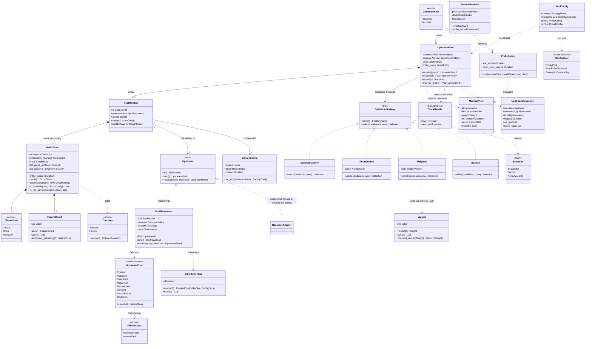

# Phase 3 — `Upstream` port, Do53 forwarding, and the upstream pool (`styx-resolution`)

> **Project**: `styx` — a filtering DNS resolver written from scratch in Rust, replacing
> Pi-hole's role on a home network: recursive/forwarding resolution, per-client blocking
> policy, and a Leptos admin UI. Single process, single binary; DNS listeners, Leptos SSR
> and background workers share state via `Arc`.
>
> **Codebase state at authoring time**: greenfield, no existing implementation. No git
> history, no Cargo workspace, no Rust source. Everything below is grounded in the
> project's recorded design decisions, which are inlined here in full — the documents they
> came from are being retired, so this file is the surviving record.
>
> **Depends on**: Phase 0 — Foundation and gates · Phase 1 — Wire codec (`styx-proto`) ·
> Phase 2 — Server loop and test harness. **Depended on by**: Phase 4 — Answer cache ·
> Phase 5 — Recursion (`styx-recursion`) · Phase 6 — DNSSEC (`styx-dnssec`) · Phase 11 —
> Web UI (`styx-web`) · Phase 12 — Cutover hardening.

---

## Requirements

Implement the terminal stage of the resolution pipeline: a single `Upstream` port that
both forwarders and recursors satisfy, a Do53 forwarder over UDP with TCP fallback, a pool
that owns each member's health and selects among members under one of four configurable
strategies, and a probe policy that fires only where passive health is structurally blind.

- **Establish `Upstream` as the unifying abstraction.** An upstream is *either* a
  forwarder or a recursor. A pool holds upstreams of mixed kinds, each with its own health
  and behaviour config.
  **Recursion is an implementation of the same port, not a separate server mode.** This is
  the load-bearing commitment of the phase: it is why Phase 5's recursor plugs in without
  reshaping the request pipeline, and why "recursor first, public forwarder as standby" is
  an ordinary pool configuration rather than a special case in the server.
- **Keep the port narrow.** The DNSSEC design deliberately routes chain material through a
  separate `ChainSource` port — recursion *pushes* material it already collected during
  descent (DS RRsets arrive unasked in DO=1 referrals, per RFC 4035 §3.1.4) while
  forwarder paths *pull* DS/DNSKEY on demand — **specifically to avoid widening `Upstream`
  with a "chain material observed en route" field that would be permanently empty for
  forwarders.** Phase 3 owns the port's shape and therefore owns honouring that.
- **Make health a derived property, not a subsystem.** There is **no health-check trait.**
  The pool owns a concrete `HealthState` per member — SRTT EWMA, consecutive failures,
  circuit state, last-probe-at — fed by the outcomes of real traffic the pool already
  observes. A trait here would abstract over data the pool already holds and create a
  second source of truth that, by definition, sees different traffic than the resolver
  does.
- **Make probing be resolution.** Probing is `Upstream::resolve(canary)` with per-kind
  config defaults: a forwarder's canary is one query,
  **a recursor's canary is a full descent, which is the correct test.** A cheap liveness
  ping on a recursor passes while the thing that matters — root reachability, delegation
  handling, the answer path — is broken.
- **Probe only where passive health cannot see.** Probes run against any member
  **idle beyond a window** — the ordered-failover standby case, because
  **passive health is structurally blind to an upstream receiving zero traffic** — and
  against any member **currently marked down**, to decide when to restore it.
  **Healthy, actively-used upstreams generate no probe traffic**, because their real
  traffic already answers the question, and because every probe is a query a third party
  sees.
- **Ship all four selection strategies**: ordered failover, round-robin, race, weighted —
  behind a `SelectionStrategy` port, chosen per pool in config.
- **Treat `race` as a privacy decision, not a load-balancing mode.** One query goes to N
  providers, so outbound QPS multiplies and every provider in the pool sees every domain;
  in a mixed pool containing the recursor the privacy posture changes
  **per query, non-deterministically**. It ships, faithfully, and it carries a loud
  warning where a human chooses it.
- **Keep selection health and recursion diagnostics permanently distinct.** Per-kind
  diagnostics travel a separate path: `styx-recursion` publishes root/TLD reachability as
  its own read model consumed directly by the admin/web layer, **never through the pool**,
  named distinctly (`RecursionDiagnostics` vs `HealthState`)
  **so the two are never conflated**. Nothing in this phase may grow a diagnostics surface
  that Phase 5 would be tempted to fill.

**Boundary.** In scope: the port, the Do53 forwarder, `HealthState`, the pool, four
strategies, the probe policy, and socket-level proof of all of it. Out of scope: the
answer cache (Phase 4), recursion (Phase 5), DNSSEC (Phase 6), encrypted *inbound*
transports (Phase 7), filtering (Phase 8), any database (Phase 9), the query-log pipeline
(Phase 10), the UI (Phase 11).

---

## Entities



### Entity notes

- `HealthState` is a **concrete struct owned by `PoolMember`**, never a trait, never
  shared with anything outside the pool. It is the pool's private fold over dispatch
  outcomes.
- `MemberView` is the **only** thing selection strategies see. Strategies are pure
  functions over a read-only projection plus the current time; they never touch an
  `Upstream` and never mutate health.
- `RecursorAdapter` is shown for orientation only. It is **Phase 5's** work and lives in
  the `styx` binary crate (see Structure); nothing in Phase 3 implements it.
- Nothing here is a `RecursionDiagnostics`. That is a separate read model with a
  deliberately distinct name, published by `styx-recursion` straight to the admin/web
  layer, never through the pool.
- `UpstreamResponse` carries `answered_by` and `raced_count` because the query-log
  pipeline (Phase 10) and the UI (Phase 11) need per-query attribution, and because
  `race`'s fan-out is invisible — and therefore untestable and unwarnable — without it.
  It carries `kind` so that the Phase 4 cache stage can report
  `AnswerSource::Upstream` for a forwarder's answer and `AnswerSource::Recursion` for a
  recursor's, without asking the pool a second question.
- `Weight`, `FailureCount` and `EdnsBufferSize` are newtypes rather than a bare `u32` or
  `u16` because each carries a checked-arithmetic operation or a validated range — the
  same test `CLAUDE.md` states and Phase 1's `Ttl` sets the precedent for. `raced_count`
  stays a plain `u8`: it is a count with no independent rule of its own, not a value this
  test reaches.

---

## Approach

### 1. Port design — one abstraction, deliberately narrow

- `Upstream` is an async trait with three members: identity, kind, and `resolve`. It takes
  a question plus a deadline and returns either a response message or a classified
  `UpstreamError`. Nothing else.
- **No recursion-shaped affordances.** No chain-material field, no diagnostics channel, no
  descent hooks. The reasoning is recorded and binding: such a field would be permanently
  empty for every forwarder, which is exactly why DNSSEC gets its own `ChainSource` port
  with push (recursion) and pull (forwarder) feeding strategies instead of a wider
  `Upstream`.
- `UpstreamKind` exists for two reasons: per-kind config defaults, principally the
  canary, can differ; and the answer's provenance is stamped on `UpstreamResponse`. It is
  **not** a dispatch switch in the request pipeline. Nothing branches on it to decide
  *how* to resolve; the cache stage only maps it to an `AnswerSource` for reporting.
- Trait objects (`Arc<dyn Upstream>`) rather than generics, because a pool holds members
  of mixed kinds at runtime from file config.

### 2. Health — a fold, not a subsystem

- The pool already observes the outcome of every dispatch, so recording is a call on the
  way back: `Outcome` → `HealthState::observe(outcome, now, config)`.
- `HealthState` holds exactly the four decided fields:
  **SRTT EWMA, consecutive failures, circuit state, last-probe-at** (plus last-outcome-at,
  which the idle-window rule requires in order to be evaluable at all).
- **Failure classification is a correctness concern, not a detail.** A timeout, a
  transport error, a truncation that also fails over TCP, a malformed response and a
  response that does not match the query are `UpstreamFault` — the upstream is broken. A
  well-formed NXDOMAIN, NODATA, or a SERVFAIL that is the upstream correctly reporting a
  broken *name* is `AnswerFault` — it is an answer, and it must not fail out a healthy
  provider because one domain is bad. REFUSED is treated as `UpstreamFault` (the upstream
  is declining to serve us). This mapping is asserted by test, because conflating the two
  is how a working pool empties itself.
- Circuit: `Closed` → `Open` on N consecutive `UpstreamFault` outcomes; `Open` →
  `HalfOpen` after a cooldown read from the injected clock; `HalfOpen` → `Closed` on a
  success, back to `Open` on a failure. A down member is re-admitted **on evidence**, and
  half-open is the cheapest correct way to gather it.
- All arithmetic — EWMA update, failure counting, cooldown comparison — is checked,
  because `arithmetic_side_effects` is denied workspace-wide.

### 3. Selection — pure functions over a read-only projection

- `SelectionStrategy::select` takes `&[MemberView]` and `now` and returns a `Selection`.
  It is synchronous, pure, and does no I/O. This makes all four strategies unit-testable
  without a socket, while the exit criteria are still proven end to end over real sockets.
- `Selection::Sequential(Vec<UpstreamId>)` covers ordered failover (config order, filtered
  to available), round-robin (rotated), and weighted (a weighted draw, with the remainder
  as fallback order). `Selection::Fanout(Vec<UpstreamId>)` is `race` alone.
  `Selection::NoneAvailable` is explicit rather than an empty vector, so the pool's
  "everything is down" path cannot be reached by accident.
- Availability filtering (`circuit != Open`, or `Open` past cooldown → half-open trial)
  happens in the projection, not in each strategy. Four strategies must not each re-derive
  the circuit rule.
- **`race` is implemented faithfully and instrumented honestly**: fan out to all available
  members, take the first *usable* response, record outcomes for every branch that
  completed, cancel the rest, and report `raced_count` on the response. Losing responses
  are genuine observations and do feed health — discarding them would make health under
  `race` worse than under any other strategy while generating the most traffic.

### 4. Probe policy — traffic only where there is none

- A background `ProbeScheduler` task wakes on a tick from the injected clock, asks the
  pool which members are due, and issues `Upstream::resolve(canary)` through
  **the same path a real query takes**, so a probe proves what a real query would do.
- Due means: **idle beyond the configured window**, or
  **circuit `Open` past its cooldown**. A healthy member that answered a real query within
  the window is never due. This is asserted as a *negative* test — counting probe queries
  at a busy healthy fake and requiring zero — because the policy's entire point is the
  traffic it does not generate.
- Cold start: a member with no outcome and no probe recorded is treated as idle beyond the
  window, so the pool learns each member's state once at boot rather than waiting for a
  failure to teach it. Availability at cold start is optimistic (unknown is not down), so
  a fresh pool serves traffic immediately.
- Probe outcomes write to the same `HealthState` as real outcomes, through the same
  `observe` call. There is only one health path.

### 5. Transport — Do53, UDP first, TCP on truncation

- UDP send/receive against the configured socket address with an EDNS(0) OPT advertising
  the configured buffer size, decoded through `styx-proto`.
- A response with TC=1 is **not an answer**: retry the same question over TCP. The latency
  sample for health is the whole operation; a truncation that then succeeds over TCP is a
  success with a `via_tcp` marker, not a failure.
- Response validation before anything else: transaction ID match and question-section
  match, or the response is `Mismatched` and discarded. This is spoofing resistance, not
  tidiness.
- Deadlines come from the injected clock, not from real timers, so tests can drive them.
- All socket work is async; `no-sync-io` is a denied lint and would catch a blocking call
  anyway.

### 6. Failure and error strategy

- One `thiserror` enum, `UpstreamError`, covering the forwarder's failure modes and
  carrying enough structure for `classify()` to return a `FailureClass`. No stringly-typed
  errors, no `anyhow` on library paths.
- `Result<T, UpstreamError>` throughout. `unwrap`/`expect` are denied outside tests by the
  workspace lint configuration, so every fallible step is an explicit match or `?`.
- Pool-level exhaustion (`Selection::NoneAvailable`, or every member in a sequential list
  failing) returns a definite error that the request pipeline renders as SERVFAIL. It
  never hangs and never panics — **`panic = "deny"` is load-bearing**, because in a single
  process a panic takes DNS down for the whole house, and the `catch_unwind` boundary that
  really mitigates it does not arrive until Phase 12.
- `tracing` spans on dispatch and on probe, with the member id, the strategy, the outcome
  class and the elapsed time. `require-tracing` is enforced by arch-lint.

### 7. Testing strategy

- **Socket level by default.** Feature tests drive real UDP/TCP against an ephemeral-port
  server with in-process fake upstreams and an injectable `Clock`. The clock is injected
  rather than mocked at call sites because it cannot be retrofitted — and because circuit
  open/close is defined in terms of elapsed time that a test must be able to jump.
- **`hickory-proto` is the test oracle and a `[dev-dependencies]` entry only.** The fake
  upstreams encode DNS wire format; if styx's own codec encoded them, the resolver and its
  oracle would share every bug and a green suite would prove only self-consistency. A CI
  check asserts `hickory-proto` appears in **no normal or build dependency path**. This
  phase is where that pressure is highest, since the fakes are the natural leak.
- Fake upstreams must be *commandable*: answer, delay, time out, truncate, return
  SERVFAIL/REFUSED, return a mismatched ID, go away, come back — and must count the
  queries they received, which is how `race` fan-out and probe silence are asserted.

---

## Structure

### Crate and module layout

The project rule is **one crate per feature, with `domain` / `application` /
`infrastructure` as modules inside it**. Cargo enforces feature-to-feature isolation;
arch-lint enforces layering *within* a crate. This phase adds to `styx-resolution`:

```text
styx-resolution/
  src/
    domain/
      upstream.rs        # Upstream trait, UpstreamId, UpstreamKind, UpstreamResponse
      error.rs           # UpstreamError (thiserror), FailureClass
      health.rs          # HealthState, Outcome — the fold, split from the state machine
      circuit.rs         # CircuitState, CircuitConfig, FailureCount — the circuit breaker
      selection.rs       # SelectionStrategy trait, Selection, MemberView, StrategyName
      probe.rs           # ProbePolicy, CanaryConfig, ProbeConfig
      config.rs          # PoolConfig, UpstreamConfig, Timeouts, ConfigError
      weight.rs          # Weight — its own file: shared by config and the weighted strategy
      edns.rs            # EdnsBufferSize — its own file: shared by config and Do53Forwarder
    application/
      pool.rs            # UpstreamPool: dispatch, outcome recording, snapshot
      strategies/        # OrderedFailover, RoundRobin, Weighted, RaceAll
      probe_scheduler.rs # ProbeScheduler background task
    infrastructure/
      do53.rs            # Do53Forwarder: UDP + TCP fallback
      udp.rs / tcp.rs    # transport details
```

`health.rs`/`circuit.rs` and `config.rs`/`weight.rs`/`edns.rs` are each split by concept
rather than left as a catch-all, the same reasoning that splits `styx-proto`'s
`domain/rdata/basic.rs` from `domain/rdata/dnssec.rs`: the fold (`HealthState`) is a
different concept from the state machine it drives (`CircuitState`), and `Weight` and
`EdnsBufferSize` are independent validated values that outlive their use inside
`PoolConfig`, not properties of the config type itself. This also keeps every file inside
`xtask module-size`'s 400-counted-line cap, which counts inline test modules.

### Trait / implementation relationships

1. `Upstream` is a trait in `domain::upstream` defining the one resolution contract that
   forwarders and recursors both satisfy.
2. `Do53Forwarder` in `infrastructure::do53` implements `Upstream`.
3. `SelectionStrategy` is a trait in `domain::selection`; `OrderedFailover`, `RoundRobin`,
   `Weighted` and `RaceAll` in `application::strategies` each implement it.
4. `UpstreamError` is a `thiserror` enum implementing `std::error::Error`;
   `require-thiserror` is an enforced lint.
5. `HealthState` and `CircuitState` are plain `domain` types with no trait at all —
   **there is no `HealthCheck` trait, by decision.**
6. **Phase 5's recursor** implements `Upstream` from *outside* this crate. Because
   **feature crates never depend on each other**, `styx-recursion` does not depend on
   `styx-resolution`: the binary crate `styx` holds the adapter that wraps the recursor in
   `styx-resolution`'s port — the same wiring pattern by which `styx-resolution` declares
   a `FilterPolicy` port and `styx` wires `styx-filtering` into it.

### Dependencies

1. `application::pool` depends on
   `domain::{upstream, health, circuit, selection, probe, error}`. It never names
   `infrastructure`.
2. `application::probe_scheduler` depends on `application::pool`, `domain::probe` and the
   injected `Clock`.
3. `application::strategies::weighted` additionally depends on `domain::weight`, for
   `Weight::checked_sum`.
4. `infrastructure::do53` depends on `domain::{upstream, error, config, edns}` and on
   **`styx-proto`** for encode/decode.
5. `styx-proto` is **shared foundation, not a feature crate** — every crate parses through
   the wire codec, so the "feature crates never depend on each other" rule explicitly does
   not reach it. It is the one recorded exception, and the layering config must be written
   so as not to forbid it.
6. The injected `Clock` comes from Phase 2. Every timestamp in this phase reads it: SRTT
   sample times, circuit transitions, last-probe-at, idle-window evaluation, query
   deadlines.
7. **Nothing in this phase touches the database.** The hot path touches no storage I/O; a
   DB outage degrades logging and admin, never resolution.
8. `hickory-proto` appears **only** under `[dev-dependencies]`, in the fake upstreams and
   fixtures.

### Layering

1. **`domain`** — the ports (`Upstream`, `SelectionStrategy`), the state (`HealthState`,
   `CircuitState`), the policy (`ProbePolicy`), the errors, the config types, the
   `Weight`/`EdnsBufferSize` newtypes. Pure, deterministic, no I/O, no sockets, no clock
   reads of its own (it receives `now` as a parameter). No synchronous or asynchronous I/O
   of any kind — a `[[restrict-use]]` rule denies `std::fs`, the blocking socket types and
   `std::io::{Read, Write, BufRead, Seek}` here even though nothing in this layer is async.
2. **`application`** — the pool and the probe scheduler. Orchestrates: selects,
   dispatches, records, schedules. Holds `Arc<dyn Upstream>` and
   `Arc<dyn SelectionStrategy>`; speaks no wire format. All dispatch to a real upstream
   goes through the `Upstream` port's `async fn resolve`, never a raw socket call, so the
   same `[[restrict-use]]` sync-I/O denial applies here without narrowing what this layer
   can already do.
3. **`infrastructure`** — the Do53 forwarder and its transports. Speaks UDP/TCP and
   `styx-proto`; knows nothing of pools, strategies or health.
4. **Pipeline position** — the order fixed in Phase 2 is a correctness property, not a
   detail: **local records → filter → cache → upstream.** This phase supplies the last
   stage only. Local records and blocks are both forged answers; both clear AD, forge no
   signature, and never enter the answer cache — none of which is this phase's concern,
   but the pool must never be reachable ahead of them.
5. **Configuration boundary** — upstreams, pools and selection strategy are owned by the
   **TOML file**, never the database. The file owns everything needed before the DB exists
   or in order to reach it; the DB owns everything a human edits at runtime. No overlap
   means no precedence rule, and it guarantees a dead DB cannot touch resolution.
   **Accepted consequence, recorded as such: changing an upstream requires SSH and a
   restart — which is the thing people most want to do from the UI.** Therefore this phase
   implements **no hot reload** of pool configuration and must not grow one.

---

## Operations

Ordered by dependency. Each task is independently completable and independently testable.

### 1. Define the `Upstream` port — `domain::upstream`

1. **Responsibility**: the single resolution contract satisfied by both forwarders and
   recursors.
2. **Types**:
   - `UpstreamId` — an opaque, cheap-to-clone identifier, stable across the process
     lifetime, derived from config order and name.
   - `UpstreamKind` — `Forwarder | Recursor`. Used for per-kind config defaults and for
     provenance on `UpstreamResponse`, never for dispatch.
   - `UpstreamResponse` —
     `{ message, answered_by: UpstreamId, kind: UpstreamKind, elapsed: Duration, via_tcp: bool, raced_count: u8 }`.
     Like `answered_by`, `kind` is stamped by the pool from the member that answered
     (Operation 6), never chosen by the adapter, so no implementation can mislabel its
     own answers.
3. **Trait**: `Upstream` (async, object-safe via `Arc<dyn Upstream + Send + Sync>`)
   - `fn id(&self) -> UpstreamId`
   - `fn kind(&self) -> UpstreamKind`
   - `async fn resolve(&self, query: &Question, deadline: Instant) -> Result<UpstreamResponse, UpstreamError>`
4. **Constraints**:
   - **No fourth method.** No chain-material accessor, no diagnostics accessor, no descent
     hook. Adding one is the failure mode this design exists to prevent.
   - `deadline` is an `Instant` obtained from the injected clock by the caller, never
     computed from real time inside the implementation.

### 2. Define `UpstreamError` and `FailureClass` — `domain::error`

1. **Responsibility**: one classified error type for every way an upstream can fail to
   produce an answer.
2. **Variants** (`thiserror`): `Timeout`, `Transport(io kind)`, `Truncated` (TC=1 and the
   TCP retry also failed), `Malformed` (decode failed), `Mismatched` (ID or question
   mismatch), `Refused`, `ServerFailure`, `Shutdown`.
3. **Method**: `fn classify(&self) -> FailureClass`
   - `UpstreamFault` for `Timeout`, `Transport`, `Truncated`, `Malformed`, `Mismatched`,
     `Refused`, and `ServerFailure` originating from the upstream itself.
   - `AnswerFault` for outcomes that are the upstream correctly reporting something about
     the *name*.
4. **Constraints**: the classification table is asserted by an explicit unit test with one
   case per variant. Misclassifying `AnswerFault` as `UpstreamFault` empties a healthy
   pool on one bad domain.

### 3. Implement `HealthState` and its circuit breaker — `domain::health`, `domain::circuit`

1. **Responsibility**: the pool's private fold over dispatch outcomes. Concrete, never a
   trait. `HealthState` and `Outcome` live in `domain::health`; the state machine they
   drive — `CircuitState`, `CircuitConfig`, `FailureCount` — lives in `domain::circuit`,
   split out because it is a distinct concept (the breaker) from the fold that reports to
   it, and because the two together are the phase's most line-heavy domain type.
2. **Fields**: `srtt: Option<Duration>`, `consecutive_failures: FailureCount`,
   `circuit: CircuitState`, `last_probe_at: Option<Instant>`,
   `last_outcome_at: Option<Instant>` — all private. The struct is mutated only through
   `observe` and read only through the accessors below; nothing outside `domain::health`
   sees a raw field.
3. **Types**: `Outcome` =
   `Success { latency: Duration, was_probe: bool } | Failure { class: FailureClass, was_probe: bool }`;
   `CircuitState` =
   `Closed | Open { since: Instant } | HalfOpen { trial_started: Instant }`;
   `CircuitConfig` =
   `{ failure_threshold: u32, open_cooldown: Duration, half_open_successes: u32 }`;
   `FailureCount` — a newtype over `u32` with `fn zero() -> FailureCount`,
   `fn value(&self) -> u32` and `fn increment_saturating(self) -> FailureCount` (never
   wraps past `u32::MAX` back to zero). Same checked-arithmetic pattern `styx-proto`'s
   `Ttl` sets for `checked_decrement`/`saturating_decrement`, applied to counting up
   instead of down; no setter reopens it, only `zero()` and `increment_saturating()`
   produce a new value.
4. **Methods**:
   - `fn observe(&mut self, outcome: Outcome, now: Instant, config: &CircuitConfig)` is a
     guard-clause dispatcher, not the place the branching logic lives: it updates
     `last_outcome_at` and `last_probe_at`, then matches `outcome` and delegates each arm
     to a named private helper so no single function carries the whole state machine.
     - `fn record_success(&mut self, latency: Duration, config: &CircuitConfig)` — folds
       the latency into the SRTT EWMA (first sample seeds it); resets
       `consecutive_failures` to `FailureCount::zero()`; if `HalfOpen` and the configured
       success count is reached, transitions to `Closed`.
     - `fn record_answer_fault(&mut self, latency: Option<Duration>)` — records the
       latency if present; leaves the failure counter and circuit untouched, because this
       is an answer, not a fault.
     - `fn record_upstream_fault(&mut self, now: Instant, config: &CircuitConfig)` —
       replaces `consecutive_failures` with `consecutive_failures.increment_saturating()`;
       if `Closed` and the threshold is met, transitions to `Open { since: now }`; if
       `HalfOpen`, transitions straight back to `Open { since: now }`.
   - `fn is_available(&self, now: Instant, config: &CircuitConfig) -> bool` — `Closed` and
     `HalfOpen` are available; `Open` is available only once
     `now - since >= open_cooldown`, which is also the trigger for a half-open trial.
   - `fn is_idle_beyond(&self, window: Duration, now: Instant) -> bool` — true when
     neither a real outcome nor a probe has been recorded within the window,
     **and true when nothing has ever been recorded** (cold start).
   - `fn srtt(&self) -> Option<Duration>` and `fn circuit(&self) -> CircuitState` — the only
     read accessors on the type, used by the pool to project `srtt`/`circuit` into a
     `MemberView` without exposing the private fields themselves.
5. **Constraints**: every duration comparison is checked/saturating, and every
   failure-count update goes through `FailureCount::increment_saturating` rather than a
   raw `+= 1` at the call site — `arithmetic_side_effects` is denied. No `Instant::now()`
   anywhere; `now` is always a parameter. The three-way split of `observe` into
   `record_success`/`record_answer_fault`/`record_upstream_fault` is required, not
   optional: it is what keeps `observe` itself under clippy's `too_many_lines` and
   `excessive_nesting` thresholds (Phase 0 Norm 17) once the circuit transitions are
   written out in full.

### 4. Define the `SelectionStrategy` port and `MemberView` — `domain::selection`

1. **Responsibility**: the per-pool choice of which member(s) answer a query, as a pure
   function.
2. **Types**:
   - `MemberView` — `{ id, kind, weight, srtt, circuit, available }`. A read-only
     projection; strategies see nothing else.
   - `Selection` —
     `Sequential(Vec<UpstreamId>) | Fanout(Vec<UpstreamId>) | NoneAvailable`.
   - `StrategyName` — `OrderedFailover | RoundRobin | Race | Weighted`, parsed from the
     TOML `strategy` key.
3. **Trait**: `SelectionStrategy: Send + Sync`
   - `fn name(&self) -> StrategyName`
   - `fn select(&self, candidates: &[MemberView], now: Instant) -> Selection`
4. **Constraints**: synchronous, no I/O, no health mutation, no `Arc<dyn Upstream>`
   access. Availability filtering is applied by the pool when building the projection, so
   no strategy re-derives the circuit rule.

### 5. Implement the four strategies — `application::strategies`

1. **`OrderedFailover`**: returns `Sequential` of available members
   **in configured order**. The standby case: the second member may see zero traffic for
   weeks, which is exactly the blind spot the probe policy exists to cover.
2. **`RoundRobin`**: an `AtomicUsize` cursor advanced once per selection, returning
   `Sequential` rotated to start at the cursor so that the remainder is the fallback
   order. Correct under concurrency: the cursor is the only shared mutable state and is
   advanced with a relaxed fetch-add.
3. **`Weighted`**: a weighted draw over available members by `Weight`, returning
   `Sequential` with the drawn member first and the rest as fallback. The pool total is
   computed once via `Weight::checked_sum`, never a raw running `+=` at the call site,
   since `arithmetic_side_effects` is denied. Degenerate configurations are defined, not
   undefined: total weight of zero degrades to round-robin order; a single available
   member returns it; equal weights are uniform. No division by a possibly-zero total.
4. **`RaceAll`**: returns `Fanout` of **all** available members. Documented at the
   definition site as a privacy decision: it multiplies outbound QPS and shows every
   domain to every provider in the pool.
5. **Constraints**: each strategy is unit-tested as a pure function *and* proven at socket
   level per the exit criteria. Every strategy returns `NoneAvailable` when the candidate
   list has no available member — never an empty `Sequential`.

### 6. Implement `UpstreamPool` — `application::pool`

1. **Responsibility**: own the members and their health; select, dispatch, record, and
   expose a read-only snapshot. **Sole owner and sole writer of `HealthState`.**
2. **Fields**: `members: Vec<PoolMember>`, `strategy: Arc<dyn SelectionStrategy>`,
   `clock: ClockHandle`, `circuit: CircuitConfig`, `probe_policy: ProbePolicy`.
3. **Methods**:
   - `async fn resolve(&self, query: &Question) -> Result<UpstreamResponse, PoolError>` is
     a short dispatcher, not the place the per-strategy logic lives: read `now` from the
     clock, build `Vec<MemberView>`, call `strategy.select(&views, now)`, then a guard
     clause per `Selection` variant hands off to a named helper.
     - `NoneAvailable` → return `PoolError::AllUpstreamsDown` immediately. Never hang,
       never panic.
     - `Sequential(ids)` → `async fn try_sequential(&self, ids: &[UpstreamId], query: &Question) -> Result<UpstreamResponse, PoolError>`
       tries each id in order with a per-attempt deadline, records each attempt's
       outcome, returns the first success, and returns `PoolError::Exhausted` carrying
       the last error if every id fails.
     - `Fanout(ids)` → `async fn try_fanout(&self, ids: &[UpstreamId], query: &Question) -> Result<UpstreamResponse, PoolError>`
       dispatches concurrently, takes the first usable response, records outcomes for
       **every** branch that completed, cancels the remainder, and sets `raced_count` on
       the response.
     - Both helpers stamp `answered_by`, `kind` (from the answering member's `kind()`)
       and `elapsed`; `resolve` itself stamps none of them.
   - `fn record(&self, id: UpstreamId, outcome: Outcome)` — look up the member, take its
     health lock, call `observe` with the clock's `now` and the circuit config. The
     **only** mutation path for health, shared by real traffic and probes alike.
   - `fn snapshot(&self) -> Vec<MemberView>` — read-only projection for the probe
     scheduler and, later, the UI.
   - `fn due_for_probe(&self) -> Vec<UpstreamId>` — apply `ProbePolicy` to each member.
4. **Constraints**:
   - No database access, no filesystem access, no config reload.
   - Health is behind a per-member lock (or equivalent), held only for the duration of an
     `observe` or a projection read — never across an `await`.
   - No surface named or shaped like diagnostics. Root/TLD reachability belongs to
     `RecursionDiagnostics`, published separately by `styx-recursion` and consumed
     directly by the admin/web layer, never through this pool.
   - The `try_sequential`/`try_fanout` split is required, not optional: it is what keeps
     `resolve` itself, and each helper, under clippy's `too_many_lines` and
     `excessive_nesting` thresholds (Phase 0 Norm 17) — `Sequential`'s per-attempt loop
     and `Fanout`'s concurrent-dispatch-and-cancel logic are each a full nesting budget
     on their own.

### 7. Implement `ProbePolicy` and `CanaryConfig` — `domain::probe`

1. **Responsibility**: decide, as a pure function, which members need a probe.
2. **Fields**:
   `ProbeConfig { idle_window: Duration, down_retry_interval: Duration, tick: Duration }`.
3. **Method**:
   `fn due(&self, view: &MemberView, health: &HealthState, now: Instant) -> bool`
   - `true` when the member is **idle beyond `idle_window`** (including the never-observed
     cold-start case).
   - `true` when the member's circuit is **`Open`** and
     `now - last_probe_at >= down_retry_interval`.
   - **`false` otherwise — unconditionally.** A healthy member with recent real traffic is
     never due.
4. **`CanaryConfig`**: `{ qname, qtype, timeout }`, with
   `fn for_kind(kind: UpstreamKind) -> CanaryConfig` supplying per-kind defaults and
   per-member config overriding them. The forwarder default is a single query; the
   recursor default is a name whose resolution requires a **full descent**, because that
   is the correct test of a recursor.
5. **Constraints**: the canary must not be satisfiable from any cache, or it proves
   nothing. It is issued through `Upstream::resolve` like any other query.

### 8. Implement `ProbeScheduler` — `application::probe_scheduler`

1. **Responsibility**: a long-lived background task that manufactures health observations
   only where real traffic cannot.
2. **Methods**:
   - `async fn run(self, shutdown: ShutdownSignal)` — loop: sleep one tick on the injected
     clock, call `pool.due_for_probe()`, spawn a bounded set of `probe_once` calls, repeat
     until shutdown.
   - `async fn probe_once(&self, id: UpstreamId)` — resolve that member's canary through
     `Upstream::resolve`, then `pool.record(id, outcome_with_was_probe_true)`.
3. **Constraints**:
   - Concurrency is bounded; a slow recursor descent must not let probes pile up.
   - A probe already in flight for a member is not duplicated.
   - **The task must not be able to die silently or take the process with it.**
     `panic = "deny"` is the only guard until Phase 12's `catch_unwind` boundary and
     supervised task model arrive, so every path here is a `Result` and errors are logged,
     not propagated into a task abort.
   - A probe and a real query may complete concurrently for the same member; both call
     `record` and the last write wins on SRTT, while the failure counter and circuit
     remain monotonic per observation.

### 9. Implement `Do53Forwarder` — `infrastructure::do53`

1. **Responsibility**: the first concrete `Upstream` — classic DNS over UDP with TCP
   fallback.
2. **Fields**:
   `{ id, addr: SocketAddr, edns_buffer: EdnsBufferSize, udp_timeout, tcp_timeout, clock }`.
3. **`resolve` logic** — `resolve` itself is a short sequence of guard clauses over named
   private helpers, none of which is `resolve` re-implementing the others:
   - `fn encode_query(&self, query: &Question) -> Result<Vec<u8>, UpstreamError>` — a fresh
     transaction ID and an EDNS(0) OPT advertising `edns_buffer.octets()`, through
     `styx-proto`.
   - `async fn send_udp(&self, bytes: &[u8], deadline: Instant) -> Result<Vec<u8>, UpstreamError>`
     — send over UDP, await a response until the earlier of `deadline` and the UDP
     timeout. On expiry → `UpstreamError::Timeout`.
   - `fn validate_and_decode(&self, raw: &[u8], query: &Question) -> Result<Message, UpstreamError>`
     — transaction ID match **and** question-section match, or `UpstreamError::Mismatched`
     (spoofing resistance), then decode through `styx-proto`; a decode failure is
     `UpstreamError::Malformed`.
   - `async fn retry_tcp(&self, query: &Question, deadline: Instant) -> Result<Message, UpstreamError>`
     — used only when the UDP response has TC=1, which is not an answer. Success sets
     `via_tcp = true` and the latency sample covers the whole operation; failure is
     `UpstreamError::Truncated`.
   - `fn map_response(message: Message) -> Result<UpstreamResponse, UpstreamError>` — REFUSED
     → `Refused`; SERVFAIL → `ServerFailure`; NOERROR/NXDOMAIN → success with the message
     returned as-is.
   - `resolve` itself calls these in sequence, retrying over TCP only on TC=1, and never
     duplicates a step's logic inline.
4. **Constraints**: async only (`no-sync-io` is denied); no `unwrap`/`expect`; all buffer
   handling checked (`indexing_slicing` is denied); every timestamp from the injected
   clock. The helper split above is required, not optional: it keeps `resolve` and every
   step under clippy's `too_many_lines` threshold (Phase 0 Norm 17) once UDP send, TCP
   retry and validation are each written out in full.

### 10. Wire configuration — `domain::config`, `domain::weight`, `domain::edns`

1. **Responsibility**: the file-owned, restart-scoped description of pools and upstreams.
   `PoolConfig`, `UpstreamConfig` and `ConfigError` live in `domain::config`; `Weight` and
   `EdnsBufferSize` each get their own file, `domain::weight` and `domain::edns`, because
   both outlive their use inside `UpstreamConfig` — `Weight` is also read by
   `application::strategies::Weighted` and `EdnsBufferSize` by `Do53Forwarder` — and
   because bundling two unrelated validated newtypes into the config file is exactly the
   catch-all shape `CLAUDE.md`'s "small, single-purpose modules" rule exists to split.
2. **Types**:
   - `PoolConfig { strategy: StrategyName, members: Vec<UpstreamConfig>, probe: ProbeConfig, circuit: CircuitConfig }`.
   - `UpstreamConfig { name, kind, addr, weight: Weight, canary: Option<CanaryConfig>, timeouts }`.
   - `Weight` (`domain::weight`) — a newtype over `u32`. Constructor
     `fn new(value: u32) -> Weight` accepts every value, including zero — the all-zero
     pool case is a `Weighted`-strategy concern (Operation 5), not a construction-time
     rejection. Accessor `fn value(&self) -> u32`; no setter. Its domain rule is the
     checked arithmetic it carries, not a validated range:
     `fn checked_sum(weights: &[Weight]) -> Option<Weight>` is the one audited place a
     pool total is computed, so no call site performs a raw `+=` that
     `arithmetic_side_effects` would deny.
   - `EdnsBufferSize` (`domain::edns`) — a newtype over `u16`. Constructor
     `fn new(octets: u16) -> Result<EdnsBufferSize, ConfigError>` rejects anything below
     512 octets, the pre-EDNS message ceiling — advertising less helps nothing and is
     almost certainly a misconfiguration. Accessor `fn octets(&self) -> u16`; no setter.
     This is the value `Do53Forwarder` writes into the EDNS(0) OPT record (Operation 9).
   - `ConfigError` (`thiserror`, `domain::config`): `EmptyPool`, `EdnsBufferTooSmall(u16)`,
     `CanaryNotDescending`. Returned by config parsing; no `anyhow`, no stringly-typed
     validation failure.
3. **Constraints**:
   - Parsed from TOML at boot into `Result<PoolConfig, ConfigError>`. **No hot reload** —
     the configuration boundary is deliberate: the file owns infrastructure, the database
     owns policy, and the accepted consequence is that changing an upstream needs SSH and
     a restart.
   - A `strategy = "race"` value emits a `tracing` warning at boot naming the privacy
     consequence explicitly, and the parsed config records the fact so Phase 11 can render
     the same warning in the UI.
   - Validation at parse, each a distinct `ConfigError` variant: at least one member
     (`EmptyPool`); every `edns_buffer` at or above the 512-octet floor
     (`EdnsBufferTooSmall`); a recursor member's canary must be a descent-requiring name
     (`CanaryNotDescending`). Weights are accepted for every strategy and are simply
     unused outside `weighted` — that is not a validation failure.

### 11. Build the fake upstreams and the socket-level suite — `tests/`

1. **Responsibility**: prove the exit criteria over real sockets.
2. **Fakes** (built on `hickory-proto`, `[dev-dependencies]` only): a commandable
   in-process upstream on an ephemeral port that can answer, delay by a scripted duration,
   time out, return TC=1, return SERVFAIL/REFUSED, return a mismatched transaction ID,
   stop accepting, resume — and that **counts every query it receives**.
3. **Tests**:
   - Ordered failover: primary fails, secondary answers; primary recovers, traffic
     returns; **and the standby-probe case** — the secondary receives zero real traffic
     and is nonetheless probed after the idle window.
   - Round-robin: distribution over N sequential queries, **and** fairness under
     concurrent dispatch.
   - Weighted: distribution within a stated tolerance; the degenerate cases (single
     member, all-equal weights, zero total weight).
   - Race: the answer is the fastest usable one,
     **and the fan-out count at the fakes equals the available member count** — asserting
     the query count, not just the returned answer, because the fan-out *is* the hazard.
   - Circuit open: N consecutive upstream faults open it and the member stops being
     selected.
   - Circuit close: advancing the injected clock past the cooldown produces a half-open
     trial, a success closes it, a failure re-opens it.
   - **Probe silence (negative test)**: a busy, healthy member receives **zero** probe
     queries.
   - TCP fallback: TC=1 over UDP is retried over TCP and answered.
   - Answer-vs-upstream fault: a SERVFAIL for one bad name does not open the circuit.
   - All-down: every member failing returns a definite error rendered as SERVFAIL, with no
     hang and no panic.
4. **Constraint**: a CI check asserts `hickory-proto` appears in no normal or build
   dependency path.

---

## Norms

1. **Crate and layering**
   - One crate per feature; `domain` / `application` / `infrastructure` are
     **modules inside it**, not separate crates. Cargo enforces feature-to-feature
     isolation; arch-lint enforces layering within the crate by path glob (`[[scopes]]`,
     `[[deny-scope-dep]]`, `[[restrict-use]]`).
   - **Feature crates never depend on each other.** Cross-feature needs are expressed as a
     port in the consumer's `domain` and implemented by an adapter in the `styx` binary.
   - `styx-proto` is the one recorded exception: shared foundation, not a feature crate,
     and the layering config must be written so as not to forbid depending on it.
   - A second, independent layering gate built on `cargo tree --edges normal` runs
     alongside arch-lint, because arch-lint reads source text while `cargo tree` reads the
     real link graph and they catch different mistakes.
2. **Ports and traits**
   - Ports are traits in `domain`. Adapters live in `infrastructure` or in the binary.
   - Trait objects behind `Arc<dyn Trait + Send + Sync>` where runtime mix is required
     (pool members, strategy); generics elsewhere.
   - **No trait is introduced for something the owner already holds concretely** — this is
     the rule that forbids a `HealthCheck` trait.
3. **Errors**
   - `thiserror` enums per module boundary; `require-thiserror` is an enforced arch-lint
     rule. No `anyhow` in library code.
   - `Result<T, E>` on every fallible path. **`unwrap`/`expect` are denied outside tests**
     (`no-unwrap-expect` with `allow_in_tests = true`).
   - Errors carry enough structure to be classified programmatically (`FailureClass`),
     never parsed from a message string.
4. **Arithmetic and indexing**
   - `arithmetic_side_effects = deny` and `indexing_slicing = deny` workspace-wide. Every
     EWMA update, counter increment, duration comparison and buffer offset is a checked
     operation. This is the intended tax.
5. **Time**
   - **Every timestamp comes from the injected `Clock`.** No `Instant::now()`, no
     `SystemTime::now()`, no real-timer sleeps in any path this phase owns. `domain`
     receives `now` as a parameter and never holds a clock.
6. **Async and I/O**
   - All I/O is async; `no-sync-io` is enforced. No lock is held across an `await`.
   - No synchronous I/O in `domain` or `application`, in sync or async code, enforced by a
     `[[restrict-use]]` per layer (Phase 0 §10): `std::fs`, the blocking socket types
     (`TcpStream`, `TcpListener`, `UdpSocket`, `ToSocketAddrs`), `std::io::{Read, Write,
     BufRead, Seek}` and the standard-stream functions are all denied there. Only
     `infrastructure::do53` and its transport modules touch a socket directly.
   - Long-lived background tasks are cancellation-aware and take a shutdown signal.
7. **Observability**
   - `tracing` throughout; `require-tracing` and `tracing-env-init` are enforced. Dispatch
     and probe each open a span carrying member id, strategy, outcome class and elapsed
     time.
   - Warn-level events for: circuit open, circuit close, all-upstreams-down, and `race`
     configured at boot.
8. **Testing**
   - Socket-level by default: real UDP/TCP against an ephemeral-port server with
     in-process fakes and the injected clock. Pure `domain` functions additionally get
     direct unit tests.
   - **`hickory-proto` is the oracle and lives only in `[dev-dependencies]`**, so that our
     codec and its oracle do not share bugs. Enforced by the `hickory-dev-only` CI check.
   - Negative assertions (traffic that must *not* happen) are first-class tests, not
     comments.
9. **Naming**
   - `HealthState` is selection health. `RecursionDiagnostics` is recursion observability.
     These names are load-bearing and must never be merged, aliased or generalised into a
     shared "status" type.
10. **Gates**
    - `just gate` runs formatting, markdown lint, the 21 denied clippy lints (including the
      `excessive-nesting-threshold = 4` and `too-many-lines-threshold = 60` thresholds
      this phase's decomposed methods are written against), `arch-lint check` (feature
      isolation, this crate's sync-I/O and `anyhow` `[[restrict-use]]` rules, AL001–AL013),
      the `cargo tree` layering gate, the `hickory-dev-only` check, the `xtask module-size`
      check (Phase 0 §10; every file this phase adds stays under 400 counted lines),
      socket-level tests, and the `--no-default-features` headless build. Enforced by
      lefthook on pre-commit/pre-push **and** by GitHub Actions — a lint that only runs
      locally is not enforcement.
11. **`CLAUDE.md` compliance**
    - This phase's code follows `CLAUDE.md` in full, including its primitive-obsession
      rule: a value is wrapped in a newtype when it carries a validated range, a checked
      arithmetic operation, a non-trivial wire encoding, or named constants — not merely
      because it is a `u16`, a `u32` or a `String`. The test is domain rules attached to
      the value, not the primitive-ness of its type.
    - `Weight` (checked summation via `checked_sum`, never a raw `+=`), `FailureCount`
      (saturating increment, mirroring `styx-proto`'s `Ttl`) and `EdnsBufferSize`
      (validated 512-octet floor, non-trivial wire encoding into the EDNS OPT record) are
      this phase's own instances of the rule, alongside Phase 1's `Ttl`, `RecordType`,
      `RecordClass` and `ResponseCode`.
    - Plain named fields with no independent rule — `UpstreamResponse::via_tcp`,
      `UpstreamResponse::raced_count` — stay bare. Wrapping them would be ceremony with no
      behaviour behind it, the failure mode `CLAUDE.md` warns against.

---

## Safeguards

### 1. Exit criteria (verbatim, from the phase specification)

> Failover, round-robin, weighted and race behaviour proven at socket level against
> fake upstreams; circuit open and close under an injected `Clock`.

Scope, verbatim, from the same specification:

> - The `Upstream` trait; a Do53 forwarder over UDP and TCP.
> - Concrete `HealthState` per member — SRTT EWMA, consecutive failures, circuit
>   state, last-probe-at — fed by the outcomes of real traffic.
> - All four `SelectionStrategy` implementations.
> - Probe policy: idle-beyond-window members and currently-down members only
>   only. Healthy, actively-used upstreams generate no probe traffic.

### 2. Architectural constraints (non-negotiable)

- `Upstream` has exactly three members and gains no fourth.
  **No "chain material observed en route" field** — it would be permanently empty for
  forwarders, which is precisely why DNSSEC uses a separate `ChainSource` port with push
  (recursion) and pull (forwarder) feeding.
- **No health-check trait.** `HealthState` is concrete, owned by the pool, written only by
  the pool, fed only by outcomes of real traffic the pool already observes.
- **Probing is `Upstream::resolve(canary)`**, through the same path as real traffic. No
  transport-level ping, no shortcut liveness check — a recursor's canary is a full
  descent, which is the correct test.
- **No diagnostics surface on the pool or on the port.** `RecursionDiagnostics` is
  published by `styx-recursion` as its own read model, consumed directly by the admin/web
  layer, never through the pool, named distinctly so the two are never conflated.
- **Recursion is not a server mode.** No branch anywhere in the request pipeline on
  forwarding-vs-recursive.
- **No third cache.** The answer cache is global and keyed `(qname, qtype, qclass)`;
  recursion's infrastructure cache (delegations, NS sets, per-nameserver RTT, EDNS
  capability, keyed by zone and nameserver) is recursion's alone. Per-upstream SRTT in
  `HealthState` is a different thing at a different layer and must not be merged with
  per-nameserver RTT.
- **No database access and no hot reload.** Upstreams, pools and strategy are file-owned
  and restart-scoped.
- **Every domain value this phase introduces that carries a validated range, a checked
  arithmetic operation or a non-trivial wire encoding is a newtype** — `Weight`,
  `FailureCount` and `EdnsBufferSize`, per the Norms entry above. Per Phase 0 Norm 17,
  wrapping a primitive stays a review-only rule — no lint judges whether a value carries
  domain rules — while nesting depth, function length, module length and mixed field
  visibility are now gated; `CLAUDE.md`'s Enforcement section names which list each rule
  is on.
- **This phase's code must pass the extended gate (Phase 0 §10).** The rules most likely
  to bind here: `excessive_nesting`/`too_many_lines` on `HealthState::observe`,
  `UpstreamPool::resolve` and `Do53Forwarder::resolve`, each specified above as a
  guard-clause dispatcher over named helpers rather than one branching function;
  `xtask module-size` on `domain::health`/`domain::circuit` and
  `domain::config`/`domain::weight`/`domain::edns`, each split by concept in Structure for
  exactly this reason; and the sync-I/O `[[restrict-use]]` rule on `domain` and
  `application`, which this phase already satisfies by confining every socket call to
  `infrastructure::do53`. `partial_pub_fields` and the print-macro lints are low risk here:
  every struct in Entities already publishes all its fields or none, and this crate logs
  through `tracing`, never a print macro.

### 3. Behavioural constraints

- **Probe traffic**: zero probes to a healthy member with real traffic inside the idle
  window. Asserted by a counting test, not by inspection.
- **Fan-out**: `race` dispatches to every available member and reports `raced_count`; all
  completed branches feed health.
- **Truncation**: a TC=1 UDP response is never returned as an answer; it is retried over
  TCP.
- **Response validation**: transaction ID and question section must match, or the response
  is discarded as `Mismatched`.
- **Fault classification**: a SERVFAIL/NXDOMAIN about a bad *name* must never open a
  circuit. Only upstream faults do.
- **Exhaustion**: all members down returns a definite error rendered as SERVFAIL. Never
  hangs, never panics.
- **Degenerate configs**: single member, equal weights, and zero total weight are all
  defined behaviour with no division by zero.
- **Cold start**: never-observed members are idle-beyond-window (so they get probed once)
  and optimistically available (so the pool serves traffic immediately).

### 4. Privacy constraints — recorded risk, carried forward in full

> **`race` selection is a privacy hazard, not a load-balancing mode.** One query goes to N
> providers, so outbound QPS multiplies and every provider in the pool sees every domain.
> In a mixed pool containing the recursor, the privacy posture changes per query
> non-deterministically. **This needs a loud warning in the UI, not a config comment.**

Consequences binding on this phase:

- `race` ships and works correctly; it is not silently degraded or omitted.
- Selecting it logs a warn-level event at boot naming the consequence.
- Per-query attribution (`answered_by`, `raced_count`) is retained precisely so the
  behaviour is visible and testable, and so Phase 11 can render the warning against real
  data.
- Probe traffic is outbound traffic a third party sees. The narrow probe policy is itself
  a privacy mitigation; loosening it later re-opens a privacy cost, not merely a bandwidth
  one.
- This sits directly beside the deliberate exclusion of **EDNS Client Subnet**, omitted
  from v1 because it leaks client topology. `race` leaks the query itself to everyone,
  which is strictly worse, and is shipped only because it is explicitly chosen per pool by
  a human who has been warned.

### 5. Non-goals bearing on this phase

- **EDNS Client Subnet (RFC 7871)** — deliberately omitted; it leaks client topology. The
  forwarder never adds it.
- **DoQ (DNS-over-QUIC, RFC 9250)**, inbound or outbound — out of v1 entirely.
- **Multi-node or replicated deployment** — one box, one binary, local DB file. No
  distributed health, no shared state between instances.
- **Authoritative zone serving** — local records and per-zone overrides are
  resolution/filtering concerns, not a zone-file server.
- **Encrypted outbound transport** — v1 names DoT/DoH *inbound* (Phase 7) and this phase's
  scope names a **Do53** forwarder. There is no encrypted forwarder in Phase 3. The port
  must nonetheless not be shaped so as to foreclose one: `Upstream` says nothing about
  transport, and a future DoT/DoH forwarder is another `infrastructure` implementation of
  the same three methods.

### 6. Risk constraints carried forward

- **`panic = "deny"` is load-bearing.** In a single process, a panic in any task takes DNS
  down for the whole house. The lint helps; the `catch_unwind` boundary and supervised
  task model are **Phase 12**, so everything here relies on the lint. The probe scheduler
  is a long-lived background task and is the highest-risk surface in this phase for a
  silent death.
- **Hand-written wire parsing under `indexing_slicing = deny` and
  `arithmetic_side_effects = deny`** makes every label offset and TTL decrement a checked
  operation. Verbose by design, and non-negotiable.
- **`hickory-proto` must remain dev-only.** This phase's fake upstreams are the natural
  place for it to leak into a normal dependency path; the CI check exists because the
  exception would otherwise rot into a real dependency.
- **Health is wrong in the direction that matters.** Passive health learns only from
  traffic that already happened, so a member that just broke is discovered by a real query
  failing — i.e. by a user-visible failure. The circuit limits how many; it does not
  eliminate the first. This is accepted.
- **No operational feedback until the very end.** The cutover is last and phases 1–7
  produce nothing a human can look at except `dig` output, so pool behaviour under real
  household traffic is unknown until it is most expensive to act on. Socket-level tests
  against commandable fakes are the only signal this phase gets, which is why the fakes
  must be able to reproduce flapping, slowness and recovery.
- **Crate-isolation pressure lands on this boundary.** Phase 5 implements this port from
  another crate and must not reach into pool internals; Phase 6's forwarder-side DNSSEC
  pull must not widen the port. Both are enforced by the layering gates, not by
  discipline.

### 7. Open implementation-level choices — decided at the keyboard, not guessed here

These are recorded as deliberate, non-blocking choices, not as unknowns. They are values,
not structure: the test shapes above hold regardless of what is chosen.

- **SRTT decay constants** — the EWMA weight and how the first sample seeds it.
- **Circuit thresholds** — the consecutive-failure count that opens the circuit, the
  open-state cooldown before half-open, and how many half-open successes close it.
- **The canary question per upstream kind** — what exactly a forwarder's canary is (it
  must not be satisfiable from a cache, and must not produce false negatives by depending
  on one third party's uptime), and what name a recursor's canary descends to.
- **The idle window length**, which interacts directly with the standby case the probe
  policy exists for.

Each must be fixed to a concrete value before this phase's tests are written, since the
tests assert against them; none may be left as a magic number at a call site — they live
in `CircuitConfig` / `ProbeConfig` with documented defaults.
