# styx Phase 4 — Answer cache (`styx-resolution`)

> **Project**: `styx` — a filtering DNS resolver written from scratch in Rust, replacing
> Pi-hole's role on a home network: recursive/forwarding resolution, per-client blocking
> policy, and a Leptos admin UI. Single process, single binary, one box, local DB file.
>
> **Codebase state at the start of this phase**: greenfield with respect to this component
> — there is no existing answer-cache implementation anywhere in the workspace. Phases 0–3
> have delivered the workspace, the wire codec, the server loop with its injectable
> `Clock` and socket-level harness, and the `Upstream` pool.
>
> **This document is self-contained.** The project's decision record and per-phase specs
> are retired; every decision, rationale, accepted consequence, non-goal and risk that
> bears on this phase is reproduced here in full.

---

## Requirements

Implement the **answer cache**: a single, global, process-local, memory-only store of DNS
answers keyed by the client's question, sitting between the filtering stage and the
`Upstream` pool, so that a repeated question is answered without a network round trip.

Design and enforce the rules that decide **what may enter it at all** — TTL lifetime,
RFC 2308 negative caching of NXDOMAIN and NODATA, and the bailiwick rule that discards any
record the responding server has no authority over — and make all of it observable and
deterministic under the injected `Clock`.

**Boundaries — what this phase is and is not.**

- It builds **one** of the project's two caches. This is the *answer cache*: RRsets and
  messages, keyed by question, global, living in `styx-resolution`, consumed by every
  resolution path. It is **not** the *infrastructure cache* — delegations, NS sets,
  per-nameserver RTT and EDNS capability, keyed by zone and nameserver — which lives in
  `styx-recursion`, is used only by recursion, and is built in **Phase 5 — Recursion**.
  **They are structurally different and must never be conflated.** They are keyed on
  different things and answer different questions: the answer cache is keyed by what a
  *client asked*; the infrastructure cache is keyed by *where to ask next* and is
  meaningless outside a recursive descent. Collapsing them into one store would index
  delegation state by question — the wrong index — and would leak recursion internals into
  every forwarding query.
- It is a **cache**, not a zone server. Authoritative zone serving is a project non-goal;
  local records and per-zone overrides are resolution and filtering concerns.
- It performs **no I/O** and has **no persistence**. There is no warm start after a
  restart.
- It introduces **no** DNSSEC validation logic. Validation arrives in
  **Phase 6 — DNSSEC**; this phase only ensures the entry shapes can carry what that phase
  will need.

**Value.** Every cache hit is one fewer query leaving the house. On a resolver that is
also a privacy device — EDNS Client Subnet is deliberately omitted because it leaks client
topology, and the `race` selection strategy is flagged as a privacy hazard precisely
because it shows every domain to every provider in a pool — reducing outbound query volume
is a privacy outcome, not only a latency one. And the bailiwick rule is the component's
cache-poisoning defence: this resolver answers for an entire household.

### The decisions this phase inherits, with their rationale

**Two structurally different caches.** *(Stated above; this is the single most important
structural distinction in the resolution half of the project.)*

**The answer cache stays global, keyed `(qname, qtype, qclass)`.** Group policy is applied
as a **filter over the resolution result, on the way out**. **No per-group cache
namespaces: N groups would multiply memory and shred the hit rate the cache exists to
provide.** Full per-client groups are a v1 feature — clients, groups and list-to-group
assignment are first-class in the domain model, the DB and the UI — so the pull toward
namespacing the cache per group is real, and it is explicitly rejected. The per-group
verdict is computed from a bitmask walk (`!(allow & g) && (block & g)`) and is cheap;
duplicating cached DNS data N ways is not.

**Local records are answered before the cache and are always Insecure.** A/AAAA/CNAME/PTR
rows held in the database and editable in the UI are matched ahead of the answer cache and
ahead of any upstream. **They never enter the answer cache** and never reach the
validator: AD cleared, no forged signature — the same honesty rule as a blocked reply.
*Accepted consequence recorded for that decision*: a local name under a signed public zone
(`nas.example.com` where `example.com` is signed) is unprovable and validating clients may
SERVFAIL it; the documented guidance is to keep local names under an unsigned or internal
suffix.

**Blocked replies: five modes, NXDOMAIN by default** — `NXDOMAIN` (the default here),
`NULL` (`0.0.0.0`/`::`), `NODATA`, `IP`, `IP-NODATA-AAAA`. Regardless of mode: qtypes
other than A/AAAA get NODATA,
**blocked replies carry a short TTL so unblocking takes effect quickly**,
**AD is always cleared and no RRSIG is ever forged**, and filtering is applied *before*
validation — a block is not a validation verdict.

**Therefore: local records and blocked replies never enter this cache, because both are
forged answers.** Two reasons, both load-bearing. First, the cache is global by design, so
a cached forgery would be served to clients in groups where the block does not apply — the
very cross-group leak that keying on the question alone is otherwise safe from. Second,
blocked replies carry a deliberately short TTL so that unblocking takes effect quickly;
caching them would defeat the reason that TTL is short.

**The pipeline order is fixed and is a correctness property, not a detail**:
`local records → filter → cache → upstream`.

**The hot path touches no I/O.** Matcher state is in memory, built at boot and on reload;
the database holds config, adlist definitions, clients/groups and history only.
**A database outage degrades logging and admin, never resolution.** The answer cache is
consequently memory-only, process-local, with no persistence and no warm start.

**The injectable `Clock` (delivered in Phase 2 — Server loop and test harness) is what
makes this phase's TTL and expiry behaviour testable, and it could not have been
retrofitted.** It exists because RRSIGs carry inception and expiration timestamps, so any
recorded signature fixture expires on a date you did not choose —
*time injection cannot be retrofitted into a validator; it is a rewrite*. It was therefore
built one phase before anything needed it. This phase's exit criteria are stated "under
injected time", and they are only expressible as fast, deterministic tests because that
`Clock` already exists.

**The entire DNS stack is written from scratch** — wire codec, server loop, **caches**,
recursion algorithm, DNSSEC validation. No `hickory-dns`, no `domain` crate for the
protocol. `hickory-proto` is a `[dev-dependencies]`-only test oracle, because the
in-process fakes and expected-byte fixtures must encode DNS wire format, and if our own
codec encoded them the resolver and its oracle would share every bug and a green suite
would prove only self-consistency. A CI check asserts `hickory-proto` appears in no normal
or build dependency path.

**One crate per feature; `domain` / `application` / `infrastructure` are modules inside
it.** Cargo enforces feature-to-feature isolation; arch-lint enforces layering within a
crate. **Feature crates never depend on each other** — cross-feature needs are expressed
as a trait (port) in the consumer's `domain`, implemented by an adapter in the `styx`
binary. `styx-proto` and `styx-core` are shared foundation, not features: `styx-proto`
provides the wire codec and `styx-core` provides shared resolution contracts (`Clock`,
`Upstream`).

**Lint policy**: 15 denied clippy lints workspace-wide, including
`indexing_slicing = deny` and `arithmetic_side_effects = deny` — **every label offset and
TTL decrement becomes a checked operation; that is the intended tax**. arch-lint
additionally enforces `no-unwrap-expect` (`allow_in_tests = true`), `require-thiserror`,
`require-tracing` and `no-sync-io`.

**`panic = "deny"` is load-bearing.** In a single process, a panic takes DNS down for the
whole house. The lint helps; a `catch_unwind` boundary and a supervised task model are the
real mitigation, and they arrive only in **Phase 12 — Cutover hardening**.

**The cutover is last.** styx runs on a dev box until everything works; the household
stays on Pi-hole until v1 is complete. **Accepted consequence: no operational feedback —
cache behaviour, odd client queries, DHCP churn — until the end, when it is most expensive
to act on.** *Cache behaviour is named explicitly in that list, which makes
instrumentation in this phase a mitigation rather than a nicety.*

**Acceptance runs in two tiers.** Per push, hermetic and fast: socket tests, fuzzing, and
the full lint/arch gate. Per phase, non-hermetic: a corpus of real domains resolved
through both styx and a local `unbound`, diffing RCODE, AD bit and rrset contents.
In-process fakes only prove the resolver does what we *think* delegation means; the
differential run is the only gate that catches a shared misreading. It depends on the live
internet and is flaky by nature, so it gates a phase and never a push.

### Non-goals that bear on this phase

- **EDNS Client Subnet (RFC 7871) — deliberately omitted; it leaks client topology.** The
  cache key therefore needs no client-subnet dimension and no scope-prefix-length
  bookkeeping. A cached answer is valid for every client.
- **Multi-node or replicated deployment.** One box, one binary, local DB file. The cache
  is process-local: no distributed invalidation, no coherence problem, no shared store.
- **Authoritative zone serving.** Local records are a resolution concern, which is also
  why they bypass the cache rather than being loaded into it as a pseudo-zone.
- **DHCP server**, **DoQ**, **multi-user admin / audit trail**, **RFC 5011 automated trust
  anchor rollover** — none touch the cache.

### Phase dependencies

**This phase depends on:**

- **Phase 0 — Foundation and gates**: the Cargo workspace shape, a *working* arch-lint
  config (the committed one routes to a Kotlin-only tree-sitter engine and checks zero
  `.rs` files), the `cargo tree` layering gate, `clippy.toml` with the 15 denied lints,
  and the `just gate` target this phase is checked by.
- **Phase 1 — Wire codec (`styx-proto`)**: the decoded `Message`, `Header`, `Question`,
  resource-record and RDATA types the cache stores, name handling with compression on both
  encode and decode, and EDNS(0) OPT.
- **Phase 2 — Server loop and test harness**: the **injectable `Clock`**; the socket-level
  harness with in-process fake root, TLD and authoritative servers built on
  `hickory-proto` and driven over real sockets; the `LocalRecords` and `FilterPolicy`
  ports; the query-log observer hook; and the fixed pipeline order
  `local records → filter → cache → upstream`.
- **Phase 3 — `Upstream` port, forwarding, pool**: the `Upstream` trait and Do53 forwarder
  whose responses populate the cache, and the pool a cache hit avoids consulting.

**Phases that depend on this phase:**

- **Phase 5 — Recursion (`styx-recursion`)**: consumes this cache for answers, builds the
  separate infrastructure cache, and exercises bailiwick enforcement throughout its
  descent with relaxed QNAME minimisation. Because feature crates never depend on each
  other, it reaches this cache only through a port declared in its own `domain` and wired
  by the `styx` binary.
- **Phase 6 — DNSSEC (`styx-dnssec`)**: validated data flows through this cache; the entry
  shapes must be able to carry signature material and a validation verdict, or Phase 6
  either re-validates on every hit or reshapes this phase's types.
- **Phase 8 — Filtering (`styx-filtering`)**: implements the group-policy filter applied
  over this cache's result on the way out, and the five blocked-reply modes that must
  never enter this cache.
- **Phase 10 — Query log pipeline**: consumes the hit/miss outcomes this phase emits into
  the Phase 2 observer hook.

---

## Entities

```mermaid
classDiagram
direction TB

class CacheKey {
    -CanonicalName qname
    -RecordType qtype
    -RecordClass qclass
    +from_question(&Question) Result~CacheKey, CacheError~
    +qname() &CanonicalName
    +qtype() RecordType
    +qclass() RecordClass
}

class CanonicalName {
    -Name inner
    +canonicalize(&Name) CanonicalName
    +is_subdomain_of(&CanonicalName) bool
    +label_count() usize
    +inner() &Name
    +into_inner() Name
}

class CacheEntry {
    <<enumeration>>
    Positive(PositiveEntry)
    Negative(NegativeEntry)
    +deadline() Deadline
    +is_fresh(Instant) bool
    +heap_size() HeapBytes
    +to_response(&CacheKey, Instant) Result~Message, CacheError~
}

class PositiveEntry {
    <<enumeration>>
    RRset(CachedRRset)
    Message(CachedMessage)
    +deadline() Deadline
    +heap_size() HeapBytes
    +to_response(&CacheKey, Instant) Result~Message, CacheError~
}

class RRset {
    -CanonicalName owner
    -RecordType rtype
    -RecordClass rclass
    -Vec~RData~ rdata
    +new(CanonicalName, RecordType, RecordClass, Vec~RData~) Result~RRset, CacheError~
    +owner() &CanonicalName
    +rtype() RecordType
    +rclass() RecordClass
    +rdata() &[RData]
    +to_resource_records(Ttl) Vec~ResourceRecord~
    +heap_size() HeapBytes
}

class CachedRRset {
    -RRset rrset
    -Ttl original_ttl
    -Deadline deadline
    -DnssecMetadata dnssec
    +new(RRset, Ttl, Deadline) CachedRRset
    +with_dnssec(RRset, Ttl, Deadline, DnssecMetadata) CachedRRset
    +rrset() &RRset
    +owner() &CanonicalName
    +rtype() RecordType
    +rclass() RecordClass
    +rdata() &[RData]
    +original_ttl() Ttl
    +deadline() Deadline
    +dnssec() &DnssecMetadata
    +security() SecurityStatus
    +signatures() Option~&[RrsigRdata]~
    +remaining_ttl(Instant) Result~Ttl, CacheError~
    +to_resource_records(Instant) Result~Vec~ResourceRecord~, CacheError~
    +heap_size() HeapBytes
}

class CachedMessage {
    -ResponseCode rcode
    -MessageFlags flags
    -Vec~CachedRRset~ answer
    -Vec~CachedRRset~ authority
    -Vec~CachedRRset~ additional
    -Deadline deadline
    +new(ResponseCode, MessageFlags, Vec~CachedRRset~, Vec~CachedRRset~, Vec~CachedRRset~, Deadline) CachedMessage
    +rcode() ResponseCode
    +flags() MessageFlags
    +answer() &[CachedRRset]
    +authority() &[CachedRRset]
    +additional() &[CachedRRset]
    +deadline() Deadline
    +to_response(&CacheKey, Instant) Result~Message, CacheError~
    +heap_size() HeapBytes
}

class NegativeEntry {
    -DenialKind kind
    -CachedRRset soa
    -Deadline deadline
    -DnssecMetadata dnssec
    +new(DenialKind, CachedRRset, Deadline, DnssecMetadata) NegativeEntry
    +kind() DenialKind
    +soa() &CachedRRset
    +deadline() Deadline
    +dnssec() &DnssecMetadata
    +security() SecurityStatus
    +to_response(&CacheKey, Instant) Result~Message, CacheError~
    +heap_size() HeapBytes
}

class DnssecMetadata {
    <<enumeration>>
    Indeterminate
    Insecure
    Secure
    Bogus
    +indeterminate() DnssecMetadata
    +insecure() DnssecMetadata
    +secure(Vec~RrsigRdata~) DnssecMetadata
    +bogus(Vec~RrsigRdata~) DnssecMetadata
    +status() SecurityStatus
    +signatures() Option~&[RrsigRdata]~
    +is_secure() bool
    +heap_size() HeapBytes
}

class DenialKind {
    <<enumeration>>
    NxDomain
    NoData
}

class SecurityStatus {
    <<enumeration>>
    Indeterminate
    Insecure
    Secure
    Bogus
}

class Deadline {
    -Instant at
    +from_ttl(Instant, Ttl) Result~Deadline, CacheError~
    +remaining(Instant) Result~Ttl, CacheError~
    +has_expired(Instant) bool
    +at() Instant
}

class TtlPolicy {
    -Ttl floor
    -Ttl ceiling
    -Ttl negative_ceiling
    +new(Ttl, Ttl, Ttl) Result~TtlPolicy, CacheError~
    +floor() Ttl
    +ceiling() Ttl
    +negative_ceiling() Ttl
    +clamp(Ttl) Ttl
    +effective_negative_ttl(&CachedRRset) Result~Ttl, CacheError~
    +effective_negative_ttl_raw(Ttl, u32) Ttl
}

class HeapBytes {
    -usize octets
    +new(usize) HeapBytes
    +zero() HeapBytes
    +get() usize
    +checked_add(HeapBytes) Result~HeapBytes, CacheError~
    +saturating_sub(HeapBytes) HeapBytes
}

class Bailiwick {
    -CanonicalName zone
    +new(CanonicalName) Bailiwick
    +of_response(&Question, &Message) Bailiwick
    +permits(&CanonicalName) bool
    +zone() &CanonicalName
    +answer_scope(&CanonicalName, &[ResourceRecord]) AnswerScope
}

class AnswerScope {
    -CanonicalName zone
    -CanonicalName chain_end
    -HashSet~CanonicalName~ alias_targets
    -HashSet~CanonicalName~ dname_owners
    -bool cyclic
    +from_chain(CanonicalName, &CanonicalName, &[ResourceRecord]) AnswerScope
    +chain_end() &CanonicalName
    +is_cyclic() bool
    +permits(&CanonicalName, RecordType) bool
}

class Admission {
    -TtlPolicy ttl
    +new(TtlPolicy) Admission
    +ttl() &TtlPolicy
    +evaluate(&Bailiwick, &Message, AnswerSource, Instant) AdmissionOutcome
    -check_source_eligibility(AnswerSource) Option~RejectReason~
    -answers_the_question(&Message, &AnswerScope) bool
}

class AdmissionOutcome {
    +Vec~CacheEntry~ admitted
    +Vec~RejectedRecord~ rejected
}

class RejectedRecord {
    +CanonicalName owner
    +RecordType rtype
    +RejectReason reason
}

class RejectReason {
    <<enumeration>>
    OutOfBailiwick
    ForgedAnswer
    UncacheableQtype
    ZeroTtl
    MalformedDenial
    NoSoaInDenial
    IncompleteChain
    InadmissibleSource
}

class AnswerSource {
    <<enumeration, Phase 2 domain::answer>>
    LocalRecord
    Blocked
    CacheHit
    Upstream
    Recursion
    Error
}

class AdmittedCount {
    -usize count
    +new(usize) AdmittedCount
    +count() usize
    +as_usize() usize
}

class PurgedCount {
    -usize count
    +new(usize) PurgedCount
    +count() usize
    +as_usize() usize
}

class AnswerCache {
    <<interface>>
    +lookup(&CacheKey) Lookup
    +admit(&CacheKey, AdmissionOutcome) Result~AdmittedCount, CacheError~
    +purge_all() PurgedCount
    +stats() CacheStats
}

class Lookup {
    <<enumeration>>
    Hit(CacheEntry)
    Miss
    Expired
}

class ShardedAnswerCache~C~ {
    -Vec~Shard~ shards
    -Arc~C~ clock
    -CacheCapacity capacity
    -TtlPolicy ttl_policy
    -AtomicCacheCounters counters
    +new(Arc~C~, CacheCapacity, TtlPolicy, usize) ShardedAnswerCache~C~
    +with_defaults(Arc~C~) ShardedAnswerCache~C~
    +shard_count() usize
    +shard(usize) Option~&Shard~
    +shard_index(&CacheKey) usize
    +ttl_policy() &TtlPolicy
    +capacity() &CacheCapacity
}

class Shard {
    -RwLock~ShardInner~ inner
    +contains_key(&CacheKey) bool
    +entry_count() usize
    +heap_bytes() HeapBytes
}

class ShardInner {
    ~HashMap~CacheKey, CacheEntry~ map
    ~VecDeque~CacheKey~ recency
    ~HeapBytes bytes
}

class CacheCapacity {
    -usize max_entries
    -HeapBytes max_bytes
    +new(usize, HeapBytes) CacheCapacity
    +max_entries() usize
    +max_bytes() HeapBytes
    +needs_eviction(usize, HeapBytes) bool
}

class Eviction {
    +evict(mut ShardInner, Instant, CacheCapacity) EvictionReport
}

class EvictionReport {
    +usize expired_reclaimed
    +usize evicted_fresh
}

class CacheStats {
    +u64 hits
    +u64 misses
    +u64 negative_hits
    +u64 admitted
    +u64 rejected_out_of_bailiwick
    +u64 rejected_incomplete_chain
    +u64 expired
    +u64 evicted
    +usize entries
    +HeapBytes bytes
}

class AtomicCacheCounters {
    -AtomicU64 hits
    -AtomicU64 misses
    -AtomicU64 negative_hits
    -AtomicU64 admitted
    -AtomicU64 rejected_out_of_bailiwick
    -AtomicU64 rejected_incomplete_chain
    -AtomicU64 expired
    -AtomicU64 evicted
    +new() AtomicCacheCounters
    +inc_hits()
    +inc_misses()
    +inc_negative_hits()
    +inc_admitted(u64)
    +inc_rejected_out_of_bailiwick(u64)
    +inc_rejected_incomplete_chain(u64)
    +inc_expired(u64)
    +inc_evicted(u64)
    +snapshot(usize, HeapBytes) CacheStats
}

class CacheError {
    <<enumeration>>
    TtlOverflow
    DeadlineInThePast
    UncacheableQuestion
    MissingSoa
    ResponseAssembly
    ByteAccountingOverflow
    InvalidTtlBounds
    EmptyRRset
}

class Clock {
    <<interface>>
    +now_monotonic() Instant
}

CacheKey "1" --> "1" CanonicalName : qname
CacheKey "1" --> "0..1" CacheEntry : indexes
CacheEntry "1" --> "1" Deadline : expires at
CacheEntry "1" --> "1" HeapBytes : heap_size
CacheEntry --> PositiveEntry : Positive
CacheEntry --> NegativeEntry : Negative
PositiveEntry --> CachedRRset : RRset
PositiveEntry --> CachedMessage : Message
CachedRRset "1" --> "1" RRset : rrset
CachedRRset "1" --> "1" DnssecMetadata : dnssec
CachedMessage "1" o-- "0..*" CachedRRset : sections
NegativeEntry "1" --> "1" DenialKind : kind
NegativeEntry "1" --> "1" CachedRRset : SOA
NegativeEntry "1" --> "1" DnssecMetadata : dnssec
DnssecMetadata ..> SecurityStatus : status
Admission "1" --> "1" TtlPolicy : clamps with
Admission "1" ..> "1" Bailiwick : consults
Admission "1" ..> "1" AnswerScope : judges chains with
Bailiwick "1" ..> "1" AnswerScope : derives
Admission "1" --> "1" AdmissionOutcome : produces
Admission "1" ..> "1" AnswerSource : rejects forged
AdmissionOutcome "1" o-- "0..*" RejectedRecord : rejected
RejectedRecord "1" --> "1" RejectReason : why
AnswerCache <|.. ShardedAnswerCache : implements
AnswerCache "1" --> "1" Lookup : returns
ShardedAnswerCache "1" o-- "1..*" Shard : shards
ShardedAnswerCache "1" --> "1" Clock : reads time from
ShardedAnswerCache "1" --> "1" CacheCapacity : bounded by
ShardedAnswerCache "1" --> "1" AtomicCacheCounters : accumulates with
AtomicCacheCounters "1" ..> "1" CacheStats : snapshots
Shard "1" --> "1" ShardInner : guards
ShardInner "1" o-- "0..*" CacheEntry : holds
ShardInner "1" --> "1" HeapBytes : bytes
CacheCapacity "1" --> "1" HeapBytes : max_bytes
CacheStats "1" --> "1" HeapBytes : bytes
Eviction "1" ..> "1" ShardInner : compacts
Eviction "1" --> "1" EvictionReport : reports
```



**Entity notes — deliberate exclusions from the model.**

- `CacheKey` has **no** client field, **no** group field and **no** client-subnet field.
  This is the global-key decision made structural: group policy is a filter over the
  result on the way out, never a dimension of the key, because N groups would multiply
  memory and shred the hit rate.
- There is **no** `DelegationEntry`, `NsSetEntry`, `NameserverRtt` or `EdnsCapability`
  type here. Those belong to the *infrastructure cache* in `styx-recursion`, keyed by zone
  and nameserver, built in Phase 5.
- `AnswerSource` is **not declared here**. It is Phase 2's
  `styx-resolution::domain::answer::AnswerSource`, the crate's single provenance type,
  and this phase only consumes it. `Admission` takes it as an argument so it can refuse
  `LocalRecord` and `Blocked` explicitly and name the refusal in
  `RejectReason::ForgedAnswer`, rather than relying on callers to remember not to offer
  them. Only `Upstream` and `Recursion` are admissible. `CacheHit` (the cache's own
  output) and `Error` are rejected wholesale with `RejectReason::InadmissibleSource`, so
  the match over the enum is exhaustive and has no silent default.
- `SecurityStatus` and `CachedRRset::signatures` are present but only ever
  `Indeterminate`/`None` in this phase. They exist now because Phase 6 hard-fails on bogus
  answers and would otherwise force either re-validation on every hit or a reshape of
  these types one phase later.
- `AtomicCacheCounters` wraps the thread-safe `AtomicU64` counters used to track hits,
  misses, negative hits, admissions, out-of-bailiwick rejections, expiries and evictions
  across all shards, publishing atomic snapshots as `CacheStats` without locking.
- `HeapBytes` wraps the byte-count arithmetic used for capacity accounting
  (`ShardInner::bytes`, `CacheCapacity::max_bytes`, `CacheStats::bytes`) behind a checked
  add and a saturating subtract, the same checked-and-saturating discipline `styx-proto`'s
  `Ttl` uses for its own decrement — a manually accumulated counter is exactly where
  `arithmetic_side_effects = deny` bites. `CacheStats`'s plain `u64` hit/miss counters and
  `CacheCapacity::max_entries` carry no arithmetic rule of their own — they are compared,
  never accumulated by hand — and stay bare integers for that reason.

---

## Approach

### 1. Placement and layering

- The cache is a set of modules **inside the `styx-resolution` crate**. The project's rule
  is one crate per feature, with `domain`, `application` and `infrastructure` as modules
  inside it; arch-lint enforces the layering by path glob and `cargo tree` independently
  enforces the link graph.
- **`domain`** holds *policy* and nothing else: `CacheKey`, `CanonicalName`, the entry
  types, `Deadline` and `TtlPolicy`, `DenialKind`, `Bailiwick`, `Admission`,
  `AdmissionOutcome`, `RejectReason`, `CacheError`, and the `AnswerCache` trait. Pure,
  deterministic, `Clock`- parameterised, no I/O, no collections library concerns.
  **The security-critical decision — the bailiwick rule — lives here**, because "no
  out-of-bailiwick data is ever cached" is an absolute claim and deserves exhaustive unit
  coverage on pure logic in addition to socket-level tests.
- **`infrastructure`** holds *mechanism*: `ShardedAnswerCache`, `Shard`, `ShardInner`,
  `Eviction`, capacity accounting, and the `tracing` instrumentation. Replaceable without
  touching policy.
- **`application`** holds *wiring*: the cache stage of the resolution pipeline — lookup,
  miss, resolve through the pool, admit, respond — and the emission of the hit/miss
  outcome into the Phase 2 query-log observer hook.

### 2. The cache as a port

- `AnswerCache` is a **trait in `styx-resolution::domain`**, implemented by
  `ShardedAnswerCache` in `infrastructure`. The pipeline depends on the trait.
- **Phase 5 — Recursion is a separate feature crate and may not name `styx-resolution`.**
  It will declare its own port for this capability in `styx-recursion::domain`, and the
  `styx` binary will implement that port with an adapter holding the concrete cache or
  parameterized over `<A: AnswerCache>`. Defining the capability as a trait now is what
  makes that possible without violating the layering rule or refactoring this phase.
- One instance per process, shared by `Arc` across every listener task — the
  single-process, single-binary architecture.

### 3. Time and TTL

- **All time comes from the injected `Clock`.** No `Instant::now()`, no
  `SystemTime::now()`, anywhere in this component. This is not a testing convenience — it
  is the reason the exit criteria are expressible at all, and the same `Clock` is what
  keeps Phase 6's RRSIG fixtures from expiring on a date nobody chose.
- **Store absolute deadlines, computed once at admission**, rather than relative TTLs
  decremented over time. One `Clock` read and one checked subtraction per lookup; no
  background mutation. Tests read naturally: advance the clock, assert the entry is gone.
- **Every TTL computation is checked arithmetic.** Under `arithmetic_side_effects = deny`
  there is no implicit wrap and no accidental saturation; `Deadline::from_ttl` and
  `Deadline::remaining` return `Result` and are the only places this arithmetic appears.
- **TTL clamping**: a configurable floor and ceiling for positive entries and a separate
  ceiling for negative entries, because real-world TTLs range from absurdly short to
  absurdly long and an unclamped ceiling turns one bad zone into a long-lived error.
- **A record with TTL zero is served but never stored** (`RejectReason::ZeroTtl`) —
  storing it would mean admitting an entry that is already expired.

### 4. Cacheability and the bailiwick rule

- **The bailiwick check runs at admission, not at retrieval.** The exit criterion is
  literally *no out-of-bailiwick data is **ever cached*** — not "never served". Checking
  on the way in gives one place to get right and one place to test; checking on the way
  out would let poisoned data sit in the store and rely on every read path re-validating
  it.
- **The bailiwick of a response is the zone the responding server has authority over**,
  and a record may be admitted only if its owner name is at or below that zone. The rule
  is applied **per section, with different strictness**:
  - **Answer section**: admissible if the owner name is in the bailiwick zone, or is
    reached from the qname by a CNAME/DNAME chain. The chain is walked from the qname
    only (ADR 0020), so a CNAME that merely sits inside the zone extends nothing, and a
    forwarder's answer, whose bailiwick degenerates to the qname, still admits its whole
    chain.
  - **Authority section**: admissible only for the SOA or NS of a zone at or above the
    qname's bailiwick.
  - **Additional section**: **the strictest**, because it is the classic cache-poisoning
    vector. Admissible only as glue — address records for names at or below the zone whose
    NS records appeared in the authority section of the same response.
- **Partial admission is the required behaviour.** A response mixing in-bailiwick and
  out-of-bailiwick records admits the former and records the latter in
  `AdmissionOutcome::rejected` with `RejectReason::OutOfBailiwick`. Whole-response
  rejection would be over-strict; whole-response acceptance would be the hole. The one
  exception is the next bullet.
- **An alias chain that leads nowhere is refused whole.** Served from cache, a CNAME with
  no address behind it hands a stub an answer it cannot follow. A NOERROR or NXDOMAIN
  answer must therefore end in a record of the asked type owned by the chain's last name,
  or in a denial closed by an SOA whose zone encloses that name; otherwise every record
  is refused (`RejectReason::IncompleteChain`) and nothing is cached. CNAME, DNAME and ANY
  questions are exempt, being complete as answered. A chain that loops back on itself has
  no last name and is never complete. A response with no question cannot be shown to
  answer anything, so it fails closed. An error rcode carries nothing to admit and is not
  judged. A cross-zone denial that does close its chain is cached under the qname only,
  never as a negative entry for the target (ADR 0020). When a refused answer carries a
  record the scope does not permit, such as a foreign SOA beside the chain, that record
  keeps `RejectReason::OutOfBailiwick`, so the forgery stays counted and logged.
- **Forged answers are refused by the cache itself.** `Admission` rejects
  `AnswerSource::LocalRecord` and `AnswerSource::Blocked` with
  `RejectReason::ForgedAnswer`. The pipeline already short-circuits both ahead of the
  cache, but the cache refusing them independently means the invariant holds even if a
  future caller forgets.
- **Meta-qtypes are not cacheable questions.** `ANY`, `AXFR`, `IXFR` and `OPT` produce
  `RejectReason::UncacheableQtype` and never form a key.

### 5. Negative caching (RFC 2308)

- Two kinds, kept distinguishable on retrieval because they produce different responses:
  **NXDOMAIN** (the name does not exist) and **NODATA** (the name exists with no data of
  the requested type).
- **Lifetime is derived from the SOA accompanying the denial** — the minimum of the SOA's
  own TTL and the SOA `MINIMUM` field — then clamped by the negative ceiling. There is no
  answer record to carry a TTL, which is why the SOA is required.
- **A denial with no SOA is not cached** (`RejectReason::NoSoaInDenial`). It is answered
  and forgotten.
- **A NODATA entry for one qtype must not suppress a positive entry for another qtype at
  the same name.** This falls out of keying on `(qname, qtype, qclass)`, but it is the
  kind of thing that is correct by construction right up until it is not, so it is
  asserted explicitly.

### 6. Storage, concurrency and eviction

- **Sharded concurrent map**, not the `ArcSwap` whole-replacement pattern used for the
  filtering matcher. `ArcSwap` is right for the matcher because the matcher is immutable
  between explicit reloads; the cache is mutated on the hot path by every miss, so
  wholesale replacement is wrong for it. A single lock over one map would serialise every
  query in a process serving a whole house.
- **No lock is ever held across an `await`.** The store is synchronous; network work
  happens outside the guard.
- **Lazy expiry on lookup, plus capacity-bounded eviction.** An expired entry is reported
  as `Lookup::Expired` and removed, never served. A background sweeper task is
  *deferred, not rejected*: it would be a second concurrent mutator and one more task that
  can fail in a process where a panic takes DNS down for the whole house, for a benefit
  that capacity-bounded eviction already delivers.
- **Eviction is distinct from expiry.** Expiry removes stale entries; eviction removes
  *fresh* entries because there is no room. The eviction pass reclaims expired entries
  first and only then evicts by recency, and it does bounded work per call — no unbounded
  scan on the hot path.
- **A hard capacity bound from the start**, on both entry count and estimated bytes. The
  deployment target is a Raspberry Pi that must simultaneously hold the filtering matcher
  (projected at roughly **45–75MB per million domains**, after the allowlist decision put
  two bitmasks on every terminal instead of one), the query-log ring and a Leptos SSR web
  layer, all in one process. An unbounded cache is a denial of service against the box it
  runs on.
- **Byte accounting is `HeapBytes`, not a bare `usize`.** `ShardInner::bytes` is a manually
  accumulated counter — incremented in `admit`, decremented on eviction — which is exactly
  where `arithmetic_side_effects = deny` is meant to bite. `HeapBytes` wraps the checked
  add (returns `CacheError::ByteAccountingOverflow` rather than wrapping to a huge value)
  and a saturating subtract (never underflows), the same checked/saturating pairing
  `styx-proto`'s `Ttl` already uses for its decrement. `CacheCapacity::max_bytes` and
  `CacheStats::bytes` share the same type, so a byte count is never silently compared
  against or reported as a plain integer.

### 7. Observability

- `tracing` throughout (arch-lint's `require-tracing`), with the cache stage emitting its
  hit/miss outcome into the **query-log observer hook that Phase 2 already declared** —
  that hook exists precisely so the product half does not rewrite the hot path later.
- `CacheStats` counts hits, misses, negative hits, admissions,
  **out-of-bailiwick rejections**, **incomplete-chain refusals** (once per refused
  answer, not once per record), expiries, evictions, entries and bytes, from day one.
  This is a direct mitigation for the accepted consequence that **cache behaviour gets no
  operational feedback until the cutover, which is the last phase** — when the household
  finally moves over, the data must already be being collected.

### 8. Error handling

- `CacheError` is a `thiserror` enum (arch-lint's `require-thiserror`), returned through
  `Result`. **No `unwrap`, no `expect`, no unchecked indexing** anywhere in this component
  — `panic = "deny"` is load-bearing and its real mitigation, the `catch_unwind` boundary,
  does not arrive until Phase 12.
- A cache error is **never** allowed to fail a query. Every error path degrades to "treat
  it as a miss" or "do not admit this record", and is logged. The cache is an
  optimisation; it must not be able to break resolution.

### 9. Testing strategy

- **Pure unit tests in `domain`** for the bailiwick predicate, TTL arithmetic at its
  boundaries, key canonicalisation and negative-TTL derivation. The bailiwick predicate
  gets exhaustive coverage because it is the security boundary.
- **Socket-level tests** against the Phase 2 in-process fake root, TLD and authoritative
  servers over real sockets, driving the whole pipeline. These are the default TDD cycle
  for this project.
- **Injected-clock tests** for every expiry, eviction and negative-cache assertion.
- **Store-introspection tests** for the bailiwick criterion. Asserting on the *response*
  is insufficient: "cached" is a stronger claim than "served", so the test must inspect
  the store's contents directly and find the poisoned record absent.
- `hickory-proto` is available as the **test oracle only**, and a CI check asserts it
  never becomes a real dependency.

---

## Structure

### Crate and module layout

```text
styx-resolution/
  src/
    domain/
      cache/
        key.rs             CacheKey, CanonicalName
        dnssec.rs          DnssecMetadata, SecurityStatus
        entry.rs           CacheEntry
        rrset.rs           RRset
        positive_entry.rs  PositiveEntry, CachedRRset, CachedMessage, MessageFlags
        negative_entry.rs  NegativeEntry, DenialKind
        ttl.rs             Deadline, TtlPolicy
        bytes.rs           HeapBytes
        bailiwick.rs       Bailiwick
        answer_scope.rs    AnswerScope (the qname-rooted alias walk)
        chain_denial.rs    pub(crate) fns: ends_in_denial, soa_closes_chain,
                           chain_is_complete, refused_records
        admission.rs       Admission, AdmissionOutcome, RejectedRecord,
                           RejectReason (AnswerSource imported from domain::answer)
        port.rs            trait AnswerCache, Lookup, AdmittedCount, PurgedCount
        capacity.rs        CacheCapacity
        stats.rs           CacheStats, AtomicCacheCounters
        error.rs           CacheError (thiserror)
    application/
      cache_stage.rs       the lookup → miss → resolve → admit flow, CacheStage
    infrastructure/
      cache/
        sharded.rs         ShardedAnswerCache, Shard, ShardInner
        eviction.rs        Eviction, EvictionReport
```

### Trait (port) relationships

1. `AnswerCache` (in `domain::cache::port`) defines the cache capability: `lookup`,
   `admit`, `purge_all`, `stats`. Consumers prefer static dispatch via generics
   (`<A: AnswerCache>`, `impl AnswerCache`).
2. `ShardedAnswerCache` (in `infrastructure::cache::sharded`) implements `AnswerCache`.
3. `Clock` (defined in `styx-core`, shared foundation) is consumed directly as `Arc<C>`
   where `C: Clock`; nothing in this component reads the system clock.
4. `CacheError` implements `std::error::Error` via `thiserror::Error`.
5. `CanonicalName` wraps `styx_proto`'s name type; it does not replace it.
6. `HeapBytes` (in `domain::cache::bytes`) is the one place byte-count arithmetic happens;
   `CacheEntry::heap_size`, `ShardInner::bytes`, `CacheCapacity::max_bytes` and
   `CacheStats::bytes` all carry it rather than a bare `usize`.
7. `CacheStage` (in `application::cache_stage`) acts as the resolution pipeline's terminal
   stage, implementing `TerminalHandler` for `Pipeline`.
8. `AtomicCacheCounters` (in `domain::cache::stats`) tracks operations across shards with
   relaxed atomic primitives, snapshotting into `CacheStats` without holding locks.

### Dependency direction

1. `domain::cache` depends on `styx-proto` and on `domain::clock` only. It depends on
   **no** `infrastructure` module and on **no** other feature crate.
2. `infrastructure::cache` depends on `domain::cache` (to implement the trait) and on
   `styx-proto`. Never the reverse.
3. `application::cache_stage` depends on `domain::cache` (the trait, not the
   implementation), on the Phase 3 `Upstream` pool, and on the Phase 2 query-log observer
   hook.
4. The `styx` binary constructs the single `ShardedAnswerCache`, wraps it in `Arc`, and
   injects it into the pipeline.
5. **`styx-recursion` (Phase 5) will not depend on `styx-resolution`.** It declares its
   own port in `styx-recursion::domain`; the `styx` binary implements that port with an
   adapter over the concrete cache or generic `<A: AnswerCache>`. This is the
   cross-feature rule: feature crates never name each other, cross-feature needs are
   ports in the consumer's `domain`, implemented by an adapter in the binary.
6. `styx-proto` may be depended on by any crate — it is the one explicit exception to the
   cross-feature rule, because every crate parses through the wire codec, and
   `[[restrict-use]]` must be written so as not to forbid it.

### Layer responsibilities

1. **`domain` layer** — policy: what a key is, what an entry is, when it expires, what may
   be admitted, and the bailiwick rule. Pure, `Clock`-parameterised, no I/O, no allocation
   strategy. Exhaustively unit-testable.
2. **`application` layer** — orchestration: the cache stage of the fixed pipeline
   `local records → filter → cache → upstream`, and outcome emission to the query-log
   observer.
3. **`infrastructure` layer** — mechanism: sharded storage, capacity accounting, eviction,
   `tracing` spans and counters.
4. **Error layer** — `CacheError` as a `thiserror` enum returned through `Result`; every
   error degrades to a miss or a non-admission and never fails a query.

### Position in the resolution pipeline

```text
client query
  → LocalRecords lookup      (Phase 2 port; hit ⇒ Insecure answer, AD cleared,
                              no forged signature, BYPASSES the cache entirely)
  → FilterPolicy verdict     (Phase 2 port, Phase 8 implementation; blocked ⇒ one of five
                              modes, short TTL, AD cleared, no forged RRSIG,
                              BYPASSES the cache entirely)
  → AnswerCache::lookup      ◀── THIS PHASE
       Hit(fresh)            ⇒ assemble response with remaining TTL, return
       Expired | Miss        ⇒ continue
  → Upstream pool            (Phase 3: strategy, HealthState, Do53 forwarder)
  → Admission::evaluate      ◀── THIS PHASE (bailiwick, TTL clamp, forgery refusal)
  → AnswerCache::admit       ◀── THIS PHASE
  → group-policy filter over the result on the way out  (Phase 8)
  → response to client
```

---

## Operations

### 1. Create `domain::cache::error` — `CacheError`

1. **Definition**: a `thiserror` enum. Variants:
   - `TtlOverflow` (`"TTL arithmetic overflowed"`)
   - `DeadlineInThePast` (`"computed deadline is in the past"`)
   - `UncacheableQuestion(styx_proto::RecordType)` (`"question has uncacheable record type: {0}"`)
   - `MissingSoa` (`"denial response missing required SOA record"`)
   - `ResponseAssembly(String)` (`"failed to assemble cached response: {0}"`)
   - `ByteAccountingOverflow` (`"cache byte accounting overflowed"`)
   - `InvalidTtlBounds { floor: u32, ceiling: u32 }` (`"TTL floor ({floor}s) exceeds ceiling ({ceiling}s)"`)
   - `EmptyRRset` (`"RRset must contain at least one RDATA record"`)
2. **Usage**: returned through `Result` from every fallible operation.
3. **Constraints**: **no `CacheError` may ever fail a client query.** Every call site
   degrades to "treat it as a miss" or "do not admit this record", logs at `warn`, and
   continues. The cache is an optimisation; it must not be able to break resolution. Error
   text must not leak internal state into anything client-visible.

### 2. Create `domain::cache::key` — `CanonicalName`, `CacheKey`

1. **Responsibility**: turn a `Question` into the global cache key, and provide the
   suffix relation the bailiwick rule is expressed in.
2. **`CanonicalName`**
   - Field (private): the underlying `styx-proto` name, stored with every label
     lowercased. Set only by `canonicalize`.
   - `canonicalize(name: &Name) -> CanonicalName`: lowercase ASCII labels only (DNS name
     comparison is case-insensitive; non-ASCII bytes are left untouched), normalise the
     root label so `example.com` and `example.com.` canonicalise identically.
   - `is_subdomain_of(&self, other: &Self) -> bool`: true when `other` is the root, or
     when `self`'s labels end with `other`'s labels, compared right-to-left. Returns true
     for equality. Used by the bailiwick rule and nowhere else that matters.
   - `label_count(&self) -> usize`.
   - `inner(&self) -> &Name`: read accessor borrowing the underlying `styx-proto` name.
   - `into_inner(self) -> Name`: consumes self and unwraps the underlying `Name`, used
     wherever an owner name is written back into an outgoing wire `Message`.
3. **`CacheKey`**
   - Fields (private, set only by `from_question`): `qname: CanonicalName`,
     `qtype: RecordType`, `qclass: RecordClass`.
   - `from_question(question: &Question) -> Result<CacheKey, CacheError>`: canonicalises
     the name; returns `CacheError::UncacheableQuestion(question.qtype)` for the
     meta-qtypes `ANY`, `AXFR`, `IXFR`, `OPT`.
   - `qname(&self) -> &CanonicalName`, `qtype(&self) -> RecordType`,
     `qclass(&self) -> RecordClass`: read accessors, used by `CachedMessage::to_response`
     and `NegativeEntry::to_response` to rebuild the outgoing `Question` section.
   - Derives `Eq`, `Hash`, `Clone`, `Debug`.
4. **Constraints**: no client, group or subnet field may ever be added — the key is the
   question and only the question. No indexing that can be out of bounds; label comparison
   uses iterators, not offsets.

### 3. Create `domain::cache::ttl` — `Deadline`, `TtlPolicy`

1. **Responsibility**: the single place in the component where TTL arithmetic happens.
2. **`Deadline`**
   - Field (private): the absolute `Instant` at which the entry stops being fresh.
   - `from_ttl(now: Instant, ttl: Ttl) -> Result<Deadline, CacheError>`: checked addition;
     on overflow returns `CacheError::TtlOverflow`.
   - `remaining(&self, now: Instant) -> Result<Ttl, CacheError>`: checked subtraction;
     saturates at zero rather than underflowing, and never panics near the expiry boundary.
   - `has_expired(&self, now: Instant) -> bool`.
   - `at(&self) -> Instant`: read accessor returning the absolute expiration instant.
3. **`TtlPolicy`**
   - Fields (private): `floor`, `ceiling`, `negative_ceiling`, all configurable.
   - Default constants: `DEFAULT_TTL_FLOOR_SECS = 5`, `DEFAULT_TTL_CEILING_SECS = 86_400`,
     `DEFAULT_NEGATIVE_TTL_CEILING_SECS = 300`, exposed through a `Default` implementation.
   - `new(floor: Ttl, ceiling: Ttl, negative_ceiling: Ttl) -> Result<Self, CacheError>`:
     validates `floor <= ceiling`; returns `CacheError::InvalidTtlBounds` on violation.
   - Accessors: `floor(&self) -> Ttl`, `ceiling(&self) -> Ttl`,
     `negative_ceiling(&self) -> Ttl`.
   - `clamp(&self, ttl: Ttl) -> Ttl`.
   - `effective_negative_ttl(&self, soa: &CachedRRset) -> Result<Ttl, CacheError>`: the
     minimum of the SOA record's own TTL and its `MINIMUM` field, per RFC 2308, then
     clamped by `negative_ceiling`.
   - `effective_negative_ttl_raw(&self, soa_ttl: Ttl, soa_minimum: u32) -> Ttl`: helper
     operating on unboxed SOA TTL and MINIMUM values.
4. **Constraints**: **every** arithmetic operation here is checked —
   `arithmetic_side_effects = deny` applies workspace-wide and this module is where it
   bites. No operation in this module may panic for any input.

### 4. Create `domain::cache::bytes` — `HeapBytes`

1. **Responsibility**: the single place manual byte-count arithmetic happens for capacity
   accounting — the same role `ttl.rs` plays for TTL arithmetic, for the one other counter
   in this component that is accumulated by hand rather than read off a collection's own
   length.
2. **`HeapBytes`**
   - Field (private): a `usize` count of estimated heap bytes.
   - `new(octets: usize) -> HeapBytes`.
   - `zero() -> HeapBytes`: returns zero bytes count.
   - `get(&self) -> usize`: read accessor.
   - `checked_add(&self, other: HeapBytes) -> Result<HeapBytes, CacheError>`: on overflow
     returns `CacheError::ByteAccountingOverflow` rather than wrapping to a huge value.
   - `saturating_sub(&self, other: HeapBytes) -> HeapBytes`: never underflows, the same
     checked-and-saturating pairing `styx-proto`'s `Ttl` uses for its own decrement.
3. **Constraints**: no setter — every change goes through `checked_add` or `saturating_sub`
   and produces a new value. `CacheEntry::heap_size`, `ShardInner::bytes`,
   `CacheCapacity::max_bytes` and `CacheStats::bytes` all use this type; none of them holds
   a bare `usize` for a byte count.

### 5. Create `domain::cache::entry`, `positive_entry`, `negative_entry`, `rrset`, `dnssec` — entry types

1. **Responsibility**: the three shapes a cached answer can take, plus their freshness,
   split by concept — the shared shape in `entry.rs`, the positive shapes in
   `positive_entry.rs`, the negative shape in `negative_entry.rs`, the record set in
   `rrset.rs`, and the DNSSEC state in `dnssec.rs` — the way `styx-proto` splits
   `domain/rdata/basic.rs` from `domain/rdata/dnssec.rs` rather than letting one file
   accumulate every entry-shaped type.
2. **`dnssec.rs` and `entry.rs`**
   - **`SecurityStatus`**: `Indeterminate` / `Insecure` / `Secure` / `Bogus`.
   - **`DnssecMetadata`**: enum (`Indeterminate`, `Insecure`,
     `Secure { signatures: Vec<RrsigRdata> }`, `Bogus { signatures: Vec<RrsigRdata> }`)
     capturing cryptographic status and associated RRSIGs (`styx_proto::RrsigRdata`).
     **In this phase every admitted entry is `Indeterminate`.** Accessors:
     `status(&self) -> SecurityStatus`, `signatures(&self) -> Option<&[RrsigRdata]>`,
     `is_secure(&self) -> bool`, `heap_size(&self) -> HeapBytes`.
   - **`CacheEntry`**: the `Positive(PositiveEntry)` / `Negative(NegativeEntry)` enum, with
     `deadline(&self) -> Deadline`, `is_fresh(&self, now: Instant) -> bool`,
     `heap_size(&self) -> HeapBytes`, and
     `to_response(&self, key: &CacheKey, now: Instant) -> Result<Message, CacheError>`
     synthesizing an outgoing DNS wire `Message`.
3. **`rrset.rs` and `positive_entry.rs`**
   - **`RRset`**: DNS Resource Record Set sharing canonical owner, type, class, and
     deduplicated non-empty RDATA collection (`styx_proto::RData`). Enforces
     `!rdata.is_empty()` returning `Result<Self, CacheError::EmptyRRset>`. Filters
     duplicate RDATA preserving first-seen order. Accessors: `owner(&self) -> &CanonicalName`,
     `rtype(&self) -> RecordType`, `rclass(&self) -> RecordClass`, `rdata(&self) -> &[RData]`.
     Converts to wire `ResourceRecord` items via `to_resource_records(&self, ttl: Ttl) -> Vec<ResourceRecord>`.
     `heap_size(&self) -> HeapBytes`.
   - **`CachedRRset`**: Caching envelope pairing an `RRset` with its `original_ttl`,
     `deadline`, and `dnssec` (`DnssecMetadata`) (all fields private). Constructed via
     `new(rrset, original_ttl, deadline)` or `with_dnssec(...)`, with read accessors
     `rrset(&self) -> &RRset`, `owner(&self) -> &CanonicalName`, `rtype(&self) -> RecordType`,
     `rclass(&self) -> RecordClass`, `rdata(&self) -> &[RData]`, `original_ttl(&self) -> Ttl`,
     `deadline(&self) -> Deadline`, `dnssec(&self) -> &DnssecMetadata`,
     `security(&self) -> SecurityStatus`, `signatures(&self) -> Option<&[RrsigRdata]>`.
     `remaining_ttl(&self, now: Instant) -> Result<Ttl, CacheError>` delegates to
     `Deadline::remaining`. `to_resource_records(&self, now: Instant)` computes wire
     records with remaining TTLs. `heap_size(&self) -> HeapBytes`.
   - **`MessageFlags`**: Preserved header flags (`pub authoritative: bool`,
     `pub authentic_data: bool`).
   - **`CachedMessage`**: RCODE, flags (`MessageFlags`), and the answer/authority/additional
     sections as `CachedRRset` vectors, with the entry `Deadline` being the earliest
     deadline among them (all fields private). Constructed via `new(...)` with read
     accessors `rcode(&self) -> ResponseCode`, `flags(&self) -> MessageFlags`,
     `answer(&self) -> &[CachedRRset]`, `authority(&self) -> &[CachedRRset]`,
     `additional(&self) -> &[CachedRRset]`, `deadline(&self) -> Deadline`.
     `to_response(&self, key: &CacheKey, now: Instant) -> Result<Message, CacheError>`
     rebuilds a `Message` with every TTL recomputed from `now`.
   - **`PositiveEntry`**: the `RRset`/`Message` enum wrapping the two shapes above,
     providing `deadline(&self) -> Deadline`, `heap_size(&self) -> HeapBytes`, and
     `to_response(&self, key: &CacheKey, now: Instant) -> Result<Message, CacheError>`.
4. **`negative_entry.rs`**
   - **`NegativeEntry`**: `DenialKind` (`NxDomain` or `NoData`), the SOA that justified
     and timed it, the `Deadline`, and `dnssec` (`DnssecMetadata`) (all fields
     private). Constructed via `new(kind, soa, deadline, dnssec)` with read accessors
     `kind(&self) -> DenialKind`, `soa(&self) -> &CachedRRset`, `deadline(&self) -> Deadline`,
     `dnssec(&self) -> &DnssecMetadata`, `security(&self) -> SecurityStatus`.
     `to_response(&self, key: &CacheKey, now: Instant) -> Result<Message, CacheError>`
     produces the correct RCODE for the kind — NXDOMAIN for `NxDomain`, NOERROR with an
     empty answer section for `NoData` — with the SOA in the authority section and its
     TTL recomputed.
   - **`DenialKind`**: `NxDomain` / `NoData`.
5. **Constraints**: entries are immutable once admitted; a change means a fresh
   admission.

### 6. Create `domain::cache::bailiwick` — `Bailiwick`

1. **Responsibility**: the security boundary. Decide which zone a responder is entitled to
   teach the cache about, and whether a given owner name falls inside it.
2. **`Bailiwick` constructors and accessors**:
   - `new(zone: CanonicalName) -> Self`: constructs a bailiwick for the given zone.
   - `zone(&self) -> &CanonicalName`: read accessor for the authoritative zone.
   - `of_response(question: &Question, message: &Message) -> Bailiwick`: derive the zone
     of authority from the question and the response's authority section — the SOA owner
     when present, otherwise the deepest NS owner at or above the qname, otherwise the
     qname itself.
   - `answer_scope(&self, qname: &CanonicalName, answers: &[ResourceRecord]) -> AnswerScope`
     (`pub(crate)`): the owner names an answer section may carry, per §6a.
3. **`permits(&self, owner: &CanonicalName) -> bool`**: `owner.is_subdomain_of(&self.zone)`.
4. **Section rules**, applied by `Admission` and documented on this type:
   - **Answer**: the owner is in the bailiwick zone, or is reached from the qname by a
     CNAME/DNAME chain (see §6a).
   - **Authority**: SOA or NS only, for a zone at or above the bailiwick, or an SOA that
     closes the answer's alias chain (§6a).
   - **Additional**: **strictest** — address records only, and only for names at or below
     the zone whose NS records appeared in this same response's authority section.
     *This is the classic poisoning vector and gets the tightest rule.*
5. **Constraints**: pure function of its inputs, no `Clock`, no I/O, no allocation beyond
   the chain walk. Exhaustively unit-tested; this is the one predicate in the phase whose
   failure is a vulnerability rather than a bug.

### 6a. Create `domain::cache::answer_scope`, `chain_denial` — alias-chain rules

1. **Responsibility**: decide which owner names an answer may carry, and whether an alias
   chain ends in something worth caching. Both are pure functions of the message, with
   no `Clock` and no I/O, because a mistake in either is a poisoning hole or a dangling
   answer.
2. **`AnswerScope`** (`answer_scope.rs`, `pub(crate)`, all fields private):
   - `from_chain(zone: CanonicalName, qname: &CanonicalName, answers: &[ResourceRecord])
     -> AnswerScope`: canonicalise every CNAME once into an owner-to-target map (the first
     CNAME of an owner wins), then follow links from the qname, each at most once. A link
     whose target was already reached sets `cyclic` and ends the walk. Each DNAME whose
     synthesised CNAME (RFC 6672 §3.1) is a link is admitted; a DNAME without it proves
     nothing.
   - `chain_end(&self) -> &CanonicalName`: the name the walk stopped at, the qname when it
     has no alias. For a cyclic chain it is an arbitrary link of the loop and names no
     ending.
   - `is_cyclic(&self) -> bool`: the chain loops back on a name it already passed through.
   - `permits(&self, owner: &CanonicalName, rtype: RecordType) -> bool`: the owner is in
     the zone's subtree or is an alias target; a DNAME owner is permitted for the DNAME
     type only.
3. **`chain_denial`** (`pub(crate)` free functions):
   - `ends_in_denial(&Message, &AnswerScope) -> bool`: NXDOMAIN (RFC 6604: the code speaks
     for the name the chain ends at), or NOERROR with no non-alias record owned by the
     chain's end.
   - `soa_closes_chain(&AnswerScope, &CanonicalName) -> bool`: the chain's end is at or
     below the SOA's owner.
   - `chain_is_complete(&Message, &AnswerScope, RecordType) -> bool`: `true` for CNAME,
     DNAME and ANY questions; `false` for a cyclic chain; otherwise `true` when a record
     of the asked type is owned by the chain's end, or the answer ends in a denial and an
     authority SOA closes the chain.
   - `refused_records(&Message, &AnswerScope) -> Vec<RejectedRecord>`: every record of a
     refused answer, tagged `RejectReason::OutOfBailiwick` when the scope does not permit
     its owner and `RejectReason::IncompleteChain` otherwise.
4. **Constraints**: no indexing and no unchecked arithmetic; the walk is linear in the
   records. A denial that ends a chain is admitted only inside the qname's composite
   entry, never as a negative entry for the target name, because the answering zone may
   vouch for what its own name resolves to and nothing more.

### 7. Create `domain::cache::admission` — `Admission`, `AdmissionOutcome`

1. **Responsibility**: the complete answer to "may this be cached at all?", of which the
   bailiwick rule is one clause.
2. **`evaluate(&self, bailiwick: &Bailiwick, message: &Message, source: AnswerSource, now: Instant) -> AdmissionOutcome`**
   - Refuse outright when `source` is `AnswerSource::LocalRecord` or
     `AnswerSource::Blocked` → every record rejected with
     `RejectReason::ForgedAnswer`. The test is the private helper
     `check_source_eligibility(&self, source: AnswerSource) -> Option<RejectReason>`.
     It is private so that no caller can run it *instead of* `evaluate`: the check lives
     on the only path into the store.
   - Refuse outright when `source` is `AnswerSource::CacheHit` or `AnswerSource::Error`
     → every record rejected with `RejectReason::InadmissibleSource`. Only `Upstream` and
     `Recursion` proceed. The match is exhaustive, with no wildcard arm, so a variant
     added later has to be classified here.
     **Local records and blocked replies are forged answers and never enter this cache**:
     the cache is global, so a cached forgery would be served to clients in groups where
     the block does not apply; and blocked replies carry a deliberately short TTL so
     unblocking takes effect quickly, which caching would defeat.
   - Group records into RRsets by `(owner, type, class)` using `group_records` and
     `merge_record_into_group`.
   - Apply the per-section bailiwick rule via `admit_answers`, `admit_authorities`,
     `admit_additionals`; out-of-bailiwick RRsets go to `rejected` with
     `RejectReason::OutOfBailiwick`. **Partial admission**: the in-bailiwick parts of a
     mixed-validity response are still admitted.
   - Before admitting any record of a positive response, call the private
     `answers_the_question(message, scope)`. It passes an error rcode untouched, fails a
     response with no question, and otherwise asks `chain_is_complete` for the question's
     type. On failure `evaluate_positive` extends `rejected` with `refused_records` and
     returns, so the answer is refused whole.
   - Reject TTL-zero RRsets with `RejectReason::ZeroTtl` — served once, never stored.
   - Clamp surviving TTLs via `TtlPolicy` and compute each `Deadline` from `now` using
     `to_cached_rrset`.
   - For a denial (NXDOMAIN, or NOERROR with an empty answer section), build a
     `NegativeEntry` with the kind and the SOA-derived lifetime via `evaluate_denial`;
     with no SOA present, reject with `RejectReason::NoSoaInDenial` and cache nothing.
   - Decide RRset-vs-message shape: an answer that reduces to one RRset of the queried
     type becomes a `CachedRRset`; anything else — a CNAME chain, a referral-shaped
     response — becomes a `CachedMessage`.
3. **`AdmissionOutcome`**: the admitted entries and the rejected records with reasons. The
   rejection list is not decoration: it drives the `rejected_out_of_bailiwick` and
   `rejected_incomplete_chain` counters and is what the store-introspection tests assert
   against.
4. **`Admission` accessors**: `ttl(&self) -> &TtlPolicy`.
5. **Constraints**: `Admission` is the **only** path into the store. The `AnswerCache`
   trait accepts an `AdmissionOutcome`, never a raw `Message`, so there is no way to
   insert unvetted data.
6. **Shape constraint** *(amendment, 2026-09-24)*: `evaluate` is a thin composition of
   named, guard-claused helpers — `check_source_eligibility`, `reject_all_records`,
   `evaluate_denial`, `evaluate_positive`, `answers_the_question`, `admit_answers`,
   `admit_authorities`, `admit_additionals`, and `to_cached_rrset` — rather than one function holding every
   step inline. Each helper returns early on its own reject reason instead of nesting the
   next step inside its success branch. This is what keeps the security-critical path clear
   of both `excessive_nesting` (threshold 4) and `too_many_lines` (threshold 60), per
   Phase 0 Approach §10.

### 8. Create `domain::cache::port`, `capacity`, `stats` — the `AnswerCache` trait

1. **Responsibility**: the capability, stated independently of the storage mechanism, so
   the pipeline and Phase 5's adapter both depend on a trait — split by concept into
   `port.rs` (the trait and its lookup result), `capacity.rs` (the bound it is checked
   against) and `stats.rs` (what it reports), rather than one file collecting all four.
2. **`port.rs`** — trait `AnswerCache`, `Lookup`, `AdmittedCount`, `PurgedCount`
   - `Lookup`: enum (`Hit(CacheEntry)`, `Miss`, `Expired`).
   - `AdmittedCount(usize)` and `PurgedCount(usize)`: tuple newtypes providing `new(count: usize) -> Self`,
     `count(self) -> usize`, `as_usize(self) -> usize`, and `Display`.
   - `AnswerCache`: trait defining:
     - `lookup(&self, key: &CacheKey) -> Lookup` — `Hit(entry)` only when fresh against the
       `Clock`; `Expired` when an entry was found but is stale (it is removed as a side
       effect); `Miss` otherwise.
     - `admit(&self, key: &CacheKey, outcome: AdmissionOutcome) -> Result<AdmittedCount, CacheError>`
       — returns how many entries were stored wrapped in semantic `AdmittedCount`.
     - `purge_all(&self) -> PurgedCount` — the seam the Phase 11 — Web UI "flush cache"
       action will use, returning `PurgedCount`. Present now so it is not retrofitted
       through a lock-free hot-path structure later.
     - `stats(&self) -> CacheStats`.
3. **`capacity.rs`** — **`CacheCapacity`**: `max_entries: usize`, `max_bytes: HeapBytes`
   (both fields private), with accessors `max_entries(&self) -> usize` and
   `max_bytes(&self) -> HeapBytes`, and `needs_eviction(&self, entries: usize, bytes: HeapBytes) -> bool`.
   Default constants: `DEFAULT_MAX_ENTRIES: usize = 10_000`, `DEFAULT_MAX_BYTES: usize = 20 * 1024 * 1024`
   (20 MiB), exposed via `Default`. `max_entries` stays a bare `usize` — it is only ever
   compared, never accumulated by hand, so no arithmetic rule attaches to it; `max_bytes`
   shares `HeapBytes` with the counter it bounds.
4. **`stats.rs`** — **`CacheStats`** and **`AtomicCacheCounters`**:
   - `CacheStats`: `hits: u64`, `misses: u64`, `negative_hits: u64`, `admitted: u64`,
     `rejected_out_of_bailiwick: u64`, `rejected_incomplete_chain: u64`, `expired: u64`,
     `evicted: u64`, `entries: usize`, `bytes: HeapBytes`.
   - `AtomicCacheCounters`: holds atomic counters (`AtomicU64`) updated with relaxed
     ordering: `inc_hits()`, `inc_misses()`, `inc_negative_hits()`, `inc_admitted(u64)`,
     `inc_rejected_out_of_bailiwick(u64)`, `inc_rejected_incomplete_chain(u64)`,
     `inc_expired(u64)`, `inc_evicted(u64)`.
     `snapshot(&self, entries: usize, bytes: HeapBytes) -> CacheStats` creates point-in-time
     reports without acquiring shard locks.
5. **Constraints**: `AnswerCache` is `Send + Sync`, no `async` — the store is synchronous
   and no lock is held across an `await`. Consumers use static dispatch (`<A: AnswerCache>`,
   `impl AnswerCache`).

### 9. Create `infrastructure::cache::sharded` — `ShardedAnswerCache`

1. **Responsibility**: the concurrent, bounded, memory-only store.
2. **`Shard` and `ShardInner`**: `Shard` encapsulates `RwLock<ShardInner>` with safe
   introspection methods `contains_key(&self, key: &CacheKey) -> bool`,
   `entry_count(&self) -> usize`, and `heap_bytes(&self) -> HeapBytes` for tests and
   metrics without exposing lock guards. `ShardInner` is crate-private (`pub(crate)`)
   holding `map: HashMap<CacheKey, CacheEntry>`, `recency: VecDeque<CacheKey>`, and
   `bytes: HeapBytes`.
3. **Construction**: `new(clock: Arc<C>, capacity: CacheCapacity, ttl: TtlPolicy,
   shard_count: usize)` where `C: Clock`. `with_defaults(clock: Arc<C>)` constructs a
   default instance with `DEFAULT_SHARDS = 32`.
4. **Accessors and indexing**:
   - `shard_count(&self) -> usize`.
   - `shard(&self, index: usize) -> Option<&Shard>`.
   - `shard_index(&self, key: &CacheKey) -> usize`: hash the key, checked modulo over shard
     length. Uses checked indexing (`indexing_slicing = deny`).
   - `ttl_policy(&self) -> &TtlPolicy`, `capacity(&self) -> &CacheCapacity`.
5. **`lookup`**: read-lock the shard, look up, read `Clock::now_monotonic()` once, check
   freshness; on a stale entry upgrade to write lock, remove it, count an expiry, return
   `Expired`. Bump recency on a hit. Increment hit/miss/negative-hit counters via
   `AtomicCacheCounters`.
6. **`admit`**: first `record_rejections`, then write-lock the shard, insert the admitted entries, fold each entry's
   `heap_size()` into `ShardInner::bytes` via `HeapBytes::checked_add` — the resulting
   `CacheError::ByteAccountingOverflow`, like every `CacheError`, degrades to "not
   admitted" rather than failing the query — then call `Eviction::evict` if the capacity
   bound is exceeded.
7. **`purge_all`**: clear every shard, return `PurgedCount` removed.
8. **`stats`**: snapshot `AtomicCacheCounters` plus current total entries and bytes.
9. **Instrumentation**: `tracing` spans on `lookup` and `admit`; a `warn`-level event
   whenever a record is rejected as out of bailiwick, because that is either a broken
   upstream or an attack and either way somebody should be able to see it.
   `record_rejections` also logs each record of a refused chain at `debug` and counts
   `rejected_incomplete_chain` once per answer, since a refusal tags every record of it.
10. **Constraints**: no lock held across an `await`; no `unwrap`/`expect` on lock results
   (poisoning is handled explicitly and degrades to a miss); no I/O of any kind —
   arch-lint's `no-sync-io` applies.

### 10. Create `infrastructure::cache::eviction` — `Eviction`

1. **Responsibility**: keep the store inside its bound, doing bounded work per call.
2. **`evict(shard: &mut ShardInner, now: Instant, capacity: CacheCapacity) -> EvictionReport`**
   - **First pass**: sweep and reclaim entries already expired against `now`. Free memory,
     no useful data lost.
   - **Second pass**, only if still over the bound: evict least-recently-used *fresh*
     entries until the store is back under both the entry-count and byte bounds.
   - Each removal, in either pass, shrinks `ShardInner::bytes` via
     `HeapBytes::saturating_sub` — eviction only ever removes what was accounted for, so a
     saturating subtract is the right primitive and it never panics.
   - Return counts of each as `EvictionReport { expired_reclaimed: usize, evicted_fresh: usize }`,
     so the two are separately observable — **expiry and eviction are different events and
     the exit criteria name them separately.**
3. **Constraints**: bounded work per invocation; no unbounded scan on the hot path.

### 11. Create `application::cache_stage` — the pipeline stage

1. **Responsibility**: wire the cache into the fixed order
   `local records → filter → cache → upstream`.
2. **Structure**: `CacheStage<A, S, U, C>` generic over `<A: AnswerCache, S: SelectionStrategy, U: Upstream + Clone + 'static, C: Clock>`,
   holding `cache: Arc<A>`, `pool: Arc<UpstreamPool<S, U, C>>`, `admission: Admission`,
   and `clock: Arc<C>`.
   - `new(cache, pool, clock) -> Self`: constructs stage with default TTL admission policy.
   - `with_admission(cache, pool, admission, clock) -> Self`: custom admission policy.
   - `cache(&self) -> &Arc<A>`, `pool(&self) -> &Arc<UpstreamPool<S, U, C>>`.
3. **Pipeline execution**: implements `TerminalHandler` with
   `handle_terminal(&self, ctx: &RequestContext) -> Result<ResolutionResponse, PipelineError>`.
   - Build `CacheKey` from `ctx.query.questions.first()`; on `CacheError::UncacheableQuestion`,
     skip the cache entirely and resolve uncacheable response via `self.pool.resolve`.
   - `lookup`. On `Lookup::Hit(entry)`, assemble response with recomputed remaining TTLs
     via `entry.to_response`, set query ID, and return `ResolutionOutcome::Resolved` with
     `ResolvedSource::CacheHit`.
   - On `Lookup::Miss` or `Lookup::Expired`, resolve through `self.pool.resolve(question)`.
   - Map upstream kind to `AnswerSource` (`Forwarder` → `Upstream`, `Recursor` → `Recursion`),
     derive `Bailiwick::of_response`, evaluate admission via `self.admission.evaluate`,
     `self.cache.admit(key, admission_outcome)`, set query ID, and return `ResolutionOutcome::Resolved`
     with `ResolvedSource::Upstream` or `ResolvedSource::Recursion`.
4. **Outcome emission**: report hit / miss / negative-hit into the query-log observer hook
   declared in Phase 2, so Phase 10's pipeline gets the data with no hot-path rewrite.
5. **Constraints**: this stage never calls `LocalRecords` or `FilterPolicy` itself — they
   run before it, by the fixed pipeline order, and that order is a correctness property.

### 12. Create the test suites

1. **`domain` unit tests**
   - `bailiwick`: exhaustive — in-zone, out-of-zone, sibling zone, parent zone, root, the
     qname itself, a CNAME chain with a poisoned link, and glue for a name outside the
     delegated zone. Answer, authority and additional sections tested separately.
   - `ttl`: TTL zero, TTL at the protocol maximum, the instant of expiry, one unit past
     it, a clock jump larger than any stored TTL, and the floor/ceiling clamps.
   - `bytes`: `HeapBytes::checked_add` overflowing at `usize::MAX`, `saturating_sub` below
     zero, and ordinary accumulation round-tripping through `admit` and `evict`.
   - `key`: case-differing qnames collide; trailing-dot and root-label forms collide;
     `ANY`/`AXFR`/`IXFR`/`OPT` are refused.
   - `admission`: mixed-validity partial admission; forged-source refusal for both
     `LocalRecord` and `Blocked`; `InadmissibleSource` refusal for `CacheHit` and
     `Error`; admission for both `Upstream` and `Recursion`; denial with and without an
     SOA; NODATA versus NXDOMAIN; alias chains (a chain ending in data, in a closed
     denial, in an unrelated zone's SOA, in a loop, with no question, and under an error
     rcode: SERVFAIL, REFUSED and FORMERR are not refused as incomplete chains), checking
     the reason each record is refused for, `OutOfBailiwick` for the foreign SOA and
     `IncompleteChain` for the rest.
   - `answer_scope`: link following, DNAME synthesis, a CNAME that is not a link of the
     chain, and a loop setting `is_cyclic`.
2. **Socket-level tests** against the Phase 2 in-process fakes over real sockets: a second
   identical query is served from cache with a reduced TTL and no outbound traffic; after
   the clock advances past the TTL, the query goes upstream again; a NODATA denial is
   cached and re-served; a positive `A` and a NODATA `AAAA` for the same name coexist.
3. **Store-introspection tests** for the bailiwick criterion: a fake authoritative server
   returns a response whose additional section contains an address record for an unrelated
   zone; assert that record is **absent from the store**, not merely absent from the
   response.
   *"Cached" is a stronger claim than "served" and the assertion must match the claim.*
4. **Eviction tests** under an injected clock: fill past the entry bound and past the byte
   bound; assert expired entries are reclaimed before fresh ones are evicted; assert the
   `EvictionReport` distinguishes the two.
5. **Unblock test**: a name that was blocked resolves normally on the next query with no
   cache flush, because the blocked reply was never cached. This is the observable payoff
   of the never-cache-forgeries rule and is worth asserting explicitly.
6. **Concurrency test**: many tasks admitting the same key simultaneously leave exactly
   one entry and no corruption.
7. **Alias-chain cache tests** (`cname_chain_cache_tests`): a forwarded chain with an empty
   authority section is served whole from cache; a record off the chain is still
   rejected; an incomplete chain is refused, counted once and never served.

---

## Norms

1. **Layering** — `domain` never names `infrastructure`; `infrastructure` implements
   `domain` traits; `application` depends on traits, not implementations. Enforced by
   arch-lint's `[[scopes]]` / `[[deny-scope-dep]]` on a syn-engine config, and
   independently by a `cargo tree --edges normal` gate, because arch-lint reads source
   text while `cargo tree` reads the real link graph and they catch different mistakes.
2. **Cross-crate** — `styx-resolution` names no other feature crate. `styx-proto` and
   `styx-core` are the permitted shared foundation crates. A future consumer in another
   feature crate declares its own port and the `styx` binary adapts.
3. **Error handling** — `thiserror` enums, `Result<T, CacheError>`, never a bare `String`
   error. No `unwrap`, no `expect`, no `panic!`, no unchecked indexing in non-test code
   (`no-unwrap-expect` with `allow_in_tests = true`, `indexing_slicing = deny`). A cache
   error degrades the cache, never the query.
4. **Arithmetic** — all TTL and deadline arithmetic is checked and confined to
   `domain::cache::ttl`. `arithmetic_side_effects = deny` is workspace-wide and this is
   where it is most likely to bite.
5. **Time** — `Clock` only. `Instant::now()` and `SystemTime::now()` do not appear in this
   component, in production code or in tests.
6. **I/O** — none. No file, no socket, no database, from any module of this component
   (`no-sync-io`).
7. **Concurrency** — sharded locking; no lock held across an `await`; lock poisoning
   handled explicitly and degraded to a miss rather than unwrapped.
8. **Logging** — `tracing` throughout (`require-tracing`), spans on the hot-path entry
   points, `warn` on every out-of-bailiwick rejection, `debug` on eviction pressure. No
   qname is logged at a level that would contradict the project's privacy modes — the
   `Private` mode never writes a qname to disk, and this component must not be the thing
   that does.
9. **Testing** — socket-level by default against the Phase 2 fakes; pure unit tests for
   `domain` policy; `hickory-proto` as the test oracle, `[dev-dependencies]` only, with
   the CI `hickory-dev-only` check asserting it never appears in a normal or build
   dependency path.
10. **Naming** — this component is consistently called the **answer cache**, never "the
    cache". The word "cache" unqualified is ambiguous in this project from Phase 5 onward,
    and the two caches must never be conflated. Module docs state explicitly that this
    cache is keyed by question and knows nothing about zones or nameservers.
11. **Documentation** — every public item carries a doc comment; the bailiwick and
    admission modules carry module-level docs stating the rule and **why** it exists,
    because that rationale is the part most likely to be lost.
12. **Object Calisthenics** — this phase's code follows `AGENTS.md`, including its
    primitive-obsession/newtype test: a primitive is wrapped only when it carries a
    validated range, a checked arithmetic operation, a non-trivial wire encoding, named
    constants, or semantic self-documentation across public port boundaries — **domain rules
    attached to the value, not the primitive-ness of its type**. `HeapBytes` (checked-add
    byte accounting that reports `CacheError::ByteAccountingOverflow` rather than wrapping,
    paired with a saturating subtract that never underflows), `Deadline` (checked construction
    from a `Ttl`, saturating remaining-time arithmetic), `AdmittedCount` and `PurgedCount`
    (semantic count newtypes on `AnswerCache::admit` and `purge_all`) are this phase's worked
    examples. Furthermore, `TtlPolicy`, `RRset`, `CachedRRset`, `CachedMessage`,
    `NegativeEntry`, and `CacheCapacity` enforce invariant preservation by keeping all fields
    private behind constructors and read accessors, eliminating multiple responsibilities
    and `too_many_arguments` smells. `MessageFlags` encapsulates header flags, and
    `AtomicCacheCounters` wraps atomics behind self-documenting update methods.
    `CacheStats`'s plain `u64` hit/miss/eviction counters stay bare integers deliberately:
    they carry no domain rule beyond straightforward counting, and wrapping them would be
    ceremony with no behaviour behind it.

---

## Safeguards

### 1. Exit criteria (preserved verbatim)

> **TTL expiry, eviction and negative-cache behaviour under injected time; no
> out-of-bailiwick data is ever cached.**

And the phase scope, verbatim:

> - RRset and message cache keyed `(qname, qtype, qclass)`, global.
> - TTL handling, RFC 2308 negative caching, and bailiwick rules governing what is
>   cacheable at all.

### 2. Functional constraints

- The cache key is `(qname, qtype, qclass)` and **nothing else** — no client, no group, no
  client subnet, no upstream identity.
- Group policy is a filter over the result on the way out; it is **never** a dimension of
  the key, and there are **no per-group cache namespaces**.
- **Local records and blocked replies never enter this cache.** Both are forged answers.
- An expired entry is never served. No serve-stale in this phase.
- NXDOMAIN and NODATA are cached separately and remain distinguishable on retrieval.
- A denial with no SOA is not cached.
- A positive answer whose alias chain ends in neither the asked type nor an SOA-closed
  denial, or loops, or arrives with no question, is refused whole and not cached.
- A TTL-zero record is served but not stored.
- Meta-qtypes (`ANY`, `AXFR`, `IXFR`, `OPT`) never form a key.
- `purge_all` exists and empties the store completely.

### 3. Security constraints

- **No out-of-bailiwick data is ever cached.** Checked at admission, not at retrieval, so
  the poisoned record never enters the store at all.
- The additional section gets the strictest rule — glue only, only for names at or below a
  zone delegated in the same response's authority section.
- Mixed-validity responses admit the valid parts and reject the rest; neither
  whole-response acceptance nor whole-response rejection is acceptable.
- `Admission` is the only path into the store; `admit` accepts an `AdmissionOutcome`,
  never a raw `Message`.
- Every out-of-bailiwick rejection is counted and logged at `warn`, including one made
  inside an answer that is refused whole.
- No cache error message reaches a client; errors degrade to a miss.

### 4. Performance and resource constraints

- Hard bounds on both entry count and estimated bytes, configurable. **The cache must
  coexist on a Raspberry Pi with the filtering matcher, projected at roughly 45–75MB per
  million domains after the allowlist decision put two bitmasks on every terminal instead
  of one**, plus the query-log ring and a Leptos SSR web layer, all in one process.
- Sharded locking; no single global lock on the hot path.
- Eviction does bounded work per invocation; no unbounded scan while a lock is held.
- A cache hit performs zero network I/O and zero disk I/O.

### 5. Technical constraints

- Memory-only, process-local, no persistence, no warm start. **A database outage must be
  entirely unobservable from the resolution path.**
- All time via the injected `Clock`; no system clock reads.
- All TTL arithmetic checked; no operation in the TTL module may panic for any input.
- No `unwrap`/`expect`/`panic!`/unchecked indexing in non-test code.
- `thiserror` enums through `Result`; `tracing` for all logging.
- `hickory-proto` in `[dev-dependencies]` only, asserted by the CI `hickory-dev-only`
  check.
- The cache is exposed as a trait so Phase 5 can consume it through its own port without
  `styx-recursion` depending on `styx-resolution`.
- **Object Calisthenics is partly gated now**, per Phase 0 Norm 17: nesting depth
  (`excessive_nesting`, threshold 4), function length (`too_many_lines`, threshold 60),
  module length (`xtask module-size`, 400 counted lines per file) and mixed field
  visibility (`partial_pub_fields`) are mechanically enforced. Primitive wrapping —
  `HeapBytes`'s checked-add/saturating-sub pairing is this phase's own worked example —
  first-class collections and full words remain a review discipline: no lint decides
  whether a `u16` carries a domain rule.
- **This phase's code must pass the extended gate** *(amendment, 2026-09-24, per Phase 0
  Approach §10)*: `[[restrict-use]]` rules ban synchronous I/O in `domain`/`application`
  and `anyhow` in this library crate, backing Norms 3 and 6 mechanically rather than by
  convention alone — `CacheError` stays a `thiserror` enum end to end. `evaluate`
  (Operation 7) is decomposed into guard-claused helpers so the bailiwick logic — the
  component's security boundary — clears `excessive_nesting` and `too_many_lines` rather
  than accreting into one function. `HeapBytes`, `Deadline`, `CanonicalName`, `CacheKey`,
  `Bailiwick` and `ShardedAnswerCache` keep every field private behind their
  constructors, so `partial_pub_fields` has nothing to catch.

### 6. Verification constraints

- The bailiwick criterion is verified by **inspecting the store**, not by inspecting
  responses. "Never cached" is a stronger claim than "never served".
- Every expiry, eviction and negative-cache assertion drives the injected `Clock`; no test
  sleeps.
- Expiry and eviction are separately observable and separately asserted.
- `CacheStats` counters are asserted alongside behaviour, so the instrumentation that is
  the only mitigation for having no operational feedback until cutover is itself known to
  work.
- Pure `domain` unit tests plus socket-level tests against the Phase 2 in-process fakes;
  the fakes prove only that the resolver does what *we* think delegation means, which is
  why the per-phase differential run against a local `unbound` exists at all.

### 7. Boundary constraints — what this phase must not do

- Must not build any part of the **infrastructure cache** — delegations, NS sets,
  per-nameserver RTT, EDNS capability. That is keyed by zone and nameserver, lives in
  `styx-recursion`, is used only by recursion, and belongs to **Phase 5 — Recursion**.
- Must not implement DNSSEC validation. `SecurityStatus` stays `Indeterminate` and
  `signatures` stays `None` until **Phase 6 — DNSSEC**; the fields exist only so that
  phase does not force a reshape.
- Must not implement filtering, blocked-reply construction or the matcher — **Phase 8 —
  Filtering**.
- Must not implement the query-log pipeline — it only emits into the hook Phase 2
  declared; **Phase 10 — Query log pipeline** consumes it.
- Must not add persistence, a background sweeper task, serve-stale, or request coalescing
  in this phase. Each is a deliberate deferral recorded here, not an oversight.

### 8. Accepted consequences and residual risks

- **No operational feedback on cache behaviour until the cutover, which is the last
  phase.** The household stays on Pi-hole until v1 is complete, so hit rate, memory growth
  and eviction pressure under a real query mix are invisible until the most expensive
  moment to act on them. This is the accepted cost of not doing a live migration under two
  hand-written security-critical subsystems. Mitigation: `CacheStats` from day one, and
  synthetic query mixes through the socket harness in the meantime.
- **The bailiwick rule is a security boundary, and "ever" is a strong word.** A gap is a
  cache-poisoning vulnerability in a resolver serving a household. Mitigation: pure
  `domain` logic, exhaustive unit tests, store-introspection socket tests, and a single
  admission path.
- **A forwarder that omits the SOA from a CNAME-then-NODATA answer is never cached for
  that name.** Such an answer ends in neither data nor a closed denial, so each lookup
  costs an upstream query. This is accepted: serving a dangling alias from cache is the
  worse failure.
- **`panic = "deny"` is load-bearing and its real mitigation arrives last.** The
  `catch_unwind` boundary and supervised task model are Phase 12 — Cutover hardening.
  Until then the lint and the no-panic discipline in this component are the whole defence.
- **DNSSEC coupling is deferred by one phase.** If the entry shapes turn out not to carry
  what Phase 6 needs, that phase either re-validates on every hit or reshapes the store.
  Mitigation: `SecurityStatus` and `signatures` are present from the start.
- **The differential gate depends on the live internet**, so real DNS changes underneath
  the corpus and the job will sometimes fail for reasons that are not a bug here. That is
  why it gates a phase and never a push — and it also means a genuine regression can hide
  behind a shrug. Remaining-TTL differences between styx and `unbound` need an explicit
  tolerance rule in the comparison, since the diff is on RCODE, AD bit and rrset contents.
- **Deferred with intent, to be revisited with measurement**: request coalescing for
  concurrent identical misses (which interacts with the `race` selection strategy, itself
  already flagged as a privacy hazard because one query goes to N providers and every
  provider sees every domain); a background expiry sweeper; serve-stale; and the concrete
  values of the TTL floor, TTL ceiling, negative ceiling, shard count and capacity bounds,
  which follow the project's habit of deferring tuning constants to the keyboard.
