# Phase 5 — Recursion (`styx-recursion`)

> **styx** is a filtering DNS resolver written from scratch in Rust, replacing Pi-hole's
> role on a home network: recursive/forwarding resolution, per-client blocking policy, and
> a Leptos admin UI. Single process, single binary, one box.
>
> This document is **self-contained**. The design record it was derived from is being
> retired, so every decision, rationale, accepted consequence, non-goal and risk that
> bears on this phase is written out in full here rather than cited.
>
> **Codebase state: greenfield, no existing implementation.** No git repository, no Cargo
> workspace, no `.rs` file. Everything below is grounded in the settled design record, not
> in existing code.

---

## Requirements

Implement **`styx-recursion`**: a from-scratch iterative DNS resolver that walks the
delegation chain from the root to an authoritative answer, and expose it behind the same
`Upstream` port that the Do53 forwarder already implements.

- **Create** a descent that is private by construction — **relaxed QNAME minimisation
  (RFC 9156) is present from the first recursion test**, not added later.
- **Create** an infrastructure cache holding delegations, NS sets, and per-nameserver RTT
  and EDNS capability, keyed by zone and nameserver, private to this crate and
  structurally separate from the global answer cache.
- **Create** the `RecursionDiagnostics` read model, published by this crate and consumed
  directly by the admin/web layer, never routed through the pool, and named distinctly
  from the pool's `HealthState` so the two are never conflated.
- **Preserve** the hot path's I/O-free property: the descent speaks DNS and nothing else —
  no database, no disk.
- **Collect** DNSSEC chain material en route (DS RRsets that arrive unasked in DO=1
  referrals) and retain it for the next phase's validator to be fed from.

**Boundary — what this phase is not.** No DNSSEC *validation* (next phase). No filtering,
no local records, no query logging, no UI (later phases). No authoritative zone serving —
that is an explicit v1 non-goal; local records and per-zone overrides are resolution and
filtering concerns, not a zone-file server, so the recursor only ever *follows*
delegations. No EDNS Client Subnet, ever — an explicit v1 non-goal because it leaks client
topology. No DNS-over-QUIC outbound — also an explicit v1 non-goal — so the descent speaks
Do53 over UDP with TCP fallback only. No multi-node deployment, so the infrastructure
cache is process-local and needs no coherence protocol.

**Value.** This is the first of the two hand-written security-critical subsystems in v1.
Its correctness is the difference between a resolver and a cache-poisoning vector, and its
privacy behaviour is the reason a household would run its own recursor instead of pointing
at a public forwarder at all.

### Phase position

**Depends on:**

| # | Phase | What this phase takes from it |
|---|---|---|
| 0 | **Foundation and gates** | The Cargo workspace, a *working* `arch-lint` (the committed config is inert — see Safeguards), the `cargo tree` layering gate, CI, and the `just gate` target. |
| 1 | **Wire codec** (`styx-proto`) | Hand-written, fuzzed message encode/decode. Every query the descent emits and every referral it parses goes through it. `styx-proto` is the one permitted cross-crate dependency. |
| 2 | **Server loop and test harness** | UDP/TCP listeners with TC-bit handling and TCP fallback; the **injectable `Clock`**; and the in-process fake root, TLD and authoritative servers built on `hickory-proto` and driven over real sockets. Also the fixed pipeline order — local records → filter → cache → upstream — at whose far end the recursor sits. |
| 3 | **`Upstream` port, forwarding, pool** | The `Upstream` trait this crate implements; the concrete `HealthState` (SRTT EWMA, consecutive failures, circuit state, last-probe-at) that `RecursionDiagnostics` must stay distinct from; the four selection strategies; and the probe policy. |
| 4 | **Answer cache** | The global RRset/message cache keyed `(qname, qtype, qclass)`, RFC 2308 negative caching, and the **bailiwick rules governing what is cacheable at all**, which the descent must respect when harvesting referrals and glue. |

**Depended on by:**

| # | Phase | What it takes from this phase |
|---|---|---|
| 6 | **DNSSEC** (`styx-dnssec`) | Sub-phase 6d's `ChainSource` *push* strategy is fed by the DS material this descent collects from DO=1 referrals. If the descent does not retain it, 6d cannot be built without re-querying. |
| 11 | **Web UI** (`styx-web`) | Consumes `RecursionDiagnostics` directly, not through the pool. |
| 12 | **Cutover hardening** | The household only leaves Pi-hole once this recursor is trusted; the `catch_unwind` panic boundary that protects it arrives there. |

---

## Entities

```mermaid
classDiagram
direction TB

class Recursor {
    +Arc~InfraCache~ infra
    +Arc~dyn Clock~ clock
    +Arc~DiagnosticsPublisher~ diagnostics
    +RecursorConfig config
    +resolve(Question) Result~Message, RecursionError~
}

class Descent {
    +Question original_question
    +ZoneCut current_cut
    +MinimisationState minimisation
    +CnameChain cname_chain
    +DescentBudget budget
    +ChainMaterial collected
    +next_action(Option~ParsedResponse~) DescentAction
    +classify(ParsedResponse) ResponseKind
}

class DescentAction {
    <<enumeration>>
    Query(NameserverAddr, Question)
    FollowCname(Name)
    ResolveGlue(Name)
    Answer(Response)
    Fail(RecursionError)
}

class ResponseKind {
    <<enumeration>>
    Referral(Delegation)
    AuthoritativeAnswer
    Alias(Cname)
    NoDataAtEmptyNonTerminal
    Lame
    MinimisationRefused
    Truncated
    Malformed
}

class DescentBudget {
    -DescentLimits limits
    -Instant started_at
    +charge_query() Result~(), BudgetExceeded~
    +descend() Result~(), BudgetExceeded~
}

class DescentLimits {
    -u8 max_depth
    -u16 max_outbound_queries
    -u8 max_cname_chain
    -Duration wall_clock
    +new(u8, u16, u8, Duration) Result~DescentLimits, ConfigError~
    +max_depth() u8
    +max_outbound_queries() u16
    +max_cname_chain() u8
    +wall_clock() Duration
}

class ZoneCut {
    +Name zone
    +NsSet nameservers
    +bool is_root
}

class Delegation {
    -Name parent_zone
    -Name child_zone
    -NsSet nameservers
    -Ttl ttl
    -Vec~DsRecord~ ds_records
    -learned_at Instant
    +parent_zone() Name
    +child_zone() Name
    +nameservers() NsSet
    +ttl() Ttl
    +ds_records() Vec~DsRecord~
    +learned_at() Instant
}

class NsSet {
    +Vec~Nameserver~ members
    +choose(InfraCache) Option~NameserverAddr~
    +mark_tried(NameserverAddr)
}

class Nameserver {
    +Name name
    +Vec~IpAddr~ addresses
    +GlueOrigin glue_origin
}

class GlueOrigin {
    <<enumeration>>
    InBailiwickGlue
    ResolvedSeparately
    OutOfBailiwickDiscarded
}

class NameserverMetrics {
    +Srtt srtt
    +u16 consecutive_failures
    +EdnsCapability edns
    +MinimisationVerdict minimisation
    +bool lame_for_zone
    +Instant last_seen
    +record_success(Duration)
    +record_failure(FailureKind)
}

class Srtt {
    -Duration smoothed
    +initial(Duration) Srtt
    +update(Duration) Srtt
    +smoothed() Duration
}

class EdnsCapability {
    <<enumeration>>
    Unknown
    Supported(u16 payload_size)
    Intolerant
}

class MinimisationVerdict {
    <<enumeration>>
    Unknown
    HandlesMinimised
    MishandlesMinimised(Instant until)
}

class InfraCache {
    +get_delegation(Name) Option~Delegation~
    +put_delegation(Delegation)
    +closest_enclosing_cut(Name) ZoneCut
    +metrics(NameserverAddr) NameserverMetrics
    +update_metrics(NameserverAddr, MetricEvent)
    +prime_from(RootHints)
    +evict_expired(Instant)
}

class MinimisationState {
    +Name target
    +Name current_prefix
    +MinimisationMode mode
    +u8 minimised_steps
    +next_question(ZoneCut) Question
    +on_bad_response(ResponseKind) FallbackDecision
    +fall_back_to_full_qname()
}

class MinimisationMode {
    <<enumeration>>
    Relaxed
    FellBackFullQname
}

class FallbackDecision {
    <<enumeration>>
    RetryFullQnameSameServer
    TryNextServer
    AcceptAsGenuine
}

class CnameChain {
    -Vec~Name~ seen
    -u8 length
    +push(Name) Result~(), RecursionError~
}

class ChainMaterial {
    +Vec~DsRecord~ ds_rrsets
    +Vec~SignedReferral~ referrals
    +push_ds(Name, Vec~DsRecord~)
    +push_referral(SignedReferral)
}

class RecursionDiagnostics {
    +Vec~RootServerStatus~ roots
    +Vec~TldStatus~ tlds
    +Option~Instant~ last_successful_priming
    +u64 descents_total
    +u64 descents_failed
    +u64 minimisation_fallbacks
    +Instant observed_at
}

class RootServerStatus {
    +Name name
    +IpAddr address
    +bool reachable
    +Option~Duration~ last_rtt
    +Instant last_probed
}

class TldStatus {
    +Name tld
    +bool reachable
    +Instant last_seen
}

class RootHints {
    -Vec~Nameserver~ seed
    +from_config_path(Path) Result~RootHints, ConfigError~
    +seed() Vec~Nameserver~
}

class RecursionError {
    <<enumeration>>
    NoReachableNameserver
    BudgetExceeded
    CnameLoop
    DelegationLoop
    OutOfBailiwick
    LameDelegation
    Truncated
    Malformed
    Timeout
}

Recursor "1" --> "*" Descent : spawns per question
Recursor "1" --> "1" InfraCache : consults
Recursor "1" --> "1" RecursionDiagnostics : publishes
Descent "1" --> "1" MinimisationState : composes every query through
Descent "1" --> "1" ZoneCut : advances
Descent "1" --> "1" DescentBudget : bounded by
DescentBudget "1" --> "1" DescentLimits : bounded by
Descent "1" --> "1" CnameChain : accumulates
Descent "1" --> "1" ChainMaterial : collects en route
Descent --> DescentAction : yields
Descent --> ResponseKind : classifies into
MinimisationState --> FallbackDecision : yields
MinimisationState --> MinimisationMode : holds
InfraCache "1" --> "*" Delegation : keyed by zone
InfraCache "1" --> "*" NameserverMetrics : keyed by nameserver addr
InfraCache --> RootHints : primed from
Delegation "1" --> "1" NsSet : delegates to
NsSet "1" --> "*" Nameserver : members
Nameserver --> GlueOrigin : address provenance
NameserverMetrics --> EdnsCapability : observed
NameserverMetrics --> MinimisationVerdict : observed
NameserverMetrics "1" --> "1" Srtt : maintains
ZoneCut "1" --> "1" NsSet : authoritative servers
RecursionDiagnostics "1" --> "*" RootServerStatus : contains
RecursionDiagnostics "1" --> "*" TldStatus : contains
Descent --> RecursionError : fails with
```

### Entity notes

- **`Descent` is I/O-free.** It is a pure state machine: fed a parsed response, it returns
  the next `DescentAction`. The socket lives in the `application`/`infrastructure`
  modules. This is what makes the correctness of the resolver testable without a network.
- **`MinimisationState` wraps *every* outbound question.** There is no code path that
  sends the client's original qname without going through it. That is the structural
  guarantee behind the privacy property.
- **`InfraCache` and the global answer cache share nothing** — not a key space, not an
  eviction policy, not a type. See Approach for why.
- **`RecursionDiagnostics` and `HealthState` are deliberately different types with
  deliberately different names.** `HealthState` (owned by the pool, from phase 3) carries
  SRTT EWMA, consecutive failures, circuit state and last-probe-at, and answers "should
  the pool send the next query here?". `RecursionDiagnostics` answers "is the internet's
  delegation infrastructure reachable from this box?". Different question, different
  consumer, different lifetime.
- **No new entity wraps something a plain Rust type already expresses.** `Name`, `Ttl`,
  `IpAddr` and the record types come from `styx-proto`; this phase does not re-model them.
- **`DescentLimits` and `Srtt` are the exceptions, and are wrapped for the reason
  `CLAUDE.md` states, not on principle.** `DescentLimits` bundles the four
  denial-of-service bounds behind a constructor that rejects a zero-valued limit — a
  validated range attached to the value, not a bare `u8`/`u16`/`Duration` grouping.
  `Srtt` wraps the smoothed round-trip time behind a checked, saturating `update`, so a
  single hostile or pathological RTT sample cannot corrupt the running average — the same
  shape of rule as `styx-proto`'s `Ttl`. Neither exposes a setter: both return a new value
  rather than mutating one in place.
- **`Srtt` is local to this crate and shares nothing with the pool's `HealthState`.**
  Phase 3's `HealthState` (SRTT EWMA, consecutive failures, circuit state) belongs to
  `styx-resolution` and cannot be imported here — feature crates never depend on each
  other. This phase's `Srtt` looks similar because the same networking concept recurs
  independently, not because the type is shared.

---

## Approach

### 1. Crate shape and layering

- `styx-recursion` is a **feature crate**: `domain`, `application` and `infrastructure`
  are **modules inside it**, not separate crates. Cargo enforces feature-to-feature
  isolation; arch-lint enforces layering *within* the crate.
- **Feature crates never depend on each other.** Cross-feature needs are expressed as a
  trait (a port) in the consumer's `domain` module and implemented by an adapter in the
  `styx` binary. `styx-recursion` therefore depends on **no other feature crate**.
- **`styx-proto` is the single exception**: it is shared foundation, not a feature crate,
  because every crate parses through the wire codec. The arch-lint `[[restrict-use]]`
  rules must be written so as not to forbid it.
- `domain` — the `Descent` state machine, `MinimisationState`, `ZoneCut`, `Delegation`,
  `NsSet`, bailiwick predicates, `DescentBudget`, `RecursionError`. Zero I/O, zero
  `async`, zero clock reads (time arrives as a parameter).
- `application` — the descent driver: the loop, infra-cache consultation, transport calls,
  timeouts against the injected `Clock`, metric recording, chain-material accumulation,
  diagnostics publication, `tracing` spans.
- `infrastructure` — the concrete `InfraCache`, the Do53 transport adapter (UDP, TCP on TC
  or on a configured threshold), and the root-hints loader.

### 2. Recursion is an `Upstream`, not a server mode

`Upstream` is the unifying abstraction: an upstream is *either* a forwarder or a recursor,
a pool holds upstreams of mixed kinds each with its own health and behaviour config, and
**recursion is an implementation of the same port, not a separate server mode**.

*Why:* making recursion "a mode" would fork the pool, the four selection strategies and
the health model into two shapes, and would make a mixed pool — a recursor sitting
alongside a forwarder with a selection strategy choosing between them — impossible to
express. The server loop, the pipeline order and the pool therefore change **not at all**
to accommodate this phase.

A corollary carried from the health design: **there is no health-check trait.** The pool
owns a concrete `HealthState` per member, fed by the outcomes of real traffic it already
observes. Probing is `Upstream::resolve(canary)` with per-kind config defaults — and **a
recursor's canary is a full descent, which is the correct test**. Probes run only when
needed: against a member idle beyond a window (the ordered-failover standby case — passive
health is structurally blind to an upstream receiving zero traffic), and against a member
currently marked down, to decide when to restore it. Healthy, actively-used upstreams
generate no probe traffic at all.

### 3. Relaxed QNAME minimisation, designed in from the first test

**This is the load-bearing design commitment of the phase.**

- **The leak it prevents.** A naive recursor sends the full qname to the root and to every
  TLD server on the way down. To resolve `secret-project.internal.example.com`, the root
  is told the whole string when it only needs to know `com`, and the `com` servers are
  told the whole string when they only need `example.com`. **This is the same leak that
  the EDNS Client Subnet non-goal exists to prevent, one layer up**: ECS is deliberately
  omitted from v1 because it leaks client topology to upstreams; QNAME minimisation stops
  styx leaking *what is being asked* to every server on the path down. Refusing one while
  shipping the other would be incoherent.
- **The mechanism.** The descent **sends only the next label** below the current zone cut
  — as an `NS` query for the intermediate steps, and as the client's original qtype only
  at the final step, once the descent has reached the zone that actually holds the name.
- **Why relaxed and not strict.** It **falls back to the full qname when a server responds
  badly, because a nontrivial number of real authoritative servers mishandle minimised
  queries.** Strict mode turns a privacy win into outright resolution failure on those
  names, and a resolver that cannot resolve is not private — it is broken. Relaxed mode
  keeps minimisation as the default and degrades **per-server, on evidence**.
- **Why now and not later.** **It changes what the descent asks at every step**, so it is
  designed in from the first recursion test; it is not a bolt-on. Every descent test
  encodes an expected outbound question; retrofitting minimisation means rewriting the
  core loop and every fixture together. Build it into the first test.
- **The hardest part is classification.** A server that answers NXDOMAIN, an empty
  NOERROR, FORMERR, NOTIMP, REFUSED or SERVFAIL to a minimised *intermediate* query may be
  broken rather than authoritative for that absence. `MinimisationState::on_bad_response`
  must return `RetryFullQnameSameServer`, `TryNextServer` or `AcceptAsGenuine` — and the
  **empty non-terminal** case (a name with no records but with descendants, which must
  yield NOERROR/NODATA rather than NXDOMAIN) is the textbook case where a naive
  implementation manufactures a false NXDOMAIN.
- **The lesson outlives the descent.** A `MishandlesMinimised` verdict is written to that
  nameserver's `NameserverMetrics` in the infrastructure cache with an expiry, so the next
  descent does not re-learn it — and so the fallback stays scoped to the broken server
  rather than becoming a global switch.

### 4. The infrastructure cache is a separate store

**Two structurally different caches.** The *answer cache* (RRsets and messages, keyed by
question) is global and lives in `styx-resolution`. The *infrastructure cache*
(delegations, NS sets, per-nameserver RTT and EDNS capability, keyed by zone and
nameserver) **lives in `styx-recursion` and is used only by recursion**.

*Why separate rather than a namespace inside the answer cache:*

| | Answer cache | Infrastructure cache |
|---|---|---|
| Key | `(qname, qtype, qclass)` | zone, and nameserver address |
| Contents | RRsets and messages | delegations, NS sets, RTT, EDNS capability, minimisation verdicts, lameness |
| Lifetime rule | record TTLs, RFC 2308 negative TTLs | NS TTLs *and* observed behaviour with its own expiry |
| Consumers | the whole resolution path | the descent, alone |
| Visibility | global | private to this crate |

Merging them would mean either polluting a question-keyed global cache with topology and
performance data, or subjecting a performance store to answer-cache eviction policy. It
also keeps the crate boundary honest: because the infrastructure cache is private, no
other crate can grow a dependency on recursion's internal topology model.

### 5. Diagnostics travel their own path

**Per-kind diagnostics travel a separate path.** `styx-recursion` publishes root/TLD
reachability as **its own read model, consumed directly by the admin/web layer, never
through the pool**, and **named distinctly from selection health — `RecursionDiagnostics`
vs `HealthState` — so they are never conflated.**

*Why:* routing per-kind diagnostics through the pool would force `HealthState` to carry
fields that are permanently meaningless for a forwarder. That is the same shape of mistake
the DNSSEC `ChainSource` port exists to avoid on the other side — widening the `Upstream`
port with a "chain material observed en route" field that would be permanently empty for
forwarders. The distinct naming is deliberate and must survive into the UI: conflating
"the pool should stop sending here" with "the root servers are unreachable from this box"
makes an outage undiagnosable.

Publication is a read model — an `ArcSwap`-style snapshot replaced wholesale, so the
admin/web layer reads without contending with the hot path.

### 6. DO=1 during descent, and chain material retained now

DNSSEC validation is its own crate behind a `ChainSource` port: **`styx-recursion`
*pushes* chain material it already collected during descent (DS RRsets arrive unasked in
DO=1 referrals, per RFC 4035 §3.1.4), while forwarder paths *pull* DS/DNSKEY on demand.
One validator, two feeding strategies.**

This phase therefore sets DO=1 and **retains** the DS RRsets it receives, even though the
validator does not exist yet. *Why carry work for a consumer that does not exist:* the
material arrives unasked, so collecting it costs nothing on the wire. The alternatives are
re-querying later — doubling descent traffic, and possibly reaching a different server
with a different view — or redesigning the descent one phase later.

### 7. Configuration

**Config has two stores with a hard boundary: file owns infrastructure, DB owns policy.**
Root hints, the recursor's presence in a pool, its budgets and timeouts all come from the
**TOML file**, because they are needed before the database exists or in order to reach it.
No overlap means no precedence rule, and it is what makes "the hot path touches no I/O"
and "a DB outage degrades logging and admin, never resolution" true: a dead DB cannot
touch resolution because nothing resolution needs lives there. **Accepted consequence:
changing an upstream requires SSH and a restart, which is the thing people most want to do
from the UI.**

### 8. Errors and observability

- Errors are `thiserror` enums returned through `Result<T, E>`. There is no exception
  hierarchy, no global handler, no ambient error mapping — a descent failure is a value
  that the `Upstream` implementation converts into an RCODE at the crate boundary.
- **No panic path.** `panic = "deny"` is load-bearing: in a single process, a panic
  anywhere takes DNS down for the whole house, and the `catch_unwind` boundary that really
  mitigates it does not arrive until the cutover-hardening phase. Until then the lint is
  the only guard, so the descent must contain no unchecked indexing, no `unwrap` on parsed
  data, and no arithmetic that can overflow on hostile TTLs or counts.
- Observability is `tracing`: one span per descent, one child span per outbound query,
  carrying the zone cut, the question **as actually sent** (minimised or full), the server
  chosen, and the classification of the response. This is also what makes a
  differential-run disagreement diagnosable instead of a shrug.

### 9. Alternatives considered and rejected

- **Strict QNAME minimisation (no fallback)** — rejected: a nontrivial number of real
  authoritative servers mishandle minimised queries, so strict mode converts a privacy win
  into resolution failures on real names.
- **QNAME minimisation as a later increment** — rejected: it changes what is asked at
  every step, so the loop and every fixture would be rewritten together.
- **One cache for everything** — rejected: different keys, contents, consumers and
  lifetimes, and it would leak recursion's topology model across a crate boundary.
- **Recursion as a distinct server mode** — rejected: forks the pool, the selection
  strategies and the health model; makes a mixed pool inexpressible.
- **Diagnostics folded into `HealthState`** — rejected: permanently-empty fields on the
  forwarder side and two different questions answered by one conflated type.
- **Using an existing DNS library for the descent** — rejected by the project's founding
  constraint: **the entire DNS stack is written from scratch** — wire codec, server loop,
  caches, recursion algorithm, DNSSEC validation. No `hickory-dns`, no `domain` crate for
  the protocol.
- **Deferring DO=1 to the DNSSEC phase** — rejected: re-querying for DS material later is
  strictly worse than keeping what arrives unasked.

---

## Structure

### Trait (port) relationships

1. `Upstream` (defined in `styx-resolution`'s domain, phase 3) declares `id()`, `kind()`
   and
   `async fn resolve(&self, query: &Question, deadline: Instant) -> Result<UpstreamResponse, UpstreamError>`.
   **`Recursor` implements `Upstream`** — the same port the Do53 forwarder implements —
   and its `kind()` returns `UpstreamKind::Recursor`. That is the whole of this crate's
   part in provenance: the pool stamps `kind` on the response, and Phase 4's cache stage
   maps `Recursor` to `AnswerSource::Recursion`. So the query log distinguishes recursive
   answers from forwarded ones without this crate naming `AnswerSource` at all.
2. `Clock` (defined in phase 2) is injected into `Recursor` and into the infrastructure
   cache. Every timeout, RTT sample, TTL expiry and minimisation-verdict expiry reads time
   through it. It cannot be retrofitted; it is a parameter from the first line of this
   crate.
3. `Transport` is a trait in `styx-recursion::domain`, implemented in
   `styx-recursion::infrastructure` by the Do53 UDP/TCP adapter and implemented in tests
   by a recording fake. It is how the descent state machine stays I/O-free.
4. `DiagnosticsSink` is a trait in `styx-recursion::domain`; the binary wires the
   admin/web read-model store into it. `styx-recursion` never names `styx-web` or
   `styx-admin`.
5. `ChainMaterialSink` is a trait in `styx-recursion::domain` declaring the *push* half of
   the validator's `ChainSource`. In this phase the binary wires a no-op adapter into it;
   the DNSSEC phase replaces that adapter with the real validator. The trait exists now so
   that phase does not reshape the descent.
6. `RecursionError` is a `thiserror` enum. It is converted to `UpstreamError` at the
   `Upstream` implementation boundary and never leaks beyond it.

### Dependencies

1. `styx-recursion` depends on `styx-proto` only. It depends on
   **no other feature crate**.
2. `Recursor` (application) holds `Arc<InfraCache>`, `Arc<dyn Clock>`,
   `Arc<dyn Transport>`, `Arc<dyn DiagnosticsSink>`, `Arc<dyn ChainMaterialSink>` and its
   config.
3. `Recursor` drives `Descent` (domain) and never lets `Descent` touch a socket, a clock
   or a cache.
4. `InfraCache` (infrastructure) is consulted by `Recursor`, not by `Descent`: the descent
   receives the zone cut and the chosen server as inputs.
5. The `styx` binary constructs `Recursor`, puts it in a pool alongside forwarders, and
   wires the diagnostics and chain-material adapters. No feature crate wires another.
6. `hickory-proto` appears in `[dev-dependencies]` only, used by the fakes, and never in a
   normal or build dependency path.

### Module layering inside `styx-recursion`

1. **`domain`** — split by concept into its own file, the way `styx-proto`'s
   `domain/rdata/basic.rs` and `domain/rdata/dnssec.rs` are split out of a single `rdata`
   catch-all, rather than one module collecting every type in the layer:
   - `domain/descent.rs` — `Descent`, `DescentAction`, `ResponseKind`, `DescentBudget`,
     `DescentLimits`.
   - `domain/minimisation.rs` — `MinimisationState`, `MinimisationMode`,
     `FallbackDecision`.
   - `domain/topology.rs` — `ZoneCut`, `Delegation`, `NsSet`, `Nameserver`,
     `GlueOrigin`, `NameserverMetrics`, `Srtt`, `EdnsCapability`, `MinimisationVerdict`,
     and the bailiwick predicates.
   - `domain/cname_chain.rs` — `CnameChain`.
   - `domain/chain_material.rs` — `ChainMaterial`.
   - `domain/ports.rs` — the `Transport`, `DiagnosticsSink` and `ChainMaterialSink`
     traits.
   - `domain/error.rs` — `RecursionError`.
   Every file depends on `styx-proto` and nothing else. No `async`, no I/O, no clock
   reads anywhere under `domain`.
2. **`application`** — split by concept, for the same reason `domain` is:
   - `application/recursor.rs` — `Recursor`, the `Upstream` implementation, the descent
     driver loop, canary probing, metric recording and `tracing` instrumentation.
   - `application/selection.rs` — server selection over `NameserverMetrics` (lowest SRTT,
     skipping servers marked lame for a zone or in failure backoff).
   - `application/diagnostics.rs` — `RecursionDiagnostics` assembly and publication
     through `DiagnosticsSink`.
   May depend on `domain`.
3. **`infrastructure`** — split by concept the same way:
   - `infrastructure/infra_cache.rs` — the `InfraCache` implementation.
   - `infrastructure/do53_transport.rs` — `Do53Transport`.
   - `infrastructure/root_hints.rs` — the `RootHints` loader.
   May depend on `domain` and `application`.
4. Arch-lint enforces that `domain` names nothing in `application` or `infrastructure`,
   and the `cargo tree` gate independently enforces that `styx-recursion` links no other
   feature crate. Both are needed:
   **arch-lint reads source text while `cargo tree` reads the link graph.**
5. This crate also carries its own `[[restrict-use]]` rules, added alongside its scopes
   per Phase 0 Norm 12: `no-sync-io-recursion-domain` and
   `no-sync-io-recursion-application` deny the synchronous-I/O list from Phase 0 Approach
   §10 (`std::fs`, the blocking socket types, `std::io::{Read, Write, BufRead, Seek}`,
   `std::io::prelude`, `std::io::{stdin, stdout, stderr}`) in `domain` and `application`;
   `no-anyhow-recursion` denies `anyhow` crate-wide. These keep `Descent`'s I/O-free
   property and the `thiserror`-only error boundary enforced by a lint, not merely by
   convention.

---

## Operations

Tasks are ordered by dependency. Each is independently verifiable.

### 1. Create crate skeleton — `styx-recursion`

1. **Responsibility**: a feature crate with `domain` / `application` / `infrastructure`
   modules, depending only on `styx-proto` plus runtime/util crates.
2. **Contents**: module tree, `thiserror` `RecursionError`, `tracing` setup usage,
   crate-level docs stating the two structural commitments (minimisation from the first
   test; the infrastructure cache is private to this crate); and this crate's arch-lint
   configuration — `[[scopes]]` for `domain`, `application` and `infrastructure`, the two
   sync-I/O `[[restrict-use]]` rules (`no-sync-io-recursion-domain`,
   `no-sync-io-recursion-application`) and the `anyhow` `[[restrict-use]]` rule
   (`no-anyhow-recursion`), all added to `arch-lint.toml` per Phase 0 Norm 12.
3. **Constraints**: workspace lint policy applies unchanged — the 21 denied clippy lints,
   including `indexing_slicing`, `arithmetic_side_effects`, `panic`, and the
   `excessive-nesting` (threshold 4) and `too-many-lines` (threshold 60) settings in
   `clippy.toml`. `hickory-proto` in `[dev-dependencies]` only.
4. **Done when**: `just gate` passes on an empty crate, and each of three deliberately
   introduced violations is *rejected* by arch-lint: a `domain → infrastructure`
   reference, a synchronous `std::fs` call in `application`, and an `anyhow` import in
   `domain`. An inert config looks identical to a passing one, so these negative tests are
   mandatory.

### 2. Create domain types — delegation and topology

1. **Responsibility**: model what a descent learns from a referral.
2. **Types**: `ZoneCut`, `Delegation`, `NsSet`, `Nameserver`, `GlueOrigin`.
3. **Logic**:
   - `Delegation::from_referral(parent_zone, message)` — extracts the NS RRset and any
     glue, classifying each address as `InBailiwickGlue`, `OutOfBailiwickDiscarded` or
     (later) `ResolvedSeparately`.
   - Out-of-bailiwick glue is **discarded, not deprioritised** — it is a cache-poisoning
     vector, not a quality signal.
   - A referral to the same zone that was asked, or to an ancestor of the current cut, is
     rejected as `DelegationLoop`.
4. **Constraints**: no address is ever accepted from a server that is not entitled to
   speak for the name it appears under.

### 3. Create bailiwick predicates

1. **Responsibility**: the single place that answers "is this server entitled to speak for
   this name?".
2. **Methods**: `is_in_bailiwick(server_zone, record_name) -> bool`, plus the
   referral-acceptance and answer-acceptance predicates built on it.
3. **Logic**: applied to glue, to referral NS sets and to answers alike, before anything
   is believed and before anything is offered to the answer cache. The answer cache's own
   bailiwick rules (phase 4) are the second gate, not the first.
4. **Constraints**: pure functions, exhaustively unit-tested, no I/O.

### 4. Create `MinimisationState` — the QNAME-minimisation state machine

**This is the core of the phase. Build it before the descent loop, and write its tests
first.**

1. **Responsibility**: decide what question actually goes on the wire at every step, and
   classify bad responses as broken-server versus genuine-absence.
2. **Attributes**: `target` (the client's qname), `current_prefix`, `mode`
   (`Relaxed` | `FellBackFullQname`), `minimised_steps`.
3. **Methods**:
   - `next_question(cut: &ZoneCut) -> Question`
     - In `Relaxed` mode: take the current zone cut's name, prepend **exactly one** label
       from the target, and ask `NS` for it — unless this is the final step (the prefix
       now equals the target), in which case ask the client's original qtype.
     - In `FellBackFullQname` mode: ask the full target with the client's original qtype.
   - `on_bad_response(kind: ResponseKind) -> FallbackDecision`
     - `FORMERR`, `NOTIMP`, `REFUSED`, `SERVFAIL`, or a timeout to a
       *minimised intermediate* query → `RetryFullQnameSameServer`, and record a
       `MishandlesMinimised` verdict against that nameserver.
     - `NXDOMAIN` at an **intermediate** label → `RetryFullQnameSameServer`. A broken
       server and a genuinely absent name are indistinguishable here, and treating this as
       genuine manufactures a false NXDOMAIN. Only an NXDOMAIN for the **full qname**,
       from a server that has demonstrated it handles minimisation, is `AcceptAsGenuine`.
     - Empty `NOERROR` that is neither referral nor answer at an intermediate label → the
       **empty non-terminal** case: continue the descent with the next label, do **not**
       conclude NODATA for the client's question.
     - Repeated failure after fallback → `TryNextServer`.
   - `fall_back_to_full_qname()` — transitions the mode for the remainder of this descent.
4. **Constraints**:
   - There is **no code path that composes an outbound question without this type.**
   - The fallback is **scoped to the offending nameserver**, persisted as a
     `MishandlesMinimised(until)` verdict in the infrastructure cache, so the lesson
     outlives the descent without becoming a global switch.
   - A descent that falls back increments the `minimisation_fallbacks` diagnostic counter.

### 5. Create `DescentBudget`

1. **Responsibility**: make every descent finite. An unbounded recursor is a
   denial-of-service amplifier against third parties and against itself.
2. **Attributes**: `limits` (a `DescentLimits` — bundling `max_depth`,
   `max_outbound_queries`, `max_cname_chain` and `wall_clock` behind
   `new(u8, u16, u8, Duration) -> Result<DescentLimits, ConfigError>`, which rejects a
   zero-valued limit), `started_at`.
3. **Methods**: `charge_query()`, `descend()`, `elapsed(now)` — each returning
   `Result<(), BudgetExceeded>`.
4. **Constraints**: all four limits are
   **named constants with a written rationale in the source**, configurable from the TOML
   file, never scattered literals — they are the denial-of-service boundary, and
   `DescentLimits::new` is the one place that boundary is validated. A glue-resolving
   sub-descent draws from the **same** outbound query budget as its parent, or nesting
   defeats the limit. Both fields are private: the budget is spent only through
   `charge_query`, `descend` and `elapsed`, so no caller can reset a descent's
   consumption or swap its limits partway through. `CnameChain` follows the same rule:
   `seen` and `length` are private and change only through `push`, which is where a
   repeat becomes `CnameLoop`.

### 6. Create `Descent` — the I/O-free state machine

1. **Responsibility**: given current state and an optional parsed response, yield the next
   `DescentAction`.
2. **Methods**:
   - `classify(response) -> ResponseKind` — `Referral` / `AuthoritativeAnswer` / `Alias` /
     `NoDataAtEmptyNonTerminal` / `Lame` / `MinimisationRefused` / `Truncated` /
     `Malformed`. A server that answers non-authoritatively for a zone it was delegated is
     `Lame`.
   - `next_action(Option<ParsedResponse>) -> DescentAction` — advance the zone cut on a
     referral, follow an alias on a CNAME, request glue resolution when an NS set has no
     usable address, return the answer, or fail.
3. **Logic**:
   - **Glue-less delegation**: when the NS set names servers whose addresses cannot be
     glued (they are not below the delegated zone), yield `ResolveGlue(name)`; the driver
     runs a sub-descent under the shared budget.
   - **Circular glue** (`a.example` served by `ns.b.example` and vice versa, no usable
     glue): must terminate via the shared budget and `NoReachableNameserver`, never loop.
   - **CNAME**: push onto `CnameChain`; a repeat is `CnameLoop`. A target outside the
     current zone restarts the descent from the closest known cut, at cost against the
     same budget.
   - **Truncation**: retry over TCP with the **same** question — minimised if that is what
     was sent. Retrying with the full qname on TC would silently leak.
   - **Answer below the server's own cut**: subject to the bailiwick predicate like
     anything else.
4. **Constraints**: no `async`, no socket, no clock read, no cache handle. Time and
   choices arrive as parameters.

### 7. Create `InfraCache` — the infrastructure cache

1. **Responsibility**: hold delegations, NS sets and per-nameserver metrics, keyed by zone
   and by nameserver address. **Private to this crate.**
2. **Methods**: `get_delegation`, `put_delegation`, `closest_enclosing_cut`, `metrics`,
   `update_metrics`, `prime_from(RootHints)`, `evict_expired(now)`.
3. **Logic**:
   - `closest_enclosing_cut(name)` walks up label by label to find the deepest cached
     delegation, falling back to the root. This is what makes a warm descent short.
   - Delegation lifetime follows NS TTLs, read against the injected `Clock`.
   - `NameserverMetrics` lifetime follows *observed behaviour* with its own expiry:
     `EdnsCapability` and `MinimisationVerdict` are learned facts, not records. Its
     `Srtt` is advanced through `record_success`, which calls `Srtt::update` — a
     checked, saturating EWMA step, never a direct field write — so a single
     pathological RTT sample cannot corrupt the running average.
   - Bounded by a configured memory budget with an eviction policy; the box is a Raspberry
     Pi, and this store grows with the breadth of names resolved.
4. **Constraints**: **stores no answers**; the global answer cache stores no topology.
   Never exposed outside `styx-recursion`. No I/O other than in-memory access — the hot
   path touches no disk and no database.

### 8. Create `Do53Transport` and root-hints loading

1. **Responsibility**: send a composed question to a chosen nameserver address and return
   a parsed response or a transport error.
2. **Logic**: UDP first with EDNS0 and **DO=1**; on TC, retry over TCP with the identical
   question; on a response indicating EDNS intolerance, record
   `EdnsCapability::Intolerant` and retry without EDNS. Per-query timeout from the
   injected `Clock`.
3. **Root hints**: loaded from a path in the **TOML file** (file owns infrastructure),
   then replaced by a live root NS set via a priming query, which seeds `InfraCache`.
4. **Constraints**:
   **no EDNS Client Subnet option is ever attached to an outbound query.** No DoQ. Every
   response is parsed through `styx-proto`.

### 9. Create `Recursor` — the driver and the `Upstream` implementation

1. **Responsibility**: run descents, and be an ordinary pool member.
2. **Core method**: `resolve(&self, question: &Question) -> Result<Message, RecursionError>`,
   the inherent descent driver. The `Upstream` implementation wraps it, converting a
   `RecursionError` to an `UpstreamError` at that boundary.
   - Seed a `Descent` from `InfraCache::closest_enclosing_cut` (root hints if cold).
   - Loop: select a server from the NS set by `NameserverMetrics` (lowest SRTT, skipping
     servers marked lame for this zone or in failure backoff) → compose the question
     through `MinimisationState` → send via `Transport` → classify → update `InfraCache`
     metrics and delegations → advance.
   - Accumulate `ChainMaterial` from DO=1 referrals and push it to `ChainMaterialSink`.
   - Return the answer, or a `RecursionError` the `Upstream` boundary converts to an
     RCODE.
3. **Canary**: there is no probe hook on the port; Phase 3's `Upstream` has exactly
   three methods. Probing is the pool calling `Upstream::resolve` with the member's
   canary question, and for a recursor that call performs a **full descent**, not a
   single query — the correct test of a recursor. Probes run only against members idle
   beyond a window and members currently marked down.
4. **Instrumentation**: one `tracing` span per descent; one child span per outbound query
   recording the zone cut, **the question as actually sent**, the server, and the
   classification.
5. **Constraints**: returns `Result`, never panics, never blocks the runtime on a lock
   held across an await. `resolve()` is decomposed into named helpers in
   `application/recursor.rs` and `application/selection.rs` — `select_server`,
   `compose_question`, `send_and_classify`, `record_outcome` — each returning early on
   failure via a guard clause, so the loop body reads as a sequence of calls rather than a
   nested match pyramid, and the driver stays under the 60-code-line and 4-level-nesting
   thresholds from Phase 0 Approach §10.

### 10. Create `RecursionDiagnostics` and its publication path

1. **Responsibility**: a read model describing root/TLD reachability and descent health.
2. **Attributes**: per-root reachability with last RTT and last-probed time; per-TLD
   reachability and last-seen; last successful priming; `descents_total`,
   `descents_failed`, `minimisation_fallbacks`; `observed_at`.
3. **Publication**: assembled by `Recursor` and published through `DiagnosticsSink` as a
   snapshot replaced wholesale. The admin/web layer reads it **directly**.
4. **Constraints**:
   - **Never routed through the pool**, and never merged into or derived from
     `HealthState`.
   - The type name, the module name and the UI label must all keep the two distinguishable
     — `RecursionDiagnostics` answers "is delegation infrastructure reachable from this
     box?"; `HealthState` answers "should the pool send the next query here?".
   - Publication is off the critical path of an individual descent.

### 11. Create `RecursionError`

1. **Definition**: `#[derive(Debug, thiserror::Error)] pub enum RecursionError`.
2. **Variants**: `NoReachableNameserver`, `BudgetExceeded`, `CnameLoop`, `DelegationLoop`,
   `OutOfBailiwick`, `LameDelegation`, `Truncated`, `Malformed`, `Timeout`.
3. **Usage**: returned from the descent, converted to `UpstreamError` and then to an RCODE
   at the `Upstream` boundary. Internal detail — server addresses, zone names — is carried
   in `tracing` fields and `Debug`, not in anything a client sees.
4. **Constraints**: no `Box<dyn Error>` in public signatures; every variant reachable from
   a test.

### 12. Author hermetic socket tests

1. **Responsibility**: prove the descent over real UDP/TCP against the in-process fake
   root, TLD and authoritative servers, under an injected `Clock`.
2. **Scenarios** (authored in this phase; the harness supplies the machinery, not the
   cases): cold descent from root; warm descent from a cached cut; glue-less delegation;
   circular glue; out-of-bailiwick glue offered and discarded; lame delegation with
   recovery onto another NS-set member; empty non-terminal; CNAME chain within and across
   zones; CNAME loop; DNAME rewrite mid-descent; TC → TCP retry with the same minimised
   question; EDNS-intolerant server; minimisation-hostile server (each bad-response
   class); priming failure with all roots unreachable; depth, query-count and wall-clock
   budget exhaustion.
3. **Critical assertion**: tests must assert on **the questions the fakes received**, not
   only on the answers returned. Nothing in an answer reveals whether the full qname
   leaked to the root, so a functional-only suite lets minimisation silently regress to
   full-qname behaviour while staying green.
4. **Constraints**: fakes encode wire format with `hickory-proto`, never with `styx-proto`
   — if our own codec encodes the fixtures, the resolver and its oracle share every bug
   and a green suite proves only self-consistency.

### 13. Build the differential run against local `unbound`

1. **Responsibility**: the phase gate.
2. **Contents**: a curated corpus of real domains; a local `unbound` configured to
   recurse; a runner that resolves each name through both and diffs
   **RCODE and rrset contents**.
3. **Scope note**: the **AD bit** is explicitly the *next* phase's criterion — there is no
   validator yet — but `unbound`'s DNSSEC posture must still be configured comparably, or
   the diff is meaningless.
4. **Constraints**: runs **per phase, never per push** — see Safeguards for why, and for
   the triage discipline that keeps it honest.

---

## Norms

1. **Crate and module layout** — one crate per feature; `domain` / `application` /
   `infrastructure` are modules inside it. `domain` names nothing above it. Feature crates
   never depend on each other; `styx-proto` is the single shared-foundation exception, and
   the arch-lint `[[restrict-use]]` rules must be written so as not to forbid it. Every
   layer is further split by concept into its own file — Structure gives the list — rather
   than one file per layer, which is also what keeps each file under the `xtask
   module-size` cap of 400 counted lines (Phase 0 Approach §10).
2. **Ports are traits** — declared in the consumer's `domain`, implemented by adapters,
   wired in the `styx` binary. No crate wires another crate. There are
   **no annotations and no framework-managed injection**: dependencies are constructor
   parameters, held as `Arc<dyn Trait>` where shared.
3. **Errors** — `thiserror` enums, `Result<T, E>` everywhere, `#[from]` for conversions,
   `#[error("…")]` messages that name the zone and the question class but never a client
   identity. No `unwrap`, no `expect`, no `panic!` in shipping code, no `Box<dyn Error>`
   in a public signature.
4. **Lints** — the workspace's 21 denied clippy lints apply unchanged, with five
   `allow-*-in-tests` entries and the `excessive-nesting` (threshold 4) and
   `too-many-lines` (threshold 60) settings in `clippy.toml`. `indexing_slicing` and
   `arithmetic_side_effects` are denied, so every label offset, TTL decrement and counter
   increment is a checked operation. That is the intended tax; it makes parsing verbose
   and pointer-loop detection fiddly, and **fuzzing is not optional**. The descent driver
   in `application/recursor.rs` is this crate's most likely place to brush the nesting and
   length thresholds; Operations 9 specifies the decomposition that keeps it under both.
5. **Time** — never `Instant::now()` or `SystemTime::now()` in this crate. Every time read
   goes through the injected `Clock`. It cannot be retrofitted; a validator or a cache
   that assumes ambient time is a rewrite, not a patch.
6. **Logging** — `tracing` only, structured fields not formatted strings. One span per
   descent, one child per outbound query. **Log the question as actually sent**, so a
   minimisation regression is visible in a trace. Never log at a level that makes a
   per-query span a per-query allocation on the hot path in production defaults.
7. **Concurrency** — no lock held across an `.await`. Shared read-mostly state
   (`RecursionDiagnostics`, root hints) is an atomically-swapped snapshot rather than a
   mutex on the read path.
8. **Testing** — TDD at socket level by default: real UDP/TCP against an ephemeral-port
   server with the in-process fakes and the injected `Clock`. Domain state machines
   additionally get exhaustive unit tests, because they are where correctness lives.
   `hickory-proto` is `[dev-dependencies]` only; a CI check asserts it appears in no
   normal or build dependency path, or the exception rots into a real dependency.
9. **Documentation** — every budget constant, every timeout and every minimisation
   classification carries a doc comment saying *why* that value or that verdict, not what
   it is. The classification table in particular is the part a future reader will
   otherwise "simplify" into a bug.
10. **Naming** — `RecursionDiagnostics` and `HealthState` are never abbreviated to a
    common word, never aliased to each other, and never combined in a single struct field,
    a single log line, or a single UI panel.
11. **Primitive obsession is avoided per `CLAUDE.md`; a newtype wraps a primitive that
    carries domain rules.** A value gets its own type when it has a validated range,
    checked arithmetic, a non-trivial wire encoding, or named constants attached to it —
    not merely because it is a `u8`, `u16` or `Duration`. A plain named field with no
    independent validation and no risk of being confused with an unrelated value at a
    call site is not primitive obsession; the test is domain rules attached to the value,
    not the primitive-ness of its type. This phase's own `DescentLimits` (rejects a
    zero-valued denial-of-service bound at construction) and `Srtt` (a checked,
    saturating EWMA update rather than a direct field write) are its worked examples,
    alongside `styx-proto`'s `Ttl`, `RecordType`, `RecordClass` and `ResponseCode` that
    `CLAUDE.md` generalises from.

---

## Safeguards

### 1. Exit criteria (verbatim, from the phase specification)

> ## Exit criteria
>
> Hermetic socket tests, **and** the differential run against `unbound` over the
> domain corpus — RCODE and rrset agreement.

Both are required. Neither substitutes for the other, and the reason is structural — see
constraint 3.

### 2. Functional constraints

- Every outbound question is composed by `MinimisationState`. **There must be no code path
  that puts the client's original qname on the wire without a recorded fallback
  decision.**
- Relaxed, not strict: a fallback to the full qname is always available, is scoped to the
  offending nameserver, and is recorded as a `MishandlesMinimised` verdict with an expiry.
- An NXDOMAIN or an empty NOERROR at an **intermediate** minimised label is never returned
  to the client as an answer without a full-qname confirmation.
- Out-of-bailiwick data is discarded — never cached, never used, never merely
  deprioritised.
- Every descent terminates: depth, outbound-query count, CNAME-chain length and wall clock
  are all enforced, and a glue-resolving sub-descent shares its parent's query budget.
- The infrastructure cache holds no answers; the global answer cache holds no delegations,
  NS sets, RTT or EDNS capability.
- `RecursionDiagnostics` is published directly to the admin/web layer and never through
  the pool.
- The recursor implements `Upstream` and requires no change to the server loop, the
  pipeline order (local records → filter → cache → upstream) or the pool.
- DO=1 is set on descent queries and the DS material returned in referrals is retained and
  pushed to the `ChainMaterialSink`.

### 3. The differential gate — and its recorded weakness

- **Why it is the gate.**
  **In-process fakes only prove the resolver does what *we think* delegation means.** The
  fakes are written by the same people reading the same RFCs as the resolver; a fake built
  from the same misreading will agree with the resolver enthusiastically. **The
  differential run against a local `unbound` is the only gate that catches a shared
  misreading**, because `unbound` was written by other people reading those RFCs
  independently.
- **Recorded properties, which must not be quietly dropped:** it
  **depends on the live internet**, it is **flaky by nature** because real DNS changes
  underneath the corpus, it therefore **gates a phase and never a push** — and
  **a genuine regression can consequently hide behind a shrug.**
- **Mandatory mitigation:** every differential failure is triaged to a **named cause**
  before the phase is called done. A disagreement is never dismissed on the strength of
  "DNS moved". The corpus is curated toward names with stable delegation structure, so
  that movement is rare enough for a failure to be notable rather than routine.
- The per-push gate remains hermetic and fast: formatting, the 21 denied clippy lints,
  `arch-lint check` (including this crate's sync-I/O and `anyhow` `[[restrict-use]]`
  rules), the `cargo tree` layering gate, the `hickory-dev-only` check, the module-size
  check, socket-level tests, and the `--no-default-features` headless build.

### 4. Security constraints

- This is one of the two hand-written security-critical subsystems in v1. A bug in the
  descent is a cache-poisoning or downgrade vector, not a cosmetic defect.
- Bailiwick enforcement is applied before anything is believed *and* before anything is
  offered to the answer cache.
- **No EDNS Client Subnet is ever attached to an outbound query** — the v1 non-goal exists
  because ECS leaks client topology, and relaxed QNAME minimisation is the same posture
  one layer up.
- All parsing of hostile input goes through the fuzzed `styx-proto` codec under
  `indexing_slicing = deny`; compression-pointer loops must be detected, not survived by
  luck.
- Descent amplification is bounded by the query budget, or styx becomes a reflector.
- No secret, no client identity and no internal address appears in an error returned to a
  client.

### 5. Privacy constraints (testable, not aspirational)

- Hermetic tests assert on **what the fakes received**. A suite that only asserts on
  answers cannot detect a regression to full-qname behaviour.
- A minimisation fallback increments `minimisation_fallbacks` in `RecursionDiagnostics`,
  so a sudden rise in leakage is visible rather than silent.

### 6. Technical constraints

- `styx-recursion` links `styx-proto` and no other feature crate. Enforced twice —
  arch-lint over source text, `cargo tree` over the link graph.
- `panic = "deny"` is load-bearing: in a single process a panic anywhere takes DNS down
  for the whole house, and the `catch_unwind` boundary that really mitigates it does not
  arrive until **Phase 12 — Cutover hardening**. Until then the lint is the only guard.
- **The committed `arch-lint.toml` enforces nothing until Phase 0 replaces it.** The file
  contains `[[layers]]`, which routes arch-lint to its tree-sitter engine; that engine
  ships only a Kotlin grammar and discovers zero `.rs` files, so the run exits green
  having checked nothing — including AL001–AL013. Without `[[layers]]`, the **syn** engine
  runs AL001–AL013 plus `[[scopes]]`, `[[deny-scope-dep]]` and `[[restrict-use]]`, which
  enforce layering on Rust by path glob. **Verify with a deliberate violation — an inert
  config looks identical to a passing one.**
- `hickory-proto` must not appear in any normal or build dependency path; the CI check
  asserting this must exist before this phase writes its test rig.
- The infrastructure cache has a configured memory bound. The target box is a Raspberry
  Pi.
- **`CLAUDE.md`'s Object Calisthenics section is gated where a tool can measure it, per
  Phase 0 Norm 17** — nesting depth, function length, module length and mixed field
  visibility. `DescentLimits` and `Srtt` are the newly introduced domain values that
  carry rules — a validated range and a checked, saturating update, respectively — and
  are newtypes for exactly that reason; that pattern itself stays review-only, alongside
  first-class collections and full words, and catching drift from it is what review is
  for, not `just gate`.
- **This phase's code must pass the extended gate from Phase 0 Approach §10**, on the
  rules its own risk profile actually touches: `excessive_nesting` (threshold 4) and
  `too_many_lines` (threshold 60) against the descent driver loop and the minimisation
  state machine, the two most branch-heavy pieces of this crate; the `xtask module-size`
  cap (400 lines), which is why `domain` and now `application` are split by concept in
  Structure; the sync-I/O `[[restrict-use]]` rules for `domain` and `application`, which
  put a lint behind the "the descent is I/O-free" invariant instead of leaving it to
  convention; and the `anyhow` `[[restrict-use]]` rule, which keeps `RecursionError` the
  one error type at the crate boundary. `partial_pub_fields` is satisfied by construction:
  `DescentLimits` and `Srtt` keep their validated fields private behind a constructor, not
  mixed with public ones.

### 7. Configuration constraints

- Root hints, budgets, timeouts and the recursor's pool membership live in the
  **TOML file**; the database owns none of them. A dead database must not affect
  resolution.
- **Accepted consequence, carried forward: changing an upstream requires SSH and a
  restart, which is the thing people most want to do from the UI.**

### 8. Open implementation-level choices (decide at the keyboard, then document)

These are deliberately unfixed, consistent with how SRTT decay constants and circuit
thresholds are treated elsewhere. Each must end up a named constant with a written
rationale.

- Maximum delegation depth, maximum outbound queries per client question, maximum CNAME
  chain length, per-query and whole-descent timeouts.
- The expiry period for a `MishandlesMinimised` verdict and for an `EdnsCapability`
  record.
- Infrastructure-cache memory budget and eviction policy.
- Corpus size, selection and refresh cadence for the differential run, and the `unbound`
  configuration it is diffed against.
- Whether the descent prefers A or AAAA glue, and behaviour on a box with no IPv6 path to
  some roots.
- The exact `RecursionDiagnostics` field set beyond root/TLD reachability — the *routing*
  (direct to admin/web) and the *naming* (distinct from `HealthState`) are settled; the
  shape is not.

### 9. Accepted project-wide consequences that bear on this phase

- **Resolution-first plus a last cutover removes every feedback loop.** Phases 1 through 7
  produce nothing a human can look at except `dig` output, and because the cutover is
  last, nobody is waiting on it either. This phase sits in the middle of that stretch: no
  operational feedback on cache behaviour, no real client traffic, no external pressure.
  This is the accepted cost of not doing a live migration under two hand-written
  security-critical subsystems.
- **The household stays on Pi-hole until v1 is complete.** Nothing here has to be
  shippable; breaking changes remain free within the phase.
- **v1 scope is large**, and taking the phases out of order is how it stalls. This phase
  does not start DNSSEC validation, and it does not start filtering.
