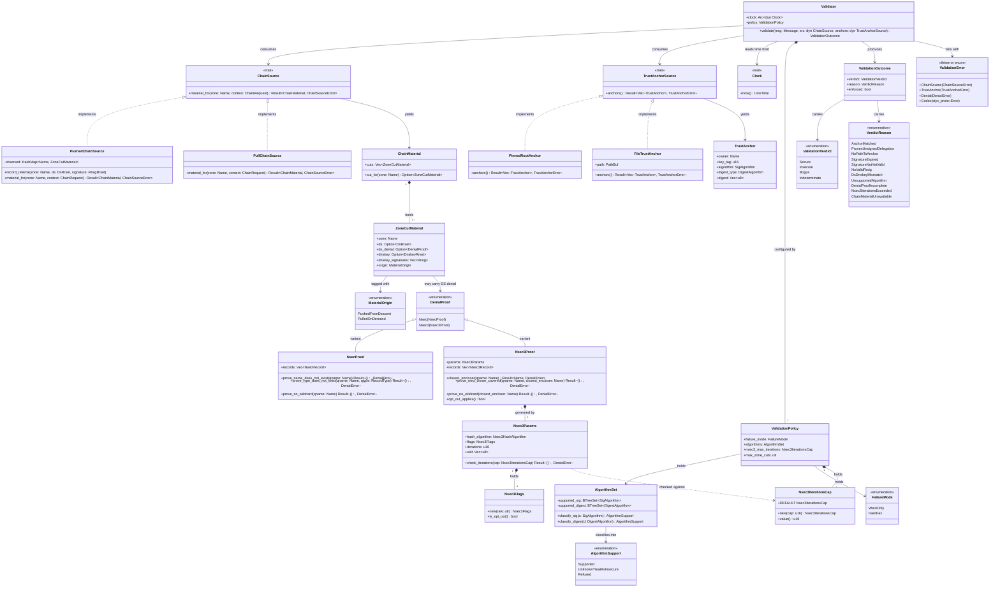

# Phase 6 — DNSSEC validation (`styx-dnssec`)

> **Project**: `styx` — a filtering DNS resolver written from scratch in Rust, replacing
> Pi-hole's role on a home network: recursive/forwarding resolution, per-client blocking
> policy, and a Leptos admin UI. Single process, single binary, one box, local DB file.
>
> **State of the codebase when this was written**: greenfield, no existing
> implementation. No git history, no Cargo workspace, no source. Everything below that
> describes a prior phase describes a contract that phase is specified to deliver, not
> code that already exists.
>
> **This document is self-contained.** The design record it was derived from is being
> retired, so every decision it depends on is reproduced here in full, with the reason
> it was taken. Nothing here points at a document outside this file.

---

## Requirements

Implement DNSSEC validation as its own Rust feature crate, `styx-dnssec`, capable of
producing a trustworthy Secure / Insecure / Bogus verdict for any answer the resolver
is about to serve, regardless of whether that answer came from a recursive descent or
from a forwarder, and hard-fail Bogus answers as SERVFAIL.

**What validation means here, and why the definition is not negotiable.** Validation
means positive chains **and** denial of existence, with hard failure: RRSIG chains,
DS/DNSKEY linkage, NSEC and NSEC3 proofs including opt-out, SERVFAIL on bogus. A
validator that accepts an unsigned NXDOMAIN is downgradeable by any on-path attacker —
an attacker who can forge a bare NXDOMAIN can make any signed name disappear. So
"positive answers only" is **not a smaller version of this feature; it is a different,
insecure one.** Denial-of-existence validation is not a stretch goal inside this phase,
it is half of what the phase *is*.

**Boundaries.**

- The crate performs no I/O and knows nothing about forwarders, recursion, pools or
  sockets. It receives chain material and a trust anchor through ports and returns a
  verdict.
- Answers that were forged by styx itself — blocked replies and local records — never
  reach the validator at all. **Filtering is applied before validation, because a block
  is not a validation verdict.**
- RFC 5011 automated trust anchor rollover is an explicit non-goal (see Approach).
- No third-party DNS or DNSSEC library ships in this crate. The entire DNS stack is
  written from scratch — wire codec, server loop, caches, recursion algorithm, DNSSEC
  validation — and that is the project's premise, not an incidental choice.

**Delivery shape.** Four sub-phases, **6a / 6b / 6c / 6d**, which are **not to be
merged**. The validator runs warn-only through 6a–6c and only flips to hard-fail
SERVFAIL as the last act of 6d.

---

## Entities

**Reading the diagram.** `ChainSource` and `TrustAnchorSource` are traits declared in
`styx-dnssec::domain`; their implementations live outside the crate and are wired by
the `styx` binary. `Validator` is pure: its only inputs are a decoded message, the two
ports, and an injected `Clock`. `DenialProof` is the single type through which both
NSEC and NSEC3 denial reach the chain logic, so a proven-unsigned delegation and a
proven NXDOMAIN travel the same path. `Nsec3IterationsCap` and `Nsec3Flags` are the
newtypes `CLAUDE.md`'s primitive-obsession rule calls for on this phase's two
attacker-facing NSEC3 primitives — see Norm 14.

---

## Approach

### 1. Crate shape and isolation

- `styx-dnssec` is a **feature crate**: `domain`, `application` and `infrastructure`
  are **modules inside it**, not separate crates. Cargo enforces feature-to-feature
  isolation; an arch-lint config enforces layering within the crate by path glob.
- **Feature crates never depend on each other.** Cross-feature needs are expressed as
  a trait (a port) in the consumer's own `domain`, implemented by an adapter in the
  `styx` binary. `styx-dnssec` therefore declares `ChainSource` and
  `TrustAnchorSource` itself and never names `styx-recursion`.
- The single exception to that rule is `styx-proto`, the wire codec: every crate parses
  through it, so it is shared foundation rather than a feature crate, and the
  `[[restrict-use]]` rules must be written so as not to forbid it.
- **Rationale for a separate crate rather than a module inside `styx-recursion`**: a
  forwarded answer needs validating too. A validator living inside the recursor either
  cannot serve the forwarder path, or grows a second divergent code path for it. The
  crate boundary is what makes the wrong dependency impossible rather than merely
  discouraged.

### 2. `ChainSource` — one validator, two feeding strategies

- `styx-recursion` **pushes** chain material it already collected during descent. DS
  RRsets arrive unasked in DO=1 referrals, per **RFC 4035 §3.1.4** — the referral
  carries the DS RRset alongside the NS set — so the descent is already holding the
  material by the time the answer is complete.
- Forwarder paths **pull** DS/DNSKEY on demand, because a forwarder has no descent and
  no referrals and therefore has nothing to push.
- **Why not widen the `Upstream` port instead.** An upstream is *either* a forwarder or
  a recursor, and a pool holds upstreams of mixed kinds behind that one port. Adding a
  "chain material observed en route" field to `Upstream` would add a field that is
  **permanently empty for every forwarder** — structurally meaningless for one of the
  two kinds the port exists to unify, and invisibly so at the call site, since the pool
  hands back a `dyn Upstream` without saying which kind it is. A dedicated port keeps
  `Upstream` honest and keeps the *validation logic* single, which is the part that
  must not fork.
- Consequence to design for: the push adapter must still subject pushed material to the
  same bailiwick rules the descent and cache enforce. Push is a shortcut around a
  fetch, not around provenance checking.

### 3. `TrustAnchorSource` — pinned anchor, file override

- A **compiled-in IANA root anchor** is the default, with a `trust-anchor` path in the
  TOML config as an override, both behind the `TrustAnchorSource` port.
- Config has a hard two-store boundary: **the TOML file owns infrastructure** — listen
  addresses, upstreams and pools, selection strategy, TLS material, **trust anchor**,
  DB path, log mode — and **the database owns policy**: clients, groups, adlists,
  allow/block rules, local records, privacy level, blocking mode. No overlap means no
  precedence rule. The trust anchor is a file-side concern, so changing it requires a
  restart, by construction; the UI cannot touch it.
- **Why RFC 5011 automated rollover is a non-goal.** It needs anchor state that
  survives restarts, which would drag the storage layer into this validator phase for a
  rollover that IANA pre-announces months ahead. The `TrustAnchorSource` port is the
  recorded seam it would slot into later, without disturbing the validator.
- **Accepted consequence, recorded as such**: a KSK roll needs a release or a file edit,
  and missing one SERVFAILs every lookup on the network. **This is a monitoring
  obligation, not code.** Do not add code to soften it.

### 4. Warn-only first, hard-fail last

- 6a, 6b and 6c compute and record the full verdict but **do not affect the response**:
  no AD change driven by verdict, no SERVFAIL. 6d flips `FailureMode::WarnOnly` to
  `FailureMode::HardFail` as its final task.
- **Rationale**: with hard failure on from 6a, every incomplete piece of the validator
  is an outage of the household's resolver rather than a wrong log line — and the
  denial-of-existence code, the part most likely to be subtly wrong, would be landing
  directly into a live hard-fail path. The verdict is fully computed throughout, so the
  differential gate can be run and read against warn-only output.

### 5. NSEC3 and the mandatory iterations cap

- **The cap is mandatory and load-bearing. Uncapped NSEC3 is a CPU denial of service**:
  the iteration count is attacker-chosen data, carried in a record the validator is
  being asked to process, and every iteration is a hash. A cap is not a tuning knob; it
  is the control that stops a remote party choosing how much of this box's CPU to
  spend. The box is the whole household's resolver.
- The cap is checked **before** any hashing loop begins, not inside it.
- Trade-off accepted: a low cap renders some real, badly-configured zones conservative.
  That is strictly preferable to the alternative.
- **Open implementation-level choice, deliberately left to the keyboard: the NSEC3
  iterations cap *value*.** It is recorded as open alongside SRTT decay constants,
  circuit thresholds, rollup granularity, the blocked-reply TTL and the adlist sanity
  thresholds. The *existence* of the cap is not open; only the number is. Pick it,
  name it as a constant or config field, and write it down.
- **Expressed as the `Nsec3IterationsCap` newtype, not a bare `u16`**, per
  `CLAUDE.md`'s primitive-obsession rule: the value chosen above lives as a named
  associated constant on the type, and the type exists precisely so the cap can never
  be expressed as an `Option` or paired with a sentinel meaning "unlimited" — the
  domain rule this rule wraps for, not the primitive-ness of `u16` on its own.

### 6. Time is injected, always

- Every RRSIG inception/expiration check reads the injected `Clock` delivered by
  **Phase 2 — Server loop and test harness**. That `Clock` exists **precisely for this
  phase**: RRSIGs carry inception and expiration timestamps, so any recorded signature
  fixture expires on a date you did not choose. **Time injection cannot be retrofitted
  into a validator — it is a rewrite.** No `SystemTime::now()`, no `Instant::now()`,
  anywhere in this crate.

### 7. Interaction with forged answers

- **Blocked replies and local records never reach the validator.** Both are forged
  answers: AD is always cleared, no RRSIG is ever forged, and neither enters the answer
  cache. The request pipeline order is fixed and is a correctness property:
  **local records → filter → cache → upstream**, with **filtering applied before
  validation — a block is not a validation verdict.**
- Accepted consequences, documented as deliberate:
  - A client validating with CD=0 gets an unsigned answer for a signed name when that
    name is blocked. That is a deliberate lie, documented as one.
  - A local name under a signed public zone (`nas.example.com` where `example.com` is
    signed) is unprovable, and validating clients may SERVFAIL it. The documented
    guidance is to keep local names under an unsigned or internal suffix. This is
    precisely the failure reported as pi-hole#2686, and it is expected to be diagnosed
    on the author's own network at least once.

### 8. Verification strategy

- **Per push, hermetic and fast**: socket-level tests against in-process fake root, TLD
  and authoritative servers, driven over real UDP/TCP on an ephemeral port, plus
  fuzzing and the full lint/arch gate.
- **Per phase, non-hermetic — the differential run**: resolve a corpus of real domains
  through both styx and a local `unbound`, diffing RCODE, AD bit and rrset contents.
  In-process fakes only prove the resolver does what *we* think DNSSEC means; the
  differential run is the only gate that catches a shared misreading. It depends on the
  live internet and is flaky by nature, so **it gates a phase and never a push** — and
  because of that, a failure must be read rather than re-run, since a genuine
  regression can hide behind a shrug.
- **Test-oracle rule**: the fake servers and expected-byte fixtures are built with
  `hickory-proto`, in `[dev-dependencies]` **only**. If our own codec encodes the
  fixtures, the resolver and its oracle share every bug and a green suite proves only
  self-consistency. A CI check asserts `hickory-proto` appears in no normal or build
  dependency path.

### 9. Risks carried into this phase

- **Denial-of-existence validation is the fiddliest code in the project.** NSEC3
  closest-encloser proofs are where validators get subtly wrong, and the iterations cap
  is load-bearing against CPU exhaustion. **The differential gate exists mostly for
  this.**
- **Hand-written wire handling under `indexing_slicing = deny` and
  `arithmetic_side_effects = deny`**: every label offset and every arithmetic step is a
  checked operation. That is the intended tax; it makes canonical-form construction
  verbose. **Fuzzing is not optional**, and it extends from the codec onto the validator
  from this phase onward.
- **`panic = "deny"` is load-bearing and its real mitigation arrives last.** This is a
  single process: a panic anywhere takes DNS down for the whole house, and the
  `catch_unwind` boundary is Phase 12. Until then the lint is the only mitigation, so a
  panicking path in freshly written proof code is a household outage.
- **No operational feedback until the cutover.** The cutover is last by design — the
  household stays on Pi-hole until v1 is complete — so this phase produces nothing a
  human can look at except `dig` output and the differential diff. Accepted cost of not
  doing a live migration underneath two hand-written security-critical subsystems.

---

## Structure

### Phase position

- **Depends on**: Phase 0 (Foundation and gates), Phase 1 (Wire codec, `styx-proto`),
  Phase 2 (Server loop and test harness), Phase 3 (`Upstream` port, forwarding, pool),
  Phase 4 (Answer cache), Phase 5 (Recursion, `styx-recursion`).
- **Depended on by**: Phase 7 (Encrypted inbound — DoT/DoH), Phase 8 (Filtering), and
  transitively Phase 12 (Cutover hardening), where the validator must hold under the
  panic boundary and the musl release artifacts.
- What each dependency supplies:
  - **Phase 1** — DNSKEY, DS, RRSIG, NSEC, NSEC3 record types; name compression on
    encode *and* decode; compression-pointer loop detection; EDNS(0) OPT (needed to set
    and read DO).
  - **Phase 2** — the injectable `Clock`; the in-process fake root/TLD/authoritative
    servers; the fixed pipeline order that puts filtering before validation.
  - **Phase 3** — the `Upstream` trait and the pool, which this phase must **not**
    widen.
  - **Phase 4** — the global answer cache keyed `(qname, qtype, qclass)`, TTL handling,
    RFC 2308 negative caching, bailiwick rules.
  - **Phase 5** — the descent (relaxed QNAME minimisation, CNAME chasing, glue,
    bailiwick, loop and depth limits) and the infrastructure cache; the source of
    pushed chain material.

### Trait (port) relationships

1. `ChainSource` is a trait in `styx_dnssec::domain::ports`; it defines how the
   validator obtains DS/DNSKEY material and DS-denial proofs for a zone cut.
2. `PushedChainSource` implements `ChainSource`, fed by `styx-recursion` during DO=1
   descent; the adapter lives in the `styx` binary, not in either feature crate.
3. `PullChainSource` implements `ChainSource` by issuing DS/DNSKEY lookups through the
   resolution path when the answer came from a forwarder; the adapter also lives in the
   `styx` binary.
4. `TrustAnchorSource` is a trait in `styx_dnssec::domain::ports`.
5. `PinnedRootAnchor` implements `TrustAnchorSource` from a compiled-in IANA anchor.
6. `FileTrustAnchor` implements `TrustAnchorSource` from the `trust-anchor` TOML path.
7. `Clock` is the trait from Phase 2, injected as `Arc<dyn Clock>`; the validator never
   reads wall-clock time directly.
8. Error types are `thiserror` enums: `ValidationError`, `ChainSourceError`,
   `TrustAnchorError`, `DenialError`. Every fallible function returns
   `Result<T, E>`; no `unwrap`, no `expect`, no panic in shipping code.

### Module layering inside `styx-dnssec`

1. **`domain`** — pure types and rules, no I/O, no async, no external crates beyond
   `styx-proto` and error/logging plumbing, split by concept into its own file per
   `CLAUDE.md`'s small-single-purpose-modules rule, the same way `styx-proto` splits
   `domain/rdata/basic.rs` from `domain/rdata/dnssec.rs` rather than collecting every
   `rdata` type into one file:
   - `domain/verdict.rs` — `ValidationVerdict`, `VerdictReason`, `ValidationOutcome`,
     `ValidationPolicy`, `FailureMode`, `AlgorithmSet`, `AlgorithmSupport`, and the
     `Nsec3IterationsCap` newtype `ValidationPolicy` holds.
   - `domain/trust_anchor.rs` — `TrustAnchor`.
   - `domain/chain.rs` — `ChainMaterial`, `ZoneCutMaterial`, `MaterialOrigin`.
   - `domain/denial.rs` — `DenialProof`, `NsecProof`, `Nsec3Proof`, `Nsec3Params`, and
     the `Nsec3Flags` newtype `Nsec3Params` holds.
   - `domain/ports.rs` — the `ChainSource` / `TrustAnchorSource` trait definitions.
2. **`application`** — the `Validator` orchestration: walk the chain from anchor to
   answer, sequence positive-chain and denial checks, apply `FailureMode`, emit
   `tracing` spans and the verdict.
3. **`infrastructure`** — split by concept for the same reason `domain` is, and because
   the four concepts below carry real algorithmic weight (crypto verification, a
   from-scratch canonical encoder, iterated salted hashing) that a single undifferentiated
   file would plausibly push past the workspace's 400-counted-line module cap:
   - `infrastructure/canonical.rs` — canonical name form, canonical RRset ordering and
     canonical wire-form construction (6a.7), built on `styx-proto`'s encoder.
   - `infrastructure/signature.rs` — RRSIG verification (6a.8) and the DS-digest
     computation half of DS → DNSKEY linkage (6a.9).
   - `infrastructure/nsec3.rs` — NSEC3 iterated salted hashing (6c.2) and the
     closest-encloser derivation (6c.3) — kept in its own file precisely because it is,
     per Approach §9, the single fiddliest routine in the project.
   - `infrastructure/trust_anchor.rs` — `PinnedRootAnchor` (6a.5) and `FileTrustAnchor`
     (6a.6). This is the only file under `infrastructure`, and the only file in this
     crate at all, that performs I/O: `FileTrustAnchor::anchors()`'s file read. It stays
     out of `domain` and `application`, both of which deny `std::fs` by
     `[[restrict-use]]` (Operations 6a.1).
4. **Binary (`styx`)** — wires `PushedChainSource` / `PullChainSource` and the chosen
   `TrustAnchorSource` into the resolution path, and maps `ValidationOutcome` onto the
   AD bit and (in `HardFail`) onto SERVFAIL.

### Dependencies

1. `Validator` depends on `dyn ChainSource`, `dyn TrustAnchorSource` and
   `Arc<dyn Clock>` — all trait objects, all injected.
2. `Validator` depends on `styx-proto` for record types and canonical encoding.
3. `Validator` does **not** depend on `styx-recursion`, `styx-resolution` or any other
   feature crate. Cargo must be able to prove this.
4. The `styx` binary depends on `styx-dnssec`, `styx-recursion` and the resolution path,
   and is the only place the three meet.
5. `hickory-proto` appears in `[dev-dependencies]` only, and the `hickory-dev-only` CI
   check asserts it.

---

## Operations

> **The four sub-phase groups below are separate deliverables and MUST NOT be merged.**
> Complete 6a before starting 6b, 6b before 6c, 6c before 6d. Each group has its own
> tests and its own reviewable boundary. The warn-only → hard-fail flip is the final
> task of 6d and of the phase, and it must not be pulled forward into any earlier group.

---

### GROUP 6a — Positive chain (warn-only)

**Do not merge with 6b, 6c or 6d.**

#### 6a.1 — Create the crate `styx-dnssec`

1. Responsibility: house the validator as a feature crate with `domain`, `application`
   and `infrastructure` as modules inside it.
2. Contents: `src/lib.rs` declaring the three modules; `src/domain/mod.rs`,
   `src/application/mod.rs`, `src/infrastructure/mod.rs`.
3. Constraints:
   - Add the crate to the workspace and to the arch-lint `[[scopes]]` (one scope per
     module) and `[[deny-scope-dep]]` layering rules.
   - Add a `[[restrict-use]]` rule forbidding `styx_dnssec` from naming any other
     feature crate; `styx_proto` is explicitly permitted.
   - Add the crate's two synchronous-I/O `[[restrict-use]]` rules,
     `no-sync-io-dnssec-domain` and `no-sync-io-dnssec-application`, denying
     `std::fs` and everything under it, the blocking socket types, the blocking
     `std::io` traits and preludes, and `std::io::{stdin, stdout, stderr}`, per Phase
     0 Norm 12 and Approach §10 of the Phase 0 canvas. `infrastructure` gets no such
     rule — that is where `FileTrustAnchor` reads its file (Approach §3, Operations
     6a.6).
   - Add the crate's `no-anyhow-dnssec` `[[restrict-use]]` rule, scoped to the whole
     crate, denying `anyhow` and everything under it, per the same Phase 0 amendment.
   - No `hickory-*` in `[dependencies]` or `[build-dependencies]`.

#### 6a.2 — Define the domain verdict types

1. Responsibility: express the outcome of a validation attempt.
2. Types:
   - `ValidationVerdict`: `Secure | Insecure | Bogus | Indeterminate`.
   - `VerdictReason`: an enum naming *why*, at minimum — `AnchorMatched`,
     `ProvenUnsignedDelegation`, `NoPathToAnchor`, `SignatureExpired`,
     `SignatureNotYetValid`, `NoValidRrsig`, `DsDnskeyMismatch`,
     `UnsupportedAlgorithm`, `DenialProofIncomplete`, `Nsec3IterationsExceeded`,
     `ChainMaterialUnavailable`.
   - `ValidationOutcome { verdict, reason, enforced: bool }` — `enforced` records
     whether the verdict affected the response, which is `false` for all of 6a–6c.
3. Constraints:
   - `Indeterminate` must be distinct from `Insecure`. "No path to an anchor" and
     "provably unsigned" are different facts and must not collapse.
   - An unsupported algorithm yields `Insecure`, never `Bogus`. A chain we cannot read
     is not a chain we have caught lying.

#### 6a.3 — Define `AlgorithmSet` and enumerate the algorithm set

1. Responsibility: make the accepted algorithms an explicit, closed, reviewable set.
2. Methods:
   - `classify_sig(SigAlgorithm) -> AlgorithmSupport`
   - `classify_digest(DigestAlgorithm) -> AlgorithmSupport`
   - `AlgorithmSupport`: `Supported | UnknownTreatAsInsecure | Refused`.
3. Logic:
   - Enumerate the supported signing algorithms and digest algorithms explicitly in
     code. Do not accept "anything we happen to have a primitive for".
   - `UnknownTreatAsInsecure` → the zone is Insecure, with reason
     `UnsupportedAlgorithm`.
   - `Refused` → reserved for algorithms that must never validate (deprecated/broken);
     a chain resting on one is `Bogus`.
4. Constraint: the enumeration must be exactly the set the `rootcanary.org` corpus in
   6d exercises. If those disagree, one of the two is wrong and it must be resolved
   before 6d passes.

#### 6a.4 — Define `TrustAnchorSource` and `TrustAnchor`

1. Responsibility: supply the root of every chain.
2. Trait: `TrustAnchorSource::anchors() -> Result<Vec<TrustAnchor>, TrustAnchorError>`.
3. `TrustAnchor { owner, key_tag, algorithm, digest_type, digest }`.
4. Constraints:
   - The trait lives in `styx_dnssec::domain::ports`.
   - No state is persisted; the port has no write side. RFC 5011 is a non-goal and the
     port must not acquire a shape that implies otherwise.

#### 6a.5 — Implement `PinnedRootAnchor`

1. Responsibility: the compiled-in IANA root anchor, the default and the fallback.
2. Logic: return the pinned anchor(s) from a compiled-in constant. Log the key tag(s)
   once at startup at `info` so a missed KSK roll is diagnosable from the log.
3. Constraint: no network fetch, ever. No file read. Lives in
   `infrastructure/trust_anchor.rs` alongside `FileTrustAnchor` (Structure, module
   layering).

#### 6a.6 — Implement `FileTrustAnchor`

1. Responsibility: the `trust-anchor` override from the TOML config.
2. Methods: `anchors()` reads and parses the file at `path`.
3. Logic:
   - Parse to the same `TrustAnchor` shape. On a parse failure return
     `TrustAnchorError`; **do not silently fall back to the pinned anchor** — a
     misconfigured override that quietly reverts is worse than a refusal to start.
   - Log at `warn` when an override is in effect, naming the path and key tags.
4. Constraint: implemented in `infrastructure/trust_anchor.rs`, **never** in `domain`
   or `application` — the crate's `no-sync-io-dnssec-domain` and
   `no-sync-io-dnssec-application` `[[restrict-use]]` rules (Operations 6a.1) deny
   `std::fs` in both of those layers, and `anchors()`'s file read is the one place in
   this crate that performs synchronous I/O. `TrustAnchorSource` itself stays a trait
   in `domain::ports`; only its file-backed implementation moves to `infrastructure`.
5. Constraint: the config file owns this setting; there is no DB-backed equivalent and
   no UI path to it. Changing it requires a restart. This is the hard file/DB config
   boundary and it must not be softened here.

#### 6a.7 — Implement canonical form and RRset ordering (`infrastructure`)

1. Responsibility: produce the exact byte sequence a signature is computed over.
2. Logic:
   - Canonical name form, canonical RR ordering within an RRset, canonical RDATA.
   - Original TTL from the RRSIG, not the received TTL.
   - Every offset and length computed with checked arithmetic — `indexing_slicing` and
     `arithmetic_side_effects` are denied workspace-wide.
3. Constraint: build this on `styx-proto`'s encoder. Do not hand-roll a second encoder.

#### 6a.8 — Implement RRSIG verification

1. Responsibility: verify one RRSIG over one RRset with one DNSKEY.
2. Logic:
   - Check owner, class, type covered, labels field, signer name.
   - Check inception and expiration **against the injected `Clock`** — reason
     `SignatureNotYetValid` / `SignatureExpired`.
   - Check the key tag and algorithm against the DNSKEY; classify the algorithm through
     `AlgorithmSet` before doing any cryptographic work.
   - Verify the signature over the canonical form.
3. Constraints:
   - **Any one valid RRSIG suffices.** A validator that requires all of them breaks
     every zone mid-rollover.
   - No `SystemTime::now()` / `Instant::now()` anywhere.

#### 6a.9 — Implement DS → DNSKEY linkage

1. Responsibility: prove a child's DNSKEY set is authorised by the parent's DS RRset.
2. Logic:
   - For each DS, compute the digest of the matching DNSKEY and compare; on mismatch
     across the whole set, `Bogus` with `DsDnskeyMismatch`.
   - The DNSKEY RRset must itself be self-signed by a key the DS vouches for.
   - Classify the DS digest algorithm through `AlgorithmSet` first.
3. Shape: the DS-over-DNSKEY search is two nested iterations (each DS against each
   candidate DNSKEY). Extract the per-DS digest comparison into its own named helper
   returning early on a match, rather than nesting the comparison inside the outer loop,
   to stay within the workspace's `excessive_nesting` threshold of 4 (Phase 0 Norm 17).

#### 6a.10 — Implement the `Validator` positive-chain walk (`application`)

1. Responsibility: walk from the trust anchor down the zone cuts to the answer.
2. Method: `validate(&self, msg, chain_source, anchors) -> ValidationOutcome`.
3. Logic:
   - Start at the anchor; for each zone cut from root downward, obtain
     `ZoneCutMaterial`, verify DNSKEY against DS (or against the anchor at the root),
     then verify the answer RRset's RRSIG against the validated DNSKEY set.
   - Enforce `ValidationPolicy::max_zone_cuts` — a bounded descent, not an open loop.
   - **Missing DS is not yet handled in 6a**: return `Indeterminate` with
     `NoPathToAnchor` and leave a `TODO`-free explicit branch that 6b/6c will fill with
     a proved `Insecure`. Do not guess `Insecure` here; an unproved Insecure is the
     downgrade hole this phase exists to close.
   - Emit a `tracing` span per validation carrying qname, qtype, verdict, reason and
     `enforced`.
4. Shape: extract the per-cut work — root-vs-non-root linkage, then RRSIG verification —
   into a named helper (for example `verify_zone_cut`) called once per iteration of the
   descent, each branch returning early on the first failing check, rather than nesting
   the anchor/DS branch inside the loop that also carries the RRSIG check. This keeps the
   walk within the workspace's `excessive_nesting` threshold of 4 and `too_many_lines`
   threshold of 60 (Phase 0 Norm 17).
5. Constraint: `ValidationPolicy::failure_mode` is **`WarnOnly`** for all of 6a. The
   verdict must not alter the AD bit or the RCODE.

#### 6a.11 — 6a tests

1. Socket-level tests against the in-process fake root/TLD/authoritative servers,
   serving signed zones built with `hickory-proto` (dev-only).
2. Cases: valid chain → `Secure`; expired RRSIG → `Bogus/SignatureExpired`;
   not-yet-valid RRSIG → `Bogus/SignatureNotYetValid`; DS/DNSKEY mismatch →
   `Bogus/DsDnskeyMismatch`; unknown algorithm → `Insecure/UnsupportedAlgorithm`;
   multiple DNSKEYs mid-roll → `Secure` when any one signature validates.
3. **Clock tests**: the expiry and not-yet-valid cases are driven by moving the injected
   `Clock`, with fixtures whose validity window is fixed. A fixture must not expire
   because the calendar moved.
4. Assert `enforced == false` on every outcome in this group.

---

### GROUP 6b — NSEC denial of existence (warn-only)

**Do not merge with 6a, 6c or 6d.**

#### 6b.1 — Define `DenialProof` and `NsecProof`

1. Responsibility: model an NSEC-based proof of non-existence.
2. Types: `DenialProof::Nsec(NsecProof)`; `NsecProof { records: Vec<NsecRecord> }`.
3. Methods:
   - `prove_name_does_not_exist(qname) -> Result<(), DenialError>`
   - `prove_type_does_not_exist(qname, qtype) -> Result<(), DenialError>`
   - `prove_no_wildcard(qname) -> Result<(), DenialError>`

#### 6b.2 — Implement NSEC name-does-not-exist

1. Logic: find an NSEC whose owner < qname < next-owner in canonical order, covering
   the qname. Canonical ordering is the one from 6a.7, not string ordering.
2. Edge case: the last NSEC in a zone wraps to the apex; the comparison must handle the
   wrap rather than failing the range test.

#### 6b.3 — Implement NSEC type-does-not-exist (NODATA)

1. Logic: locate the NSEC whose owner *is* the qname, and assert the qtype is absent
   from its type bitmap.
2. Edge case: CNAME present in the bitmap changes the meaning of the answer; handle it
   explicitly rather than letting it fall through.

#### 6b.4 — Implement NSEC wildcard-not-applicable

1. Logic: prove no wildcard at the relevant level could have synthesised an answer.
   A wildcard-expanded positive answer needs its own proof that no closer match existed.
2. Constraint: an NXDOMAIN proof is **incomplete** without this. Return
   `DenialProofIncomplete` rather than accepting a partial proof.

#### 6b.5 — Implement proved-unsigned delegation via NSEC

1. Responsibility: replace 6a.10's `Indeterminate/NoPathToAnchor` branch for the NSEC
   case with a **proved** `Insecure`.
2. Logic: a delegation with no DS is Insecure only when an NSEC proof shows the DS type
   is absent at that owner name. Absent records alone prove nothing.
3. Constraint: this is the mechanism that closes the downgrade hole. **Do not accept a
   missing DS RRset on the grounds that nothing was returned.**

#### 6b.6 — Wire denial into the `Validator`

1. Logic: on NXDOMAIN and NODATA responses, require a complete denial proof before any
   verdict other than `Bogus`. An unsigned NXDOMAIN under a signed parent is `Bogus`.
2. Constraint: still `WarnOnly`; `enforced == false`.

#### 6b.7 — 6b tests

1. Hermetic socket tests over NSEC-signed fake zones: NXDOMAIN proved; NODATA proved;
   wildcard-expanded answer with correct proof; **unsigned NXDOMAIN under a signed
   parent → `Bogus`**; partial proof (missing the wildcard leg) → `Bogus` with
   `DenialProofIncomplete`.
2. A proved unsigned delegation → `Insecure/ProvenUnsignedDelegation`, distinct from
   `Indeterminate`.

---

### GROUP 6c — NSEC3, opt-out, and the mandatory iterations cap (warn-only)

**Do not merge with 6a, 6b or 6d.**

#### 6c.1 — Define `Nsec3Params`, `Nsec3Flags`, `Nsec3IterationsCap` and the cap check

1. Responsibility: hold the NSEC3 parameters and refuse excessive work **before** doing
   any of it.
2. Attributes: `hash_algorithm`, `flags: Nsec3Flags`, `iterations: u16`,
   `salt: Vec<u8>`.
3. `Nsec3Flags` wraps the wire's flags octet, per `CLAUDE.md`'s primitive-obsession
   rule: it carries the named opt-out bit rather than leaving every caller to mask a
   bare `u8` by hand. Constructor `Nsec3Flags::new(raw: u8) -> Self` (every octet value
   is wire-valid, so construction cannot fail); read accessor `is_opt_out() -> bool`;
   no setter — a flags value is reconstructed via `new`, never mutated in place.
4. `Nsec3IterationsCap` wraps the cap value in `u16`, for the same reason: the value is
   mandatory and load-bearing (Approach §5) and carries a named default constant rather
   than being an unvalidated bare number indistinguishable at a call site from the
   record's own `iterations` field. Constructor `Nsec3IterationsCap::new(cap: u16) ->
   Self`; a named associated constant `Nsec3IterationsCap::DEFAULT` holding the value
   chosen and documented in this task; read accessor `value() -> u16`; no setter.
5. Method: `check_iterations(cap: Nsec3IterationsCap) -> Result<(), DenialError>`
   returning `Nsec3IterationsExceeded` when `iterations > cap.value()`.
6. Constraints:
   - The cap lives on `ValidationPolicy::nsec3_max_iterations: Nsec3IterationsCap` and
     is **not optional** — no `Option`, no sentinel meaning "unlimited". **Uncapped
     NSEC3 is a CPU denial of service**: the iteration count is attacker-supplied and
     every iteration is a hash, on the box that resolves for the whole house.
   - `check_iterations` is called **before** the first hash computation, not inside the
     loop.
   - **The cap value is an open implementation-level choice, decided at the keyboard in
     this task.** Choose it, define it as `Nsec3IterationsCap::DEFAULT` (overridable
     from the TOML if that is judged useful), and document the number and the
     reasoning next to it.

#### 6c.2 — Implement NSEC3 hashing

1. Logic: the iterated, salted hash over the canonical owner name, using the parameters
   from the record, gated by 6c.1's cap check.
2. Constraint: checked arithmetic throughout; no unbounded allocation driven by the
   salt length or iteration count.

#### 6c.3 — Implement closest-encloser derivation

1. Method: `closest_encloser(qname) -> Result<Name, DenialError>`.
2. Logic: walk qname's ancestors from the apex downward (or qname upward), hashing each
   and matching against the NSEC3 set, to find the longest existing ancestor.
3. Constraint: **this is the single fiddliest routine in the project.** NSEC3
   closest-encloser proofs are where validators get subtly wrong. It gets its own unit
   tests with hand-built hashes and it is the first thing to suspect when the
   differential gate disagrees.
4. Shape: extract the per-ancestor hash-and-match step into its own named helper called
   from the walk, with a guard clause that returns as soon as an ancestor is found,
   rather than nesting the match inside the walk. Being the fiddliest routine in the
   project is a reason for it to read as a short, named sequence of checks, not a reason
   to exempt it from the workspace's `excessive_nesting` (4) and `too_many_lines` (60)
   thresholds (Phase 0 Norm 17).

#### 6c.4 — Implement the three-part NSEC3 proof

1. Logic, all three legs required:
   - the **closest encloser** exists,
   - the **next closer** name is covered by an NSEC3 record,
   - the relevant **wildcard** is covered or proved absent.
2. Constraint: a missing leg is `Bogus` with `DenialProofIncomplete`. Two legs out of
   three is not a proof.

#### 6c.5 — Implement opt-out

1. Logic: when `Nsec3Flags::is_opt_out()` is true on the covering NSEC3's flags, an
   **unsigned delegation** within that span is permitted to go unproven, yielding
   `Insecure`.
2. Constraints:
   - Opt-out applies **only** to unsigned delegations, never to an NXDOMAIN for a name
     that is not a delegation and never to a signed delegation.
   - Too permissive here silently re-opens the downgrade hole the whole phase exists to
     close; too strict breaks large legitimate TLDs. Both directions need a test.

#### 6c.6 — Implement proved-unsigned delegation via NSEC3

1. Logic: the NSEC3 analogue of 6b.5 — a DS-absence proof, or a valid opt-out span,
   yields `Insecure/ProvenUnsignedDelegation`.

#### 6c.7 — 6c tests and fuzzing

1. Hermetic socket tests over NSEC3-signed fake zones: NXDOMAIN via closest-encloser;
   NODATA; wildcard cases; an opt-out delegation → `Insecure`; an over-cap NSEC3 →
   refused with `Nsec3IterationsExceeded` **without** computing the hashes; a
   two-of-three proof → `Bogus/DenialProofIncomplete`.
2. **Add `cargo fuzz` targets on the validator**: NSEC3 record parsing, closest-encloser
   derivation over arbitrary names, and denial-proof assembly from arbitrary record
   sets. Fuzzing runs continuously from here, as it does for the codec.
3. Assert no panic path exists in any proof routine — `panic = "deny"` is load-bearing
   and the `catch_unwind` boundary does not arrive until Phase 12.

---

### GROUP 6d — `ChainSource`, both feeding strategies, then the hard-fail flip

**Do not merge with 6a, 6b or 6c.**

#### 6d.1 — Define `ChainSource`, `ChainMaterial`, `ZoneCutMaterial`

1. Responsibility: the port through which the validator obtains chain material, and the
   types it carries.
2. Trait:
   `ChainSource::material_for(zone: Name, context: ChainRequest) -> Result<ChainMaterial, ChainSourceError>`.
3. Types:
   - `ChainMaterial { cuts: Vec<ZoneCutMaterial> }` with `cut_for(zone)`.
   - `ZoneCutMaterial { zone, ds, ds_denial, dnskey, dnskey_signatures, origin }`.
   - `MaterialOrigin { PushedFromDescent, PulledOnDemand }`.
4. Constraints:
   - The trait lives in `styx_dnssec::domain::ports`. The validator is agnostic to
     which adapter answers it.
   - `origin` exists for diagnostics and tests, **not** for branching validation logic.
     If a verdict ever depends on `origin`, the abstraction has failed.

#### 6d.2 — Implement `PushedChainSource` (recursion feeds the validator)

1. Responsibility: serve chain material that `styx-recursion` already collected.
2. Methods: `record_referral(zone, ds, signature)` during descent; `material_for` reads
   back what was recorded.
3. Logic:
   - **DS RRsets arrive unasked in DO=1 referrals, per RFC 4035 §3.1.4** — the referral
     carries the DS RRset alongside the NS set. The descent already holds this material
     when the answer completes, so re-fetching it would be both slower and a second
     chance to get bailiwick wrong.
   - Apply the same bailiwick rules the descent and the answer cache enforce. Push is a
     shortcut around a fetch, not around provenance checking.
   - Tag every cut `PushedFromDescent`.
4. Constraint: the adapter lives in the `styx` binary. `styx-dnssec` must not name
   `styx-recursion`, and `styx-recursion` must not name `styx-dnssec`.

#### 6d.3 — Implement `PullChainSource` (forwarder paths ask on demand)

1. Responsibility: fetch DS/DNSKEY explicitly when the answer came from a forwarder.
2. Logic:
   - Issue DS and DNSKEY queries with DO=1 through the resolution path for each zone
     cut the validator asks about.
   - **Distinguish "this upstream cannot serve chain material" from "this zone is
     unsigned".** A forwarder that strips DNSSEC records or ignores DO=1 must yield
     `ChainSourceError` → `Indeterminate/ChainMaterialUnavailable`, never a silent
     `Insecure`. Conflating the two is a downgrade, which is the exact failure this
     phase exists to prevent.
   - Tag every cut `PulledOnDemand`.
3. Constraint: the adapter lives in the `styx` binary.

#### 6d.4 — Confirm the `Upstream` port is untouched

1. Responsibility: an explicit review-and-assert task, not a code task.
2. Logic: assert that no field resembling "chain material observed en route" has been
   added to the `Upstream` trait or its associated types. Such a field would be
   **permanently empty for every forwarder** — meaningless for one of the two kinds the
   port exists to unify, and invisible at the call site because the pool hands back
   mixed kinds behind one port. `ChainSource` exists so that this never has to happen.
3. Verification: a test or lint that fails if `Upstream`'s surface grows a DNSSEC-shaped
   member.

#### 6d.5 — Define the verdict → response mapping

1. Responsibility: turn `ValidationOutcome` into wire behaviour.
2. Logic:
   - `Secure` → AD set.
   - `Insecure` → AD cleared, answer served.
   - `Indeterminate` → AD cleared, answer served, logged at `warn`.
   - `Bogus` → under `WarnOnly`, AD cleared and the answer served with a `warn` log;
     under `HardFail`, **SERVFAIL**.
3. Constraints:
   - Blocked replies and local records never enter this mapping: they never reach the
     validator, always clear AD, and never carry a forged RRSIG. **Filtering is applied
     before validation because a block is not a validation verdict.** Establish this
     contract here; Phase 8 asserts each of its five blocking modes against it.
   - Decide and implement CD (Checking Disabled) handling explicitly: what a client's
     CD=1 means for our own validation and for the AD bit we return. Do not leave it
     implicit.

#### 6d.6 — Verdict and cache interaction

1. Responsibility: define how verdicts relate to the global answer cache.
2. Logic: a signature's remaining validity and a record's remaining TTL are different
   clocks. Either recompute the verdict on serve, or cache the verdict together with
   the signature's expiry and never serve an expired-signature entry as `Secure`.
   Choose one, implement it, and write the choice down next to the code.
3. Constraint: whichever is chosen, an entry whose RRSIG has expired must never be
   served with AD set.

#### 6d.7 — Curate the differential corpus

1. Responsibility: make the exit criteria falsifiable.
2. Contents, written down as a file in the repository, not held in someone's head:
   - signed names (AD expected set),
   - unsigned names (AD expected clear),
   - bogus names (SERVFAIL expected after the flip; `Bogus` verdict expected before it),
   - NXDOMAIN cases over **both** NSEC and NSEC3 zones, including an opt-out TLD,
   - the enumerated `rootcanary.org` family, one entry per algorithm in `AlgorithmSet`
     from 6a.3, with its expected outcome,
   - the enumerated `dnssec-failed.org` family, with its expected outcome stated twice:
     `Bogus` verdict under `WarnOnly`, SERVFAIL under `HardFail`.
3. Constraint: "behaves as expected" is not a criterion until each name's expectation is
   written down.

#### 6d.8 — Run the differential gate against `unbound`

1. Responsibility: the phase gate.
2. Logic: resolve the corpus through both styx and a local `unbound`, diffing **RCODE,
   AD bit and rrset contents**. Run it while still `WarnOnly`, reading verdicts from the
   logs for the bogus cases.
3. Constraints:
   - In-process fakes only prove the resolver does what *we* think delegation and
     denial mean; the differential run is the only gate that catches a shared
     misreading — **which is mostly why it exists, given that denial-of-existence is
     the fiddliest code in the project.**
   - It depends on the live internet and is flaky by nature, so it **gates a phase and
     never a push**. A failure must be read, not re-run: a genuine regression can hide
     behind a shrug about "DNS changed".

#### 6d.9 — Flip warn → hard-fail. **The last task of the phase.**

1. Responsibility: make `Bogus` mean SERVFAIL.
2. Logic: switch the default `ValidationPolicy::failure_mode` from `WarnOnly` to
   `HardFail`; `ValidationOutcome::enforced` becomes `true`.
3. Constraints:
   - **Do not perform this before 6d.8 has been run and read.** Every latent false-Bogus
     that was a log line through 6a–6c becomes SERVFAIL for the whole household the
     moment this flips.
   - Re-run the differential gate after the flip and confirm the bogus and
     `dnssec-failed.org` families now SERVFAIL, and that nothing else changed.

---

## Norms

1. **Crate and module layout**: one crate per feature; `domain` / `application` /
   `infrastructure` are modules *inside* it. Feature crates never name each other;
   cross-feature needs are traits in the consumer's own `domain`, implemented by
   adapters in the `styx` binary. `styx-proto` is the one permitted shared dependency.
2. **Ports are traits**: `ChainSource`, `TrustAnchorSource`, `Clock`. Injected as
   `Arc<dyn …>` or generic parameters; never constructed inside `domain`.
3. **Errors are `thiserror` enums**, one per failure domain
   (`ValidationError`, `ChainSourceError`, `TrustAnchorError`, `DenialError`), returned
   through `Result<T, E>`. Errors carry the `VerdictReason` where one applies, so a log
   line names *why* a lookup failed. No stringly-typed errors.
4. **No `unwrap`, no `expect`, no `panic!`, no `todo!`, no `unimplemented!`** in
   shipping code. `no-unwrap-expect` is enforced by arch-lint with `allow_in_tests =
   true`. `panic = "deny"` is load-bearing: this is a single process and a panic takes
   DNS down for the whole house.
5. **`indexing_slicing` and `arithmetic_side_effects` are denied.** Every label offset,
   hash-iteration count and TTL arithmetic is a checked operation. That is the intended
   tax.
6. **No wall-clock reads.** All time comes from the injected `Clock`. A grep for
   `SystemTime::now` or `Instant::now` in this crate must return nothing.
7. **`tracing` everywhere, no `println!`.** One span per validation attempt carrying
   qname, qtype, verdict, reason, `enforced`, and the `MaterialOrigin` of the chain.
   `require-tracing` and `tracing-env-init` are enforced by arch-lint.
8. **No blocking I/O in `domain` or `application`** (`no-sync-io` enforced). The
   validator does no I/O at all; adapters in the binary do.
9. **`hickory-proto` is `[dev-dependencies]` only**, used to build fake zones and
   expected-byte fixtures. If our own codec encodes the fixtures, the resolver and its
   oracle share every bug and a green suite proves only self-consistency. The
   `hickory-dev-only` CI check asserts it appears in no normal or build dependency path.
10. **Tests are socket-level by default**: real UDP/TCP against an ephemeral-port server
    with in-process fake root, TLD and authoritative servers. Unit tests are reserved
    for the pure proof routines (closest-encloser, canonical ordering, hashing).
11. **Fuzzing is continuous**, extending from the codec onto the validator from 6c
    onward.
12. **The per-push gate is `just gate`**: formatting, the 21 denied clippy lints (Phase 0
    Norm 17), `arch-lint check`, the `cargo tree --edges normal` layering gate, the
    `hickory-dev-only` check, the `xtask module-size` check, socket-level tests, and the
    `--no-default-features` headless build. The differential run is *not* in it.
13. **Document the open numbers next to the code that uses them** — specifically the
    NSEC3 iterations cap value chosen in 6c.1.
14. **Primitive obsession is avoided; a newtype wraps a primitive that carries domain
    rules**, per `CLAUDE.md`. A value gets its own type when it has a validated range,
    a checked arithmetic or comparison operation, a non-trivial wire encoding, or named
    constants attached to it — not merely because it is a `u16`, a `u8` or a `bool`;
    the test is domain rules attached to the value, not the primitive-ness of its type.
    This phase's own newtypes are `Nsec3IterationsCap`
    (`ValidationPolicy::nsec3_max_iterations`, carrying the named `DEFAULT` constant
    chosen and documented in 6c.1, and excluding the cap from ever being expressed as
    an `Option` or a sentinel meaning "unlimited") and `Nsec3Flags`
    (`Nsec3Params::flags`, carrying the named opt-out bit read through
    `is_opt_out()` rather than a bare octet every caller masks by hand). By contrast,
    `ValidationOutcome::enforced` stays a plain `bool` field: it has no independent
    validation and no risk of being confused with an unrelated value at a call site, so
    wrapping it would be ceremony with no behaviour behind it — the failure mode this
    rule exists to avoid, not the one it exists to punish.

---

## Safeguards

### 1. Exit criteria (preserved verbatim from the phase specification)

> Differential AD-bit agreement with `unbound` across signed, unsigned, bogus and
> NXDOMAIN cases; the `rootcanary.org` and `dnssec-failed.org` families behave as
> expected.

### 2. Scope constraints (preserved verbatim from the phase specification)

> Four sub-phases. Do not merge them.
>
> - **6a** Positive chain: RRSIG verification, DNSKEY/DS linkage, the pinned root
>   anchor behind `TrustAnchorSource`, the algorithm set. Warn-only.
> - **6b** NSEC denial-of-existence proofs.
> - **6c** NSEC3: closest-encloser proofs, opt-out, and a **mandatory iterations
>   cap**. Uncapped NSEC3 is a CPU denial of service.
> - **6d** The `ChainSource` port with both feeding strategies — recursion *pushes*
>   DS material collected during DO=1 descent, forwarder paths *pull* on demand
>   on demand. Then flip warn → **hard-fail SERVFAIL**.

*(Every decision referenced above is reproduced in full in the Requirements and
Approach sections; nothing outside this document is needed to read them.)*

### 3. Functional constraints

- Validation covers positive chains **and** denial of existence. Shipping positive
  chains alone is not a partial delivery of this phase — it is a different, insecure
  feature, because an unsigned NXDOMAIN accepted at face value lets any on-path
  attacker make any signed name disappear.
- `Bogus` → SERVFAIL, once 6d.9 has flipped the mode. No soft-fail mode, no
  "validate and serve anyway".
- `Insecure` must always be **proved** — by an NSEC or NSEC3 DS-absence proof, or by a
  valid NSEC3 opt-out span. An unproved absence of records is `Indeterminate`, never
  `Insecure`.
- Opt-out applies only to unsigned delegations.
- Any single valid RRSIG over an RRset suffices.
- An unsupported algorithm yields `Insecure`, never `Bogus`.
- The four sub-phase groups ship separately, in order, and are not merged.

### 4. Security constraints

- **The NSEC3 iterations cap is mandatory and is checked before any hashing begins.**
  No configuration value may disable it. Uncapped NSEC3 is a remote CPU denial of
  service on the box that resolves for the entire household. It is expressed as the
  non-optional `Nsec3IterationsCap` newtype, never a bare `u16` or an `Option` (Norm
  14).
- The descent and proof routines are bounded: `max_zone_cuts`, bounded record counts per
  proof, bounded salt handling. No unbounded loop or allocation may be driven by
  attacker-supplied fields.
- Pushed chain material is subject to the same bailiwick rules as fetched material.
- A forwarder that cannot supply chain material yields `Indeterminate`, never a silent
  `Insecure` — the distinction *is* the downgrade defence.
- No panic path in any proof routine; the `catch_unwind` boundary does not exist until
  Phase 12, so the lint is the only protection in the meantime.
- Error messages and logs must not leak key material or raw signature bytes.

### 5. Trust anchor constraints

- The pinned IANA anchor is compiled in; the `trust-anchor` TOML path overrides it
  through `TrustAnchorSource`. No network fetch of an anchor, ever.
- A malformed override file is a hard error, not a silent fallback to the pinned anchor.
- **RFC 5011 automated rollover is a non-goal** — it needs state surviving restarts,
  which would drag the storage layer into this phase for a rollover pre-announced
  months ahead. The port is the seam for adding it later; do not add partial 5011
  machinery now.
- **Accepted consequence, deliberately not engineered around**: a KSK roll requires a
  release or a file edit, and missing one SERVFAILs every lookup. This is a monitoring
  obligation, not code. Log the active anchor key tags at startup so the failure is
  diagnosable.

### 6. Integration constraints

- The `Upstream` port must not grow a "chain material observed en route" field. It would
  be permanently empty for every forwarder, which is half the kinds the port unifies.
- `styx-dnssec` must not depend on `styx-recursion` or any other feature crate; both
  `ChainSource` adapters live in the `styx` binary. Enforced by `[[restrict-use]]` and
  independently by the `cargo tree --edges normal` gate — arch-lint reads source text
  while `cargo tree` reads the real link graph, and they catch different mistakes.
- The validator must behave identically whether material arrived `PushedFromDescent` or
  `PulledOnDemand`. `MaterialOrigin` is diagnostic only; no verdict may branch on it.
- Both adapters must be exercised by tests. A suite that only runs the recursive path
  leaves the forwarder strategy — the one most likely to be written last and tested
  least — unproven.
- Blocked replies and local records never reach the validator, always clear AD, never
  carry a forged RRSIG, and never enter the answer cache. The pipeline order **local
  records → filter → cache → upstream** is a correctness property, not a detail.

### 7. Time and determinism constraints

- All RRSIG validity evaluation reads the injected `Clock`. **The `Clock` from Phase 2
  exists precisely for this phase**: RRSIGs carry inception and expiration timestamps,
  so any recorded signature fixture expires on a date you did not choose, and **time
  injection cannot be retrofitted into a validator — it is a rewrite.**
- Every signature-expiry test drives the clock, not the calendar. No test may become
  red by the passage of time.

### 8. Technical constraints

- No `hickory-*` or other third-party DNS/DNSSEC crate in `[dependencies]` or
  `[build-dependencies]` — the whole stack is from scratch. `hickory-proto` in
  `[dev-dependencies]` only, asserted by CI.
- `no-unwrap-expect`, `require-tracing`, `tracing-env-init`, `no-sync-io` and
  `require-thiserror` are enforced by arch-lint on this crate, alongside the
  `no-sync-io-dnssec-domain` / `no-sync-io-dnssec-application` and `no-anyhow-dnssec`
  `[[restrict-use]]` rules from Operations 6a.1: `no-sync-io` only catches blocking calls
  inside async contexts, so the two `[[restrict-use]]` rules are what actually keeps
  `FileTrustAnchor`'s file read (Operations 6a.6) confined to `infrastructure`.
- This phase's code must pass the gate's extended rule set (Phase 0 Norm 17): the two
  synchronous-I/O `[[restrict-use]]` rules and `no-anyhow-dnssec` above; clippy's
  `excessive_nesting` (4) and `too_many_lines` (60) against the DS/DNSKEY linkage
  (6a.9), the positive-chain walk (6a.10) and the closest-encloser derivation (6c.3) —
  this phase's most loop- and branch-heavy code; the `xtask module-size` cap (400
  counted lines) against `infrastructure`'s canonical-form, signature, NSEC3 and
  trust-anchor modules; and `partial_pub_fields` against `Nsec3Flags` and
  `Nsec3IterationsCap`, whose fields stay entirely private behind their constructors
  (Norm 14).
- The crate must build under `--no-default-features` (the headless resolver build), which
  CI exercises on every commit.
- Release targets are `x86_64-unknown-linux-musl` and `aarch64-unknown-linux-musl`.

### 9. Verification constraints

- **Per push**: `just gate` green — formatting, the 21 denied clippy lints, `arch-lint
  check`, the `cargo tree` layering gate, the `hickory-dev-only` check, the
  `xtask module-size` check, socket-level tests, the headless build.
- **Per phase**: the differential run above. It needs the live internet and is flaky by
  nature, so **it gates a phase and never a push** — and a failure is read rather than
  re-run, because a genuine regression can hide behind "DNS changed underneath us".
- Every corpus entry has a written expected outcome before the gate is considered
  meaningful.
- The bogus and `dnssec-failed.org` families are checked twice: `Bogus` verdict under
  `WarnOnly`, SERVFAIL after the 6d.9 flip.

### 10. Open implementation-level choice

- **The NSEC3 iterations cap value.** Left deliberately to the keyboard, alongside the
  project's other open numbers (SRTT decay constants and circuit thresholds, the canary
  question per upstream kind, rollup bucket granularity and top-N width, the
  blocked-reply TTL, the adlist sanity thresholds). The *existence* of the cap is
  settled and mandatory; only the number is open. Decide it in 6c.1, name it as
  `Nsec3IterationsCap::DEFAULT`, and document the reasoning beside it.

### 11. Known risks carried by this phase

- **Denial-of-existence validation is the fiddliest code in the project.** NSEC3
  closest-encloser proofs are where validators get subtly wrong, and the iterations cap
  is load-bearing against CPU exhaustion. The differential gate exists mostly for this.
- The differential gate depends on the live internet, so it will sometimes fail for
  reasons that are not a bug here — which also means a genuine regression can hide
  behind a shrug.
- `panic = "deny"` is load-bearing and its real mitigation (the `catch_unwind` boundary)
  does not arrive until Phase 12.
- This phase produces nothing a human can look at except `dig` output and the
  differential diff; the cutover is last, so there is no operational feedback and no
  external pressure. That is the accepted cost of not migrating the household live
  underneath two hand-written security-critical subsystems.
- A local name under a signed public zone is unprovable and validating clients may
  SERVFAIL it (pi-hole#2686). The mitigation is documentation — keep local names under
  an unsigned or internal suffix — which is a mitigation only for those who read it.

### 12. Object Calisthenics compliance

- This phase's newly introduced domain values that carry rules — `Nsec3IterationsCap`
  and `Nsec3Flags` — are newtypes, not bare `u16`/`u8` fields, per `CLAUDE.md`'s
  primitive-obsession rule and Norm 14.
- **Wrapping these two primitives stays a review discipline; the shape rules around them
  are gated.** Per `CLAUDE.md`'s Enforcement section and Phase 0 Norm 17, nesting depth,
  function length, module length and mixed field visibility are mechanically checked by
  `just gate` — see the Technical constraints bullet above for which parts of this crate
  that reaches. Whether `Nsec3IterationsCap` and `Nsec3Flags` *should* be newtypes at all
  is not something any lint decides, and stays review's job.
