# styx Phase 7 — Encrypted inbound (DoT / DoH)

> **styx** is a filtering DNS resolver written from scratch in Rust, replacing Pi-hole's
> role on a home network: recursive/forwarding resolution, per-client blocking policy,
> and a Leptos admin UI. Single process, single binary, one box, local DB file.
>
> This document is **self-contained**. Every decision, rationale, accepted consequence,
> non-goal and risk that bears on this phase is inlined here. No other document is
> required to implement it.

---

## Requirements

Add **two encrypted inbound transports in front of an unchanged request pipeline**, plus
the one small certificate-provisioning concern they share.

- **Implement** a DNS-over-TLS (DoT) listener: a TLS-wrapped TCP accept loop whose inner
  stream carries exactly the two-octet big-endian length-prefix framing the plaintext TCP
  listener already uses, negotiated with the `dot` ALPN protocol identifier.
- **Implement** a DNS-over-HTTPS (DoH) endpoint over HTTP/2: one resource that accepts a
  wire-format DNS message — as a `POST` body or base64url-encoded in a `GET` query
  parameter — and returns a wire-format DNS message.
- **Implement** certificate provisioning with exactly two variants and no third: an
  **operator-supplied** certificate and key read from paths named in the TOML file, or a
  **self-signed certificate generated at first boot** whose SPKI pin is printed once to
  the log.
- **Derive and emit** the SPKI pin of whichever certificate is serving, in the format real
  pinning clients consume, and make it re-derivable on demand so an operator who missed
  the log line is not stranded.
- **Bound** the new stateful transports: idle timeout, handshake timeout, concurrent
  connection ceiling, per-connection stream and query ceilings, and a request-body size
  cap — all named TOML values with documented defaults.
- **Prove** that a question answered over DoT, over DoH and over plaintext Do53 produces
  byte-identical answers, and **write the operator documentation** that the exit criteria
  make a first-class deliverable of this phase.

**Value**: this is the first phase that produces something an ordinary client — a phone, a
browser, a `curl` invocation — can talk to. Phases 1 through 7 produce nothing a human can
look at except `dig` output, and because the cutover is last, nobody is waiting on it
either; there is no external feedback loop. **This phase is the last of that stretch**,
and its hands-on exit criteria are the only feedback available. It also fixes the
client-identity seam for encrypted transports *before* Phase 8 writes per-client group
policy against it, so that seam is designed once with both transport shapes visible rather
than retrofitted.

**Boundary**: this phase adds **transports, not behaviour**. It adds nothing to the
request pipeline, changes no resolution logic, introduces no new answer path, and serves
no zones. There is no filtering yet (Phase 8), no database (Phase 9), no query-log
pipeline (Phase 10), no admin UI (Phase 11) and no panic boundary (Phase 12).

### The originating phase specification, verbatim

The following is the phase specification as written, with a decision-record
cross-reference removed from the parenthetical so the text stands alone:

> **Scope**
>
> - TLS listeners and an HTTP/2 DoH endpoint.
> - Certificates are operator-supplied via a TOML path, with a self-signed cert
>   generated at first boot and its SPKI pin printed once to the log.
>   styx owns no PKI and no ACME client.
>
> **Exit criteria**
>
> `kdig +tls` and `curl` DoH both succeed against an operator-supplied cert; the
> self-signed path prints a usable pin and is documented as adequate for
> DoH-with-pin and inadequate for Android Private DNS.

### The certificate decision, in full, with its rationale and its accepted consequence

This is the settled project decision the scope above is a restatement of. It is reproduced
here whole — rationale and accepted consequence included — because the reasoning is what
makes the design defensible, and the conclusion alone is not:

> **DoT/DoH certificates are operator-supplied, with a self-signed fallback.**
> The TOML points at a cert/key path. If absent, styx generates a self-signed cert
> at first boot and prints the SPKI pin once to the log. styx owns no PKI and
> implements no ACME client — bring a cert from whatever pipeline you already have.
> **Accepted consequence:** self-signed is usable for `curl` and DoH clients that
> accept a pin, and largely unusable for DoT clients like Android Private DNS,
> which want a publicly-valid name. The real answer for those is "bring a cert".

**Why it was taken this way.** Certificate issuance is a solved problem with existing
pipelines. Owning one would add an unbounded, security-critical surface — inbound
reachability or DNS-01 control, persistent renewal state, a renewal scheduler — to a v1
that already contains **two hand-written security-critical subsystems** (the recursor and
the DNSSEC validator) and whose overall scope is recorded as its largest single risk. The
self-signed fallback exists so the feature is usable out of the box by an operator with no
certificate, **without styx inventing a trust authority**.

**Why the consequence is accepted rather than fixed.** Android Private DNS is the dominant
reason a home network wants DoT at all, and it requires a publicly-valid name — so for
that client the self-signed fallback is unusable, full stop. That means **this phase can
pass its own exit criteria and still leave the operator's actual use case unmet.** The
mitigation is not code, it is the sentence in the documentation that says plainly:
*bring a certificate*. That documentation is why the exit criteria name it explicitly;
leaving it unwritten is exactly how this resurfaces as a bug report six months later.

### The surrounding decisions that bind this phase

1. **Config has two stores with a hard boundary: the file owns infrastructure, the
   database owns policy.** A TOML file owns everything needed before the database exists
   or in order to reach it — listen addresses, upstreams and pools, selection strategy,
   **TLS material**, trust anchor, DB path, log mode. Turso owns everything a human edits
   at runtime — clients, groups, adlists, allow/block rules, local records, privacy level,
   blocking mode. The UI can change only DB-backed things;
   **file changes need a restart.** *Why:* no overlap means no precedence rule, and it
   guarantees a dead database cannot touch resolution, because nothing resolution needs
   lives there. *Accepted consequence:* changing infrastructure config requires SSH and a
   restart, which is the thing people most want to do from the UI. **Load-bearing here:
   certificate paths live in the TOML file, so rotating a certificate is a restart, not a
   UI edit, and the UI must never offer to edit it.**
2. **Single process, single binary.** DNS listeners, Leptos SSR and background workers
   share state via `Arc`. The web UI is a compile-time Cargo feature (`web`, default on)
   so a headless resolver can be built, and CI builds and tests `--no-default-features` on
   every commit — **otherwise the headless build rots within a month.** *Load-bearing
   here: the DoH endpoint is a DNS listener, not part of the admin UI, so it must build
   and serve with `--no-default-features`.*
3. **One crate per feature; `domain` / `application` / `infrastructure` are modules inside
   it.** Cargo enforces feature-to-feature isolation; arch-lint enforces layering within a
   crate.
4. **Feature crates never depend on each other.** Cross-feature needs are expressed as a
   port (a trait) in the consumer's `domain`, implemented by an adapter in the binary.
   `styx-web` may depend on a feature's `application` layer, because it is presentation,
   not a peer.
5. **`styx-proto` is shared foundation, not a feature crate.** Every crate parses through
   the wire codec, so the isolation rule does not reach it. This is the one explicit
   exception.
6. **The pipeline order is fixed and is a correctness property, not a detail:** local
   records → filter → cache → upstream. Local records and blocked replies are both forged
   answers, so both clear AD, forge no signature, and never enter the answer cache. *Load-
   bearing here: an encrypted-transport query must enter exactly this pipeline at exactly
   the same point a plaintext UDP/TCP query does.*
7. **The hot path touches no I/O.** Matcher state is in memory; the database holds config,
   adlist definitions, clients/groups and history only. A database outage degrades logging
   and admin, never resolution.
8. **The cutover is last.** styx runs on a dev box until everything works; the household's
   resolver stays on Pi-hole until v1 is complete. Nothing mid-build has to be shippable,
   breaking changes stay free, and phases are ordered by dependency and risk rather than
   usability.
9. **Lint policy:** 21 denied clippy lints workspace-wide including `indexing_slicing`,
   `arithmetic_side_effects`, a deny-level panic lint, and, per Phase 0's 2026-09-24
   amendment, `print_stdout`, `print_stderr`, `dbg_macro`, `partial_pub_fields`,
   `too_many_lines` (threshold 60) and `excessive_nesting` (threshold 4), with five
   `allow-*-in-tests` entries. arch-lint additionally enforces `no-unwrap-expect` (allowed
   in tests), `require-tracing`, `tracing-env-init`, `no-sync-io`, `require-thiserror`, and
   the same amendment's `[[restrict-use]]` rules banning synchronous I/O in every feature
   crate's `domain`/`application` and `anyhow` in every library crate. All of it runs under
   lefthook on pre-commit and pre-push **and** in GitHub Actions — a lint that only runs
   locally is not enforcement.
10. **TDD cycles run at socket level by default.** Feature tests drive real UDP/TCP
    against an ephemeral-port server, with in-process fake servers and an injectable
    `Clock`. `hickory-proto` is the test oracle and a `[dev-dependencies]`-only entry; a
    CI check asserts it appears in no normal or build dependency path.

### Non-goals that bear directly on this phase

- **DNS-over-QUIC (DoQ, RFC 9250) is an explicit v1 non-goal, inbound *and* outbound.**
  This phase delivers DoT and DoH only. No QUIC listener, no HTTP/3, no `h3` ALPN
  advertisement.
- **EDNS Client Subnet (RFC 7871) is deliberately omitted; it leaks client topology.**
  Encrypted inbound must not reintroduce a client-locating header by another route.
- **No DHCP server.** Clients are identified by IP plus optional manual naming, so client
  identity is best-effort and breaks on DHCP churn. This constrains what an encrypted
  listener can hand the policy layer as an identity.
- **Authoritative zone serving is a non-goal.** This phase adds transports, not zones.
- **Multi-node or replicated deployment is a non-goal.** One box, one binary, local DB
  file — so there is no cluster-wide certificate distribution problem to solve.
- **Multi-user admin, roles and audit trail are non-goals.** There is no per-user identity
  to bind a TLS session to.

### Phase position

**Greenfield.** At the start of this phase the repository contains only what phases 0
through 6 produced. Every "existing" concept named below is a commitment of an earlier
phase of this same build, not code that predates the project.

**Depends on:**

- **Phase 0 — Foundation and gates.** The Cargo workspace skeleton; a working
  `arch-lint.toml` on the syn engine with `[[scopes]]` per crate × module layer,
  `[[deny-scope-dep]]` for layering, `[[restrict-use]]` to keep feature crates from naming
  each other, and, per Phase 0's 2026-09-24 amendment, a `[[restrict-use]]` per feature
  crate × `domain`/`application` banning synchronous I/O and a `[[restrict-use]]` per
  library crate banning `anyhow`; `clippy.toml` with the 21 denied lints and the nesting
  and function-length thresholds; lefthook; GitHub Actions; the `just gate` target; the
  `hickory-dev-only` check; the `xtask module-size` cap; and the independent
  `cargo tree --edges normal` layering gate. **This phase adds the first substantial
  third-party dependencies to the resolver crate, so those two dependency gates become
  live constraints here rather than formalities.**
- **Phase 1 — Wire codec (`styx-proto`).** Encode/decode of DNS messages, fuzzed. **Both
  DoT and DoH carry the identical wire-format message this codec produces and consumes** —
  the transport changes the envelope, never the payload.
- **Phase 2 — Server loop and test harness.** *This is the phase this one extends.* It
  delivers the UDP and TCP listeners, the TC bit and TCP fallback, the **request pipeline
  skeleton**, `RequestContext` / `ClientId` / `Transport`, the injectable `Clock`, the
  in-process fake root/TLD/authoritative servers, and the declared hot-path ports
  (`FilterPolicy`, `LocalRecords`, the query-log observer) with no-op implementations.
  **Phase 7 adds two new transports in front of that same pipeline and must add nothing to
  the pipeline itself.**
- **Phase 3 — `Upstream` port, forwarding, pool.**
- **Phase 4 — Answer cache.**
- **Phase 5 — Recursion.**
- **Phase 6 — DNSSEC.** These four stand behind the pipeline. Phase 7 consumes them
  transitively and changes none of them; **a DoT query must produce byte-identical
  resolution behaviour to a Do53 query, including the AD bit.**

**Depended on by:**

- **Phase 8 — Filtering (`styx-filtering`).** Per-client groups mean the verdict depends
  on a client identity, and the identity of a DoT/DoH client is whatever this phase
  extracts from the encrypted connection. Phase 8's five blocked-reply modes must behave
  identically over an encrypted transport.
- **Phase 10 — Query log pipeline.** Rollup buckets are keyed per (client, decision,
  qtype); the client attribution this phase produces flows straight into them, and the
  transport is a thing the live view will plausibly want to show.
- **Phase 11 — Web UI (`styx-web`, Leptos SSR).** Introduces a second HTTP surface in the
  same process. **Whether it shares a listener, a port or a TLS configuration with the DoH
  endpoint is decided here, before the UI exists** — reversing it later means moving a DNS
  listener across a Cargo feature boundary.
- **Phase 12 — Cutover hardening.** Adds the `catch_unwind` boundary and the supervised
  task model, then points the household at styx. **Until Phase 12, the deny-level panic
  lint is the only guard over every TLS handshake path, every HTTP/2 stream handler and
  every certificate-loading path written here.**

---

## Entities

```mermaid
classDiagram
direction TB

class TlsListenerConfig {
  +bool enabled
  +Vec~SocketAddr~ dot_listen
  +Vec~SocketAddr~ doh_listen
  +Option~PathBuf~ cert_path
  +Option~PathBuf~ key_path
  +PathBuf self_signed_dir
  +Vec~String~ self_signed_names
  +DohResourcePath doh_path
  +bool allow_http1
  +ConnectionBudget budget
  +from_toml_section(value) Result~TlsListenerConfig, ConfigError~
  +certificate_source() CertificateSource
  +validate() Result~(), ConfigError~
}

class ConnectionBudget {
  +Duration handshake_timeout
  +Duration idle_timeout
  +usize max_concurrent_connections
  +u32 max_streams_per_connection
  +u64 max_queries_per_connection
  +StreamMessageLimit max_request_body_bytes
  +defaults() ConnectionBudget
}

class StreamMessageLimit {
  -u16 octets
  +octets() u16
  +protocol_max() StreamMessageLimit
  +from_configured(usize) Result~StreamMessageLimit, ConfigError~
}

class DohResourcePath {
  -String path
  +new(String) Result~DohResourcePath, ConfigError~
  +matches(str) bool
}

class CertificateSource {
  <<enumeration>>
  OperatorSupplied
  SelfSigned
}

class ServingIdentityProvider {
  <<interface>>
  +resolve(TlsListenerConfig) Result~ServingIdentity, CertificateError~
}

class ServingIdentity {
  +Vec~CertificateDer~ chain
  +PrivateKeyDer key
  +SpkiPin pin
  +SystemTime not_before
  +SystemTime not_after
  +Vec~String~ subject_names
  +CertificateSource origin
  +bool freshly_generated
  +validity_state(SystemTime) ValidityState
}

class ValidityState {
  <<enumeration>>
  Valid
  NotYetValid
  Expired
}

class SpkiPin {
  -Sha256Digest digest
  +from_spki_der(bytes) Result~SpkiPin, CertificateError~
  +from_certificate(CertificateDer) Result~SpkiPin, CertificateError~
  +to_base64() String
  +to_pin_directive() String
}

class FilesystemCertificateReader {
  -Arc~dyn Clock~ clock
  +read(PathBuf, PathBuf) Result~ServingIdentity, CertificateError~
}

class SelfSignedGenerator {
  -Arc~dyn Clock~ clock
  +load_or_generate(PathBuf, Vec~String~) Result~ServingIdentity, CertificateError~
  -generate(Vec~String~) Result~ServingIdentity, CertificateError~
  -persist(PathBuf, ServingIdentity) Result~(), CertificateError~
}

class CertificateProvisioner {
  -Arc~dyn Clock~ clock
  -FilesystemCertificateReader reader
  -SelfSignedGenerator generator
  +resolve(TlsListenerConfig) Result~ServingIdentity, CertificateError~
  +announce_pin(ServingIdentity)
}

class TlsServerSetup {
  -Arc~ServerTlsConfig~ dot_config
  -Arc~ServerTlsConfig~ doh_config
  +build(ServingIdentity, TlsListenerConfig) Result~TlsServerSetup, TlsError~
  +dot_config() Arc~ServerTlsConfig~
  +doh_config() Arc~ServerTlsConfig~
}

class AlpnProtocol {
  <<enumeration>>
  Dot
  H2
  Http11
  +as_wire_bytes() Vec~u8~
}

class EncryptedTransport {
  <<enumeration>>
  Dot
  Doh
  +to_transport() Transport
}

class DotListener {
  -TcpListener socket
  -Arc~ServerTlsConfig~ tls
  -Arc~Pipeline~ pipeline
  -Arc~ConnectionRegistry~ registry
  -ConnectionBudget budget
  +bind(SocketAddr, TlsServerSetup, Arc~Pipeline~) Result~DotListener, ListenerError~
  +bound_addr() SocketAddr
  +run(CancellationToken) Result~(), ListenerError~
  -serve_connection(stream, ClientId) Result~(), DotError~
}

class DohListener {
  -TcpListener socket
  -Arc~ServerTlsConfig~ tls
  -Arc~Pipeline~ pipeline
  -Arc~ConnectionRegistry~ registry
  -ConnectionBudget budget
  -String resource_path
  +bind(SocketAddr, TlsServerSetup, Arc~Pipeline~) Result~DohListener, ListenerError~
  +bound_addr() SocketAddr
  +run(CancellationToken) Result~(), ListenerError~
  -serve_stream(request, ClientId) Result~DohResponse, DohError~
}

class StreamFraming {
  +read_message(reader, StreamMessageLimit) Result~Vec~u8~, FramingError~
  +write_message(writer, bytes) Result~(), FramingError~
}

class DohRequestForm {
  <<enumeration>>
  GetQueryParameter
  PostBody
}

class DohRequest {
  -DohRequestForm form
  -Vec~u8~ wire_message
  +extract(method, path, query, headers, body, StreamMessageLimit) Result~DohRequest, DohError~
  +wire_message() Vec~u8~
}

class DohResponse {
  +u16 status
  +Vec~u8~ wire_message
  +Option~u32~ max_age
  +into_http_parts() (u16, HeaderMap, Vec~u8~)
}

class ConnectionRegistry {
  -AtomicUsize live
  -usize ceiling
  +try_acquire() Option~ConnectionPermit~
  +live_count() usize
}

class ConnectionPermit {
  -Arc~ConnectionRegistry~ registry
}

class CertificateError {
  <<enumeration>>
  PathUnreadable
  MalformedCertificate
  MalformedKey
  KeyMismatch
  NoCertificateInFile
  GenerationFailed
  PersistFailed
  InsecurePermissions
  PinDerivationFailed
}

class TlsError {
  <<enumeration>>
  ConfigurationRejected
  Handshake
  AlpnMismatch
  HandshakeTimeout
}

class DotError {
  <<enumeration>>
  Tls
  Framing
  Decode
  IdleTimeout
  QueryBudgetExceeded
  Pipeline
}

class DohError {
  <<enumeration>>
  MethodNotAllowed
  PathNotFound
  UnsupportedMediaType
  MissingDnsParameter
  MalformedBase64Url
  BodyTooLarge
  EmptyBody
  Decode
  StreamBudgetExceeded
  Pipeline
}

class RequestContext {
  +Message query
  +ClientId client
  +Transport transport
  +Instant received_at
  +u16 max_response_size
  +bool edns_present
}

class ClientId {
  +IpAddr addr
  +from_socket_addr(SocketAddr) ClientId
}

class Transport {
  <<enumeration>>
  Udp
  Tcp
  Dot
  Doh
}

class Pipeline {
  +handle(RequestContext) Result~Message, PipelineError~
}

class Clock {
  <<interface>>
  +now_utc() SystemTime
  +now_monotonic() Instant
}

TlsListenerConfig "1" *-- "1" ConnectionBudget : bounds connections with
TlsListenerConfig "1" *-- "1" DohResourcePath : serves resource at
ConnectionBudget "1" *-- "1" StreamMessageLimit : caps request body with
TlsListenerConfig --> CertificateSource : resolves to
ServingIdentityProvider <|.. CertificateProvisioner : implemented by
CertificateProvisioner "1" *-- "1" FilesystemCertificateReader : operator path
CertificateProvisioner "1" *-- "1" SelfSignedGenerator : fallback
CertificateProvisioner --> ServingIdentity : produces
CertificateProvisioner --> Clock : reads validity window from
FilesystemCertificateReader --> CertificateError : fails with
SelfSignedGenerator --> CertificateError : fails with
ServingIdentity "1" *-- "1" SpkiPin : publishes
ServingIdentity --> ValidityState : evaluates to
ServingIdentity --> TlsServerSetup : configures
TlsServerSetup --> AlpnProtocol : advertises
TlsServerSetup "1" -- "1..*" DotListener : serves
TlsServerSetup "1" -- "1..*" DohListener : serves
DotListener --> StreamFraming : reuses TCP length prefix
DotListener --> ConnectionRegistry : bounded by
DohListener --> ConnectionRegistry : bounded by
ConnectionRegistry --> ConnectionPermit : issues
StreamFraming --> StreamMessageLimit : bounded by
DohListener --> DohRequest : extracts
DohRequest --> StreamMessageLimit : bounded by
DohRequest --> DohRequestForm : arrived as
DohListener --> DohResourcePath : matches against
DohListener --> DohResponse : emits
DotListener --> RequestContext : constructs
DohListener --> RequestContext : constructs
RequestContext "1" *-- "1" ClientId : attributed to
RequestContext --> Transport : tagged with
EncryptedTransport --> Transport : widens
RequestContext --> Pipeline : handled by
Pipeline --> RequestContext : answers unchanged
DotListener --> DotError : fails with
DohListener --> DohError : fails with
TlsServerSetup --> TlsError : fails with
```

**Reading the diagram.** The left half is the certificate concern: configuration resolves
to a `CertificateSource` with exactly two variants, a `CertificateProvisioner` turns that
into one `ServingIdentity` carrying one `SpkiPin`, and that single identity configures
both listeners. The right half is the transport concern: two listeners, each holding a
`ConnectionPermit` per connection, both converging on the **same** `RequestContext` shape
and the **same** `Pipeline::handle` entry point Phase 2 built. `RequestContext`,
`ClientId`, `Transport`, `Pipeline` and `Clock` are Phase 2 types shown for context — only
`Transport` changes, and only by gaining two variants.

---

## Approach

Treat this phase as **two new transport adapters in front of an unchanged request
pipeline, plus one small certificate-provisioning concern shared between them.**

### 1. Layering: where each piece lives, and why

The shape follows the project's own rule — one crate per feature, with `domain`,
`application` and `infrastructure` as **modules inside it**, ports as traits in `domain`,
adapters in `infrastructure`, wiring in the `styx` binary.

- **`domain`** holds the pure concepts: `TlsListenerConfig`, `ConnectionBudget`,
  `StreamMessageLimit`, `DohResourcePath`, the `CertificateSource` enumeration,
  `ServingIdentity`, `SpkiPin`, `EncryptedTransport`, and the `ServingIdentityProvider`
  **port** — a trait describing "hand me serving material" without naming a file, a TLS
  library or a key format. Errors are `thiserror` enums; every fallible step returns
  `Result`. `StreamMessageLimit` and `DohResourcePath` are newtypes for exactly the reason
  AGENTS.md gives: each wraps a primitive that carries a validated invariant, not a
  primitive wrapped on principle — see Norm 17.
- **`application`** holds the resolution of that port into an actual serving identity at
  startup — selecting between the configured path and the self-signed fallback, and
  delegating the actual read, generation and persistence to the `infrastructure` adapters
  behind the port — plus the one-time emission of the SPKI pin through `tracing`. **No
  synchronous I/O executes in `application`'s own code**; the adapters it calls run at
  startup only, never on the hot path. It also owns connection-budget policy as plain
  values, **not** as TLS-library configuration, so the budgets are testable without a
  socket.
- **`infrastructure`** holds the two accept loops and the TLS/HTTP plumbing: the DoT loop
  (TLS over TCP, inner stream carrying the existing two-octet length prefix) and the DoH
  endpoint (HTTP/2, one resource, wire-format message in and out), plus the concrete
  filesystem certificate reader and the concrete self-signed generator.
- **The `styx` binary** wires both listeners to the same pipeline handle it already wires
  UDP and TCP to.

**These modules extend the existing resolution crate rather than forming a new feature
crate.** DoT and DoH are two more variants of the existing listener concept, sitting in
front of the existing pipeline; a separate crate would have to *name* the crate that owns
the pipeline, and **feature crates never depend on each other**. Certificate provisioning
is nonetheless expressed behind the `ServingIdentityProvider` port in `domain`, so if it
ever does earn its own crate, the binary swaps the adapter and `domain` does not move.

### 2. Data flow, and the one property that matters

**DoT:** TCP accept → connection permit acquired or connection refused → TLS handshake
under a handshake timeout, ALPN `dot` → read two-octet length prefix → read message →
existing `styx-proto` decode → **existing pipeline** → encode → write length prefix +
message → keep the connection open under the idle and query budgets.

**DoH:** TCP accept → connection permit → TLS handshake, ALPN `h2` → HTTP/2 stream → route
the single DNS resource → take the wire-format message from the `POST` body or the
base64url `GET` query parameter, under the body cap → existing `styx-proto` decode →
**existing pipeline** → encode → respond with the wire-format media type.

**The single most important property of both flows is that they converge on the *same*
pipeline entry point Phase 2 built, carrying a client identity in the same shape Phase 2
established.** Anything a listener needs to tell the pipeline travels in the existing
`RequestContext`, not in a parallel encrypted-only path. The risk being designed against
is not that DoT fails — a failing transport is obvious. It is that
**DoT succeeds while answering slightly differently**: a different AD bit, a different
blocked-reply mode, a different client attribution. Those divergences are invisible until
someone compares.

### 3. Certificates: two variants, and deliberately no third

`CertificateSource` has exactly two variants because
**styx owns no PKI and implements no ACME client**. There is deliberately no "obtain a
certificate from an authority" variant and no renewal concept anywhere in the design. The
type is closed so that adding a third path later is a visible, arguable change rather than
a drift.

- **Operator-supplied wins when configured.** If the TOML names a certificate and key
  path, that is the serving identity.
- **Self-signed triggers on the *absence of configuration*, never on *failure to load
  configured material*.** A configured-but-unloadable certificate is a
  **hard startup error**. *Why:* silently falling back would keep the daemon up while
  swapping a publicly-valid identity for one no client trusts — converting a config typo
  into a silent, household-wide DoT outage that presents as a client bug. The decision's
  wording is "If absent", and absence means no path configured.
- **Self-signed material is generated once, persisted, and reused.** *Why:* regenerating
  per boot is trivially stateless but invalidates every pin the operator distributed, on
  every restart — which would make the pin useless and the "printed once" behaviour
  actively misleading. The decision says "generated at first boot", which is a first-boot
  event, not a per-boot one. The cost is that styx now writes key material to disk and
  owns its file permissions.
- **The pin is printed once on generation, and is separately re-derivable.** *Why:*
  printing once matches the project's existing precedent for the generated first-boot
  admin secret and avoids leaving material scrolling through the log forever — but an
  operator who missed the line would otherwise have no recourse. **The pin is a public
  value derived from a public key, so re-deriving it leaks nothing.** This is where it
  differs from the admin password, which is a genuine secret and genuinely cannot be
  reprinted.

### 4. Reuse a vetted TLS implementation; do not write one

The project's from-scratch commitment is explicitly scoped to **the DNS stack** — wire
codec, server loop, caches, recursion, DNSSEC validation — and equally explicitly excludes
the test oracle. It says nothing about TLS. Writing a TLS stack would add a **third**
hand-written security-critical subsystem to a v1 whose scope is already the top-listed
risk, and the project already assumes established cryptography elsewhere (Argon2id for the
admin password, signature verification for DNSSEC).

→ **Use an established pure-Rust TLS implementation for both listeners, and an established
HTTP/2 server implementation for DoH.** Record this reasoning in the code, because the
from-scratch rule is exactly the sort of thing that gets misread six months later as
forbidding a TLS library.

### 5. The other design decisions this phase settles

- **One certificate, both listeners.** Separate certificates per transport would allow a
  publicly-valid name for DoT and a pinned self-signed certificate for DoH, but it doubles
  the configuration surface, doubles the rotation procedure and doubles the pin-printing
  story — on a single-box deployment that has exactly one name. The decision speaks of
  "the TOML points at a cert/key path" in the singular, and the accepted consequence is
  written as one posture, "bring a cert", not a per-transport one.
- **The DoH endpoint is independent of the `web` Cargo feature.** Reusing whatever HTTP
  stack the Leptos admin UI brings in Phase 11 would avoid a second HTTP dependency, but
  it would make DoH **vanish from the headless build**, which CI compiles and tests on
  every commit. DoH owns its own HTTP serving, gated by its own configuration. Mitigation
  for the duplicate-stack cost: prefer an HTTP stack the Leptos SSR integration is likely
  to sit on, so Phase 11's arrival shares rather than adds.
- **DoH and the admin UI do not share a listener.** Sharing one HTTPS port is tidier for
  firewall rules, but it couples a DNS transport's availability and TLS configuration to a
  UI that is compiled out of the headless build, and it puts an **unauthenticated resolver
  resource and an authenticated admin surface behind one origin** — which interacts badly
  with the admin session's origin check. Separate listeners, separate configuration;
  revisit only if Phase 11 surfaces a concrete need.
- **DoT reuses the existing TCP framing code rather than restating it.** A standalone DoT
  reader is simpler in isolation, but the two-octet length prefix is exactly the code
  already under `indexing_slicing`/`arithmetic_side_effects` scrutiny and already fuzzed.
  **Duplicating it duplicates the risk.** Factor the framing so the plaintext TCP listener
  and the DoT listener share one implementation over a generic async stream.
- **Connection budgets are explicit configuration, not library defaults.** TLS makes
  connection establishment the expensive operation, and an unbounded connection count on
  modest hardware is a resource-exhaustion path with no equivalent on UDP. Idle timeout,
  handshake timeout, concurrent-connection ceiling, per-connection stream and query
  ceilings and a body cap are named TOML values with documented defaults. This mirrors the
  project's existing instinct on the NSEC3 iterations cap:
  **an uncapped resource is a denial of service.**
- **TLS failures must never take down plaintext resolution.** A certificate or TLS binding
  failure is a **hard, loud startup failure before the resolver begins serving**, so the
  operator sees it immediately; a **per-connection** TLS error is logged and drops that
  connection only. The distinction matters because the supervised task model and the
  `catch_unwind` boundary do not arrive until Phase 12.
- **Encrypted inbound is off by default.** The self-signed path mints material on first
  boot; defaulting to on would mean every fresh install generates a key pair whether or
  not the operator wants encrypted inbound. Opt in by configuring the TLS section.

### 6. Resolving the specification's open questions

The source requirement is silent on several points that must be settled to implement it.
Each is decided here, with the reasoning, so the decision is inspectable rather than
implicit in the code:

| Open question | Decision | Reasoning |
|---|---|---|
| Where self-signed material is stored, and whether it persists | A configured directory, default alongside the other state styx owns; persisted and reused | A per-boot regeneration makes the printed pin worthless |
| Whether the pin can be seen again | Printed once on generation; re-derivable on demand from the stored certificate | The pin is public; stranding the operator serves nobody |
| The pin's exact format | SHA-256 over the DER-encoded SubjectPublicKeyInfo, base64-encoded, emitted as `pin-sha256="…"` | The value only works if it matches what pinning clients already consume; the format is not free to choose |
| DoT and DoH listen addresses | Named in the TOML, as the hard config boundary requires; conventional defaults documented; tests bind an ephemeral port | Listen addresses are infrastructure and live in the file store |
| Whether DoH shares the admin UI's HTTPS surface | No — separate listener, separate configuration | Availability coupling, headless-build coupling, and an origin-check conflict |
| Whether encrypted inbound is on by default | Off | Otherwise every fresh install mints a key pair unasked |
| Whether HTTP/1.1 is accepted on DoH | ALPN advertises `h2` only by default; HTTP/1.1 is an explicit opt-in | The requirement says "HTTP/2 DoH endpoint"; permitting silent downgrade makes the stated shape untrue |
| Whether DoH supports GET and POST | Both | Supporting one satisfies the letter of a `curl` criterion and disappoints real clients |
| What "documented" means as a deliverable | A named operator-facing document, gated by the exit criteria | The criterion makes documentation a gate; an unnamed artifact is an unwritten one |
| Client identity for DoH behind a proxy | The peer IP address, always; no client-identifying header is introduced | A header would reintroduce exactly the leak the EDNS Client Subnet non-goal exists to prevent |

### 7. Testing strategy

Follow the project's socket-level default: drive a **real TLS client** against an
ephemeral-port listener, with the injectable `Clock` controlling certificate validity
windows, and assert that a question resolved over DoT, over DoH and over plaintext Do53
produces **identical answer bytes**. `hickory-proto` remains the `[dev-dependencies]`-only
oracle for constructing and reading the wire messages the test client sends — if our own
codec encoded the fixtures, the resolver and its oracle would share every bug and a green
suite would prove only self-consistency.

Certificate validity windows are driven from the injected `Clock` for the same reason
signature fixtures are: **otherwise the fixture expires on a date nobody chose**, and the
suite goes red one morning for reasons unrelated to any change.

### 8. Risks accepted going in

- **A panic in a TLS or HTTP handler takes DNS down for the whole house.** This is the
  single largest risk in this phase. It is a single process; the `catch_unwind` boundary
  and the supervised task model are **Phase 12 — Cutover hardening**, and until then the
  deny-level panic lint is the only guard. Every new parsing surface added here —
  ClientHello handling delegated to the TLS library, DoT length-prefix framing, DoH body
  and query-parameter handling — is a new place that guard has to hold. **A panic on a
  malformed ClientHello or a malformed DoH request body would take the household's DNS
  down, and nothing structural stops it yet.** *Mitigation:* keep hand-written parsing
  minimal and shared with the already-fuzzed TCP framing; `Result` everywhere; extend
  fuzzing to the DoH request-extraction path; and treat this phase as an argument for
  pulling the panic boundary earlier if the surface feels large once written.
- **Hand-written wire parsing under `indexing_slicing = deny` and
  `arithmetic_side_effects = deny`.** Every offset and length computation becomes a
  checked operation. **That is the intended tax.** It applies directly to the DoT
  two-octet length prefix and to DoH body length handling.
- **Resource exhaustion via stateful connections.** TLS introduces per-connection memory
  and CPU cost where UDP had none, on hardware chosen to be modest. Unbounded connections,
  unbounded idle time and unbounded HTTP/2 streams are three separate exhaustion paths,
  and a handshake flood is a fourth: handshakes are the expensive operation, and an
  attacker who never completes one costs far more than they spend.
- **Self-signed is a dead end for the most likely real client.** Accepted, not defective —
  but it means passing the exit criteria is not the same as meeting the operator's use
  case. The documentation is the mitigation.
- **Certificate rotation requires a restart, and a restart drops DNS.** Structural, from
  the hard config boundary. On a household resolver a restart is a brief outage for
  everyone. Accept it, document it, make the restart fast and the startup failure modes
  loud enough that a botched rotation is caught immediately rather than at the next
  expiry.
- **New dependencies must not violate the layering and dependency gates.** A TLS or HTTP
  crate that transitively pulls in a DNS library would trip the `hickory-dev-only` check.
  **Check the dependency tree when the crates are chosen, not after.**
- **Client identity over encrypted transports may be worse, not better.** A DoH client
  behind any intermediary presents the intermediary's address; combined with the DHCP
  non-goal, per-client group policy over DoH may misattribute silently. *Mitigation:*
  carry the transport alongside the client so Phase 10 can surface it and misattribution
  is at least visible.
- **Taking the phases out of order is how this project stalls.** Shipping encrypted
  inbound after filtering was considered and rejected: the encrypted transports must exist
  before per-client group policy is written, so the client-identity seam is designed once
  with both transport shapes visible.

### 9. Alternatives considered and rejected

- **Implement an ACME client so certificates are automatic.** Rejected: explicitly
  excluded — "styx owns no PKI and implements no ACME client — bring a cert from whatever
  pipeline you already have." An ACME client needs inbound reachability or DNS-01 control,
  persistent renewal state and a renewal scheduler, all inside a project whose scope is
  already flagged as its largest risk, and all to solve a problem every operator already
  solves elsewhere.
- **Add DNS-over-QUIC alongside DoT and DoH.** Rejected: DoQ (RFC 9250) is an explicit v1
  non-goal, inbound and outbound.
- **Ship encrypted inbound after filtering (Phase 8) instead of before it.** Rejected:
  phases are ordered by dependency and risk, and the client-identity seam must be designed
  with both transport shapes visible rather than retrofitted.
- **Store the certificate and key in the database so the UI can manage them.** Rejected:
  it breaks the hard config boundary. That boundary is what guarantees a dead database
  cannot touch resolution; putting serving material behind the database would make the
  resolver's encrypted transports depend on it. The accepted cost — rotation needs SSH and
  a restart — is the same cost already accepted for upstreams.
- **Fall back to self-signed whenever the configured certificate fails to load.**
  Rejected: it converts a visible configuration error into a silent trust downgrade, the
  failure mode hardest to diagnose from the client side.
- **Terminate TLS in a reverse proxy in front of styx.** Rejected by the phase existing at
  all: the scope says "TLS listeners and an HTTP/2 DoH endpoint", and the deployment model
  is one box, one binary, no external components.

---

## Structure

### Crates and modules

`styx` is a Cargo workspace. One crate per feature; `domain`, `application` and
`infrastructure` are **modules inside each crate**, enforced by arch-lint's syn engine via
`[[scopes]]` path globs and `[[deny-scope-dep]]`.

1. **`styx-proto`** *(exists, Phase 1)* — shared foundation, not a feature crate. The wire
   codec. Unchanged by this phase; both new transports carry the messages it produces.
2. **`styx-resolution`** *(exists, Phase 2; this phase extends it)* —
   - `domain::tls::config` — `TlsListenerConfig`, `ConnectionBudget`,
     `StreamMessageLimit`, `DohResourcePath`: the file-owned description of encrypted
     inbound, split into its own file the way `domain::rdata::basic` and
     `domain::rdata::dnssec` are already split out of a single `rdata` catch-all in Phase
     1, one concept per file rather than one module accumulating every type in the layer.
   - `domain::tls::certificate` — `CertificateSource`, `ServingIdentity`, `ValidityState`,
     `SpkiPin`, and the `ServingIdentityProvider` trait: the certificate concern the
     Entities diagram already calls out as its own half.
   - `domain::tls::transport` — `AlpnProtocol`, `EncryptedTransport`: the small set of
     transport-facing domain enumerations.
   - **All three files**: **no I/O, no async, no TLS-library types in signatures, no
     dependency on `application` or `infrastructure`.**
   - `domain::request` *(existing)* — `Transport` gains `Dot` and `Doh`. `RequestContext`
     and `ClientId` are **unchanged**; this is deliberate and is the proof that the
     transports converge on one pipeline.
   - `domain::error` *(existing)* — gains `CertificateError`, `TlsError`, `DotError`,
     `DohError`, `FramingError`.
   - `application::certificate` — `CertificateProvisioner`, implementing
     `ServingIdentityProvider`: source selection, startup validity assessment, and the
     one-time pin emission through `tracing`. Depends on `domain` only.
   - `application::budget` — connection-budget evaluation as pure values and decisions
     (admit / refuse / close-idle / close-over-budget), testable without a socket.
   - `infrastructure::framing` — `StreamFraming`, the two-octet length prefix,
     **factored out of the existing plaintext TCP listener** so both it and DoT use one
     implementation over a generic async stream.
   - `infrastructure::cert_fs` — `FilesystemCertificateReader`, `SelfSignedGenerator`.
   - `infrastructure::tls` — `TlsServerSetup`: builds the TLS server configuration from a
     `ServingIdentity`, sets the ALPN list per listener, applies the handshake timeout.
   - `infrastructure::dot` — `DotListener`.
   - `infrastructure::doh::request` — `DohRequest`, `DohRequestForm`: request extraction
     and validation, split into its own file rather than sharing one with the listener
     because it is **the single largest new attacker-reachable parsing surface in the
     phase** (Operation 15) — the same "split by concept" precedent as
     `domain::tls::config`/`certificate`/`transport` above and `domain::rdata::basic`/
     `dnssec` from Phase 1, and the file most at risk of the `xtask module-size` cap if
     left merged with the listener.
   - `infrastructure::doh::listener` — `DohListener`, `DohResponse`: the accept loop,
     per-stream handling and response construction.
   - `infrastructure::conn` — `ConnectionRegistry`, `ConnectionPermit`.
3. **`styx`** *(the binary)* — reads the TLS section of the TOML, constructs the
   `CertificateProvisioner` with the `SystemClock`, resolves the `ServingIdentity`
   **before any listener binds**, builds `TlsServerSetup`, binds the DoT and DoH listeners
   to the **same `Arc<Pipeline>`** it already hands UDP and TCP, and supervises them under
   the same cancellation token. Also hosts the non-interactive pin re-derivation entry
   point.
4. **`styx-resolution/tests/`** *(harness, dev-only)* — `TlsTestServer`, `DotTestClient`,
   `DohTestClient`, `TestCertificateFixture`, reusing Phase 2's `TestServer`, `TestClock`,
   `FakeNameServer` and `DnsClient`. **The only place `hickory-proto` may appear**, and
   only under `[dev-dependencies]`.

### Trait (port) implementations

1. `ServingIdentityProvider` is implemented by `CertificateProvisioner` (production) and
   by a fixture provider in the harness that returns a `ServingIdentity` minted against
   the `TestClock`. **Declared in `domain` so the listeners never name a filesystem or a
   TLS library type.**
2. `Clock` *(Phase 2)* is consumed, not redefined. `SelfSignedGenerator` takes its
   `notBefore`/`notAfter` from `Clock::now_utc()`; `FilesystemCertificateReader` uses the
   same source to assess whether a loaded certificate is expired or not yet valid;
   `DotListener` and `DohListener` take idle and handshake deadlines from
   `Clock::now_monotonic()`. **No `SystemTime::now()` or `Instant::now()` anywhere in this
   phase's code.**
3. `FilterPolicy`, `LocalRecords` and the query-log observer *(Phase 2)* are
   **not touched**. This phase must only ensure encrypted requests reach them with a
   correctly populated `ClientId`.
4. All error types are `thiserror` enums. `DotError` and `DohError` each carry the
   transport-level failure they map to — a dropped connection for DoT, an HTTP status for
   DoH — and the mapping is a **total match**, so a new variant fails to compile until its
   disposition is chosen.

### Call and dependency graph

1. `styx` binary → `TlsListenerConfig::from_toml_section` → `validate()`. A configuration
   error aborts startup.
2. `styx` binary → `CertificateProvisioner::resolve(&config)` → `ServingIdentity`.
   **This happens before any listener binds.** A `CertificateError` here is a hard startup
   failure.
3. `CertificateProvisioner` → `TlsListenerConfig::certificate_source()` →
   - `CertificateSource::OperatorSupplied` → `FilesystemCertificateReader::read`
   - `CertificateSource::SelfSigned` → `SelfSignedGenerator::load_or_generate`
4. `CertificateProvisioner::announce_pin` → `tracing` at info level, **only when
   `ServingIdentity::freshly_generated` is true**; plus a startup warning when
   `validity_state` is not `Valid`.
5. `TlsServerSetup::build(identity, config)` → one TLS server configuration per listener
   role, differing only in the ALPN list: `dot` for the DoT listener, `h2` (plus
   `http/1.1` only when explicitly enabled) for the DoH listener.
6. `DotListener::run` → accept → `ConnectionRegistry::try_acquire` → TLS handshake under
   `handshake_timeout` → loop { `StreamFraming::read_message` under `idle_timeout` →
   `styx-proto` decode → `RequestContext::new(msg, ClientId::from_socket_addr(peer),
   Transport::Dot, …)` → `Pipeline::handle` → `styx-proto` encode →
   `StreamFraming::write_message` } until idle, budget or cancellation.
7. `DohListener::run` → accept → `ConnectionRegistry::try_acquire` → TLS handshake under
   `handshake_timeout` → HTTP/2 connection with the stream ceiling applied → per stream:
   `DohRequest::extract` → `styx-proto` decode → `RequestContext::new(msg, …,
   Transport::Doh, …)` → `Pipeline::handle` → `styx-proto` encode → `DohResponse` →
   `into_http_parts`.
8. Both listeners → **the same `Arc<Pipeline>`** the UDP and TCP listeners already hold.
   No new pipeline, no new stage, no encrypted-only branch inside it.
9. `styx` binary → supervises both listeners as async tasks under the shared cancellation
   token, exactly as it supervises UDP and TCP.
10. Harness → `TlsTestServer` binds both listeners on port 0 with a fixture identity
    minted against `TestClock`; `DotTestClient` and `DohTestClient` drive them over
    **real TLS**.

### Layer responsibilities

1. **Listener layer (`infrastructure`)** — sockets, TLS handshakes, ALPN, HTTP/2 streams,
   framing, timeouts, cancellation, per-connection accounting. Decodes and encodes. **Owns
   no business rules** and makes no resolution decision.
2. **Provisioning layer (`application`)** — source selection, validity assessment,
   one-time pin emission, budget decisions, all orchestrated by calling the
   `infrastructure` adapters behind `ServingIdentityProvider` for the generate-or-load and
   persistence steps. **No synchronous I/O executes in this layer's own code** — AGENTS.md
   forbids it in `domain` and `application` alike — and the adapters it calls run at
   startup only, never on the hot path.
3. **Domain layer (`domain`)** — the configuration value types, the two-variant
   certificate source, the serving identity, the pin, the ALPN set, the port trait and the
   error taxonomy. Pure: no async, no sockets, no clock reads,
   **no TLS-library type in any public signature**, so the TLS implementation can be
   swapped without touching `domain`.
4. **Wiring layer (`styx` binary)** — reads the TOML, constructs the provisioner, resolves
   the identity before binding, builds the TLS setups, binds and supervises.
   **The only place a port meets its implementation.**
5. **Harness layer (dev-only tests)** — TLS fixtures minted against the test clock, real
   TLS clients, ephemeral ports, cross-transport byte-equality assertions. Never linked
   into a shipping artefact.

---

## Operations

### 1. Extend `Transport` and confirm `RequestContext` is unchanged — `styx-resolution::domain::request`

1. **Responsibility**: let the pipeline and the query-log observer distinguish the four
   transports without changing anything else about a request.
2. **Change**: `Transport` gains `Dot` and `Doh` alongside `Udp` and `Tcp`.
3. **Constraints**:
   - `RequestContext` and `ClientId` gain **no fields**. If either needs a field to make
     encrypted inbound work, the transports have diverged and the design is wrong.
   - Every `match` on `Transport` in existing code must be revisited; leave no wildcard
     arm that would silently absorb the new variants.
   - `max_response_size` for `Dot` and `Doh` is the stream maximum (65535), **not** an
     EDNS UDP payload size. DoT and DoH are stream transports: the TC bit and UDP-size
     logic that applies to Do53 **must not** be applied, because a truncated answer over a
     stream transport is one a DoT client cannot usefully retry.
4. **Forward constraint**: Phase 10 keys rollup buckets per (client, decision, qtype) and
   will plausibly want to surface the transport. Make the variant nameable in a log field
   without restructuring call sites.

### 2. Define `TlsListenerConfig` and `ConnectionBudget` — `styx-resolution::domain::tls::config`

1. **Responsibility**: the file-owned description of encrypted inbound.
2. **Fields on `TlsListenerConfig`**:
   - `enabled: bool` — **default `false`**. Reason: the self-signed path mints key
     material on first boot, and defaulting to on would mean every fresh install generates
     a key pair whether or not the operator wants encrypted inbound.
   - `dot_listen: Vec<SocketAddr>` — documented conventional default 853 when enabled.
   - `doh_listen: Vec<SocketAddr>` — documented conventional default 443 when enabled.
   - `cert_path: Option<PathBuf>`, `key_path: Option<PathBuf>` — the operator-supplied
     pair.
   - `self_signed_dir: PathBuf` — where generated material is persisted and re-read.
   - `self_signed_names: Vec<String>` — the subject alternative names minted into the
     self-signed certificate.
   - `doh_path: DohResourcePath` — the single DNS resource path.
   - `allow_http1: bool` — **default `false`**.
   - `budget: ConnectionBudget`.
3. **Fields on `ConnectionBudget`**, each a named TOML value with a documented default:
   `handshake_timeout`, `idle_timeout`, `max_concurrent_connections`,
   `max_streams_per_connection`, `max_queries_per_connection`,
   `max_request_body_bytes: StreamMessageLimit`.
4. **`StreamMessageLimit` and `DohResourcePath` are newtypes, not the bare `usize` and
   `String` a first draft would reach for**, per AGENTS.md's primitive-obsession test —
   each carries a domain rule the primitive alone does not:
   - `StreamMessageLimit` wraps the cap on a DNS message carried over a stream transport.
     `protocol_max()` returns the fixed ceiling of 65535 bytes — the value the two-octet
     big-endian length prefix can represent at all — as a named constant, the same shape as
     Phase 1's `Ttl`. `from_configured(raw: usize) -> Result<StreamMessageLimit,
     ConfigError>` is its only constructor and rejects zero and anything above
     `protocol_max()`; there is no setter, so a value that passed construction cannot be
     mutated back out of range. It replaces the bare `usize` that `ConnectionBudget`,
     `StreamFraming::read_message` and `DohRequest::extract` would otherwise each cap
     independently against the same unstated number.
   - `DohResourcePath` wraps the configured DoH resource path. `new(raw: String) ->
     Result<DohResourcePath, ConfigError>` rejects anything that is not an absolute HTTP
     path, and `matches(candidate: &str) -> bool` is the one operation callers need — so
     `DohRequest::extract` (Operation 15) compares through the type instead of two bare
     strings. There is no setter.
5. **Methods on `TlsListenerConfig`**:
   - `from_toml_section(value) -> Result<TlsListenerConfig, ConfigError>` — constructs
     `doh_path` via `DohResourcePath::new` and each `ConnectionBudget` field that has one
     via its newtype constructor, so a malformed value fails here rather than later.
   - `validate() -> Result<(), ConfigError>` — rejects: `cert_path` set without `key_path`
     or vice versa; `enabled` with neither a DoT nor a DoH address; any zero or absurd
     value among the budget fields that are not already newtypes. It does **not** re-check
     `doh_path` absoluteness or the request-body ceiling — `DohResourcePath` and
     `StreamMessageLimit` already make an invalid value unconstructible, and restating the
     check in `validate()` would be the same rule enforced twice.
   - `certificate_source() -> CertificateSource` — `OperatorSupplied` when **both** paths
     are present, `SelfSigned` otherwise.
6. **Constraints**:
   - **This block lives in the TOML file and nowhere else.** The hard config boundary is
     that the file owns infrastructure and the database owns policy; no overlap means no
     precedence rule, and it guarantees a dead database cannot touch resolution.
     **The database must contain no TLS column and the UI must offer no TLS edit** —
     rotating a certificate is SSH plus a restart, the same cost already accepted for
     upstreams.
   - No `Option` is resolved by falling back to a database value. There is no second store
     to consult.

### 3. Define `CertificateSource`, `ServingIdentity`, `ValidityState` — `styx-resolution::domain::tls::certificate`

1. **`CertificateSource`**: a closed enum with **exactly two variants** —
   `OperatorSupplied { cert_path, key_path }` and `SelfSigned { dir }`. Document on the
   type itself that **there is deliberately no third variant**: styx owns no PKI and
   implements no ACME client, so there is no "obtain from an authority" path and no
   renewal concept. An ACME client would need inbound reachability or DNS-01 control,
   persistent renewal state and a scheduler — an unbounded, security-critical surface
   added to a v1 that already carries two hand-written security-critical subsystems, to
   solve a problem every operator already solves somewhere else.
2. **`ServingIdentity`**: `chain`, `key`, `pin`, `not_before`, `not_after`,
   `subject_names`, `origin: CertificateSource`, `freshly_generated: bool`.
   - `validity_state(now: SystemTime) -> ValidityState` — `Valid` | `NotYetValid` |
     `Expired`. `now` is passed in; the type never reads a clock.
3. **`ValidityState`**: the three states above.
4. **Constraints**:
   - **One `ServingIdentity` serves both listeners.** Separate certificates per transport
     would allow a publicly-valid name for DoT and a pinned self-signed certificate for
     DoH, but it doubles the configuration surface, the rotation procedure and the
     pin-printing story on a single-box deployment that has exactly one name. The decision
     is singular — "the TOML points at a cert/key path" — and the accepted consequence is
     one posture, "bring a cert", not a per-transport one.
   - `key` must never appear in a `Debug` rendering, a log field, an error message or an
     HTTP response. Implement `Debug` by hand and redact it.
   - No TLS-library type appears in this module's public signatures.

### 4. Define `SpkiPin` — `styx-resolution::domain::tls::certificate`

1. **Responsibility**: the publishable, derived property of whichever certificate is
   serving — **the only usable trust path for the self-signed variant.**
2. **Representation**: SHA-256 over the **DER-encoded SubjectPublicKeyInfo**, held as 32
   bytes.
3. **Methods**:
   - `from_spki_der(bytes) -> Result<SpkiPin, CertificateError>`
   - `from_certificate(cert) -> Result<SpkiPin, CertificateError>` — extracts the SPKI
     from the certificate, then delegates.
   - `to_base64() -> String` — standard base64 of the 32-byte digest.
   - `to_pin_directive() -> String` — the `pin-sha256="<base64>"` form.
4. **Constraints**:
   - **The format is not free to choose.** The pin is only "usable" — which the exit
     criteria require — if it matches what pinning clients already consume: the same
     digest and encoding used by HTTP public-key pinning directives, by
     `curl --pinnedpubkey sha256//…` and by DoT SPKI pinsets. Pin the format in a test
     with a known-answer fixture so a refactor cannot silently change it.
   - The pin is derived from the **public key**, not the certificate body, so it survives
     a re-issue of the same key and is safe to publish.
   - `Display` renders the directive form. There is no way to print the private key.

### 5. Declare the `ServingIdentityProvider` port — `styx-resolution::domain::tls::certificate`

1. **Trait**: `Send + Sync + 'static`, with
   `resolve(&self, config: &TlsListenerConfig) -> Result<ServingIdentity, CertificateError>`.
2. **Doc comment must state**: (a) its obligation — return a complete serving identity or
   a typed error, never a partially-configured one; (b) who implements it — the
   `CertificateProvisioner` in `application` for production, a fixture in the harness for
   tests; (c) why it exists — so the listeners depend on "serving material" and never on a
   filesystem, a key encoding or a TLS library.
3. **Constraints**: synchronous, because it is called exactly once at startup and never on
   the hot path. **The hot path touches no I/O**, and this port is the boundary that keeps
   certificate loading on the startup side of that line.

### 6. Define the `thiserror` error taxonomy — `styx-resolution::domain::error`

1. **`CertificateError`**: `PathUnreadable { path }`, `MalformedCertificate { path }`,
   `MalformedKey { path }`, `KeyMismatch`, `NoCertificateInFile { path }`,
   `GenerationFailed`, `PersistFailed { path }`, `InsecurePermissions { path }`,
   `PinDerivationFailed`.
2. **`TlsError`**: `ConfigurationRejected`, `Handshake`, `AlpnMismatch { offered }`,
   `HandshakeTimeout`.
3. **`FramingError`**: `ShortPrefix`, `ZeroLengthMessage`, `DeclaredLengthExceedsMaximum`,
   `UnexpectedEof`, `Io`.
4. **`DotError`**: `Tls`, `Framing`, `Decode`, `IdleTimeout`, `QueryBudgetExceeded`,
   `Pipeline`.
5. **`DohError`**: `MethodNotAllowed`, `PathNotFound`, `UnsupportedMediaType`,
   `MissingDnsParameter`, `MalformedBase64Url`, `BodyTooLarge { declared, cap }`,
   `EmptyBody`, `Decode`, `StreamBudgetExceeded`, `Pipeline`.
6. **Constraints**:
   - Every variant maps, by a **total match**, to its disposition: a startup abort for
     `CertificateError`; a dropped connection for `TlsError` and `DotError`; an HTTP
     status for `DohError`. A new variant must fail to compile until its disposition is
     chosen.
   - **Error text that reaches a client — an HTTP status line or body — must never leak a
     filesystem path, a configuration value or an internal address.** Paths appear in the
     *operator-facing log* only. The startup errors are the exception and are deliberately
     verbose, because the operator reading them is the person who set the path.
   - `require-thiserror` applies to every one of these.

### 7. Factor `StreamFraming` out of the plaintext TCP listener — `styx-resolution::infrastructure::framing`

1. **Responsibility**: the two-octet big-endian length prefix that precedes each DNS
   message on a stream, as **one implementation over a generic async stream**, used by the
   plaintext TCP listener and by DoT.
2. **Methods**:
   - `read_message(reader, limit: StreamMessageLimit) -> Result<Vec<u8>, FramingError>` —
     reads the prefix, validates it against `limit`, reads exactly that many bytes,
     handling partial reads across packets.
   - `write_message(writer, bytes) -> Result<(), FramingError>` — writes the prefix then
     the body; refuses a body above `StreamMessageLimit::protocol_max()` rather than
     truncating the length.
3. **Logic**:
   - A declared length of zero is `ZeroLengthMessage`, not an empty read.
   - A declared length above `limit` is `DeclaredLengthExceedsMaximum` **before any
     allocation**; never allocate on an attacker-declared size.
   - A prefix that does not complete is `ShortPrefix`; a body that does not complete is
     `UnexpectedEof`. Both close the connection; neither panics.
4. **Constraints**:
   - **This is a refactor of existing, already-fuzzed code, not a new implementation.** A
     standalone DoT reader would be simpler in isolation, but this is exactly the code
     under `indexing_slicing = deny` and `arithmetic_side_effects = deny` scrutiny, and
     duplicating it duplicates the risk.
   - Every offset and length computation is a checked operation. No slicing, no unchecked
     arithmetic. **That is the intended tax.** `StreamFraming` is this crate's one audited,
     bounds-checked primitive for stream-offset arithmetic, the role AGENTS.md says
     `styx-proto`'s `Cursor` plays for the wire codec — route any new offset or length
     computation this phase adds through it rather than a fresh `checked_*` call site.
   - The existing plaintext TCP tests must pass unchanged after the refactor — that is the
     proof the framing did not shift.
   - Extend the existing fuzz target to drive this function over arbitrary byte streams.

### 8. Implement `FilesystemCertificateReader` — `styx-resolution::infrastructure::cert_fs`

1. **Responsibility**: turn an operator-supplied certificate and key path into a
   `ServingIdentity`.
2. **Method**: `read(cert_path, key_path) -> Result<ServingIdentity, CertificateError>`.
3. **Logic**:
   - Read both files. Unreadable → `PathUnreadable { path }` naming **which** file.
   - Parse the certificate chain; empty → `NoCertificateInFile`; malformed →
     `MalformedCertificate { path }`.
   - Parse the private key; malformed → `MalformedKey { path }`.
   - **Verify the key matches the leaf certificate** → `KeyMismatch` if not.
     *Why this is its own check:* a mismatch is otherwise detected only at TLS
     configuration or handshake time, which turns a config error into a per-connection
     failure repeated forever instead of a single startup message naming the wrong file.
   - Extract `not_before`, `not_after` and `subject_names` from the leaf.
   - Derive the `SpkiPin` from the leaf's public key.
   - Return with `origin: OperatorSupplied`, `freshly_generated: false`.
4. **Constraints**: this is startup-only synchronous I/O and must sit in `infrastructure`,
   called once before any listener binds, never from a request path — the only layer with
   no `[[restrict-use]]` ban on `std::fs`. Phase 0's 2026-09-24 amendment adds that ban to
   `domain` and `application` directly, so it holds in both sync and async code there; the
   pre-existing `no-sync-io` still separately covers blocking calls in async `infrastructure`
   code.

### 9. Implement `SelfSignedGenerator` — `styx-resolution::infrastructure::cert_fs`

1. **Responsibility**: the first-boot fallback, and its persistence.
2. **Method**:
   `load_or_generate(dir, names) -> Result<ServingIdentity, CertificateError>`.
3. **Logic**:
   - If material already exists in `dir`: **load and reuse it silently**, with
     `freshly_generated: false`. Do **not** regenerate and do **not** reprint the pin — or
     "printed once" quietly becomes "printed on every boot" and the property the decision
     describes is not the property shipped.
   - If not: generate a key pair and a self-signed certificate whose `notBefore` and
     `notAfter` come from `Clock::now_utc()` — **not** from the system clock directly, for
     the same reason DNSSEC signature fixtures do: otherwise the material expires on a
     date nobody chose.
   - Mint the configured subject alternative names.
   - Persist certificate and key to `dir`, creating it if needed, with
     **owner-only permissions on the key**; a permissions failure is `PersistFailed`, and
     material found with world-readable permissions on load is `InsecurePermissions`.
   - Derive the `SpkiPin`. Return with `origin: SelfSigned`, `freshly_generated: true`.
4. **Constraints**:
   - **Generate once, persist, reuse.** Regenerating per boot is trivially stateless but
     invalidates every pin the operator distributed on every restart, which makes the pin
     useless and the printed-once behaviour actively misleading. "Generated at first boot"
     is a first-boot event, not a per-boot one.
   - Persistence is a **write**, so styx now owns key-material file permissions. Treat
     that as part of the feature, not an afterthought.
   - The generated certificate is not, and cannot be, publicly valid. Nothing in this code
     path should suggest otherwise.

### 10. Implement `CertificateProvisioner` — `styx-resolution::application::certificate`

1. **Responsibility**: implement `ServingIdentityProvider`; select the source, assess
   validity, emit the pin exactly once.
2. **Method**: `resolve(&self, config) -> Result<ServingIdentity, CertificateError>`.
3. **Logic**:
   - `config.certificate_source()`:
     - `OperatorSupplied { cert_path, key_path }` → `FilesystemCertificateReader::read`.
       **Any error here propagates and aborts startup.**
     - `SelfSigned { dir }` → `SelfSignedGenerator::load_or_generate`.
   - **The self-signed path triggers on the absence of a configured path, never on the
     failure to load configured material.** A configured-but-unloadable certificate is a
     startup error. *Why:* silently falling back would keep the daemon up while swapping a
     publicly-valid identity for one no client trusts — turning a config typo into a
     silent, household-wide DoT outage that looks like a client bug. The decision's
     wording is "If absent", and absence means *not configured*.
   - If an operator path is configured **and** self-signed material is also present in
     `self_signed_dir`: the operator path wins, and log a warning noting the stale
     material, so the operator is not left believing the self-signed pin is in use.
   - Assess `validity_state(clock.now_utc())`. `NotYetValid` or `Expired` → a
     **loud startup warning** naming the window. *Why a warning and not an error:* styx is
     not the validator here — clients are — so styx would otherwise serve happily while
     every client refuses, and the symptom is indistinguishable from a network fault.
4. **Method**: `announce_pin(&self, identity)`.
   - Emit at info level through `tracing`, with structured fields — the pin directive, the
     source, the subject names, the validity window — **only when
     `identity.freshly_generated` is true**.
   - When the identity is operator-supplied or reused, log the pin at debug level only.
   - The message must state in plain words that the pin is adequate for `curl` and DoH
     clients that accept a pin and
     **inadequate for DoT clients such as Android Private DNS**, with the one-line answer:
     *bring a certificate.*
5. **Constraints**:
   - **Never log the private key**, at any level, in any form.
   - This runs exactly once, at startup, before any listener binds.

### 11. Implement non-interactive pin re-derivation — `styx` binary

1. **Responsibility**: let an operator who missed the log line recover the pin.
2. **Behaviour**: a non-interactive entry point that reads the configured TOML, resolves
   the serving certificate **without binding any socket and without generating anything**,
   derives the pin and prints the directive form to stdout. If no material exists it says
   so and exits non-zero; it must **not** mint a certificate as a side effect of being
   asked a question.
3. **Why this exists**: "printed once to the log" is unambiguous about the emission and
   silent about recovery. Printing once matches the project's precedent for the generated
   first-boot admin secret and avoids leaving material scrolling through the log forever —
   but an operator who missed the line would otherwise be stranded. **The pin is a public
   value derived from a public key, so re-deriving it leaks nothing.** This is exactly
   where it differs from the admin password, which is a genuine secret and genuinely
   cannot be reprinted.
4. **Constraints**: read-only with respect to the certificate directory; no socket; no
   generation; no key material on stdout. **The output write must not use the `println!`
   or `print!` macros** — clippy's `print_stdout` is denied workspace-wide by Phase 0's
   2026-09-24 amendment, and `styx` is not the exemption; only `xtask` carries one, because
   its output is a verdict for a human rather than a DNS binary's CLI surface. Write the
   directive through `std::io::Write` on the process's stdout handle instead.

### 12. Implement `TlsServerSetup` — `styx-resolution::infrastructure::tls`

1. **Responsibility**: turn one `ServingIdentity` into the two TLS server configurations
   the listeners need.
2. **Method**: `build(identity, config) -> Result<TlsServerSetup, TlsError>`.
3. **Logic**:
   - Install the certificate chain and key into a TLS server configuration from an
     established pure-Rust TLS implementation. **Do not write a TLS stack.** The project's
     from-scratch commitment is scoped to the DNS stack — wire codec, server loop, caches,
     recursion, DNSSEC validation — and excludes the test oracle; it says nothing about
     TLS, and the project already relies on established cryptography elsewhere (Argon2id
     for the admin password, signature verification for DNSSEC). Writing one here would
     add a **third** hand-written security-critical subsystem to a v1 whose scope is the
     top-listed risk. **Record this reasoning in a module comment**, because the
     from-scratch rule is precisely the kind of thing that gets misread later as
     forbidding a TLS library.
   - Build two configurations sharing the same identity, differing only in ALPN:
     - DoT: `dot` only.
     - DoH: `h2`, plus `http/1.1` **only** when `allow_http1` is true.
   - **Never advertise `h3`.** DNS-over-QUIC (RFC 9250) is an explicit v1 non-goal,
     inbound and outbound — no QUIC listener, no HTTP/3, and no half-advertisement that
     suggests one exists.
   - Client certificates are not requested. There is no per-user identity to bind a TLS
     session to: multi-user admin, roles and audit trail are v1 non-goals.
4. **Constraints**: a rejected configuration is `TlsError::ConfigurationRejected` and
   aborts startup, **before the resolver begins serving**, so the operator sees it
   immediately.

### 13. Implement `ConnectionRegistry` and `ConnectionPermit` — `styx-resolution::infrastructure::conn`

1. **Responsibility**: bound the number of live encrypted connections.
2. **Methods**: `try_acquire() -> Option<ConnectionPermit>`, `live_count() -> usize`.
   `ConnectionPermit` releases its slot on drop, so every exit path — clean close, error,
   cancellation, timeout — returns the slot without a bookkeeping call the author can
   forget.
3. **Logic**: a compare-and-increment against the ceiling; `None` when full. A refused
   connection is closed immediately, **before the TLS handshake**, and counted in a
   metric.
4. **Constraints**:
   - One registry per listener, each with its own ceiling, so a DoH flood cannot starve
     DoT.
   - Refusal is logged at a rate-limited level — a flood must not turn into a log flood,
     which is the same exhaustion problem moved to the disk.
   - `arithmetic_side_effects = deny` applies: the counter arithmetic is checked.

### 14. Implement `DotListener` — `styx-resolution::infrastructure::dot`

1. **Responsibility**: TLS over TCP, inner stream carrying the existing DNS length-prefix
   framing, feeding the existing pipeline.
2. **Methods**: `bind(addr, setup, pipeline) -> Result<DotListener, ListenerError>`,
   `bound_addr() -> SocketAddr`, `run(cancel) -> Result<(), ListenerError>`.
3. **Per-connection logic**:
   - Accept; `try_acquire` or close.
   - TLS handshake under `handshake_timeout`. **Handshakes are the expensive operation**,
     and an attacker who never completes one costs far more than they spend — this is a
     real exposure on the modest hardware this project targets, so the deadline is not
     optional.
   - ALPN check: a client offering only `h2` on the DoT port is a **clean handshake
     rejection**, not an ambiguous hang.
   - Loop: `StreamFraming::read_message` under `idle_timeout` → `styx-proto` decode →
     `RequestContext::new(msg, ClientId::from_socket_addr(peer), Transport::Dot,
     stream_max)` → `Pipeline::handle` → encode → `StreamFraming::write_message`.
   - Count queries; at `max_queries_per_connection`, close cleanly.
   - Idle expiry closes the connection. **A DoT client that opens a connection and sends
     nothing is a trivial resource-exhaustion path that Do53 over UDP simply does not
     have.**
   - Cancellation closes promptly without hanging on in-flight work.
4. **Constraints**:
   - **A per-connection TLS or framing error is logged and drops that connection only.**
     It must never propagate out of `run` and never affect another connection — and above
     all never affect plaintext resolution. Encrypted inbound is an addition to a resolver
     whose core job is Do53, and there is no supervisor until Phase 12.
   - **No TC bit, no EDNS UDP payload sizing.** DoT is a stream transport.
   - The framing comes from the shared module; do not restate it here.
   - Every span carries the client address, the transport and the question.
   - **Split the per-connection logic above into named helper steps — a handshake step, a
     permit/budget step, a message-loop step — each returning early on its own failure,
     rather than one `serve_connection` carrying every bullet inline.** `excessive_nesting`
     (threshold 4, counting the enclosing `impl` and `fn`) and `too_many_lines` (threshold
     60 code lines) are gated by Phase 0's 2026-09-24 amendment, and this per-connection
     state machine — handshake, ALPN check, a read/decode/pipeline/encode/write loop under
     two independent timeouts, plus query-count and cancellation exits — is exactly the
     shape both thresholds exist to catch.

### 15. Implement `DohRequest` extraction — `styx-resolution::infrastructure::doh::request`

1. **Responsibility**: get a wire-format DNS message out of an HTTP request, or fail
   cleanly.
   **This is the single largest new attacker-reachable parsing surface in the phase.**
2. **Method**:
   `extract(method, path, query, headers, body, limit: StreamMessageLimit) ->
   Result<DohRequest, DohError>`.
3. **Logic**:
   - `configured_path.matches(path)` must hold → else `PathNotFound` (404), comparing
     through `DohResourcePath` rather than two bare strings.
   - `POST`: `Content-Type` must be the DNS wire-format media type → else
     `UnsupportedMediaType` (415). Body empty → `EmptyBody` (400).
     **Declared length above `limit` → `BodyTooLarge` (413) before any allocation**; a
     request whose declared length is enormous must never be allocated for.
   - `GET`: the `dns` query parameter must be present → else `MissingDnsParameter` (400);
     decode as **unpadded base64url** → else `MalformedBase64Url` (400); decoded length
     above `limit` → `BodyTooLarge` (413).
   - Any other method → `MethodNotAllowed` (405).
4. **Constraints**:
   - **Both forms are supported.** The exit criterion is "a `curl` DoH call succeeds",
     which one form would satisfy — and then disappoint every real client that uses the
     other.
   - Every failure is an HTTP error with no DNS response body attached;
     **never a panic and never a half-formed DNS response.**
   - No slicing, no unchecked arithmetic, no `unwrap`, no `expect` — under
     `indexing_slicing = deny` and `arithmetic_side_effects = deny`, and because a panic
     here takes DNS down for the whole house until Phase 12 installs the `catch_unwind`
     boundary.
   - **Add a fuzz target over this function.** It is the phase's most exposed hand-written
     parser and the one the already-fuzzed framing code does not cover.
   - **Extract no client-identifying header.** Not a forwarded-for header, not any
     equivalent. Client identity is the peer address, full stop — consistent with the
     deliberate omission of EDNS Client Subnet, which exists because it leaks client
     topology.

### 16. Implement `DohListener` and `DohResponse` — `styx-resolution::infrastructure::doh::listener`

1. **Responsibility**: HTTP/2 over TLS, one resource, wire-format message in and out,
   feeding the existing pipeline.
2. **Methods**: `bind(addr, setup, pipeline) -> Result<DohListener, ListenerError>`,
   `bound_addr() -> SocketAddr`, `run(cancel) -> Result<(), ListenerError>`.
3. **Per-connection logic**: accept → `try_acquire` → TLS handshake under
   `handshake_timeout` with ALPN `h2` → serve an HTTP/2 connection with
   `max_streams_per_connection` applied at the protocol level → per stream:
   `DohRequest::extract` → `styx-proto` decode → `RequestContext::new(msg, ClientId, …,
   Transport::Doh, stream_max)` → `Pipeline::handle` → encode → `DohResponse`.
4. **`DohResponse`**: status, wire message, optional `max_age`. `into_http_parts` sets the
   DNS wire-format media type and, for a successful answer, a `Cache-Control` max-age
   equal to the **minimum TTL** in the response — which for a forged answer is that
   answer's own short TTL and nothing more.
5. **Constraints**:
   - **HTTP/2 multiplexing means one connection can carry many in-flight queries.** The
     per-connection query budget must account for **streams**, not just connections, or
     the ceiling is decorative.
   - The connection budget is enforced per connection; the stream ceiling per connection;
     the body cap per request. Three separate limits because they are three separate
     exhaustion paths.
   - **The endpoint must build and serve under `--no-default-features`.** DoH is a DNS
     listener, not part of the admin UI. Reusing the Leptos admin UI's HTTP stack would
     make DoH vanish from the headless build that CI compiles and tests on every commit —
     and reversing that later means moving a DNS listener across a Cargo feature boundary.
   - **This listener is separate from the admin UI's listener and has its own
     configuration.** Sharing one HTTPS port is tidier for firewall rules but couples a
     DNS transport's availability and TLS configuration to a UI that is compiled out of
     the headless build, and puts an unauthenticated resolver resource behind the same
     origin as an authenticated admin surface — which interacts badly with the admin
     session's origin check.
   - HTTP/1.1 is served only when `allow_http1` is explicitly enabled.
   - **Split the connection-accept step, the per-stream handling step and `DohResponse`
     construction into named helpers with guard clauses, the same as `DotListener`
     (Operation 14).** `excessive_nesting` (threshold 4) and `too_many_lines` (threshold
     60) are gated by Phase 0's 2026-09-24 amendment, and HTTP/2's extra layer of
     per-stream nesting on top of the per-connection handshake and budget checks makes this
     listener the more likely of the two to hit either threshold if written as one method.

### 17. Wire both listeners in the `styx` binary

1. **Responsibility**: the only place a port meets its implementation.
2. **Startup order, and it is load-bearing**:
   - Parse TOML → `TlsListenerConfig::validate()`.
   - If `enabled` is false, skip everything below and bind only UDP and TCP.
   - `CertificateProvisioner::resolve(&config)` → `ServingIdentity`. **Any
     `CertificateError` aborts startup with a message naming the offending file.**
   - `announce_pin(&identity)`.
   - `TlsServerSetup::build(identity, &config)`.
   - Bind DoT and DoH listeners. **A bind failure aborts startup.**
   - Only then begin serving.
3. **Rationale for the order**: a certificate or TLS binding failure is a hard, loud
   startup failure *before* the resolver begins serving, so the operator sees it
   immediately — whereas a per-connection TLS error is logged and drops that connection
   only. The distinction exists because there is no supervised task model and no
   `catch_unwind` boundary until **Phase 12 — Cutover hardening**.
4. **Constraints**:
   - Both listeners receive the **same `Arc<Pipeline>`** already given to UDP and TCP.
     There is no second pipeline, no encrypted-only stage, and no branch inside the
     pipeline on transport.
   - Both are supervised under the same cancellation token as the existing listeners,
     never fire-and-forget.
   - The TLS section is read from the file store only. **No database read participates in
     bringing up a listener** — a dead database must not be able to touch resolution.

### 18. Build the TLS harness — `styx-resolution/tests/`, dev-only

1. **`TestCertificateFixture`**: mints an in-memory `ServingIdentity` with `notBefore` and
   `notAfter` taken from the `TestClock`, plus a deliberately expired and a deliberately
   not-yet-valid variant. **Certificate validity windows are the same class of problem as
   RRSIG inception and expiration**: a fixture pinned to a real date expires on a day
   nobody chose and turns the suite red for reasons unrelated to any change.
2. **`TlsTestServer`**: binds DoT and DoH on **port 0** and reads both addresses back,
   over the Phase 2 `TestServer` and its fakes.
3. **`DotTestClient`**: a real TLS client that trusts the fixture, negotiates `dot`, and
   writes length-prefixed messages built with `hickory-proto`.
4. **`DohTestClient`**: a real TLS client negotiating `h2`, able to issue both the
   `GET`-with-`dns`-parameter and the `POST`-with-body forms.
5. **Constraints**: `hickory-proto` stays `[dev-dependencies]`-only and the
   `hickory-dev-only` check must still pass — **if our own codec encoded the fixtures, the
   resolver and its oracle would share every bug and a green suite would prove only
   self-consistency.** No in-memory transport substitute: in-memory transports skip the
   handshake, ALPN, stream framing and HTTP/2 behaviour that this phase exists to get
   right.

### 19. Write the socket-level test suite

1. **Cross-transport equality** (the central test): the same question over Do53 UDP, Do53
   TCP, DoT and DoH yields **byte-identical answer sections and identical AD bits**. Write
   it so **Phase 8 extends it rather than rewrites it** when the five blocked-reply modes
   arrive. *Why this is the central test:* the risk is not that DoT fails, it is that DoT
   succeeds while answering slightly differently.
2. **Exit criterion 1**: `kdig +tls` against an operator-supplied fixture certificate
   succeeds — automated, plus the by-hand run.
3. **Exit criterion 2**: `curl` DoH succeeds over HTTP/2 against the same certificate, in
   **both** the GET and POST forms.
4. **Exit criterion 3**: with no certificate path configured, first boot generates
   material, logs the pin exactly once, and the pin's value matches an independently
   computed SHA-256 of the DER SubjectPublicKeyInfo.
5. **Persistence**: a second boot against the same directory **reuses** the material, does
   **not** regenerate, does **not** reprint the pin, and yields the **same** pin.
6. **Precedence**: with both an operator path and pre-existing self-signed material
   present, the operator certificate serves and the stale material is noted.
7. **Fail-loud**: a configured path that is missing, malformed, or whose key does not
   match the certificate → **startup fails**, naming the file. Assert that it does **not**
   fall back to self-signed.
8. **Validity warnings**: an expired and a not-yet-valid operator certificate each produce
   a loud startup warning and still serve.
9. **Malformed input never panics**: a DoT length prefix larger than the message that
   follows; a zero-length DoT message; a DoH `POST` with a non-DNS body, an empty body, a
   wrong media type; a DoH `GET` with malformed base64url; a DoH request declaring an
   enormous length. Each yields the documented error, and the listener keeps serving.
10. **Budgets hold**: an idle DoT connection is closed at the idle timeout; connections
    beyond the ceiling are refused; queries beyond the per-connection ceiling close the
    connection; HTTP/2 streams beyond the ceiling are rejected; a body above the cap is
    rejected **without allocating**.
11. **ALPN**: a client offering only `h2` to the DoT port and one offering only `dot` to
    the DoH port are each **cleanly rejected, not hung**. Nothing advertises `h3`.
12. **Stream semantics**: a large answer over DoT is **not** truncated and carries no TC
    bit.
13. **Headless build**: the whole suite compiles and passes under `--no-default-features`.

**These tests go beyond the stated exit criteria deliberately.** The criteria are
transport smoke tests: they do not assert that DoT and DoH answer *identically* to Do53,
do not assert that connection budgets exist, and do not assert that malformed input fails
without panicking. Given that a panic here takes DNS down for the whole house and the
structural mitigation is five phases away, all three belong in the suite regardless.

### 20. Write the operator documentation

1. **Responsibility**: the exit criteria make documentation a gate, so it is a deliverable
   of this phase, not a follow-up. **Name the artifact** — an operator-facing
   encrypted-inbound page — so "documented" has a location.
2. **Contents**:
   - How to configure an operator-supplied certificate and key, and that **both** paths
     are required together.
   - That the self-signed fallback triggers **only** when no path is configured, and that
     a configured-but-broken certificate is a **startup failure by design**, not a
     fallback.
   - The pin: where it is printed, that it is printed **once**, the exact directive
     format, and the non-interactive way to re-derive it.
   - **The sentence this phase exists to publish**, stated plainly: self-signed is
     adequate for `curl` and DoH clients that accept a pin, and **inadequate for DoT
     clients such as Android Private DNS, which want a publicly-valid name — for those,
     bring a certificate.** Android Private DNS is the dominant reason a home network
     wants DoT at all, so this phase can pass its own exit criteria and still leave the
     operator's real use case unmet.
     **The documentation is what stops that being discovered as a bug six months later.**
   - That certificate rotation requires editing the file and **restarting**, because the
     file owns infrastructure and the database owns policy; that a restart is a brief
     outage for the whole household; and that
     **a certificate replaced on disk while styx is running is not picked up** — which
     matters because operators with existing certificate pipelines have renewal automation
     that *will* rewrite the file, and a silently stale certificate becomes an outage at
     expiry.
   - The connection budgets, their defaults, and what each one bounds.
   - That DoQ is not supported, and that DoH does not share a port with the admin UI.
3. **Constraint**: no key material, and no real pin from a production deployment, in the
   documentation.

### 21. Verify the manual exit criteria by hand

Run `kdig +tls` and `curl` DoH by hand against a real operator-supplied certificate, and
boot once with no certificate configured to read the pin line as an operator would see it.
**Do not substitute the automated suite for this.** Phases 1 through 7 produce nothing a
human can look at except `dig` output, and because the cutover is last there is no
external pressure either — **this phase is the last of that stretch**, and the hands-on
criteria were written this way because that manual confirmation is the only feedback the
project has.

---

## Norms

1. **Crate and module layout**: one crate per feature; `domain`, `application` and
   `infrastructure` are **modules inside the crate**, never separate crates. `domain` has
   no async, no sockets, no clock reads, no I/O, and
   **no TLS- or HTTP-library type in any public signature**. Cross-feature needs are
   **traits declared in the consumer's `domain`** and implemented by adapters in the
   `styx` binary. Feature crates never name each other; `styx-proto` is the single
   explicit exception, because every crate parses through the wire codec.

2. **Dependency wiring**: constructor injection with `Arc<dyn Trait>`. No globals, no
   lazily initialised statics, no service locator. The `styx` binary is the only place a
   port meets an implementation. Every component that needs time takes `Arc<dyn Clock>`;
   `SystemTime::now()` and `Instant::now()` appear only inside `SystemClock` —
   **including certificate validity windows and handshake and idle deadlines.**

3. **Error handling**: every fallible function returns `Result<T, E>` with a `thiserror`
   enum (`require-thiserror`). No `unwrap`, no `expect`, no `panic!` outside tests
   (`no-unwrap-expect` with `allow_in_tests = true`; a panic lint is among the 21 denied
   clippy lints). `anyhow` never appears in `styx-resolution` — it is a library crate, and
   Phase 0's 2026-09-24 amendment adds a `[[restrict-use]]` banning it there, on top of
   `require-thiserror`'s check that error types derive `thiserror::Error`. Every error
   enum's mapping to its disposition — startup abort, dropped connection, or HTTP status —
   is a **total match**, so a new variant fails to compile until its disposition is chosen.
   Error text that reaches a client never leaks a filesystem path, a configuration value or
   an internal address.

4. **Arithmetic and indexing**: `indexing_slicing = deny` and
   `arithmetic_side_effects = deny` workspace-wide. Every length prefix, every body-size
   comparison, every connection counter is a checked operation.
   **That is the intended tax.** Never allocate on an attacker-declared length: compare
   against the cap first.

5. **Third-party cryptography and protocol stacks**:
   **use established implementations for TLS and HTTP/2; do not write them.** The
   from-scratch commitment is scoped to the DNS stack — wire codec, server loop, caches,
   recursion, DNSSEC validation — and explicitly excludes the test oracle; the project
   already relies on established cryptography elsewhere (Argon2id, DNSSEC signature
   verification). State this in a module comment where the TLS configuration is built, so
   the rule is not misread later.

6. **Dependency gates**: when choosing the TLS and HTTP crates,
   **check the dependency tree at selection time, not after**. `cargo tree --edges normal`
   must still satisfy the layering gate, and the `hickory-dev-only` check must still pass
   — a TLS or HTTP crate that transitively pulls in a DNS library would trip it. Prefer an
   HTTP stack the Leptos SSR integration is likely to sit on, so Phase 11 shares rather
   than adds a second one.

7. **Concurrency**: listeners and per-connection handlers run as **supervised** async
   tasks under a shared cancellation token, never fire-and-forget. *Why:* in a single
   process a panic in any task takes DNS down for the whole house, and the `catch_unwind`
   boundary that really mitigates this is **Phase 12** — everything before it relies on
   the lint plus supervision. Shutdown must be prompt and must not hang on in-flight
   connections.

8. **Resource bounds**: every stateful resource this phase introduces is explicitly
   bounded by a named, documented configuration value — never a library default.
   **An uncapped resource is a denial of service**, the same instinct already applied to
   the NSEC3 iterations cap. Refusal paths are themselves rate-limited so a connection
   flood cannot become a log flood.

9. **Logging**: `tracing` throughout (`require-tracing`), initialised once at binary
   startup (`tracing-env-init`), never `println!`/`eprintln!`/`dbg!` — clippy's
   `print_stdout`, `print_stderr` and `dbg_macro` are denied workspace-wide by Phase 0's
   2026-09-24 amendment, and `styx-resolution` carries no exemption; only `xtask` does. One
   span per query carrying client address, **transport** and question. Structured fields,
   not formatted strings. **Never log a private key**, at any level. The SPKI pin is logged
   at info level **only on generation**; otherwise at debug. *Forward constraint:* privacy
   levels ship in v1 (log everything / hide domains / hide clients / anonymous), so field
   names must be selectable for redaction later without restructuring call sites.

10. **No I/O on the hot path**: enforced twice — arch-lint's `no-sync-io` for blocking
    calls in async `infrastructure` code, and, per Phase 0's 2026-09-24 amendment, a
    `[[restrict-use]]` per layer that bans `std::fs`, the blocking socket types and
    `std::io`'s blocking traits from `domain` and `application` outright, sync or async.
    All certificate reading, generation and persistence happens **once, at startup**,
    before any listener binds, in `infrastructure`. No request path reads a file, and
    **no database read participates in bringing up a listener** — a database outage
    degrades logging and admin, never resolution.

11. **Configuration**: everything this phase adds is a TOML value in the file store.
    **Nothing it adds is DB-backed and nothing it adds is editable from the UI.** The file
    owns infrastructure, the database owns policy, there is no overlap and therefore no
    precedence rule.

12. **Privacy**: client identity is the peer IP address and nothing else. **No
    client-identifying header is read, trusted or introduced** — EDNS Client Subnet is
    deliberately omitted because it leaks client topology, and encrypted inbound must not
    reintroduce the leak by another route.

13. **Test dependencies**: `hickory-proto` is `[dev-dependencies]`-only and appears only
    in harness code. *Why:* if our own codec encoded the fixtures, the resolver and its
    oracle would share every bug and a green suite would prove only self-consistency.

14. **Test style**: **socket-level by default, over real TLS.** Every test binds port 0
    and reads the address back. Certificate validity windows come from the injected
    `Clock`. In-memory transports are not an acceptable substitute — they skip the
    handshake, ALPN, stream framing and HTTP/2 multiplexing that this phase exists to get
    right.

15. **Build configurations**: everything must compile and test under
    `--no-default-features`. The `web` feature is default-on and CI builds the headless
    configuration on every commit **or the headless build rots within a month**.
    **DoH must be in the headless build.**

16. **Documentation**: every new port trait carries a doc comment stating (a) its
    obligation, (b) which phase implements it, and (c) why it exists. The two-variant
    closure of `CertificateSource` — no PKI, no ACME — is documented on the type itself,
    not in a separate file. The operator-facing encrypted-inbound page is a deliverable of
    this phase, gated by its exit criteria.

17. **Object Calisthenics, per `AGENTS.md`**: this phase's code follows the repository's
    engineering guidelines in full, including the Rust-adapted Object Calisthenics
    ruleset. Primitive obsession is avoided the way `AGENTS.md` states it, not the way a
    literal reading of "wrap every primitive" would: a value earns its own type when it
    carries a validated range, a checked arithmetic operation, a non-trivial encoding or a
    named constant, and **the test is domain rules attached to the value, not the
    primitive-ness of its type.** `StreamMessageLimit` (Operation 2) and `DohResourcePath`
    (Operation 2) are this phase's own newtypes under that test — a checked, named-constant
    bound and a validated-format path, respectively — each with a validating constructor
    and no setter that reopens the invariant. Plain flags with no independent rule, such as
    `TlsListenerConfig::enabled` and `allow_http1`, stay bare `bool`s: wrapping them would
    be ceremony with no behaviour behind it, the failure mode `AGENTS.md` warns against.

---

## Safeguards

### 1. Phase exit criteria (verbatim, from the phase specification)

> `kdig +tls` and `curl` DoH both succeed against an operator-supplied cert; the
> self-signed path prints a usable pin and is documented as adequate for
> DoH-with-pin and inadequate for Android Private DNS.

These are the stated criteria. The following four commitments have
**no criterion attached in the original spec** and are promoted here to explicit, testable
safeguards, because each is an irreversible-if-wrong property that is cheap to assert now
and expensive to discover later:

- **S1 — Transports do not diverge.** The same question over Do53 UDP, Do53 TCP, DoT and
  DoH yields byte-identical answers and identical AD bits. The risk is not that DoT fails;
  it is that DoT succeeds while answering slightly differently, and that is invisible
  without this assertion. The test must be written so
  **Phase 8 extends it rather than rewrites it.**
- **S2 — Malformed input on either transport fails without panicking.** DoT length-prefix
  abuse and every DoH request-extraction failure are covered, including by a fuzz target
  over the DoH extraction path. **Until Phase 12 installs the `catch_unwind` boundary, a
  panic here takes the household's DNS down and nothing structural stops it.**
- **S3 — Every budget is real.** Idle timeout, handshake timeout, connection ceiling,
  stream ceiling, per-connection query ceiling and body cap each have a test that observes
  the bound being enforced. An unasserted bound is a documented intention.
- **S4 — The pin survives a restart and is re-derivable.** A second boot reuses the
  material, reprints nothing, and yields the same pin; the non-interactive re-derivation
  prints that same value without generating anything. Without this, "printed once" is
  either a lie or a trap.

### 2. Functional constraints

- DoT and DoH are peer transports to Do53, not a separate service. A client arriving on
  either is served identically to one arriving on UDP or TCP.
- DoT carries exactly the existing two-octet big-endian length-prefix framing inside the
  TLS stream, using the **shared** framing implementation, and supports multiple queries
  per connection with partial reads across packets.
- DoH supports **both** the `POST`-with-body and `GET`-with-base64url-parameter forms,
  over HTTP/2, on one configured resource path, with the DNS wire-format media type on
  request and response.
- HTTP/1.1 on the DoH endpoint is served only when explicitly enabled; ALPN advertises
  `h2` only by default.
- ALPN mismatch in either direction is a clean handshake rejection, never an ambiguous
  hang.
- Encrypted inbound is **off by default** and enabling it requires configuring the TLS
  section.
- Both DoT and DoH listen addresses are configurable, and tests bind port 0.

### 3. Correctness constraints (the ones that cannot be relaxed)

- **An encrypted-transport query enters exactly the existing pipeline at exactly the point
  a plaintext query does**: local records → filter → cache → upstream.
  **The pipeline order is a correctness property, not a detail**, and a second path
  through it is how blocked replies or AD-bit handling start differing by transport.
- **`RequestContext` and `ClientId` gain no fields.** If a transport needs to tell the
  pipeline something new, the transports have diverged.
- **Blocked and locally-answered replies still clear AD and forge no signature over an
  encrypted transport, and still never enter the answer cache.** TLS authenticates the
  channel, not the data; **it must never be allowed to imply the answer is
  DNSSEC-validated.**
- **A DNSSEC-bogus name over DoT or DoH yields SERVFAIL**, exactly as over Do53.
- **DoT and DoH are stream transports: the TC bit and EDNS UDP-payload-size logic must not
  be applied.** A truncated answer over a stream transport is one a DoT client cannot
  usefully retry.
- **Client identity over an encrypted transport is the peer IP address, and is still
  best-effort.** No client-identifying header is read or introduced.
- **The `Clock` is injected everywhere**, including certificate validity windows and all
  deadlines. No `SystemTime::now()` or `Instant::now()` outside `SystemClock`.
- **The self-signed path triggers on the absence of configured paths, never on the failure
  to load configured material.** A configured-but-unloadable certificate is a startup
  error, not a fallback.
- **Self-signed material is generated once and reused**; the pin is printed only when
  material is freshly generated.

### 4. Architectural constraints

- `domain` contains no async, no sockets, no I/O, no clock reads, and **no TLS- or
  HTTP-library type in any public signature**, so the TLS implementation can be replaced
  without touching it.
- Certificate provisioning is reached through the `ServingIdentityProvider` port; the
  listeners never name a filesystem, a key encoding or a TLS library type.
- Feature crates never depend on each other; `styx-proto` is the single exception.
  `arch-lint check` and the independent `cargo tree --edges normal` gate must both pass.
- **The DoH endpoint is not gated behind the `web` Cargo feature** and does not share a
  listener, a port or a TLS configuration with the admin UI.
- All startup I/O happens before any listener binds. No request path performs file or
  database I/O.
- New dependencies must not trip the `hickory-dev-only` check.
- **Every domain value this phase introduces that carries a rule — `StreamMessageLimit`,
  `DohResourcePath` — is a newtype with a validating constructor and no invariant-reopening
  setter, per `AGENTS.md`.** Primitive wrapping itself stays a review discipline — no lint
  checks "wrap this primitive" the way clippy checks `.unwrap()` — but per **Phase 0 —
  Foundation and gates, Norm 17**, nesting depth, function length, module length and mixed
  field visibility are now gated, and this phase's structure (Operations 14–16, Structure
  §2) is written to hold under both the reviewed and the gated subset.

### 5. Security and resource constraints

- **Private key material never appears in a log, a `Debug` rendering, an error message, an
  HTTP response or the documentation.** `Debug` is implemented by hand and redacts it.
- Persisted self-signed key material is written with owner-only permissions; material
  found world-readable on load is an error.
- Connection ceilings are per listener, so a DoH flood cannot starve DoT.
- **Handshake timeouts are mandatory.** Handshakes are the expensive operation, and an
  attacker who never completes one costs far more than they spend.
- **HTTP/2 stream ceilings are enforced at the protocol level**; a per-connection budget
  that counts only connections is decorative under multiplexing.
- **Request bodies are capped before allocation**, never after.
- Refusal and error logging is rate-limited, so a flood cannot become a log flood.
- No client certificates are requested; there is no per-user identity to bind a TLS
  session to.
- Client-facing error text leaks no path, configuration value or internal address.

### 6. Lint and build constraints

- `indexing_slicing = deny` and `arithmetic_side_effects = deny` hold across every new
  line, including all framing, body-size and counter arithmetic.
- No `unwrap`, no `expect`, no `panic!` outside tests. `require-thiserror`,
  `require-tracing`, `tracing-env-init` and `no-sync-io` all hold.
- `just gate` passes: clippy with the 21 denied lints, `arch-lint check`, the layering
  gate, the `hickory-dev-only` check, the `xtask module-size` check, under lefthook **and**
  GitHub Actions — a lint that only runs locally is not enforcement.
- Everything compiles, serves and tests under `--no-default-features`.
- **This phase's code must pass the extended gate added by Phase 0's 2026-09-24
  amendment**, naming only the rules this phase's own risks actually touch: the
  `[[restrict-use]]` bans on synchronous I/O in `domain`/`application` and on `anyhow`
  throughout `styx-resolution` (a library crate) hold for every new module in Structure §2;
  `excessive_nesting` (4) and `too_many_lines` (60) bear directly on `DotListener` and
  `DohListener`'s per-connection state machines (Operations 14, 16) and on
  `DohRequest::extract`, the phase's largest attacker-reachable parser (Operation 15); the
  `xtask module-size` cap (400 lines) is why `infrastructure::doh` is split into `request`
  and `listener` files (Structure §2); and `print_stdout`/`print_stderr`/`dbg_macro` bear on
  Operation 11's pin re-derivation output, the one place this phase writes to stdout and
  the one place `println!` would be tempting.

### 7. Test constraints

- Socket-level by default, over real TLS, on ephemeral ports, with the injected `Clock`
  driving certificate validity.
- `hickory-proto` is the oracle and remains `[dev-dependencies]`-only.
- The existing plaintext TCP tests pass unchanged after the framing refactor.
- A fuzz target covers the DoH request-extraction path; the existing framing fuzz target
  is extended to the shared implementation.
- **The manual `kdig +tls` and `curl` runs are performed by hand and are not substituted
  by the automated suite.**

### 8. Scope constraints (what this phase must not build)

- No change to the request pipeline, its stage order, or any resolution behaviour.
- No filtering logic — that is **Phase 8 — Filtering (`styx-filtering`)**.
- No database access, no schema, no migration — that is **Phase 9 — Storage**.
- No query-log pipeline — that is **Phase 10 — Query log pipeline**.
- No admin UI, no HTTP surface other than the single DoH resource — that is
  **Phase 11 — Web UI**.
- No `catch_unwind` boundary and no supervised-restart model — that is
  **Phase 12 — Cutover hardening**.
- No PKI, no certificate authority, no ACME client, no renewal scheduler, no hot reload of
  certificates.

### 9. Non-goal constraints (permanent for v1)

- **DNS-over-QUIC (RFC 9250) is not implemented, inbound or outbound.** No QUIC listener,
  no HTTP/3, no `h3` ALPN advertisement.
- **EDNS Client Subnet (RFC 7871) is not implemented**, and no client-identifying header
  substitutes for it.
- **No DHCP server**; client identity is IP plus optional manual naming and is
  best-effort.
- **No authoritative zone serving.**
- **No multi-node or replicated deployment**, so there is no cluster-wide certificate
  distribution problem to solve.
- **No multi-user admin, roles or audit trail**, so there is no identity to bind to a TLS
  session.

### 10. Documented accepted consequences

Carry all of these into the operator documentation, not just the code comments:

- **Self-signed is largely unusable for DoT clients like Android Private DNS**, which want
  a publicly-valid name. It is adequate for `curl` and for DoH clients that accept a pin.
  **The real answer for those clients is: bring a certificate.** Android Private DNS is
  the dominant reason a home network wants DoT at all, so this phase can pass its own exit
  criteria and still leave the operator's actual use case unmet — which is exactly why the
  documentation is a gate and not a nicety.
- **Certificate rotation requires SSH and a restart**, because the file owns
  infrastructure and the database owns policy. On a household resolver a restart is a
  brief outage for everyone. Make the restart fast and the startup failure modes loud, so
  a botched rotation is caught immediately rather than at the next expiry.
- **A certificate replaced on disk while styx is running is not picked up.** Operators
  with existing certificate pipelines have renewal automation that *will* rewrite the
  file, and a silently stale certificate becomes an outage at expiry.
- **A misconfigured certificate path prevents startup entirely**, by design. It does not
  degrade to self-signed, because a silent trust downgrade is the failure mode hardest to
  diagnose from the client side.
- **Client attribution over DoH may be wrong** when the client sits behind any
  intermediary, which presents its own address. Combined with the DHCP non-goal,
  per-client group policy over DoH may misattribute silently. Surfacing the transport
  alongside the client in the query log (Phase 10) makes it visible; nothing here makes it
  correct.
- **Until Phase 12, a panic in a TLS handshake path, an HTTP/2 stream handler or a
  certificate-loading path takes DNS down for the whole house**, and the deny-level panic
  lint is the only guard. If this phase's new surface feels large once written, that is an
  argument for pulling the panic boundary earlier rather than a reason to proceed quietly.
