# styx Phase 8 — Filtering (`styx-filtering`)

> **Project**: `styx` — a filtering DNS resolver written from scratch in Rust, replacing
> Pi-hole's role on a home network: recursive/forwarding resolution, per-client blocking
> policy, and a Leptos admin UI. Single process, single binary, one box, local DB file.
>
> **Codebase state at the start of this phase**: greenfield with respect to this component
> — there is no matcher, no blocked-reply builder and no adlist ingestion anywhere in the
> workspace. Phases 0–7 have delivered the workspace and its lint/arch gates, the wire
> codec (`styx-proto`), the server loop with its injectable `Clock`, its fixed pipeline
> order and its socket-level harness, the upstream pool, the answer cache, recursion,
> DNSSEC validation, and encrypted inbound transports.
>
> **This document is self-contained.** The project's decision record and per-phase specs
> are retired; every decision, rationale, accepted consequence, non-goal and risk that
> bears on this phase is reproduced here in full. Nothing downstream needs to consult
> another file.
>
> **This is the largest phase in the product half, and the one most likely to want
> splitting once started.** The `## Operations` section is therefore organised into five
> explicitly separated work streams so that a split is a clean cut along a seam that
> already exists, rather than a refactor.

---

## Requirements

Implement **filtering**: the component that decides, for one DNS question asked by one
client, whether that name is blocked for that client's groups — and, when it is,
constructs the forged reply that is returned instead.

Concretely, build four things behind one hot-path seam:

1. A **matcher** — a reversed-label radix trie plus a single multi-pattern regex automaton
   — that answers "is this name blocked, for these groups, and by which rule?" in one
   walk, with no I/O, no allocation of consequence and no lock.
2. **Allow/block precedence** — two per-group bitmasks on every terminal, so that an
   allowlist entry defeats an exact block, a wildcard block and a regex block alike.
3. **Blocked-reply construction** — five configurable response shapes that all obey the
   same non-negotiable honesty invariants.
4. **Adlist ingestion** — a staged, sanity-checked, last-known-good fetch pipeline that
   cannot let a captive-portal page become a blocklist.

And then wire all of it into the resolution crate's `FilterPolicy` port through an adapter
in the `styx` binary.

**Boundaries — what this phase is and is not.**

- It **consumes a group mask, not a client record.** How a source IP becomes a set of
  groups — the lookup table, the default group for an unknown client, what happens to
  history rows when a client is deleted — is deliberately a schema question belonging to
  **Phase 9 — Storage**. This phase must accept the mask as an input and must not invent
  the lookup.
- It **produces** staleness state, accept-the-shrink state and verdict provenance as
  first-class, queryable data. It does **not render** any of it; that is
  **Phase 11 — Web UI**. But if the data does not exist here, the mitigations downstream
  cannot be built at all.
- It is **not** a zone server. Authoritative zone serving is a project non-goal; local
  records and per-zone overrides are resolution and filtering concerns, not a zone file.
- It **owns no persistence.** Adlist definitions, rules, groups, list-to-group assignment
  and the blocking mode are database-owned and arrive through ports. The storage
  implementation is **Phase 9 — Storage**.
- It implements **no** query-log pipeline. It emits a verdict rich enough to feed one;
  **Phase 10 — Query log pipeline** consumes it.

**Value.** This is the feature the household actually notices. It is also the feature
whose failure modes are the most user-hostile in the whole project: an over-blocking list
breaks a banking app, a captive-portal page ingested as a blocklist blackholes real
traffic, and a blocked reply that lies badly about DNSSEC makes a validating client fail
in a way nobody can diagnose. Every design decision below is chosen against one of those
three failures.

### The decisions this phase implements, with their rationale

**Full per-client groups are a v1 feature.** Clients, groups and list-to-group assignment
are first-class in the domain model, the database and the UI. This is not a v2 retrofit,
and the matcher is shaped around it from the first line.

**The answer cache stays global, keyed `(qname, qtype, qclass)`; group policy is applied
as a filter over the resolution result, on the way out.** *Why:* per-group cache
namespaces would multiply memory by N groups and shred the hit rate the cache exists to
provide. **This is the decision that forces filtering to be a verdict function over a
shared result rather than a cache-partitioning scheme** — everything about this phase's
shape follows from it.

**The matcher is a reversed-label radix trie plus a single `RegexSet`.** The trie is
walked label-by-label right-to-left; a node flagged *wildcard* matches all descendants,
**so exact and wildcard lookups are the same operation rather than two code paths**. All
regex rules compile into one `RegexSet` automaton, so regex rule count is near-free at
query time — it is explicitly **not** a linear scan over compiled regexes. The sizing
target is ~30–50MB per million domains on a single-mask baseline, chosen so the resolver
fits a Raspberry Pi.

**Per-group is a bitmask on each terminal, not a matcher per group.** One lookup, then
`mask & client_groups`. *Why:* a matcher per group multiplies both build time and resident
memory by the group count and makes reload N times more expensive, for a structure whose
contents are overwhelmingly shared between groups.

**Reload is an explicit operation with an atomic swap.** The matcher is immutable and
replaced wholesale via `ArcSwap`. **There is no mutation under a lock on the hot path.**
*Why:* the hot path is a DNS response path with a latency budget; a writer lock held
during the rebuild of a million-entry structure would stall every concurrent query — a
latency outage for the whole house, caused by policy maintenance.

**Allowlists are a second bitmask, and allow beats block unconditionally.** Each terminal
carries an `allow` mask and a `block` mask; one walk returns both, and the verdict is
`!(allow & g) && (block & g)`. Exact, wildcard and regex rules all feed the same pair, so
an allow on `cdn.example.com` beats a wildcard block on `*.example.com` and beats a regex
block.

> *Why, in full, because this is the reasoning most easily lost:*
> **every blocklist over-blocks eventually.** Community lists are maintained by people who
> cannot test every site against every household's needs, and the entry that breaks
> something is discovered by a user at the moment they need the site to work. Without an
> allow that wins unconditionally,
> **one bad list entry breaks a banking app and there is no escape hatch** — the only
> remedies are disabling the whole list, disabling blocking entirely, or editing somebody
> else's list by hand. An allow that merely competes with blocks by specificity or by
> evaluation order is not an escape hatch, because the user cannot reason about whether
> their allow is specific enough to win. Unconditional is the property that makes the
> feature usable by the person who is locked out of their bank at 9pm.
>
> **Accepted consequence, stated plainly and budgeted for:** per-terminal mask memory
> doubles. A `u64` pair is 16 bytes per terminal instead of 8, and
> **the ~30–50MB per million domains figure becomes ~45–75MB.** That revised figure — not
> the original one — is what this phase's exit criteria measure against, and it is the
> figure the Raspberry Pi budget must accommodate alongside the answer cache, the
> query-log ring and a Leptos SSR web layer in the same process.

**Blocked replies: five modes, NXDOMAIN by default.** The Pi-hole set — `NXDOMAIN` (styx's
default), `NULL` (`0.0.0.0` / `::`, Pi-hole's own default), `NODATA`, `IP`,
`IP-NODATA-AAAA` — selectable in configuration. **Regardless of mode:**

- qtypes other than A/AAAA get NODATA;
- blocked replies carry a **short TTL**, so unblocking takes effect quickly;
- **AD is always cleared and no RRSIG is ever forged**;
- filtering is applied **before** validation, because a block is not a validation verdict.

> *Why these invariants are absolute:* a blocked reply is a **forgery**. styx is inventing
> an answer that the real DNS never gave. Setting AD on it would be claiming cryptographic
> proof for something styx made up, and forging an RRSIG would be manufacturing that proof
> outright — the resolver would be lying in the one channel whose entire purpose is
> detecting lies. The honesty rule already exists in the project for local records, which
> are answered before the cache and are always Insecure: AD cleared, no forged signature.
> Blocked replies follow the same rule for the same reason.
>
> *Why filtering runs before validation:* **a block is not a validation verdict.** Running
> a forged answer through the validator would be asking a DNSSEC validator to adjudicate
> data that never came from DNS, and the only honest outcome would be bogus. The block is
> a policy decision taken on the way in; validation is a truth decision taken about data
> coming back from the network. They are different questions and must not be run through
> the same gate. This matters more here than in most resolvers for two reasons:
> **Pi-hole never resolved this interaction and ships the breakage as bug reports**, and
> **styx's validator hard-fails bogus answers with SERVFAIL**, so vagueness about the
> block/validate interaction is unaffordable.
>
> **Accepted consequences:** five response paths must each be proven against the
> validator's AD contract; and
> **a client validating with CD=0 receives an unsigned answer for a signed name.** That
> client may reject it. This is a **deliberate lie, and it is documented as one** — not
> smoothed over, not worked around by forging a denial-of-existence proof (which would
> require the zone's private key and would be exactly the attack DNSSEC exists to
> prevent). The user asked styx to block the name; styx blocks it and tells the truth
> about having no proof.

**Adlist ingestion is staged, validated, and keeps the last known good.** Each list is
fetched into a staging buffer and must pass sanity checks **before it replaces anything**:
the content-type is not HTML, it parses to at least a minimum count of syntactically valid
domains, and the count has not collapsed against the previous ingest.

> *Why:* **the dangerous failure is not a 404.** A 404 is loud, obvious and harmless — the
> fetch fails, nothing changes. The dangerous failure is
> **a captive portal or an error page served as HTTP 200**: a hotel Wi-Fi splash screen,
> an ISP interception page, a CDN error page, a GitHub "repository not found" HTML body.
> It arrives with a success status, it has a body, and a naive line-oriented blocklist
> parser will find "domains" in the markup — tag names, attribute fragments, URLs in
> scripts — and cheerfully produce thousands of junk entries. Those entries then blackhole
> real traffic, and the symptom is "the internet is broken" with no obvious cause. The
> content-type check, the minimum-count floor and the collapse check exist to catch the
> HTTP-200 lie at three different angles, because a page that slips past one may not slip
> past all three.
>
> Any failure **leaves the previous good copy in place**, marks the list **stale in the UI
> with the reason**, and the matcher rebuild proceeds from the remaining lists. **The
> staleness badge and a manual "accept the shrink" override are therefore required UI, not
> optional** — without the badge, a frozen list is invisible; without the override, a list
> that legitimately shrank is rejected forever.

**The hot path touches no I/O.** Matcher state is in memory, built at boot and on reload.
The database holds configuration, adlist definitions, clients/groups and history only.
**A database outage degrades logging and admin, never resolution.**

**Configuration has two stores with a hard boundary: the TOML file owns infrastructure,
the database owns policy.** Clients, groups, adlists, allow/block rules, local records,
privacy level and **blocking mode** are database-owned and runtime-editable. Listen
addresses, upstreams, pools, TLS material, trust anchor and DB path are file-owned and
need a restart. *Why:* no overlap means no precedence rule, and it structurally guarantees
that a dead database cannot touch resolution.

**One crate per feature; `domain` / `application` / `infrastructure` are modules inside
it.** Cargo enforces feature-to-feature isolation; an architecture lint enforces layering
within a crate.

**Feature crates never depend on each other.** Cross-feature needs are expressed as a
trait (port) in the consumer's `domain`, implemented by an adapter in the binary —
concretely, **the resolution crate declares a `FilterPolicy` port and the `styx` binary
wires `styx-filtering` into it.** The shared wire-codec crate `styx-proto` is the single
explicit exception, because every crate parses through it.

**The pipeline order is fixed and is a correctness property, not a detail:**
`local records → filter → cache → upstream`. **Local records and blocks are both forged
answers, so both clear AD, forge no signature, and never enter the answer cache.**

**Local records are answered before the cache and are always Insecure** — AD cleared, no
forged signature. **This is the precedent the blocked-reply builder must not violate**;
the project already committed to telling the truth about forged data, and this phase
inherits that commitment rather than re-deciding it.

### Non-goals that bear on this phase

- **EDNS Client Subnet (RFC 7871).** Deliberately omitted; it leaks client topology. **The
  matcher therefore never sees or reasons about a subnet option**, and the verdict has no
  subnet dimension.
- **DHCP server.** Clients are identified by IP plus optional manual naming; styx never
  owns the lease table. Client identity is best-effort and breaks on DHCP churn —
  **the filtering verdict is only as trustworthy as the IP→group resolution feeding it**,
  and nothing in this phase can improve that.
- **Authoritative zone serving.** Local records and per-zone overrides are
  resolution/filtering concerns, not a zone-file server.
- **Multi-user admin, roles, audit trail.** There is no record of who changed a rule or
  disabled blocking, so provenance in the verdict is the only forensic signal that exists.
- **Multi-node or replicated deployment.** One process; matcher state is process-local and
  needs no distribution story, no cache-invalidation protocol and no consensus on reload.

### Phase dependencies

**Depends on — must be complete before this phase starts:**

- **Phase 0 — Foundation and gates** — the Cargo workspace, a working architecture lint,
  CI, and the `gate` target.
- **Phase 1 — Wire codec** (`styx-proto`) — the blocked-reply builder constructs every one
  of its five response shapes through this codec, and the adlist parser and matcher
  consume its `Name` type.
- **Phase 2 — Server loop and test harness** — the `FilterPolicy` port this phase
  implements (declared there with a no-op implementation precisely so the product half
  does not rewrite the hot path when it arrives), the fixed pipeline order, the injectable
  `Clock`, and the socket-level test harness this phase's tests run in.
- **Phase 4 — Answer cache** — the cache this phase must never pollute, sitting *after*
  the filter in the pipeline.
- **Phase 6 — DNSSEC** — the validator whose AD contract the five blocked-reply modes must
  not violate, and whose hard-fail-with-SERVFAIL behaviour is exactly why the
  block/validate interaction has to be stated precisely rather than left to emerge.

**Depended on by:**

- **Phase 9 — Storage** — persists the adlist definitions, allow/block rules, groups,
  list-to-group assignment and blocking mode this phase consumes through ports, and owns
  the IP→group-mask resolution this phase deliberately does not invent.
- **Phase 10 — Query log pipeline** — consumes the verdict and its provenance for exact
  rollup counters; the verdict must be rich enough to feed it.
- **Phase 11 — Web UI** — renders the staleness badge **with its reason** on the
  dashboard, the accept-the-shrink override, and per-group allow/block rule editing that
  makes "allow always wins" visible to the person writing the rule.
- **Phase 12 — Cutover hardening** — the household's real traffic first meets this phase
  here, which is also the first time real client churn touches the group-mask assumption.

---

## Entities

```mermaid
classDiagram
direction TB

class CanonicalName {
    -Name inner
    +canonicalize(Name) Result~CanonicalName, RuleError~
    +labels_rev() LabelsRev
    +label_count() usize
}

class DomainRule {
    -RuleId id
    -RuleForm form
    -RuleAction action
    -GroupMask groups
    -RuleOrigin origin
    +parse(str, RuleAction, GroupMask, RuleOrigin) Result~DomainRule, RuleError~
    +id() RuleId
    +form() RuleForm
    +action() RuleAction
    +groups() GroupMask
}

class RuleForm {
    <<enumeration>>
    Exact(CanonicalName)
    Wildcard(CanonicalName)
    Regex(RegexPattern)
}

class RuleAction {
    <<enumeration>>
    Allow
    Block
}

class RuleOrigin {
    <<enumeration>>
    Adlist(AdlistId)
    HandWritten
}

class GroupMask {
    -u64 bits
    +empty() GroupMask
    +from_group(GroupId) Result~GroupMask, RuleError~
    +union(GroupMask) GroupMask
    +intersects(GroupMask) bool
    +is_empty() bool
    +WIDTH usize
}

class MaskPair {
    +GroupMask allow
    +GroupMask block
    +empty() MaskPair
    +merge(MaskPair) MaskPair
    +apply(RuleAction, GroupMask) MaskPair
    +is_empty() bool
}

class Terminal {
    +MaskPair exact
    +MaskPair wildcard
    +has_policy() bool
}

class TrieNode {
    +Label label
    +Vec~TrieNode~ children
    +Option~Terminal~ terminal
    +child(Label) Option~TrieNode~
}

class LabelTrie {
    +TrieNode root
    +usize terminal_count
    +lookup(CanonicalName) TrieMatch
    +heap_size() usize
}

class TrieMatch {
    +MaskPair accumulated
    +Option~MatchKind~ deepest
    +Option~CanonicalName~ matched_name
}

class MatchKind {
    <<enumeration>>
    Exact
    Wildcard
}

class RegexPattern {
    -String source
    +compile_checked(str, RegexLimits) Result~RegexPattern, RuleError~
    +source() &str
}

class RegexLimits {
    +usize max_source_len
    +usize max_compiled_size
    +default() RegexLimits
}

class RegexRuleEntry {
    +MaskPair mask
    +RuleId rule_id
    +String source
}

class RegexRuleSet {
    -RegexSet set
    -Vec~RegexRuleEntry~ entries
    +entry(usize) Option~RegexRuleEntry~
    +lookup(CanonicalName) RegexMatches
    +empty() RegexRuleSet
}

class RegexMatches {
    +MaskPair accumulated
    +Option~usize~ first_index
}

class MatcherSnapshot {
    +LabelTrie trie
    +RegexRuleSet regexes
    +SnapshotStats stats
    +evaluate(CanonicalName, GroupMask) Verdict
}

class SnapshotStats {
    +usize rule_count
    +usize terminal_count
    +usize regex_count
    +usize estimated_bytes
    +Timestamp built_at
    +usize contributing_lists
    +usize stale_lists
}

class MatcherHandle {
    -ArcSwap~MatcherSnapshot~ current
    +load() SnapshotGuard
    +publish(Arc~MatcherSnapshot~) Arc~MatcherSnapshot~
    +stats() SnapshotStats
}

class Verdict {
    +Decision decision
    +Option~MatchProvenance~ provenance
    +is_blocked() bool
}

class Decision {
    <<enumeration>>
    Allowed
    Blocked
}

class MatchProvenance {
    +MatchedForm form
    +Option~RuleId~ rule_id
    +Option~String~ matched_pattern
    +GroupMask deciding_groups
    +bool allow_overrode_block
}

class MatchedForm {
    <<enumeration>>
    Exact
    Wildcard
    Regex
    Allowlisted
}

class BlockingMode {
    <<enumeration>>
    NxDomain
    Null
    NoData
    Ip
    IpNoDataAaaa
    +default() BlockingMode
}

class BlockedReplyPolicy {
    +BlockingMode mode
    +Ttl block_ttl
    +Option~Ipv4Addr~ ipv4
    +Option~Ipv6Addr~ ipv6
    +validate() Result~BlockedReplyPolicy, BlockedReplyError~
}

class BlockedReplyBuilder {
    +BlockedReplyPolicy policy
    +build(Question, MessageHeader, Verdict, Instant) Result~Message, BlockedReplyError~
    -content_for(Question) BlockedContent
    -apply_invariants(Message) Message
}

class BlockedContent {
    <<enumeration>>
    NameError
    EmptyAnswer
    Address(IpAddr)
}

class AdlistDefinition {
    +AdlistId id
    +Url url
    +bool enabled
    +GroupMask groups
    +Option~Timestamp~ last_success_at
    +Option~usize~ last_good_count
    +Option~StaleMarker~ stale
    +bool shrink_override_armed
}

class StagingBuffer {
    -AdlistId list
    -Vec~u8~ bytes
    -Option~ContentType~ content_type
    -usize byte_limit
    +push(bytes)
    +len() usize
    +content_type() Option~ContentType~
    +bytes() &[u8]
}

class CollapseRatio {
    -f32 value
    +new(f32) Result~CollapseRatio, IngestError~
    +value() f32
    +DEFAULT CollapseRatio
}

class SanityChecks {
    +usize min_valid_domains
    +CollapseRatio collapse_ratio
    +evaluate(StagingBuffer, Option~usize~, bool) IngestOutcome
    -looks_like_html(StagingBuffer) bool
}

class IngestOutcome {
    <<enumeration>>
    Accepted(AcceptedIngest)
    Rejected(RejectReason)
}

class AcceptedIngest {
    +AdlistId list
    +Vec~DomainRule~ rules
    +usize valid_count
    +usize skipped_lines
    +Timestamp at
}

class RejectReason {
    <<enumeration>>
    HtmlContentType(String)
    HtmlBodySniffed
    TooFewValidDomains(usize, usize)
    CountCollapsed(usize, usize)
    FetchFailed(String)
    BodyTooLarge(usize)
    FetchTimedOut
    +describe() String
}

class StaleMarker {
    +AdlistId list
    +RejectReason reason
    +Timestamp since
    +Option~Timestamp~ last_good_at
    +Option~usize~ last_good_count
    +age(Instant) Duration
}

class LastKnownGood {
    +AdlistId list
    +Vec~DomainRule~ rules
    +usize count
    +Timestamp fetched_at
}

class ReloadReport {
    +ReloadId id
    +Vec~AcceptedIngest~ accepted
    +Vec~StaleMarker~ stale
    +SnapshotStats published
    +Duration build_duration
    +bool matcher_is_empty
}

class AdlistFetcher {
    <<interface>>
    +fetch(AdlistDefinition, usize) Result~StagingBuffer, IngestError~
}

class RuleStore {
    <<interface>>
    +hand_written_rules() Vec~DomainRule~
    +adlists() Vec~AdlistDefinition~
    +last_known_good(AdlistId) Option~LastKnownGood~
    +blocking_policy() BlockedReplyPolicy
}

class IngestJournal {
    <<interface>>
    +record_success(AcceptedIngest)
    +record_stale(StaleMarker)
    +clear_stale(AdlistId)
    +consume_shrink_override(AdlistId) Result~bool, StoreError~
}

class Clock {
    <<interface>>
    +now() Instant
    +timestamp() Timestamp
}

class MatcherBuilder {
    +build(Vec~DomainRule~, Clock) Result~MatcherSnapshot, BuildError~
    -insert_trie(DomainRule)
    -collect_regex(DomainRule)
}

class ReloadService {
    +MatcherHandle handle
    +reload(ReloadTrigger) Result~ReloadReport, ReloadError~
    -ingest_all() Vec~IngestOutcome~
}

class ReloadTrigger {
    <<enumeration>>
    Boot
    Manual
    Scheduled
    RuleEdit
}

class FilterPolicy {
    <<interface>>
    +decide(Question, GroupMask) Verdict
    +blocked_reply(Question, MessageHeader, Verdict) Result~Message, BlockedReplyError~
}

class StyxFilterPolicy {
    +MatcherHandle handle
    +ArcSwap~BlockedReplyPolicy~ policy
    +decide(Question, GroupMask) Verdict
    +blocked_reply(Question, MessageHeader, Verdict) Result~Message, BlockedReplyError~
}

DomainRule "1" --> "1" RuleForm : has form
DomainRule "1" --> "1" RuleAction : allow or block
DomainRule "1" --> "1" GroupMask : targets
DomainRule "1" --> "1" RuleOrigin : came from
RegexPattern ..> RegexLimits : validated against
MaskPair "1" --> "2" GroupMask : allow and block
Terminal "1" --> "2" MaskPair : exact and wildcard
TrieNode "1" --> "0..1" Terminal : carries policy
LabelTrie "1" *-- "many" TrieNode : owns
LabelTrie ..> TrieMatch : returns
TrieMatch --> MatchKind : deepest form
RegexRuleSet "1" *-- "many" RegexRuleEntry : owns, index-aligned with the automaton
RegexRuleEntry "1" --> "1" MaskPair : mask
RegexRuleSet ..> RegexMatches : returns
MatcherSnapshot "1" *-- "1" LabelTrie : exact and wildcard rules
MatcherSnapshot "1" *-- "1" RegexRuleSet : regex rules
MatcherSnapshot "1" --> "1" SnapshotStats : measured by
MatcherHandle "1" o-- "1" MatcherSnapshot : atomically holds
MatcherSnapshot ..> Verdict : evaluates to
Verdict --> Decision : outcome
Verdict --> MatchProvenance : why
MatchProvenance --> MatchedForm : which rule form
BlockedReplyPolicy --> BlockingMode : selects
BlockedReplyBuilder "1" --> "1" BlockedReplyPolicy : configured by
BlockedReplyBuilder ..> BlockedContent : chooses
BlockedReplyBuilder ..> Verdict : consumes
AdlistDefinition "1" --> "0..1" StaleMarker : may carry
AdlistDefinition "1" --> "1" GroupMask : feeds
StagingBuffer "1" --> "1" AdlistDefinition : staged for
SanityChecks "1" --> "1" CollapseRatio : bounds the collapse check
SanityChecks ..> StagingBuffer : gates
SanityChecks ..> IngestOutcome : produces
IngestOutcome --> AcceptedIngest : on accept
IngestOutcome --> RejectReason : on reject
StaleMarker --> RejectReason : records why
AcceptedIngest "1" --> "many" DomainRule : parses into
LastKnownGood "1" --> "many" DomainRule : substitutes on reject
MatcherBuilder ..> DomainRule : compiles
MatcherBuilder ..> MatcherSnapshot : produces
ReloadService "1" --> "1" MatcherHandle : publishes through
ReloadService ..> AdlistFetcher : uses port
ReloadService ..> RuleStore : uses port
ReloadService ..> IngestJournal : uses port
ReloadService ..> Clock : uses port
ReloadService ..> ReloadReport : returns
ReloadService ..> ReloadTrigger : triggered by
StyxFilterPolicy ..|> FilterPolicy : implements
StyxFilterPolicy "1" --> "1" MatcherHandle : reads snapshot
StyxFilterPolicy "1" --> "1" BlockedReplyBuilder : forges reply
```



> **Reading the diagram.** `RuleStore`'s methods are shown with their success types; each
> actually returns `Result<T, StoreError>`, as every port method in this crate does.
> `MatcherHandle::load` returns `SnapshotGuard`, the crate's alias for
> `arc_swap::Guard<Arc<MatcherSnapshot>>`. A method shown with no return type returns
> `Result<(), E>` for its layer's error enum. Full signatures are spelled out in
> `## Structure` and `## Operations`.

---

## Approach

### 1. Crate shape and the hard build-time / query-time seam

Build `styx-filtering` as a self-contained feature crate with `domain`, `application` and
`infrastructure` modules, depending on **no other feature crate** — only on `styx-proto`,
the one permitted shared foundation. Its public surface is a matcher it owns plus a policy
implementation that the `styx` binary adapts onto the resolution crate's `FilterPolicy`
port.

Split the crate along a hard **build-time / query-time** seam, because the two halves have
opposite constraints and fusing them is how the hot path acquires a lock:

- The **query-time** half is pure, allocation-shy, I/O-free and immutable: take a snapshot
  of the current matcher, walk the name right-to-left, run the regex automaton, combine
  the two mask pairs, return a verdict.
  **Everything it touches was computed before the query arrived.** It has no `Clock`, no
  ports, no fallibility beyond a name that cannot be canonicalised.
- The **build-time** half is allowed to be slow, allocating and fallible: fetch adlists
  into staging buffers, run sanity checks, parse accepted buffers into rules, merge with
  hand-written rules and group assignments, compile the trie and the regex set, and
  publish the result with **one atomic pointer store**.

The seam is enforced structurally: the types reachable from `MatcherSnapshot::evaluate`
must not be able to name a port, a `Clock` or anything in `infrastructure`. The
architecture lint is the mechanism; the module layout is what makes the lint expressible.

### 2. The matcher: one walk, one automaton

**Reversed-label radix trie.** Names are compared label-by-label from the right, so
`ads.example.com` is walked `com → example → ads`. A node carries an optional `Terminal`,
and a `Terminal` carries **two** `MaskPair`s: one for an exact match ending at that node,
one for a wildcard match covering every descendant. Walking accumulates wildcard masks on
the way down and adds the exact masks only if the walk terminates precisely at that node.
**This is what makes exact and wildcard one operation rather than two code paths**, and it
is why "allow wins" cannot diverge between the two forms — they are the same walk over the
same data.

**One `RegexSet`, not a vector of regexes.** *Trade-off:* a slower, all-or-nothing compile
at build time plus a pattern-index→mask side table, against query cost that grows linearly
with rule count. → **Recommended: the single automaton.** Regex rules are a user-facing
feature; if their cost is linear per query, the feature becomes a performance footgun and
the honest answer would be to cap the number of them. Near-free query cost is what makes
it safe to expose at all.

**Two masks per terminal, not a separate allowlist structure.** *Trade-off:* per-terminal
memory doubles (~30–50MB/million → **~45–75MB per million**) against a second full walk
and a second structure to keep coherent. → **Recommended: two masks.** One walk returning
both masks makes "allow wins" a **property of the data** rather than of the ordering of
two lookups — which is exactly the class of bug that would otherwise surface as
*"the allow worked for exact rules but not for regex."* The doubled memory is an accepted,
budgeted consequence, and the exit criteria measure against the revised figure.

**Mask width: fix `u64` now, measure at the end of the phase.** *Trade-off:* a hard cap of
64 groups against a roaring bitmap's unbounded groups at higher per-terminal cost and
pointer-chasing on the hot path. → **Recommended: build against a narrow, swappable
`GroupMask` abstraction, ship `u64`, and take the measurement the exit criteria require
before declaring the phase done.** Sixty-four groups is almost certainly enough for a
house; the point of the measurement is to *know* rather than to assume, and the
abstraction is what keeps the answer cheap if the measurement surprises.

**Rule-form precedence within the same verdict side is a union, and that is deliberate.**
Blocks from exact, wildcard and regex rules OR together; there is
**no specificity ordering between two blocks**, because under a bitmask union the question
is meaningless. This is stated explicitly so nobody later "fixes" it into a
most-specific-wins rule and breaks the one ordering that does matter.

### 3. Allow/block precedence

The verdict is exactly `!(allow & g) && (block & g)`, computed once over the union of the
trie's accumulated `MaskPair` and the regex set's accumulated `MaskPair`. Two properties
follow and must both be preserved:

- **Allow is checked against the union of every allow source**, so an allow from any form
  — exact, wildcard or regex — defeats a block from any form.
- **An allow with no corresponding block is not an "allow" decision, it is simply
  `Allowed`.** The verdict type must not grow a third state; downstream, "not blocked" is
  one thing.

The verdict **carries provenance, not just a boolean**. *Trade-off:* a slightly wider
return type on the hot path against a query log that can say which rule blocked a domain.
→ **Recommended: carry it.** Without provenance the allowlist escape hatch is unusable in
practice — **a user who cannot see *which* rule blocked a name cannot write the allow.**
The provenance also records whether an allow overrode a block, which is the single most
valuable diagnostic line in the query log when a user is debugging their own rules.

### 4. Blocked-reply construction

**Blocking mode is database-owned, runtime-editable configuration; the blocked-reply
builder is a pure function of (question, request header, mode, now).** *Trade-off:* five
response paths to test against the validator, versus one mode and a migration story for
users arriving from Pi-hole. → **Recommended: all five, with the invariants factored so
they cannot be forgotten per mode.**

The structural rule that makes this safe: **the mode chooses only the *content* of the
answer.** Clearing AD, forging no RRSIG, the short TTL and the non-A/AAAA→NODATA rule are
applied **once**, in a shared final stage that every mode's output passes through, and are
structurally impossible to skip per mode. This directly addresses the recorded risk that
*"five modes hides an untested combination."*

Concretely: `content_for(question)` returns a `BlockedContent` — `NameError`,
`EmptyAnswer` or `Address(ip)` — and is the only place the mode is consulted.
`apply_invariants(message)` is the only place a message becomes a reply, and it is
unconditional.

*Rejected alternative: a single blocking mode (NXDOMAIN only).* The project explicitly
targets replacing Pi-hole on a real household, and Pi-hole's mode set is part of what
users have tuned around. The cost — five validator-interaction paths — is accepted and
recorded as a risk rather than wished away.

### 5. Adlist ingestion

**Sanity checks are a gate on the staging buffer, not a post-hoc validation of a live
list.** *Trade-off:* a fetch discarded wholesale on a marginal failure, versus a partial
update. → **Recommended: all-or-nothing per list.** A partially-applied captive-portal
page is the exact failure the design exists to prevent; and
**per-list granularity means one rotten list never blocks the others from updating.**

**Ingest failure is a per-list condition, never a reload failure.** *Trade-off:* the
system keeps running with known-stale data, versus loudly refusing to reload. →
**Recommended: degrade per list, and make the staleness loud instead.** Refusing the whole
reload because one URL 404'd would mean an unrelated list's legitimate update is blocked
by someone else's dead host. The cost is the recorded **"dead adlist blocks forever"**
risk, whose mitigation is a dashboard-level staleness surface and the manual
accept-the-shrink override — **both of which must be *produced* by this phase as data even
though they are *rendered* two phases later.** If staleness is only a log line here, the
mitigation is impossible downstream.

The three checks catch the HTTP-200 lie at three angles:

- **Content-type is not HTML** — catches the honest captive portal that labels itself.
- **Minimum valid-domain count** — catches the page that lies about its type but parses to
  almost nothing.
- **No collapse against the previous ingest** — catches the page that parses to *plenty*
  of junk but far less than the real list had, and catches an upstream that silently
  truncated.

**Memory discipline during rebuild is a design constraint, not an optimisation.** Stage
and parse **per list**, drop each staging buffer before compiling, and bound every fetch
by bytes and by time. A rebuild is exactly when memory is tightest — old snapshot plus new
snapshot plus buffers — and the target device is a Raspberry Pi.

### 6. Hot-path wiring and reload

**`ArcSwap` wholesale replacement rather than any in-place mutation.** *Trade-off:*
transient double memory during a rebuild (two snapshots resident) against a guaranteed
stall-free hot path. → **Recommended: wholesale replacement.** On a Raspberry Pi the
memory peak is the binding constraint and must be sized for, but
**a lock held across a million-entry rebuild is a latency outage for the whole house.**
The exit criterion — *a reload under load causes no hot-path stall* — is the acceptance
test for this choice.

*Rejected alternative: mutating the matcher in place under a lock on rule edits.* A writer
lock across a rebuild stalls every concurrent query; the hot path must never block on
policy maintenance.

**In-flight queries keep their snapshot alive.** A reader takes an `ArcSwap` guard, and
the old snapshot is dropped only when the last in-flight reader releases it.
**Nothing may ever observe a half-built matcher** — the snapshot is fully constructed
before the pointer store, and the pointer store is the only publication event.

**Overlapping reloads serialise.** A rebuild mutex (held only by builders, never by
readers) makes two concurrent reload triggers run one after the other rather than racing
to publish. This is not a hot-path lock: readers never touch it.

**The reload trigger surface is deliberately plural and owned here.** "Explicit reload" is
settled; *what* triggers it is not stated by the phase, and the UI that would own the
button is three phases later. This phase therefore exposes `reload(ReloadTrigger)` as a
first-class operation callable from boot, a scheduled ingest, a manual call and a rule
edit, so Phase 11 wires a button to something that already exists.

### 7. Ports, configuration ownership and the no-I/O rule

Everything this phase needs from the database arrives through traits declared in *its own*
`domain`: `RuleStore`, `IngestJournal`, `AdlistFetcher`, `Clock`. Phase 9 — Storage
supplies implementations; the binary wires them.
**The `FilterPolicy` port itself belongs to the resolution crate**, and the binary adapts
`StyxFilterPolicy` onto it — `styx-filtering` and `styx-resolution` never name each other.

**The hot path performs no I/O, and that is easy to violate by accident** — one database
read for a group lookup, or one lazy load of a rule, would do it. The mitigation is
structural: the hot-path types must be **incapable of reaching infrastructure**, enforced
by the architecture lint and by the fact that `MatcherSnapshot::evaluate` takes a
`GroupMask` rather than anything from which a mask could be *looked up*.

### 8. Name canonicalisation

Two spellings of the same name must not produce two terminals, **or an allow written in
one spelling will silently fail to defeat a block written in the other** — which would
destroy the escape hatch without any visible error. Canonicalisation is therefore a
single, shared, mandatory step applied to both rule text and query names: lowercase ASCII
labels, normalise the trailing dot, and treat IDN input as its punycode form (the wire
form is the only form the matcher sees). Rules that cannot be canonicalised are rejected
at parse time with a reason, never silently dropped.

### 9. Error handling and failure posture

`thiserror` enums throughout, returned in `Result<T, E>`, never a bare `String`. The
posture differs by half of the crate:

- **Query time**: effectively infallible. A name that cannot be canonicalised yields
  `Decision::Allowed` with provenance recording the parse failure — **fail open**, because
  a resolver that refuses to answer is worse for the household than one that fails to
  block one malformed name, and because a hard failure here is a self-inflicted outage.
- **Build time**: fallible and loud.
  **An invalid regex fails that rule, not the rebuild.** A rejected list falls back to
  last-known-good. An empty result is a distinct, visible state, not a silent no-op.

### 10. Testing strategy

- **Pure unit tests** for `domain`: canonicalisation, trie walk, mask algebra, the verdict
  function, sanity checks, blocked-reply content selection.
- **A property test** asserting the escape hatch: for any name, any group and any
  combination of block rules across all three forms, adding an allow for that name and
  group yields `Allowed`. This is the phase's most important user-facing behaviour and it
  deserves a generative test, not three examples.
- **A matrix test** for blocked replies over {five modes} × {A, AAAA, other qtype} ×
  {DO=0, DO=1} × {signed zone, unsigned zone}, asserting AD cleared, zero RRSIGs, the
  short TTL and the non-A/AAAA NODATA rule in every cell. **Asserting five hand-written
  cases satisfies the literal exit criterion and leaves exactly the untested combination
  the recorded risk warns about**, so the matrix is the real requirement.
- **Socket-level tests** through the Phase 2 harness for the wired path, including a test
  that holds a query in flight across an `ArcSwap` publish.
- **Fixture-driven ingestion tests**, with the HTML-body-over-HTTP-200 fixture as the
  named case, plus the minimum-count floor, the collapse check, first-ingest,
  legitimate-shrink and oversized-body cases.
- **Fuzzing** of the adlist parser and the label walk. The parser consumes untrusted
  network bytes and `panic = "deny"` means a panic takes DNS down for the whole house.
- **A no-database test**: resolution and filtering continue correctly with the database
  absent, proving the hot path reads only in-memory state.

---

## Structure

### Crate and module layout

```text
styx-filtering/
├── src/
│   ├── lib.rs
│   ├── domain/
│   │   ├── mod.rs
│   │   ├── name.rs            CanonicalName, Label, LabelsRev
│   │   ├── rule.rs            DomainRule, RuleForm, RuleAction, RuleOrigin, RuleId,
│   │   │                      RuleError
│   │   ├── regex_pattern.rs   RegexPattern, RegexLimits
│   │   ├── mask.rs            GroupMask, GroupId, MaskPair
│   │   ├── trie.rs            TrieNode, LabelTrie, Terminal, TrieMatch, MatchKind
│   │   ├── regexset.rs        RegexRuleSet, RegexRuleEntry, RegexMatches
│   │   ├── snapshot.rs        MatcherSnapshot, SnapshotStats
│   │   ├── verdict.rs         Verdict, Decision, MatchProvenance, MatchedForm
│   │   ├── blocked/           split by concept — config versus the forging logic —
│   │   │   ├── mod.rs         re-exports; carries the module doc (Norms 13)
│   │   │   ├── policy.rs      BlockingMode, BlockedReplyPolicy, BlockedContent
│   │   │   ├── builder.rs     BlockedReplyBuilder
│   │   │   └── error.rs       BlockedReplyError
│   │   ├── adlist/            split by concept — one file would bundle three work-stream-4
│   │   │   │                  subsections' worth of types (§4.1–§4.3)
│   │   │   ├── mod.rs         re-exports; carries the module doc (Norms 13)
│   │   │   ├── definition.rs  AdlistId, AdlistDefinition, StagingBuffer
│   │   │   ├── sanity.rs      SanityChecks, CollapseRatio, IngestOutcome, AcceptedIngest,
│   │   │   │                  RejectReason
│   │   │   ├── staleness.rs   StaleMarker, LastKnownGood
│   │   │   └── error.rs       IngestError
│   │   ├── ports.rs           AdlistFetcher, RuleStore, IngestJournal, Clock, StoreError
│   │   └── error.rs           BuildError, ReloadError, MatchError
│   ├── application/
│   │   ├── mod.rs
│   │   ├── builder.rs         MatcherBuilder
│   │   ├── ingest.rs          IngestService
│   │   ├── reload.rs          ReloadService, ReloadTrigger, ReloadReport, ReloadId
│   │   └── policy.rs          FilteringPolicy (the crate's own public entry point)
│   └── infrastructure/
│       ├── mod.rs
│       ├── handle.rs          MatcherHandle (ArcSwap)
│       ├── http_fetcher.rs    HttpAdlistFetcher
│       └── parser.rs          HostsParser, DomainListParser, ParsedLine
└── tests/
    ├── precedence.rs          allow-beats-block property tests
    ├── blocked_matrix.rs      mode × qtype × DO × zone-signedness matrix
    ├── ingest_fixtures.rs     HTML-200, floor, collapse, first-ingest, shrink, oversize
    ├── reload_under_load.rs   in-flight query across a publish
    └── memory_million.rs      the one-million-domain measurement harness
```

The `styx` binary additionally gains `adapters/filter_policy.rs` holding
`StyxFilterPolicy`, the adapter onto `styx-resolution`'s `FilterPolicy` port.

### Arch-lint registration

`styx-filtering` is a new feature crate, so its scopes and its three `CLAUDE.md`
restrict-use rules are a gate obligation (Phase 0's Norm 12): a new feature crate adds its
`[[scopes]]` per layer, its `no-sync-io-<crate>-domain` and `no-sync-io-<crate>-application`
rules, and its `no-anyhow-<crate>` rule. **Phase 0's Approach §10 already pre-declares
`no-sync-io-filtering-domain`, `no-sync-io-filtering-application` and
`no-anyhow-filtering`** in `arch-lint.toml`, scoped against
`crates/styx-filtering/src/{domain,application}`, so that Phase 0's own gate-selftest
Fixtures F and G could exercise the mechanism against a throwaway skeleton before this
crate had real code. The task that scaffolds `styx-filtering` for real (Work stream 1,
§1.0) does not re-declare those three rules — a duplicate `[[restrict-use]]` name is a
config error — it confirms they resolve against the real `crates/styx-filtering/src/domain`
and `crates/styx-filtering/src/application` paths. The rest of the crate's registration
also already exists: Phase 0 scaffolded `styx-filtering` with all three layers, and
`arch-lint.toml` already declares its `domain`, `application` and `infrastructure`
scopes, its two `[[deny-scope-dep]]` layering rules and its feature-isolation
`[[restrict-use]]`. This phase adds **no** arch-lint entry. It fills a crate the gate
already governs.

### Trait (port) relationships

1. **`FilterPolicy`** — declared in `styx-resolution`'s `domain` during
   **Phase 2 — Server loop and test harness** with a no-op implementation. This phase does
   **not** define it; it satisfies it.
2. **`StyxFilterPolicy`** (in the `styx` binary) implements `FilterPolicy` by delegating
   to `styx-filtering`'s `FilteringPolicy`.
   **This is the only place the two crates meet.**
3. **`AdlistFetcher`** — declared in this crate's `domain::ports`, implemented by
   `infrastructure::http_fetcher::HttpAdlistFetcher`. Tests substitute an in-memory
   fixture fetcher.
4. **`RuleStore`** and **`IngestJournal`** — declared in this crate's `domain::ports`,
   implemented by **Phase 9 — Storage** and injected by the binary. Tests substitute
   in-memory fakes.
5. **`Clock`** — the injectable clock introduced in **Phase 2**. This crate declares its
   own narrow `Clock` port and the binary adapts; time appears here in blocked-reply TTLs,
   ingest timestamps and staleness ages.
6. **`MatcherHandle`** is not a trait. It is a concrete `ArcSwap` holder; making it a
   trait would invite a mockable indirection on the hot path for no benefit.

### Dependency direction

1. `domain` depends on `styx-proto` and on nothing else in the workspace. It never names
   `application` or `infrastructure`.
2. `application` depends on `domain` traits and types, never on `infrastructure`
   concretions.
3. `infrastructure` implements `domain` traits and may use HTTP, TLS and the filesystem.
4. `styx-filtering` names **no other feature crate**. `styx-resolution`, `styx-recursion`,
   `styx-storage` and the web crate are all invisible to it.
5. The `styx` binary depends on everything and is the only place adapters live.
6. `MatcherSnapshot` and everything reachable from `evaluate` depend on
   **nothing outside `domain`** — no port, no `Clock`, no allocator-heavy helper.
   **This is the structural form of "the hot path performs no I/O."**

### Layer responsibilities

1. **`domain`** — the matcher data structures and their walk, the mask algebra and the
   verdict function, the rule model and its parsing, the blocked-reply shapes and their
   invariants, the ingestion model and its sanity checks, and every port. Pure,
   deterministic, testable without a runtime.
2. **`application`** — orchestration that is allowed to be slow and fallible: build a
   snapshot from rules, run ingestion across all lists, coordinate a reload, and expose
   the crate's public `FilteringPolicy`.
3. **`infrastructure`** — the `ArcSwap` handle, the HTTP fetcher with its byte and time
   bounds, and the line parsers for hosts-format and plain-domain-list adlists.

### Position in the resolution pipeline

```text
   inbound query
        │
        ▼
   local records ──────────► forged answer (AD cleared, no RRSIG, not cached)
        │ no match
        ▼
   ┌──────────────────────────────────────────────────────────────┐
   │  FilterPolicy::decide(question, group_mask)   ◄── THIS PHASE │
   │    MatcherHandle::load()  (ArcSwap guard, no lock)           │
   │    trie walk right-to-left  +  RegexSet                      │
   │    verdict = !(allow & g) && (block & g)                     │
   └──────────────────────────────────────────────────────────────┘
        │                                   │
   Blocked                              Allowed
        │                                   │
        ▼                                   ▼
   blocked_reply(...)                  answer cache
   five modes, one invariant stage          │ miss
   AD cleared · no RRSIG · short TTL        ▼
   non-A/AAAA → NODATA                  upstream / recursion
        │                                   │
        │  NEVER enters the answer cache    ▼
        │  NEVER passed to the validator  validator (may SERVFAIL on bogus)
        │                                   │
        └────────────► response ◄───────────┘
                           │
                           ▼
                  query-log observer  (receives the Verdict either way)
```

**Filtering sits after local records and before the cache, and it runs before validation
because a block is not a validation verdict.** A blocked reply exits the pipeline
immediately: it is never cached and never validated.

---

## Operations

> Organised into **five work streams**. Streams 1 and 2 are one cohesive unit and must not
> be separated — the dual mask is part of the terminal's *shape*, not an addition to it.
> Stream 3 depends on the wire codec and the validator's AD contract but **not** on the
> matcher. Stream 4 depends on nothing on the hot path and is the most naturally
> severable. Stream 5 is the integration point and must come last.
> **If this phase is split, split it on these boundaries.**

---

### Work stream 1 — Matcher (trie, regex set, snapshot, lookup)

#### 1.0 Scaffold the crate and confirm its arch-lint registration

1. **Responsibility**: bring `crates/styx-filtering` into the workspace with its
   `domain`/`application`/`infrastructure` modules, and make the gate aware of it before
   any other task in this phase adds code.
2. **Steps**:
   - `styx-filtering` is already a workspace member from Phase 0. Give it its dependency
     on `styx-proto` and nothing else from the workspace (Structure, Dependency
     direction).
   - Confirm, rather than re-add, the three layer `[[scopes]]`, the two
     `[[deny-scope-dep]]` rules and the feature-isolation `[[restrict-use]]` Phase 0
     already declares for this crate (see Structure's "Arch-lint registration").
   - Confirm, rather than re-add, `no-sync-io-filtering-domain`,
     `no-sync-io-filtering-application` and `no-anyhow-filtering`: these three
     `[[restrict-use]]` rules already exist in `arch-lint.toml` from Phase 0, scoped
     against this crate's `domain` and `application` paths in anticipation of this phase.
3. **Completion criterion**: `arch-lint check` reports a non-zero analysed-file count for
   `styx-filtering`, and a deliberate `std::fs::read_to_string` call added to this crate's
   `application` module (mirroring Phase 0's Fixture F) is rejected by the rule Phase 0
   already declared for it.

#### 1.1 Create `domain::name` — `CanonicalName`, `Label`, `LabelsRev`

1. **Responsibility**: produce the one spelling of a name that the matcher indexes, and
   give the trie its right-to-left label iterator.
2. **`CanonicalName`**
   - Wraps a `styx-proto` `Name`, stored with every ASCII label lowercased and the root
     normalised so `example.com` and `example.com.` canonicalise identically.
   - `canonicalize(name) -> Result<CanonicalName, RuleError>`: lowercase ASCII bytes only
     (DNS comparison is case-insensitive; non-ASCII bytes are left as-is because the wire
     form of an IDN is already punycode). Rejects an empty label, a label over 63 bytes
     and a name over 255 bytes with a specific `RuleError` variant.
   - `labels_rev(&self) -> LabelsRev`: an iterator yielding labels from rightmost to
     leftmost. **Iterator-based, never offset arithmetic** — `indexing_slicing` and
     `arithmetic_side_effects` are denied workspace-wide and the label walk is exactly
     where that bites.
   - `label_count(&self) -> usize`.
3. **Root and single-label handling** — defined, not inferred:
   - The **root** (`.`) canonicalises to a zero-label name. A rule targeting the root is
     accepted only as an explicit wildcard, and
     **inserting a wildcard at the root blocks everything**; the builder emits a `warn`
     and the reload report flags it, because it is almost always a mistake and is
     indistinguishable from one at query time.
   - A **single-label** query (`localhost`) walks one level and terminates; there is no
     special case and no implicit search-domain expansion.
4. **Constraints**: pure, no `Clock`, no allocation beyond the canonical buffer. Two
   spellings of one name **must** produce one `CanonicalName`; this is asserted directly,
   because if it fails the allowlist escape hatch fails silently.

#### 1.2 Create `domain::mask` — `GroupMask`, `GroupId`, `MaskPair`

1. **Responsibility**: the swappable group-set abstraction, and the allow/block pair that
   is the unit of policy on a terminal.
2. **`GroupMask`**
   - Newtype over `u64` **behind a deliberately narrow API**, so the `u64`-versus-roaring-
     bitmap decision can be revisited from the measurement at the end of this phase
     without touching the trie, the regex set or the verdict function.
   - `empty()`, `from_group(GroupId) -> Result<GroupMask, RuleError>` (rejects a group
     index ≥ `WIDTH` with a specific error rather than wrapping), `union`, `intersects`,
     `is_empty`, and the associated `WIDTH: usize = 64`.
   - **No public bit-twiddling.** Callers must not be able to construct a mask from raw
     bits outside the constructor, or the width abstraction leaks and the swap becomes
     expensive.
3. **`MaskPair`**
   - Fields: `allow: GroupMask`, `block: GroupMask`.
   - `merge(other) -> MaskPair`: unions both sides. **This is where "duplicate domains
     across lists feeding different groups produce one terminal with OR'd masks" actually
     happens**, and it is the intended behaviour, asserted so a later dedup "optimisation"
     cannot break it.
   - `apply(action, groups) -> MaskPair`: unions into the allow or block side per the
     action.
   - `is_empty()`.
4. **Constraints**: `Copy`, 16 bytes, no allocation.
   **This type's size is the phase's memory budget**: 16 bytes per terminal instead of 8
   is precisely why ~30–50MB/million became ~45–75MB/million.

#### 1.3 Create `domain::rule` — `DomainRule`, `RuleForm`, `RuleAction`, `RuleOrigin`

1. **Responsibility**: one filtering statement, in one of three syntactic forms, with its
   action, its groups and its origin.
2. **`DomainRule`** — `id: RuleId`, `form: RuleForm`, `action: RuleAction`,
   `groups: GroupMask`, `origin: RuleOrigin`.
   - `parse(text, action, groups, origin, limits) -> Result<DomainRule, RuleError>`:
     dispatches on syntax — a leading `*.` is a wildcard, a `/…/` delimited body is a
     regex, anything else is an exact name — then canonicalises or compiles accordingly.
3. **`RuleForm`** — `Exact(CanonicalName)` | `Wildcard(CanonicalName)` |
   `Regex(RegexPattern)`, the last defined in `domain::regex_pattern` (§1.9) rather than
   here, because compiling and bounding a regex is a distinct concern from rule identity
   and form. **All three forms feed the same allow/block mask pair**, which is exactly
   what makes "allow wins" uniform across forms rather than a property of one code path.
4. **`RuleOrigin`** — `Adlist(AdlistId)` | `HandWritten`. **Hand-written rules come from
   the database, not the network, so the adlist sanity checks are meaningless for them and
   are not applied**; they join the rule set directly at rebuild time. This is stated
   explicitly because it is otherwise ambiguous whether both sources share the staging
   path. They do not.
5. **Constraints**: parsing is fallible and total — no input panics. `RuleId` is stable
   across a reload so the query log's provenance stays meaningful.

#### 1.4 Create `domain::trie` — `TrieNode`, `Terminal`, `LabelTrie`, `TrieMatch`

1. **Responsibility**: the compiled index of exact and wildcard rules, and the single
   right-to-left walk that resolves both.
2. **`Terminal`** — `exact: MaskPair`, `wildcard: MaskPair`. Two pairs, because a node can
   be both the end of an exact rule and the root of a wildcard subtree, and those are
   different policies. `has_policy()` reports whether either is non-empty.
3. **`TrieNode`** — a label, its children, and an optional `Terminal`. Children are stored
   in a sorted `Vec` with binary search rather than a `HashMap`: fewer allocations, far
   better cache behaviour on a Pi, and a smaller per-node footprint, which is the number
   the exit criteria measure.
4. **`LabelTrie::lookup(name) -> TrieMatch`**
   - Walk `name.labels_rev()` from the root node.
   - At **every** node entered, merge that node's `wildcard` pair into the accumulator.
     **This is what makes a wildcard node match all descendants**, and it is why exact and
     wildcard are one operation.
   - If the walk consumes every label and lands on a node, additionally merge that node's
     `exact` pair.
   - If a label has no matching child, stop — the accumulated wildcard masks so far are
     still the answer.
   - Return `TrieMatch { accumulated, deepest, matched_name }`, where `deepest` records
     whether the deepest contributing policy was `Exact` or `Wildcard` and `matched_name`
     is the name to show the user in provenance.
5. **`heap_size()`** — a recursive, allocation-free estimate of resident bytes, used by
   the one-million-domain measurement. It must count child vectors' spare capacity, or the
   measurement understates the real footprint.
6. **Constraints**: `lookup` allocates nothing, takes no lock, reads no clock, and is
   `&self`. Binary search over children uses checked access only.

#### 1.5 Create `domain::regexset` — `RegexRuleSet`, `RegexRuleEntry`, `RegexMatches`

1. **Responsibility**: every regex rule in one multi-pattern automaton, paired with a
   first-class collection of per-pattern metadata in place of three vectors kept in sync by
   hand.
2. **`RegexRuleEntry`** — `mask: MaskPair`, `rule_id: RuleId`, `source: String`. One entry
   per compiled pattern. **This replaces what would otherwise be three parallel `Vec`s**
   (masks, rule IDs, sources) indexed by a shared, hand-maintained index — the bag of
   collections `CLAUDE.md`'s first-class-collections rule exists to catch.
3. **`RegexRuleSet`**
   - **Fields**: the compiled `RegexSet` and `entries: Vec<RegexRuleEntry>`, constructed
     together so `entries.len()` always equals the pattern count of `set`.
   - `entry(index) -> Option<RegexRuleEntry>`: the **one** checked accessor into the
     collection, replacing three separate checked lookups at every call site with one.
4. **`lookup(name) -> RegexMatches`**: run the set against the canonical name's string
   form, merge the `mask` of every matching index via `entry`, and record the first
   matching index for provenance. **Adding regex rules costs build time and essentially no
   query time** — this is the entire reason the feature is safe to expose.
5. **`empty()`**: the no-regex-rules case must be a first-class constructor that performs
   no matching work at all, not an automaton over zero patterns.
6. **Constraints**: `entries` is constructed once in the builder and never mutated
   afterwards; any index valid for `set` is valid for `entries`. Access is through
   `entry()`, never a raw index into a parallel array.

#### 1.6 Create `domain::verdict` — `Verdict`, `Decision`, `MatchProvenance`

1. **Responsibility**: the outcome of one lookup, with enough provenance to tell the user
   *why*.
2. **`Verdict`** — `decision: Decision`, `provenance: Option<MatchProvenance>`.
3. **`MatchProvenance`** — `form: MatchedForm`, `rule_id`, `matched_pattern`,
   `deciding_groups: GroupMask`, and **`allow_overrode_block: bool`**.
   - The last field exists because **without it, a user who allowed a name has no way to
     confirm the allow is the thing that worked**, and the escape hatch stays a matter of
     faith. It is also the line in the query log that makes over-blocking diagnosable.
4. **Constraints**: `Verdict` is cheap to construct and cheap to clone — it is produced on
   every query and handed to the query-log observer whether blocked or not. It carries no
   heap-allocated data on the `Allowed`-with-no-match path, which is the overwhelmingly
   common case.

#### 1.7 Create `domain::snapshot` — `MatcherSnapshot`, `SnapshotStats`

1. **Responsibility**: the immutable, fully-built artifact combining trie and regex set.
   **It is never mutated; it is replaced.**
2. **`SnapshotStats`** — rule count, terminal count, regex count, estimated bytes, build
   timestamp, contributing list count and stale list count. Produced at build time; read
   by the reload report, the metrics surface and the memory measurement.
3. **Constraints**: `Send + Sync + 'static`, held only behind `Arc`, with
   **no interior mutability anywhere in its reachable graph**. This is what makes the
   `ArcSwap` publication sound and what guarantees nothing observes a half-built matcher.

#### 1.8 Create `domain::error` — `BuildError`, `ReloadError`, `MatchError`

1. `thiserror` enums, one per failure domain, each variant carrying the specific context
   needed to act (which rule, which list, which limit, what the value was).
2. **`BuildError`** — regex compile failure, group index out of mask width, rule parse
   failure, trie insertion limit exceeded.
3. **`ReloadError`** — store unavailable, every list rejected on first ingest with no
   last-known-good, build failed.
4. **`MatchError`** — only the canonicalisation failure, and **the hot path converts it to
   `Decision::Allowed` with provenance rather than propagating it.** See Norms: query time
   fails open.

#### 1.9 Create `domain::regex_pattern` — `RegexPattern`, `RegexLimits`

1. **Responsibility**: compile and bound one regex rule's pattern, in a module of its own
   because regex compilation is a distinct concern from rule identity and form — split out
   of `domain::rule` the way `domain/rdata/basic.rs` and `domain/rdata/dnssec.rs` were
   split out of a single `rdata` catch-all in Phase 1.
2. **`RegexLimits`** — `max_source_len: usize`, `max_compiled_size: usize`, with a
   `default()` giving both a defended, conservative ceiling. **Named constants attached to
   a bound, not a bare pair of numbers threaded through call sites by convention.**
3. **`RegexPattern`**
   - `compile_checked(source, limits) -> Result<RegexPattern, RuleError>`: rejects a
     pattern exceeding `limits.max_source_len`, rejects a compiled automaton exceeding
     `limits.max_compiled_size`, and rejects one that fails to compile. **An invalid regex
     fails that rule, not the rebuild.**
   - **A catastrophically broad pattern (`.*`) is functionally a global block.** The
     single automaton makes it cheap to evaluate, so *nothing stops it at query time* —
     validation therefore belongs at rule-entry time. The builder emits a `warn` for a
     pattern that matches a small set of canary names (`example.com`, a random label, a
     bank-shaped name), and the reload report carries the count of such patterns so Phase
     11 can surface it.
   - No setter reopens a compiled pattern's invariant: a changed source is a new
     `RegexPattern`, built through `compile_checked` again, never an in-place mutation.
4. **Constraints**: pure, no `Clock`, no I/O. `RegexLimits` values are read-only after
   construction; there is no path that widens a limit on an already-compiled pattern.

---

### Work stream 2 — Allow/block precedence (the dual mask and the verdict function)

> Cohesive with stream 1 and **must not be separated from it**: the dual mask is part of
> the terminal's shape, not an addition to it. Listed separately only because it carries
> the phase's most important user-facing guarantee and its own test obligation.

#### 2.1 Implement `MatcherSnapshot::evaluate(name, groups) -> Verdict`

1. **Responsibility**: the single function that decides whether a name is blocked for a
   set of groups, and the only place the precedence rule is expressed.
2. **Logic**, in order:
   - Canonicalise the name. On failure return `Decision::Allowed` with provenance
     recording the parse failure, and emit a `debug` event. **Fail open** — a resolver
     that refuses to answer is worse for the household than one that fails to block one
     malformed name.
   - `trie_match = self.trie.lookup(&name)`.
   - `regex_match = self.regexes.lookup(&name)`.
   - `combined = trie_match.accumulated.merge(regex_match.accumulated)`.
   - **`blocked = !combined.allow.intersects(groups) && combined.block.intersects(groups)`.**
   - Build provenance: if `combined.allow.intersects(groups)` **and**
     `combined.block.intersects(groups)`, set `form = Allowlisted` and
     `allow_overrode_block = true` — *this is the escape hatch firing, and it is the most
     valuable thing the query log can record.* Otherwise, when blocked, set `form` from
     whichever source contributed the deciding block, preferring the trie's `deepest` and
     falling back to the regex's first matching index, and fill `matched_pattern` with the
     matched name or pattern source.
3. **The precedence rule, restated so it cannot be eroded**:
   - **Allow beats block unconditionally, across all three rule forms.** An allow on an
     exact name defeats a wildcard block on its parent and defeats a regex block. This
     exists because **every blocklist over-blocks eventually and users need an escape
     hatch that does not require editing someone else's list** — without it, one bad list
     entry breaks a banking app and the only remedies are disabling the list or disabling
     blocking.
   - **Between two blocks there is no specificity ordering.** Blocks union. The question
     "does a more-specific block beat a less-specific block" is moot under a bitmask
     union, and it is stated here explicitly so nobody later "fixes" it into a specificity
     rule.
   - **An allow that matches no block is not a distinct state**; the verdict is simply
     `Allowed`.
4. **Constraints**: zero allocation on the `Allowed`-no-match path; no `Clock`; no port;
   no lock; `&self` only. This function must remain callable from a context that
   structurally cannot reach `infrastructure`.

#### 2.2 Create the precedence test suite (`tests/precedence.rs`)

1. **The canonical escape-hatch case as an explicit test**: a wildcard block on
   `*.example.com` for group 3, an exact allow on `cdn.example.com` for group 3 → a query
   for `cdn.example.com` from a client in group 3 is `Allowed` with
   `allow_overrode_block = true`, while `ads.example.com` from the same client is
   `Blocked`.
2. **Allow defeats each of the three block forms, one test each**: exact block, wildcard
   block, regex block.
3. **A property test**: for any generated name, any group set and any combination of block
   rules across all three forms, adding an allow for that name and that group yields
   `Allowed`. **This is the gap the phase's written exit criteria leave open** — the
   single most important user-facing behaviour of the phase has no stated exit criterion —
   and it is filled here deliberately.
4. **Group isolation**: an allow for group 1 does not rescue a client in group 2.
5. **Duplicate domains across lists feeding different groups** produce one terminal with
   OR'd masks, and both groups are blocked. Asserted so a later dedup pass cannot silently
   change it.
6. **Spelling equivalence**: an allow written `CDN.Example.COM.` defeats a block written
   `cdn.example.com`. If this fails, the escape hatch fails silently, which is the worst
   possible failure mode for it.
7. **Root and single-label**: a query for a single-label name behaves; a wildcard at the
   root blocks everything and is flagged in the reload report.

---

### Work stream 3 — Blocked-reply construction (five modes, one invariant stage)

> Depends on **Phase 1 — Wire codec** and on the AD contract from **Phase 6 — DNSSEC**,
> but **not** on the matcher. Severable from streams 1–2.

#### 3.1 Create `domain::blocked::policy` — `BlockingMode`, `BlockedReplyPolicy`

1. **`BlockingMode`** — `NxDomain` (**styx's default**), `Null` (`0.0.0.0` / `::`, which
   is Pi-hole's default), `NoData`, `Ip`, `IpNoDataAaaa`. Five-valued,
   **database-owned and runtime-editable**, because the file/database boundary puts policy
   in the database and blocking mode is policy.
2. **`BlockedReplyPolicy`** — `mode`, `block_ttl: Ttl`, `ipv4: Option<Ipv4Addr>`,
   `ipv6: Option<Ipv6Addr>`.
   - **The `Ip` and `IpNoDataAaaa` modes need an address source, and the phase
     specification does not state where it lives.** The file/database boundary rule says
     policy is database-owned, which points at the database.
     **That is an inference, not a recorded decision, and it is recorded here as such**:
     the addresses travel with the mode in `BlockedReplyPolicy`, sourced from
     `RuleStore::blocking_policy()`, and changing them is a runtime edit rather than a
     restart.
   - `validate()` rejects `Ip` or `IpNoDataAaaa` with no configured address, and rejects a
     `block_ttl` above a documented ceiling.
3. **The blocked-reply TTL is left open by the specification; this phase must choose a
   number and defend it.** Default **30 seconds**, configurable. Short enough that
   unblocking takes effect quickly — which is the stated purpose of the short TTL and is
   exactly what a user expects after clicking "allow this domain" — and long enough that a
   page-load storm of repeated lookups is not amplified. It is configurable because the
   right value depends on how impatient the household is.
4. **Constraints**: `BlockedReplyPolicy` is swapped as a unit via `ArcSwap`, so a mode
   change is atomic and never observed half-applied.

#### 3.2 Implement `domain::blocked::builder::BlockedReplyBuilder` — content selection

1. **Responsibility**: `content_for(question) -> BlockedContent` — **the only place in the
   crate where the mode is consulted.**
2. **Logic**:
   - If the qtype is **not A and not AAAA** → `BlockedContent::EmptyAnswer` (NODATA),
     **regardless of the configured mode, including the modes whose whole purpose is
     returning an address.** This is an absolute rule: returning an address record for an
     MX or TXT query is malformed, and returning NXDOMAIN for one qtype while returning an
     address for another for the same name is an inconsistent denial that confuses clients
     and caches.
   - `NxDomain` → `NameError`.
   - `NoData` → `EmptyAnswer`.
   - `Null` → `Address(0.0.0.0)` for A, `Address(::)` for AAAA.
   - `Ip` → `Address(configured v4)` for A, `Address(configured v6)` for AAAA; if the
     matching family has no configured address, `EmptyAnswer`.
   - `IpNoDataAaaa` → `Address(configured v4)` for A, `EmptyAnswer` for AAAA. *(The mode
     exists because some clients handle an AAAA NODATA more gracefully than a null AAAA.)*
3. **Constraints**: pure, total, no `Clock`, no I/O. Exhaustive `match` on the mode with
   no catch-all arm, so adding a sixth mode later is a compile error in exactly one place.

#### 3.3 Implement `domain::blocked::builder::BlockedReplyBuilder` — the shared invariant stage

1. **Responsibility**: `apply_invariants(message) -> Message` —
   **the only place a message becomes a reply**, applied unconditionally to every mode's
   output. The mode chooses only the *content*; everything that makes a blocked reply
   honest is applied here, once.
2. **The invariants, all four, none skippable**:
   - **Clear the AD bit. Always.** Setting AD would claim cryptographic proof for an
     answer styx invented.
   - **Forge no RRSIG. Ever.** Not in any mode, not when DO=1, not for a name in a signed
     zone. Forging a signature would mean manufacturing the proof — the exact attack
     DNSSEC exists to detect. The builder must be structurally incapable of emitting an
     RRSIG: it never constructs one.
   - **Short TTL** on every record in the reply, taken from
     `BlockedReplyPolicy::block_ttl`, so unblocking takes effect quickly.
   - **Non-A/AAAA → NODATA**, enforced here as a belt-and-braces assertion in addition to
     `content_for`, because this rule is the one most likely to be lost when a mode is
     added.
3. **Header handling**: copy the request ID, set QR, copy RD, set RA per the server's
   configuration, echo the question section, and **preserve the CD bit as received** —
   styx does not alter what the client asked for.
4. **DO=1 handling**: the reply carries no RRSIG and does not set AD. An EDNS OPT record
   is echoed if present, with DO reflected, because dropping EDNS would break the client's
   buffer-size negotiation for reasons unrelated to blocking.
5. **The deliberate lie, documented here in code as well as in prose**: a client
   validating with **CD=0** that queries a blocked name under a **DNSSEC-signed zone**
   receives an **unsigned answer for a signed name**, and may reject it as bogus.
   **This is intended.** The alternative — forging a denial-of-existence proof — requires
   the zone's private key and is precisely the attack DNSSEC prevents. The module carries
   a doc comment stating this in full, because the rationale is the part most likely to be
   lost and the symptom ("my validating client SERVFAILs blocked names") otherwise looks
   like a bug.
6. **The blocked reply exits the pipeline immediately**: it is
   **never inserted into the answer cache** (it is forged, exactly like a local record,
   and the global cache would serve it to clients in groups where the block does not apply
   — while the deliberately short TTL would be defeated by caching anyway), and it is
   **never passed to the validator** (a block is not a validation verdict).
7. **Constraints**: pure function of (question, request header, verdict, policy, now). No
   I/O, no port other than the `Clock` for TTL arithmetic, and all TTL arithmetic checked.

#### 3.4 Create the blocked-reply matrix suite (`tests/blocked_matrix.rs`)

1. **A generated matrix over {five modes} × {A, AAAA, other qtype} × {DO=0, DO=1} ×
   {signed zone, unsigned zone}** — 60 cells — asserting in **every** cell: AD is clear,
   the reply contains **zero** RRSIG records, every record's TTL equals the configured
   short TTL, and a non-A/AAAA qtype yields NOERROR with an empty answer section.
2. **Why a matrix rather than five tests**: the recorded risk is that *five modes multiply
   the validator interaction surface and this is exactly the kind of plural that hides an
   untested combination.* **Asserting five hand-written cases satisfies the literal
   wording of the exit criterion and leaves precisely the untested combination the risk
   warns about.** The matrix is therefore the real requirement and the five-case assertion
   is its trivial subset.
3. **Cache-pollution assertion**: after a blocked reply, the answer cache contains no
   entry for that key. **This failure is silent when it goes wrong** and has no stated
   exit criterion, so it gets an explicit test.
4. **Validator-interaction assertion**: a blocked reply is never handed to the validator,
   and a blocked name under a signed zone does not produce SERVFAIL *from styx* — the
   client's own verdict is the client's business.
5. **Mode-change assertion**: changing the mode at runtime takes effect on the next query
   with no restart and no observable half-applied state.

---

### Work stream 4 — Adlist ingestion (staging, sanity, last-known-good, staleness)

> Depends on nothing on the hot path. **The most naturally severable stream**, and the
> obvious first cut if this phase is split.

#### 4.1 Create `domain::adlist::definition` — `AdlistDefinition`, `StagingBuffer`

1. **`AdlistDefinition`** — id, URL, enabled flag, the `GroupMask` it feeds, last
   successful ingest timestamp, last good valid-domain count, an optional `StaleMarker`,
   and `shrink_override_armed`. **Database-owned**; this crate reads it through
   `RuleStore`.
2. **`StagingBuffer`** — **the place a fetch lands before it is allowed to replace
   anything. This is the entire point of the ingestion design.** Fields: the target list,
   the accumulated bytes, the observed content-type, and a hard `byte_limit`.
   - `push(bytes) -> Result<(), IngestError>`: appends, and returns
     `IngestError::BodyTooLarge` the moment the limit is exceeded. **A very large or
     never-terminating adlist is a memory failure on a Pi, and a rebuild is exactly when
     memory is tightest** — so the bound is enforced during accumulation, not after.
3. **Constraints**: a staging buffer is dropped as soon as its list has been parsed into
   rules, **before** the snapshot is compiled, so buffers and the new snapshot are never
   both at peak.

#### 4.2 Create `domain::adlist::sanity` — `SanityChecks` and `IngestOutcome`

1. **Responsibility**: the accept-or-reject determination over a staging buffer.
   **A staged list replaces nothing until it passes every check.**
2. **`SanityChecks`** — `min_valid_domains: usize`, `collapse_ratio: CollapseRatio`.
   - **The thresholds are explicitly left open by the specification; this phase must
     choose and defend them.** Defaults: **`min_valid_domains = 50`** and
     **`CollapseRatio::DEFAULT = 0.5`** (a new count below half the previous count is a
     collapse), both configurable.
   - **`CollapseRatio`** wraps the `f32` behind
     `new(value) -> Result<CollapseRatio, IngestError>`, rejecting anything outside
     `(0.0, 1.0]`: a ratio at or below zero would accept any collapse and a ratio above one
     would reject a list that merely grew, and either failure would silently defeat the one
     check that exists to catch a truncated or substituted list. `min_valid_domains` stays
     a bare `usize` — a simple floor with no arithmetic of its own and no risk of being
     confused with an unrelated count, so wrapping it would be ceremony rather than a rule.
   - *Defence*: a too-low minimum defeats the captive-portal check, because a splash page
     can easily parse to a dozen junk "domains"; 50 is above the junk yield of a typical
     error page and below the size of any real blocklist worth subscribing to. A too-tight
     collapse ratio turns every legitimate list shrink into a manual override; 0.5
     tolerates ordinary maintenance churn while catching a truncated or substituted body.
3. **`evaluate(buffer, previous_count, shrink_override) -> IngestOutcome`**, in order:
   - **Content-type check**: reject with `RejectReason::HtmlContentType` when the declared
     type is `text/html` or `application/xhtml+xml`.
   - **Body sniff**: reject with `RejectReason::HtmlBodySniffed` when the leading bytes
     (after whitespace and a BOM) begin `<!DOCTYPE`, `<html`, `<?xml` or `<head`.
     **This catches the server that serves HTML with a wrong or missing content-type**,
     which the declared-type check alone would let through.
   - **Parse** to syntactically valid domains, counting valid lines and skipped lines.
   - **Floor check**: reject with `RejectReason::TooFewValidDomains(found, required)`
     below `min_valid_domains`.
   - **Collapse check**: with a `previous_count`, reject with
     `RejectReason::CountCollapsed(new, previous)` when `new` is below `previous` scaled by
     `collapse_ratio.value()` — **unless `shrink_override` is set**, in which case accept
     and consume the override.
   - **First ingest of a new list**: there is no previous count, so
     **the collapse check is skipped and only the floor applies.** Stated explicitly
     rather than inferred, because "compare against the previous ingest" is undefined on
     the first one.
   - Otherwise `Accepted(AcceptedIngest)` with the rule vector, the valid count, the
     skipped count and the timestamp.
4. **`RejectReason`** — `HtmlContentType(String)`, `HtmlBodySniffed`,
   `TooFewValidDomains(usize, usize)`, `CountCollapsed(usize, usize)`,
   `FetchFailed(String)`, `BodyTooLarge(usize)`, `FetchTimedOut`, each with a `describe()`
   producing the **human-readable string the UI shows**. The reason is carried, not just
   the fact of failure:
   **"this list is stale" without "because it returned an HTML page" is not actionable.**
5. **Constraints**: pure and total. All-or-nothing per list — **a partially-applied
   captive-portal page is the exact failure the design exists to prevent.** Per-list
   granularity means one rotten list never blocks the others from updating.

#### 4.3 Create `domain::adlist::staleness` — `StaleMarker`, `LastKnownGood`

1. **`StaleMarker`** — the list, the `RejectReason`, `since`, the last good timestamp and
   the last good count. `age(now)` yields the duration.
2. **Why this is durable state and not a log line**: the recorded risk is that
   **"keep last known good" means a dead adlist blocks forever** — a list whose URL rots
   keeps enforcing a frozen copy indefinitely, and
   **the only signal is a staleness badge nobody is looking at**, which is why
   **staleness must be visible on the dashboard, not buried on an adlist settings page.**
   Phase 11 renders it there, but **it can only do so if this phase produces staleness as
   first-class, queryable state carrying a reason and an age.** A log line makes the
   downstream mitigation impossible to build.
3. **`LastKnownGood`** — the rules, count and fetch time of the last accepted ingest,
   which substitute for a rejected list in the rebuild.
   **Any ingest failure preserves the previous good copy** and the rebuild proceeds from
   the remaining lists.
4. **Accept-the-shrink override**: `IngestJournal::consume_shrink_override(list)` returns
   whether the user armed an override and clears it. **A list that legitimately shrank is
   rejected by the collapse check forever without this**, which makes the override a
   functional requirement produced here, not UI polish added later.

#### 4.4 Create `infrastructure::parser` — `HostsParser`, `DomainListParser`

1. **Responsibility**: turn adlist bytes into `DomainRule`s, tolerantly and without
   panicking.
2. **Format handling**: hosts format (`0.0.0.0 ads.example.com`), plain domain lists,
   comments (`#`, `!`), inline comments, blank lines, CRLF, a BOM, and leading/trailing
   whitespace.
3. **Tolerance rule**: **an unparseable line is skipped and counted, never fatal.** A
   single malformed line in a hundred-thousand-line list must not reject the list — that
   is what the floor and collapse checks are for. The skipped count is reported so a
   *suspiciously* high skip rate is visible.
4. **Constraints**: **this parser consumes untrusted network bytes in a process where
   `panic = "deny"` is load-bearing and a panic takes DNS down for the whole house.** It
   is fully fallible, uses no unchecked indexing, and is **fuzzed** as a required
   deliverable of this phase — the `catch_unwind` boundary does not arrive until
   **Phase 12 — Cutover hardening**, so the parser's own discipline is the whole defence
   until then.

#### 4.5 Create `infrastructure::http_fetcher` — `HttpAdlistFetcher`

1. **Responsibility**: implement `AdlistFetcher` — fetch a list into a bounded staging
   buffer.
2. **Logic**: issue the request, capture the content-type, stream the body into the
   `StagingBuffer` with the byte limit enforced during accumulation, and apply an overall
   timeout.
3. **Failure mapping**: a non-2xx status, a transport error, a timeout and an oversized
   body each map to a specific `RejectReason`. **A 404 is the benign case** — loud,
   obvious, harmless.
   **The dangerous case is HTTP 200 with a captive-portal or error-page body**, which is
   why the fetcher never decides acceptability itself; it only produces a buffer, and
   `SanityChecks` decides.
4. **Constraints**: `infrastructure` only; never reachable from any hot-path type.
   `tracing` spans per fetch, with the URL and the outcome.

#### 4.6 Create `application::ingest` — `IngestService`

1. **Responsibility**: run ingestion across all enabled lists and produce the rule set the
   builder will compile.
2. **`ingest_all(&self) -> Vec<(AdlistId, IngestOutcome)>`**
   - For each enabled list, **sequentially**: fetch into a staging buffer, evaluate the
     sanity checks against the previous count and any armed override, parse on acceptance,
     **drop the staging buffer**, and record the outcome.
   - Sequential and buffer-dropping is deliberate: **parallel fetches would hold N staging
     buffers resident simultaneously during the exact window when the old and new
     snapshots also overlap.** On a Raspberry Pi the memory peak is the binding
     constraint.
   - On acceptance: `IngestJournal::record_success`, `clear_stale`.
   - On rejection: `IngestJournal::record_stale` with the reason, fall back to
     `RuleStore::last_known_good`, log at `warn`, **and continue to the next list.**
     **One bad list does not fail a reload** — refusing the whole reload because one URL
     404'd would mean an unrelated list's legitimate update is blocked by someone else's
     dead host.
3. **Constraints**: no hot-path contact whatsoever. Every fetch bounded in bytes and time.

#### 4.7 Create the ingestion fixture suite (`tests/ingest_fixtures.rs`)

1. **The named case**: a fixture serving **HTTP 200 with an HTML body** is rejected,
   **the previous copy survives**, a stale marker is written **with the reason**, and the
   rebuild proceeds from the remaining lists. This is a stated exit criterion.
2. **HTML with a `text/plain` content-type** is still rejected, by the body sniff.
3. **The floor check**: a list parsing to fewer than `min_valid_domains` is rejected.
4. **The collapse check**: a list dropping below the ratio is rejected; **these two are
   left unasserted by the exit criteria as written and are added here rather than
   inferred.**
5. **First ingest**: no previous count, collapse check skipped, floor applied.
6. **Legitimate shrink**: rejected once, then accepted with the override armed, and the
   override is consumed (not sticky).
7. **Oversized and never-terminating bodies** are bounded and rejected without exhausting
   memory.
8. **Stale marker content**: the reason and the age are queryable, because Phase 11 cannot
   render what this phase did not record.
9. **The empty-matcher case**: every list rejected on a first-ever ingest with no
   last-known-good. **Blocking silently becomes a no-op**, so this must be a
   **distinct, visible state** — `ReloadReport::matcher_is_empty`, an `error`-level event,
   and a flag the dashboard can read — rather than looking like "nothing is blocked".

---

### Work stream 5 — Hot-path wiring (`ArcSwap` handle, reload, `FilterPolicy` adapter)

> **The integration point. Must come last.**

#### 5.1 Create `infrastructure::handle` — `MatcherHandle`

1. **Responsibility**: the atomically-swappable holder of the current snapshot.
   **Readers take a cheap snapshot of the pointer; a reload publishes a whole new one.**
2. **`load(&self) -> Guard<Arc<MatcherSnapshot>>`**: an `ArcSwap` load. **No lock, no
   allocation, no blocking, and it never fails.** This is the single hot-path entry point.
3. **`publish(&self, next: Arc<MatcherSnapshot>) -> Arc<MatcherSnapshot>`**: one atomic
   store, returning the previous snapshot. **The store is the only publication event**, so
   nothing can observe a half-built matcher — the snapshot is fully constructed before the
   pointer moves.
4. **In-flight queries keep their snapshot alive.** A reader holding a guard completes
   against the snapshot it loaded, and the old snapshot is dropped only when the last
   reader releases it.
   **In-flight lookups must never see a torn or partially replaced structure.**
5. **Constraints**: **no mutation under a lock on the hot path, ever.** `MatcherHandle`
   exposes no mutating API beyond `publish`, and `publish` is callable only from
   `ReloadService`.

#### 5.2 Create `application::builder` — `MatcherBuilder`

1. **Responsibility**: compile a rule set into a `MatcherSnapshot`. **Allowed to be slow,
   allocating and fallible.**
2. **`build(rules, clock) -> Result<MatcherSnapshot, BuildError>`**
   - Partition rules by form: exact and wildcard into the trie, regex into the automaton.
   - Insert each exact/wildcard rule by walking labels right-to-left, creating nodes as
     needed, and merging its `MaskPair` into the node's `exact` or `wildcard` slot.
     **Merging, not overwriting**, is what makes duplicate domains across lists feeding
     different groups produce one terminal with OR'd masks.
   - Collect each compiling regex pattern into a `RegexRuleEntry` (mask, rule id, source),
     compile the `RegexSet` **once** from their sources, and
     **skip a pattern that fails to compile with a `warn` rather than failing the build**
     — an invalid regex fails that rule, not the rebuild.
   - Sort each node's children so the lookup's binary search is valid.
   - Compute `SnapshotStats`, including `estimated_bytes` from `LabelTrie::heap_size()`
     plus the regex set's size.
   - Emit `warn` events for a root wildcard and for patterns flagged as catastrophically
     broad.
3. **Constraints**: no partial publication — the snapshot is returned complete or not at
   all. Peak allocation is bounded by the rule set, and staging buffers are already
   dropped by the time this runs.

#### 5.3 Create `application::reload` — `ReloadService`, `ReloadTrigger`, `ReloadReport`

1. **Responsibility**: the explicit reload operation, end to end.
2. **`reload(&self, trigger) -> Result<ReloadReport, ReloadError>`**
   - Acquire the **rebuild mutex** — held only by builders, **never by readers**, so two
     overlapping reloads **serialise** rather than racing to publish. This is not a
     hot-path lock and readers never touch it.
   - `IngestService::ingest_all()`.
   - Gather rules: accepted ingests, plus last-known-good copies for rejected lists, plus
     hand-written rules from `RuleStore` (which **do not** pass through the staging path —
     they come from the database, not the network, so the sanity checks are meaningless
     for them).
   - `MatcherBuilder::build(...)`.
   - `MatcherHandle::publish(...)` — **one atomic store.**
   - Build a `ReloadReport`: accepted ingests, stale markers, published stats, build
     duration, and `matcher_is_empty`.
   - Log at `info` with counts and duration; log at `error` when `matcher_is_empty`.
3. **`ReloadTrigger`** — `Boot` | `Manual` | `Scheduled` | `RuleEdit`.
   **The trigger surface is undefined by the phase specification** — "explicit reload" is
   settled, but whether a UI action, a scheduled ingest, a signal or a CLI subcommand
   drives it is not stated, and the UI phase that would own the button is three phases
   later. Exposing a first-class `reload(trigger)` here means **Phase 11 — Web UI** wires
   a button to something that already exists rather than inventing the operation.
4. **Failure posture**: a store outage fails the reload and
   **leaves the current snapshot serving**.
   **A database outage degrades logging and admin, never resolution** — a failed reload
   must never leave the resolver without a matcher.
5. **Constraints**: the rebuild mutex is never acquired on a query path. Old and new
   snapshots are both resident across the publish; that transient double memory is the
   accepted cost of a stall-free hot path and
   **must be included in the memory measurement**.

#### 5.4 Create `application::policy` — `FilteringPolicy`

1. **Responsibility**: the crate's public entry point, holding the handle and the
   blocked-reply policy.
2. **Methods**
   - `decide(&self, question, groups) -> Verdict`: load the snapshot, evaluate, return. No
     I/O, no lock, no clock.
   - `blocked_reply(&self, question, header, verdict) -> Result<Message, BlockedReplyError>`:
     load the current `BlockedReplyPolicy` from its `ArcSwap` and delegate to
     `BlockedReplyBuilder`.
   - `reload(&self, trigger) -> Result<ReloadReport, ReloadError>`.
   - `stats(&self) -> SnapshotStats` and `stale_lists(&self) -> Vec<StaleMarker>`, so
     Phase 10 and Phase 11 read state through this crate's own surface rather than
     reaching past it.
3. **Constraints**: `Send + Sync`, held behind `Arc`, cheaply cloneable.

#### 5.5 Create the binary adapter — `StyxFilterPolicy`

1. **Responsibility**: implement `styx-resolution`'s `FilterPolicy` trait by delegating to
   `FilteringPolicy`.
   **This lives in the `styx` binary and is the only place the two crates meet** —
   `styx-filtering` and `styx-resolution` never name each other, because feature crates
   never depend on each other and cross-feature needs are expressed as a port in the
   consumer's `domain`, implemented by an adapter in the binary.
2. **`decide(question, groups)`** maps resolution's question type to this crate's and
   returns the verdict. **The group mask arrives as an input**; this phase **must not**
   perform the IP→group lookup, which belongs to **Phase 9 — Storage**.
3. **`blocked_reply(...)`** delegates, and the caller inserts the reply into the response
   path **without caching it and without validating it**.
4. **Wiring at boot**: construct the ports (`HttpAdlistFetcher`, the storage-backed
   `RuleStore` and `IngestJournal`, the `Clock`), construct `FilteringPolicy`, run
   `reload(Boot)`, and install the adapter into the server loop in place of the no-op
   `FilterPolicy` that **Phase 2 — Server loop and test harness** installed.
5. **Boot failure posture**: if the boot reload fails, start with an **empty matcher**,
   log at `error`, and set the visible empty-matcher state. **Refusing to start would take
   DNS down for the whole house because a blocklist URL was unreachable**, which is a far
   worse outcome than not blocking for a few minutes.

#### 5.6 Create the wiring test suites

1. **`tests/reload_under_load.rs`**
   - Drive sustained query load through the socket harness while a reload publishes, and
     assert no query is delayed beyond a **stated latency percentile bound** (p99 within a
     fixed multiple of the no-reload baseline) under a **defined load profile**.
     *"No stall" without a quantified threshold and a defined load is unfalsifiable*, and
     the exit criterion is written loosely enough to permit that, so the threshold is
     fixed here.
   - **Hold a query in flight across the swap** and assert it completes correctly against
     its old snapshot — the direct proof that in-flight lookups keep their snapshot alive.
   - Two overlapping reloads produce one final published snapshot and no torn state.
2. **`tests/memory_million.rs`**
   - Build a snapshot from a **one-million-domain corpus** and measure against the revised
     **~45–75MB** target (**two masks, not one**).
   - **The measurement method is stated, not left open**: report both allocator-reported
     bytes and process resident set, and measure the **rebuild peak** (old snapshot + new
     snapshot + buffers) **as well as** the steady state.
     **The peak is the binding constraint on a Raspberry Pi**, and a steady-state-only
     number would pass while the device OOMs during a reload.
   - The corpus is fixed and checked in as a generator with a fixed seed, so the number is
     comparable across runs.
   - **This measurement is the input to the deferred `u64`-versus-roaring-bitmap decision,
     which is due at the end of this phase**, and the result must be recorded rather than
     merely asserted.
3. **A no-database test**: with `RuleStore` and `IngestJournal` unavailable, resolution
   and filtering continue correctly from the in-memory snapshot.
   **The hot path performs no I/O** — structurally required, architecturally enforced, and
   unasserted by the written exit criteria, so it is asserted here.
4. **A pipeline-order test**: a name that is both a local record and blocked is answered
   by the local record (local records come first); a blocked name never reaches the cache
   or the upstream.

---

## Norms

1. **Layering** — `domain` never names `infrastructure`; `infrastructure` implements
   `domain` traits; `application` depends on traits, not implementations. Enforced by the
   architecture lint's scope rules and independently by a `cargo tree --edges normal`
   gate, because the lint reads source text while `cargo tree` reads the real link graph
   and they catch different mistakes.
2. **Cross-crate** — `styx-filtering` names **no other feature crate**. `styx-proto` is
   the one permitted shared foundation, because every crate parses through the wire codec.
   The `FilterPolicy` port belongs to `styx-resolution`; the `styx` binary adapts.
3. **Hot-path purity** — every type reachable from `MatcherSnapshot::evaluate` lives in
   `domain` and can name no port, no `Clock` and nothing in `infrastructure`.
   **This is the structural form of "the hot path performs no I/O"**, and it is a lint
   obligation, not a convention: one database read for a group lookup or one lazy rule
   load would violate it, and both are easy to add by accident. Enforced by
   `no-sync-io-filtering-domain` and `no-sync-io-filtering-application`
   (`[[restrict-use]]`, Phase 0 Approach §10) in sync and async code alike — a plain,
   non-async `std::fs::read_to_string` in `application` fails the gate exactly like an
   `await`ed one.
4. **Ports as traits** — `AdlistFetcher`, `RuleStore`, `IngestJournal` and `Clock` are
   traits in `domain::ports`, object-safe, `Send + Sync`, consumed as `Arc<dyn …>`. No
   `async` on the matcher side; no lock held across an `await` anywhere.
5. **Error handling** — `thiserror` enums returned through `Result<T, E>`, never a bare
   `String` and never `anyhow` — `styx-filtering` is a library crate, and `no-anyhow-filtering`
   (`[[restrict-use]]`, Phase 0 Approach §10) denies `anyhow` and everything under it
   anywhere in this crate. Every variant carries the context needed to act on it. No
   `unwrap`, no `expect`, no `panic!`, no unchecked indexing in non-test code
   (`allow_in_tests = true`).
6. **Failure posture, stated per half** — **query time fails open**: an unparseable name
   yields `Allowed` with provenance, because a resolver that refuses to answer is worse
   for the household than one that fails to block one malformed name.
   **Build time fails loud and granular**: a bad rule fails that rule, a bad list falls
   back to last-known-good, and an empty result is a distinct visible state, never a
   silent no-op.
7. **Arithmetic and indexing** — `arithmetic_side_effects` and `indexing_slicing` are
   denied workspace-wide, and
   **the trie walk is nothing but label offsets and index arithmetic**, so this crate is
   where that tax is heaviest. Use iterators and checked operations throughout; budget for
   the verbosity rather than fighting it. Fuzzing the rule parser and the label walk is
   the complement to the lint.
8. **Panics** — `panic = "deny"` is load-bearing: in a single process
   **a panic in the matcher takes DNS down for the whole house**, and the `catch_unwind`
   boundary does not arrive until **Phase 12 — Cutover hardening**. Fallible parsing
   everywhere; the adlist parser is fuzzed specifically because it consumes untrusted
   network bytes.
9. **Time** — the injected `Clock` only. `Instant::now()` and `SystemTime::now()` do not
   appear in this crate, in production code or in tests. All TTL and age arithmetic is
   checked.
10. **Concurrency** — `ArcSwap` for the snapshot and for the blocked-reply policy. The
    rebuild mutex is held by builders only and is never acquired on a query path. No lock
    of any kind on the hot path.
11. **Logging** — `tracing` throughout. `info` on reload completion with counts and
    duration; `warn` on every list rejection with its reason, on a root wildcard, and on a
    catastrophically broad regex; `error` on an empty matcher.
    **No qname is logged at a level that would contradict the project's privacy modes** —
    the `Private` privacy level never writes a qname to disk, and this crate must not be
    the component that does.
12. **Naming** — the two per-terminal masks are always `allow` and `block`, never
    "whitelist" and "blacklist". The immutable artifact is a **snapshot**; the swappable
    holder is a **handle**; the per-node policy is a **terminal**. Module docs state the
    precedence rule and **why** it exists, because that rationale is the part most likely
    to be lost.
13. **Documentation** — every public item carries a doc comment. Three modules carry
    module-level docs stating the rule **and its rationale**: `verdict` (allow beats block
    unconditionally, because every blocklist over-blocks eventually), `blocked` — on
    `blocked/mod.rs`, since the module is split by concept into `policy.rs` and
    `builder.rs` (Structure) — (AD cleared and no forged RRSIG in every mode, and the
    deliberate lie to CD=0 validating clients), and `adlist` — likewise on `adlist/mod.rs`
    — (staged ingestion, because the dangerous failure is a captive portal served as HTTP
    200 rather than a 404).
14. **Testing** — pure unit tests for `domain`; a property test for the escape hatch; a
    generated matrix for blocked replies; socket-level tests through the Phase 2 harness
    for the wired path; fixture-driven ingestion tests; fuzz targets for the parser and
    the label walk. The wire-format test oracle is a **dev-dependency only**, with a CI
    check asserting it appears in no normal or build dependency path.
15. **Primitive obsession is avoided; a newtype wraps a primitive that carries domain
    rules**, per `CLAUDE.md`. A value gets its own type when it has a validated range,
    checked arithmetic, a non-trivial wire encoding, or named constants attached to it —
    not merely because it is a `u16`, a `u32`, a `bool` or a `String`. A plain named field
    with no independent validation and no risk of being confused with an unrelated value at
    a call site is not primitive obsession; the test is domain rules attached to the value,
    not the primitive-ness of its type. This phase's own worked examples: `GroupMask` (a
    `u64` behind a narrow API, validated at `from_group`, carrying the `WIDTH` named
    constant, with no public bit-twiddling) and `CollapseRatio` (an `f32` validated to
    `(0.0, 1.0]` at construction, because an unvalidated ratio would silently defeat the
    collapse check it exists to protect). `min_valid_domains` stays a bare `usize` and
    `AdlistDefinition`'s `enabled` and `shrink_override_armed` stay bare `bool`s, by the
    same test. Phase 1's `Ttl`, `RecordType`, `RecordClass` and `ResponseCode` remain the
    ecosystem precedent; this phase reuses `Ttl` for `block_ttl` rather than re-wrapping it.
16. **Shape limits are gated, per Phase 0 Norm 17** — a block nests at most 4 deep
    (`excessive_nesting`), a function has at most 60 code lines (`too_many_lines`), a
    `.rs` file has at most 400 counted lines (`xtask module-size`), and a struct's fields
    are all `pub` or all private (`partial_pub_fields`). The trie walk, the ordered adlist
    sanity checks and the blocked-reply invariant stage are written as guard-clause chains
    for exactly this reason; `domain::blocked` and `domain::adlist` are split by concept
    (Structure) so neither crosses the module cap. A limit is met with an extracted
    function or a further module split, never an `#[allow]` or a raised threshold.

---

## Safeguards

### 1. Exit criteria (preserved verbatim)

> Memory measured at one million domains against the revised ~45–75MB target (two
> masks, not one); a reload under load causes no hot-path stall; each of the five
> blocking modes is asserted to clear AD and forge no signature; an adlist fixture
> serving HTTP 200 with an HTML body is rejected and the previous copy survives.

And the phase scope, verbatim:

> - The reversed-label radix trie, walked right-to-left, wildcard nodes matching all
>   descendants; one `RegexSet` for every regex rule.
> - **Two** per-group bitmasks on every terminal — `allow` and `block` — returned by
>   one walk, verdict `!(allow & g) && (block & g)`, allow winning unconditionally
>   over exact, wildcard and regex blocks.
> - Immutable matcher, replaced wholesale via `ArcSwap` on explicit reload.
> - **Blocked-reply construction**: five modes with NXDOMAIN as default, NODATA for
>   qtypes other than A/AAAA, short TTL, AD always cleared, no forged RRSIG, applied
>   before validation.
> - **Adlist ingestion**: per-list staging, sanity checks (not HTML, minimum valid
>   domain count, no collapse against the last ingest), last-known-good retention,
>   and a stale marker carrying the reason.
> - The adapter in the `styx` binary wiring this into phase 2's `FilterPolicy` port.

### 2. Criteria added because the stated ones leave gaps

Each of these is a behaviour the phase commits to that the written exit criteria do not
cover. They are additional obligations, not reinterpretations.

- **Allow beats block across exact, wildcard *and* regex.** The single most important
  user-facing behaviour of the phase has no stated exit criterion. The escape-hatch
  rationale — *one bad list entry breaks a banking app* — demands an explicit assertion
  that an allow defeats each of the three block forms, and it is asserted both by example
  and by property test.
- **The blocked-reply assertion is a matrix, not five cases.** {five modes} × {A, AAAA,
  other qtype} × {DO=0, DO=1} × {signed, unsigned zone}. **Asserting five cases satisfies
  the letter of the criterion and leaves exactly the untested combination the recorded
  risk warns about.**
- **Blocked replies never enter the answer cache**, asserted by inspecting the cache, not
  by inspecting responses. This failure is silent when it goes wrong.
- **Filtering is applied before validation**, asserted directly.
- **The hot path performs no I/O**, asserted by a test in which resolution continues
  correctly with the database absent.
- **The minimum-valid-domain floor and the collapse check** are asserted, not only the
  HTML-body case; the stated criterion covers one of the three sanity checks.
- **The stale marker's reason is recorded and queryable**, and
  **the accept-the-shrink override works and is consumed**.
- **Staleness is exposed as queryable state carrying a reason and an age.** The rendering
  belongs to Phase 11, but if the data does not exist here the "dead adlist blocks
  forever" mitigation cannot be built downstream at all.
- **The memory measurement covers the rebuild peak**, not only the steady state.
- **"No hot-path stall" is quantified** as a latency percentile bound under a defined load
  profile; without a threshold the assertion is unfalsifiable.

### 3. Functional constraints

- The verdict is exactly `!(allow & g) && (block & g)`, computed once over the union of
  the trie's and the regex set's accumulated mask pairs.
- **Allow beats block unconditionally, across all three rule forms.** No specificity rule,
  no ordering rule, no exceptions.
- **Between two blocks there is no precedence** — blocks union. Stated so it is not later
  "fixed" into a specificity ordering.
- A wildcard node matches **all** descendants; exact and wildcard resolve in **one** walk.
- Policy is evaluated against the client's **group mask**, never against a per-group
  matcher.
- **The matcher is immutable; reload replaces it wholesale.** No mutation under a lock on
  the hot path, ever.
- Two spellings of one name produce one terminal; canonicalisation is mandatory and shared
  between rule text and query names.
- **A block is not a validation verdict** — filtering runs before validation.
- **AD is always cleared on a blocked reply and no RRSIG is ever forged**, in every one of
  the five modes, with no exception.
- **Non-A/AAAA qtypes get NODATA** regardless of the configured mode, including the modes
  whose purpose is returning an address.
- **Blocked replies carry a short TTL** so unblocking takes effect quickly.
- **Blocked replies never enter the answer cache.** They are forged, exactly like local
  records; the cache is global, so a cached forgery would be served to clients in groups
  where the block does not apply, and caching would defeat the short TTL.
- **A staged list replaces nothing until it passes every sanity check.**
- **Any ingest failure preserves the previous good copy**, records a stale marker
  **carrying the reason**, and the rebuild proceeds from the remaining lists.
  **One bad list does not fail a reload.**
- **The hot path performs no I/O**: no database read, no file read, no network call, on a
  query.

### 4. Performance and resource constraints

- **~45–75MB per million domains**, the revised figure after the allowlist decision put
  two masks on every terminal instead of one. The original ~30–50MB baseline is **not**
  the target.
- The **rebuild peak** — old snapshot + new snapshot + staging buffers — is measured and
  budgeted, because that is the binding constraint on a Raspberry Pi and a
  steady-state-only number would pass while the device OOMs during a reload.
- Staging is **per list**, buffers are **dropped before compilation**, and fetches are
  **sequential**, so N buffers are never resident simultaneously.
- Every fetch is bounded in **bytes** and in **time**.
- A lookup allocates nothing on the common path, takes no lock and reads no clock.
- Regex rule count costs build time and **essentially no query time**; a linear scan over
  compiled regexes is forbidden.
- This component shares one process with the answer cache, the query-log ring and a Leptos
  SSR web layer on the target device; its footprint is a shared budget, not a private one.

### 5. Security and honesty constraints

- **No RRSIG is ever forged.** The builder never constructs one, in any mode, under any
  flag combination. Forging a signature would manufacture the proof DNSSEC exists to
  verify.
- **AD is never set on a blocked reply.** Setting it would claim cryptographic proof for
  an answer styx invented.
- **The CD bit is preserved as received**; styx does not alter what the client asked for.
- **The deliberate lie is documented as one**: a CD=0 validating client querying a blocked
  name under a signed zone receives an unsigned answer for a signed name and may reject
  it. This is intended, is stated in the module docs, and is **not** worked around by
  forging a denial-of-existence proof.
- Regex patterns are **user input compiled into a shared automaton**: they are length- and
  size-bounded at rule-entry time, a pattern that fails to compile fails that rule only,
  and a catastrophically broad pattern is flagged because nothing stops it at query time.
- The adlist parser consumes **untrusted network bytes** and is fuzzed; `panic = "deny"`
  is load-bearing and a panic here takes DNS down for the whole house.
- **The matcher never sees or reasons about an EDNS Client Subnet option**; RFC 7871 is a
  project non-goal because it leaks client topology.
- No qname is logged at a level that contradicts the configured privacy level.

### 6. Technical constraints

- `styx-filtering` depends on **no other feature crate**; `styx-proto` is the only
  permitted shared foundation. The `FilterPolicy` port lives in `styx-resolution` and is
  satisfied through an adapter in the `styx` binary.
- `domain` / `application` / `infrastructure` module layering, enforced by the
  architecture lint and independently by a `cargo tree --edges normal` gate.
- Everything reachable from `MatcherSnapshot::evaluate` is structurally incapable of
  reaching `infrastructure`.
- `thiserror` enums through `Result<T, E>`; `tracing` for all logging; `ArcSwap` for both
  the snapshot and the blocked-reply policy.
- All time through the injected `Clock`; all arithmetic checked; no
  `unwrap`/`expect`/`panic!`/ unchecked indexing in non-test code.
- `GroupMask` is `u64` behind a narrow API so the width decision is cheap to revisit; no
  public raw-bit construction.
- The wire-format test oracle is a dev-dependency only, asserted by a CI check.
- **Domain values that carry rules are newtypes with a validating constructor and no
  setter that reopens the invariant**, per `CLAUDE.md`'s Object Calisthenics section —
  `GroupMask` and `CollapseRatio` are this phase's examples. Wrapping a primitive for this
  reason stays a review discipline — no lint checks "wrap this primitive" — and so does
  the half of the setter rule `partial_pub_fields` cannot see (an all-private struct with
  an unvalidated `&mut` accessor). Nesting depth, function length, module length and
  mixed field visibility, by contrast, are gated (Norm 16, citing Phase 0 Norm 17).
- **This phase's code must pass the extended gate**, on the rules its own shape actually
  risks tripping: `excessive_nesting` (threshold 4) against the trie walk, the ordered
  adlist sanity checks and the blocked-reply invariant stage, all specified as
  guard-clause chains for that reason; `too_many_lines` (threshold 60) against
  `MatcherBuilder::build`, `SanityChecks::evaluate` and `ReloadService::reload`, the
  phase's largest orchestration functions; `xtask module-size` (400 lines) against
  `domain::blocked` and `domain::adlist`, split by concept in Structure for exactly this
  reason; `partial_pub_fields` against every struct in Entities, all of which are
  uniformly `pub` or uniformly private with no mix; and the `no-sync-io-filtering-*` /
  `no-anyhow-filtering` `[[restrict-use]]` rules (Norms 3 and 5) against the hot path and
  this crate's error handling respectively. `print_stdout`/`print_stderr`/`dbg_macro` are
  denied workspace-wide but carry no phase-specific risk here: this crate has no CLI and
  Norm 11 already commits it to `tracing` throughout.

### 7. Boundary constraints — what this phase must not do

- Must **not** invent the IP→group-mask lookup, the default group for an unknown client,
  or any part of the client lifecycle. It consumes a mask. **Phase 9 — Storage** owns the
  schema.
- Must **not** implement persistence for adlist definitions, rules, groups or the blocking
  mode. It reads them through ports. **Phase 9 — Storage.**
- Must **not** build the query-log pipeline. It emits a verdict with provenance;
  **Phase 10 — Query log pipeline** consumes it.
- Must **not** render the staleness badge, the accept-the-shrink button or the rule
  editor. **Phase 11 — Web UI.** But it **must produce the data**, or those cannot be
  built.
- Must **not** add a `catch_unwind` boundary or a supervised task model.
  **Phase 12 — Cutover hardening.**
- Must **not** serve authoritative zones, implement local records, or touch the cache's
  internals.
- Must **not** add EDNS Client Subnet handling, a DHCP integration, a multi-user audit
  trail or any distribution story. All are project non-goals.
- Must **not** perform a partial list update, mutate the matcher in place, or hold any
  lock on a query path.

### 8. Accepted consequences and residual risks

- **Doubled per-terminal memory.** Two masks instead of one takes ~30–50MB/million to
  **~45–75MB/million**. **Accepted deliberately**, because one walk returning both masks
  makes "allow wins" a property of the data rather than of call ordering — which is
  exactly the class of bug that would otherwise surface as
  *"the allow worked for exact rules but not for regex."* The exit criteria measure
  against the revised figure.
- **A CD=0 validating client gets an unsigned answer for a signed blocked name.** A
  deliberate lie, documented as one, with the only alternative being forgery of a proof
  that requires the zone's private key. Residual: users with validating stub resolvers
  will see failures that look like bugs, which is why the module doc and the UI text must
  both say so.
- **Five blocking modes multiply the validator interaction surface.** Configurability was
  chosen with eyes open; each mode is a **distinct response path** that must be proven not
  to set AD and not to forge a signature. Mitigation: the invariants are applied **once**,
  in a shared stage every mode passes through, and the assertion is a 60-cell matrix
  rather than five tests.
- **"Keep last known good" means a dead adlist blocks forever.** The staging decision
  trades one failure mode for another: a list whose URL rots keeps enforcing a frozen copy
  indefinitely, and the only signal is a staleness badge. Mitigation: **staleness is
  first-class, queryable state carrying a reason and an age, and it must be visible on the
  dashboard, not buried on an adlist settings page.** This phase's obligation is producing
  that data; Phase 11's is rendering it where it will actually be seen.
- **Transient double memory during a rebuild.** Two snapshots resident plus staging
  buffers, on the device least able to afford it. Accepted as the cost of a stall-free hot
  path; mitigated by per-list staging, early buffer drops and sequential fetching, and
  measured as the rebuild peak.
- **Client identity is unreliable by construction.** styx does not own the DHCP lease
  table, so per-client groups keyed on IP will
  **silently misattribute after a lease change** and the filtering verdict is only as
  trustworthy as the IP→group resolution feeding it. Manual naming and a visible "last
  seen" are mitigations, not fixes. **Nothing in this phase can repair it**; the verdict's
  provenance and the query log are what make it diagnosable.
- **Phase size.** This phase holds the matcher, allowlist precedence, five blocked-reply
  modes and the adlist ingestion contract. **It is the largest phase in the product half
  and the one most likely to want splitting once started.** Mitigation: the five work
  streams above are kept separable with explicit seams — streams 1+2 as one unit, stream 3
  depending only on the codec and the AD contract, stream 4 touching nothing on the hot
  path, stream 5 last — **so a split is a clean cut rather than a refactor.**
- **Lint policy makes this code verbose.** Denied indexing and arithmetic lints bite
  hardest in a trie walk that is nothing but label offsets and index arithmetic. Accepted;
  checked operations throughout, with fuzzing as the complement.
- **No operational feedback until the very end.** The household stays on the existing
  resolver until the whole build is complete, so this phase's behaviour under real traffic
  and real client churn is unknown until the cutover — the moment it is most expensive to
  act on. The exit criteria's load-based reload test and the memory measurement are the
  only substitutes available, which is why both are quantified rather than left
  impressionistic.
- **Deferred with intent, to be revisited with measurement**: the
  `u64`-versus-roaring-bitmap mask width, whose deciding measurement is due
  **at the end of this phase**; the exact blocked- reply TTL (default 30s, configurable);
  and the adlist sanity thresholds (default floor 50, collapse ratio 0.5, both
  configurable). Each follows the project's habit of deferring tuning constants to the
  keyboard, and each now has a defended default rather than a blank.
