# styx Phase 9 — Storage: the Turso policy schema, designed once (`styx-storage`)

> **Project**: `styx` — a filtering DNS resolver written from scratch in Rust, replacing
> Pi-hole's role on a home network: recursive/forwarding resolution, per-client blocking
> policy, and a Leptos admin UI. Single process, single binary, one box, one local DB
> file.
>
> **Codebase state at the start of this phase**: greenfield with respect to this
> component. There is no Cargo workspace member for storage, no crate, no source file, no
> migration directory and no database. Phases 0–8 have delivered the workspace and gates,
> the wire codec, the server loop with its injectable `Clock` and socket-level harness,
> the upstream pool, the answer cache, recursion, DNSSEC validation, encrypted inbound
> transports, and the filtering matcher whose state this schema persists.
>
> **This document is self-contained.** The project's decision record and per-phase specs
> are retired. Every decision, rationale, accepted consequence, non-goal, open question
> and risk that bears on this phase is reproduced here in full. Nothing below refers to an
> external file, and no decision is cited by number.

---

## Requirements

Design and implement the **complete, final database schema** for styx — once, in one pass
— together with the hand-written forward-only migrations that create it, the Rust row and
domain types that map it, the ports that expose it, and the boot-time read that turns it
into the in-memory policy snapshot the resolver actually consults.

Settle, **as schema**, the client lifecycle question the project has left open: how a
client comes into existence, what group an unknown client lands in, and what happens to
history rows when a client or a group is deleted.

Prove that removing the database file mid-run degrades logging and admin and
**nothing else**.

**Why "once, complete" is the requirement and not a nice-to-have.** The phase's own words:

> The schema is designed **once, complete**. Privacy levels and rollups have to be in it
> from the start or [privacy levels shipping in v1] becomes a migration.

The four privacy levels — log everything, hide domains, hide clients, anonymous — are not
a later feature to bolt on. Retrofitting anonymisation into a schema that assumed full
qnames means a migration, and a migration is precisely the thing this phase exists to
avoid. So every column an anonymisation level might need to omit must be nullable from
migration 1, and the rollup structure — including the top-N domain table that the
*query-log* phase is what actually fills — must exist from migration 1 even though nothing
writes to it yet.

The same reasoning binds the client lifecycle. The columns that record how a client came
into existence, when it was last seen, and whether its history survives its deletion
cannot be added later without that migration. That is why this is answered here and not in
the UI phase that would rather own it.

### Scope — the phase requirement, verbatim

> ## Scope
>
> - **Policy only**: clients, groups, list-to-group assignments, adlist definitions,
>   allow/block rules, local records, privacy level, blocking mode, raw rows, hourly
>   rollups. Infrastructure config — listeners, upstreams, pools, strategy, TLS, trust
>   anchor, DB path — stays in TOML and is never mirrored here.
> - **Client lifecycle must be settled here, not in phase 11**: how a client comes into
>   existence (auto-discovered on first query vs. added by hand), what group an unknown
>   client lands in, and what happens to history rows when a client or group is deleted.
>   It is schema, so it cannot be deferred to the UI phase.
> - Migrations; adlist definitions and parsing.
> - A DB outage degrades logging and admin, never resolution — now structurally
>   guaranteed, since nothing resolution needs lives in the DB.

### The decisions this phase inherits, with their rationale

**The hard config boundary — two stores, no overlap.** This is the load-bearing decision
of the whole phase and the one most likely to be eroded, so it is reproduced in full:

> **Config has two stores with a hard boundary: file owns infrastructure, DB owns
> policy.** A TOML file owns everything needed before the DB exists or in order to reach
> it — listen addresses, upstreams and pools, selection strategy, TLS material, trust
> anchor, DB path, log mode. Turso owns everything a human edits at runtime — clients,
> groups, adlists, allow/block rules, local records, privacy level, blocking mode. The UI
> can change only DB-backed things; file changes need a restart. No overlap means no
> precedence rule, and it strengthens [the hot-path decision]: a dead DB cannot touch
> resolution, because nothing resolution needs lives there. Accepted consequence: changing
> an upstream requires SSH and a restart, which is the thing people most want to do from
> the UI.

Read the middle sentence twice, because it is the reason the boundary is *hard* rather
than a preference. **No overlap means no precedence rule.** If a single field existed in
both stores, somebody would have to decide which one wins, and that decision would have to
be correct in every ordering of restart, reload and UI edit. There is no such rule here,
because there is nothing to arbitrate. And the second half follows structurally:
*a dead DB cannot touch resolution, because nothing resolution needs lives there.* That is
not a resilience feature someone remembered to add — it is a consequence of the table set.
The exit criterion that deletes the DB file mid-run is not testing an error handler; it is
testing that the boundary was actually honoured.

The accepted consequence is real and must not be quietly designed around: **changing an
upstream requires SSH and a restart, and that is the thing people most want to do from the
UI.** Everyone who touches this schema will at some point want to add an `upstreams`
table. The answer is no, and the price was paid deliberately.

**The hot path touches no I/O.**

> **The hot path touches no I/O.** Matcher state is in memory, built at boot and on
> reload. Turso holds config, adlist definitions, clients/groups and history only. A DB
> outage degrades logging and admin, never resolution.

**Privacy levels ship in v1.**

> **Privacy levels ship in v1** (log everything / hide domains / hide clients /
> anonymous). Retrofitting anonymisation into a schema that assumed full qnames means a
> migration.

**One query-log ingest pipeline, two configurable modes.**

> The in-memory ring is always present and serves the live view in both modes; rollups are
> always permanent. The mode decides only whether raw rows are persisted — `Detailed`
> keeps them for a configurable window (default 7 days), `Private` never writes a qname to
> disk.

**Rollups are permanent and exact.**

> Hourly buckets per (client, decision, qtype) plus top-N domains per bucket, a few
> KB/day, retained indefinitely.

**Split write paths.**

> Rollup counters increment synchronously via atomics on the response path — never queued,
> never dropped, so every dashboard number is always exact. Only raw rows and the live
> ring go through a bounded channel, which drops when full and exposes a visible
> `dropped_detail` counter. Dashboards cannot lie; detail degrades gracefully.

**History views degrade to aggregates-only when raw rows are absent** — they must not
error.

**Switching to `Private` is not retroactive.**

> Existing raw rows survive until an explicit purge action, which the UI must offer or the
> mode is a lie.

**Full per-client groups in v1**: clients, groups and list-to-group assignment are
first-class in the domain model, the DB and the UI.

**Per-group is a bitmask on each terminal**, not a matcher per group: one lookup, then
`mask & client_groups`.

**Allowlists are a second bitmask, and allow beats block unconditionally.**

> Each terminal carries an `allow` mask and a `block` mask; one walk returns both, and the
> verdict is `!(allow & g) && (block & g)`. Exact, wildcard and regex rules all feed the
> same pair, so an allow on `cdn.example.com` beats a wildcard block on `*.example.com`
> and beats a regex block. Every blocklist over-blocks eventually; without this, one bad
> list entry and a banking app is broken with no escape hatch. Accepted consequence:
> per-terminal mask memory doubles — the ~30–50MB per million figure becomes ~45–75MB.

**Reload is an explicit operation with an atomic swap.** The matcher is immutable and
replaced wholesale via `ArcSwap`; no mutation under a lock on the hot path.

**Adlist ingestion is staged, validated, and keeps the last known good.**

> Each list is fetched to a staging buffer and must pass sanity checks before it replaces
> anything: content-type is not HTML, it parses to at least a minimum count of
> syntactically valid domains, and the count has not collapsed against the previous
> ingest. The dangerous failure is not a 404 — it is a captive portal or error page served
> as HTTP 200, which parses as thousands of junk domains and blackholes real traffic. Any
> failure leaves the previous good copy in place, marks the list stale in the UI
> **with the reason**, and the matcher rebuild proceeds from the remaining lists. The
> staleness badge and a manual "accept the shrink" override are therefore required UI, not
> optional.

**Blocked replies: five modes, NXDOMAIN by default** — `NXDOMAIN` (the default here),
`NULL` (`0.0.0.0`/`::`, Pi-hole's default), `NODATA`, `IP`, `IP-NODATA-AAAA`, selectable
in config. Regardless of mode: qtypes other than A/AAAA get NODATA, blocked replies carry
a short TTL, AD is always cleared and no RRSIG is ever forged, and filtering is applied
before validation.

**Local records are answered before the cache and are always Insecure.**

> A/AAAA/CNAME/PTR rows in Turso, editable in the UI, matched ahead of the answer cache
> and ahead of any upstream. They never enter the answer cache and never reach the
> validator: AD cleared, no forged signature, same honesty rule as a blocked reply.
> Accepted consequence: a local name under a signed public zone (`nas.example.com` where
> `example.com` is signed) is unprovable and validating clients may SERVFAIL it — the
> documented guidance is to keep local names under an unsigned or internal suffix.

**Admin auth is a single password.**

> Argon2id-hashed in Turso, seeded from `STYX_ADMIN_PASSWORD` or a generated first-boot
> secret printed once to the log. Signed, HttpOnly, `SameSite=Strict` session cookie plus
> an origin check. The UI refuses to serve until a credential exists — no default
> password, no unauthenticated setup wizard on the LAN. Accepted consequence: no audit
> trail; you can never tell who disabled blocking.

**One crate per feature; `domain`/`application`/`infrastructure` are modules inside it.**
Cargo enforces feature-to-feature isolation; arch-lint enforces layering within a crate.

**Feature crates never depend on each other.** Cross-feature needs are expressed as a port
in the consumer's `domain`, implemented by an adapter in the binary. The web crate may
depend on a feature's `application` layer, because it is presentation, not a peer.

**Single process, single binary.** DNS listeners, Leptos SSR and background workers share
state via `Arc`. The web UI is a compile-time Cargo feature (`web`, default on) so a
headless resolver can be built, and CI builds and tests `--no-default-features` on every
commit.

**The cutover is last.** styx runs on a dev box until everything works; the household's
resolver stays on Pi-hole until v1 is complete. Accepted consequence: no operational
feedback — cache behaviour, odd client queries, DHCP churn — until the end, when it is
most expensive to act on. This sharpens every "designed once" risk in this phase: the
schema meets real household traffic only at the moment changing it costs the most.

### The open question this phase is required to close, verbatim

> **Client lifecycle is undefined.** Clients are identified by IP (DHCP is a non-goal),
> but nothing says how one comes into existence — auto-discovered on first query, or added
> by hand — what group an unknown client lands in, or what happens to history rows when a
> client or a group is deleted. Decidable during phase 9's schema design, but it *is*
> schema, so it cannot be left to phase 11.

**This is closed here, in four binding rules. They are constraints on the schema, not
suggestions to the implementer.** Each is stated with the trade-off it resolves in
*Approach* below and rendered as tables, keys and cascades in *Entities* and *Operations*.

1. **A client comes into existence lazily, discovered by the query-log consumer on the
   first query from an unseen IP — never by the resolver.**
2. **An unknown or ungrouped client resolves against a seeded, undeletable `Default`
   group.**
3. **History is keyed by client IP as a plain column with no foreign key; deleting a
   client deletes its name and its group memberships and nothing else.**
4. **Deleting a group cascades to its rules, memberships and adlist assignments, and
   touches no history at all.**

### Non-goals that bear on this phase, verbatim

- **DHCP server.** Clients are identified by IP plus optional manual naming. styx never
  owns the lease table, so client identity is best-effort and breaks on DHCP churn.
- **Multi-node or replicated deployment.** One box, one binary, local DB file.
- **Authoritative zone serving.** Local records and per-zone overrides are
  resolution/filtering concerns, not a zone-file server.
- **Multi-user admin, roles, audit trail.** Follows from the single-password decision.
- **EDNS Client Subnet (RFC 7871).** Deliberately omitted; it leaks client topology.

### Open implementation-level choices deliberately left to the keyboard

- **Rollup bucket granularity** — hourly is the stated intent; the exact bucket key and
  whether sub-buckets exist is decided at the keyboard.
- **Top-N width** — how many domains each bucket retains.
- **Group mask width** (`u64` vs. roaring bitmap) — recorded as a sharper call because two
  masks per terminal double the cost of the choice: a `u64` pair is 16 bytes per terminal,
  and the ~30–50MB/million estimate becomes ~45–75MB. 64 groups is almost certainly enough
  for a house; this is the number to measure at the end of the filtering phase rather than
  guess. **It is therefore kept out of this schema entirely** — bit positions are derived
  at snapshot-build time, never stored, so the measurement cannot be pre-empted by a
  column here.

### Phase dependencies

**Depends on:**

- **Phase 0 — Foundation and gates**: the Cargo workspace, `arch-lint` layering
  enforcement, and `just gate`. `styx-storage` is a workspace member that must pass the
  gate unchanged.
- **Phase 2 — Server loop and test harness**: the hot-path ports and the injectable
  `Clock`. Every piece of time arithmetic in this phase — hourly bucket boundaries, the
  raw-row retention window, `first_seen`/`last_seen`, adlist last-success age — uses that
  `Clock`, or the tests are not deterministic.
- **Phase 8 — Filtering**: the matcher this schema feeds, the `allow`/`block` mask
  semantics it must be able to reconstruct, the five blocked-reply modes it stores, and
  the adlist ingestion contract whose state these tables persist.

**Depended on by:**

- **Phase 10 — Query log pipeline**: writes raw rows and rollups into these tables,
  implements the four privacy levels, the `dropped_detail` accounting and the explicit
  purge.
- **Phase 11 — Web UI**: reads and mutates every policy table here, holds the Argon2id
  credential row, surfaces adlist staleness and the "accept the shrink" override, and must
  offer the purge — or `Private` is a lie.
- **Phase 12 — Cutover hardening**: the DB-removal resilience proof is part of what makes
  the cutover safe.

---

## Entities

```mermaid
classDiagram
direction TB

class GroupRow {
  +i64 id
  +String name
  +bool enabled
  +bool is_default
  +i64 created_at_unix
}

class ClientRow {
  +String ip
  +Option~String~ name
  +ClientOrigin origin
  +i64 first_seen_unix
  +i64 last_seen_unix
}

class ClientGroupRow {
  +String client_ip
  +i64 group_id
}

class AdlistRow {
  +i64 id
  +String url
  +bool enabled
  +Option~String~ comment
  +Option~i64~ last_attempt_unix
  +Option~i64~ last_success_unix
  +Option~i64~ last_good_count
  +bool stale
  +Option~IngestFailureKind~ failure_kind
  +Option~String~ failure_detail
  +Option~i64~ accepted_shrink_count
}

class AdlistEntryRow {
  +i64 adlist_id
  +String domain
}

class AdlistGroupRow {
  +i64 adlist_id
  +i64 group_id
}

class RuleRow {
  +i64 id
  +i64 group_id
  +RuleAction action
  +RuleKind kind
  +String pattern
  +bool enabled
  +Option~String~ comment
  +i64 created_at_unix
}

class LocalRecordRow {
  +i64 id
  +String name
  +LocalRecordType rtype
  +String value
  +u32 ttl_secs
  +bool enabled
}

class SettingRow {
  +SettingKey key
  +String value
  +i64 updated_at_unix
}

class RawQueryRow {
  +i64 id
  +i64 ts_unix_ms
  +Option~String~ client_ip
  +Option~String~ qname
  +u16 qtype
  +Decision decision
  +Option~u16~ rcode
  +Option~u32~ elapsed_us
}

class RollupBucketRow {
  +i64 bucket_start_unix
  +String client_key
  +Decision decision
  +u16 qtype
  +i64 count
}

class RollupTopDomainRow {
  +i64 bucket_start_unix
  +String client_key
  +Decision decision
  +String domain
  +i64 count
}

class RollupDroppedRow {
  +i64 bucket_start_unix
  +i64 dropped_detail
}

class MigrationRow {
  +i64 revision
  +String name
  +i64 applied_at_unix
}

class PolicySnapshot {
  +u64 generation
  +Matcher matcher
  +ClientGroupMap client_masks
  +GroupMask default_mask
  +LocalRecordSet local_records
  +BlockingMode blocking_mode
  +PrivacyLevel privacy_level
  +lookup_client(IpAddr) GroupMask
}

class ClientOrigin {
  <<enumeration>>
  Discovered
  Manual
}

class PrivacyLevel {
  <<enumeration>>
  LogEverything
  HideDomains
  HideClients
  Anonymous
}

class BlockingMode {
  <<enumeration>>
  Nxdomain
  Null
  Nodata
  Ip
  IpNodataAaaa
}

class RuleAction {
  <<enumeration>>
  Allow
  Block
}

class RuleKind {
  <<enumeration>>
  Exact
  Wildcard
  Regex
}

class IngestFailureKind {
  <<enumeration>>
  Unreachable
  HtmlContentType
  BelowMinimumCount
  CountCollapsed
  ParseFailure
}

GroupRow "1" -- "0..*" ClientGroupRow : group deleted, cascade
ClientRow "1" -- "0..*" ClientGroupRow : client deleted, cascade
GroupRow "1" -- "0..*" RuleRow : group deleted, cascade
GroupRow "1" -- "0..*" AdlistGroupRow : group deleted, cascade
AdlistRow "1" -- "0..*" AdlistGroupRow : list deleted, cascade
AdlistRow "1" -- "0..*" AdlistEntryRow : owned, cascade, replaced atomically

ClientRow "0..1" .. "0..*" RawQueryRow : IP only, NO FK, survives delete
ClientRow "0..1" .. "0..*" RollupBucketRow : IP only, NO FK, survives delete
RollupBucketRow "1" .. "0..*" RollupTopDomainRow : same bucket key, no FK
RollupBucketRow "0..*" .. "0..1" RollupDroppedRow : same bucket start

GroupRow --> PolicySnapshot : bit position derived at build, never stored
ClientGroupRow --> PolicySnapshot : builds client_masks
AdlistEntryRow --> PolicySnapshot : builds matcher block masks
RuleRow --> PolicySnapshot : builds allow and block masks
LocalRecordRow --> PolicySnapshot : builds local_records
SettingRow --> PolicySnapshot : blocking_mode and privacy_level
MigrationRow --> PolicySnapshot : applied before any snapshot build
```



### Reading the diagram

**Solid lines are foreign keys with `ON DELETE CASCADE`. Dotted lines are deliberate
non-relationships** — a shared value with no referential integrity, chosen and defended,
not forgotten.

**Cardinalities and deletion semantics, stated exactly:**

| Relationship | Cardinality | On delete |
|---|---|---|
| `ClientRow` ↔ `GroupRow` via `ClientGroupRow` | 0..* : 0..* | Cascade from both sides. Deleting a client removes its memberships; deleting a group removes its members' rows in that group. |
| `GroupRow` → `RuleRow` | 1 : 0..* | Cascade. A rule has no meaning outside its group. |
| `GroupRow` ↔ `AdlistRow` via `AdlistGroupRow` | 0..* : 0..* | Cascade from both sides. |
| `AdlistRow` → `AdlistEntryRow` | 1 : 0..* | Cascade, and replaced wholesale inside one transaction on a successful ingest. |
| `ClientRow` → `RawQueryRow` | 0..1 : 0..* | **No FK. Nothing happens.** History outlives the client row. |
| `ClientRow` → `RollupBucketRow` | 0..1 : 0..* | **No FK. Nothing happens.** |
| `GroupRow` → any history row | none | **No relationship exists at all.** Rollup dimensions are (client, decision, qtype); there is no group dimension anywhere in history. This is what makes "what happens to history when a group is deleted" answerable with "nothing", with no new invariant required. |
| `LocalRecordRow`, `SettingRow` | global singletons of the installation | Belong to no group and no client. |

**`client_key` on rollups is `NOT NULL` with a documented redaction sentinel (`""`), while
`client_ip` on raw rows is nullable.** This is a deliberate asymmetry, not an
inconsistency. Rollup rows are written by an idempotent `INSERT ... ON CONFLICT DO UPDATE`
keyed on `(bucket_start, client_key, decision, qtype)`, and in SQLite `NULL` is not equal
to `NULL`, so a nullable column in that key would silently defeat the upsert and let a
lost-then-retried flush double-count. Exactness of the rollups is the one property that
must never degrade, so the key columns are `NOT NULL` and redaction is expressed as the
empty string. Raw rows carry no such key and take true `NULL`s.

**Privacy-sensitive columns and how each level is represented without a migration:**

| Level | `raw.client_ip` | `raw.qname` | `rollup.client_key` | top-N rows |
|---|---|---|---|---|
| Log everything | IP | qname | IP | written |
| Hide domains | IP | `NULL` | IP | not written |
| Hide clients | `NULL` | qname | `""` | written |
| Anonymous | `NULL` | `NULL` | `""` | not written |

The exact meaning of "anonymous" beyond hiding both dimensions — whether it additionally
coarsens timestamps or suppresses top-N entirely — is a behaviour question for the
query-log phase. **The schema must not foreclose either reading**, and this shape does
not: coarser timestamps are a smaller `bucket_start` resolution chosen by the writer, and
suppressing top-N is writing zero rows into a table that already exists.

### Rust types, by layer

- **`domain`**: `Client`, `Group`, `Adlist`, `AdlistIngestState`, `Rule`, `LocalRecord`,
  `PrivacyLevel`, `BlockingMode`, `ClientOrigin`, `RuleAction`, `RuleKind`, `Decision`,
  `IngestFailureKind`, `SettingKey`, `PolicySnapshot`, `StorageError`, and every port
  trait.
- **`infrastructure`**: the `*Row` structs above, one per table, mapping one-to-one onto
  columns and converting to/from the `domain` types at the edge. A row type never escapes
  `infrastructure`; a `domain` type never carries a SQL concern.
- **`application`**: `SnapshotBuilder`, `IngestTransaction`, `PurgeService`,
  `RetentionService`, `ClientDiscovery`, `MigrationRunner`.

---

## Approach

### 1. One crate, three modules, no cross-feature dependency

A single feature crate, **`styx-storage`**, with `domain`, `application` and
`infrastructure` as modules inside it — matching the project's one-crate-per-feature rule,
with Cargo enforcing feature-to-feature isolation and `arch-lint` enforcing layering
within the crate.

- `domain` — row-independent policy types, the four lifecycle rules as invariants, and the
  ports as traits. No `turso`/`libsql` types, no SQL, no `async` runtime concern.
- `application` — the snapshot build, the ingestion state machine, purge and retention,
  client discovery, migration running. Orchestration only; depends on `domain` traits.
- `infrastructure` — the Turso connection, hand-written SQL migrations as embedded `.sql`
  files, row structs, and the trait implementations.

**Consumers never depend on this crate.** Feature crates never depend on each other, so
the resolution and filtering crates declare their own ports in their own `domain` and the
`styx` binary wires `styx-storage` adapters into them. The web crate *may* depend on
`styx_storage::application`, because it is presentation, not a peer.

### 2. Two data directions that never cross on the hot path

- **Boot and reload — DB → memory, once per generation.** Read every policy table, build
  the matcher masks, the client-IP-to-group-mask map, the local record set, and the
  resolved blocking mode and privacy level; then swap the whole immutable `PolicySnapshot`
  in via `ArcSwap`. After that swap, resolution never reads the DB again.
- **Response path — memory → DB, asynchronously.** Rollup counters increment in memory
  synchronously via atomics and are flushed to the rollup tables by a background writer;
  raw rows and the live ring go through the bounded channel that drops when full. Nothing
  on this path can fail a query.

Admin mutations go **DB-first, then request an explicit reload**. They never mutate the
live snapshot in place. This is the same atomic-swap discipline the matcher already uses.

The `PolicySnapshot` is the concept that makes "a dead DB cannot touch resolution"
structural rather than aspirational. It is a build output owned by no table, derived from
every policy table at once, and once built it is self-sufficient.

### 3. Client lifecycle — the four rules, with the trade-offs they resolve

**Rule 1 — a client row is created lazily by the query-log consumer, not by the
resolver.**

*Trade-off.* Hand-only creation means a fresh install shows an empty client list and
per-client policy is unusable until someone types in every IP on the network.
Auto-discovery on the resolver's own path would put a write on the hot path and break the
no-I/O rule outright.

*Resolution.* A client row is created lazily by the **query-log consumer** the first time
an unseen IP appears, carrying `first_seen`, `last_seen`, a `NULL` name and an origin
marker of `Discovered`. A human may also create a row by hand ahead of time, with origin
`Manual`. The two converge on the same row, keyed by IP.

*Rationale.* Discovery is a logging concern, so it inherits the logging path's properties
— off the hot path, best-effort, droppable.
**A dropped discovery costs nothing, because the next query rediscovers.** That is what
makes putting it behind the bounded channel acceptable.

**Rule 2 — unknown and ungrouped clients resolve against a seeded, undeletable `Default`
group.**

*Trade-off.* "Unknown means no policy" is a fail-open that silently disables blocking for
any device that appears between reloads. "Unknown means blocked" is a fail-closed that
breaks the network on a lease change.

*Resolution.* Every client not explicitly assigned to a group resolves with the `Default`
group's mask. `Default` exists from the first migration and **cannot be deleted** —
enforced at the schema level with a trigger, not only in the UI, because the UI is not the
only caller.

*Rationale.* It makes the common case — a household where nobody wants per-device policy —
work with zero configuration; it gives "what group does an unknown client land in" a
single unambiguous answer at both the schema and runtime level; and it means a lease
change degrades to the household default rather than to no filtering at all.

**Rule 3 — history is keyed by client IP as a plain column, with no foreign key.**

*Trade-off.* A foreign key gives referential integrity and lets the UI join a name onto
history rows cheaply. But it couples the log write path to the existence of a client row,
and it forces a choice between cascading history away on client delete and blocking the
delete.

*Resolution.* Raw rows and rollups carry the client IP denormalised, with no FK. Deleting
a client deletes its name and its group assignments and **nothing else**.

*Rationale.* Three independent reasons, each sufficient. The log write path must never
fail because a policy row is missing. History is a fact ledger, and deleting a device's
*label* should not erase what happened on the network. And under the "hide clients"
privacy level the stored client key is redacted —
**which would be a dangling foreign key by construction.** The name join becomes a lookup
by IP, which is what the UI wants anyway.

**Rule 4 — group deletion cascades to rules, memberships and assignments, and touches no
history.**

*Trade-off.* Preserving rules for a deleted group would leave orphans that silently
reappear if an ID is reused.

*Resolution.* Deleting a group cascades to its allow/block rules, its client memberships
and its adlist assignments. History is untouched, because rollup dimensions are (client,
decision, qtype) and carry no group at all.

*Rationale.* This falls directly out of dimensions already fixed elsewhere in the project,
so it introduces no new invariant to defend.

### 4. Group bit positions are derived, never stored

*Trade-off.* Storing a bit index makes the mapping stable and auditable, but it has to be
allocated, freed and defended against reuse races.

*Resolution.* The DB stores a stable group ID; the bit position is derived during each
matcher build, since the matcher is rebuilt wholesale on every reload and no mask is ever
persisted.

*Rationale.* A derived index cannot go stale — and it keeps the still-open
`u64`-versus-roaring -bitmap width question out of the schema entirely. That width is to
be measured at the end of the filtering phase; freezing it into a column here would
pre-empt the measurement.

### 5. The last-known-good domain set is on disk

*Trade-off.* Not persisting parsed entries keeps the DB small, but then a boot without
network produces an empty matcher — a silent, total loss of filtering.

*Resolution.* Persist entries per list, and replace them atomically only after the staging
buffer has passed every sanity check, inside one transaction.

*Rationale.* "The matcher is built at boot" and "keep the last known good" are only
compatible if the good copy is on disk.

### 6. Adlist ingestion state is a column set, not a log

*Trade-off.* An ingestion history table would make "why is this list stale" answerable
over time.

*Resolution.* Store last-attempt and last-success timestamps, the last-good domain count
(needed to compute the collapse ratio on the next attempt), a stale flag, a
machine-readable failure reason and the human text, plus an "accepted shrink"
acknowledgement.

*Rationale.* The required UI is a badge with a reason and a manual override, not a
forensic timeline — and a per-change history table sits adjacent to the audit-trail
non-goal.

The last-success timestamp is doing a second job: it makes
**"this list has been frozen for 60 days"** computable, which is the only available signal
for the recorded risk that a dead adlist blocks forever. A list whose URL rots keeps
enforcing a frozen copy indefinitely, and staleness therefore has to be surfaceable on the
dashboard, not buried on an adlist settings page.

### 7. Settings are a small typed key/value table behind an enumerated key allowlist

*Trade-off.* A wide singleton row is more type-safe in SQL.

*Resolution.* Key/value, with values validated on read into typed enums in `domain`,
guarded so only one logical settings set exists, and with the key column constrained by a
`CHECK` against an enumerated allowlist.

*Rationale.* The DB-owned settings are few and heterogeneous — privacy level, blocking
mode, admin credential, acknowledgements — and every one of them is validated in Rust
anyway. **The important property is not the shape but the boundary**: only DB-owned
settings may appear, and the TOML-owned list must never acquire a mirror key. The `CHECK`
allowlist turns the boundary into something the database itself refuses to violate.

### 8. Log mode stays in TOML; privacy level stays in the DB

*Trade-off.* They look like the same knob, and a user will expect both in the UI.

*Resolution.* Honour the boundary exactly as written. Log mode (`Detailed`/`Private`) is
TOML-owned; privacy level is DB-owned. Read the exit criterion's "the `Detailed`/`Private`
modes are representable without a further migration" as
**a requirement on the schema's ability to represent the absence of raw rows** — not as a
requirement to store the mode.

*Rationale.* The no-overlap rule is the whole point. Storing the mode in both places
creates exactly the precedence question the rule exists to eliminate. **This is the single
place where a well-meaning implementer is most likely to breach the boundary, so it is
called out loudly here and asserted by a test below.**

A related seam: "`Detailed` keeps raw rows for a configurable window (default 7 days)"
does not say which store owns the number. It is a property of the log mode, which is
TOML-owned, so the number goes to TOML — but the deletion job that enforces it is a DB
operation living here. The seam is drawn explicitly: `RetentionService` takes the window
**as a parameter**, and no table or settings key stores it.

### 9. Migrations are hand-written, forward-only SQL with an applied-revision ledger

*Trade-off.* No down-migrations means a bad migration needs a new forward migration rather
than a rollback.

*Resolution.* Accept it.

*Rationale.* The deployment is one box with one local DB file, replication is a non-goal,
and the exit criterion asks only that migrations apply cleanly on an empty DB and forward
from each prior revision. The revision ledger is not named anywhere in the requirement,
but it is the only way that criterion can be checked, so it is introduced here as a
required new concept.

### 10. Alternatives considered and rejected

- **Storing the resolver's operational config (upstreams, pools, listeners) in the DB so
  the UI could edit it.** Rejected: it is precisely the overlap the hard boundary forbids.
  Admitting it would create a precedence rule between TOML and DB and would make the DB
  load-bearing for resolution, destroying the property that a dead DB cannot touch
  resolution. The accepted consequence — SSH and a restart to change an upstream — is
  known, and is the price.
- **Foreign-keying history to clients.** Rejected: it couples the log write path to policy
  rows and is incompatible with the "hide clients" privacy level.
- **Per-group query-log dimensions.** Rejected: the rollup dimensions are fixed at
  (client, decision, qtype) plus top-N domains, and adding a group dimension multiplies
  bucket count for a number nobody asked for.
- **Querying the DB at match time for per-client group membership.** Rejected: it is I/O
  on the hot path, which is the one rule the whole architecture is arranged around.
- **Deferring the client lifecycle question to the Web UI phase.** Rejected because it is
  schema. The columns that record how a client came into existence, when it was last seen,
  and whether its history survives its deletion cannot be added later without the
  migration this phase exists to avoid. The cost — answering a UI-shaped question two
  phases early, with no UI to think against — is accepted deliberately and is recorded as
  a risk.
- **An ingestion history table per adlist.** Rejected: more than the required badge needs,
  and adjacent to the audit-trail non-goal.
- **Storing group bitmask positions.** Rejected: derived at build time, keeping the
  undecided mask-width question out of the schema.
- **A nullable `client_key` in the rollup primary key.** Rejected: SQLite `NULL`
  inequality defeats the upsert that makes a flush idempotent, and rollup exactness is
  non-negotiable.

### 11. Observability and error handling

`tracing` spans on migration apply, snapshot build (with row counts and elapsed time per
table), ingest transactions (list, outcome, count delta), purge and retention (rows
deleted), and every write-path degradation. A failed raw-row insert is logged at `warn`
and increments `dropped_detail`; it is **never** an error propagated toward resolution. A
failed rollup flush is logged at `error` and retried on the next flush tick, because the
in-memory counters remain authoritative between flushes.

All fallible boundaries return `Result<T, StorageError>` with a `thiserror`-derived enum.
No `unwrap` outside tests, no panics on any path reachable from a query.

---

## Structure

### Crate and module layout

```text
crates/styx-storage/
  Cargo.toml
  migrations/
    0001_initial.sql              -- the entire schema; the only revision at v1
  src/
    lib.rs
    domain/
      mod.rs
      client.rs                   -- Client, ClientOrigin, ClientId(IpAddr)
      group.rs                    -- Group, GroupId, DEFAULT_GROUP_ID
      adlist.rs                   -- Adlist, AdlistIngestState, IngestFailureKind
      rule.rs                     -- Rule, RuleAction, RuleKind
      local_record.rs             -- LocalRecord, LocalRecordType
      settings.rs                 -- SettingKey, PrivacyLevel, BlockingMode
      history.rs                  -- RawQuery, RollupBucket, TopDomain, Decision
      snapshot.rs                 -- PolicySnapshot, GroupMask, ClientGroupMap
      error.rs                    -- StorageError
      port.rs                     -- every trait below
    application/
      mod.rs
      migrate.rs                  -- MigrationRunner
      snapshot_build.rs           -- SnapshotBuilder
      discovery.rs                -- ClientDiscovery
      ingest.rs                   -- IngestTransaction (staged adlist replace)
      purge.rs                    -- PurgeService
      retention.rs                -- RetentionService
    infrastructure/
      mod.rs
      db.rs                       -- TursoDb: connection, pragmas, single owned writer
      rows.rs                     -- the *Row structs, one per table
      migrations.rs               -- embedded SQL + revision ledger
      repo_policy.rs              -- Group/Client/Rule/Adlist/LocalRecord/Settings impls
      repo_history.rs             -- QueryLogWriter, HistoryReader impls
  tests/
    migrations.rs
    lifecycle.rs
    boundary.rs
    privacy.rs
    db_removal.rs
```

### Ports — traits declared in `domain::port`

1. `MigrationStore` — `applied_revisions()`, `record_applied(revision, name)`,
   `apply_sql(sql)`.
2. `PolicySource` — `load_snapshot_inputs()`; the single read that feeds
   `SnapshotBuilder`.
3. `GroupRepository` — `list`, `create`, `rename`, `set_enabled`, `delete` (refuses
   `Default`).
4. `ClientRepository` — `list`, `get`, `upsert_seen`, `create_manual`, `rename`,
   `set_groups`, `delete`.
5. `RuleRepository` — `list_by_group`, `create`, `set_enabled`, `delete`.
6. `AdlistRepository` — `list`, `create`, `set_enabled`, `set_groups`, `delete`,
   `replace_entries` (atomic), `record_attempt`, `record_failure`, `accept_shrink`.
7. `LocalRecordRepository` — `list`, `create`, `update`, `delete`.
8. `SettingsRepository` — `get(SettingKey)`, `set(SettingKey, value)`,
   `credential_present()`.
9. `QueryLogWriter` — `append_raw(&[RawQuery])`, `flush_rollups(&[RollupDelta])`
   (idempotent upsert), `record_dropped(bucket_start, n)`.
10. `HistoryReader` — `aggregates(range)`, `top_domains(range)`, `raw(range, filter)`,
    `raw_availability(range)`.
11. `PurgeOperations` — `purge_all_raw()`, `purge_raw_before(ts)`, `purge_client_raw(ip)`.
12. `Clock` — **consumed, not declared here**; the injectable clock from the server-loop
    phase.

### Trait relationships

- `TursoDb` (infrastructure) implements `MigrationStore`, `PolicySource`, all six policy
  repositories, `QueryLogWriter`, `HistoryReader` and `PurgeOperations`.
- `SnapshotBuilder` depends on `PolicySource` and `Clock`; it produces `PolicySnapshot`.
- `ClientDiscovery` depends on `ClientRepository` and `Clock`.
- `IngestTransaction` depends on `AdlistRepository` and `Clock`.
- `PurgeService` depends on `PurgeOperations`; `RetentionService` on `PurgeOperations` and
  `Clock`, and takes the window as a parameter.
- `StorageError` is a `thiserror` enum: `Migration`, `Db`, `NotFound`, `Conflict`,
  `InvariantViolated`, `InvalidSetting`, `Serialization`. Fallible functions return
  `Result<T, StorageError>`.

### Dependency direction

```text
styx (binary)
  ├── styx-storage::application  ──▶ styx-storage::domain (traits)
  │        └── styx-storage::infrastructure (impls, wired at the binary)
  ├── styx-resolution   (declares its OWN ports; binary supplies storage adapters)
  ├── styx-filtering    (declares its OWN ports; binary supplies storage adapters)
  └── styx-web [feature "web"] ──▶ styx-storage::application   (presentation, allowed)
```

`styx-resolution` and `styx-filtering` have **no** Cargo dependency on `styx-storage`.
They receive an `Arc<PolicySnapshot>` and their own port objects, constructed in the
binary.

### Layer responsibilities

1. **`domain`** — policy types, the four lifecycle invariants, `PolicySnapshot`,
   `StorageError`, and the port traits. Pure; no SQL, no I/O, no Turso types.
2. **`application`** — migration running, snapshot building, discovery, ingest
   transactions, purge, retention. Orchestrates ports; owns no connection.
3. **`infrastructure`** — Turso connection and pragmas, embedded SQL migrations, row
   structs, port implementations, one owned writer path.

### Startup ordering, fixed

`load TOML` → `open DB at the TOML-declared path` → `apply migrations` →
`seed Default group if absent` → `build PolicySnapshot` → `ArcSwap::store` →
`start listeners`. Listeners do not start before a snapshot exists. After they start,
**no resolution path may open a DB handle.**

---

## Operations

### 1. Create crate `styx-storage` and register it

Workspace member; edition and lints inherited from the workspace. Dependencies: the Turso
/ libsql client, `thiserror`, `tracing`, `arc-swap`, `serde` for setting value encoding,
and the workspace `Clock`. `arch-lint` configuration extended so `domain` may not
reference `infrastructure` or any SQL crate.

### 2. Write `migrations/0001_initial.sql` — the entire schema

One revision at v1. Create, in this order:

- `schema_migrations(revision INTEGER PRIMARY KEY, name TEXT NOT NULL, applied_at INTEGER NOT NULL)`.
- `groups(id INTEGER PRIMARY KEY, name TEXT NOT NULL UNIQUE, enabled INTEGER NOT NULL DEFAULT 1, is_default INTEGER NOT NULL DEFAULT 0, created_at INTEGER NOT NULL)`,
  plus a partial unique index enforcing **exactly one** `is_default = 1`, plus a
  `BEFORE DELETE` trigger raising an error when `OLD.is_default = 1`. Seed
  `(1, 'Default', 1, 1, …)` in the same migration.
- `clients(ip TEXT PRIMARY KEY, name TEXT, origin TEXT NOT NULL CHECK (origin IN
  ('discovered','manual')), first_seen INTEGER NOT NULL, last_seen INTEGER NOT NULL)`.
- `client_groups(client_ip TEXT NOT NULL REFERENCES clients(ip) ON DELETE CASCADE, group_id INTEGER NOT NULL REFERENCES groups(id) ON DELETE CASCADE, PRIMARY KEY (client_ip, group_id))`.
- `adlists(id INTEGER PRIMARY KEY, url TEXT NOT NULL UNIQUE, enabled INTEGER NOT NULL DEFAULT 1, comment TEXT, last_attempt_at INTEGER, last_success_at INTEGER, last_good_count INTEGER, stale INTEGER NOT NULL DEFAULT 0, failure_kind TEXT, failure_detail TEXT, accepted_shrink_count INTEGER)`.
  `last_good_count` is **nullable** because a list's first-ever ingest has no previous
  count to compare against.
- `adlist_entries(adlist_id INTEGER NOT NULL REFERENCES adlists(id) ON DELETE CASCADE, domain TEXT NOT NULL, PRIMARY KEY (adlist_id, domain))`.
- `adlist_groups(adlist_id INTEGER NOT NULL REFERENCES adlists(id) ON DELETE CASCADE, group_id INTEGER NOT NULL REFERENCES groups(id) ON DELETE CASCADE, PRIMARY KEY (adlist_id, group_id))`.
- `rules(id INTEGER PRIMARY KEY, group_id INTEGER NOT NULL REFERENCES groups(id) ON DELETE CASCADE, action TEXT NOT NULL CHECK (action IN ('allow','block')), kind TEXT NOT NULL CHECK (kind IN ('exact','wildcard','regex')), pattern TEXT NOT NULL, enabled INTEGER NOT NULL DEFAULT 1, comment TEXT, created_at INTEGER NOT NULL, UNIQUE (group_id, action, kind, pattern))`.
- `local_records(id INTEGER PRIMARY KEY, name TEXT NOT NULL, rtype TEXT NOT NULL CHECK (rtype IN ('A','AAAA','CNAME','PTR')), value TEXT NOT NULL, ttl INTEGER NOT NULL, enabled INTEGER NOT NULL DEFAULT 1, UNIQUE (name, rtype, value))`.
  **No DNSSEC status column and no signature column** — local answers are always Insecure
  with AD cleared, there is nothing to store, and a column would invite forging one.
- `settings(key TEXT PRIMARY KEY CHECK (key IN ('privacy_level','blocking_mode', 'blocking_mode_ipv4','blocking_mode_ipv6','admin_password_hash','policy_generation')), value TEXT NOT NULL, updated_at INTEGER NOT NULL)`.
  The `CHECK` allowlist is the boundary made mechanical. Seed `privacy_level` and
  `blocking_mode` with their defaults; **do not seed `admin_password_hash`** — its absence
  is the first-class "no credential yet" state.
- `query_log_raw(id INTEGER PRIMARY KEY, ts INTEGER NOT NULL, client_ip TEXT, qname TEXT, qtype INTEGER NOT NULL, decision TEXT NOT NULL, rcode INTEGER, elapsed_us INTEGER)`
  with an index on `(ts)` and one on `(client_ip, ts)`. `client_ip` and `qname` are
  nullable from migration 1; this is what makes all four privacy levels representable
  without a further migration.
- `rollup_buckets(bucket_start INTEGER NOT NULL, client_key TEXT NOT NULL, decision TEXT NOT NULL, qtype INTEGER NOT NULL, count INTEGER NOT NULL, PRIMARY KEY (bucket_start, client_key, decision, qtype))`.
- `rollup_top_domains(bucket_start INTEGER NOT NULL, client_key TEXT NOT NULL, decision TEXT NOT NULL, domain TEXT NOT NULL, count INTEGER NOT NULL, PRIMARY KEY (bucket_start, client_key, decision, domain))`.
- `rollup_dropped(bucket_start INTEGER PRIMARY KEY, dropped_detail INTEGER NOT NULL)`.

Enable `PRAGMA foreign_keys = ON` on every connection, or every cascade above is
decorative.

### 3. `infrastructure::migrations` — `MigrationRunner`

- Responsibility: apply embedded SQL forward-only and record each revision.
- `apply_all(&self) -> Result<AppliedSummary, StorageError>`:
  - read `schema_migrations`; if the table is absent, treat as revision 0;
  - for each embedded revision greater than the maximum applied, in ascending order, run
    its SQL and insert the ledger row **in the same transaction**;
  - `tracing::info!` each applied revision; return the summary.
- Refuses to run if an applied revision is missing from the embedded set (a downgrade
  attempt).
- No down-migrations exist. A bad migration is fixed with a new forward migration.

### 4. `application::snapshot_build` — `SnapshotBuilder`

- `build(&self) -> Result<PolicySnapshot, StorageError>`:
  - one read pass over `groups`, `client_groups`, `clients`, `adlists`, `adlist_groups`,
    `adlist_entries`, `rules`, `local_records`, `settings`;
  - **assign a bit position to each enabled group at this moment**, ordered by group id,
    and keep the mapping only inside this build; nothing is persisted;
  - fold adlist entries and `block` rules into per-terminal block masks, and `allow` rules
    into per-terminal allow masks, so the matcher's verdict is
    `!(allow & g) && (block & g)`;
  - build `client_masks: HashMap<IpAddr, GroupMask>` from `client_groups`;
  - compute `default_mask` from the `Default` group's bit; **any client absent from
    `client_masks`, and any client present with an empty mask, resolves with
    `default_mask`**;
  - parse `privacy_level` and `blocking_mode` from `settings` into typed enums, failing
    with `StorageError::InvalidSetting` on an unrecognised value rather than defaulting
    silently;
  - bump `generation` and return the immutable snapshot for the caller to
    `ArcSwap::store`.
- After this function returns, no resolution path reads the DB.

### 5. `application::discovery` — `ClientDiscovery`

- `observe(&self, ip: IpAddr) -> Result<(), StorageError>`, called **only** from the
  query-log consumer, never from the resolver:
  - `INSERT INTO clients (ip, name, origin, first_seen, last_seen) VALUES (?, NULL,
    'discovered', ?, ?) ON CONFLICT(ip) DO UPDATE SET last_seen = excluded.last_seen` —
    an existing `manual` row keeps its origin and its name.
  - timestamps come from the injected `Clock`.
  - failure is logged at `warn` and swallowed; the next query rediscovers.
- Newly discovered clients are **not** in the current snapshot and resolve with
  `default_mask` until the next reload. This is correct under the no-I/O rule and is
  documented, not worked around with a hot-path read.

### 6. `infrastructure::repo_policy` — `ClientRepository` and `GroupRepository`

- `ClientRepository::delete(ip)`: deletes the `clients` row; `client_groups` cascades;
  **no history row is touched**. Deletion is "forget the labelling", not "ban the device"
  — the device is rediscovered on its next query with a fresh `first_seen`, a `NULL` name
  and `Default` group membership. The UI must say so.
- `ClientRepository::list()` returns `last_seen` with every row, because a visible "last
  seen" is one of the two available mitigations for IP misattribution.
- `GroupRepository::delete(id)`: returns `StorageError::InvariantViolated` for the
  `Default` group without touching the DB, and the trigger refuses it independently.
  Cascades to `rules`, `client_groups`, `adlist_groups`. History is untouched.

### 7. `application::ingest` — `IngestTransaction`

- `stage_and_commit(&self, adlist_id, parsed: ParsedList) -> Result<IngestOutcome, StorageError>`:
  - record `last_attempt_at` from the `Clock` first, so a crash mid-ingest still shows an
    attempt;
  - run the sanity checks in order — content-type is not HTML; the parsed count meets the
    minimum; the count has not collapsed against `last_good_count`, unless
    `accepted_shrink_count` acknowledges this size;
  - on **pass**: in one transaction, `DELETE FROM adlist_entries WHERE adlist_id = ?`,
    insert the new set, set `last_success_at`, `last_good_count`, `stale = 0`, clear
    `failure_kind` and `failure_detail`;
  - on **fail**: write `stale = 1`, `failure_kind`, `failure_detail`, and
    **change no entries** — the previous good copy stays in force and the matcher rebuild
    proceeds from the remaining lists.
  - `last_good_count IS NULL` (first-ever ingest) skips only the collapse check.
- `accept_shrink(&self, adlist_id, count)` persists the acknowledgement, so the next
  ingest does not reject the same legitimate shrink again.

### 8. `infrastructure::repo_history` — `QueryLogWriter`

- `append_raw(&self, rows: &[RawQuery])`: batched insert; a failure is logged and counted,
  never returned toward resolution.
- `flush_rollups(&self, deltas: &[RollupDelta])`:
  `INSERT ... ON CONFLICT (bucket_start, client_key, decision, qtype) DO UPDATE SET count = count + excluded.count`,
  batched in one transaction. Idempotent by construction so a retried flush cannot
  double-count, and so a lost flush is recoverable from the in-memory counters that remain
  authoritative.
- `record_dropped(&self, bucket_start, n)`: upsert into `rollup_dropped`. This is what
  makes the "counters and raw rows agree except by exactly `dropped_detail`" assertion
  writable.
- Bucket boundaries are computed from the injected `Clock`.

### 9. `infrastructure::repo_history` — `HistoryReader`

- `aggregates(range)` and `top_domains(range)` read rollups only.
- `raw_availability(range)` reports whether raw rows exist for the range.
- `raw(range, filter)` returns `Ok(vec![])` when none exist.
  **No history read may return an error because raw rows are missing** — whether because
  the mode is `Private`, the window expired, or a purge ran. The view degrades to
  aggregates only.
- Client names are joined by IP lookup, not by foreign key.

### 10. `application::purge` and `application::retention`

- `PurgeService::purge_all_raw()` — the explicit action the UI must offer after a switch
  to `Private`. Switching mode is **not** itself a delete; existing raw rows survive until
  this runs.
- `PurgeService::purge_client_raw(ip)` — the same machinery scoped to one device.
- `RetentionService::enforce(window: Duration)` — deletes raw rows older than
  `Clock::now() - window`. The window is a **parameter**, sourced from TOML; no table and
  no settings key stores it.
- **Every one of these touches `query_log_raw` and nothing else.** Rollups have no
  retention: they are permanent and exact, and a purge that took them along would silently
  destroy the one thing that is supposed to be permanent.

### 11. `domain::error` — `StorageError`

A `thiserror`-derived enum with variants `Migration`, `Db`, `NotFound`, `Conflict`,
`InvariantViolated`, `InvalidSetting`, `Serialization`; `#[from]` on the driver error;
every message free of file paths, connection strings and credential material.

### 12. Test suites

- **`tests/migrations.rs`** — apply to an empty file; assert the ledger; re-apply and
  assert idempotence; apply forward from a database stopped at each prior revision.
  Written so it stays true as revisions accumulate, not hard-coded to one revision.
- **`tests/lifecycle.rs`** — discovery creates a `discovered` row and a second query only
  moves `last_seen`; a `manual` row survives discovery with its name and origin intact; an
  ungrouped client resolves with `default_mask`; deleting the `Default` group fails
  through the repository **and** through raw SQL; deleting a client leaves its raw rows
  and rollups intact and its memberships gone; deleting a group leaves history
  byte-identical.
- **`tests/boundary.rs`** — enumerate the table list and the `settings` key list and
  assert they match the policy-only set exactly. The forbidden names — listeners,
  upstreams, pools, strategy, TLS, trust anchor, DB path, **log mode** — must appear
  nowhere in the schema. The table set is small enough that this test is cheap, and
  boundary erosion is the largest long-term risk to the phase.
- **`tests/privacy.rs`** — for each of the four levels, write a row set and assert the
  expected null/sentinel shape from the table above, with no schema change between levels;
  assert raw-row absence is representable and readable; assert a purge leaves rollups
  untouched.
- **`tests/db_removal.rs`** — build a snapshot, start resolution,
  **delete the database file for real** (not a mocked failure), then assert resolution
  continues answering from the snapshot while logging writes and admin operations return
  `StorageError` and are logged.

---

## Norms

1. **Layering.** `domain` imports no SQL crate, no Turso type and no `infrastructure`
   item. `application` depends on `domain` traits only. `infrastructure` may depend on
   both. `arch-lint` enforces this; `just gate` runs it.
2. **Cross-crate.** `styx-storage` is never a dependency of another feature crate.
   Cross-feature needs are ports in the consumer's `domain`, wired in the binary.
   `styx-web` may depend on `styx_storage::application`.
3. **Ports are traits.** Every outward capability is a trait in `domain::port`, `async`
   where the driver is, object-safe where the binary needs `Arc<dyn …>`.
4. **Errors.** One `thiserror` enum per crate; `Result<T, StorageError>` at every public
   boundary; `#[from]` for driver errors; `?` for propagation. No `unwrap`/`expect`
   outside tests. No panic on any path reachable from a query.
5. **Time.** Every timestamp, bucket boundary and retention cut-off comes from the
   injected `Clock`. `SystemTime::now()` and `Instant::now()` appear nowhere in this
   crate.
6. **SQL.** Hand-written, forward-only, one numbered `.sql` file per revision, embedded at
   compile time. Always parameterised; never string-interpolated.
   `PRAGMA foreign_keys = ON` on every connection.
7. **Writer discipline.** One owned writer path for the whole process — a background log
   writer and UI mutations serialise through it. Concurrency pragmas (WAL and friends) are
   decided at the keyboard. No write ever occurs on the hot path, which is already true by
   construction.
8. **Naming.** Tables and columns `snake_case`; enum-valued columns stored as lowercase
   text with a `CHECK` constraint, parsed into `domain` enums on read. A value the enum
   does not recognise is `StorageError::InvalidSetting`, never a silent default.
9. **Nullability.** Any column an anonymisation level may need to omit is nullable from
   migration 1. Where a nullable column would sit in a primary key, use a `NOT NULL`
   column with a documented sentinel instead, and say why in a comment next to the DDL.
10. **Tracing.** `tracing` spans on migrate, snapshot build, ingest, flush, purge and
    retention, carrying row counts and elapsed time. Degradations at `warn`, invariant
    violations at `error`. Never log a qname at a privacy level that forbids persisting
    one, and never log the Argon2id hash.
11. **Docs.** Every table gets a `--` comment in the migration stating which store owns it
    and why. The crate-level doc comment reproduces the two-store boundary, the four
    client lifecycle rules and the accepted consequences, so the reasoning survives
    without this file.
12. **Testing.** Behaviour over implementation. Deterministic via the injected `Clock`.
    The DB-removal test deletes the real file. The boundary test enumerates the real
    schema.

---

## Safeguards

### 1. Exit criteria — preserved verbatim

> Migrations apply cleanly on an empty DB and forward from each prior revision; all four
> privacy levels and the `Detailed`/`Private` modes are representable without a further
> migration; and resolution is proven unaffected with the DB file removed mid-run,
> deleting only logging and admin.

### 2. Boundary constraints — what must not be in this schema

- No table, column or `settings` key for listen addresses, upstreams, pools, selection
  strategy, TLS material, trust anchor, DB path, or **log mode**. Asserted by
  `tests/boundary.rs`.
- The `settings.key` `CHECK` allowlist is the enumerated DB-owned set; adding a key means
  editing a `CHECK` constraint in a migration, which makes any breach visible in review.
- No overlap of any field between TOML and the database, ever. **The moment one field
  exists in both, a precedence rule is required and "a dead DB cannot touch resolution"
  stops being structural.** This is the single largest long-term risk to the phase.
- The raw-row retention window is a parameter, not a stored value.

### 3. Client lifecycle constraints — binding

- A client row is created **only** by the query-log consumer (`Discovered`) or by an
  explicit admin action (`Manual`). The resolver creates nothing.
- `Default` exists from migration 1, cannot be deleted, and is enforced by trigger as well
  as by repository code — the UI is not the only caller.
- Any client with no group membership resolves with `Default`'s mask.
- History carries the client IP with **no** foreign key. Deleting a client deletes its
  name and memberships and nothing else.
- Deleting a group cascades to rules, memberships and adlist assignments, and touches no
  history.
- A newly discovered client resolves with `Default`'s mask until the next reload; this is
  not a bug to be fixed with a hot-path read.

### 4. Functional constraints

- Migrations apply on an empty file, are idempotent on re-run, and apply forward from
  every prior revision. Forward-only; no down-migrations.
- All four privacy levels are representable with no schema change, per the table in
  *Entities*.
- Raw-row absence is representable and readable; every history read degrades to aggregates
  and never errors.
- Rollups have no retention. Purge and retention touch `query_log_raw` only.
- Switching to `Private` deletes nothing; the explicit purge must exist and the UI must
  offer it, or the mode is a lie.
- Adlist ingest never replaces a good copy with a bad one; a failed ingest sets `stale`, a
  machine-readable `failure_kind` and human `failure_detail`, and leaves entries
  untouched.
- `last_good_count` may be null (first-ever ingest); a legitimate shrink is unblocked only
  by a persisted `accepted_shrink_count`.
- `last_success_at` is always readable so "frozen for N days" is computable for the
  dashboard.
- Local records carry no DNSSEC status and no signature material.

### 5. Security and privacy constraints

- `admin_password_hash` is an Argon2id hash; a plaintext password is never stored, logged
  or returned. Its **absence** is the "no credential yet" state — there is no seeded
  default password and no unauthenticated setup path.
- No column records who changed what. There is no audit trail, by decision; a policy
  change that breaks the network has no attribution. Accepted.
- No EDNS Client Subnet data is stored anywhere.
- Error messages expose no file paths, connection strings or credential material.
- At levels that hide clients, the stored client key is the redaction sentinel — never a
  reversible encoding of the IP.

### 6. Performance and resource constraints

- Zero DB reads and zero DB writes on the query path. Asserted structurally: resolution
  holds only an `Arc<PolicySnapshot>`.
- Rollups stay in the "few KB/day" envelope; raw rows are bounded by the TOML window.
- Rollup flushes are batched — counters are authoritative in memory between flushes — and
  raw rows stay on the already-bounded channel, to limit write amplification on a
  Raspberry Pi's SD card.
- Group bit width is not fixed by this schema; positions are derived per build.

### 7. Verification constraints

- The DB-removal test deletes the real file mid-run and asserts resolution is unaffected
  while logging and admin fail. A mocked failure does not satisfy this criterion.
- The boundary test enumerates the live schema, not a hard-coded list of expectations.
- The migration test is written to keep passing as revisions accumulate.
- Rollup counters and raw rows must agree under load except by exactly `dropped_detail`;
  both are independently queryable so the assertion can be written. (The assertion itself
  lands in the query-log phase; the schema's obligation is to make it writable.)

### 8. Accepted consequences and residual risks

- **Changing an upstream requires SSH and a restart** — and that is the thing people most
  want to do from the UI. Known, priced, and not to be designed around.
- **Client identity is unreliable by construction.** DHCP is a non-goal and styx never
  owns the lease table, so per-client groups keyed on IP will
  **silently misattribute after a lease change**: history before and after the change
  lands on the same row, and per-group policy follows the address rather than the device.
  Manual naming and a visible `last_seen` are mitigations, not fixes, and there is no fix
  available in v1. The schema's whole obligation here is to make `last_seen` present and
  cheap to show.
- **Schema-once is a one-shot.** Anything missed here becomes the migration this phase
  exists to avoid. Mitigated by nullable privacy columns and by shipping the rollup top-N
  structure before anything writes to it.
- **Answering a UI-shaped question two phases early** — client lifecycle and default-group
  semantics, with no UI to think against — is the accepted cost of designing the schema
  once.
- **A dead adlist blocks forever.** Keeping the last known good means a rotted URL keeps
  enforcing a frozen copy, with a staleness badge as the only signal. Staleness must be
  visible on the dashboard, not buried on a settings page.
- **Local records under a signed public zone** will break validating clients; the
  mitigation is documentation, which is a mitigation only for people who read it.
- **No operational feedback until the cutover**, which is last. This schema meets real
  household traffic, real client churn and real odd devices only at the moment changing it
  is most expensive.
