# styx Phase 10 — Query log pipeline (`styx-telemetry`)

> **Project**: `styx` — a filtering DNS resolver written from scratch in Rust, replacing
> Pi-hole's role on a home network: recursive/forwarding resolution, per-client blocking
> policy, and a Leptos admin UI. Single process, single binary, one box, local database
> file.
>
> **Codebase state at the start of this phase**: greenfield with respect to this component
> — there is no query-log implementation anywhere in the workspace. Phases 0–9 have
> delivered the workspace and lint gates, the wire codec, the server loop with its
> injectable `Clock` and socket-level harness, the upstream pool, the answer cache,
> recursion, DNSSEC validation, filtering with clients and groups, and the Turso schema.
>
> **This document is self-contained.** The project's decision record and per-phase specs
> are retired; every decision, rationale, accepted consequence, non-goal and risk that
> bears on this phase is reproduced here in full. Nothing below refers to a numbered
> decision or to an external specification document — wherever such a reference existed,
> the text it pointed at has been inlined in its place.

---

## Requirements

Implement the **query log pipeline**: the single ingest path that turns every resolved
query into (a) an **exact, never-dropped rollup count**, (b) an entry in an
**always-present in-memory ring** that backs the live view, and (c) — only in `Detailed`
mode — a **raw row** on disk, subject to a privacy level that decides what a stored event
is even allowed to contain.

The phase's whole design is one asymmetry, deliberately chosen: **the write path forks,
and the two halves have different durability guarantees on purpose.** Counts are exact
because a dashboard that lies is worse than a dashboard that is incomplete. Detail is
lossy because a missing raw row is an inconvenience and backpressure on the resolution
path is not acceptable at all.

Alongside the pipeline, implement the three things that make the privacy story honest
rather than decorative: the **four privacy levels**, applied at write time so that what a
level hides never reaches disk; the **explicit purge action**, without which switching to
`Private` is a lie about history already on disk; and **history views that degrade to
aggregates-only when raw rows are absent, and must not error**, because their absence is a
normal state with three legitimate causes.

**The phase specification, verbatim:**

> # Phase 10 — Query log pipeline
>
> ## Scope
>
> - Rollup counters incremented **synchronously via atomics** on the response path —
>   never queued, never dropped, so every dashboard number is exact.
> - Raw rows and the live ring through a bounded channel that drops when full and
>   exposes `dropped_detail`.
> - `Detailed` and `Private` modes; the four privacy levels; and the **explicit
>   purge action** that is required, or `Private` is a lie.
> - History views degrade to aggregates-only when raw rows are absent. They must not
>   error.
>
> ## Exit criteria
>
> A load test asserting the atomic counters and the raw rows diverge by exactly
> `dropped_detail` and by nothing else.

**Boundaries — what this phase is and is not.**

- It **implements** the query-log observer port. It does not **declare** it. That port was
  declared on the hot path several phases earlier with a no-op implementation, precisely
  so that the product half of the project would not have to rewrite the hot path later.
  This phase supplies the real implementation behind an already-existing seam and
  **must not reshape the resolution pipeline** to do so.
- It **writes into a schema it did not design**. The database schema — raw rows, hourly
  rollups, and all four privacy levels — was designed once and complete in the previous
  phase, explicitly so that this phase needs **no migration**. If this phase finds itself
  wanting a schema change, that is a signal to re-read the schema, not to add a migration.
- It **produces** the data; it does not **render** it. The dashboard, the live view, the
  history screens, the privacy-level control and the purge button are the next phase. This
  phase owns the application-layer operations those surfaces call, and the read models
  they consume, and nothing above them.
- It does **no** I/O on the resolution path. The response path touches atomics and a
  non-blocking channel `try_send`, and nothing else, ever.

**Value.** This is where the resolver stops being only a resolver and becomes something a
household can look at. It is also where the project's privacy posture either holds or
quietly fails: the same instinct that omitted EDNS Client Subnet because it leaks client
topology is what the four privacy levels serve at the storage layer. A privacy level that
filters the view while the data still sits on disk would be the exact failure this phase
exists to avoid.

### The decisions this phase inherits, with their rationale

These were settled in a design review before any code was written. They are not this
phase's to revisit; they are this phase's to implement.

**The hot path touches no I/O.** Matcher state is in memory, built at boot and on reload.
The database holds config, adlist definitions, clients/groups and history only. **Why**: a
database outage must degrade logging and admin but never resolution. Because the resolver
needs nothing from the database, this is a *structural* guarantee rather than a discipline
— and this phase is the one component most likely to erode it, since it is the component
that wants to write to disk on every query. It must not.

**One query-log ingest pipeline, two configurable modes.** The in-memory ring is
**always present and serves the live view in both modes**; rollups are
**always permanent**. The mode decides *only* whether raw rows are persisted — `Detailed`
keeps them for a configurable window (default 7 days), `Private` never writes a qname to
disk. **Why**: two pipelines would mean two code paths that drift; one pipeline with a
persistence switch means the live view, the counters and the degradation behaviour are
identical in both modes and get tested once.

**Rollups are permanent and exact.** Hourly buckets per `(client, decision, qtype)` plus
top-N domains per bucket, a few KB/day, retained indefinitely. **Why**: aggregates are
cheap enough that there is no reason to ever expire them, and a dashboard whose history
vanishes is not a dashboard.

**Split write paths — the central decision of this phase.** Rollup counters increment
**synchronously via atomics on the response path — never queued, never dropped**, so every
dashboard number is always exact. Only raw rows and the live ring go through a
**bounded channel**, which **drops when full** and exposes a visible **`dropped_detail`**
counter. **Why**: dashboards cannot be allowed to lie. A queued counter that drops under
load produces numbers that are quietly wrong and that nobody can detect — the counter is
low, the graph looks plausible, and there is no second source to notice it against.
Detail, by contrast, is allowed to degrade gracefully: a missing raw row is an
inconvenience, a missing count is a falsehood. The asymmetry is the point, and it is why a
single unified write path was rejected.

**History views degrade to aggregates-only when raw rows are absent — they must not
error.** **Why**: raw rows are absent in three entirely normal situations — `Private`
mode, a retention window that has rolled past, and a purge — so their absence is an
expected state and not a fault. An error response would be the component reporting a bug
where the system is working exactly as configured.

**Switching to `Private` is not retroactive.** Existing raw rows survive until an explicit
purge action, **which the UI must offer or the mode is a lie**. **Why**: a user who flips
to `Private` believes their history is gone. If the rows are still on disk and nothing
offers to remove them, the setting has misled them about their own privacy. The
alternative — automatically purging on the mode switch — was rejected as a footgun: a
destructive, irreversible action triggered by a configuration change is not something a
user consents to by changing a dropdown. The explicit purge is the honest form,
*provided it is actually offered*. That conditional is why the purge operation is in scope
for this phase even though the button is in the next one.

**All four privacy levels ship in v1** — log everything / hide domains / hide clients /
anonymous. **Why**: retrofitting anonymisation into a schema that assumed full qnames
means a migration. The schema was designed once, complete, in the previous phase; the
levels have to be representable from the first revision. This is also why the levels are
enforced at **write time**: read-time filtering would keep on disk exactly what the level
promised to hide, which is the same lie in a different place.

**Config has two stores with a hard boundary: the TOML file owns infrastructure, the
database owns policy.** The file owns everything needed before the database exists or in
order to reach it — listen addresses, upstreams, TLS material, trust anchor, database
path, and **the log mode**. The database owns everything a human edits at runtime —
clients, groups, adlists, rules, local records, **the privacy level**, and the blocking
mode. **Why**: no overlap means no precedence rule, and it strengthens the
no-I/O-on-the-hot-path guarantee, because nothing resolution needs lives in the database.
**Accepted consequence**: the log mode **cannot be changed from the UI**; it needs a file
edit and a restart. The privacy level **can** be changed from the UI, at runtime. These
two settings therefore change through entirely different mechanisms on entirely different
timescales, and this component must encode that as a structural fact rather than treat
them as two similar enums.

**One crate per feature; `domain` / `application` / `infrastructure` are modules inside
it.** Cargo enforces feature-to-feature isolation; an architecture lint enforces layering
within a crate. **Feature crates never depend on each other** — cross-feature needs are
expressed as a **port (trait) in the consumer's `domain`**, implemented by an adapter in
the binary. The web crate may depend on a feature crate's `application` layer, because it
is presentation, not a peer. The shared wire-codec crate is the one explicit exception to
the no-cross-dependency rule, because every crate parses through it.

**The query-log observer port was declared on the hot path in an earlier phase, with a
no-op implementation**, precisely so that the product half would not have to rewrite the
hot path later. The pipeline order was fixed there too, as a correctness property:
**local records → filter → cache → upstream**. This phase supplies the real implementation
behind that already-existing port and changes neither the port's shape nor the pipeline's
order.

**The cutover is last.** styx runs on a dev box until everything works; the household's
resolver stays on Pi-hole until v1 is complete. **Why**: nothing mid-build has to be
shippable, breaking changes stay free, and phases are ordered by dependency and risk
rather than usability. **Accepted consequence for this phase**: no operational feedback —
real query volumes, real client churn, real cardinality of domains — until the end.
**Rollup sizing and channel sizing are therefore reasoned about, not measured**, which is
why both must be configurable and why `dropped_detail` must be prominent enough that the
first week of real traffic answers the question.

**Behaviour tests run at socket level by default**, driving real UDP/TCP against an
ephemeral-port server with in-process fakes and an **injectable `Clock`**. **Why**: time
injection cannot be retrofitted. For this phase the `Clock` is what makes hourly bucket
boundaries, the 7-day retention window and expiry behaviour testable without sleeping.

**Lint policy is aggressive and workspace-wide**, including denied `indexing_slicing`,
`arithmetic_side_effects` and `panic`. **Why it matters here**: `panic = "deny"` is
load-bearing because in a single process a panic in a background task or a request handler
takes DNS down for the whole house, and the `catch_unwind` boundary and supervised task
model do not arrive until the final phase. Until then the lint and the no-panic discipline
are the entire defence. Ring indexing and counter arithmetic in this phase are both
squarely in the path of those lints: every increment and every ring index becomes a
checked operation, and that is the intended tax.

### Non-goals that bear on this phase

- **No DHCP server.** Clients are identified by IP plus optional manual naming. styx never
  owns the lease table, so **client identity is best-effort and breaks on DHCP churn**.
  This phase keys rollups and raw rows on a client identity that is known to be
  unreliable. The counts stay arithmetically exact; their *meaning* is best-effort, and
  that distinction is documented rather than papered over.
- **No multi-user admin, no roles, no audit trail.** There is a single admin password.
  **You can never tell who purged the query log, or who changed the privacy level** —
  there is no audit trail to record it in, by design. A purge is therefore irreversible
  *and* unattributable; the mitigation is confirmation in the UI and a returned count, not
  an attribution this project does not have.
- **No multi-node or replicated deployment.** One box, one binary, local database file.
  There is no shipping of logs elsewhere, no remote aggregation, and no second writer to
  reconcile against — which is also why a separate metrics or telemetry backend for the
  counters was rejected.
- **No EDNS Client Subnet.** Deliberately omitted because it leaks client topology. The
  same privacy instinct is what the four privacy levels serve at the storage layer.

### Phase dependencies

**This phase depends on:**

- **Phase 2 — Server loop and test harness**: the **query-log observer port** declared on
  the hot path with a no-op implementation, the request pipeline with its fixed order
  `local records → filter → cache → upstream`, the **injectable `Clock`**, and the
  socket-level test harness this phase's behaviour tests run in.
- **Phase 8 — Filtering**: the **decision verdict** that forms a rollup dimension —
  allowed, blocked by exact / wildcard / regex rule with allow winning unconditionally, or
  answered from local records, with blocked replies coming in five modes — and
  **clients and groups** as first-class domain concepts.
- **Phase 9 — Storage**: the **Turso schema**, designed once and complete, already
  containing raw rows, hourly rollups and all four privacy levels, so that this phase
  needs no migration. Also the database-owned config store that holds the privacy level.

**Phases that depend on this phase:**

- **Phase 11 — Web UI (`styx-web`)**: the dashboard, the live view, the history views, the
  privacy-level control and the **purge button** all consume what this phase produces. The
  web crate may depend on this crate's `application` layer, because it is presentation
  rather than a peer feature.
- **Phase 12 — Cutover hardening**: the panic boundary and the musl artifacts, and then
  the household — at which point `dropped_detail`, the ring size and the channel size
  finally meet real traffic for the first time.

### Implementation-level choices explicitly left to the keyboard

The decision record classes these as non-blocking and to be decided during implementation.
They are recorded here so they are not mistaken for omissions:

- **Rollup bucket granularity.** Hourly is the stated default. This document specifies
  hourly as the shipped default and makes the granularity a configurable domain value.
- **Top-N width** — how many domains are retained per bucket. This document specifies a
  configurable width with a shipped default, and — separately and non-negotiably — a bound
  on the *in-flight* collection memory, which is a correctness concern rather than a
  tuning one.

---

## Entities

```mermaid
classDiagram
direction TB

class QueryEvent {
    +Instant observed_at
    +ClientId client
    +CanonicalName qname
    +RecordType qtype
    +QueryDecision decision
    +ResponseCode rcode
    +CacheOutcome cache_outcome
    +Duration elapsed
    +bucket_key(BucketGranularity) BucketKey
}

class ClientId {
    +IpAddr addr
    +Option~ClientName~ name
}

class QueryDecision {
    <<enumeration>>
    Allowed
    Blocked
    LocalRecord
}

class BlockReason {
    <<enumeration>>
    ExactRule
    WildcardRule
    RegexRule
}

class CacheOutcome {
    <<enumeration>>
    Hit
    Miss
    Bypassed
}

class BucketGranularity {
    -Duration width
    +hourly() BucketGranularity
    +bucket_start(Instant) Result~BucketStart~
}

class BucketStart {
    -Instant value
    +value() Instant
    +next(BucketGranularity) Result~BucketStart~
}

class BucketKey {
    +BucketStart bucket_start
    +ClientKey client
    +QueryDecision decision
    +RecordType qtype
}

class RollupCounters {
    -AtomicU64 queries
    -AtomicU64 blocked
    -AtomicU64 cache_hits
    -AtomicU64 dropped_detail_in_bucket
    -AtomicU64 elapsed_micros_total
    +record(QueryEvent) Result~()~
    +note_drop() Result~()~
    +snapshot() CounterSnapshot
}

class CounterSnapshot {
    +u64 queries
    +u64 blocked
    +u64 cache_hits
    +u64 dropped_detail_in_bucket
    +u64 elapsed_micros_total
}

class RollupRegistry {
    +observe(QueryEvent) Result~()~
    +note_drop(BucketKey) Result~()~
    +open_buckets() Vec~BucketKey~
    +closed_buckets(Instant) Vec~BucketKey~
    +take_closed(BucketKey) Option~RollupRecord~
}

class RollupRecord {
    +BucketKey key
    +CounterSnapshot counters
    +Option~TopNDomains~ top_domains
}

class TopNWidth {
    -usize value
    +value() usize
}

class TopNCollector {
    -TopNWidth width
    -usize tracked_capacity
    +offer(CanonicalName) Result~()~
    +finish() TopNDomains
}

class TopNDomains {
    -Vec~TopNEntry~ entries
    -u64 truncated_distinct
    +contains(CanonicalName) bool
    +is_truncated() bool
}

class TopNEntry {
    +CanonicalName domain
    +u64 count
}

class LogMode {
    <<enumeration>>
    Detailed
    Private
}

class PrivacyLevel {
    <<enumeration>>
    LogEverything
    HideDomains
    HideClients
    Anonymous
}

class PrivacySnapshot {
    +LogMode mode
    +PrivacyLevel level
    +Duration retention
    +persists_raw_rows() bool
    +records_domains() bool
    +records_clients() bool
}

class RedactionPolicy {
    +apply(QueryEvent, PrivacySnapshot) Option~RawRow~
    +apply_to_domain(CanonicalName, PrivacySnapshot) Option~CanonicalName~
    +client_key(ClientId, PrivacySnapshot) ClientKey
}

class ClientKey {
    <<enumeration>>
    Identified
    Withheld
}

class RawRow {
    +Instant observed_at
    +Option~ClientId~ client
    +Option~CanonicalName~ qname
    +RecordType qtype
    +QueryDecision decision
    +ResponseCode rcode
    +CacheOutcome cache_outcome
    +Duration elapsed
}

class RingCapacity {
    -usize value
    +value() usize
}

class DetailSender {
    -AtomicU64 dropped_detail
    +try_send(QueryEvent) SendOutcome
    +dropped_total() u64
}

class SendOutcome {
    <<enumeration>>
    Accepted
    Dropped
}

class LiveRing {
    <<interface>>
    +push(RedactedEvent)
    +recent(usize) Vec~RedactedEvent~
    +len() usize
}

class BoundedRing {
    -RingCapacity capacity
    +push(RedactedEvent)
    +recent(usize) Vec~RedactedEvent~
}

class RedactedEvent {
    +Instant observed_at
    +Option~ClientId~ client
    +Option~CanonicalName~ qname
    +RecordType qtype
    +QueryDecision decision
    +CacheOutcome cache_outcome
    +Duration elapsed
}

class QueryLogObserver {
    <<interface>>
    +on_query(QueryEvent)
}

class QueryLogPipeline {
    +on_query(QueryEvent)
}

class ChunkSize {
    -usize value
    +value() usize
}

class RawRowStore {
    <<interface>>
    +append_batch(Vec~RawRow~) Result~usize~
    +load_range(HistoryQuery) Result~Vec~RawRow~~
    +delete_older_than(Instant, ChunkSize) Result~DeleteProgress~
    +delete_all() Result~u64~
    +earliest_row(Instant) Result~Option~Instant~~
}

class RollupStore {
    <<interface>>
    +upsert(Vec~RollupRecord~) Result~()~
    +load_range(HistoryQuery) Result~Vec~RollupRecord~~
}

class PrivacyConfigSource {
    <<interface>>
    +current() Arc~PrivacySnapshot~
    +refresh() Result~()~
}

class DetailConsumer {
    +BatchPolicy batch
    +run(CancellationToken) Result~()~
}

class BatchPolicy {
    +usize max_rows
    +Duration max_delay
}

class RollupFlusher {
    +Duration interval
    +flush_open() Result~()~
    +flush_closed(Instant) Result~()~
    +flush_final() Result~()~
}

class RetentionSweeper {
    +Duration interval
    +ChunkSize chunk
    +sweep(Instant) Result~DeleteProgress~
}

class PurgeService {
    +purge_all_raw_rows() Result~PurgeReport~
}

class PurgeReport {
    +u64 rows_removed
    +Instant completed_at
}

class HistoryQuery {
    +Instant from
    +Instant to
    +Option~ClientKey~ client
    +usize limit
}

class HistoryView {
    +Vec~RollupRecord~ aggregates
    +Option~Vec~RawRow~~ detail
    +Vec~Degradation~ degradations
    +is_degraded() bool
}

class Degradation {
    +BucketStart bucket_start
    +DegradationCause cause
    +u64 dropped_detail_in_bucket
}

class DegradationCause {
    <<enumeration>>
    PrivateMode
    OutsideRetention
    Purged
    DetailDropped
}

class TelemetryError {
    <<enumeration>>
    BucketArithmetic
    CounterOverflow
    RollupStoreUnavailable
    RawRowStoreUnavailable
    PrivacyConfigUnavailable
    PurgeFenceTimedOut
    ShutdownFlushIncomplete
    InvalidTuningValue
}

class Clock {
    <<interface>>
    +now() Instant
}

QueryLogObserver <|.. QueryLogPipeline : implements
QueryLogPipeline "1" --> "1" RollupRegistry : increments synchronously
QueryLogPipeline "1" --> "1" DetailSender : try_send, never blocks
QueryLogPipeline "1" --> "1" Clock : reads time from
QueryEvent "1" --> "1" ClientId : from
QueryEvent "1" --> "1" QueryDecision : verdict
QueryDecision --> BlockReason : Blocked
QueryEvent "1" --> "1" CacheOutcome : outcome
QueryEvent ..> BucketKey : derives
BucketKey "1" --> "1" BucketStart : names
BucketKey "1" --> "1" ClientKey : dimension
BucketGranularity ..> BucketStart : computes
RollupRegistry "1" o-- "0..*" BucketKey : indexes
RollupRegistry "1" o-- "0..*" RollupCounters : holds atomics
RollupRegistry "1" o-- "0..*" TopNCollector : per bucket
RollupCounters ..> CounterSnapshot : snapshots to
RollupRecord "1" --> "1" CounterSnapshot : counts
RollupRecord "1" --> "0..1" TopNDomains : domains
TopNCollector "1" --> "1" TopNWidth : bounded by
TopNCollector ..> TopNDomains : finishes into
TopNDomains "1" o-- "0..*" TopNEntry : entries
DetailSender ..> SendOutcome : returns
DetailSender "1" --> "1" DetailConsumer : bounded channel
DetailConsumer "1" --> "1" PrivacyConfigSource : reads at drain
DetailConsumer "1" --> "1" RedactionPolicy : applies
DetailConsumer "1" --> "1" LiveRing : pushes always
DetailConsumer "1" --> "1" RawRowStore : Detailed mode only
DetailConsumer "1" --> "1" BatchPolicy : batches by
LiveRing <|.. BoundedRing : implements
BoundedRing "1" --> "1" RingCapacity : bounded by
BoundedRing "1" o-- "0..*" RedactedEvent : holds
RedactionPolicy ..> RawRow : produces or suppresses
RedactionPolicy ..> RedactedEvent : produces
RedactionPolicy "1" --> "1" PrivacySnapshot : consults
PrivacySnapshot "1" --> "1" LogMode : file-owned
PrivacySnapshot "1" --> "1" PrivacyLevel : database-owned
PrivacyConfigSource ..> PrivacySnapshot : publishes
RollupFlusher "1" --> "1" RollupRegistry : drains closed buckets
RollupFlusher "1" --> "1" RollupStore : persists
RollupFlusher "1" --> "1" PrivacySnapshot : gates top-N
RetentionSweeper "1" --> "1" ChunkSize : bounded by
RetentionSweeper "1" --> "1" RawRowStore : chunked delete
PurgeService "1" --> "1" DetailConsumer : fences first
PurgeService "1" --> "1" RawRowStore : hard delete
PurgeService ..> PurgeReport : returns
HistoryView "1" o-- "0..*" RollupRecord : always present
HistoryView "1" o-- "0..*" RawRow : may be absent
HistoryView "1" o-- "0..*" Degradation : explains absence
Degradation "1" --> "1" DegradationCause : why
```



**Entity notes — the modelling choices that carry the reasoning.**

- **`RollupCounters` holds `AtomicU64` fields and `DetailSender` holds a channel. That
  difference is the phase.** The counters are reached synchronously from the response path
  and can never fail to record. The sender is reached from the same call site but its
  `try_send` is allowed to return `SendOutcome::Dropped`. Nothing in the model lets these
  two swap roles: there is no queue type anywhere near `RollupCounters`, and no atomic
  never-dropped path anywhere near raw rows. The type shapes are the enforcement.
- **`dropped_detail` exists twice, on purpose.** `DetailSender::dropped_detail` is the
  monotonic per-process total — the visible metric, the number a user sees next to a
  history view. `RollupCounters::dropped_detail_in_bucket` is the per-bucket attribution,
  which is what lets a history view say *"this hour is incomplete"* rather than degrading
  the whole dashboard. Per-process alone would be simpler and would make the invariant
  checkable only globally; per-bucket alone would not give a single prominent number for
  the first week of real traffic to answer the channel-sizing question with. Both are
  cheap; both are kept.
- **`RawRow` has `Option<CanonicalName>` for the qname and `Option<ClientId>` for the
  client.** The optionality *is* the privacy level, made structural: "hide domains" means
  the qname is `None` before the row ever reaches the store; "hide clients" means the
  client is `None`; "anonymous" means both. Nothing that a level hides can reach disk,
  because the suppressed field does not exist in the value handed to the writer. This is
  also precisely why the levels could not be retrofitted — a schema that assumed a
  non-null qname would have needed a migration, and the schema was therefore designed
  complete one phase earlier.
- **`ClientKey` is an enum, not an `Option<ClientId>`, in the bucket key.** A withheld
  client must still aggregate — "hide clients" removes identity from storage, it does not
  stop counting. `ClientKey::Withheld` is a single collapsing bucket dimension so that
  counts stay exact while identity is gone.
- **`PrivacySnapshot` fuses the file-owned `LogMode` and the database-owned `PrivacyLevel`
  into one cheaply-readable value.** They come from different stores with a hard boundary
  between them and change on entirely different timescales — the mode needs a file edit
  and a restart, the level is editable at runtime from the UI — but every write-side
  decision needs both at once. Fusing them at read time in one snapshot means the
  aggregate path can consult the current privacy level without a database round trip,
  which matters because top-N lives on the aggregate side and carries domain material.
- **`TopNCollector` carries a `tracked_capacity` distinct from its `width`.** The width is
  a tuning constant left to the keyboard. The capacity bound is not tuning: a device doing
  random-subdomain lookups can present unbounded distinct domains within a single bucket,
  and a collector bounded only in what it *finally stores* would still grow without limit
  in what it *tracks*. `truncated_distinct` records that this happened rather than hiding
  it.
- **`HistoryView::detail` is `Option<Vec<RawRow>>` and `aggregates` is not optional.** The
  aggregates are permanent and exact, so they are always there. The detail may
  legitimately be absent, so it is optional — and never an error. `Degradation` carries
  the *cause* because silent degradation is indistinguishable from "there were no
  queries", which would make a correctly-configured `Private` installation look like a
  broken one.
- **There is no `TombstonedRow` and no soft-delete flag.** A tombstone would leave qnames
  on disk, which defeats the purpose of a purge entirely. The purge is a hard delete.
- **There is no audit-record type.** Multi-user admin, roles and an audit trail are
  project non-goals; a purge is unattributable by design, and modelling an attribution
  this project cannot produce would be a fiction.
- **`TopNWidth`, `RingCapacity` and `ChunkSize` are newtypes over `usize`, not bare
  configuration integers.** Each carries a domain rule — the test `CLAUDE.md` states for
  wrapping a primitive — rather than being wrapped on principle: a zero top-N width is
  meaningless, a zero ring capacity makes `BoundedRing`'s wraparound arithmetic undefined,
  and a zero chunk size would let the retention sweep spin without ever making progress.
  Each has a validating constructor that rejects zero with
  `TelemetryError::InvalidTuningValue` and a read accessor; none exposes a setter that
  could reopen the invariant. `RingCapacity` additionally serves as this crate's one
  audited, bounds-checked primitive for `BoundedRing`'s raw index arithmetic — the role
  `styx-proto`'s `Cursor` plays for wire-parsing offsets — so no `checked_*` call is
  scattered at each index site inside the ring.
- **`TopNDomains` exposes `contains` and `is_truncated` rather than being a bag of a
  `Vec<TopNEntry>` plus a counter.** `contains(&CanonicalName) -> bool` mirrors
  `styx-proto`'s `TypeBitmap::contains`, the first-class-collection precedent `CLAUDE.md`
  points at; `is_truncated() -> bool` gives the caller the `truncated_distinct != 0` check
  as a named domain operation instead of a field comparison repeated at every call site.

---

## Approach

### 1. Placement and layering

- The pipeline is its own feature crate, `styx-telemetry`, with `domain`, `application`
  and `infrastructure` as **modules inside it**. Cargo enforces feature-to-feature
  isolation; the architecture lint enforces layering within the crate.
- It **names no other feature crate.** It needs a decision verdict from filtering and
  client identity from storage, but it does not depend on those crates. Those needs are
  expressed as plain domain values on `QueryEvent`, and the adapters that construct a
  `QueryEvent` live in the `styx` binary, which is allowed to know about everything.
- Conversely, the resolution side does not depend on `styx-telemetry`. It calls the
  **query-log observer port declared in its own `domain`** — the port that has existed
  since the server-loop phase with a no-op implementation. This phase provides a type that
  implements that port, and the binary wires it in. **The hot path is not edited.**
- The wire-codec crate is depended on freely; it is the single explicit exception to the
  no-cross-feature-dependency rule, because every crate parses through it.

### 2. The fork, and why it is asymmetric on purpose

The data flow in one line:

**response path → (a) synchronous atomic counter increment, always; and (b) a non-blocking
`try_send` into a bounded channel, which a background async task drains into the in-memory
ring and, in `Detailed` mode only, into raw rows in the database.**

- **Path (a) is lossless and cheap.** Counters are in-memory atomics keyed by bucket.
  There is no queue, no lock on the common path, no conditional on the log mode or the
  privacy level, and no way for the increment not to happen. A background task flushes
  them to the database periodically, but the **authoritative value is the in-memory one**,
  so a database outage delays persistence of the counts without ever losing an increment
  or blocking a response.
- **Path (b) is lossy by design.** A `try_send` that fails increments `dropped_detail` and
  returns immediately. Nothing about the response waits on it.

**Why not one path for both.** A single bounded queue carrying counters as well as detail
would make the counts wrong under exactly the load where counts matter most — and wrong
*invisibly*, since a low count looks like low traffic. An unbounded queue would trade that
for unbounded memory on a Raspberry Pi that is also holding the filtering matcher, the
answer cache and a Leptos SSR web layer in the same process. Dashboards that lie are worse
than dashboards that are incomplete; that sentence is the whole justification for the
fork.

**Why not a blocking send on the detail channel.** Backpressure on the detail path becomes
latency on the resolution path. That violates the no-I/O-on-the-hot-path guarantee in
spirit if not in letter: the point of that guarantee is that resolution never waits on
storage, and a full channel waiting for a database write is resolution waiting on storage
with extra steps. Dropping is the deliberate choice, and `dropped_detail` is the price
paid for the drop being *visible* rather than silent.

**Why not derive aggregates from raw rows at read time.** It would make the counts depend
on rows that may have been dropped, expired or purged — directly contradicting
permanent-and-exact rollups — and it would make every dashboard render a table scan.

### 3. Where configuration is applied, and why not at the call site

The privacy level and the log mode are applied **in the consumer of the channel and in the
counter flush**, never at the call site on the hot path.

- This keeps the hot path's work **constant regardless of configuration**. The response
  path does the same two operations for every query in every mode: increment atomics,
  `try_send`.
- It means the runtime-editable privacy level takes effect
  **without touching anything on the resolution side** — no reload, no restart, no shared
  flag read on the hot path.
- **Applied at drain, not captured at enqueue.** Events already in the channel when the
  setting changes drain under the *new* setting. The stricter setting therefore wins for
  anything not yet written, which is the safe direction: an event enqueued under "log
  everything" and drained after a switch to "anonymous" is anonymised. The reverse rule —
  capturing the policy at enqueue — would write, under the new stricter setting, rows the
  user has just asked not to have.
- **The one place this needs care is top-N**, which lives on path (a) and carries qname
  material. The privacy level therefore has to be readable
  **from the aggregate path as well**, via a cheaply-readable shared snapshot rather than
  a database round trip — an atomically-swappable `Arc<PrivacySnapshot>` refreshed when
  the level changes. Without this, "hide domains" would be partially false: the raw rows
  would be clean and the permanent, never-purged rollups would still carry domain
  material. Resolved explicitly:
  **when domains are hidden, top-N is simply not collected.**

### 4. Resolving the mode/level interaction explicitly

The interaction between the log mode and the privacy level is not spelled out in the
inherited decisions, and leaving it implicit would produce two defensible implementations.
It is settled here:

- **`Private` suppresses raw-row persistence entirely.** The plain reading of "never
  writes a qname to disk" is that no raw row is written at all, not that a row is written
  with the qname elided. A row with an elided qname would still record that
  *this client asked something at this instant*, which is client topology by another name
  — the thing this project already refused to leak when it omitted EDNS Client Subnet.
- **The privacy level still applies in `Detailed` mode**, independently, field by field.
- **Both apply to the aggregate path**, but only through the domain material in top-N. The
  counts themselves are never suppressed by either setting: counting is not surveillance,
  and a count with no identity attached is what `ClientKey::Withheld` exists for.

### 5. Exactness as a durability claim, not only an arithmetic one

"Every dashboard number is exact" is a promise about what survives a restart, not only
about what the increment does. A rollover-only flush would mean up to a full bucket's
worth of counts exist only in memory and vanish on an unclean restart.
**"Exact until the process dies" is not exact.** The flush is therefore threefold:

1. **Periodic** flush of the currently-open bucket, so an unclean restart loses at most
   one flush interval.
2. **On rollover**, a final flush of the bucket that just closed.
3. **On shutdown**, a final flush of everything still open.

The flush is an upsert keyed by the bucket key, so a periodic flush followed by a final
flush converges rather than double-counting, and a replayed flush after a partial failure
is idempotent.

### 6. Bucket rollover without losing counts

Events arriving exactly at a bucket boundary must land in **exactly one** bucket, and the
flush of the closing bucket must not race increments still landing in it. The approach:

- The bucket start is computed from the event's own observed instant, taken once from the
  injected `Clock` at the top of the observer. An event's bucket is a pure function of
  that instant; it is never "the current bucket" read from a mutable cursor, because a
  mutable cursor is exactly the thing that races.
- A bucket is only eligible for **removal** from the registry once the clock has advanced
  past its end by a small grace margin, and removal is a single atomic take. A late event
  for an already-taken bucket re-creates the entry and is flushed by the next pass, rather
  than being dropped — because this is the path that is not allowed to lose counts.
- The injected `Clock` makes every one of these boundary cases a fast, deterministic test
  rather than a sleep.

### 7. Draining in batches, because batch size is the lever on `dropped_detail`

Single-row writes make the consumer the bottleneck and make the channel fill sooner, which
converts database latency directly into `dropped_detail`. The consumer therefore batches
with a **size-and-time trigger**: flush when the batch reaches `max_rows`, or when
`max_delay` has elapsed since the first row in the batch, whichever comes first. This
decouples the drain rate from per-row database latency and is
**the single largest lever on how often detail is actually dropped**. The time trigger is
what stops a quiet network from holding a handful of rows indefinitely.

A **failed database write is a distinct condition from a channel drop.** Conflating them
would corrupt the invariant the whole phase is checked by: `dropped_detail` counts events
the *channel* refused, and nothing else. A failed batch is logged, counted separately, and
retried or abandoned according to its own policy — it never increments `dropped_detail`.

### 8. Purge: hard delete, fenced, counted

- **Hard delete of raw rows, rollups untouched.** A tombstone leaves qnames on disk, which
  defeats the purpose entirely. Rollups are permanent and are not part of a purge — which
  is precisely why top-N must honour the privacy level at collection time, since a purge
  cannot clean it afterwards.
- **Scope is all raw rows.** The honest minimum for "`Private` is not a lie" is
  everything; anything narrower is an addition, not a baseline.
- **The purge must fence the in-flight drain, not merely issue a delete.** A purge that
  runs while the consumer is mid-batch can be followed immediately by rows the purge was
  meant to precede — the user watches the table empty and then refill. The purge therefore
  pauses ingestion of new rows to the store, lets the consumer finish or abandon its
  in-flight batch, deletes, and only then resumes.
- **It returns a count** so the UI can confirm it actually happened. With no audit trail
  in v1, the returned count and the confirmation dialog are the entire feedback that the
  destructive, irreversible, unattributable thing the user asked for was done.

### 9. Retention: time-driven, chunked, off the hot path

The retention sweep is a background task that deletes raw rows older than the configured
window in `Detailed` mode — distinct from purge in being time-driven and automatic rather
than user-driven and immediate. A 7-day window on a busy network is a lot of rows to
delete at once, and a large delete against a local database file can be slow, so the sweep
deletes in **bounded chunks**, yielding between chunks, never on a request path and never
anywhere near the hot path.

Critically, **a sweep legitimately removes raw rows**, so it is *not* divergence. Any
assertion comparing counters to rows must be scoped to a window in which no sweep and no
purge ran, or it will fail for a perfectly correct system.

### 10. History read models and the degradation rule

Two read models, one degradation path:

- The **aggregate view** is backed by rollups and is always available, because rollups are
  permanent.
- The **detailed view** is backed by raw rows and
  **degrades to the aggregate view when those rows are absent. It must not error.**
- Degradation is **signalled, never silent**, and carries an explicit cause:
  `PrivateMode`, `OutsideRetention`, `Purged`, or `DetailDropped` with the per-bucket
  dropped count. Silent degradation looks identical to "there were no queries", so a
  household running in `Private` mode would see what looks like a broken dashboard instead
  of a working one behaving exactly as configured.

### 11. Error handling and the panic rule

- Every fallible step returns `Result<T, TelemetryError>` with a `thiserror` enum. No
  `unwrap`, no `expect`, no `panic!`, no unchecked indexing in non-test code.
- **A telemetry error degrades telemetry; it never degrades resolution.** The observer's
  entry point is infallible from the caller's perspective: internally every step is a
  `Result`, and a failure is logged and counted rather than propagated to the response
  path.
- `panic = "deny"` is load-bearing here in a way it is not everywhere: a panicking
  background task in a single process is a **household DNS outage**, and the
  `catch_unwind` boundary and supervised task model do not exist until the final phase.
  The consumer, the flusher, the sweeper and the purge must therefore not panic for any
  input, including a database that has gone away mid-batch.

### 12. Privacy leaks at the boundaries

Privacy here is a
**write-time guarantee, and it is easy to leak at a boundary that is not the row writer**.
A qname can escape via a log line, an error message, a `tracing` span field or a top-N
entry even when the raw row is suppressed correctly. The approach treats
**every outbound surface as in scope** for the privacy level, and asserts *absence* at the
disk and log boundaries rather than only in the writer.

### 13. Testing strategy

- **Socket-level behaviour tests by default**, driving real UDP/TCP against the
  ephemeral-port server with in-process fakes, exactly as the harness phase established.
- **The injected `Clock` drives every time-dependent assertion**: hourly boundaries, the
  7-day retention window, the flush interval, the batch delay trigger. No test sleeps.
- **The exit-criterion load test is a permanent gate, not a milestone.** The risk it
  discharges is a *standing* risk: any future change to either write path can reintroduce
  divergence between the atomic counters and the raw rows. It runs in the ordinary gate.
- **Resolution latency is asserted under logging load**, because the increment is the one
  piece of this phase that runs per query and a badly-sharded or lock-guarded counter map
  would turn logging into a resolution bottleneck.
- **`Private` mode is verified by inspecting the database**, not by inspecting the view.
  "Never written" is a strictly stronger claim than "never shown", and the weaker claim is
  exactly the failure mode the write-time decision exists to prevent.

---

## Structure

### Crate and module layout

```text
styx-telemetry/
  src/
    domain/
      event.rs        QueryEvent, ClientId, ClientKey, QueryDecision, BlockReason,
                      CacheOutcome
      bucket.rs       BucketGranularity, BucketStart, BucketKey
      counters.rs     RollupCounters, CounterSnapshot, RollupRecord
      topn.rs         TopNCollector, TopNWidth, TopNDomains, TopNEntry
      privacy.rs      LogMode, PrivacyLevel, PrivacySnapshot
      redaction/
        mod.rs        RedactionPolicy, RawRow, RedactedEvent
        tests.rs      the eight-way LogMode x PrivacyLevel matrix (Operations 20.1)
      readmodel.rs    HistoryQuery, HistoryView, Degradation, DegradationCause
      purge.rs        PurgeReport
      port.rs         trait RawRowStore, trait RollupStore, trait LiveRing,
                      trait PrivacyConfigSource, ChunkSize
      error.rs        TelemetryError (thiserror)
    application/
      pipeline.rs     QueryLogPipeline — the observer implementation (the fork)
      registry.rs     RollupRegistry — bucket key -> atomics, top-N
      consumer.rs     DetailConsumer, BatchPolicy — the drain task
      flush.rs        RollupFlusher — periodic + rollover + shutdown
      retention.rs    RetentionSweeper — chunked, time-driven
      purge_service.rs PurgeService — fence, hard delete, report
      history.rs      HistoryService — read models and degradation
    infrastructure/
      channel.rs      DetailSender, DetailReceiver, SendOutcome, dropped_detail
      ring.rs         BoundedRing, RingCapacity
      counters_map.rs ShardedCounterMap — concurrent map of BucketKey -> atomics
      store/
        raw_rows.rs   Turso-backed RawRowStore
        rollups.rs    Turso-backed RollupStore
      privacy_config.rs SnapshotPrivacyConfig — ArcSwap<PrivacySnapshot>
      metrics.rs      tracing spans, counters, dropped_detail exposure
```

### Trait (port) relationships

1. The **query-log observer port** lives in the resolution side's `domain`, declared
   several phases ago with a no-op implementation. `QueryLogPipeline` (in this crate's
   `application`) implements it. **This phase does not change that trait.**
2. `RawRowStore`, `RollupStore`, `LiveRing` and `PrivacyConfigSource` are traits in this
   crate's `domain::port`. They are this crate's ports onto storage and configuration.
3. `Turso`-backed `RawRowStore` and `RollupStore` implementations live in
   `infrastructure::store` and are constructed by the `styx` binary from the storage
   phase's connection handle.
4. `BoundedRing` implements `LiveRing`; `SnapshotPrivacyConfig` implements
   `PrivacyConfigSource`.
5. `Clock` (from the server-loop phase) is consumed as `Arc<dyn Clock>`. Nothing in this
   crate reads the system clock, in production code or in tests.
6. `TelemetryError` implements `std::error::Error` via `thiserror::Error`.

### Dependency direction

1. `domain` depends on the wire-codec crate and on the `Clock` abstraction only. It names
   no `infrastructure` module, no `application` module and no other feature crate.
2. `infrastructure` depends on `domain` (to implement its traits). Never the reverse.
3. `application` depends on `domain` traits, never on `infrastructure` types.
4. The `styx` binary constructs everything concrete — the sharded counter map, the bounded
   channel pair, the ring, the two Turso-backed stores, the privacy snapshot source —
   wires `QueryLogPipeline` into the resolution side's observer port, and spawns the four
   background tasks (consumer, flusher, sweeper, and the retention timer).
5. **`styx-telemetry` names no other feature crate.** The filtering verdict and the client
   identity arrive as plain domain values on `QueryEvent`, constructed by an adapter in
   the binary. The wire-codec crate is the one permitted shared foundation.
6. **`styx-web` (the next phase) may depend on this crate's `application` layer**, because
   the web crate is presentation rather than a peer feature. It consumes `HistoryService`,
   `PurgeService` and the live ring; it does not reach into `infrastructure`.
7. **Arch-lint mechanises points 1–3 and 5** *(amendment, 2026-09-24)*, rather than leaving
   them a stated convention: three `[[scopes]]` entries (`domain`, `application`,
   `infrastructure`) and the `[[deny-scope-dep]]` layering rules that go with them; one
   `[[restrict-use]]` rule forbidding `styx_telemetry` from naming any other feature crate
   (`styx_proto` excepted); two `[[restrict-use]]` rules,
   `no-sync-io-telemetry-domain` and `no-sync-io-telemetry-application`, denying the exact
   synchronous-I/O list Phase 0 Approach §10 fixes, in sync and async code alike; and one
   `[[restrict-use]]` rule, `no-anyhow-telemetry`, denying `anyhow` crate-wide, because
   `styx-telemetry` is a library crate and `CLAUDE.md`'s ban on `anyhow` outside the
   composition root needs the same enforcement every other feature crate has. All five are
   added in the same step that adds the crate to the workspace (Operations 0), not
   deferred until a violation is found.

### Layer responsibilities

1. **`domain`** — policy: what an event is, what a bucket key is, what a privacy level
   permits to be written, what a degraded history view looks like and why. Pure,
   `Clock`-parameterised, no I/O. Exhaustively unit-testable.
2. **`application`** — orchestration: the fork on the response path, the drain task, the
   three-way flush, the sweep, the fenced purge, and the read models. Depends on traits.
3. **`infrastructure`** — mechanism: the sharded atomic map, the bounded channel and its
   `dropped_detail` counter, the ring buffer, the Turso statements, the `ArcSwap` privacy
   snapshot, and the `tracing` instrumentation.
4. **Error layer** — `TelemetryError` as a `thiserror` enum returned through `Result`.
   Errors degrade telemetry and never reach the resolution path or a client.

### Position relative to the resolution pipeline

```text
client query
  → LocalRecords lookup        (decision = LocalRecord)
  → FilterPolicy verdict       (decision = Blocked{reason} | Allowed)
  → AnswerCache lookup         (cache_outcome = Hit | Miss | Bypassed)
  → Upstream pool / recursion
  → response assembled
  → QueryLogObserver::on_query(QueryEvent)   ◀── THIS PHASE, and the ONLY hook it uses
        │
        ├── (a) RollupRegistry::observe(event)   synchronous atomics
        │        ├─ counters.queries += 1        never queued, never dropped,
        │        ├─ counters.blocked  += ?        never conditional on mode or level
        │        ├─ counters.cache_hits += ?
        │        └─ top_n.offer(qname)           iff privacy snapshot records domains
        │
        └── (b) DetailSender::try_send(event)    non-blocking
                 ├─ Accepted → channel
                 └─ Dropped  → dropped_detail += 1 (process)
                               registry.note_drop(bucket) (per-bucket attribution)
  → response to client   (never waits on either branch)

           ── background, off the hot path ──
DetailConsumer   drains channel → apply PrivacySnapshot AT DRAIN
                   → LiveRing::push   (ALWAYS, both modes)
                   → RawRowStore::append_batch  (Detailed mode only, batched)
RollupFlusher    periodic + on rollover + on shutdown → RollupStore::upsert
RetentionSweeper chunked delete of raw rows older than the window (Detailed only)
PurgeService     fence consumer → RawRowStore::delete_all → PurgeReport
HistoryService   RollupStore (always) + RawRowStore (maybe) → HistoryView + Degradation
```

---

## Operations

### 0. Create the crate `styx-telemetry` and its arch-lint rules *(amendment, 2026-09-24)*

1. **Responsibility**: bring the crate into the workspace with every layering and
   use-restriction rule Phase 0 requires of a new feature crate, before any domain type
   exists to need them — an omitted rule here is invisible until a later phase's code
   quietly violates it.
2. **Steps**:
   - Add `styx-telemetry` as a workspace member with `domain`, `application` and
     `infrastructure` as modules inside it, `[lints] workspace = true`, and the wire-codec
     crate as its only cross-crate dependency.
   - Add three arch-lint `[[scopes]]` entries, one per layer, and the `[[deny-scope-dep]]`
     layering rules the other feature crates already carry.
   - Add one `[[restrict-use]]` rule forbidding `styx_telemetry` from naming any other
     feature crate; `styx_proto` is explicitly permitted.
   - Add `no-sync-io-telemetry-domain` and `no-sync-io-telemetry-application`, each scoped
     to that layer, denying `std::fs` and everything under it; the blocking socket types
     `std::net::TcpStream`, `std::net::TcpListener`, `std::net::UdpSocket` and
     `std::net::ToSocketAddrs`; the traits `std::io::Read`, `std::io::Write`,
     `std::io::BufRead` and `std::io::Seek`; `std::io::prelude` and everything under it;
     and `std::io::stdin`, `std::io::stdout` and `std::io::stderr` — in sync and async code
     alike. `infrastructure` gets no such rule: that is where the Turso statements and the
     bounded channel live.
   - Add `no-anyhow-telemetry`, scoped to the whole crate, denying `anyhow` and everything
     under it. `styx-telemetry` is a library crate, so `CLAUDE.md`'s ban on `anyhow`
     outside the composition root applies here the same as everywhere else.
3. **Completion criterion**: `arch-lint check` rejects a synchronous `std::fs` call added
   to a throwaway function in `domain` or `application`, and an `anyhow::Result` return
   type added anywhere in the crate; it passes on the crate skeleton with none of the
   above present.

### 1. Create `domain::event` — `QueryEvent` and its dimensions

1. **Responsibility**: the single value that comes into being on the response path and
   from which all three sinks derive. Nothing downstream reads anything else about a
   query.
2. **`ClientId`**: `addr: IpAddr`, `name: Option<ClientName>`. Documented as
   **best-effort**: there is no DHCP server in this project, styx never owns the lease
   table, and a lease change can attribute one household device across two client keys
   within a single bucket or two devices to one key. The counts stay arithmetically exact;
   their meaning does not. That sentence belongs in the module doc, not in a comment.
3. **`ClientKey`**: `Identified(ClientId)` | `Withheld`. Used as a bucket dimension so
   that a withheld client still aggregates.
4. **`QueryDecision`**: `Allowed` | `Blocked(BlockReason)` | `LocalRecord`.
   **`LocalRecord` is not optional**: a query answered from local records still produces
   an event and still must be counted, so the decision dimension needs a representation
   for it rather than forcing it into "allowed".
5. **`BlockReason`**: `ExactRule` | `WildcardRule` | `RegexRule`.
6. **`CacheOutcome`**: `Hit` | `Miss` | `Bypassed`. `Bypassed` covers local records and
   blocked replies, which never enter the answer cache because both are forged answers.
7. **`QueryEvent`**: `observed_at: Instant`, `client: ClientId`, `qname: CanonicalName`,
   `qtype: RecordType`, `decision: QueryDecision`, `rcode: ResponseCode`,
   `cache_outcome: CacheOutcome`, `elapsed: Duration`.
   - `bucket_key(&self, granularity, snapshot) -> Result<BucketKey, TelemetryError>`:
     computes the bucket start from `observed_at`, and resolves the client dimension
     through the privacy snapshot to `ClientKey::Identified` or `ClientKey::Withheld`.
8. **Constraints**: `observed_at` is supplied by the caller from the injected `Clock`;
   this type never reads a clock. Derives `Clone`, `Debug`. `Debug` must not be the thing
   that leaks a qname into a log line — see the `tracing` norms.

### 2. Create `domain::bucket` — `BucketGranularity`, `BucketStart`, `BucketKey`

1. **Responsibility**: the only place bucket arithmetic happens, so that
   `arithmetic_side_effects = deny` bites in exactly one module.
2. **`BucketGranularity`**: wraps a `Duration`. `hourly()` is the shipped default and the
   granularity is configurable, because the final granularity is explicitly a keyboard
   call. Its field is private; nothing outside this module reads the raw `Duration`, so no
   accessor is exposed — every consumer goes through `bucket_start`.
   - `bucket_start(&self, at: Instant) -> Result<BucketStart, TelemetryError>`: floors the
     instant to the granularity using checked arithmetic; returns
     `TelemetryError::BucketArithmetic` on overflow rather than panicking.
3. **`BucketStart`**: the absolute instant a bucket opens. Its field is private — the value
   is set once, from `observed_at` or from `next`, and never reopened.
   - `value(&self) -> Instant`: the read accessor; `HistoryService` and the read models it
     feeds (`Degradation`, `HistoryView`) use it to render which bucket a degradation or
     row belongs to.
   - `next(&self, granularity) -> Result<BucketStart, TelemetryError>`: checked addition.
   - `has_closed(&self, now, granularity, grace) -> Result<bool, TelemetryError>`: true
     once `now` is past the bucket end plus the grace margin. The grace margin is what
     makes rollover safe against events still landing in a bucket that has just ended.
4. **`BucketKey`**: `{ bucket_start, client: ClientKey, decision: QueryDecision, qtype:
   RecordType }`. Derives `Eq`, `Hash`, `Clone`, `Debug`.
5. **Constraints**: **an event's bucket is a pure function of its own `observed_at`.**
   There is no mutable "current bucket" cursor anywhere in this crate — a cursor is
   exactly what races under rollover, and this is the path that is not allowed to lose
   counts. Every arithmetic operation in this module is checked; no operation may panic
   for any input.

### 3. Create `domain::counters` — `RollupCounters`, `CounterSnapshot`, `RollupRecord`

1. **Responsibility**: the exact, never-dropped totals. These are the authoritative
   numbers: everything on the dashboard that claims to be a count comes from here.
2. **`RollupCounters`**: `queries`, `blocked`, `cache_hits`, `dropped_detail_in_bucket`,
   `elapsed_micros_total`, all `AtomicU64` and all private. `record`, `note_drop` and
   `snapshot` are the only interface — a public atomic field would let a caller increment
   one counter without the others, corrupting the exact-and-coherent guarantee this phase
   is checked by.
   - `record(&self, event: &QueryEvent) -> Result<(), TelemetryError>`: increments
     `queries` unconditionally; increments `blocked` when the decision is `Blocked`;
     increments `cache_hits` on `CacheOutcome::Hit`; adds the elapsed microseconds. Uses
     `fetch_add` with `Ordering::Relaxed` — correctness here needs atomicity, not ordering
     between counters, and the flush takes a consistent-enough snapshot by construction.
   - `note_drop(&self) -> Result<(), TelemetryError>`: increments
     `dropped_detail_in_bucket`, the **per-bucket attribution** that lets a history view
     mark one specific hour as incomplete rather than degrading the whole dashboard.
   - `snapshot(&self) -> CounterSnapshot`: a plain-value read of all fields.
   - **Overflow**: `u64` at household query volumes will not wrap in any realistic
     lifetime, but `arithmetic_side_effects = deny` applies regardless. Additions that
     could overflow use saturating semantics with the choice documented in the module doc,
     and `TelemetryError::CounterOverflow` exists for the paths where saturation would be
     a silent lie rather than a harmless clamp.
3. **`CounterSnapshot`**: the plain-`u64` mirror, for flushing and for read models.
4. **`RollupRecord`**:
   `{ key: BucketKey, counters: CounterSnapshot, top_domains: Option<TopNDomains> }`.
   `top_domains` is `None` whenever the privacy level hides domains — the absence is the
   enforcement, not a flag.
5. **Constraints**:
   **no field of this type is ever conditional on the log mode or the privacy level.**
   Counting is not storage of identity; `ClientKey::Withheld` is how privacy reaches the
   aggregate side, and top-N is the only aggregate that carries domain material.

### 4. Create `domain::topn` — `TopNCollector`, `TopNDomains`

1. **Responsibility**: the most-queried domains within a bucket — the one aggregate that
   carries qname material, and therefore the one aggregate the privacy levels must reach
   into.
2. **`TopNWidth`**: a newtype over `usize` — how many domains are finally retained per
   bucket. Configurable; the width is explicitly a keyboard call, but the value itself
   carries a domain rule, not just a tuning knob: `new(width: usize) -> Result<TopNWidth,
   TelemetryError>` rejects zero with `TelemetryError::InvalidTuningValue`, and
   `value(&self) -> usize` is the only accessor. There is no setter — a changed width is a
   new `TopNWidth`, not a mutation of an existing one.
3. **`TopNCollector`**: `{ width: TopNWidth, tracked_capacity: usize, .. }`, all fields
   private — `offer` and `finish` are the only way in or out, so `tracked_capacity` can
   never be widened after construction and reopen the memory bound it exists to enforce.
   - `offer(&self, domain: &CanonicalName) -> Result<(), TelemetryError>`: increments that
     domain's count. **When the number of tracked distinct domains reaches
     `tracked_capacity`, the collector evicts its current minimum rather than growing**,
     and increments `truncated_distinct`.
   - `finish(self) -> TopNDomains`: the top `width` entries by count, plus
     `truncated_distinct`.
   - `TopNDomains` is a first-class collection, not a bag of a `Vec<TopNEntry>` plus a
     counter: both fields are private, and `contains(&self, domain: &CanonicalName) -> bool`
     mirrors `styx-proto`'s `TypeBitmap::contains`, while `is_truncated(&self) -> bool`
     names the `truncated_distinct != 0` check instead of leaving every caller to repeat
     the field comparison or reach into the entry list directly.
4. **Why `tracked_capacity` is separate from `width`**: a device doing random-subdomain
   lookups presents effectively unbounded distinct domains inside one bucket. A collector
   bounded only in what it *finally stores* still grows without limit in what it *tracks*.
   **Top-N collection must be bounded in memory regardless of how many distinct domains
   appear**, on a box that is simultaneously holding the filtering matcher, the answer
   cache and an SSR web layer. `truncated_distinct` records that the bound was hit rather
   than hiding it.
5. **Constraints**: no indexing that can be out of bounds; the eviction comparison is over
   iterators, not offsets. The collector is only ever constructed for a bucket when the
   privacy snapshot says domains are recorded — see the registry.

### 5. Create `domain::privacy` — the modes, the levels, and the redaction policy

1. **Responsibility**: encode the two-store configuration boundary as a structural fact,
   and make "what a level hides never reaches disk" a property of the types.
2. **`LogMode`**: `Detailed` | `Private`. **File-owned.** Module doc states the accepted
   consequence plainly: **this cannot be changed from the UI; it needs a file edit and a
   restart.** `Detailed` retains raw rows for a configurable window, default 7 days.
   `Private` never writes a qname to disk.
3. **`PrivacyLevel`**: `LogEverything` | `HideDomains` | `HideClients` | `Anonymous`.
   **Database-owned, editable at runtime from the UI.** All four ship in v1, because
   retrofitting anonymisation into a schema that assumed full qnames means a migration,
   and the schema was designed once and complete in the previous phase.
4. **`PrivacySnapshot`**: `{ mode: LogMode, level: PrivacyLevel, retention: Duration }`.
   - `persists_raw_rows(&self) -> bool`: `false` for `LogMode::Private`.
     **Resolved explicitly: `Private` suppresses raw-row persistence entirely** — not
     "writes a row with the qname elided". A row with an elided qname still records that
     this client asked something at this instant, which is client topology by another
     name.
   - `records_domains(&self) -> bool`: `false` for `HideDomains` and `Anonymous`.
   - `records_clients(&self) -> bool`: `false` for `HideClients` and `Anonymous`.
5. **`RedactionPolicy`** (a pure function set, not a struct with state):
   - `apply(event, snapshot) -> Option<RawRow>`: returns `None` when
     `!snapshot.persists_raw_rows()`. Otherwise builds a `RawRow` with `qname: None`
     unless `records_domains()`, and `client: None` unless `records_clients()`.
   - `apply_to_domain(name, snapshot) -> Option<CanonicalName>`: `None` when domains are
     hidden. Used by both the raw path and the top-N path, so there is one rule and not
     two.
   - `client_key(client, snapshot) -> ClientKey`: `Withheld` when clients are hidden.
   - `to_live(event, snapshot) -> RedactedEvent`: the ring's view, redacted by the same
     rules. The ring is memory-only, but the live view is an outbound surface and a qname
     escaping through it would contradict the level just as surely as a row on disk.
6. **`RawRow`** and **`RedactedEvent`**: as modelled, with `Option` fields for the qname
   and the client. **The optionality is the privacy level made structural** — the
   suppressed field does not exist in the value handed to the writer, so there is no code
   path by which it can reach disk.
7. **Constraints**: this module is pure. **Split by concept** *(amendment, 2026-09-24)*,
   so that the configuration types and the write-time enforcement logic do not share one
   file: `LogMode`, `PrivacyLevel` and `PrivacySnapshot` stay in `privacy.rs`;
   `RedactionPolicy`, `RawRow` and `RedactedEvent` move to `redaction/mod.rs`. It is
   exhaustively unit-tested across the full `LogMode × PrivacyLevel` matrix — eight
   combinations, all of them asserted, because this is where the project's privacy
   promise is either kept or broken — and that suite lives in `redaction/tests.rs` rather
   than an inline `#[cfg(test)] mod tests`, per Phase 0 Norm 17: an inline test module
   counts toward `xtask module-size`'s 400-line cap, and this matrix is large enough to
   threaten it on its own.

### 6. Create `domain::port` — the ports

1. **`RawRowStore`**
   - `append_batch(&self, rows: Vec<RawRow>) -> Result<usize, TelemetryError>`
   - `load_range(&self, q: &HistoryQuery) -> Result<Vec<RawRow>, TelemetryError>`
   - `delete_older_than(&self, cutoff: Instant, chunk: ChunkSize) -> Result<DeleteProgress, TelemetryError>`
     — chunked, returns whether more remain.
   - `delete_all(&self) -> Result<u64, TelemetryError>` — the purge, returning the count.
   - `earliest_row(&self) -> Result<Option<Instant>, TelemetryError>` — lets the history
     service distinguish `OutsideRetention` from `Purged`.
2. **`RollupStore`**
   - `upsert(&self, records: Vec<RollupRecord>) -> Result<(), TelemetryError>` —
     **idempotent by bucket key**, so periodic and final flushes converge instead of
     double-counting.
   - `load_range(&self, q: &HistoryQuery) -> Result<Vec<RollupRecord>, TelemetryError>`
3. **`LiveRing`**: `push(&self, e: RedactedEvent)`, `recent(&self, n: usize) ->
   Vec<RedactedEvent>`, `len(&self) -> usize`.
4. **`PrivacyConfigSource`**: `current(&self) -> Arc<PrivacySnapshot>`, `refresh(&self) ->
   Result<(), TelemetryError>`.
5. **`ChunkSize`**: a newtype over `usize`, not a bare parameter on `delete_older_than` and
   `RetentionSweeper`. `new(size: usize) -> Result<ChunkSize, TelemetryError>` rejects zero
   with `TelemetryError::InvalidTuningValue` — a zero-sized chunk would let the retention
   sweep call `delete_older_than` forever without ever making progress, which is a
   correctness bug, not a tuning preference. `value(&self) -> usize` is the only accessor;
   there is no setter.
6. **Constraints**: these traits are object-safe so the binary can hold `Arc<dyn _>`. They
   name no Turso type and no database concept; `domain` must remain storage-agnostic.

### 7. Create `domain::error` — `TelemetryError`

1. A `thiserror` enum with variants: `BucketArithmetic`, `CounterOverflow`,
   `RollupStoreUnavailable`, `RawRowStoreUnavailable`, `PrivacyConfigUnavailable`,
   `PurgeFenceTimedOut`, `ShutdownFlushIncomplete`, `InvalidTuningValue`.
2. **Constraints**: no variant carries a qname or a client identity in its message. An
   error string is an outbound surface and a privacy level applies to it exactly as it
   applies to a row. No bare `String` errors anywhere in the crate.

### 8. Create `infrastructure::counters_map` — `ShardedCounterMap`

1. **Responsibility**: the concurrent map from `BucketKey` to `RollupCounters`. This is
   the only data structure in the phase that is genuinely on the hot path.
2. **Design**: a lock-free concurrent map holding the atomics, rather than a mutex-guarded
   `HashMap`. A direct database upsert per query was disqualified outright as I/O on the
   hot path; between the remaining two, the counter increment must not contend, because it
   is the one operation that runs per query. The keyspace is small and bounded by
   `clients × decisions × qtypes` per bucket — on a home network, tens to low hundreds of
   entries per bucket.
3. **Methods**: `counters_for(&self, key) -> &RollupCounters` (insert-if-absent),
   `keys_closed(&self, now, granularity, grace) -> Vec<BucketKey>`,
   `take(&self, key) -> Option<(CounterSnapshot, Option<TopNDomains>)>`.
4. **Late events**: `take` removes the entry atomically. A late event for a taken bucket
   simply re-creates the entry and is flushed by the next pass. **It is never dropped**,
   because the upsert is idempotent by bucket key and this is the path that may not lose
   counts.
5. **Constraints**: no lock held across an `await`. No unbounded growth: closed buckets
   are taken and removed on every flush pass.

### 9. Create `infrastructure::channel` — `DetailSender`, `DetailReceiver`

1. **Responsibility**: the single bounded queue carrying events to the raw-row writer and
   the ring — the seam that keeps the hot path free of both I/O and backpressure.
2. **`DetailSender`**: wraps a bounded async channel sender plus an `AtomicU64
   dropped_detail`, both private — `try_send` is the only writer of the counter, so
   `dropped_detail` cannot be incremented by anything the channel did not itself refuse.
   - `try_send(&self, event: QueryEvent) -> SendOutcome`: on success `Accepted`; on a full
     channel, increment `dropped_detail` with `fetch_add` and return `Dropped`.
     **It never blocks and never awaits.**
   - `dropped_total(&self) -> u64`.
3. **Capacity is configurable**, because channel sizing is unmeasurable before the cutover
   — the household stays on Pi-hole until v1 is complete, so there is no real traffic to
   size it against and the sizing is reasoned about rather than measured.
4. **Constraints**: there is **no** blocking-send method on this type, not even a private
   one. Backpressure on the detail path becomes latency on the resolution path, so the
   capability simply must not exist in the API surface.

### 10. Create `infrastructure::ring` — `BoundedRing`, `RingCapacity`

1. **Responsibility**: the always-present buffer of the most recent redacted events,
   serving the live view **in both modes**. Its presence is what makes `Private` mode
   still useful rather than blind.
2. **`RingCapacity`**: a newtype over `usize`, not a bare field on `BoundedRing`.
   `new(capacity: usize) -> Result<RingCapacity, TelemetryError>` rejects zero with
   `TelemetryError::InvalidTuningValue` — a zero-capacity ring has no well-defined
   wraparound arithmetic — and `value(&self) -> usize` is the only accessor; there is no
   setter. `RingCapacity` is also this crate's **one audited, bounds-checked primitive**
   for `BoundedRing`'s raw index arithmetic, the role `styx-proto`'s
   `application::cursor::Cursor` plays for wire-parsing offsets: every position `push` and
   `recent` compute is routed through it, rather than a `checked_*` call scattered at each
   index site.
3. **Design**: a fixed-capacity circular buffer **bounded by count, not by memory** — it
   is the live view's backing store, a human looks at a few hundred recent queries at
   most, and a count bound is trivially reasoned about under `indexing_slicing = deny`.
   Capacity is configurable, carried as a private `RingCapacity` field — public would let a
   caller with `&mut BoundedRing` swap in a capacity that no longer matches the allocated
   buffer, reopening exactly the wraparound invariant `RingCapacity` exists to close.
4. **Methods**: `push(&self, e: RedactedEvent)` overwrites the oldest slot when full;
   `recent(&self, n) -> Vec<RedactedEvent>` returns newest-first, clamped to `len()`.
5. **Concurrency**: the live view reads while the consumer writes. Every index is a
   checked operation performed through `RingCapacity` and a torn read must be
   **impossible, not merely unlikely** — the ring is guarded such that a reader either
   sees a complete element or does not see it at all.
6. **Constraints**: never persisted. Index arithmetic is expressed so the bound is
   structural rather than asserted, and it has exactly one entry point: `RingCapacity`.

### 11. Create `infrastructure::privacy_config` — `SnapshotPrivacyConfig`

1. **Responsibility**: make the current `PrivacySnapshot` readable
   **without a database round trip**, from both the drain path and the aggregate path.
2. **Design**: an atomically-swappable `Arc<PrivacySnapshot>`. `current()` is a cheap
   atomic load. `refresh()` re-reads the database-owned privacy level, fuses it with the
   file-owned log mode and retention window read at startup, and swaps the new snapshot
   in.
3. **Why it must be cheap**:
   **top-N lives on the aggregate path and carries qname material.** If the privacy level
   were not readable from there, "hide domains" would be partially false — the raw rows
   would be clean while the permanent, never-purged rollups still carried domain material
   that no purge could ever remove.
4. **Constraints**: `current()` performs no I/O and cannot fail. `refresh()` is called on
   privacy-level change and on a slow timer as a backstop; a failed refresh keeps the
   previous snapshot and logs, rather than falling back to a more permissive default.

### 12. Create `infrastructure::store::raw_rows` and `::rollups`

1. **Responsibility**: the Turso-backed implementations of the two store ports, writing
   into the schema the previous phase designed once and complete.
2. **`RawRowStore`**
   - `append_batch`: a single multi-row insert per batch, inside one transaction.
   - `delete_older_than`: deletes at most `chunk` rows per call and reports whether more
     remain, so a 7-day window on a busy network never becomes one enormous statement.
   - `delete_all`: the purge. **A hard delete**, returning the row count.
   - `earliest_row`: the oldest retained `observed_at`, used to distinguish degradation
     causes.
3. **`RollupStore::upsert`**: idempotent upsert keyed by the bucket key, adding the
   snapshot values rather than blindly overwriting where the schema's shape requires
   accumulation, so that a periodic flush followed by a final flush converges.
4. **Constraints**: **this phase adds no migration.** If a statement here wants a column
   that does not exist, the correct response is to re-read the schema, not to add a
   migration — the schema was designed complete precisely so that this phase would not
   need one. No statement runs on a request path or anywhere near the hot path.

### 13. Create `application::registry` — `RollupRegistry`

1. **Responsibility**: own the sharded counter map and the per-bucket top-N collectors,
   and present the only interface through which counts are recorded and drained.
2. **`observe(&self, event: &QueryEvent) -> Result<(), TelemetryError>`**
   - Read the privacy snapshot (a cheap atomic load).
   - Compute the bucket key from the event's own `observed_at` and the resolved
     `ClientKey`.
   - `counters_for(key).record(event)` — the synchronous, never-dropped increment.
   - **Only if `snapshot.records_domains()`**, offer the qname to that bucket's
     `TopNCollector`. When domains are hidden, **top-N is simply not collected** — the
     collector is not created, so there is no domain material in the permanent rollup to
     leak.
3. **`note_drop(&self, key: &BucketKey) -> Result<(), TelemetryError>`**: increments that
   bucket's `dropped_detail_in_bucket`, giving the read model the per-bucket attribution
   it needs to mark one hour incomplete.
4. **`take_closed(&self, now) -> Result<Vec<RollupRecord>, TelemetryError>`**: for each
   bucket whose end plus grace margin has passed, atomically take its snapshot and
   finished top-N and return a `RollupRecord`.
5. **`snapshot_open(&self, now) -> Result<Vec<RollupRecord>, TelemetryError>`**: a
   non-removing read of still-open buckets, for the periodic flush.
6. **Constraints**: `observe` performs no I/O, no allocation on the common path beyond
   first-touch of a new bucket, and takes no lock that another `observe` can contend on.

### 14. Create `application::pipeline` — `QueryLogPipeline` (the fork)

1. **Responsibility**: implement the query-log observer port declared several phases ago
   with a no-op implementation.
   **This is the fork, and it is the whole phase in ten lines.**
2. **`on_query(&self, event: QueryEvent)`** — the trait method, infallible from the
   caller's perspective:
   - **(a)** `self.registry.observe(&event)` — synchronous atomics. Never queued, never
     dropped, never conditional on the log mode or the privacy level. If this returns an
     error it is logged and counted; it is never propagated to the response path.
   - **(b)** `match self.sender.try_send(event) { Accepted => {}, Dropped => { /* the
     per-process counter has already been incremented inside try_send */
     self.registry.note_drop(&key) } }`.
   - Return. **The response never waits on either branch.**
3. **Ordering**: (a) happens before (b). If the process dies between them the count is
   already recorded and the detail is missing — which is exactly the direction of failure
   this design chooses. The reverse order would allow a raw row with no matching count,
   which is a divergence in the direction the invariant does not permit.
4. **Constraints**: no `await` in this method. No allocation beyond the event already
   constructed by the caller. No I/O of any kind. No `unwrap`. This function is the one
   place in the crate where a performance regression is a resolution regression.

### 15. Create `application::consumer` — `DetailConsumer`

1. **Responsibility**: drain the bounded channel into the ring and, in `Detailed` mode
   only, into raw rows — batching so that database latency does not become
   `dropped_detail`.
2. **`BatchPolicy`**: `{ max_rows: usize, max_delay: Duration }`, both configurable.
3. **`run(&self, cancel: CancellationToken) -> Result<(), TelemetryError>`** — the async
   task:
   - Receive an event. Read the privacy snapshot **at this moment, not at enqueue time**.
   - `RedactionPolicy::to_live(event, snapshot)` → `LiveRing::push`. **Always, in both
     modes.** `Private` does not disable the live view; it disables persistence.
   - `RedactionPolicy::apply(event, snapshot)` → `Option<RawRow>`. `None` in `Private`
     mode or where the level suppresses the row; otherwise push onto the pending batch.
   - Flush the pending batch when it reaches `max_rows`, or when `max_delay` has elapsed
     since its first row, whichever comes first. The time trigger is what stops a quiet
     network from holding rows indefinitely.
   - On cancellation, flush the pending batch and return.
   - **Shape** *(amendment, 2026-09-24)*: `run` is a short loop dispatching to two named
     helpers rather than inlining all four steps — `handle_event(&event, &snapshot)` for
     the live-ring push and the redacted push onto the pending batch, and
     `maybe_flush(&mut batch, &policy, now)` for the size-or-time trigger — so the loop
     body stays inside clippy's `too_many_lines` 60-line cap without an `#[allow]`.
4. **Why the snapshot is read at drain**: events queued under the old setting drain under
   the new one, so **the stricter setting wins for anything not yet written**. Capturing
   the policy at enqueue would write, under a newly-stricter setting, rows the user has
   just asked not to have.
5. **Database failure handling**: a failed `append_batch` is
   **a distinct condition from a channel drop**. It is logged at `warn`, counted in its
   own separate metric, and retried with bounded backoff or abandoned per policy.
   **It never increments `dropped_detail`** — conflating the two would corrupt the
   invariant the phase is checked by. The task must not panic, must not block forever, and
   must not silently swallow the failure: a panicking background task in a single process
   is a household DNS outage, and the `catch_unwind` boundary does not exist until the
   final phase.
6. **Constraints**: no `unwrap`, no `expect`. No lock held across an `await`. The consumer
   never touches the rollup counters.

### 16. Create `application::flush` — `RollupFlusher`

1. **Responsibility**: make the counters' exactness a **durability** claim and not only an
   arithmetic one.
2. **`flush_open(&self) -> Result<(), TelemetryError>`**: snapshot still-open buckets and
   upsert them. Runs on a configurable interval.
3. **`flush_closed(&self, now) -> Result<(), TelemetryError>`**: take and upsert every
   bucket whose end plus the grace margin has passed. Runs on the same timer.
4. **`flush_final(&self) -> Result<(), TelemetryError>`**: on shutdown, take and upsert
   everything, open or closed. Returns `ShutdownFlushIncomplete` if the store refuses, so
   the supervisor can log that counts were lost rather than exiting silently.
5. **Why all three**: a rollover-only flush means up to a full bucket of counts exist only
   in memory and are lost on an unclean restart.
   **"Exact until the process dies" is not exact.**
6. **Idempotence**: the upsert is keyed by bucket key, so a periodic flush followed by a
   final flush for the same bucket converges rather than double-counting, and a retried
   flush after a partial failure is safe.
7. **Top-N gate**: the flusher consults the privacy snapshot before emitting
   `top_domains`, as a second line of defence behind the registry not collecting them in
   the first place.
8. **Constraints**: the authoritative counter value is always the in-memory one, so a
   store outage delays persistence without losing an increment and without blocking
   anything.

### 17. Create `application::retention` — `RetentionSweeper`

1. **Responsibility**: the time-driven, automatic expiry of raw rows older than the
   configured window in `Detailed` mode — distinct from purge, which is user-driven and
   immediate.
2. **`sweep(&self, now) -> Result<DeleteProgress, TelemetryError>`**: compute the cutoff
   from `now` and `snapshot.retention` (default 7 days), then call
   `delete_older_than(cutoff, chunk)` repeatedly, **yielding between chunks**, until no
   rows remain or a per-pass budget is exhausted. `chunk` is the `ChunkSize` the sweeper
   was constructed with — validated non-zero at construction in `domain::port` — so this
   loop cannot spin without making progress.
3. **Why chunked**: a 7-day window on a busy network is a lot of rows, and a large delete
   against a local database file can be slow. Bounded, chunked deletion on a background
   task, never on a request path and never on the hot path.
4. **Interaction with the invariant**: **a sweep legitimately removes raw rows.** It is
   not divergence. Any assertion comparing counters to rows must be scoped to a window in
   which no sweep ran, or it will fail for a correct system.
5. **Constraints**: no-op in `Private` mode (there is nothing to sweep). Must not panic
   when the store is unavailable; logs and retries on the next pass.

### 18. Create `application::purge_service` — `PurgeService`

1. **Responsibility**: the explicit, user-invoked removal of existing raw rows. **This is
   the operation without which switching to `Private` is a lie about history already on
   disk.** The UI offering it is the next phase's obligation; the application-layer
   operation is this phase's.
2. **`purge_all_raw_rows(&self) -> Result<PurgeReport, TelemetryError>`**:
   - **Fence first.** Signal the consumer to stop writing raw rows and wait, with a
     timeout, for it to finish or abandon its in-flight batch. A purge that merely issues
     a delete can be followed immediately by rows the purge was meant to precede — the
     user watches the table empty and then refill. On timeout, return `PurgeFenceTimedOut`
     **without deleting**, because a partial purge that leaves fresh rows behind is worse
     than a failed one the user can retry.
   - `RawRowStore::delete_all()` — **a hard delete of all raw rows.** Not a tombstone: a
     tombstone leaves qnames on disk, which defeats the purpose entirely. Not a date range
     and not per-client: the honest minimum for "`Private` is not a lie" is all raw rows,
     and anything narrower is an addition rather than a baseline.
   - **Rollups are untouched.** They are permanent, and they are not part of a purge —
     which is exactly why top-N must honour the privacy level at collection time, since a
     purge cannot clean it afterwards.
   - Resume the consumer. Return `PurgeReport { rows_removed, completed_at }`.
3. **Accepted consequence, recorded not fixed**: with no audit trail and no multi-user
   admin in v1, **a purge is both irreversible and unattributable** — you can never tell
   who purged the query log. The mitigation is the confirmation dialog in the UI and the
   returned count, not an attribution this project has deliberately chosen not to have.
4. **Constraints**: idempotent — purging an already-empty store returns `rows_removed: 0`
   and succeeds.

### 19. Create `application::history` — `HistoryService`

1. **Responsibility**: the two read models and the degradation rule. **This is the
   consumer-facing expression of "must not error".**
2. **`aggregates(&self, q: &HistoryQuery) -> Result<Vec<RollupRecord>, TelemetryError>`**:
   straight from the rollup store. Always available, because rollups are permanent.
3. **`history(&self, q: &HistoryQuery) -> Result<HistoryView, TelemetryError>`**:
   - Load aggregates. These are never optional.
   - Attempt to load raw rows for the range.
   - If `!snapshot.persists_raw_rows()`, set `detail: None` and record
     `DegradationCause::PrivateMode`.
   - Else if the requested range starts before `earliest_row()`, record
     `DegradationCause::OutsideRetention` for the affected buckets.
   - Else if there are no rows at all but the aggregates show queries, record
     `DegradationCause::Purged`.
   - For every bucket whose `dropped_detail_in_bucket` is non-zero, record
     `DegradationCause::DetailDropped` with that count — so the view can say
     *"this hour is incomplete"* rather than degrading the whole dashboard.
   - **Return a `HistoryView` in every one of these cases. Never an error.** Raw rows are
     absent in three entirely normal situations — `Private` mode, a retention window that
     has rolled past, and a purge — so their absence is an expected state, not a fault,
     and an error response would be the component reporting a bug where the system is
     working exactly as configured.
   - **Shape** *(amendment, 2026-09-24)*: the four bullets above are two named helpers,
     not one inlined function — `resolve_absence_cause(&snapshot, &raw_rows, earliest)
     -> Option<DegradationCause>` for the first three, and
     `dropped_detail_degradations(&aggregates) -> Vec<Degradation>` for the per-bucket
     scan — with `history` itself reduced to loading aggregates, calling both helpers and
     assembling the `HistoryView`. This is what keeps it under clippy's `too_many_lines`
     60-line cap rather than growing into one long function.
4. **Why the cause is carried**: silent degradation is indistinguishable from "there were
   no queries". A household running in `Private` mode would see what looks like a broken
   dashboard instead of a correctly-configured one.
5. **`live(&self, n: usize) -> Vec<RedactedEvent>`**: straight off the ring, in **both**
   modes.
6. **`dropped_detail_total(&self) -> u64`**: the monotonic per-process count, exposed so
   the next phase can put it on the dashboard.
   **"Visible" is settled here as: the dashboard, plus a `tracing` counter.** The
   dashboard is the surface that matters, because the entire point is that a user reading
   a partially-complete history knows it is partial.

### 20. Create the test suites

1. **`domain` unit tests**
   - Bucket flooring and rollover across the boundary, including the grace margin, under
     the injected `Clock`.
   - Checked arithmetic at the edges: no bucket or counter operation panics for any input.
   - **The full `LogMode × PrivacyLevel` matrix** — all eight combinations — asserted
     against `RedactionPolicy::apply`, `apply_to_domain`, `client_key` and `to_live`, in
     `redaction/tests.rs` (Operations 5).
   - `TopNCollector` under an unbounded stream of distinct domains: memory stays bounded
     by `tracked_capacity` and `truncated_distinct` is non-zero.
2. **Socket-level behaviour tests** (the default harness: real UDP/TCP against an
   ephemeral-port server with in-process fakes and an injected `Clock`)
   - Counters are incremented for allowed, blocked **and local-record** answers, and for
     cache hits and misses.
   - The ring is populated in **both** `Detailed` and `Private` mode.
   - In `Private` mode, **no raw row exists in the database** — asserted by inspecting the
     store, not by inspecting a view. "Never written" is strictly stronger than "never
     shown".
   - In `HideDomains`, no qname appears in any raw row
     **and no top-N entry is emitted into any rollup**.
   - Switching to `Private` leaves existing rows in place (**a mode switch is not
     retroactive**); invoking the purge removes them and returns the count; a second purge
     returns zero and succeeds.
   - A privacy-level change with events in flight: the events that drain afterwards are
     redacted under the **new, stricter** setting.
   - History views return a `HistoryView` with aggregates and an explicit cause in each of
     the three absence situations, and **never an error**.
   - The retention sweep expires rows at the window boundary under the injected `Clock`,
     in chunks, with no sleeping.
   - A purge racing an in-flight drain: no row written before the purge survives it, and
     no row the purge was meant to precede appears immediately after.
   - Store unavailability during a drain: no panic, no hang, the failure is logged and
     counted **separately from `dropped_detail`**, and `dropped_detail` is unchanged.
   - Counters survive a restart: flush, simulate an unclean stop, reload, and assert the
     persisted totals.
3. **The exit-criterion load test — a permanent gate**
   - Drive sustained load through the socket harness at a rate that reliably fills the
     channel.
   - Scope the assertion window so that **no retention sweep and no purge run inside it**,
     because both legitimately remove raw rows and would make a correct system fail.
   - Flush, then assert: `sum(counter.queries) - count(raw rows) == dropped_detail`,
     **exactly**, with no other permitted difference.
   - Assert the same per bucket using `dropped_detail_in_bucket`, so a divergence is
     localisable rather than only detectable in aggregate.
   - **This runs in the ordinary gate, every time.** The risk it discharges is a
     *standing* risk: any future change to either write path can reintroduce it.
4. **Resolution-latency assertion under logging load**: response latency with the pipeline
   active stays within the budget measured with the no-op observer, because the counter
   increment is the one piece of this phase that runs per query and a badly-sharded or
   lock-guarded map would turn logging into a resolution bottleneck.
5. **Privacy-leak boundary test**: with `HideDomains` active, capture the `tracing` output
   for a run and assert **no qname appears in any log line, span field or error message**.
   A qname can escape via a boundary that is not the row writer, and the level applies to
   every outbound surface.

---

## Norms

1. **Layering** — `domain` never names `infrastructure`; `infrastructure` implements
   `domain` traits; `application` depends on traits, not implementations. Enforced by the
   architecture lint within the crate and independently by the `cargo tree --edges normal`
   layering gate, because the two read different things — source text versus the real link
   graph — and catch different mistakes.
2. **Cross-crate** — `styx-telemetry` names no other feature crate. Cross-feature needs
   are ports in this crate's `domain`, implemented by adapters in the `styx` binary. The
   wire-codec crate is the one permitted shared foundation. `styx-web` may depend on this
   crate's `application` layer, because it is presentation and not a peer.
3. **The hot path** — `QueryLogPipeline::on_query` performs no I/O, no `await`, no
   blocking send, no database read and no allocation beyond what the caller already built.
   Any change to that function is a change to the resolution path's latency profile and is
   reviewed as such.
4. **Error handling** — `thiserror` enums, `Result<T, TelemetryError>`, never a bare
   `String` error. No `unwrap`, no `expect`, no `panic!`, no unchecked indexing in
   non-test code (`no-unwrap-expect` with `allow_in_tests = true`,
   `indexing_slicing = deny`). A telemetry error degrades telemetry; it never degrades
   resolution and never reaches a client.
5. **Panics** — `panic = "deny"` is load-bearing. In a single process a panic in a
   background task takes DNS down for the whole house, and the `catch_unwind` boundary and
   supervised task model arrive only in the final phase. The consumer, the flusher, the
   sweeper and the purge return `Result` from every fallible step and log rather than
   unwrapping.
6. **Arithmetic** — all bucket and counter arithmetic is checked and confined to
   `domain::bucket` and `domain::counters`. Where saturation is used instead of a checked
   error, the choice is documented at the call site with the reason.
7. **Time** — the injected `Clock` only. `Instant::now()` and `SystemTime::now()` do not
   appear in this crate, in production code or in tests. Every bucket boundary, retention
   window, flush interval and batch delay is driven by it, and no test sleeps.
8. **Concurrency** — lock-free atomics on the hot path; no lock held across an `await`;
   bounded channels only, never unbounded; every background task is cancellation-aware and
   flushes on shutdown.
9. **Logging** — `tracing` throughout. **No qname and no client identity is ever logged at
   any level when the active privacy level hides it.** The `Private` mode never writes a
   qname to disk, and a log file is disk: this crate must not be the thing that writes
   one. Span fields carry the bucket key and the decision, never the raw qname, unless the
   snapshot permits it.
10. **Metrics naming** — `dropped_detail` means **events the channel refused**, and
    nothing else, in every counter, log line, field name and document. A failed database
    write is a **separate** metric with a separate name. Conflating them corrupts the
    invariant the phase is checked by, so the naming discipline is a correctness rule
    rather than a style one.
11. **Configuration** — the log mode and the retention window come from the TOML file and
    are read once at startup; the privacy level comes from the database and is re-read at
    runtime. **The boundary is hard: neither store ever holds the other's setting**, so
    there is no precedence rule to get wrong. Every place that needs both reads a fused
    `PrivacySnapshot`.
12. **Tuning constants** — bucket granularity, top-N width, top-N tracked capacity, ring
    capacity, channel capacity, batch size, batch delay, flush interval and sweep chunk
    size are **all configurable**, because there is no operational feedback until the
    cutover and every one of these is reasoned about rather than measured.
13. **Testing** — socket-level by default against the in-process fakes; pure unit tests
    for `domain` policy; privacy assertions made by **inspecting the store and the logs**,
    not the view.
14. **Documentation** — every public item carries a doc comment. `domain::privacy`,
    `application::pipeline` and `application::purge_service` carry module-level docs
    stating not just the rule but **why** it exists — the asymmetry of the fork, the
    write-time enforcement, and the reason a purge must be explicit — because that
    rationale is the part most likely to be lost and the part whose loss would silently
    undo the design.
15. **Primitive obsession is avoided per `CLAUDE.md`; a newtype wraps a primitive that
    carries domain rules.** A value gets its own type when it has a validated range,
    checked arithmetic, a non-trivial wire encoding or named constants attached to it —
    not merely because it is a `usize`, a `u64` or a `Duration`. A plain field with no
    independent validation and no risk of being confused with an unrelated value at a
    call site is not primitive obsession; the test is domain rules attached to the value,
    not the primitive-ness of its type. `BucketGranularity` and `BucketStart` — checked,
    never-panicking bucket arithmetic, with `BucketGranularity::hourly()` a named
    constant — are this phase's carry-over precedent, and its own worked examples are
    `TopNWidth`, `RingCapacity` and `ChunkSize`: each rejects a zero value at
    construction rather than accepting a bare `usize`, and `RingCapacity` additionally
    serves as `BoundedRing`'s one audited, bounds-checked primitive for raw index
    arithmetic, the role `styx-proto`'s `Cursor` plays. `RollupCounters`'s `AtomicU64`
    fields and `CounterSnapshot`'s `u64` fields are deliberately left unwrapped: they are
    plain value mirrors with no independent range or encoding rule of their own, the same
    test that leaves `Header::authoritative` a bare `bool` in `CLAUDE.md`'s own example.

---

## Safeguards

### 1. Exit criteria (preserved verbatim)

> A load test asserting the atomic counters and the raw rows diverge by exactly
> `dropped_detail` and by nothing else.

And the phase scope, verbatim:

> - Rollup counters incremented **synchronously via atomics** on the response path —
>   never queued, never dropped, so every dashboard number is exact.
> - Raw rows and the live ring through a bounded channel that drops when full and
>   exposes `dropped_detail`.
> - `Detailed` and `Private` modes; the four privacy levels; and the **explicit
>   purge action** that is required, or `Private` is a lie.
> - History views degrade to aggregates-only when raw rows are absent. They must not
>   error.

### 2. The invariant, stated precisely

- **Raw rows and counters may diverge by exactly `dropped_detail`, and by nothing else.**
- The invariant is stated
  **over a window in which no retention sweep and no purge has run**. Both legitimately
  remove raw rows and are not divergence; an assertion that ignores this will fail for a
  correct system.
- **`dropped_detail` counts events the channel refused, and nothing else.** A failed
  database write is a distinct condition with a distinct counter. Conflating them corrupts
  the invariant.
- The invariant is checkable **per bucket** via `dropped_detail_in_bucket`, not only in
  aggregate, so a divergence is localisable.

### 3. Functional constraints

- The counter increment is **synchronous, atomic, never queued, never dropped**, and
  **never conditional** on the log mode or the privacy level.
- The detail path is **`try_send` only**. There is no blocking-send API on `DetailSender`,
  not even privately.
- **The ring is always present and serves the live view in both modes.** `Private`
  disables persistence, not the live view.
- **Rollups are permanent**: no expiry, no retention window, no purge touches them.
- **`Private` writes no raw row at all** — not a row with the qname elided.
- **The privacy level is applied at write time**, in the channel consumer and in the
  counter-flush, never at the call site on the hot path, and **never at read time**.
- **The privacy level reaches top-N**: when domains are hidden, top-N is not collected at
  all.
- **A mode switch is not retroactive.** Flipping to `Private` stops new writes and erases
  nothing.
- **The purge exists, is explicit, hard-deletes all raw rows, fences the in-flight drain,
  and returns a count.** Rollups are untouched.
- **History views return a result in every absence case and never error**, carrying an
  explicit cause: `PrivateMode`, `OutsideRetention`, `Purged`, or `DetailDropped`.
- A query answered from **local records** or from the **cache** still produces an event
  and is still counted; the decision dimension represents them explicitly.

### 4. Security and privacy constraints

- **Nothing a privacy level hides ever reaches disk** — not a raw row, not a top-N entry,
  not a log line, not an error message, not a `tracing` span field. Every outbound surface
  is in scope.
- The suppressed field is **absent from the value handed to the writer**, so there is no
  code path by which it can be written. Optionality is the enforcement.
- Read-time filtering is forbidden as the mechanism for any privacy level. Data that a
  level hides must never have been stored.
- `TelemetryError` messages carry no qname and no client identity.
- **No EDNS Client Subnet data exists** to log; the project omits it deliberately because
  it leaks client topology.
- Privacy assertions in tests are made by
  **inspecting the store and the captured log output**, never by inspecting a rendered
  view.

### 5. Performance and resource constraints

- The per-query work on the response path is **one atomic-map lookup, a small fixed number
  of `fetch_add`s, and one non-blocking `try_send`** — nothing else, in any mode.
- The counter map is **lock-free per bucket**; there is no single global lock on the hot
  path. The keyspace is bounded by `clients × decisions × qtypes` per bucket — tens to low
  hundreds of entries per hour on a home network.
- The ring is **bounded by count**, configurable.
- The channel is **bounded**, configurable, and drops rather than growing.
- Top-N collection is **bounded in memory regardless of distinct-domain cardinality**, not
  only bounded in what it stores.
- Retention deletion is **chunked and yielding**, never one large statement, never on a
  request path.
- **Resolution latency under logging load must stay within the budget measured with the
  no-op observer.** Everything in this phase runs on a box that is simultaneously holding
  the filtering matcher, the answer cache and a Leptos SSR web layer in one process.

### 6. Durability constraints

- The **in-memory counter value is authoritative**; the store is a persistence target. A
  store outage delays persistence without losing an increment and without blocking a
  response.
- The flush is **periodic + on rollover + on shutdown**. A rollover-only flush would lose
  up to a bucket of counts on an unclean restart, and
  **"exact until the process dies" is not exact**.
- The rollup upsert is **idempotent by bucket key**, so overlapping flushes converge and a
  retried flush is safe.
- A **late event for an already-flushed bucket re-creates the entry and is flushed again**
  rather than being dropped. This is the path that may not lose counts.

### 7. Technical constraints

- No I/O of any kind on the response path.
  **A database outage must degrade logging and admin and never resolution.**
- All time via the injected `Clock`; no system-clock reads anywhere in the crate.
- All bucket and counter arithmetic checked; no operation may panic for any input.
- No `unwrap` / `expect` / `panic!` / unchecked indexing in non-test code.
- `thiserror` enums through `Result`; `tracing` for all logging.
- No lock held across an `await`; no unbounded channel anywhere.
- **No schema migration.** The schema was designed once and complete in the previous
  phase, containing raw rows, hourly rollups and all four privacy levels precisely so this
  phase needs none.
- **The hot path's observer trait is not modified.** It was declared with a no-op
  implementation several phases ago specifically so this phase would not have to touch it.
- **This phase's newly introduced domain values that carry rules are newtypes.**
  `TopNWidth`, `RingCapacity` and `ChunkSize` each validate a non-zero value at
  construction and expose no setter that could reopen that invariant, per `CLAUDE.md`'s
  primitive-obsession test. **Wrapping a primitive that carries domain rules stays a
  review-only judgement** *(revised 2026-09-24)*: Phase 0 Norm 17 gates nesting depth,
  function length, module length and mixed field visibility, but no lint decides whether a
  `usize` carries domain rules, so this newtype choice is still caught by review, not by
  `just gate`.
- **This phase's code must pass the extended gate** *(amendment, 2026-09-24)*: the module
  split in Structure — `privacy.rs` versus `redaction/mod.rs`, with the eight-way
  `LogMode`/`PrivacyLevel` matrix suite in `redaction/tests.rs` rather than inline — keeps
  the crate's largest module under `xtask module-size`'s 400-line cap. `DetailConsumer::run`
  (Operations 15) and `HistoryService::history` (Operations 19) are decomposed into named
  helpers so each stays inside clippy's `too_many_lines` 60-line cap. No struct in this
  crate mixes `pub` and private fields, so `partial_pub_fields` is satisfied by the
  newtype-or-plain-data split already in place (Norm 15).

### 8. Verification constraints

- The exit-criterion load test is a **permanent gate, run every time**, not a one-time
  milestone — the divergence risk is standing, and any future change to either write path
  can reintroduce it.
- Its assertion window **excludes any retention sweep and any purge**.
- Every time-dependent assertion drives the injected `Clock`. **No test sleeps.**
- `Private`-mode and `HideDomains` assertions **inspect the database and the log output**;
  "never written" is a strictly stronger claim than "never shown".
- Channel drops and store failures are asserted to be **separately counted**.
- The full `LogMode × PrivacyLevel` matrix — all eight combinations — is asserted.
- Counter durability across a simulated unclean restart is asserted.

### 9. Boundary constraints — what this phase must not do

- Must not **declare** or reshape the query-log observer port, or alter the fixed pipeline
  order `local records → filter → cache → upstream`.
- Must not add a **schema migration**, or extend the schema.
- Must not build the **dashboard, the live view, the history screens, the privacy-level
  control or the purge button** — those are the web phase. This phase provides the read
  models and the application-layer operations they call.
- Must not implement the **`catch_unwind` panic boundary or the supervised task model** —
  those are the cutover-hardening phase. Until then the lints and the no-panic discipline
  are the whole defence.
- Must not add an **audit trail, roles or multi-user admin** — explicit project non-goals.
- Must not ship logs anywhere, aggregate remotely, or add a **separate metrics backend**.
  One box, one binary, local database file.
- Must not make the **log mode runtime-editable from the UI**. It is file-owned; changing
  it requires a file edit and a restart, and that is an accepted consequence of the hard
  config boundary, not a gap.
- Must not implement a **retroactive purge on switching to `Private`**. An automatic
  destructive action on a config change is a footgun; the explicit purge is the honest
  form.

### 10. Accepted consequences and residual risks

- **The two write paths must stay consistent, and this is a standing risk.** Atomic
  counters and raw rows can disagree if a bug lands in either, and
  **there is no third source to arbitrate** — the dashboard and the detailed history would
  simply tell different stories with nothing to say which is right. *Mitigation*: the exit
  criterion — behaviour tests asserting the atomic counters and the raw rows agree under
  load and diverge only by the `dropped_detail` count — run as a
  **permanent gate rather than a one-time check**, because any future change to either
  write path can reintroduce the divergence.
- **Channel and ring sizing are unmeasurable before the cutover.** The household stays on
  Pi-hole until v1 is complete, so there is no real query volume, no real client churn and
  no real domain cardinality to size against; `dropped_detail` behaviour in production is
  a guess until the final phase. *Mitigation*: every size is configurable, and
  `dropped_detail` is prominent enough on the dashboard that the first week of real
  traffic answers the question.
- **Client identity is best-effort and breaks on DHCP churn.** There is no DHCP server in
  this project and styx never owns the lease table, so a lease change can spread one
  device's queries across two client keys within a bucket, or collapse two devices into
  one. **The counts remain arithmetically exact; their meaning is best-effort.** That
  distinction is documented in the module and surfaced in the UI copy rather than papered
  over.
- **A purge is irreversible and unattributable.** With no audit trail and no multi-user
  admin in v1, there is no record of who purged the query log or when, and none of who
  changed the privacy level. *Mitigation*: confirmation in the UI and a returned count.
  The absence of attribution is an accepted consequence of the no-audit-trail non-goal,
  not a defect to fix here.
- **`panic = "deny"` is load-bearing and its real mitigation arrives last.** The
  `catch_unwind` boundary and the supervised task model are the cutover-hardening phase.
  Until then, a panicking consumer, flusher or sweeper is a household DNS outage, and the
  lint plus the no-unwrap discipline in this crate are the entire defence.
- **Privacy is a write-time guarantee that is easy to leak at a boundary.** A qname can
  escape via a log line, an error message, a trace span or a top-N entry even when the raw
  row is suppressed correctly. *Mitigation*: every outbound surface is in scope, and
  absence is asserted at the disk and log boundaries rather than only in the row writer.
- **Rollups are permanent, so top-N is the one place a privacy mistake is uncorrectable.**
  A purge removes raw rows; nothing removes a rollup. If domain material ever reaches a
  top-N entry under a level that hides domains, there is no later operation that cleans it
  up. That is why the collector is not merely filtered but **not constructed at all** when
  domains are hidden, and why the flusher re-checks.
- **Deferred to the keyboard, with intent**: the final rollup bucket granularity (hourly
  is the shipped default) and the top-N width. Both are configurable domain values;
  neither is a design question this phase settles. The top-N *tracked capacity* is
  deliberately not on this list — it is a memory-safety bound, not a tuning constant.
