# styx Phase 11 — Web UI (`styx-web`, Leptos SSR)

> **Project**: `styx` — a filtering DNS resolver written from scratch in Rust, replacing
> Pi-hole's role on a home network: recursive/forwarding resolution, per-client blocking
> policy, and a Leptos admin UI. Single process, single binary, one box, local DB file.
> It is explicitly a build-it-properly project, not a ship-it-this-quarter project.
>
> **Codebase state at the start of this phase**: greenfield with respect to this component
> — there is no existing web, admin or authentication implementation anywhere in the
> workspace. Phases 0–10 have delivered the workspace and gates, the wire codec, the
> server loop and its injectable `Clock`, the `Upstream` pool, the answer cache,
> recursion, DNSSEC validation, encrypted inbound listeners, filtering, the Turso schema,
> and the query-log pipeline.
>
> **This document is self-contained.** The project's decision record, `SPEC.md` and
> per-phase spec files are retired; every decision, rationale, accepted consequence,
> non-goal and risk that bears on this phase is reproduced here in full. Nothing in this
> document defers to an external file.

---

## Requirements

Implement **`styx-web`**: the Leptos server-side-rendered **presentation layer** of styx,
compiled into the single `styx` binary behind the default-on `web` Cargo feature, giving
one household administrator a browser surface over the resolver's DB-backed policy — and
doing it without becoming the reason the household's DNS stops working or the reason the
household's DNS policy can be taken over by anything that reaches the box.

Three things are the substance of the phase, and everything else is in service of them:

1. **Authenticate, and prove it structurally.** A single Argon2id password in Turso,
   seeded from `STYX_ADMIN_PASSWORD` or from a generated first-boot secret printed exactly
   once; a signed, `HttpOnly`, `SameSite=Strict` session cookie
   **plus an independent origin check** on every server function. Both gates, composed
   once, in one guard that every server function passes through — so that "authenticated
   and same-origin" is structurally impossible to forget on a server function written six
   months from now.
2. **Refuse to serve until a credential exists.** No default password. No unauthenticated
   setup wizard on the LAN. This is a startup-time state, not a redirect to a setup page.
3. **Make the resolver's dangerous truths visible.** A stale adlist that is silently
   enforcing a frozen copy. An allow rule that beats a block. Raw query rows that survived
   the switch to `Private`. A `race` pool that shows every domain in the house to every
   provider in it. Each of these is a fact produced by an earlier phase whose only chance
   of reaching a human is this UI, and each is therefore **required, not optional**.

**Value.** This is the first phase in twelve that produces something a human can look at.
Up to now styx has been a correctness grind with no operator surface; this phase is where
the assumptions made across phases 8, 9 and 10 finally get tested against a person. It is
also the phase where the project's accepted risks stop being paragraphs in a document and
become either a visible badge or a silent failure.

**Boundaries — what this phase is and is not.**

- It is **presentation**. It consumes the `application` layers of the feature crates
  (filtering, storage, query log) and the read models earlier phases publish. It owns
  **no domain logic about DNS, filtering, caching or storage**. The only domain it owns is
  its own: credentials, sessions, origin policy and the guard that composes them.
- It edits **only DB-backed things**: clients, groups, adlists, allow/block rules, local
  records, privacy level, blocking mode. It **displays but never edits** file-owned
  configuration: listen addresses, upstreams and pools, selection strategy, TLS material,
  trust anchor, DB path, log mode.
- It is **removable**. The `web` feature is default-on, and the `--no-default-features`
  build must still pass with this crate absent.
- It does **not** close the panic hole. A panic in a Leptos request handler takes DNS down
  for the whole house, because it is one process. The `catch_unwind` boundary and the
  supervised task model are **Phase 12 — Cutover hardening**. This phase ships with that
  hole open, deliberately, and mitigates only by lint discipline.

### The decisions this phase inherits, with their rationale

**Admin auth is a single password, and the origin check is not optional.** The credential
is an Argon2id hash in Turso, seeded from `STYX_ADMIN_PASSWORD` or a generated first-boot
secret printed once to the log. The session is a signed, `HttpOnly`, `SameSite=Strict`
cookie — **and there is an origin check as well, because Leptos server functions are POST
endpoints and every mutation in the application is one, so every mutation is otherwise
CSRF-able**.

That last clause is the whole argument and it must survive into the code.
`SameSite=Strict` blocks the common cross-site POST, and it is necessary — but it is not,
on its own, a complete CSRF defence across every browser and every navigation path, and
the cost of the second gate is a header comparison. A resolver that a hostile page on the
LAN can reconfigure by making a browser POST to it is a resolver whose blocking can be
switched off, whose upstreams can be repointed within the DB-editable surface, and whose
local records can be forged — from a tab the household opened. The two gates are therefore
**independent and conjunctive**: a valid cookie with a foreign origin is a rejection, and
the phase's exit criteria name the two conditions separately for exactly that reason.

The UI **refuses to serve until a credential exists**. No default password: a default
password on a LAN appliance is a published password. No unauthenticated setup wizard: a
setup wizard reachable from the LAN before any credential exists is an unauthenticated
takeover of the household's DNS for whoever reaches the box first — including anything
already compromised on the network, which is precisely the threat a filtering resolver is
supposed to be adjacent to. A wizard is the friendlier onboarding and every consumer
appliance ships one; the generated-secret-printed-once path gives the same onboarding
without the window.

> *Accepted consequence, carried deliberately: **there is no audit trail. You can never
> tell who disabled blocking.*** A single shared credential means there is no principal to
> attribute an action to. This is not an oversight to be patched later in this phase — it
> follows directly from the single-password choice, and multi-user admin, roles and an
> audit trail are explicit v1 non-goals.
> **Do not build a half-audit log that records actions without actors**; it would imply an
> accountability the system does not have, and a log that says "blocking was disabled at
> 02:14" with no actor is worse than nothing, because it looks like evidence. The
> consequence must be written into the UI's own documentation so the operator knows it,
> and "log everyone out" is the only revocation primitive the system has.

**Allowlists are a second bitmask, and allow beats block unconditionally.** Each matcher
terminal carries an `allow` mask and a `block` mask; one walk returns both, and the
verdict is `!(allow & g) && (block & g)` for the querying client's group bit `g`. Exact,
wildcard and regex rules all feed the same pair, so an allow on `cdn.example.com` beats a
wildcard block on `*.example.com` and beats a regex block.

*Rationale: every blocklist over-blocks eventually; without this, one bad list entry and a
banking app is broken with no escape hatch.* Accepted consequence: per-terminal mask
memory doubles — the ~30–50 MB per million domains figure becomes ~45–75 MB.

**The UI obligation that follows**: the rule editor must make "allow always wins"
**visible**, per group. Showing precedence costs screen space and introduces a second
concept into the rule editor, and the temptation is to present allow rules and block rules
as two symmetric lists. That is the wrong picture and it is the picture users will form by
default. **An escape hatch users do not believe in does not get used, and the support
outcome is then identical to not having one** — the banking app stays broken, the
household turns blocking off entirely, and the allow mask that cost 50% more memory buys
nothing. The editor must let an admin see, for a given domain and group, that an allow
rule wins over an exact block, a wildcard block and a regex block alike, and must name the
specific rules it overrode.

**Adlist ingestion is staged, validated, and keeps the last known good.** Each list is
fetched to a staging buffer and must pass sanity checks before it replaces anything: the
content-type is not HTML, it parses to at least a minimum count of syntactically valid
domains, and the count has not collapsed against the previous ingest.

*Rationale: the dangerous failure is not a 404 — it is a captive portal or an error page
served as HTTP 200, which parses as thousands of junk domains and blackholes real
traffic.* Any failure leaves the previous good copy in place, marks the list stale
**with the reason**, and the matcher rebuild proceeds from the remaining lists.

**The UI obligations that follow are two, and both are required, not optional.**

*First, the stale marker, with its reason, on the dashboard — not on an adlist settings
page.* An adlist settings page is the tidy information-architecture home for per-adlist
state, and the dashboard is already the densest screen, so the tidy answer is wrong here
for a specific reason: **"keep last known good" means a list whose URL rots keeps
enforcing a frozen copy indefinitely, and the only signal that this is happening is a
staleness badge.** A badge on a page nobody opens is equivalent to no badge, and the
failure it fails to report is silent by construction — the resolver keeps working, keeps
blocking, and keeps blocking the wrong set of domains for as long as nobody notices. The
reason string must travel with the marker, because "stale" alone does not tell the
operator what to do: "HTTP 200 with a `text/html` body" means fix the URL, "domain count
collapsed from 180k to 12" means look at the source, and "domain count fell from 180k to
140k" might mean accept the shrink. Without the reason the badge generates a shrug.

*Second, a manual "accept the shrink" override.* Automatic acceptance after N consecutive
shrinks would reduce babysitting, and that is exactly why it must not exist: the collapse
check is the thing standing between the household and a captive portal's error page being
enforced as a blocklist, and any automatic acceptance path reopens the hole the check was
built to close. The override is manual, explicit and per-list.

**Switching to `Private` is not retroactive, so the purge must be an explicit action in
the UI.** The privacy level is one of four — log everything, hide domains, hide clients,
anonymous — and the query-log pipeline runs in `Detailed` or `Private` mode. Changing the
mode governs what is recorded *from now on*;
**existing raw query rows survive the change until an explicit purge**. Auto-purging on
the switch would be the least-surprising behaviour for a privacy setting, and it was
rejected: a privacy control that silently destroys data on a settings change is a
data-loss control wearing a privacy label. But the consequence is a UI obligation that
cannot be skipped — **without an explicit purge action, prominently offered at the moment
the mode is switched, the `Private` mode is a lie.** The operator believes they have
stopped recording query detail; the disk still holds it. This is a presentation-layer
responsibility for a storage-layer fact, and it is the only place the truth can be told.

**A loud warning on `race` selection.** The pool selection strategy is one of ordered
failover, round-robin, `race` or weighted, chosen per pool in the TOML file — so it is
**read-only in the UI**, and a warning here cannot prevent anything. Warn loudly anyway,
wherever the active strategy is displayed. **`race` sends one query to N providers:
outbound QPS multiplies, and every provider in the pool sees every domain the household
resolves. In a mixed pool — one that contains the recursor alongside forwarders — the
privacy posture changes per query, non-deterministically.** That is a privacy hazard, not
a load-balancing mode, and the recorded judgement is that it belongs in the UI and not in
a config comment — **precisely because a config comment is read once, at the moment of a
choice made for latency reasons, and never again**, whereas the UI is where the operator
looks when they later wonder where their queries are going. It is the same privacy
reasoning that makes EDNS Client Subnet a project non-goal.

**The web UI must be removable, and CI must prove it every commit.** `styx-web` sits
behind a `web` Cargo feature that is **default-on**, and the `--no-default-features` build
must still pass with the crate absent, so that a headless resolver can be built. The
reason this is a gate and not a habit: **a `web`-gated crate that nobody builds without
the feature accumulates unconditional imports and unconditional wiring in the binary
within weeks — the headless build rots within a month.** CI therefore **builds and tests**
`--no-default-features` on every commit. That gate was specified back at Phase 0 rather
than added here, and it appears in this phase's exit criteria; this phase's obligation is
that every `#[cfg(feature = "web")]` seam in the `styx` binary is correct and that no
unconditional dependency on `styx-web` leaks in.

**Presentation may depend downward; peers may not depend sideways.** The workspace rule is
one crate per feature, with `domain` / `application` / `infrastructure` as modules inside
it; **feature crates never depend on each other**, and a cross-feature need is expressed
as a trait (port) in the consumer's `domain`, implemented by an adapter in the `styx`
binary. **`styx-web` is the single explicit exception: it may depend on a feature crate's
`application` layer, because it is presentation, not a peer.** The port-and-adapter dance
exists to keep *peer features* from coupling; presentation depending downward on several
features is the normal, intended shape, and forcing it through ports would mean declaring
a port for every read model in the system with no isolation gained.

The narrowness is the whole of the exception's safety: **`styx-web` may reach
`application`, never another crate's `domain` internals and never its `infrastructure`**,
and the Phase 0 `[[restrict-use]]` and `cargo tree` gates must encode that as an
*allowance at `application` granularity*, not as a blanket exemption for the crate. If it
is written as a blanket exemption, `styx-web` can reach into another crate's `domain` or
`infrastructure` unnoticed and the rule quietly stops existing. Verify the rule with a
deliberate violation — an inert arch-lint config looks identical to a passing one, which
is the failure mode that already bit the committed `arch-lint.toml`.

**A DB outage degrades logging and admin, never resolution.** The hot path touches no I/O;
nothing resolution needs lives in the DB. The config boundary is hard and has no overlap:
a TOML file owns everything needed before the DB exists or in order to reach it, and Turso
owns everything a human edits at runtime. No overlap means no precedence rule, and it
structurally guarantees that a dead DB cannot touch resolution. *Accepted consequence:
changing an upstream requires SSH and a restart, which is the thing people most want to do
from the UI.* The UI's job is to make that boundary **legible** — file-owned,
restart-required, shown and not hidden — rather than to pretend it is not there. Mirroring
infrastructure config into the DB so the UI could edit it was considered and rejected: two
stores for one setting means a precedence rule, which is the thing the hard boundary was
drawn to avoid, and it would break the structural guarantee that a dead DB cannot affect
resolution. **The UI failing is never allowed to be the reason DNS stops, and the UI must
fail in a way that says so** rather than implying DNS is down.

**Dashboard numbers are exact; detail may be lossy.** Hourly rollup counters — per
(client, decision, qtype) plus top-N domains per bucket — are incremented
**synchronously via atomics on the response path, never queued and never dropped**, so
every dashboard number is always exact and permanently retained. Raw query rows and the
live ring go through a **bounded channel that drops when full** and exposes a visible
`dropped_detail` counter. The two write paths can only diverge by exactly `dropped_detail`
and by nothing else.
**The UI must present both numbers rather than silently reconciling them**, and must not
present a dropped-detail deficit as if the aggregates were wrong — the UI is where a
divergence becomes visible to a human, and a live view visibly missing queries that the
dashboard counts reads as a dashboard bug unless `dropped_detail` is shown.

**History degrades, never errors.** When raw rows are absent — under `Private`,
immediately after a purge, or past the retention window (default 7 days) — history views
fall back to aggregates-only rather than erroring. Three distinct routes to the same
state, one behaviour.

**Client identity is best-effort, and saying so is a UI obligation.** Clients are
identified by IP address plus optional manual naming; **styx never owns a lease table**,
because a DHCP server is a v1 non-goal. Per-client groups keyed on IP will therefore
**silently misattribute after a DHCP lease change**. Manual naming and a visible "last
seen" timestamp are mitigations, not fixes, and both land in this phase's UI. The UI must
present client identity as best-effort rather than as authoritative.

**Lint policy and the panic hole.** 15 denied clippy lints workspace-wide, including
`indexing_slicing = deny` and `arithmetic_side_effects = deny`; arch-lint additionally
enforces `no-unwrap-expect` (`allow_in_tests = true`), `require-thiserror`,
`require-tracing` and `no-sync-io`. **`panic = "deny"` is load-bearing**: in a single
process a panic in a Leptos request handler takes DNS down for the whole house. This is
**the single largest risk this phase introduces**, and the real mitigation — a
`catch_unwind` boundary around the web layer plus a supervised task model — is
**Phase 12**, not this phase. Phase 11 ships with the hole open deliberately and relies on
the lint until then.

**The cutover is last.** styx runs on a dev box until everything works; the household's
resolver stays on Pi-hole until v1 is complete. *Accepted consequence: no operational
feedback — cache behaviour, odd client queries, DHCP churn — until the end, when it is
most expensive to act on.* Phase 11 is the first phase that produces something a human can
look at, which makes it the first phase where UI assumptions made across phases 8–10 get
tested — and any that are wrong are wrong in schema that was designed once, deliberately,
two phases earlier.

### The phase scope, quoted

> - Argon2id password in Turso, seeded from `STYX_ADMIN_PASSWORD` or a generated
>   first-boot secret printed once; a signed, HttpOnly, `SameSite=Strict` session
>   cookie **plus an origin check** on every server function.
> - The UI refuses to serve until a credential exists. No default password, no
>   unauthenticated setup wizard on the LAN.
> - Dashboard, clients and groups, adlists, live view, history, local records.
> - **Required, not optional**: a per-adlist stale marker showing the
>   failure reason, surfaced on the dashboard rather than buried in adlist settings,
>   and a manual "accept the shrink" override for a list that legitimately shrank.
> - Allow/block rule editing per group, reflecting the precedence rule that allow always
>   wins — the UI has to make "allow always wins" visible, or users will not trust the
>   escape hatch.
> - **A loud warning on `race` selection.** It multiplies outbound QPS and shows
>   every domain to every provider in the pool. This belongs in the UI, not a config
>   comment.

### Ambiguities resolved in this canvas

The phase specification left the following underspecified. Each is **decided here**, with
the reasoning, because each one blocks a test that the exit criteria require. They are
decisions of this phase, not inherited ones, and they are marked as such.

1. **What counts as "our origin" on a LAN box.** The box is plausibly reachable by IPv4
   literal, IPv6 literal, a `.local` mDNS name, a router-assigned hostname and a manually
   configured DNS name, on HTTP or HTTPS, on a non-default port. →
   **The allowed-origin set is an explicit, finite list**: the origins derived from the
   configured web listen addresses (scheme + host + port, for every bound address),
   **unioned** with an explicit `web.allowed_origins` list in TOML for hostnames and mDNS
   names. **No wildcards, no suffix matching, no deriving the expected origin from the
   request itself.** A guard that compares the request's `Origin` against a value taken
   from the request's own `Host` header is a no-op that passes every test written against
   it; the expected set must come from configuration and from the listen addresses, both
   of which are known before the request arrives.
2. **Missing `Origin` header.** Same-origin `GET` navigations and some older clients omit
   it. → **Fall back to `Referer`, parsed to its origin, and reject when both are absent
   on any state-changing request.** The fallback must not become the bypass: absence is
   never treated as a match. Read-only `GET` page routes may proceed without either,
   because they mutate nothing and are already behind the session cookie;
   **every server function and every mutation requires a positively matched origin**.
3. **Session lifetime, renewal and revocation.** → **Server-side sessions**, so they are
   revocable: a 256-bit random opaque token, stored hashed alongside a creation time, a
   last-seen time and the credential generation it was issued under; the cookie carries
   the token and is signed, `HttpOnly`, `SameSite=Strict`, `Path=/`, and `Secure` when the
   listener is TLS. **Absolute lifetime 7 days, idle timeout 24 hours sliding.** Rotating
   the password bumps the credential generation and therefore
   **invalidates every existing session** — with a single shared credential and no audit
   trail, "log everyone out" is the only revocation primitive the system has, and it must
   actually work.
4. **Whether the password can be changed from the UI.** → **Yes**, via a rotate-password
   server function that requires the current password. Interaction with the environment
   variable: **`STYX_ADMIN_PASSWORD` seeds only when no credential row exists, and never
   overwrites an existing one.** A silent overwrite on every restart would make UI
   rotation meaningless; the env var remains a recovery path because the documented
   recovery is to delete the credential row and restart with the variable set. When the
   variable is set and a credential already exists, log a `warn` saying it was ignored and
   how to use it for recovery — silence here is how an operator concludes the variable is
   broken.
5. **Rate limiting and lockout on login.** A single password on a LAN with no second
   factor and no audit trail is the obvious target for online guessing. →
   **Per-source-IP exponential backoff plus a global concurrent-verification limit of 1.**
   Argon2id already makes each attempt costly; the global limit prevents an attacker from
   turning that cost into a self-inflicted denial of service against a box that is also
   serving DNS. Failed attempts are **counted and logged with the source IP** — they
   cannot be attributed to a person, but they can be counted, and the count is surfaced on
   the dashboard.
6. **What "refuses to serve" means.** → **Bind, and answer every route — pages and server
   functions alike — with `503 Service Unavailable`** and a plain-text body naming the
   recovery path. Not binding was considered: it makes the failure obvious to anyone
   probing the port, but it is indistinguishable from a crashed binary in the operator's
   browser and sends them debugging the wrong thing. The 503 is legible to the browser, is
   trivially testable, and exposes no functionality.
   **No route renders any UI, no route accepts any input, and there is no setup form**,
   which is the property the decision actually protects.
7. **How the live view is delivered.** → **Server-sent events over a `GET` endpoint**, fed
   from the in-memory live ring, with the same guard applied. WebSockets were rejected: an
   upgrade handshake is not subject to `SameSite` in the same way, which weakens exactly
   the gate this phase is built around, and it adds a bidirectional protocol surface for a
   one-directional feed. SSE carries `Origin`, so the guard applies unchanged. The handler
   is long-lived, which is a long-lived opportunity to panic, so it is written under the
   same no-`unwrap` discipline and every send path returns `Result`.
8. **What triggers a matcher reload from the UI.** Editing a rule changes a bitmask in the
   DB; the in-memory matcher is immutable and replaced wholesale via an `ArcSwap` swap on
   an explicit reload. →
   **An explicit "Apply changes" action with a persistent pending-changes indicator.**
   Reloading implicitly on every edit rebuilds the trie once per keystroke-sized change;
   batching silently is worse, because
   **until the swap happens, the rule the admin just saved is not in force**, and a UI
   that shows a saved rule without showing that it is not yet enforcing is lying at the
   exact moment the admin is testing whether the escape hatch works.
9. **Whether the shrink override is one-shot or persistent.** →
   **One-shot, bound to the observed staged count.** Accepting the shrink accepts *this*
   ingest; the next ingest is checked again. A persistent "stop checking collapse for this
   list" is what a user with a genuinely shrinking list will ask for on the third prompt,
   and it is not offered, because it permanently reopens the captive-portal hole for that
   list. The acceptance records the count it accepted, so an acceptance cannot be replayed
   against a different staged buffer.
10. **Empty or trivially weak `STYX_ADMIN_PASSWORD`.** An empty string is technically "a
    credential exists" and would satisfy refuse-to-serve while providing no protection. →
    **Reject empty, whitespace-only, and shorter than 12 characters at seed time**; log an
    `error` naming the reason and **remain in refuse-to-serve**. Seeding is the only place
    this can be caught.
11. **Argon2id parameters on constrained hardware.** The memory and time cost that makes
    online guessing expensive is paid on every login, and a too-aggressive memory
    parameter on a Raspberry Pi is a self-inflicted denial of service against the box that
    is also serving DNS. → **Defaults m = 19456 KiB, t = 2, p = 1**, overridable in TOML,
    with the measured verification time logged once at startup so the operator can see
    what the box actually costs.
12. **Session cookie present but the credential row is gone** (DB restored from an older
    backup, or the file deleted). → **Refuse-to-serve wins.** Sessions are validated
    against the credential generation, so a missing credential invalidates every session
    by construction, and the web layer returns to the 503 state. The system is never
    simultaneously "has a logged-in admin" and "has no credential".
13. **Client lifecycle in the UI.** Phase 9 settles the schema; the UI consequences
    follow. → An auto-discovered client appears
    **unnamed, with its IP, its last-seen timestamp and an explicit best-effort marker**.
    Deleting a client requires a confirmation that
    **names what happens to its history rows** per the Phase 9 cascade. This is a recorded
    ordering cost — the answer was made two phases earlier without the UI to think against
    — not a defect.

### Non-goals that bear on this phase

Reproduced with the reasoning that produced them, because they are the boundary this phase
must not quietly cross.

- **Multi-user admin, roles, audit trail.** Follows directly from the single Argon2id
  password. There is no principal to attribute an action to, so there is nothing to audit.
  **Do not build a half-audit log that records actions without actors**; it would imply an
  accountability the system does not have.
- **DHCP server.** styx never owns the lease table, so client identity is best-effort and
  breaks on DHCP churn. The UI presents identity as best-effort — manual naming, a visible
  "last seen" — rather than as authoritative.
- **Authoritative zone serving.** Local records and per-zone overrides are resolution and
  filtering concerns, not a zone-file server. The local-records editor edits resolution
  behaviour; **it is not a zone editor and must not grow toward one** — no SOA, no NS, no
  zone transfer, no per-zone serial.
- **Multi-node or replicated deployment.** One box, one binary, local DB file. The UI has
  no cluster view, no node picker and no notion of a remote instance.
- **EDNS Client Subnet.** Deliberately omitted because it leaks client topology. There is
  no UI toggle for it, and the same privacy reasoning is what makes the `race` warning
  necessary.
- **DoQ (DNS-over-QUIC), inbound or outbound.** Not a listener the UI reports on.
- **RFC 5011 automated trust anchor rollover.** The trust anchor is pinned and overridable
  by a file path in config, behind a `TrustAnchorSource` port; RFC 5011 needs state that
  survives restarts, which would drag storage into the validator phase for a rollover
  pre-announced months ahead. *Accepted consequence: a KSK roll needs a release or a file
  edit, and missing one SERVFAILs every lookup — this is a monitoring obligation, not
  code.* **The UI must make the active trust anchor visible for exactly that reason**,
  read-only and marked file-owned.
- **A separate `styx-admin` HTTP API with a client-rendered SPA.** Rejected: it doubles
  the auth surface (API tokens plus session), makes the CSRF story harder rather than
  easier, and adds a build toolchain the project does not otherwise need. Leptos SSR keeps
  every mutation a server function behind one guard.
- **Running the web UI in a separate process or binary.** Rejected: the recorded shape is
  a single process sharing state via `Arc`, and a separate process would need IPC to the
  matcher and the in-memory live ring — the hot-path state the whole design keeps in
  memory precisely to avoid I/O. The cost of this choice is the panic risk, accepted here
  and closed in Phase 12.

### Phase dependencies

**This phase depends on:**

- **Phase 0 — Foundation and gates.** The Cargo workspace shape; the working syn-engine
  `arch-lint.toml` with `[[scopes]]` per feature crate × `domain`/`application`/
  `infrastructure`, its `[[deny-scope-dep]]` layering rules and `[[restrict-use]]`
  isolation rules; the independent `cargo tree --edges normal` layering gate; the 15
  denied clippy lints; lefthook pre-commit/pre-push; the GitHub Actions gate; and —
  critically for this phase — the
  **`--no-default-features` headless build and test that CI runs on every commit**.
- **Phase 8 — Filtering.** The matcher (a reversed-label radix trie plus a single
  `RegexSet`); the two per-terminal bitmasks, `allow` and `block`, whose precedence this
  UI must make visible; the five blocked-reply modes; the `ArcSwap` reload operation the
  UI triggers; and the adlist ingestion contract — per-list staging, sanity checks,
  last-known-good retention, and the stale marker carrying its reason.
- **Phase 9 — Storage.** The Turso schema this UI edits: clients, groups, list-to-group
  assignments, adlist definitions, allow/block rules, local records, privacy level,
  blocking mode, raw query rows and hourly rollups. It also settles client lifecycle — how
  a client comes into existence, what group an unknown client lands in, what happens to
  history rows when a client or group is deleted.
- **Phase 10 — Query log pipeline.** The exact rollup counters behind every dashboard
  number; the in-memory ring that serves the live view; the bounded detail channel and its
  `dropped_detail` counter; the `Detailed` and `Private` modes and the four privacy
  levels; the explicit purge action; and the rule that history views degrade to
  aggregates-only when raw rows are absent rather than erroring.
- **Phases 3, 5 and 6**, indirectly, for read models this UI surfaces:
  **Phase 3 — `Upstream` port, forwarding, pool** supplies per-member `HealthState` (SRTT
  EWMA, consecutive failures, circuit state, last-probe-at) and the selection strategy in
  force per pool, on which the `race` warning depends; **Phase 5 — Recursion** publishes
  `RecursionDiagnostics` (root and TLD reachability) as its own read model, consumed
  directly by the admin/web layer and **never routed through the pool**, deliberately
  named distinctly from `HealthState` so the two are never conflated; **Phase 6 — DNSSEC**
  supplies the validation posture and the active trust anchor the UI displays read-only.

**Phases that depend on this phase:**

- **Phase 12 — Cutover hardening.** It adds the `catch_unwind` boundary around **this**
  web layer and a supervised task model, builds the musl release artifacts for
  `x86_64-unknown-linux-musl` and `aarch64-unknown-linux-musl` on `v*` tags, and soaks on
  one machine before the household's resolver is pointed at styx.
  **Phase 11 ships with a known, accepted hole that Phase 12 closes**, and the structure
  of this crate must make that boundary easy to wrap: one entry point into the web layer,
  not many.

---

## Entities

```mermaid
classDiagram
direction TB

class AdminCredential {
    -CredentialId id
    -Argon2idHash hash
    -CredentialGeneration generation
    -Timestamp created_at
    -Timestamp rotated_at
    +from_stored(CredentialId, Argon2idHash, CredentialGeneration, Timestamp, Timestamp) AdminCredential
    +rotated(Argon2idHash, Timestamp) AdminCredential
    +id() CredentialId
    +hash() Argon2idHash
    +generation() CredentialGeneration
    +created_at() Timestamp
    +rotated_at() Timestamp
    +verify(SecretString, PasswordHasher) Result~bool, AuthError~
}

class CredentialGeneration {
    -u64 value
    +next() CredentialGeneration
}

class CredentialState {
    <<enumeration>>
    Absent
    Present(AdminCredential)
    +is_servable() bool
}

class PasswordPolicy {
    +usize min_length
    +validate(SecretString) Result~(), PasswordPolicyError~
}

class Argon2Params {
    +u32 memory_kib
    +u32 time_cost
    +u32 parallelism
    +default_for_constrained_hardware() Argon2Params
}

class CredentialBootstrap {
    +BootstrapSource source
    +run(CredentialStore, PasswordHasher, PasswordPolicy) Result~BootstrapOutcome, BootstrapError~
}

class BootstrapSource {
    <<enumeration>>
    EnvironmentVariable
    GeneratedFirstBootSecret
    AlreadyPresent
}

class BootstrapOutcome {
    <<enumeration>>
    Seeded(SecretPrintedOnce)
    AlreadyPresent
    RefusedWeakSecret(PasswordPolicyError)
}

class Session {
    -SessionId id
    -SessionTokenHash token_hash
    -CredentialGeneration issued_under
    -Timestamp created_at
    -Timestamp last_seen_at
    +id() SessionId
    +is_valid(Instant, SessionLifetime, CredentialGeneration) SessionValidity
}

class SessionLifetime {
    +Duration absolute
    +Duration idle
}

class SessionValidity {
    <<enumeration>>
    Valid
    ExpiredAbsolute
    ExpiredIdle
    RevokedByRotation
}

class SessionCookie {
    +String name
    +bool http_only
    +SameSite same_site
    +bool secure
    +String path
    +encode(SessionToken, SigningKey) String
    +decode(String, SigningKey) Result~SessionToken, AuthError~
}

class OriginPolicy {
    -Vec~AllowedOrigin~ allowed
    +from_listen_addrs_and_config(Vec~SocketAddr~, Vec~String~) Result~OriginPolicy, OriginConfigError~
    +check(Option~HeaderValue~, Option~HeaderValue~) OriginDecision
}

class AllowedOrigin {
    +Scheme scheme
    +Host host
    +u16 port
}

class OriginDecision {
    <<enumeration>>
    Matched(AllowedOrigin)
    Mismatched(String)
    AbsentOnMutation
}

class AdminContext {
    -SessionId session
    -AllowedOrigin origin
    -Instant now
    +session() SessionId
}

class ServerFnGuard {
    <<interface>>
    +authorize(RequestParts) Result~AdminContext, GuardRejection~
}

class GuardRejection {
    <<enumeration>>
    NoSession
    InvalidSession(SessionValidity)
    OriginRejected(OriginDecision)
    NoCredential
}

class ServiceReadiness {
    <<enumeration>>
    RefuseToServe(RefusalReason)
    Servable
}

class WebError {
    <<enumeration>>
    Guard(GuardRejection)
    Auth(AuthError)
    Bootstrap(BootstrapError)
    Upstream(ApplicationError)
    Degraded(DegradedReason)
    Render(RenderError)
}

class CredentialStore {
    <<interface>>
    +load() Result~CredentialState, StoreError~
    +store(AdminCredential) Result~(), StoreError~
    +bump_generation() Result~CredentialGeneration, StoreError~
}

class SessionStore {
    <<interface>>
    +create(SessionTokenHash, CredentialGeneration) Result~Session, StoreError~
    +lookup(SessionTokenHash) Result~Option~Session~, StoreError~
    +touch(SessionId, Instant) Result~(), StoreError~
    +revoke_all() Result~usize, StoreError~
}

class PasswordHasher {
    <<interface>>
    +hash(SecretString) Result~Argon2idHash, HashError~
    +verify(SecretString, Argon2idHash) Result~bool, HashError~
}

class LoginThrottle {
    +backoff_for(IpAddr, Instant) Option~Duration~
    +record_failure(IpAddr, Instant)
    +record_success(IpAddr)
    +failure_count() u64
}

class FailureStreak {
    -u32 count
    +increment() FailureStreak
    +reset() FailureStreak
    +backoff(Duration, Duration) Duration
}

class DashboardView {
    +RollupTotals totals
    +Vec~StaleAdlistCard~ stale_adlists
    +Vec~PoolHealthCard~ pools
    +RecursionDiagnosticsCard recursion
    +DetailIntegrity detail_integrity
    +PrivacyLevel privacy_level
    +BlockingMode blocking_mode
    +u64 failed_login_attempts
}

class StaleAdlistCard {
    +AdlistId id
    +String url
    +StaleReason reason
    +Timestamp last_good_ingest_at
    +u64 last_good_domain_count
    +bool enabled
    +Vec~GroupId~ assigned_groups
    +EnforcementConsequence consequence
    +bool shrink_override_offered
}

class StaleReason {
    <<enumeration>>
    ContentTypeNotPlainText(String)
    BelowMinimumDomainCount
    CountCollapsed
    FetchFailed(u16)
    Unreachable(String)
    ParseFailed(String)
    +operator_guidance() OperatorGuidance
}

class EnforcementConsequence {
    <<enumeration>>
    EnforcingFrozenCopy
    StaleButDisabled
    StaleAndUnassigned
}

class ShrinkAcceptance {
    +AdlistId adlist
    +u64 accepted_staged_count
    +u64 previous_count
    +Timestamp accepted_at
}

class RuleEditorView {
    +GroupId group
    +Vec~RuleRow~ allow_rules
    +Vec~RuleRow~ block_rules
    +Option~PrecedenceExplanation~ probe_result
}

class RuleRow {
    +RuleId id
    +RuleKind kind
    +String pattern
    +bool enabled
}

class RuleKind {
    <<enumeration>>
    Exact
    Wildcard
    Regex
}

class PrecedenceExplanation {
    +String probed_domain
    +GroupId group
    +EffectiveVerdict effective
    +Option~RuleRow~ winning_allow_rule
    +Vec~RuleRow~ overridden_block_rules
    +Vec~AdlistId~ overridden_adlists
}

class EffectiveVerdict {
    <<enumeration>>
    Allowed
    Blocked
    NoRuleMatched
}

class PendingMatcherChanges {
    +usize edits_since_reload
    +Timestamp oldest_edit_at
    +bool in_force
}

class PrivacySettingsView {
    +PrivacyLevel level
    +LogMode mode
    +u64 raw_rows_on_disk
    +Option~Timestamp~ oldest_raw_row_at
    +bool purge_offered
}

class PurgeRawRowsCommand {
    +PurgeConfirmation confirmation
    +execute(QueryLogAdmin) Result~PurgeOutcome, WebError~
}

class PurgeOutcome {
    +u64 rows_deleted
    +Timestamp completed_at
}

class HistoryView {
    +HistoryFidelity fidelity
    +Vec~RollupBucketRow~ buckets
    +Option~Vec~RawQueryRow~~ detail
    +DetailIntegrity detail_integrity
}

class HistoryFidelity {
    <<enumeration>>
    WithDetail
    AggregatesOnly(AggregatesOnlyReason)
}

class AggregatesOnlyReason {
    <<enumeration>>
    PrivateMode
    Purged
    BeyondRetentionWindow
}

class DetailIntegrity {
    +u64 rollup_total
    +u64 detail_total
    +u64 dropped_detail
    +is_consistent() bool
}

class LiveView {
    +VecDeque~LiveEntry~ ring_snapshot
    +DetailIntegrity detail_integrity
    +PrivacyLevel redaction
}

class ClientsView {
    +Vec~ClientRow~ clients
    +IdentityCaveat caveat
}

class ClientRow {
    +ClientId id
    +IpAddr address
    +Option~String~ manual_name
    +Timestamp last_seen_at
    +GroupId group
    +bool auto_discovered
}

class IdentityCaveat {
    +String text
    +best_effort() IdentityCaveat
}

class GroupsView {
    +Vec~GroupRow~ groups
    +Vec~AdlistAssignment~ assignments
}

class GroupRow {
    +GroupId id
    +String name
    +u8 bit_position
    +usize client_count
}

class LocalRecordsView {
    +Vec~LocalRecordRow~ records
    +Vec~SignedZoneCaveat~ caveats
}

class LocalRecordRow {
    +LocalRecordId id
    +String name
    +RecordType rtype
    +String value
}

class SignedZoneCaveat {
    +String name
    +String guidance
}

class FileOwnedConfigView {
    +Vec~PoolCard~ pools
    +Vec~ListenerCard~ listeners
    +TrustAnchorCard trust_anchor
    +String db_path
    +LogMode log_mode
    +ConfigOwnership ownership
}

class PoolCard {
    +String name
    +SelectionStrategy strategy
    +Vec~UpstreamMemberCard~ members
    +Option~StrategyHazard~ hazard
}

class SelectionStrategy {
    <<enumeration>>
    OrderedFailover
    RoundRobin
    Race
    Weighted
}

class StrategyHazard {
    +HazardSeverity severity
    +String headline
    +Vec~String~ consequences
    +bool mixed_pool
    +for_strategy(SelectionStrategy, PoolComposition) Option~StrategyHazard~
}

class HazardSeverity {
    <<enumeration>>
    Informational
    Loud
}

class UpstreamMemberCard {
    +String address
    +HealthStateView health
}

class HealthStateView {
    +Duration srtt_ewma
    +u32 consecutive_failures
    +CircuitState circuit
    +Timestamp last_probe_at
}

class RecursionDiagnosticsCard {
    +bool roots_reachable
    +Vec~TldReachability~ tlds
    +Timestamp observed_at
}

class DegradedBanner {
    +DegradedReason reason
    +String resolution_is_unaffected_notice
}

class DegradedReason {
    <<enumeration>>
    DatabaseUnreachable
    QueryLogDetailDropping
}

AdminCredential "1" -- "1" CredentialGeneration : versioned by
CredentialState --> AdminCredential : may hold
CredentialBootstrap --> BootstrapOutcome : produces
CredentialBootstrap --> PasswordPolicy : validates with
CredentialBootstrap --> CredentialStore : writes through
CredentialBootstrap --> PasswordHasher : hashes with
AdminCredential --> Argon2Params : hashed under
Session "N" -- "1" CredentialGeneration : issued under
Session --> SessionValidity : evaluates to
SessionCookie --> Session : carries token for
OriginPolicy --> AllowedOrigin : holds
OriginPolicy --> OriginDecision : yields
ServerFnGuard --> SessionStore : validates session via
ServerFnGuard --> OriginPolicy : validates origin via
ServerFnGuard --> AdminContext : grants
ServerFnGuard --> GuardRejection : or rejects with
ServiceReadiness --> CredentialState : derived from
WebError --> GuardRejection : wraps
LoginThrottle --> AdminContext : gates issuance of
LoginThrottle --> FailureStreak : tracks, per source IP
DashboardView "1" -- "N" StaleAdlistCard : hoists
StaleAdlistCard --> StaleReason : carries
StaleAdlistCard --> EnforcementConsequence : classified as
StaleAdlistCard --> ShrinkAcceptance : may offer
RuleEditorView --> PrecedenceExplanation : produces
PrecedenceExplanation --> EffectiveVerdict : reports
PrecedenceExplanation "1" -- "N" RuleRow : names overridden
RuleEditorView --> PendingMatcherChanges : tracks
PrivacySettingsView --> PurgeRawRowsCommand : offers
PurgeRawRowsCommand --> PurgeOutcome : returns
HistoryView --> HistoryFidelity : degrades to
HistoryView --> DetailIntegrity : reports
LiveView --> DetailIntegrity : reports
ClientsView --> IdentityCaveat : always carries
GroupsView "1" -- "N" GroupRow : lists
LocalRecordsView --> SignedZoneCaveat : warns with
FileOwnedConfigView "1" -- "N" PoolCard : displays read-only
PoolCard --> SelectionStrategy : in force
PoolCard --> StrategyHazard : warns when Race
UpstreamMemberCard --> HealthStateView : shows
DashboardView --> RecursionDiagnosticsCard : shows separately
DashboardView --> DegradedBanner : may show
```



**Conservative-design notes on the above.** Every `*View`, `*Card` and `*Row` type is a
**read-shaped projection assembled in `styx-web`**, not a new persistent model and not a
re-abstraction of a feature crate's types. They exist so the presentation layer does not
reach into feature-crate internals; where a feature crate's `application` layer already
publishes a usable read model — `HealthState`, `RecursionDiagnostics`, the rollup
counters, the live ring entries — the view type
**wraps or re-exports it rather than restating it**, and no new storage is introduced.
`Session` and `AdminCredential` are the only genuinely new persisted entities, and both
live in rows the Phase 9 schema already defines.

---

## Approach

### 1. Placement, layering and the one permitted exception

`styx-web` is a Leptos SSR crate behind the default-on `web` Cargo feature, compiled into
the single `styx` binary alongside the DNS listeners and the background workers, sharing
state via `Arc`. It is the project's **presentation layer**.

- It **consumes the `application` layers** of `styx-filtering`, `styx-storage` and the
  query-log component, plus the read models published by `styx-resolution` (`HealthState`)
  and `styx-recursion` (`RecursionDiagnostics`).
- It **owns no DNS, filtering, caching or storage domain logic**. Its own `domain` module
  holds exactly one subject area: credentials, sessions, origin policy, the guard that
  composes them, and the readiness state.
- It reaches **`application` only** — never another crate's `domain` internals, never its
  `infrastructure`. This is the single explicit exception to "feature crates never depend
  on each other", and it is justified by `styx-web` being presentation rather than a peer.
  The arch-lint `[[restrict-use]]` allowance is written at `application`-module
  granularity and verified with a deliberate violation, because a blanket crate-level
  exemption would silently turn the rule off.

Internally the crate keeps the same three-module shape as every other crate:
`domain` → `application` → `infrastructure`, with `domain` naming neither of the others.

### 2. Two independent gates, composed exactly once

Session validation and origin validation are **separate checks combined in one guard**,
and the guard is the unit that gets tested. Individual server functions are not trusted to
remember.

- The guard is the only way to obtain an `AdminContext`, and **every `application`-layer
  command and query takes an `&AdminContext` as its first parameter**. This makes the
  guard *type-enforced* rather than convention-enforced: a server function that forgets
  the guard cannot construct the argument its own application call requires, so it does
  not compile. This is the structural answer to "a new server function added later escapes
  the assertion".
- `AdminContext` has **no public constructor**; it is produced only by
  `ServerFnGuard::authorize`. Test code constructs it through a `#[cfg(test)]`
  constructor.
- Rejections are **uniform**: every `GuardRejection` renders the same status and the same
  body regardless of which gate failed, so the guard is not an oracle for whether a
  session was valid.

The origin check specifically:

- The expected origin set is built at startup from the bound listen addresses plus the
  explicit TOML `web.allowed_origins` list, and is **never derived from the request**. A
  guard that compares `Origin` against the request's own `Host` is a no-op that passes
  every naive test — the test for this gate must therefore use a
  **valid session cookie with a foreign origin** and assert rejection, because a test with
  no cookie at all proves only the session gate.
- `Origin` first, `Referer` (reduced to its origin) as fallback, **rejection when both are
  absent on any mutation**.

### 3. Refuse-to-serve as a startup state

"No credential exists" is **not** "show a setup page". The web layer computes
`ServiceReadiness` at startup and re-computes it whenever the credential state changes.

- In `RefuseToServe`, the listener **binds** and every route — page routes, server
  functions, the SSE endpoint — answers `503 Service Unavailable` with a plain-text body
  naming the recovery path. No UI renders, no input is accepted, and there is no setup
  form anywhere in the route table.
- The operator's recovery is `STYX_ADMIN_PASSWORD` or the first-boot log line —
  **both out-of-band relative to the LAN**, which is the property that makes the absence
  of a wizard safe rather than merely inconvenient.
- The bootstrap prints a generated secret to the log **exactly once**, on generation, and
  never again; only the Argon2id hash is persisted. Because a missed log line (rotation, a
  container that discarded stdout, a first boot under a service manager) otherwise bricks
  the admin surface, the recovery path — delete the credential row, restart with
  `STYX_ADMIN_PASSWORD` set — is printed alongside it and documented in the crate's own
  docs.

### 4. Feature-gating as a deliverable, not an afterthought

The `web` feature is default-on and CI builds **and tests** `--no-default-features` on
every commit, because otherwise the headless build rots within a month as unconditional
imports and unconditional wiring accumulate in the binary.

- The `styx` binary depends on `styx-web` as an **optional** dependency enabled by the
  `web` feature; there is exactly **one** `#[cfg(feature = "web")]` seam in the binary — a
  single module that owns all web wiring, spawning and shutdown — rather than `cfg`
  attributes scattered through `main`.
- That single seam is also what **Phase 12 wraps** with `catch_unwind` and a supervised
  task. One entry point, one thing to wrap.
- No type from `styx-web` appears in any signature outside that module, so removing the
  feature removes a leaf.

### 5. Reads, mutations and the matcher reload

- **Read**: browser request → Leptos SSR route → guard → a feature crate's
  `application`-layer query → a view model assembled in `styx-web` → rendered HTML.
- **Mutation**: browser POST to a Leptos server function → the same guard → a feature
  crate's `application`-layer command → persisted in Turso → where relevant, an explicit
  matcher reload with an atomic `ArcSwap` swap → a fresh render.
- The reload is **explicit and user-visible**. `PendingMatcherChanges` is threaded into
  every view that can edit policy, and an unapplied edit is rendered as "saved, not yet
  enforcing". A saved-but-not-enforcing rule shown as enforcing is a lie at the exact
  moment the admin is testing whether the allow escape hatch works.
- **Regex rules are validated at the point of entry**, not at the next rebuild. All regex
  rules compile into one `RegexSet`; a single bad pattern accepted into the DB would fail
  the whole reload later, far from the edit that caused it, and would leave policy frozen
  with no obvious cause.

### 6. Surfacing the dangerous truths

This is the part of the phase that is easy to under-build, so each surface is specified by
the failure it prevents.

- **Stale adlists on the dashboard, with the reason.** `StaleAdlistCard` carries
  `StaleReason` and an `EnforcementConsequence` that distinguishes
  *enforcing a frozen copy* from *stale but disabled* from
  *stale and assigned to no group* — the badge is equally true in all three, but only the
  first is doing damage. When **every** adlist is stale at once (the box lost WAN access),
  the dashboard **collapses them into one grouped card by reason** and hoists any list
  whose reason differs, so a wall of identical badges cannot bury the one list that failed
  differently.
- **Shrink acceptance**, one-shot, bound to the staged count it accepted.
- **Precedence made visible.** The rule editor is not two symmetric lists. It carries a
  **domain probe**: enter a domain and a group, and `PrecedenceExplanation` reports the
  effective verdict, the winning allow rule, and
  **every block rule and adlist it overrode**. This is also the assertable form of
  "visible": the view model reports allow as the effective verdict *and* carries the
  overridden block rules.
- **Purge, at the point of the switch.** `PrivacySettingsView` carries `raw_rows_on_disk`
  and `oldest_raw_row_at`, and the purge is offered inline when the mode is switched to
  `Private` — not filed under a maintenance page. Switching to `Private` while rows remain
  renders a persistent notice until they are purged or age out.
- **The `race` warning.** `StrategyHazard::for_strategy` returns `Loud` for `Race`, and
  the warning renders wherever the active strategy is displayed — the pool card, the
  dashboard summary and the file-owned config view. It states plainly that one query goes
  to N providers, that outbound QPS multiplies, that
  **every provider in the pool sees every domain**, and — when `PoolComposition` shows the
  recursor alongside forwarders — that the
  **privacy posture changes per query, non-deterministically**. It is not dismissible by
  default. A config comment is read once, at the moment of a choice made for latency
  reasons, and never again.

### 7. Honest numbers and honest degradation

- `DetailIntegrity` travels with the dashboard, the live view and history, carrying
  `rollup_total`, `detail_total` and `dropped_detail`. The UI states that rollups are
  exact and that detail is lossy by exactly `dropped_detail` — it must never present the
  deficit as if the aggregates were wrong, and must never silently reconcile the two.
- `HistoryView` degrades to `AggregatesOnly` with a named reason (`PrivateMode`, `Purged`,
  `BeyondRetentionWindow`) and **never errors**.
- A DB outage produces a `DegradedBanner` that says, in words, that
  **admin and logging are degraded and DNS resolution is unaffected**. The UI failing must
  never read as DNS being down.
- **Client identity is presented as best-effort** everywhere it appears: IP plus optional
  manual name plus a visible "last seen", with an explicit caveat that a DHCP lease change
  can misattribute a client, because styx does not own a lease table.
- **File-owned configuration is displayed, clearly marked file-owned and
  restart-required** — listen addresses, upstreams and pools, selection strategy, TLS
  material, trust anchor, DB path, log mode — including the active trust anchor, whose
  monitoring obligation is real because a missed KSK roll SERVFAILs every lookup. Hiding
  it makes the box opaque; showing it unmarked invites "why can't I change this?". Marking
  it answers the question in place.

### 8. Error handling and the panic hole

- Every fallible path returns `Result<T, WebError>` with `thiserror` enums. **No `unwrap`,
  no `expect`, no `panic!`, no unchecked indexing, no unchecked arithmetic** anywhere in
  `styx-web` — `no-unwrap-expect` (with `allow_in_tests = true`),
  `indexing_slicing = deny` and `arithmetic_side_effects = deny` enforce it.
- Rendering paths are fallible: a view model that cannot be assembled renders an error
  panel, not a panic. The SSE handler is long-lived and therefore a long-lived opportunity
  to panic; its every send returns `Result` and a send failure closes the stream cleanly.
- Error bodies returned to the browser **never expose internal detail** — no SQL, no file
  paths, no hash parameters, no stack context. Detail goes to `tracing` at `warn`/`error`;
  the browser gets a stable, classified message.
- This discipline is a mitigation, not the fix. The fix is Phase 12's `catch_unwind`
  boundary and supervised task model around the single web seam.

### 9. Privacy discipline inside the web layer itself

The project's privacy modes exist to control what touches disk. `styx-web` must not be the
component that undermines them: **no qname and no client identifier is logged at a level
that would contradict the active privacy level**, and the live view and history views
apply the active `PrivacyLevel` redaction (log everything / hide domains / hide clients /
anonymous) to what they render, not merely to what is stored.

### 10. Testing strategy

- **Guard tests are the centre of the phase.** Enumerate every registered server function
  and assert each is reachable only through the guard; the type-enforced `AdminContext`
  makes this a compile-time property, and the test makes the property explicit and
  legible.
- **Origin test with a valid session cookie and a foreign origin** — the test that
  actually proves gate two exists.
- **Refuse-to-serve test**: fresh DB, no credential, assert every route answers 503 and no
  route renders a form; assert an empty and a too-short `STYX_ADMIN_PASSWORD` leaves the
  system refusing.
- **Headless test**: `cargo build --no-default-features` *and*
  `cargo test --no-default-features` on every commit, asserting the binary links with no
  `styx-web` symbol.
- **Per-surface render tests**: each of the six surfaces renders under `Detailed`, under
  `Private`, and with the DB unreachable.
- **Fixtures reused from Phase 8**: an adlist serving HTTP 200 with an HTML body must
  surface a reason distinguishable from a collapse; a genuinely shrunk list must offer the
  override.
- All time-dependent behaviour — session expiry, idle timeout, backoff, staleness age —
  runs under the **injected `Clock` from Phase 2**. `Instant::now()` and
  `SystemTime::now()` do not appear in this crate.

---

## Structure

### Crate and module layout

```text
styx-web/
├── Cargo.toml
└── src/
    ├── lib.rs
    ├── domain/
    │   ├── mod.rs
    │   ├── credential.rs        AdminCredential, CredentialGeneration, CredentialState,
    │   │                        PasswordPolicy, Argon2Params
    │   ├── session.rs           Session, SessionId, SessionToken, SessionTokenHash,
    │   │                        SessionLifetime, SessionValidity
    │   ├── origin.rs            OriginPolicy, AllowedOrigin, OriginDecision
    │   ├── guard.rs             AdminContext, ServerFnGuard trait, GuardRejection
    │   ├── readiness.rs         ServiceReadiness, RefusalReason
    │   ├── throttle.rs          LoginThrottle, FailureStreak
    │   ├── port.rs              CredentialStore, SessionStore, PasswordHasher,
    │   │                        FilteringAdmin, QueryLogAdmin, PolicyAdmin, DiagnosticsRead
    │   └── error.rs             WebError, AuthError, GuardRejection, BootstrapError,
    │                            StoreError, RenderError
    ├── application/
    │   ├── mod.rs
    │   ├── bootstrap.rs         CredentialBootstrap, BootstrapOutcome
    │   ├── auth.rs              login, logout, rotate_password, revoke_all_sessions
    │   ├── guard_service.rs     the one composition point implementing ServerFnGuard
    │   └── view/
    │       ├── dashboard.rs     DashboardView, StaleAdlistCard, DetailIntegrity assembly
    │       ├── clients.rs       ClientsView, ClientRow, IdentityCaveat
    │       ├── groups.rs        GroupsView, GroupRow, AdlistAssignment
    │       ├── adlists.rs       AdlistsView, StaleReason mapping, ShrinkAcceptance
    │       ├── rules.rs         RuleEditorView, PrecedenceExplanation, regex validation
    │       ├── live.rs          LiveView, ring snapshot, privacy redaction
    │       ├── history.rs       HistoryView, HistoryFidelity degradation
    │       ├── local_records.rs LocalRecordsView, SignedZoneCaveat
    │       ├── privacy.rs       PrivacySettingsView, PurgeRawRowsCommand
    │       └── config.rs        FileOwnedConfigView, PoolCard, StrategyHazard
    ├── infrastructure/
    │   ├── mod.rs
    │   ├── argon2_hasher.rs     PasswordHasher impl
    │   ├── turso_credential.rs  CredentialStore impl over styx-storage::application
    │   ├── turso_session.rs     SessionStore impl over styx-storage::application
    │   ├── cookie.rs            SessionCookie signing/parsing
    │   ├── http/
    │   │   ├── guard_layer.rs   tower layer applying ServerFnGuard
    │   │   ├── readiness.rs     the 503 refuse-to-serve layer
    │   │   ├── sse.rs           live-view SSE endpoint
    │   │   └── router.rs        Leptos + Axum route table
    │   └── adapters/            one file per port impl, not one file for all four —
    │       ├── mod.rs           each adapter is a distinct concept with its own set of
    │       │                    feature-crate methods, and combined they would plausibly
    │       │                    exceed the 400-counted-line module-size cap (Phase 0
    │       │                    Norm 17)
    │       ├── filtering_admin.rs   FilteringAdmin impl over styx-filtering::application
    │       ├── query_log_admin.rs   QueryLogAdmin impl over the query-log application layer
    │       ├── policy_admin.rs      PolicyAdmin impl over styx-storage::application
    │       └── diagnostics_read.rs  DiagnosticsRead impl over the `HealthState` /
    │                                `RecursionDiagnostics` read models
    └── ui/
        ├── mod.rs
        ├── app.rs               root Leptos component and routes
        ├── components/
        │   ├── stale_badge.rs   the dashboard stale-adlist card
        │   ├── race_warning.rs  StrategyHazard renderer
        │   ├── precedence.rs    allow-beats-block explanation
        │   ├── degraded.rs      DegradedBanner
        │   ├── integrity.rs     DetailIntegrity presentation
        │   └── pending.rs       PendingMatcherChanges indicator
        └── pages/               dashboard, clients, groups, adlists, live, history,
                                 local_records, privacy, config, login
```

### Trait (port) relationships

1. `CredentialStore` is defined in `domain::port`; `infrastructure::turso_credential`
   implements it over `styx-storage`'s `application` layer.
2. `SessionStore` is defined in `domain::port`; `infrastructure::turso_session` implements
   it.
3. `PasswordHasher` is defined in `domain::port`; `infrastructure::argon2_hasher`
   implements it with Argon2id and `Argon2Params`.
4. `ServerFnGuard` is defined in `domain::guard`;
   `application::guard_service::GuardService` is the **only** implementation in production
   code, and `infrastructure::http::guard_layer` invokes it.
5. `FilteringAdmin`, `QueryLogAdmin`, `PolicyAdmin` and `DiagnosticsRead` are thin
   `domain::port` traits over the feature crates' `application` layers. They exist
   **for testability, not for isolation** — the exception already permits the direct
   dependency, and `infrastructure::adapters` implements each by delegating to the feature
   crate. This keeps every view model unit-testable against in-memory fakes without a
   database or a matcher.
6. `Clock` is the Phase 2 trait, injected; `styx-web` defines no clock of its own.

### Dependencies

1. `styx-web::ui` calls `styx-web::application`; it never calls `domain` ports directly
   and never calls another crate.
2. `styx-web::application` depends on `styx-web::domain` traits, never on
   `styx-web::infrastructure`.
3. `styx-web::infrastructure` implements `styx-web::domain` traits and is the **only**
   module permitted to name `styx-filtering::application`, `styx-storage::application`,
   the query-log `application` layer, and the `HealthState` / `RecursionDiagnostics` read
   models.
4. `styx-web` names **no** feature crate's `domain` or `infrastructure` module. Enforced
   by arch-lint `[[restrict-use]]` at `application` granularity and independently by
   `cargo tree --edges normal`.
5. The `styx` binary depends on `styx-web` **optionally**, through the `web` feature, from
   a single `#[cfg(feature = "web")]` module.
6. `styx-web` depends on `styx-proto` only if it must render record types; that is the one
   permitted shared foundation crate.

### Layered architecture

1. **`ui` (Leptos components and server functions)** — renders view models, declares
   routes and server functions. Holds no policy. Every server function's first act is to
   obtain an `AdminContext` from the guard.
2. **`application`** — bootstrap, auth, the guard composition point, and view-model
   assembly. This is where feature-crate `application` calls are orchestrated into a
   page's data.
3. **`domain`** — credentials, sessions, origin policy, readiness, throttle, ports and
   error types. Pure, no I/O, no framework types.
4. **`infrastructure`** — Argon2id, Turso-backed stores, cookie signing, the Axum/Leptos
   router, the guard and readiness layers, the SSE endpoint, and the adapters onto feature
   crates.
5. **Binary seam** — one `#[cfg(feature = "web")]` module in `styx` that constructs the
   router, injects `Arc` state, spawns the server and owns shutdown. The unit Phase 12
   wraps.

### Position in the running process

```text
styx binary (single process, shared Arc state)
├── DNS listeners (UDP/TCP/DoT/DoH)  ── hot path, no I/O, unaffected by the DB
├── background workers (adlist ingestion, rollup flush, retention)
└── [cfg(feature = "web")] web seam
    └── styx-web router
        ├── readiness layer  → 503 everywhere while no credential exists
        ├── guard layer      → session + origin, both, or reject
        └── routes → application → feature application layers → Turso / matcher / ring
```

---

## Operations

### 1. Wire the `web` Cargo feature and the single binary seam

1. Responsibility: make the web UI removable and keep the headless build honest.
2. `styx-web/Cargo.toml`: a library crate; Leptos SSR, Axum, `tower`, `argon2`, `cookie`,
   `thiserror`, `tracing`, `arc-swap`, `time` as normal dependencies.
3. `arch-lint.toml`, per Phase 0 Norm 12 — a new crate adds its own scopes and
   restrict-use rules, not just the one cross-feature allowance this phase is famous for:
   - Add `[[scopes]]` for `styx-web` × `domain`, `application` and `infrastructure`.
   - Add two `[[restrict-use]]` rules, `no-sync-io-web-domain` and
     `no-sync-io-web-application`, one per layer, each denying the exact list Phase 0
     Approach §10 fixed: `std::fs` and everything under it; the blocking socket types
     `std::net::TcpStream`, `std::net::TcpListener`, `std::net::UdpSocket` and
     `std::net::ToSocketAddrs`; the traits `std::io::Read`, `std::io::Write`,
     `std::io::BufRead` and `std::io::Seek`; `std::io::prelude`; and `std::io::stdin`,
     `std::io::stdout` and `std::io::stderr`. Value types such as `std::net::IpAddr`
     stay usable in both layers.
   - Add one `no-anyhow-web` `[[restrict-use]]` rule, scoped to the whole crate, denying
     `anyhow` and everything under it — `styx-web` is a library crate and gets no
     exemption; only the `styx` binary and `xtask` are exempt, by construction.
   - This is additive to, and independent of, the narrower `application`-granularity
     allowance that lets `styx-web` itself name a feature crate's `application` module
     (Approach §1, Norms 2): that allowance governs what `styx-web::infrastructure` may
     name in *other* crates, while these three rules govern what `styx-web`'s own
     `domain` and `application` may do internally.
4. `styx/Cargo.toml`:
   - `[dependencies] styx-web = { path = "../styx-web", optional = true }`
   - `[features] default = ["web"]`, `web = ["dep:styx-web"]`
5. `styx/src/web_seam.rs` gated by a single `#[cfg(feature = "web")]` at the module
   declaration in `main.rs`. It owns router construction, `Arc` state injection, task
   spawn and shutdown.
6. Constraints: **no** `styx-web` type appears in any signature outside `web_seam`. **No**
   `use styx_web::…` anywhere else. `cargo build --no-default-features` and
   `cargo test --no-default-features` both pass, and a CI check asserts no `styx-web`
   symbol links into the headless binary.

### 2. Create `domain::credential`

1. Responsibility: the single admin credential and the rules governing it.
2. Types: `CredentialId`, `Argon2idHash` (opaque, `Debug` redacted),
   `CredentialGeneration(u64)`, `AdminCredential`, `CredentialState`, `PasswordPolicy`,
   `Argon2Params`.
3. Methods:
   - `AdminCredential::verify(&self, candidate: &SecretString, hasher: &impl PasswordHasher) -> Result<bool, AuthError>`
     — delegates to the port; never compares bytes itself.
   - `AdminCredential::rotated(self, hash: Argon2idHash, now: Timestamp) -> AdminCredential`
     — the **only** way to change the hash. It replaces the hash, sets `rotated_at`, and
     bumps `generation` through `CredentialGeneration::next`, in one call. All fields are
     private, so no caller can change the hash while leaving the generation behind, which
     would keep every existing session valid across a rotation.
     `AdminCredential::from_stored(..)` rebuilds a persisted row for the storage adapter
     and performs no rotation. The accessors (`id`, `hash`, `generation`, `created_at`,
     `rotated_at`) are read-only.
   - `CredentialGeneration::next(self) -> CredentialGeneration` — a saturating increment,
     never a wrapping one, so a generation counter cannot roll over into reuse; monotonic,
     used on rotation.
   - `CredentialState::is_servable(&self) -> bool` — `true` only for `Present`.
   - `PasswordPolicy::validate(&self, s: &SecretString) -> Result<(), PasswordPolicyError>`
     — rejects empty, whitespace-only, and `len < 12`.
   - `Argon2Params::default_for_constrained_hardware() -> Argon2Params` — `m = 19456` KiB,
     `t = 2`, `p = 1`.
4. Constraints: `Argon2idHash` and any secret type implement `Debug` as a redacted
   placeholder and are never rendered, logged or serialized into a view model.

### 3. Create `domain::session`

1. Responsibility: session identity, lifetime and validity, independent of transport.
2. Types: `SessionId`, `SessionToken` (256-bit random, redacted `Debug`),
   `SessionTokenHash`, `SessionLifetime { absolute: Duration, idle: Duration }`,
   `Session`, `SessionValidity`.
3. Methods:
   - `Session::is_valid(&self, now: Instant, lifetime: SessionLifetime,
     current_generation: CredentialGeneration) -> SessionValidity`
     - Logic: `RevokedByRotation` when `issued_under != current_generation`;
       `ExpiredAbsolute` when `now - created_at > lifetime.absolute`; `ExpiredIdle` when
       `now - last_seen_at > lifetime.idle`; otherwise `Valid`. All arithmetic checked —
       a clock that moved backwards must not underflow into "valid forever".
4. Constraints: the store holds only `SessionTokenHash`, never the token. Defaults:
   `absolute = 7 days`, `idle = 24 hours`.

### 4. Create `domain::origin`

1. Responsibility: decide whether a request's origin is one of ours, from a set known
   before the request arrived.
2. Types: `AllowedOrigin { scheme, host, port }`,
   `OriginPolicy { allowed: Vec<AllowedOrigin> }`, `OriginDecision`.
3. Methods:
   - `OriginPolicy::from_listen_addrs_and_config(listen: &[SocketAddr], configured: &[String]) -> Result<OriginPolicy, OriginConfigError>`
     - Logic: derive one `AllowedOrigin` per bound address (scheme from the listener's TLS
       state, host from the address, explicit port); parse each configured string strictly
       as an absolute origin; **reject any entry containing `*`**; deduplicate; error when
       the resulting set is empty.
   - `OriginPolicy::check(&self, origin: Option<&HeaderValue>, referer: Option<&HeaderValue>) -> OriginDecision`
     - Logic: parse `Origin`; if absent, parse `Referer` and reduce to its origin; if both
       absent return `AbsentOnMutation`; compare scheme, host and port **exactly** against
       the set; return `Matched` or `Mismatched`.
4. Constraints: the function takes **no** `Host` header and no request URI — it is
   structurally incapable of deriving the expected origin from the request. Host
   comparison is case-insensitive for the host only; IPv6 literals are compared in
   normalized form.

### 5. Create `domain::guard` — `AdminContext`, `ServerFnGuard`, `GuardRejection`

1. Responsibility: make "authenticated and same-origin" impossible to forget.
2. `AdminContext { session: SessionId, origin: AllowedOrigin, now: Instant }` with
   **private fields and no public constructor**; a `#[cfg(test)] pub fn for_test(..)`
   exists for tests only.
3. `trait ServerFnGuard { fn authorize(&self, parts: &RequestParts)
   -> Result<AdminContext, GuardRejection>; }`
4. `GuardRejection`: `NoSession`, `InvalidSession(SessionValidity)`,
   `OriginRejected(OriginDecision)`, `NoCredential`.
5. Constraints: every `application` command and query signature begins with
   `ctx: &AdminContext`. This is the compile-time enforcement; the runtime layer is
   belt-and-braces, not the primary mechanism.

### 6. Create `domain::readiness` and `domain::throttle`

1. `ServiceReadiness { RefuseToServe(RefusalReason), Servable }`, derived from
   `CredentialState`;
   `RefusalReason { NoCredentialRow, SeedRejectedWeak(PasswordPolicyError), StoreUnreadable }`.
2. `LoginThrottle`:
   - `backoff_for(&self, ip: IpAddr, now: Instant) -> Option<Duration>` — exponential,
     doubling per consecutive failure, capped.
   - `record_failure(&self, ip: IpAddr, now: Instant)` /
     `record_success(&self, ip: IpAddr)`.
   - `failure_count(&self) -> u64` — the total surfaced on the dashboard.
3. `FailureStreak { count: u32 }` — the per-source-IP consecutive-failure counter
   `LoginThrottle` tracks internally; this is the newtype the doubling-and-capped rule
   above binds to, rather than a bare `u32` incremented ad hoc at each call site.
   - `increment(self) -> FailureStreak` / `reset(self) -> FailureStreak` — return a new
     value rather than mutating in place, the same shape as `CredentialGeneration::next`.
   - `backoff(self, base: Duration, cap: Duration) -> Duration` — computes the doubling via
     a checked, saturating operation: a sustained attacker drives the result to saturate at
     `cap`, never to overflow into a huge or a wrapped-to-zero duration.
4. Constraints: a **global concurrent-verification limit of 1** wraps Argon2id
   verification, so an attacker cannot convert the hash cost into a denial of service
   against a box that is also serving DNS.

### 7. Create `domain::port` and `domain::error`

1. Ports: `CredentialStore`, `SessionStore`, `PasswordHasher`, plus the read/command ports
   over feature crates — `FilteringAdmin` (rule CRUD, adlist state, shrink acceptance,
   matcher reload), `QueryLogAdmin` (rollups, ring snapshot, raw rows, purge,
   `dropped_detail`), `PolicyAdmin` (clients, groups, local records, privacy level,
   blocking mode), `DiagnosticsRead` (`HealthState`, `RecursionDiagnostics`, pool
   composition, file-owned config).
2. `WebError` and its variants as `thiserror` enums; every variant carries a stable,
   operator-safe `Display` and a separate internal detail field that is logged, never
   rendered.
3. Constraints: no port method returns a framework type; no port method panics; every one
   returns `Result`.

### 8. Implement `infrastructure::argon2_hasher`

1. Responsibility: Argon2id hashing and verification under configured parameters.
2. Methods: `hash(&self, s: &SecretString) -> Result<Argon2idHash, HashError>`;
   `verify(&self, s: &SecretString, h: &Argon2idHash) -> Result<bool, HashError>` using a
   constant-time comparison.
3. Startup: measure one verification and log the measured duration once at `info`, so the
   operator can see what the box actually costs before it is discovered at login time.

### 9. Implement `infrastructure::turso_credential` and `infrastructure::turso_session`

1. Responsibility: persist the credential and sessions through `styx-storage`'s
   `application` layer — **never through its `domain` or `infrastructure`**.
2. `CredentialStore`: `load`, `store`, `bump_generation`.
3. `SessionStore`: `create`, `lookup`, `touch`, `revoke_all`, plus a periodic sweep of
   expired rows.
4. Constraints: every method maps a storage failure to `StoreError` and **never** to a
   panic; a `StoreError` on a read becomes `DegradedReason::DatabaseUnreachable`, not a
   500 that implies DNS is down.

### 10. Implement `infrastructure::cookie`

1. Responsibility: sign, set and parse the session cookie.
2. Attributes on set: `HttpOnly`, `SameSite=Strict`, `Path=/`, `Secure` when the listener
   is TLS, and an expiry matching the absolute session lifetime.
3. Methods: `encode(token, key) -> String`;
   `decode(raw, key) -> Result<SessionToken, AuthError>` with constant-time signature
   comparison.
4. Constraints: the signing key is derived at startup and rotated on password rotation, so
   rotation invalidates cookies at two independent levels — signature and credential
   generation.

### 11. Implement `application::bootstrap` — `CredentialBootstrap`

1. Responsibility: the first-boot path, and the reason the LAN never sees a setup form.
2. `run(&self, store: &impl CredentialStore, hasher: &impl PasswordHasher, policy: &PasswordPolicy) -> Result<BootstrapOutcome, BootstrapError>`
   - Logic:
     1. `store.load()`. If `Present`: if `STYX_ADMIN_PASSWORD` is also set, log a `warn`
        that it was **ignored** and name the recovery path; return `AlreadyPresent`.
     2. If `Absent` and `STYX_ADMIN_PASSWORD` is set: `policy.validate`. On failure log an
        `error` naming the reason and return `RefusedWeakSecret` — the service stays in
        refuse-to-serve. On success hash and store; return `Seeded`.
     3. If `Absent` and the variable is unset: generate a high-entropy secret,
        **print it exactly once** at `info` together with the recovery path, hash it,
        store it, and **never retain the plaintext**; return `Seeded`.
3. Constraints: the generated secret is logged once and is unrecoverable afterwards.
   Nothing in this path renders anything to a browser, and no route exists that would.

### 12. Implement `application::auth`

1. `login(&self, ip: IpAddr, candidate: SecretString) -> Result<SessionToken, AuthError>`
   - Logic: consult `LoginThrottle::backoff_for`; acquire the global verification permit;
     load the credential (absent ⇒ `NoCredential`, and readiness returns to
     refuse-to-serve); verify with Argon2id; on failure `record_failure`, log a `warn`
     with the source IP and a **uniform rejection message**; on success `record_success`,
     mint a 256-bit token, store its hash under the current generation, return the token.
2. `logout(&self, ctx: &AdminContext) -> Result<(), WebError>` — deletes that session
   only.
3. `rotate_password(&self, ctx: &AdminContext, current: SecretString, next: SecretString) -> Result<(), WebError>`
   — verifies `current`, validates `next` against the policy, hashes, builds the new
   credential with `AdminCredential::rotated` (which **bumps the credential generation**
   in the same step), stores it, calls `revoke_all`, and re-signs with a fresh
   cookie key. Every other session is logged out; this is the system's only revocation
   primitive and it must be real.
4. `revoke_all_sessions(&self, ctx: &AdminContext) -> Result<usize, WebError>` — exposed
   in the UI as "log out everywhere", because with a single shared credential that is the
   only containment action available.
5. Constraints: login timing must not distinguish "no such credential" from "wrong
   password"; the rejection message and status are identical in both cases.

### 13. Implement `application::guard_service` — the one composition point

1. `authorize(&self, parts: &RequestParts) -> Result<AdminContext, GuardRejection>`
   - Logic, in order:
     1. `ServiceReadiness` — if `RefuseToServe`, return `NoCredential` (the readiness
        layer will already have answered 503; this is the defence in depth).
     2. Parse the cookie; absent ⇒ `NoSession`.
     3. `SessionStore::lookup` by hash; absent ⇒ `NoSession`.
     4. `Session::is_valid` against `Clock::now()`, the configured lifetime and the
        **current** credential generation; not `Valid` ⇒ `InvalidSession`.
     5. `OriginPolicy::check`; not `Matched` ⇒ `OriginRejected`. **This step runs for
        every server function and every mutation, and its result is never inferred from
        step 4.**
     6. `SessionStore::touch` to slide the idle window.
     7. Construct and return `AdminContext`.
2. Constraints: the two checks are independent and both must pass. All rejections render
   the same status and body. The guard is the tested unit.

### 14. Implement `infrastructure::http` — readiness layer, guard layer, router, SSE

1. `readiness.rs`: a `tower` layer that, while `ServiceReadiness::RefuseToServe`, answers
   **every** route with `503` and a plain-text body naming the recovery path, before any
   route matching that could render a page.
2. `guard_layer.rs`: applies `ServerFnGuard` and inserts `AdminContext` into request
   extensions. Exempt routes are **only** the login page, the login server function (which
   has its own origin check and throttle) and static assets — enumerated explicitly in one
   list, never by pattern.
3. `router.rs`: the Leptos + Axum route table. A test walks the registered server
   functions and asserts each is behind the guard layer or on the explicit exemption list.
4. `sse.rs`: the live-view SSE endpoint, guarded identically, reading the in-memory ring,
   applying `PrivacyLevel` redaction, emitting `DetailIntegrity` alongside entries, and
   returning `Result` on every send.

### 15. Implement `application::view::dashboard`

1. Responsibility: assemble the densest screen, and hoist the things that would otherwise
   be invisible.
2. `assemble(&self, ctx: &AdminContext) -> Result<DashboardView, WebError>` is a short
   pipeline over named helpers, each independently testable, rather than one function
   inlining every concern — the shape the 60-code-line function cap (Phase 0 Norm 17)
   asks for here regardless:
   - `read_rollup_totals(&self, ctx: &AdminContext) -> Result<RollupTotals, WebError>`.
   - `build_stale_adlist_cards(&self, ctx: &AdminContext) ->
     Result<Vec<StaleAdlistCard>, WebError>` — maps each stale adlist's ingestion failure
     to a `StaleReason` and classifies its `EnforcementConsequence` as
     `EnforcingFrozenCopy` (enabled and assigned), `StaleButDisabled`, or
     `StaleAndUnassigned`, one guard clause per case rather than a nested `if`/`else`
     chain.
   - `collapse_uniformly_stale(cards: Vec<StaleAdlistCard>) -> Vec<StaleAdlistCard>` — a
     guard clause returns `cards` unchanged unless **all** are stale with the same
     reason; only then does it collapse them into one grouped card plus any card whose
     reason differs, hoisted.
   - `build_pool_cards(&self, ctx: &AdminContext) -> Result<Vec<PoolCard>, WebError>` —
     attaches `StrategyHazard` per pool via `StrategyHazard::for_strategy`.
   - `read_recursion_diagnostics(&self, ctx: &AdminContext) ->
     Result<RecursionDiagnosticsCard, WebError>` — reads `RecursionDiagnostics`
     **directly**, never through the pool, kept as its own helper so a later edit cannot
     fold it into `build_pool_cards` unnoticed.
   - `assemble_detail_integrity(&self, ctx: &AdminContext) -> Result<DetailIntegrity,
     WebError>`.
   - `read_privacy_and_blocking(&self, ctx: &AdminContext) ->
     Result<(PrivacyLevel, BlockingMode, u64), WebError>` — privacy level, blocking mode
     and failed-login count.
3. Constraints: the card **always** carries the reason string; a boolean stale flag alone
   is a defect. `HealthState` and `RecursionDiagnostics` render in separate,
   differently-labelled panels so the two are never conflated. Each helper above stays
   under the 60-code-line cap; one that grows past it is split again by concept, never
   exempted.

### 16. Implement `application::view::adlists` — stale reasons and shrink acceptance

1. `StaleReason::operator_guidance()` maps each variant to the action it implies:
   `ContentTypeNotPlainText` ⇒ "the URL is serving a web page, not a list — check the
   URL"; `CountCollapsed` ⇒ "the source shrank sharply — inspect it, then accept the
   shrink if it is genuine"; `BelowMinimumDomainCount`, `FetchFailed`, `Unreachable`,
   `ParseFailed` each with their own.
2. `accept_shrink(&self, ctx: &AdminContext, adlist: AdlistId, observed_staged_count: u64)
   -> Result<ShrinkAcceptance, WebError>`
   - Logic: re-read the current staged count;
     **reject if it differs from `observed_staged_count`**, so an acceptance cannot be
     replayed against a different buffer; record a one-shot acceptance bound to that
     count; trigger re-ingestion; return the record.
3. Constraints: **one-shot only.** There is no persistent "stop checking this list"
   setting and no automatic acceptance after N shrinks; both would reopen the
   captive-portal hole the collapse check exists to close.

### 17. Implement `application::view::rules` — making allow-beats-block visible

1. `assemble(&self, ctx: &AdminContext, group: GroupId) -> Result<RuleEditorView, WebError>`
   — allow rules and block rules for the group, plus `PendingMatcherChanges`.
2. `probe(&self, ctx: &AdminContext, group: GroupId, domain: &str)
   -> Result<PrecedenceExplanation, WebError>`
   - Logic: ask the matcher for the terminal's `allow` and `block` masks for the group
     bit; the verdict is `!(allow & g) && (block & g)`; when an allow bit is set, report
     `EffectiveVerdict::Allowed`, name the **winning allow rule**, and enumerate **every**
     block rule and adlist that would otherwise have matched — exact, wildcard and regex
     alike.
3. `upsert_rule(&self, ctx: &AdminContext, group: GroupId, kind: RuleKind, pattern: String) -> Result<RuleId, WebError>`
   - Logic: for `RuleKind::Regex`, **compile the pattern at entry** and reject a bad
     pattern with the compiler's message. A bad pattern accepted here would fail the whole
     `RegexSet` at the next rebuild, far from the edit that caused it, freezing policy
     with no obvious cause.
4. Constraints: the view must never render allow and block as two symmetric lists without
   the precedence explanation. The assertable property is that for a domain with both an
   allow and a block in the same group, the view model reports allow as the effective
   verdict **and** carries the overridden block rules.

### 18. Implement `application::view::privacy` — the purge that makes `Private` true

1. `assemble(&self, ctx: &AdminContext) -> Result<PrivacySettingsView, WebError>` — the
   current level and mode, `raw_rows_on_disk`, `oldest_raw_row_at`, and `purge_offered =
   raw_rows_on_disk
   > 0`.
2. `set_privacy_level(&self, ctx: &AdminContext, level: PrivacyLevel)
   -> Result<PrivacySettingsView, WebError>`
   - Logic: persist the level; **do not purge**; return a view whose `purge_offered` is
     true when rows remain, so the UI renders the purge inline at the moment of the switch
     and a persistent notice until the rows are gone.
3. `purge_raw_rows(&self, ctx: &AdminContext, confirmation: PurgeConfirmation) -> Result<PurgeOutcome, WebError>`
   — requires an explicit typed confirmation; returns the deleted row count; logs at
   `info` (an action with no actor — the accepted consequence).
4. Constraints: switching to `Private` is **never** retroactive, and the UI must never
   imply it is. Without this action offered at the switch, the mode is a lie.

### 19. Implement `application::view::config` — file-owned config and the `race` warning

1. `StrategyHazard::for_strategy(strategy: SelectionStrategy, composition: PoolComposition) -> Option<StrategyHazard>`
   - Logic: `Race` ⇒ `Some` with `severity = Loud` and consequences:
     *one query is sent to every member*, *outbound QPS multiplies by the member count*,
     *every provider in the pool sees every domain this household resolves*; when
     `composition.is_mixed()` — the recursor alongside forwarders — add:
     *the privacy posture changes per query, non-deterministically*. Every other strategy
     ⇒ `None`.
2. `assemble(&self, ctx: &AdminContext) -> Result<FileOwnedConfigView, WebError>` — pools,
   listeners, trust anchor, DB path and log mode, every one marked
   `ConfigOwnership::FileOwnedRestartRequired`.
3. Constraints: the `race` warning renders wherever the active strategy is shown — pool
   card, dashboard summary, config view — and is **not dismissible by default**. Nothing
   on this surface is editable; each item states that it is file-owned and needs a
   restart, because hiding it makes the box opaque and showing it unmarked invites "why
   can't I change this?". The trust anchor is displayed because a missed KSK roll
   SERVFAILs every lookup and the only mitigation is the operator noticing.

### 20. Implement `application::view::history`, `live`, `clients`, `groups`, `local_records`

1. `history::assemble(&self, ctx: &AdminContext, range: TimeRange)
   -> Result<HistoryView, WebError>`
   - Logic: always load rollup buckets; attempt raw rows; when absent, set
     `HistoryFidelity::AggregatesOnly` with the reason — `PrivateMode`, `Purged` or
     `BeyondRetentionWindow` — and **return `Ok`, never an error**. Always attach
     `DetailIntegrity`.
2. `live::assemble` — snapshot the in-memory ring (available even under `Private`, because
   it never touches disk), apply `PrivacyLevel` redaction, attach `DetailIntegrity`.
3. `clients::assemble` — every `ClientRow` carries `last_seen_at`, `auto_discovered` and
   the `IdentityCaveat`: identity is IP-based and best-effort, and a DHCP lease change can
   misattribute a client because styx does not own a lease table. `delete_client` requires
   a confirmation naming what happens to its history rows.
4. `groups::assemble` — group rows with bit positions and client counts. `delete_group`
   warns when clients are assigned, and the application layer must ensure a
   **freed bit position is not reused until the matcher has been rebuilt**, or a new group
   silently inherits the old group's policy on any terminal not rebuilt.
5. `local_records::assemble` — record rows plus a `SignedZoneCaveat` for any name whose
   parent zone is signed: local records are answered before the cache and are always
   Insecure (AD cleared, no forged signature), so a name like `nas.example.com` under a
   signed `example.com` is unprovable and validating clients may SERVFAIL it; the guidance
   is to keep local names under an unsigned or internal suffix. **This editor is the one
   place that guidance can reach the person about to make the mistake.** It is not a zone
   editor and must not grow toward one.

### 21. Implement `application` matcher-reload control

1. `pending_changes(&self, ctx: &AdminContext) -> Result<PendingMatcherChanges, WebError>`
   — edits since the last reload, the oldest unapplied edit, and whether current policy is
   in force.
2. `apply_changes(&self, ctx: &AdminContext) -> Result<(), WebError>` — triggers the Phase
   8 rebuild and the atomic `ArcSwap` swap; on a regex compile failure returns the
   offending pattern rather than leaving the operator with a silent no-op.
3. Constraints: every policy-editing view renders the pending indicator, and a
   saved-but-unapplied rule is labelled "saved, not yet enforcing".

### 22. Implement the `ui` components and pages

1. `stale_badge.rs` — renders `StaleAdlistCard` with the reason, the operator guidance,
   the enforcement consequence and, when applicable, the shrink-acceptance action.
   Rendered on the **dashboard**.
2. `race_warning.rs` — renders `StrategyHazard`, loudly, wherever the strategy appears.
3. `precedence.rs` — the domain probe and the overridden-rules list.
4. `integrity.rs` — states that rollups are exact and detail is short by exactly
   `dropped_detail`, so a deficit never reads as a dashboard bug.
5. `degraded.rs` — the DB-outage banner, whose text says
   **admin and logging are degraded and DNS resolution is unaffected**.
6. `pending.rs` — the unapplied-changes indicator.
7. Pages: dashboard, clients, groups, adlists, live, history, local records, privacy,
   config, login. Every page's server functions take `&AdminContext`.
8. Crate documentation states the accepted consequence in plain words: **there is no audit
   trail; you cannot tell who disabled blocking**, and "log out everywhere" is the only
   revocation primitive.

### 23. Create the test suites

1. **Guard tests** — every server function requires the guard (a route-table walk plus the
   compile-time `AdminContext` requirement); a request with **no cookie** is rejected; a
   request with a **valid cookie and a foreign `Origin`** is rejected; a request with a
   valid cookie and **no `Origin` and no `Referer`** is rejected on every mutation; all
   rejections are indistinguishable to the caller.
2. **Origin-policy tests** — the policy never consults `Host` or the request URI; a
   wildcard entry in config is a startup error; IPv4, IPv6, `.local` and non-default-port
   origins all match when configured and only when configured.
3. **Refuse-to-serve tests** — fresh DB: every route answers 503, no route renders a form,
   and no route accepts input; empty and 11-character `STYX_ADMIN_PASSWORD` both leave the
   system refusing with a logged reason; once seeded, the UI serves.
4. **Bootstrap tests** — the generated secret appears in the log exactly once; the env var
   does not overwrite an existing credential and logs that it was ignored; rotation bumps
   the generation and invalidates every existing session; a session whose credential row
   has vanished is invalid and readiness returns to refuse-to-serve.
5. **Headless tests** — `cargo build --no-default-features` and
   `cargo test --no-default-features` pass; a check asserts no `styx-web` symbol links
   into the headless binary.
6. **Surface tests** — each of the six surfaces renders under `Detailed`, under `Private`,
   and with the DB unreachable (the last producing the degraded banner and not a 500).
7. **Adlist tests** — the Phase 8 HTTP-200-with-HTML-body fixture surfaces a reason
   distinguishable from a collapse, and the reason string
   **reaches the dashboard view model**; a genuine shrink offers the override; acceptance
   against a changed staged count is rejected; a stale-and-disabled list and a
   stale-and-unassigned list are classified differently from one enforcing a frozen copy;
   all-lists-stale collapses into a grouped card and still hoists the odd one out.
8. **Rule tests** — a domain with an allow and a block in the same group reports `Allowed`
   **and** carries the overridden block rules; an uncompilable regex is rejected at entry;
   a saved rule reports not-yet-enforcing until `apply_changes`.
9. **Privacy tests** — the purge is offered at the moment the mode is switched to
   `Private`; after the purge, history degrades to aggregates-only rather than erroring;
   the same for the retention window.
10. **`race` tests** — the warning is present in the rendered view whenever the active
    strategy is `race` and absent otherwise; a mixed pool adds the per-query
    non-determinism line.
11. **Throttle tests** — backoff grows per consecutive failure; concurrent verification is
    capped at 1; failed attempts are counted and surfaced.
12. All time-dependent tests run under the injected `Clock`.

---

## Norms

1. **Layering** — `domain` never names `application` or `infrastructure`; `infrastructure`
   implements `domain` traits; `application` depends on traits, not implementations.
   Enforced by arch-lint's `[[scopes]]` / `[[deny-scope-dep]]` on a syn-engine config and
   independently by `cargo tree --edges normal`, because arch-lint reads source text while
   `cargo tree` reads the real link graph and they catch different mistakes.
2. **Cross-crate** — `styx-web` is the **single** permitted exception to feature-crate
   isolation and may name other feature crates' **`application` modules only**, from
   `infrastructure::adapters`. It never names another crate's `domain` or
   `infrastructure`. The `[[restrict-use]]` allowance is written at `application`
   granularity, never as a crate-level exemption, and is verified with a deliberate
   violation — an inert arch-lint config looks identical to a passing one.
3. **The guard** — every `application` command and query takes `ctx: &AdminContext` as its
   first parameter, and `AdminContext` is constructible only by the guard. Convention is
   not the mechanism; the type is.
4. **Error handling** — `thiserror` enums, `Result<T, WebError>`, never a bare `String`
   error. No `unwrap`, no `expect`, no `panic!`, no unchecked indexing and no unchecked
   arithmetic in non-test code (`no-unwrap-expect` with `allow_in_tests = true`,
   `indexing_slicing = deny`, `arithmetic_side_effects = deny`). A web error degrades the
   admin surface; it never degrades resolution.
5. **Secrets** — passwords, session tokens and hashes are newtypes with redacted `Debug`,
   are never `Serialize`d into a view model, never logged, and never rendered. Comparisons
   of secrets and signatures are constant-time.
6. **Time** — the injected `Clock` only. `Instant::now()` and `SystemTime::now()` do not
   appear in this crate, in production code or in tests.
7. **I/O** — no synchronous I/O in `domain` or `application`, in sync or async code alike.
   Enforced by a `[[restrict-use]]` per layer (Operation 1); arch-lint's `no-sync-io` only
   sees async contexts, so it covers the remainder of the crate (Phase 0 Approach §10).
   Every store call is async and every one is fallible.
8. **Logging** — `tracing` throughout (`require-tracing`). A span per request carrying the
   route and the outcome; `warn` on every guard rejection with the reason and source IP;
   `warn` on every failed login; `info` on bootstrap, rotation, purge and matcher reload.
   **No qname and no client identifier is logged at a level that contradicts the active
   privacy level** — the `Private` mode never writes a qname to disk and `styx-web` must
   not be the component that does.
9. **No half-audit log.** Actions are logged for operational diagnosis, never presented in
   the UI as an audit trail, because there is no actor to attribute them to. Recording
   actions without actors would imply an accountability the system does not have.
10. **Leptos idiom** — server functions are thin: guard, call `application`, render. No
    business logic in a component. Components take view models as props and are pure with
    respect to them. Fallible rendering returns `Result`; nothing in a render path can
    panic.
11. **Feature gating** — exactly one `#[cfg(feature = "web")]` seam in the `styx` binary;
    no `styx-web` type escapes it; `--no-default-features` builds **and tests** on every
    commit.
12. **View models are projections** — assembled in `styx-web::application::view`, never
    persisted, never re-abstractions of a feature crate's published read model. Where a
    read model is already usable, wrap or re-export it rather than restating it.
13. **Naming** — `HealthState` is pool-member selection health; `RecursionDiagnostics` is
    root/TLD reachability. They are deliberately named distinctly, they render in separate
    panels, and they are never conflated or merged into one "health" widget.
14. **Documentation** — every public item carries a doc comment. The guard, the origin
    policy, the bootstrap, the stale-marker placement, the shrink override, the purge
    action and the `race` warning each carry module-level docs stating the rule
    **and why it exists**, because that rationale is the part most likely to be lost and
    each of these is a place where the obvious simplification is the wrong one.
15. **Primitive obsession is avoided; a newtype wraps a primitive that carries domain
    rules.** A value in this crate gets its own type when it has a validated range, a
    checked arithmetic operation, a non-trivial wire encoding, or named constants attached
    to it — not merely because it is a `u32`, a `u64`, a `bool` or a `String`. A plain
    named field with no independent validation and no risk of being confused with an
    unrelated value at a call site is not primitive obsession; the test is domain rules
    attached to the value, not the primitive-ness of its type. `CredentialGeneration`
    (saturating, monotonic, never reused after rotation), `SessionToken` /
    `SessionTokenHash` (a non-trivial encoding that must never be logged or rendered),
    `Argon2idHash` (opaque, redacted `Debug`) and `FailureStreak` (a checked, saturating
    doubling capped rather than wrapped) are this phase's own worked examples, in
    `AGENTS.md`'s sense of the rule.
16. **No secret travels in a URL query string.** Credentials, session tokens, CSRF
    tokens, password-reset or bootstrap tokens, and any other value that grants or
    proves authority are carried in a cookie, a request header or a POST body, never after
    the `?`. A request URI is treated as loggable: Phase 12's panic boundary records the
    full URI as a caught panic's `route`, and reverse proxies and browser history keep it
    too. A future feature that seems to need a secret in a link (an emailed reset link,
    say) must exchange it for a cookie on first use, or be redesigned. It must not
    weaken this rule.

---

## Safeguards

### 1. Exit criteria (preserved verbatim)

> Every mutation is rejected without a valid session cookie *and* without a matching
> origin; a fresh install refuses to serve until a credential exists; the headless
> `--no-default-features` build still passes with this crate absent.

Decomposed, with the gap each decomposition closes:

| # | Criterion | How it is proven | Gap it closes |
|---|-----------|------------------|---------------|
| 1 | Every mutation rejected without a valid session cookie | Route-table walk asserting every server function is guarded, plus the compile-time `AdminContext` requirement | A server function added later would otherwise escape the assertion |
| 2 | Every mutation rejected without a matching origin | A request carrying a **valid session cookie** and a **foreign origin**, asserted rejected | A test with no cookie proves only criterion 1; an origin check derived from the request is a no-op that passes it |
| 3 | A fresh install refuses to serve until a credential exists | Fresh DB: every route answers 503, no form renders, no input is accepted; empty and too-short env secrets leave it refusing | "Refuses to serve" was unnamed as a mechanism; it is pinned here to bind-and-503 |
| 4 | The headless `--no-default-features` build still passes with this crate absent | CI **builds and tests** `--no-default-features` every commit; a symbol check asserts no `styx-web` links in | A gated crate nobody builds headless rots within a month |

### 2. Functional constraints

- Both gates, always, conjunctively. A valid cookie with a foreign origin is a
  **rejection**.
- The allowed-origin set is finite, explicit and built before the request arrives. **No
  wildcards. No suffix matching. No deriving the expected origin from the request.**
- No credential ⇒ no service. No default password.
  **No unauthenticated setup wizard on the LAN, and no route that could become one.**
- The generated first-boot secret is printed **exactly once** and is unrecoverable
  afterwards; only the Argon2id hash is persisted, and the recovery path is printed with
  it.
- `STYX_ADMIN_PASSWORD` seeds only when no credential exists and never overwrites one;
  when ignored, it says so.
- Rotation bumps the credential generation and **invalidates every session**.
- The UI edits **only** DB-backed things. File-owned config is displayed, marked
  file-owned and restart-required, and never editable.
- The stale marker carries the **reason**, is rendered on the **dashboard**, and
  distinguishes enforcing-a-frozen-copy from stale-but-disabled from stale-and-unassigned.
- The shrink override is **manual, explicit, per-list and one-shot**, bound to the staged
  count it accepted. No automatic acceptance exists.
- The rule editor reports the **effective verdict** and the **overridden rules**; allow
  wins over exact, wildcard and regex blocks alike.
- Regex rules are validated **at entry**.
- A saved policy edit is labelled **not yet enforcing** until the matcher reload swaps.
- The purge is an explicit action, offered inline at the moment the mode is switched to
  `Private`, with a persistent notice while rows remain.
- The `race` warning renders wherever the active strategy is shown, is loud, is not
  dismissible by default, and names the mixed-pool per-query non-determinism.
- History degrades to aggregates-only with a named reason and **never errors**.
- `DetailIntegrity` accompanies every number that could be read as inconsistent.
- Client identity is presented as **best-effort** everywhere it appears.

### 3. Security constraints

- Argon2id with configured parameters; defaults `m = 19456` KiB, `t = 2`, `p = 1`;
  measured verification cost logged once at startup, because a too-aggressive memory
  parameter on a Raspberry Pi is a self-inflicted denial of service against a box that is
  also serving DNS.
- Session tokens are 256-bit CSPRNG values; only their hashes are stored; cookies are
  signed, `HttpOnly`, `SameSite=Strict`, `Path=/`, and `Secure` under TLS.
- Absolute session lifetime 7 days, idle timeout 24 hours, both evaluated under the
  injected `Clock` with checked arithmetic so a backwards clock cannot yield "valid
  forever".
- Login: per-IP exponential backoff, a **global concurrent-verification limit of 1**,
  uniform rejection message and status for wrong-password and no-credential, failed
  attempts counted and logged with the source IP and surfaced on the dashboard.
- Secrets are never rendered, never serialized into a view model, never logged; secret and
  signature comparisons are constant-time.
- No route, server function or form reads a secret from the URL query string (Norm 16).
  A test enumerates every registered route and server function and asserts that none
  declares a query parameter named or typed as a credential, token or password. This is
  what makes it safe for Phase 12 to log the full request URI when a handler panics.
- Error responses expose **no** internal detail — no SQL, no file paths, no parameters, no
  stack context. Detail goes to `tracing`.
- No qname or client identifier is logged at a level that contradicts the active privacy
  level.
- Guard rejections are uniform, so the guard is not an oracle for session validity.

### 4. Technical constraints

- `styx-web` names **no** feature crate's `domain` or `infrastructure`. `application`
  only, from `infrastructure::adapters`, as an allowance at module granularity and not a
  crate-level exemption.
- Exactly one `#[cfg(feature = "web")]` seam in the `styx` binary; no `styx-web` type
  escapes it. That seam is also the unit Phase 12 wraps with `catch_unwind`.
- No `unwrap`, `expect`, `panic!`, unchecked indexing or unchecked arithmetic in non-test
  code.
- No synchronous I/O. No `Instant::now()` or `SystemTime::now()`.
- Live view is SSE over `GET` behind the same guard; **no WebSocket upgrade**, because an
  upgrade handshake is not subject to `SameSite` in the same way and would weaken the gate
  this phase is built around.
- `styx-web` introduces no new persistent schema beyond the credential and session rows
  the Phase 9 schema already defines.
- This phase's code must pass the Phase 0 Approach §10 extended gate, and the rules that
  actually bear on this crate's risks are named here rather than the whole list: `anyhow`
  is denied by a `[[restrict-use]]` rule because `styx-web` is a library crate, so every
  fallible path stays a `WebError` variant, never an `anyhow::Result` reached for under
  deadline pressure. `print_stdout`, `print_stderr` and `dbg_macro` are denied, so a guard
  rejection, a failed login or a bootstrap event is logged via `tracing`, never `println!`
  reached for while developing the long-lived SSE handler. `excessive_nesting` (threshold
  4) and `too_many_lines` (threshold 60) bind `guard_service::authorize`'s check sequence
  and `dashboard::assemble`'s pipeline, both specified as named helpers with guard clauses
  for exactly this reason (Operations 13 and 15). `partial_pub_fields` binds every
  `*View`/`*Card`/`*Row` projection: each is either wholly `pub` — the common case, a
  plain read-shaped struct — or wholly private behind a constructor, as `AdminContext` and
  `Session` already are, never a mix. The 400-counted-line module cap is why
  `infrastructure::adapters` is one file per port rather than one file for all four
  (Structure).
- This phase's own domain values that carry rules — `CredentialGeneration`,
  `SessionToken` / `SessionTokenHash`, `Argon2idHash`, `FailureStreak` — are newtypes per
  `AGENTS.md`'s Object Calisthenics section, not bare primitives passed around and
  revalidated at each call site.

### 5. Performance and resource constraints

- Login cost is bounded by the Argon2id parameters and the global verification permit; a
  login storm cannot starve the DNS listeners.
- View assembly performs no unbounded query: history is range-limited, the live ring is a
  bounded snapshot, and top-N domain lists come from the rollups rather than from raw
  rows.
- The matcher reload is explicit and batched; it never runs once per edit.
- A DB outage degrades admin and logging only. **The hot path touches no I/O and nothing
  resolution needs lives in the DB**; the UI failing is never the reason DNS stops.

### 6. Boundary constraints — what this phase must not do

- **Must not** build multi-user admin, roles, or an audit trail — and **must not** build a
  half-audit log that records actions without actors.
- **Must not** add a setup wizard, a default password, or any unauthenticated route that
  renders a form.
- **Must not** make the origin check conditional, optional, or configurable off.
- **Must not** auto-accept a shrink, auto-purge raw rows on a privacy change, or
  auto-dismiss the `race` warning.
- **Must not** make file-owned configuration editable, or mirror it into the DB.
- **Must not** grow the local-records editor toward a zone editor — no SOA, no NS, no zone
  transfer, no serial.
- **Must not** add a cluster view, a node picker, an EDNS Client Subnet toggle, a DoQ
  surface, or an RFC 5011 rollover control.
- **Must not** own DNS, filtering, caching or storage domain logic.
- **Must not** implement the `catch_unwind` boundary or the supervised task model; those
  are Phase 12, and pulling them forward here would split the mitigation across two
  phases.

### 7. Accepted consequences and residual risks carried out of this phase

- **There is no audit trail. You can never tell who disabled blocking.** This follows
  directly from the single shared Argon2id credential and is carried deliberately. "Log
  out everywhere" is the only revocation primitive the system has. This must be stated in
  the crate's own documentation and in the UI, not left implicit.
- **A panic in a Leptos request handler takes DNS down for the whole house.** The single
  largest risk this phase introduces, a consequence of the single-process design chosen so
  the web layer can share the matcher and the in-memory ring without IPC. Mitigated here
  only by lint discipline — no `unwrap`/`expect`, fallible rendering, checked arithmetic,
  no unchecked indexing. **Fixed in Phase 12** by a `catch_unwind` boundary around the
  single web seam plus a supervised task model. Phase 11 ships with this hole open,
  knowingly.
- **Client identity misattributes after a DHCP lease change.** styx does not own a lease
  table and a DHCP server is a v1 non-goal. Manual naming and a visible "last seen" are
  mitigations, not fixes, and both are UI obligations discharged here.
- **Changing an upstream requires SSH and a restart** — the thing people most want to do
  from the UI. Accepted as the price of the hard config boundary that guarantees a dead DB
  cannot touch resolution.
- **A missed first-boot log line** (rotation, discarded stdout, a first boot under a
  service manager) leaves `STYX_ADMIN_PASSWORD` or deleting the credential row as the only
  recovery. That path must exist, be tested, and be printed alongside the secret, or a
  missed log line bricks the admin surface.
- **A missed KSK roll SERVFAILs every lookup.** RFC 5011 automated rollover is a non-goal;
  the trust anchor is pinned and file-owned. This is a monitoring obligation, not code,
  which is exactly why the UI displays the active trust anchor.
- **Local records under a signed public zone are unprovable** and validating clients may
  SERVFAIL them, because local records are answered before the cache and are always
  Insecure — AD cleared, no forged signature. The local-records editor carries the
  guidance to keep local names under an unsigned or internal suffix; it is the one place
  that guidance can reach the person about to make the mistake.
- **No operational feedback until the cutover.** The household stays on Pi-hole until v1
  is complete, so cache behaviour, odd client queries and DHCP churn are unobserved until
  the end, when they are most expensive to act on. Phase 11 is the first phase a human can
  look at, which makes it the first place assumptions from phases 8–10 get tested — and
  any that are wrong are wrong in schema designed once, deliberately, two phases earlier.
- **Object Calisthenics compliance in this crate is partly gated, partly a review
  discipline.** Per Phase 0 Norm 17, nesting depth, function length, module length and
  mixed field visibility are mechanically enforced; wrapping a primitive that carries
  domain rules, first-class collections and full words are not, and a later change to
  `styx-web` can still drift from the newtype rule above without turning `just gate` red.
