# Phase 12 — Cutover hardening (panic boundary, supervision, musl release, soak)

> **Project**: `styx` — a filtering DNS resolver written from scratch in Rust, replacing
> Pi-hole's role on a home network: recursive/forwarding resolution, per-client blocking
> policy, and a Leptos admin UI. Single process, single binary, one box, local DB file.
>
> **State of the codebase when this was written**: greenfield, no existing
> implementation. No git history, no Cargo workspace, no source. Everything below that
> describes a prior phase describes a contract that phase is specified to deliver, not
> code that already exists.
>
> **This document is self-contained.** The design record it was derived from is being
> retired, so every decision it depends on is reproduced here in full, with the reason it
> was taken. Nothing here points at a document outside this file.
>
> **Phase position**: this is phase **12 of 12** — the last one. It depends on **Phase 0
> — Foundation and gates**, **Phase 2 — Server loop and test harness**, **Phase 11 — Web
> UI**, and transitively on every phase from **1 — Wire codec** through **10 — Query log
> pipeline**. **No phase depends on this one.** Its consumer is the household.

---

## Requirements

Make the single styx process survivable enough to become a household's only resolver,
then move the household onto it — in that order, and only in that order.

Three deliverables, one hard ordering constraint between them:

1. **Containment.** A `catch_unwind` boundary around the web layer and a supervised task
   model, so that a panic raised anywhere in the Leptos admin UI cannot stop the DNS
   listeners from answering queries.
2. **Release.** Static musl release artifacts for `x86_64-unknown-linux-musl` and
   `aarch64-unknown-linux-musl`, built and **verified to run** on their targets,
   published on `v*` tags.
3. **Cutover.** A soak of the real release artifact on one machine against a written
   checklist, a final differential acceptance run, and only then a documented,
   reversible switch of the household's resolver.

**Why this phase exists at all, and why it exists here.**

The architecture is **single process, single binary**: DNS listeners, Leptos SSR and
background workers all share state via `Arc`, and the web UI is a compile-time Cargo
feature (`web`, default on) so a headless resolver can still be built. There is
therefore **no operating-system boundary between the admin UI and the resolver**. A
panic in a Leptos request handler unwinds a task inside the same process that owns the
UDP and TCP listeners, and **takes DNS down for the whole house**.

The workspace denies panics at lint level, and that lint is load-bearing — but a lint
only catches panics somebody *wrote*. It does not catch arithmetic overflow, slice
indexing, an `unwrap` inside a dependency, or allocation failure. **The `catch_unwind`
boundary around the web layer and a supervised task model are the real mitigation, and
they land in this phase** — which means every one of the eleven phases before this one
has been relying on the lint alone. This phase is where that debt is paid.

**Why the cutover is last, and what that costs.**

The project decided that **the cutover is last**: styx runs on a dev box until
everything works, and the household's resolver stays on Pi-hole until v1 is complete.
The reasoning was that nothing mid-build then has to be shippable, breaking changes stay
free, and phases can be ordered by dependency and risk rather than by usability. The
**accepted consequence was explicit: no operational feedback — cache behaviour, odd
client queries, DHCP churn — until the end, when it is most expensive to act on.**

That compounds with the other ordering decision, resolution-before-product.
**Resolution-first plus a last cutover removes every feedback loop.** Phases 1 through 7
produce nothing a human can look at except `dig` output, and because the cutover is
last, nobody is waiting on it either. The already-large v1 scope risk is concentrated
into one long stretch with **neither visible progress nor external pressure**. **This is
the accepted cost of not doing a live migration underneath two hand-written
security-critical subsystems** (a recursive resolver and a DNSSEC validator).

Both bills come due here. The soak in this phase is **not a rubber stamp** — it is the
only integration feedback channel the project has ever had, and it must be designed to
be cheap to observe and cheap to abort.

**Boundaries.**

- This phase adds **no resolution behaviour, no policy semantics and no UI**. It adds
  failure containment, a release pipeline, and a written procedure.
- The panic boundary wraps **the web layer only**. It does not wrap resolution.
  Wrapping resolution in `catch_unwind` would convert a resolver bug into a silently
  wrong answer, and the project's posture is that a bogus answer SERVFAILs rather than
  being papered over.
- The deny-level panic lint **stays**. The boundary is a safety net, not a licence to
  panic.
- **Multi-node or replicated deployment is an explicit v1 non-goal**: one box, one
  binary, local DB file. There is no failover peer. Every availability property has to
  come from inside the process — supervision, restart, panic containment — and the only
  recovery above process level is pointing the household back at Pi-hole.
- **RFC 5011 automated trust anchor rollover is an explicit v1 non-goal.** No code in
  this phase changes that; this phase *documents* the resulting standing obligation.

**Delivery shape.** Five groups, **12a / 12b / 12c / 12d / 12e**, in order. 12a–12c are
code, 12d is CI, 12e is procedure. **12e must not start until 12a–12d are green**, and
**the household's resolver must not change until 12e's soak has passed.**

---

## Entities

```mermaid
classDiagram
direction TB

class Supervisor~F, O, C~ {
    -Vec~SupervisedTask~F~~ tasks
    -Arc~C~ clock
    -ShutdownCoordinator~C~ shutdown
    -Arc~O~ observer
    +register(TaskSpec, Arc~F~) TaskIdResult
    +run() ExitResult
    -on_termination(TaskId, TaskOutcome) RestartDecision
    -restart(TaskId, Duration) UnitResult
}

class SupervisedTask~F~ {
    +TaskId id
    +TaskSpec spec
    +Arc~F~ factory
    +RestartLedger ledger
    +Option~TaskHandle~ handle
}

class TaskSpec {
    +TaskId id
    +TaskTier tier
    +RestartPolicy policy
    +Duration drain_grace
}

class TaskId {
    <<newtype>>
    -&'static str name
    +name() &'static str
}

class TaskTier {
    <<enum>>
    ResolutionCritical
    Degradable
}

class RestartPolicy {
    -RestartBudget max_restarts
    -Duration window
    -Backoff backoff
    -ExhaustionAction on_exhaustion
    +max_restarts() RestartBudget
    +window() Duration
    +backoff() Backoff
    +on_exhaustion() ExhaustionAction
    +resolution_critical_default() RestartPolicy
    +degradable_default() RestartPolicy
}

class RestartBudget {
    <<newtype>>
    -u32 value
    +new(u32) RestartBudgetResult
    +value() u32
}

class Backoff {
    +Duration initial
    +Duration max
    +u32 multiplier
    +f64 jitter_ratio
    +delay_for(u32 attempt) Duration
}

class ExhaustionAction {
    <<enum>>
    ShedTask
    ShutdownProcess
}

class RestartLedger {
    -VecDeque~Instant~ failures
    -u32 consecutive
    +record(Instant) void
    +attempts_in_window(Instant, Duration) u32
    +budget_exhausted(RestartPolicy, Instant) bool
    +reset_on_healthy_uptime(Instant) void
}

class RestartDecision {
    <<enum>>
    RestartAfter
    Shed
    ShutdownProcess
    StopNormally
}

class TaskOutcome {
    <<enum>>
    Completed
    Failed
    Panicked
    Cancelled
}

class PanicReport {
    +String message
    +Option~String~ location
    +Option~String~ backtrace
    +PoisonSuspicion poison
    +from_payload(PanicPayload) PanicReport
}

class PanicPayload {
    +String message
}

class PoisonSuspicion {
    <<enum>>
    None
    Suspected
}

class TaskFactory~C~ {
    <<trait>>
    +name() &'static str
    +spawn(TaskContext~C~) TaskJoinHandle
}

class TaskContext~C~ {
    +Arc~AppState~ state
    +CancellationToken cancel
    +Arc~C~ clock
}

class TaskHandle {
    +TaskId id
    +TaskJoinHandle join
    +CancellationToken cancel
    +Instant started_at
}

class ShutdownCoordinator~C~ {
    -CancellationToken root
    -Duration drain_deadline
    -Arc~C~ clock
    +token() CancellationToken
    +trigger(ExitReason) void
    +drain_all(TaskHandleList) ShutdownResult
    +watch_signals() void
}

class ExitReason {
    <<enum>>
    SignalReceived
    CriticalTaskExhausted
    ConfigReloadRequested
}

class Clock {
    <<trait>>
    +now() Instant
    +sleep(Duration) BoxFuture
}

class FailureObserver {
    <<trait>>
    +task_terminated(TaskId, TaskOutcome) void
    +task_restarted(TaskId, u32, Duration) void
    +task_shed(TaskId) void
    +panic_caught(CaughtPanic) void
}

class TracingFailureObserver {
    +Arc~SoakCounters~ counters
}

class SoakCounters {
    +AtomicU64 panics_caught
    +AtomicU64 tasks_restarted
    +AtomicU64 tasks_shed
    +snapshot() SoakSnapshot
}

class SupervisorError {
    <<thiserror enum>>
    DuplicateTaskId
    SpawnFailed
    CriticalTaskUnrecoverable
    InvalidRestartPolicy
    Shutdown
}

class TaskError {
    <<thiserror enum>>
    Listener
    Worker
    Web
    Cancelled
}

class ShutdownError {
    <<thiserror enum>>
    DrainDeadlineExceeded
    TaskPanickedDuringDrain
}

class CatchPanicFuture~F, O~ {
    -F inner
    -TaskId owner
    -Arc~O~ observer
    -Option~String~ route
    +poll(Context) PollCaught
}

class PanicBoundaryLayer~O~ {
    +Arc~O~ observer
    +layer(S service) PanicBoundaryService~S, O~
}

class PanicBoundaryService~S, O~ {
    -S inner
    -Arc~O~ observer
    +call(Request) CatchPanicFuture
}

class CaughtPanic {
    +PanicReport report
    +Option~String~ route
    +Instant at
    +into_response() Response
}

class PanicInjector {
    <<cfg(feature = panic-injection)>>
    +before_await() Never
    +after_await() Never
}

class ReleaseTarget {
    <<enum>>
    X86_64UnknownLinuxMusl
    Aarch64UnknownLinuxMusl
    +triple() &'static str
    +all() [ReleaseTarget; 2]
}

class ReleaseMatrix {
    +[ReleaseTarget; 2] targets
    +String tag_pattern
    +bool require_smoke_run
    +artifact_name(ReleaseTarget, Version) String
}

class SmokeCheck {
    +PathBuf binary
    +ReleaseTarget target
    +SocketAddr fake_upstream
    +run() SmokeResult
    -write_config() ConfigResult
    -spawn_process(PathBuf) ChildResult
    -await_bind() BindResult
    -probe_query() ProbeResult
    -terminate_and_wait(Child) TerminateResult
}

class SmokeOutcome {
    +bool started
    +bool bound_listeners
    +bool answered_query
    +bool clean_exit
    +Duration elapsed
    +is_pass() bool
}

class SmokeError {
    <<thiserror enum>>
    SpawnFailed
    BindTimeout
    WrongAnswer
    DirtyExit
}

class SoakChecklist {
    +Duration minimum_window
    +Vec~SoakItem~ items
    +Vec~InterventionEvent~ interventions
    +verdict(SoakSnapshot) SoakVerdict
}

class SoakItem {
    +&'static str name
    +SoakCategory category
    +String pass_condition
    +Option~String~ observation
}

class SoakCategory {
    <<enum>>
    DeferredFeedback
    ProcessHealth
    DataIntegrity
    PolicyHealth
}

class InterventionEvent {
    +Instant at
    +String action
    +bool resets_window
}

class SoakSnapshot {
    +Duration uptime
    +u64 panics_caught
    +u64 tasks_restarted
    +u64 tasks_shed
    +u64 dropped_detail
    +u64 rollup_total
    +u64 raw_row_total
    +usize rss_bytes
}

class SoakVerdict {
    <<enum>>
    Pass
    WindowReset
    Fail
}

Supervisor "1" *-- "many" SupervisedTask : owns
SupervisedTask --> TaskSpec : configured by
SupervisedTask --> RestartLedger : tracks with
SupervisedTask --> TaskHandle : currently running
SupervisedTask --> TaskFactory : respawns via
TaskSpec --> TaskId : identified by
TaskSpec --> TaskTier : classified by
TaskSpec --> RestartPolicy : governed by
RestartPolicy --> RestartBudget : bounded by
RestartPolicy --> Backoff : delays via
RestartPolicy --> ExhaustionAction : terminates with
Supervisor --> RestartDecision : produces
Supervisor --> TaskOutcome : classifies into
TaskOutcome --> PanicReport : carries
PanicReport --> PoisonSuspicion : flags
TaskFactory --> TaskContext : receives
TaskContext --> Clock : reads time from
Supervisor --> ShutdownCoordinator : coordinates via
ShutdownCoordinator --> ExitReason : triggered by
ShutdownCoordinator --> ShutdownError : may fail with
Supervisor --> FailureObserver : reports to
TracingFailureObserver ..|> FailureObserver : implements
TracingFailureObserver --> SoakCounters : increments
SoakCounters --> SoakSnapshot : produces
Supervisor --> SupervisorError : fails with
TaskFactory --> TaskError : tasks fail with
PanicBoundaryLayer --> PanicBoundaryService : constructs
PanicBoundaryService --> CatchPanicFuture : wraps calls in
CatchPanicFuture --> CaughtPanic : yields on unwind
CaughtPanic --> PanicReport : contains
CatchPanicFuture --> FailureObserver : notifies
PanicInjector ..> CatchPanicFuture : exercised by tests
ReleaseMatrix "1" *-- "2" ReleaseTarget : builds
SmokeCheck --> ReleaseTarget : verifies
SmokeCheck --> SmokeOutcome : produces
SmokeCheck --> SmokeError : fails with
ReleaseMatrix --> SmokeCheck : gates on
SoakChecklist "1" *-- "many" SoakItem : contains
SoakChecklist "1" *-- "many" InterventionEvent : records
SoakItem --> SoakCategory : grouped by
SoakChecklist --> SoakSnapshot : evaluated against
SoakChecklist --> SoakVerdict : produces
```



**Diagram shorthand.** Mermaid cannot render nested Rust generics, so a few return
types are shown as aliases. They expand to:
`TaskIdResult` = `Result<TaskId, SupervisorError>`;
`RestartBudgetResult` = `Result<RestartBudget, SupervisorError>`;
`UnitResult` = `Result<(), SupervisorError>`;
`ExitResult` = `Result<ExitReason, SupervisorError>`;
`ShutdownResult` = `Result<(), ShutdownError>`;
`SmokeResult` = `Result<SmokeOutcome, SmokeError>`;
`TaskHandleList` = `Vec<TaskHandle>`;
`TaskJoinHandle` = `JoinHandle<Result<(), TaskError>>`;
`PollCaught` = `Poll<Result<F::Output, CaughtPanic>>`;
`ConfigResult` = `Result<PathBuf, SmokeError>`;
`ChildResult` = `Result<Child, SmokeError>`;
`BindResult` = `Result<(), SmokeError>`;
`ProbeResult` = `Result<(), SmokeError>`;
`TerminateResult` = `Result<(), SmokeError>`.

**Notes on the model.**

- `Supervisor`, `TaskSpec`, `TaskTier`, `RestartPolicy`, `RestartLedger`,
  `ShutdownCoordinator` and the `TaskFactory` port live in the **binary crate `styx`**,
  under `supervision::domain` / `supervision::application` /
  `supervision::infrastructure`. They do **not** go in a feature crate: supervision is
  composition, it must know about tasks from every feature crate, and the architecture
  rule is that **feature crates never depend on each other** — cross-feature needs are
  expressed as a port in the consumer's `domain` and implemented by an adapter in the
  binary. Supervision *is* that adapter layer.
- `CatchPanicFuture`, `PanicBoundaryLayer` and `PanicBoundaryService` live in
  `styx-web`'s `infrastructure` module, gated behind the `web` Cargo feature. `styx-web`
  is presentation, so it may depend on a feature crate's `application` layer, but
  nothing depends on it.
- `ReleaseTarget`, `ReleaseMatrix`, `SmokeCheck` and `SmokeOutcome` live in an `xtask`
  binary in the workspace, invoked by CI. The matrix is genuinely CI configuration, but
  the smoke check must be a real program that starts the artifact and asserts an answer,
  so it is Rust, not shell.
- `SoakChecklist`, `SoakItem` and `SoakSnapshot` are a small reporting type in `xtask`
  plus a Markdown checklist in the repo. `SoakSnapshot` is read from the already-exact
  rollup counters and the `dropped_detail` counter that the query-log phase specifies,
  plus the `SoakCounters` this phase adds.
- `Clock` is the injectable clock port from **Phase 2 — Server loop and test harness**.
  Reusing it here is what makes restart backoff and soak windows testable in
  milliseconds instead of hours.

---

## Approach

### 1. Two supervision tiers, not one policy and not bespoke-per-task

Every long-lived task registers with a `TaskTier`:

- **`ResolutionCritical`** — the UDP listener, the TCP listener, and the DoT and DoH
  listeners. If one of these is dead, the process is up and answering nothing, which is
  the worst possible state because no monitoring notices it.
- **`Degradable`** — the web layer, the query-log detail-channel drain, the rollup
  flusher, adlist ingestion, and upstream health probing.

A uniform policy cannot work. "Restart everything forever" hides a real fault; "exit the
process on any task death" means a transient panic in an adlist fetch takes DNS down for
the whole house — the exact outcome this phase exists to prevent. Fully bespoke
per-task policy is maximally flexible and maximally untestable.

**The tiering is only legitimate because the hot path touches no I/O.** Matcher state is
in memory, built at boot and on reload; the database holds config, adlist definitions,
clients/groups and history only; **a database outage degrades logging and admin, never
resolution.** That is precisely what licenses restarting the storage, query-log or web
tasks without interrupting resolution. Without that property every task would be
resolution-critical and there would be nothing to degrade to.

Exhaustion behaviour differs by tier:

- `ResolutionCritical` exhaustion → `ExhaustionAction::ShutdownProcess`. A clean,
  loud exit that an external supervisor or a human notices beats a process that is up
  and mute.
- `Degradable` exhaustion → `ExhaustionAction::ShedTask`. Log at error level, drop the
  task, keep serving DNS.

### 2. `catch_unwind` at the request boundary **and** supervision at the task boundary

These cover disjoint failure modes and the specification names both as the real
mitigation.

- Task-level supervision **alone** would let a panicking handler kill the whole web
  server task, losing every concurrent request including unrelated ones and cycling the
  listener socket.
- Request-level catching **alone** cannot see a panic raised outside a request scope —
  the accept loop, a TLS handshake, a background render, or a panic inside the
  boundary's own error path.

So: `catch_unwind` per request for the common case, supervision underneath for
everything else.

### 3. The boundary is a `Future` whose `poll` is the catching frame — this is the trap

`std::panic::catch_unwind` **cannot wrap an `await`**. Writing
`catch_unwind(AssertUnwindSafe(async { ... }))` and then awaiting the result only makes
the *construction* of the future a catching frame; the future is polled later, outside
that frame, so **every panic after the first suspension point escapes uncaught** — and
in an async web handler that is almost all of them.

The failure mode is vicious: the naive version compiles, and a test that panics before
the first `.await` passes. **The boundary must therefore be implemented as
`CatchPanicFuture<F>`, a `Future` wrapper whose own `poll` body is the
`catch_unwind(AssertUnwindSafe(|| self.inner.poll(cx)))` frame**, and it must be tested
with a panic induced *after* an `await`.

This is not optional detail — it is the single highest-risk implementation fact in the
phase, and the reason exit criterion 1 needs a post-suspension test to mean anything.

### 4. `AssertUnwindSafe` is where the compiler stops helping, so shrink what crosses it

Realistic handler state is not `UnwindSafe`, so `AssertUnwindSafe` is unavoidable. That
assertion is exactly the point at which correctness is being claimed without a check, so
the honest response is to **minimise what can be poisoned** rather than to assert
harder:

- Matcher state is already immutable and swapped wholesale via `ArcSwap`. A panic cannot
  poison it.
- Rollup counters are already atomics on the response path — **never queued, never
  dropped, so every dashboard number is always exact**. A panic cannot poison them.
- What remains is lock-guarded state reachable from web handlers. That set should be
  audited and shrunk as part of this phase, and every surviving `AssertUnwindSafe` use
  documented with what makes it sound.

`PoisonSuspicion` exists for the residue: a caught panic that traversed a lock is
flagged `Suspected` and escalates to the supervisor; a clean request failure is `None`
and does not. Treating every caught panic as poisoning would make the boundary useless;
treating none as poisoning risks serving inconsistent state indefinitely.

### 5. A caught panic is loud, returns 500, and never continues

It produces an HTTP 500 and an error-level `tracing` event carrying the panic message,
location and route, and it increments `SoakCounters::panics_caught`. The route is the
**full request URI**, path and query string, as received. The whole URI is logged
because the query string often says which input triggered the panic. This is safe only
because Phase 11's Norm 16 guarantees no secret ever travels in a query string. If that
norm is ever relaxed, this logging must be revisited in the same change. A panic outside
an HTTP request (a background task) has no route and logs `route = None`.

Serving a partial page or a cached response would be friendlier but risks serving state
mutated halfway through an aborted handler. Admin UI availability is explicitly the
degradable tier — correctness and visibility beat friendliness. **Visibility matters
disproportionately here because the soak is the project's only integration feedback
channel**, and a swallowed panic is a soak that silently proves nothing.

### 6. Bounded restart with backoff, driven by the injectable `Clock`

A deterministically-panicking task restarting without backoff consumes the scheduler
capacity the listeners need: DNS latency degrades even though the listeners never died.
`RestartLedger` counts failures inside a sliding window; `Backoff` produces an
exponential delay with jitter; exhaustion fires `ExhaustionAction`. A run of healthy
uptime resets the consecutive counter, so a task that fails once a week is not
eventually shed for it.

All time comes from the `Clock` port, so the whole policy is testable in milliseconds.

### 7. Coordinated shutdown with a drain deadline

A `CancellationToken` tree plus a bounded drain. Abrupt exit is simpler but:

- **Unflushed rollup counters would be lost**, and rollups are specified as exact and
  permanent — a dashboard number lost at shutdown is a correctness bug, and the
  dashboard is the first thing anyone looks at after a cutover.
- Abandoning in-flight queries shows up to the household as intermittent SERVFAILs,
  exactly the symptom that destroys trust during a fresh cutover.

The deadline must accommodate a **full recursive descent with DNSSEC validation**, which
can take seconds, and it must be bounded so shutdown cannot hang.

### 8. The headless build must keep working

The `web` feature is default-on but removable, and CI builds and tests
`--no-default-features` on **every** commit — because otherwise the headless build rots
within a month. The supervisor and the boundary are the most likely place to
accidentally require the `web` feature. With `web` off, the supervisor simply has no web
tier to supervise and `styx-web` is absent entirely; both must compile and behave.

### 9. Release: build both targets, and **run** both

Static musl artifacts for `x86_64-unknown-linux-musl` and `aarch64-unknown-linux-musl`,
published on `v*` tags. The exit criterion says the artifacts must **build and run**, and
the distinction is load-bearing because a musl static build differs from the glibc dev
build in:

- **allocator behaviour under fragmentation** — musl's allocator is markedly less
  aggressive about returning memory, which shows up as RSS growth over a long soak;
- **default thread stack size** — which matters for a recursive descent;
- **root-certificate discovery** — which matters for outbound DoH and for the DoT/DoH
  inbound listeners.

None of those surface at link time, and the dev box is not musl. Skipping the runtime
check leaves the only untested dimension untested — on aarch64 especially, which is the
most likely actual deployment target given the matcher's stated Raspberry-Pi memory
budget.

The smoke run is deliberately **hermetic**: start the binary with a config pointing at an
in-process fake upstream, assert it binds, assert it answers one query correctly over
UDP, assert it exits cleanly on signal. No live internet, so the only thing under test
is "this binary runs on this architecture".

### 10. The soak runs the real artifact against a checklist written in advance

Soaking a `cargo run` debug build measures a different program. The soak runs the
**musl release artifact**, which also gives that artifact its long-duration exercise for
free.

The checklist is written **before** the soak starts. Written afterwards it is not a
checklist, it is a summary of whatever happened. Its mandatory items come straight from
the feedback the last-cutover decision deferred — **cache behaviour, odd client queries,
DHCP churn** — because those are the named, known-unobserved categories.

Two terms in the exit criterion must be given content before the soak begins:

- **"long enough to trust it"** → a duration floor covering at least one full weekly
  traffic cycle and at least one adlist ingestion cycle, with the checklist clean.
- **"without intervention"** → normal in-UI policy use is *not* intervention (that is
  the product working). Anything needing SSH, a process restart, a TOML edit or a manual
  recovery action **is**, and **resets the window**. Without this rule a soak that was
  nursed through its failures proves nothing.

### 11. The differential gate runs once more, against the artifact, and a human reads it

The project's per-phase acceptance tier is a **differential run**: a corpus of real
domains resolved through both styx and a local `unbound`, diffing RCODE, AD bit and
rrset contents. In-process fakes only prove the resolver does what we *think* delegation
means; the differential run is the only gate that catches a shared misreading.

It depends on the live internet and is flaky by nature, which is why it gates a phase and
never a push — **but that also means a genuine regression can hide behind a shrug**. So
the pre-cutover run's diff gets read by a human, not just ticked green.

### 12. Rollback is a documented manual procedure, not a feature

**Multi-node or replicated deployment is an explicit v1 non-goal** — one box, one binary,
local DB file. There is no failover peer and no replicated policy state, so the only
recovery above process level is returning the household's DNS setting to Pi-hole.

An automated fallback (styx forwarding to Pi-hole on failure) was considered and
rejected: it is effectively a second resolver in the deployment, colliding with the
one-box non-goal and adding a failure mode of its own.

The rollback procedure must be usable **by a person who currently has no working DNS** —
so it is written down off-machine, in IP addresses, not hostnames. Pi-hole stays running
and reachable through the soak and beyond.

### 13. Standing obligations this phase must write down, because no code prevents them

- **The pinned trust anchor.** The root trust anchor is compiled in, overridable only by
  a file path in config, behind a `TrustAnchorSource` port. RFC 5011 automated rollover
  was rejected because it needs state that survives restarts, which would have dragged
  the storage layer into the validator phase for a rollover that is pre-announced months
  ahead. **Accepted consequence: a KSK roll needs a release or a file edit, and missing
  one SERVFAILs every lookup — this is a monitoring obligation, not code.** This is the
  one failure mode that takes the entire household off the internet with no partial
  degradation and a cause that is completely non-obvious from inside the network.
- **Local names under signed public zones.** Local A/AAAA/CNAME/PTR records are answered
  before the cache and are **always Insecure**: AD cleared, no forged signature, never
  entering the answer cache and never reaching the validator. **Accepted consequence: a
  local name under a signed public zone (`nas.example.com` where `example.com` is signed)
  is unprovable and validating clients may SERVFAIL it — the documented guidance is to
  keep local names under an unsigned or internal suffix.** This is precisely the failure
  reported as pi-hole#2686. **The mitigation is documentation, which is a mitigation only
  for people who read it.** Expect to diagnose it at least once on your own network — and
  during a fresh cutover it will look exactly like a styx bug.
- **Infrastructure config changes need SSH and a restart.** Config has two stores with a
  hard boundary: the TOML file owns listen addresses, upstreams and pools, selection
  strategy, TLS material, trust anchor, DB path and log mode; the database owns
  everything a human edits at runtime. No overlap means no precedence rule, and a dead
  database cannot touch resolution because nothing resolution needs lives there.
  **Accepted consequence: changing an upstream requires SSH and a restart, which is the
  thing people most want to do from the UI** — and during a cutover, a restart is a
  household DNS gap.
- **`race` selection is a privacy hazard, not a load-balancing mode.** One query goes to
  N providers, so outbound QPS multiplies and every provider in the pool sees every
  domain; in a mixed pool containing the recursor the privacy posture changes per query
  non-deterministically. It must not be the selection strategy in effect at cutover
  unless that was chosen deliberately.
- **Single-password admin auth has no audit trail** — you can never tell who disabled
  blocking. During soak triage, an unexplained behaviour change cannot be attributed, so
  "did someone change something" has to be an explicit checklist question.
- **Self-signed DoT is largely unusable** for clients like Android Private DNS, which
  want a publicly-valid name. Decide the certificate story before the cutover, not during
  it.

---

## Structure

### Phase position

| # | Phase | What this phase consumes from it |
|---|-------|----------------------------------|
| 0 | Foundation and gates | Workspace shape, syn-engine `arch-lint.toml`, `cargo tree` layering gate, 15 denied clippy lints incl. the panic lint, lefthook, GitHub Actions workflow (whose release job this phase extends), `just gate`, the `--no-default-features` headless build |
| 1 | Wire codec | `styx-proto` — the smoke check encodes/decodes its probe query through it |
| 2 | Server loop and test harness | UDP/TCP listener tasks to supervise, the in-process fake root/TLD/auth servers, the injectable `Clock` (from `styx-core`), the socket-level test harness |
| 3 | `Upstream` port, forwarding, pool | `Upstream` resolution port (from `styx-core`); the health-probe worker task (degradable tier); the fake upstream the smoke check points at |
| 4 | Answer cache | In-`Arc` state that must survive a task restart; cold-start cost that the cutover plan must avoid |
| 5 | Recursion | Descent latency that bounds the shutdown drain deadline |
| 6 | DNSSEC | The pinned `TrustAnchorSource`; the differential gate's AD-bit diff |
| 7 | Encrypted inbound | DoT/DoH listener tasks (resolution-critical tier); musl certificate-discovery risk |
| 8 | Filtering | Adlist ingestion worker (degradable tier); `ArcSwap` matcher that a restart cannot poison; staleness signals the soak watches |
| 9 | Storage | Local DB file; the property that a DB outage cannot reach resolution |
| 10 | Query log pipeline | Exact rollup atomics, bounded detail channel, `dropped_detail` counter — this phase's ready-made soak instrumentation |
| 11 | Web UI | `styx-web` Leptos SSR handlers — the panic source the boundary wraps; the `web` Cargo feature shape |
| **12** | **Cutover hardening** | **— this phase —** |

**No phase depends on phase 12.** Its consumer is the household.

### Trait (port) relationships

1. `TaskFactory` is the port the supervisor uses to (re)spawn a task. Each feature's
   task is wrapped by an adapter in the binary crate that implements it —
   `UdpListenerTask`, `TcpListenerTask`, `DotListenerTask`, `DohListenerTask`,
   `WebServerTask`, `QueryLogDrainTask`, `RollupFlushTask`, `AdlistIngestTask`,
   `HealthProbeTask`. This is how supervision knows about every crate without any
   feature crate knowing about another.
2. `Clock` is the existing port from Phase 2, reused for backoff and soak windows.
3. `FailureObserver` is the port through which the supervisor and the panic boundary
   report; `TracingFailureObserver` is the single production implementation, emitting
   `tracing` events and incrementing `SoakCounters`. A recording fake implements it in
   tests.
4. `tower::Layer` / `tower::Service` are the ports the panic boundary plugs into for the
   Leptos/axum request path. `PanicBoundaryLayer` implements `Layer`;
   `PanicBoundaryService<S>` implements `Service` and returns a `CatchPanicFuture`.

### Module layering inside the binary crate `styx`

```text
styx/src/supervision/
  domain/
    task.rs            TaskId, TaskTier, TaskFactory (trait)
    restart.rs         RestartBudget, RestartPolicy, Backoff, ExhaustionAction,
                        RestartLedger, RestartDecision
    failure.rs         TaskOutcome, PanicReport, PoisonSuspicion, FailureObserver (trait)
    shutdown.rs        ExitReason
    error.rs           SupervisorError, TaskError, ShutdownError
  application/
    supervisor.rs      Supervisor, SupervisedTask
    shutdown.rs        ShutdownCoordinator
    tests.rs           12a.11 and 12c.4's test suites
  infrastructure/
    observability.rs  TracingFailureObserver, SoakCounters
    signals.rs         signal watching
    tasks/
      listeners.rs     UdpListenerTask, TcpListenerTask, DotListenerTask, DohListenerTask
      background.rs    WebServerTask, QueryLogDrainTask, RollupFlushTask,
                        AdlistIngestTask, HealthProbeTask
```

`domain` and `application` are each split by concept — task identity, restart policy,
failure reporting, shutdown reasons and the crate's error enums in `domain`; the
supervisor's own bookkeeping separated from shutdown coordination in `application` —
into their own files, re-exported from each layer's `mod.rs`, rather than left as one
file accumulating every type in the layer. This is the same discipline `styx-proto`'s
`domain/rdata/basic.rs` and `domain/rdata/dnssec.rs` already follow; `infrastructure`
gets the same treatment, and the nine `TaskFactory` adapters split along the tier
boundary Approach §1 already draws, resolution-critical listeners from degradable
background tasks. 12a.11 and 12c.4 between them specify a dozen-plus tests covering
`Supervisor` and `ShutdownCoordinator`; left as inline `#[cfg(test)]` modules in
`supervisor.rs` and `shutdown.rs` they would risk the 400-line module cap on top of the
production logic, so both suites live in the one `application/tests.rs` instead.

`domain` depends on nothing but `std`, `thiserror` and the `Clock` port. `application`
depends on `domain` and on `tokio`. `infrastructure` depends on both plus `tracing` and
the feature crates it adapts. arch-lint's `[[deny-scope-dep]]` rules enforce that
`domain` never reaches outward; the scopes are the three layers, not the individual
files inside them, so the split above does not change what arch-lint checks.

### Module layering inside `styx-web` (feature `web` only)

```text
styx-web/src/infrastructure/panic_boundary/
  future.rs          CatchPanicFuture
  service.rs         PanicBoundaryLayer, PanicBoundaryService, CaughtPanic
  injector.rs        PanicInjector (cfg-gated)
  tests.rs           12b.6's test suite
```

The boundary is infrastructure: it is a transport-level concern, it has no domain
meaning, and it must not appear in `styx-web`'s `domain` or `application`. It is split
by concept the same way `supervision` is — the catching future, the tower layer/service
pair it wraps, and the cfg-gated injector each in their own file, re-exported from
`panic_boundary/mod.rs`. 12b.6 is six tests, including the load-bearing one that drives
a real HTTP request past an `await` while asserting concurrent UDP traffic keeps being
answered; left inline that suite alone risks the 400-line cap, so it lives in
`panic_boundary/tests.rs`.

### `xtask` crate (workspace member, not published)

```text
xtask/src/
  release.rs       ReleaseTarget, ReleaseMatrix
  smoke.rs         SmokeCheck, SmokeOutcome, SmokeError
  soak.rs          SoakChecklist, SoakItem, SoakCategory, InterventionEvent,
                   SoakSnapshot, SoakVerdict
```

### Dependencies

1. `Supervisor` depends on `Clock`, `ShutdownCoordinator`, `FailureObserver` and a set
   of `Arc<F>` where `F: TaskFactory<C>`.
2. `ShutdownCoordinator` depends on `Clock` and `tokio_util::sync::CancellationToken`.
3. Every `TaskFactory` adapter depends on `Arc<AppState>` (the shared `Arc` state the
   single-process architecture is built on) and receives a child `CancellationToken`.
4. `PanicBoundaryService` depends on `FailureObserver` only — it must not reach into
   application state, or it becomes a poisoning vector itself.
5. `xtask::smoke` depends on `styx-proto` (to build and parse the probe query) and spawns
   the artifact as a child process. It does **not** depend on the rest of the workspace.
6. The GitHub Actions release job depends on `xtask release` and `xtask smoke`; the
   quality gate job is unchanged from Phase 0 apart from gaining the new tests.

### Documentation artefacts produced by this phase

```text
docs/soak-checklist.md       the pre-written checklist, filled in during the soak
docs/cutover.md              cutover procedure + rollback procedure (IP addresses, off-machine)
docs/operations.md           standing obligations: trust anchor / KSK roll, local names
                             under signed zones, config-change-needs-restart, race warning,
                             no audit trail, self-signed DoT limits
```

---

## Operations

Five groups in order. **12a–12c are code, 12d is CI, 12e is procedure. Do not start 12e
until 12a–12d are green. Do not change the household's resolver until 12e's soak has
passed.**

### GROUP 12a — Supervision core. Land before 12b

#### 12a.1 — Create the `supervision` module tree in the binary crate

1. Responsibility: house the supervisor, its policy types and its adapters inside the
   binary crate `styx`, not in a feature crate.
2. Create `styx/src/supervision/{domain,application,infrastructure}/mod.rs`. Split
   `domain` and `infrastructure` by concept into their own files from the start —
   `domain/task.rs`, `domain/restart.rs`, `domain/failure.rs`, `domain/shutdown.rs`,
   `domain/error.rs`, and `infrastructure/observability.rs`,
   `infrastructure/signals.rs`, `infrastructure/tasks/{listeners,background}.rs` — each
   `mod.rs` re-exporting its submodules, the way `styx-proto`'s
   `domain/rdata/{basic,dnssec}.rs` are already split rather than left as one growing
   `rdata` file.
3. Add `[[scopes]]` entries to `arch-lint.toml` for the three new module scopes and
   `[[deny-scope-dep]]` rules forbidding `domain → application`, `domain →
   infrastructure` and `application → infrastructure`. The scopes are the three layers,
   not the individual files inside them.
4. Constraints: no feature crate may `use` anything from `supervision`. Verify with a
   deliberate violation — an inert arch-lint config looks identical to a passing one.

#### 12a.2 — Define the task identity and classification types

1. Types in `supervision::domain`:
   - `TaskId(&'static str)` — `Copy`, `Eq`, `Hash`, `Display`.
   - `TaskTier { ResolutionCritical, Degradable }`.
2. Methods:
   - `TaskTier::default_policy(self) -> RestartPolicy`
     - Logic: `ResolutionCritical` → exhaustion `ShutdownProcess`; `Degradable` →
       exhaustion `ShedTask`.
3. Constraints: `TaskId` values are `&'static str` constants declared next to their
   factory adapter, so a typo is a compile error rather than a silently unsupervised
   task.

#### 12a.3 — Define `RestartBudget`, `RestartPolicy`, `Backoff` and `ExhaustionAction`

1. `RestartBudget(u32)` — a newtype rather than a bare `u32`, because the value carries a
   validated range that is a domain rule attached to the value itself, not to whichever
   field happens to hold it: a budget of `0` would make a policy exhausted before its
   first attempt.
   - `RestartBudget::new(value: u32) -> Result<RestartBudget, SupervisorError>` — rejects
     `0` with `SupervisorError::InvalidRestartPolicy`.
   - `RestartBudget::value(&self) -> u32` is the only accessor. There is no setter, so an
     existing `RestartBudget` cannot be mutated back into the invalid state its
     constructor already rejected.
2. `RestartPolicy { max_restarts: RestartBudget, window: Duration, backoff: Backoff, on_exhaustion: ExhaustionAction }`.
3. `Backoff { initial: Duration, max: Duration, multiplier: u32, jitter_ratio: f64 }`.
4. Methods:
   - `Backoff::delay_for(&self, attempt: u32) -> Duration`
     - Logic: exponential from `initial` by `multiplier`, saturating at `max`, then
       apply `± jitter_ratio`. **All arithmetic must be checked/saturating** — the
       workspace denies `arithmetic_side_effects`, and an overflow here is a panic inside
       the panic-handling machinery.
   - `RestartPolicy::resolution_critical_default()` and `degradable_default()` —
     concrete constants, chosen at the keyboard and then written down. They are
     implementation-level values but they must exist as named constants with a comment
     stating the reasoning, not as magic numbers.
5. Constraints: `RestartBudget::new` already enforces the `> 0` rule at construction, so
   `RestartPolicy`'s own constructor only has to assert the cross-field rule — `window`
   must be > `backoff.max`, or the budget can never be exhausted within its own window.
   Assert this in a constructor returning `Result<RestartPolicy, SupervisorError>`.

#### 12a.4 — Define `TaskOutcome`, `PanicReport` and `PoisonSuspicion`

1. `TaskOutcome { Completed, Failed(TaskError), Panicked(PanicReport), Cancelled }`.
2. `PanicReport { message: String, location: Option<String>, backtrace: Option<String>, poison: PoisonSuspicion }`.
3. `PoisonSuspicion { None, Suspected }`.
4. Methods:
   - `PanicReport::from_payload(payload: PanicPayload) -> PanicReport`
     - Logic: downcast or extract string representation (`&str`, then `String`), else
       record `"non-string panic payload"`. Never `unwrap`. Location and backtrace come
       from a panic hook installed in 12a.8, not from the payload.
5. Constraints: `PanicReport` must be `Send + 'static` and must not borrow from the
   panicking task's state.

#### 12a.5 — Implement `RestartLedger`

1. Responsibility: decide whether a task has burned its restart budget.
2. Attributes: `failures: VecDeque<Instant>`, `consecutive: u32`.
3. Methods:
   - `record(&mut self, now: Instant)` — push and evict entries older than the window.
   - `attempts_in_window(&self, now: Instant, window: Duration) -> u32`.
   - `budget_exhausted(&self, policy: &RestartPolicy, now: Instant) -> bool`.
   - `reset_on_healthy_uptime(&mut self, now: Instant, ran_for: Duration)` —
     - Logic: if `ran_for` exceeds a healthy-uptime threshold, clear `consecutive` and
       drop the window. A task that fails once a week must not eventually be shed.
4. Constraints: all `Instant`s come from the injected `Clock`. No `Instant::now()`
   anywhere in `domain`.

#### 12a.6 — Define the `TaskFactory` and `FailureObserver` ports

1. `TaskFactory<C: Clock>` (trait, `Send + Sync`):
   - `fn id(&self) -> TaskId`
   - `fn tier(&self) -> TaskTier`
   - `fn spawn(&self, ctx: TaskContext<C>) -> JoinHandle<Result<(), TaskError>>`
2. `TaskContext<C> { state: Arc<AppState>, cancel: CancellationToken, clock: Arc<C> }`.
3. `FailureObserver` (trait, `Send + Sync`):
   - `fn task_terminated(&self, id: TaskId, outcome: &TaskOutcome)`
   - `fn task_restarted(&self, id: TaskId, attempt: u32, delay: Duration)`
   - `fn task_shed(&self, id: TaskId)`
   - `fn panic_caught(&self, caught: &CaughtPanic)`
4. Constraints: `TaskFactory::spawn` must be re-callable — a restart calls it again, so
   it must not consume one-shot resources. A listener factory must rebind its socket on
   each spawn, or a restart yields an immediately-failing task.

#### 12a.7 — Implement `Supervisor`

1. Responsibility: own every long-lived task's lifetime, classify termination, apply
   policy.
2. Methods:
   - `register(&mut self, factory: Arc<F>) -> Result<TaskId, SupervisorError>`
     - Logic: reject a duplicate `TaskId` with `SupervisorError::DuplicateTaskId`.
   - `run(self) -> Result<ExitReason, SupervisorError>`
     - Logic:
       1. Spawn every registered task with a child `CancellationToken`.
       2. Await the set of join handles (`FuturesUnordered` or `JoinSet`).
       3. On each completion, map `Result<Result<(), TaskError>, JoinError>` to a
          `TaskOutcome`: `Ok(Ok(()))` → `Completed`; `Ok(Err(e))` → `Failed(e)`;
          `Err(join)` where `join.is_panic()` →
          `Panicked(PanicReport::from_payload(PanicPayload::extract(join.into_panic())))`;
          `Err(join)` where `is_cancelled()` → `Cancelled`.
       4. Report to the `FailureObserver`.
       5. Compute a `RestartDecision` via `on_termination`.
       6. Act: sleep the backoff on the `Clock` then respawn; or shed; or trigger
          `ShutdownCoordinator` with `ExitReason::CriticalTaskExhausted`.
       7. Exit when the shutdown token fires and every handle has drained.
   - `on_termination(&mut self, id: TaskId, outcome: &TaskOutcome) -> RestartDecision`
     - Logic:
       - `Completed` during shutdown → `StopNormally`.
       - `Completed` outside shutdown for a `ResolutionCritical` task is itself a fault
         — a listener is not supposed to return — so treat it as a failure.
       - Otherwise record in the ledger; if the budget is exhausted, return the tier's
         `ExhaustionAction`; else `RestartAfter(backoff.delay_for(attempt))`.
3. Constraints: the supervisor loop must never `unwrap`, never index a slice, and never
   panic. A panic in the supervisor is unrecoverable by construction.

#### 12a.8 — Install a `tracing`-emitting panic hook

1. Responsibility: capture panic location and backtrace at panic time, before unwinding
   loses them, since a panic payload carries neither.
2. Logic: `std::panic::set_hook` storing location and a captured backtrace in a
   task-local, and emitting a `tracing::error!` event immediately. Chain to the previous
   hook so nothing is lost.
3. Constraints: the hook must itself be panic-free and allocation-light. It is installed
   once, in `main`, before any task spawns.

#### 12a.9 — Implement `TracingFailureObserver` and `SoakCounters`

1. `SoakCounters { panics_caught: AtomicU64, tasks_restarted: AtomicU64, tasks_shed: AtomicU64 }`
   with a `snapshot()` reader.
2. `TracingFailureObserver` implements `FailureObserver`: an `error!`-level `tracing`
   event per termination, restart, shed and caught panic, each carrying `task_id`, tier,
   attempt number and the panic message and location where applicable; plus the matching
   atomic increment.
3. Constraints: counters are `Relaxed`-ordered increments and `Relaxed` reads — they are
   observability, not synchronisation.

#### 12a.10 — Register every long-lived task

1. Write one `TaskFactory` adapter per task, grouped by tier into
   `supervision::infrastructure::tasks::listeners` and
   `supervision::infrastructure::tasks::background`:
   - **`ResolutionCritical`** (`listeners.rs`): `UdpListenerTask`, `TcpListenerTask`, and
     — under the encrypted-inbound feature — `DotListenerTask`, `DohListenerTask`.
   - **`Degradable`** (`background.rs`): `WebServerTask` (under
     `#[cfg(feature = "web")]`), `QueryLogDrainTask`, `RollupFlushTask`,
     `AdlistIngestTask`, `HealthProbeTask`.
2. Rewrite `main` so that **no long-lived task is spawned outside the supervisor**. A
   stray `tokio::spawn` in `main` is an unsupervised task and defeats the phase.
3. Constraints: the `web` tasks must be behind `#[cfg(feature = "web")]` so the
   `--no-default-features` build compiles with no web tier.

#### 12a.11 — 12a tests

1. A `StubTaskFactory` that panics on demand, fails on demand, or runs until cancelled.
2. Tests, all driven by a test `Clock` so they run in milliseconds:
   - a degradable task that panics is restarted, and the restart count is observed;
   - a degradable task that panics every time is shed after exactly its
     `RestartBudget`, and the supervisor keeps running;
   - a resolution-critical task that panics every time triggers
     `ExitReason::CriticalTaskExhausted`;
   - backoff delays grow exponentially and saturate at `max`;
   - `reset_on_healthy_uptime` clears the budget after a long healthy run;
   - a duplicate `TaskId` is rejected at registration;
   - `RestartBudget::new(0)` is rejected with `SupervisorError::InvalidRestartPolicy`.
3. A socket-level test: with the stub occupying the degradable tier, real UDP and TCP
   queries continue to be answered correctly across a restart storm.

---

### GROUP 12b — The panic boundary. Depends on 12a

#### 12b.1 — Implement `CatchPanicFuture<F, O>`

1. Responsibility: be the catching frame for a panic raised at **any** poll of the inner
   future, including after an `await`.
2. Structure:
   `#[pin_project] struct CatchPanicFuture<F, O> { #[pin] inner: F, owner: TaskId,`
   `observer: Arc<O>, route: Option<String> }`.
3. `impl<F, O: FailureObserver> Future for CatchPanicFuture<F, O>`:
   - `type Output = Result<F::Output, CaughtPanic>`
   - `fn poll(self: Pin<&mut Self>, cx: &mut Context<'_>) -> Poll<Self::Output>`
     - Logic:
       1. `let projected = self.project();`
       2. `match catch_unwind(AssertUnwindSafe(|| projected.inner.poll(cx)))`
       3. `Ok(Poll::Pending)` → `Poll::Pending`; `Ok(Poll::Ready(v))` →
          `Poll::Ready(Ok(v))`.
       4. `Err(payload)` → build a `PanicReport`, set `PoisonSuspicion` from the panic
          hook's task-local lock-traversal flag, notify the observer, and return
          `Poll::Ready(Err(CaughtPanic { .. }))`.
4. Constraints:
   - **The `catch_unwind` call must be inside `poll`.** Wrapping an `async` block in
     `catch_unwind` at construction time is the defect this task exists to avoid: it
     compiles, it passes a pre-`await` test, and it catches nothing after the first
     suspension point.
   - Once the inner future has panicked it is fused: subsequent polls return `Pending`
     forever rather than re-polling a future that has already unwound.
   - Every `AssertUnwindSafe` use carries a `// SAFETY-ish:` comment stating what makes
     it sound.

#### 12b.2 — Implement `PanicBoundaryLayer` and `PanicBoundaryService`

1. `PanicBoundaryLayer<O> { observer: Arc<O> }` implements `tower::Layer<S>`, producing
   `PanicBoundaryService<S, O>`.
2. `PanicBoundaryService<S, O>` implements `tower::Service<Request>`:
   - `poll_ready` is itself wrapped — a panic in `poll_ready` is a real failure mode.
   - `call(&mut self, req) -> CatchPanicFuture<S::Future, O>` capturing the full request
     URI (path and query string, as received) as `route: Some(..)`. It is captured
     before the inner service is called, so a panic in middleware still carries it.
     Logging the query string relies on Phase 11 Norm 16: no secret travels in a query
     string.
3. Constraints: the layer is applied to the **whole `styx-web` request path including
   middleware** — Leptos server functions, SSR rendering, static asset serving, and the
   session/origin-check middleware. It is not applied to the DNS listeners.

#### 12b.3 — Map `CaughtPanic` to a response

1. `CaughtPanic::into_response(self) -> Response`
   - Logic: HTTP 500, a generic body, **no panic message, location or backtrace in the
     response body** — that is internal detail on a LAN-exposed admin UI. The detail goes
     to `tracing` only.
2. `PanicBoundaryService`'s future maps `Err(caught)` to that response after the
   observer has been notified.
3. Constraints: the response must never be a 200, a redirect, or a partial page. A
   caught panic is a failed request.

#### 12b.4 — Implement `PoisonSuspicion` escalation

1. Audit every piece of shared state reachable from a web handler and classify it:
   - `ArcSwap` matcher and immutable config → cannot be poisoned.
   - Atomic rollup counters → cannot be poisoned.
   - Lock-guarded state → the residue.
2. Shrink the residue where practical. For what remains, the panic hook sets a
   task-local flag when a panic unwinds through a guard, and `CatchPanicFuture` reads it
   into `PanicReport::poison`.
3. On `PoisonSuspicion::Suspected`, the observer escalates: the web task is asked to
   restart via the supervisor rather than merely returning 500 for that one request.
4. Constraints: a clean request failure must **not** escalate. Treating every caught
   panic as poisoning makes the boundary useless.

#### 12b.5 — Implement the cfg-gated `PanicInjector`

1. `#[cfg(any(test, feature = "panic-injection"))] pub struct PanicInjector;` with
   handler routes that panic **before** and **after** an `await`.
2. Constraints:
   - `panic-injection` is **not** in the default feature set and **not** enabled in any
     release profile.
   - A CI check asserts the injection routes are absent from the release artifact —
     e.g. by grepping the built binary for the route string and by building with
     `--features panic-injection` only in the test job. A panic endpoint reachable from
     the LAN in a shipped binary is a denial-of-service primitive.

#### 12b.6 — 12b tests

1. **The load-bearing test**: drive a real HTTP request to the *post-`await`* injection
   route, assert a 500, assert `SoakCounters::panics_caught` incremented, and assert —
   over a real UDP socket, concurrently — that DNS answers correctly throughout. This is
   exit criterion 1.
2. The same against the *pre-`await`* route, so a regression that breaks only the
   post-suspension case is distinguishable.
3. A panic in `poll_ready` is caught.
4. Two concurrent requests where one panics: the other completes normally.
5. A panic in a background SSR render — outside any request — is caught by the
   supervisor, not the boundary, and the web task restarts without touching the
   listeners.
6. `cargo build --no-default-features` and `cargo test --no-default-features` pass with
   `styx-web` absent.

---

### GROUP 12c — Shutdown coordination and wiring. Depends on 12a and 12b

#### 12c.1 — Implement `ShutdownCoordinator<C: Clock>`

1. Attributes: `root: CancellationToken`, `drain_deadline: Duration`, `clock: Arc<C>`.
2. Methods:
   - `token(&self) -> CancellationToken` — a child token per task.
   - `trigger(&self, reason: ExitReason)` — cancel the root, emit a `tracing` event
     naming the reason.
   - `drain_all(&self, handles: Vec<TaskHandle>) -> Result<(), ShutdownError>`
     - Logic: cancel, then await all handles with a `Clock`-driven timeout of
       `drain_deadline`; on timeout return `ShutdownError::DrainDeadlineExceeded` naming
       the tasks that did not finish, and abort them.
   - `watch_signals(&self)` — SIGTERM and SIGINT trigger
     `ExitReason::SignalReceived`.
3. Constraints: `drain_deadline` must exceed the worst-case full recursive descent with
   DNSSEC validation, or a restart produces SERVFAILs; and it must be finite, or shutdown
   can hang.

#### 12c.2 — Make every task honour cancellation

1. Each `TaskFactory` adapter's loop selects on its child `CancellationToken`.
2. Specific drains:
   - listeners stop accepting, then finish in-flight queries;
   - the query-log drain empties the bounded detail channel before returning;
   - the rollup flusher performs a final flush — **rollup counters are specified as
     exact and never dropped, so losing unflushed counts at shutdown is a correctness
     bug, not a cosmetic one.**
3. Constraints: no task may ignore its token. A task that cannot be cancelled turns every
   restart into a drain-deadline abort.

#### 12c.3 — Rewire `main` around the supervisor

1. Logic order in `main`:
   1. install the panic hook;
   2. initialise `tracing`;
   3. load TOML infrastructure config;
   4. build `Arc<AppState>` (caches, matcher `ArcSwap`, counters, DB handle);
   5. build `ShutdownCoordinator` and start signal watching;
   6. build `Supervisor`, register every `TaskFactory`;
   7. `supervisor.run().await`;
   8. map `ExitReason` to a process exit code and log it.
2. Constraints: **no `tokio::spawn` outside a `TaskFactory`.** Add a clippy
   `disallowed_methods` entry for `tokio::spawn` outside the supervision module so this
   is enforced mechanically rather than by review.

#### 12c.4 — 12c tests

1. A clean SIGTERM drains in-flight queries and loses no rollup counts: assert the
   post-shutdown rollup total equals the pre-shutdown query count exactly.
2. A drain that exceeds the deadline returns `ShutdownError::DrainDeadlineExceeded` and
   names the offending task.
3. A supervised restart of the query-log drain loses no rollup counts and does not
   interrupt resolution.
4. A restart of a degradable task leaves the answer cache and the matcher intact —
   assert a cache hit survives the restart.
5. `just gate` is green, including arch-lint, the `cargo tree` gate and the headless
   build.

---

### GROUP 12d — musl release matrix and artifact verification. Depends on 12a–12c

#### 12d.1 — Define `ReleaseTarget` and `ReleaseMatrix` in `xtask`

1. `ReleaseTarget { X86_64UnknownLinuxMusl, Aarch64UnknownLinuxMusl }` with
   `triple()` returning `"x86_64-unknown-linux-musl"` / `"aarch64-unknown-linux-musl"`
   and `all()` returning both.
2. `ReleaseMatrix { targets, tag_pattern: "v*", require_smoke_run: true }` with
   `artifact_name(target, version)`.
3. Constraints: the triples are exactly these two. `require_smoke_run` is not
   configurable to `false` in CI.

#### 12d.2 — Extend the GitHub Actions release job

1. Trigger on `v*` tags.
2. Matrix over both triples; static musl builds with `--release` and the default feature
   set (web on).
3. aarch64 via cross-compilation with a musl toolchain, or a native ARM runner.
4. Upload both artifacts to the tagged release, with checksums.
5. Constraints: the release job runs **after** the existing Phase 0 quality gate, not in
   parallel with it. A tagged release must never ship a binary that did not pass
   `just gate`.

#### 12d.3 — Implement `SmokeCheck`

1. Responsibility: prove the artifact **runs**, not merely that it linked.
2. Method: `run(&self) -> Result<SmokeOutcome, SmokeError>`
   - Logic: `run` itself does nothing but call five named private helpers in sequence
     and assemble their results into a `SmokeOutcome` — each helper owns exactly one
     step and its own guard-clause early return, so neither the bind-timeout poll nor
     the drain-deadline wait nests inside `run`'s body:
     1. `write_config` — a minimal TOML config: an ephemeral UDP listen address, one
        forwarder upstream pointing at an in-process fake authoritative server, a temp
        DB path, `web` disabled for determinism;
     2. `spawn_process` — spawn the artifact as a child process;
     3. `await_bind` — wait for the listener to bind, with a timeout → returns
        `SmokeError::BindTimeout` on its own, not via a flag `run` has to check;
     4. `probe_query` — send a query built with `styx-proto`, parse the response, assert
        RCODE and rrset → `SmokeError::WrongAnswer` on mismatch;
     5. `terminate_and_wait` — send SIGTERM, assert exit status 0 within the drain
        deadline → `SmokeError::DirtyExit`;
     6. `run` folds each helper's outcome and the elapsed time into `SmokeOutcome`.
3. Constraints:
   - **Hermetic**: no live internet. The only thing under test is "this binary runs on
     this architecture".
   - Runs on **both** targets. aarch64 runs under emulation or a native runner —
     skipping it leaves the most likely deployment target unverified.
   - The smoke run must not be reduced to `--version`.
   - This decomposition is what keeps `run` and each helper under the gate's
     `too_many_lines` (60) and `excessive_nesting` (4) thresholds — a single function
     inlining all five steps, each with its own error branch, would not.

#### 12d.4 — 12d verification

1. Cut a throwaway `v0.0.0-rc` tag and confirm both artifacts build, both smoke checks
   pass, and both appear on the release with checksums.
2. Confirm the `panic-injection` routes are absent from both artifacts.
3. Record the musl-specific observations for the soak: startup RSS on each target, and
   whether DoT/DoH certificate discovery works in the static build.

---

### GROUP 12e — Soak, differential gate, cutover. Depends on 12a–12d being green

#### 12e.1 — Write `docs/soak-checklist.md` **before** the soak starts

1. Define the two undefined terms concretely:
   - **Duration floor**: at least one full weekly traffic cycle and at least one adlist
     ingestion cycle.
   - **"Without intervention"**: normal in-UI policy use is not intervention; anything
     needing SSH, a process restart, a TOML edit or a manual recovery action **is**, and
     resets the window. Every such event is logged as an `InterventionEvent`.
2. Mandatory items, by `SoakCategory`:
   - **`DeferredFeedback`** — the three categories the last-cutover decision named as
     going unobserved: **answer-cache behaviour under a real household query mix** (hit
     rate, negative-cache behaviour, memory); **odd client queries** (malformed queries,
     unusual qtypes, chatty clients, queries for names that do not exist); **DHCP churn**
     (how often an IP-keyed client identity changes, and whether history rows
     misattribute).
   - **`ProcessHealth`** — `panics_caught` must be **zero**; `tasks_restarted` and
     `tasks_shed` must be zero; RSS growth over the window must be bounded (noting that
     musl's allocator returns memory less aggressively than glibc); no listener restart.
   - **`DataIntegrity`** — the exact rollup total and the raw-row total agree, diverging
     only by `dropped_detail`; `dropped_detail` stays at or near zero; no rollup counts
     lost across any restart.
   - **`PolicyHealth`** — no adlist stale badge, or if one appears, the reason is
     understood; matcher rebuild succeeds on schedule; upstream health does not flap;
     the selection strategy in effect is the intended one and is **not `race`** unless
     deliberately chosen.
3. Add the explicit triage question **"did anyone change anything?"** — there is no audit
   trail, so an unexplained behaviour change cannot be attributed and must be asked about
   rather than assumed away.

#### 12e.2 — Implement `SoakChecklist` reporting in `xtask`

1. `SoakSnapshot` is read from the running process's counters: `panics_caught`,
   `tasks_restarted`, `tasks_shed`, `dropped_detail`, rollup total, raw-row total,
   uptime, RSS.
2. `SoakChecklist::verdict(&self, snap: SoakSnapshot) -> SoakVerdict`
   - Logic: any `InterventionEvent` with `resets_window == true` inside the window →
     `WindowReset`; any failed `ProcessHealth` or `DataIntegrity` item → `Fail`;
     otherwise if `uptime >= minimum_window` and every item has an observation →
     `Pass`.
3. Constraints: a `SoakItem` with no recorded observation cannot pass. An unobserved item
   is a failed item.

#### 12e.3 — Run the soak on the real musl artifact

1. Deploy the **release artifact for the deployment architecture** — not a `cargo run`
   debug build. Soaking a different binary measures a different program.
2. Drive it with representative traffic on one machine, with the household still on
   Pi-hole.
3. Fill in the checklist as observations arrive, not at the end.
4. Constraints: any intervention resets the window. A soak that was nursed through its
   failures proves nothing.
5. **A soak finding is a legitimate reason to reopen an earlier phase.** This is the
   project's only integration feedback, arriving at the point where acting on it is most
   expensive — that was the accepted consequence, and shrugging past a finding here is
   how the accepted consequence becomes an unaccepted outage.

#### 12e.4 — Final differential acceptance run against the artifact

1. Resolve a curated corpus of real domains through both the styx release artifact and a
   local `unbound`; diff RCODE, AD bit and rrset contents.
2. Constraints:
   - It needs the live internet and is flaky by nature, so it gates the cutover and
     never a push.
   - **A human reads the diff.** Real DNS changes underneath the corpus, so a genuine
     regression can hide behind a shrug about flakiness.

#### 12e.5 — Write `docs/operations.md` — standing obligations

1. **Trust anchor / KSK roll.** The root anchor is pinned and compiled in, overridable
   only by a config file path; RFC 5011 automated rollover is a non-goal because it needs
   state that survives restarts, which would have dragged the storage layer into the
   validator phase for a rollover pre-announced months ahead. **A KSK roll needs a
   release or a file edit, and missing one SERVFAILs every lookup.** Record: the IANA
   source to watch, a calendar reminder, and the exact file-override procedure to apply
   under time pressure, with the file path and format written out.
2. **Local names under signed public zones.** Local records are answered before the cache
   and are always Insecure — AD cleared, no forged signature, never cached, never
   validated. A local name under a signed public zone is **unprovable, and validating
   clients may SERVFAIL it**; the guidance is to keep local names under an **unsigned or
   internal suffix**. State plainly that this is a mitigation only for people who read
   it, that it will present as an intermittent client-dependent styx bug, and expect to
   diagnose it at least once.
3. **Config changes need SSH and a restart.** The TOML file owns listen addresses,
   upstreams, pools, selection strategy, TLS material, trust anchor, DB path and log
   mode; the DB owns runtime policy. Changing an upstream requires SSH and a restart —
   and a restart is a household DNS gap plus a cold answer cache.
4. **`race` selection is a privacy hazard**, not a load-balancing mode: outbound QPS
   multiplies and every provider in the pool sees every domain.
5. **No audit trail** — single admin password, so you can never tell who disabled
   blocking.
6. **Self-signed DoT** is largely unusable for clients like Android Private DNS; bring a
   cert.
7. Add the local-names guidance as inline help text in the local-records UI as well, so
   it reaches someone who will not read a docs file.

#### 12e.6 — Write `docs/cutover.md` — procedure and rollback

1. **Preconditions**, each explicitly checked off: 12a–12d green; `SoakVerdict::Pass`;
   differential diff read and accepted; infrastructure config settled; certificate story
   decided; Pi-hole still running and reachable.
2. **Cutover steps**, in order:
   1. decide and record whether the switch is router-level or per-client — this
      determines rollback speed and blast radius, and it must be decided before, not
      during;
   2. cut over **from an already-warm process**, never from a cold start — a fresh
      process has an empty answer cache, an empty infrastructure cache and a matcher
      rebuild ahead of it, which the household sees as a latency spike;
   3. if the machine is freshly provisioned, capture the **one-shot first-boot outputs
      before** the switch: the generated admin password printed once to the log, and the
      self-signed certificate's SPKI pin printed once. These fire exactly once and are
      easy to lose in the middle of a cutover;
   4. switch, then watch the checklist's `ProcessHealth` and `DataIntegrity` items for a
      defined observation period.
3. **Rollback**: a single documented action returning the household's DNS setting to
   Pi-hole.
   - Constraints: it must be performable **by someone with no working DNS**. Write it
     off-machine, in **IP addresses, not hostnames**. Keep Pi-hole running and
     unconfigured-away through the soak and well past the cutover — with replication a
     non-goal, it is the only recovery mechanism above process level.
4. **Optional extension, not a substitute**: a gradual rollout of a few clients first, if
   the network supports per-client DNS assignment. It is attractive but it mixes
   populations in a way that makes per-client policy and history harder to interpret
   during exactly the window when interpreting them matters — and client identity is
   IP-keyed with DHCP a non-goal. It never replaces the single-machine soak.

---

## Norms

1. **Module layout.** Every crate is `domain` / `application` / `infrastructure` modules
   inside it. `domain` holds types, ports (traits) and pure logic, and depends on
   nothing outward. `application` orchestrates. `infrastructure` touches the world.
   arch-lint's `[[scopes]]` and `[[deny-scope-dep]]` enforce it; the `cargo tree` gate
   independently enforces the crate graph, because arch-lint reads source text while
   `cargo tree` reads the link graph.
2. **Ports are traits, adapters are structs.** `TaskFactory`, `FailureObserver` and
   `Clock` are traits in `domain`; their implementations live in `infrastructure` or in
   the binary. Consume ports via static dispatch (`<T: Port>`, `impl Port`) rather than
   dynamic dispatch (`dyn Port`). Cross-feature needs are expressed as a port in the
   consumer's `domain` and implemented by an adapter in the binary — **feature crates
   never depend on each other.**
3. **Errors are `thiserror` enums returned as `Result<T, E>`.** `SupervisorError`,
   `TaskError`, `ShutdownError`, `SmokeError`. Each variant carries the context needed to
   act on it — a `TaskId`, a path, a deadline — not a bare string. `#[from]` for genuine
   wrapping only. No `anyhow` in library code; the binary's `main` may use a boxed error
   for its final return.
4. **No panics in shipped code.** The workspace denies the panic lint, plus
   `indexing_slicing`, `arithmetic_side_effects`, `unwrap_used` and `expect_used`, with
   `allow-*-in-tests` entries in `clippy.toml` for the test rig. This phase's code is
   held to it strictly: **the supervisor and the panic boundary must not themselves
   panic**, since a panic inside the panic-handling machinery is unrecoverable. Backoff
   arithmetic is checked or saturating.
5. **The boundary does not soften the lint.** `catch_unwind` is a safety net for panics
   the lint cannot see — overflow, slicing, dependency `unwrap`s, allocation failure —
   not permission to write new ones.
6. **`catch_unwind` is only ever applied inside a `poll`.** Any `catch_unwind` in an
   async context must be in the body of a `Future::poll` implementation. Wrapping an
   `async` block is forbidden by convention and called out in review, because it compiles
   and silently catches nothing after the first suspension point.
7. **Every `AssertUnwindSafe` carries a comment** stating what makes it sound and what
   state crosses the boundary.
8. **Time is injected.** Nothing outside `infrastructure` calls `Instant::now`,
   `SystemTime::now` or `tokio::time::sleep` directly; everything goes through the
   `Clock` port. Backoff, restart windows and drain deadlines are therefore testable in
   milliseconds.
9. **Tasks are supervised or they do not exist.** No `tokio::spawn` outside a
   `TaskFactory`. Enforced by a clippy `disallowed_methods` entry scoped to everything
   outside the supervision module.
10. **Cancellation is honoured everywhere.** Every long-lived loop selects on its
    `CancellationToken`. A task that cannot be cancelled makes every restart a
    drain-deadline abort.
11. **Logging is `tracing`, structured, with spans.** Task events carry `task_id`, tier
    and attempt as fields, not interpolated into the message. Caught panics log at
    `error` with message, location and route. Panic detail never reaches an HTTP
    response body.
12. **Feature gating.** Everything web-related is behind `#[cfg(feature = "web")]`. CI
    builds and tests `--no-default-features` on every commit, or the headless build rots
    within a month.
13. **Test-only code is cfg-gated and proven absent from releases.** `PanicInjector` is
    behind `cfg(test)` or a non-default `panic-injection` feature, and CI asserts it is
    absent from both release artifacts.
14. **Tests run at socket level by default.** Anything claiming "DNS keeps serving"
    proves it by driving real UDP and TCP against an ephemeral-port server, not by
    inspecting internal state.
15. **`hickory-proto` is `[dev-dependencies]` only.** It is the test oracle — the fake
    servers and expected-byte fixtures must not be encoded by our own codec, or the
    resolver and its oracle share every bug and a green suite proves only
    self-consistency. A CI check asserts it appears in no normal or build dependency
    path. `xtask`'s smoke check uses `styx-proto` for the probe, and `hickory-proto` only
    if it is in `xtask`'s dev-dependencies.
16. **Documentation produced by this phase is a deliverable, not a nicety.**
    `docs/soak-checklist.md`, `docs/cutover.md` and `docs/operations.md` are reviewed
    like code. Several of this project's accepted risks have documentation as their only
    mitigation.
17. **Primitive obsession is avoided; a newtype wraps a primitive that carries domain
    rules.** A value gets its own type when it has a validated range, checked
    arithmetic, a non-trivial wire encoding, or named constants attached to it — not
    merely because it is a `u32`, a `bool` or a `String`. A plain named field with no
    independent validation and no risk of being confused with an unrelated value at a
    call site is not primitive obsession — `SmokeOutcome`'s `started`, `bound_listeners`,
    `answered_query` and `clean_exit` booleans are exactly that, and stay bare. The test
    is domain rules attached to the value, not the primitive-ness of its type.
    `AGENTS.md` states the full Rust-adapted Object Calisthenics ruleset this
    generalises from; `RestartBudget` — a `u32` with a validated `> 0` range enforced at
    construction and no setter that reopens it — is this phase's worked example.

---

## Safeguards

### 1. Exit criteria (preserved verbatim from the phase specification)

> A panic induced in a web handler leaves DNS serving; both musl artifacts build and
> run on their targets; and a soak on one machine runs without intervention for long
> enough to trust it. Only then does the household's resolver change.

### 2. Scope constraints (preserved verbatim from the phase specification)

> - A `catch_unwind` boundary around the web layer and a supervised task model. In a
>   single process a panic in a Leptos handler takes DNS down for the whole house.
> - musl release artifacts for `x86_64` and `aarch64` on `v*` tags.
> - Soak on one machine — **then** point the household at it.

### 3. Functional constraints

1. A panic raised in any `styx-web` request handler — **including after an `await`** —
   must leave the UDP, TCP, DoT and DoH listeners answering queries correctly. Proven at
   socket level with concurrent traffic, not by inspecting state.
2. A caught panic returns HTTP 500. Never a 200, never a redirect, never a partial page.
3. A caught panic emits an error-level `tracing` event and increments
   `panics_caught`. Silent catching is forbidden — it defeats the soak, which is the
   project's only integration feedback channel.
4. Degradable-tier task death must never interrupt resolution. Resolution-critical task
   death follows its tier's policy and, on budget exhaustion, exits the process cleanly
   and loudly rather than leaving a process that is up and answering nothing.
5. Restarts are bounded: the policy's `RestartBudget` within `window`, with exponential
   backoff and jitter. An unbounded restart loop is forbidden — it starves the runtime
   the listeners need.
6. A supervised restart of any degradable task must not invalidate the answer cache, the
   infrastructure cache or the matcher.
7. The supervisor must own **every** long-lived task. No `tokio::spawn` outside a
   `TaskFactory`.
8. `cargo build --no-default-features` and `cargo test --no-default-features` must pass
   with `styx-web` absent; the supervisor then has no web tier and the boundary is not
   compiled.

### 4. Release constraints

1. Exactly two targets: `x86_64-unknown-linux-musl` and `aarch64-unknown-linux-musl`,
   published on `v*` tags.
2. **Both must build and run.** "Run" means: the process starts, binds its listeners,
   answers one query correctly over UDP, and exits cleanly on SIGTERM. A `--version`
   check does not satisfy this.
3. The smoke check is hermetic — no live internet — so it tests the architecture, not
   the network.
4. aarch64 runtime verification must not be skipped or downgraded to build-only. It is
   the most likely deployment target and the one the dev box cannot incidentally test.
5. The release job runs only after the full quality gate passes. A tagged release never
   ships a binary that did not pass `just gate`.
6. The `panic-injection` feature must be absent from both artifacts, verified in CI.

### 5. Soak and cutover constraints

1. The soak runs the **actual musl release artifact**, not a debug build.
2. The checklist is written **before** the soak starts.
3. **"Long enough to trust it"** = a duration floor covering at least one full weekly
   traffic cycle and at least one adlist ingestion cycle, with the checklist clean.
4. **"Without intervention"** = normal in-UI policy use is permitted; anything requiring
   SSH, a process restart, a TOML edit or manual recovery **is** intervention and
   **resets the window**.
5. An unobserved checklist item is a failed item. `panics_caught`, `tasks_restarted` and
   `tasks_shed` must all be zero at the end of the window.
6. The exact rollup total and the raw-row total must agree, diverging only by
   `dropped_detail`.
7. The final differential run against the artifact must be executed and its diff **read
   by a human** before cutover. A shrug about live-internet flakiness is not a review.
8. **The household's resolver changes only after the soak passes.** The ordering is the
   phase.
9. The cutover is performed from an already-warm process, never a cold start.
10. Rollback is documented before the cutover, off-machine, in IP addresses not
    hostnames, and performable by someone with no working DNS. Pi-hole stays running and
    reachable through the soak and past the cutover.

### 6. Security constraints

1. The panic-injection endpoint must not exist in a release binary. A panic endpoint
   reachable from the LAN is a denial-of-service primitive.
2. Panic messages, locations and backtraces never appear in an HTTP response body — only
   in `tracing` output.
3. The panic boundary must not weaken the web layer's existing auth posture: the session
   cookie check and the origin check still run, and a caught panic does not bypass them.
   The admin UI still refuses to serve until a credential exists.
4. Supervision must not create a new way to reach the admin UI unauthenticated — the
   boundary is a `Service` wrapper, not a route.

### 7. Data integrity constraints

1. Rollup counters are specified as **exact, never queued, never dropped** — so no
   supervised restart and no clean shutdown may lose an unflushed count.
2. Coordinated shutdown drains the bounded detail channel before exiting; drops are only
   ever the ones already counted in `dropped_detail`.
3. The drain deadline must exceed a worst-case recursive descent with DNSSEC validation,
   and must be finite.
4. In-flight queries are finished, not abandoned, during a restart or shutdown —
   abandoned queries surface to the household as intermittent SERVFAILs during exactly
   the window when trust is being established.

### 8. Architectural constraints

1. The supervisor lives in the **binary crate**, not a feature crate — it is composition,
   and feature crates never depend on each other.
2. The panic boundary lives in `styx-web`'s `infrastructure` module. It has no domain
   meaning.
3. `domain` modules depend on nothing outward; arch-lint and the `cargo tree` gate both
   enforce the graph, and the arch-lint config must be verified with a **deliberate
   violation** — an inert config looks identical to a passing one.
4. No new feature crate is introduced by this phase.
5. No resolution behaviour, policy semantics or UI is added by this phase.
6. This phase's newly introduced domain values that carry rules — `RestartBudget` — are
   newtypes with a validating constructor and no setter that reopens the invariant, per
   `AGENTS.md`'s Object Calisthenics section. Per Phase 0 Norm 17, the measurable proxies
   of that section — nesting depth, function length, module length and mixed field
   visibility — are gated; "wrap a primitive that carries domain rules" is not, and stays
   a review discipline that `just gate` passing does not by itself prove.

### 9. Technical constraints

1. `catch_unwind` appears only inside a `Future::poll` body. Wrapping an `async` block is
   forbidden.
2. Every `AssertUnwindSafe` is documented with its soundness argument.
3. All time flows through the `Clock` port.
4. All arithmetic in backoff and ledger code is checked or saturating —
   `arithmetic_side_effects` is denied workspace-wide and an overflow inside the panic
   machinery is unrecoverable.
5. The supervisor and the boundary contain no `unwrap`, `expect`, slice indexing or
   explicit panic.
6. A panic that **aborts** rather than unwinds — a double panic, a panic in a `Drop`
   during unwinding, or allocation failure — is outside what this phase can catch. The
   documentation must say so plainly, and the deployment should also carry an external
   process supervisor as the outermost net. `panic = "abort"` must **not** be set in the
   release profile: it would make `catch_unwind` impossible and reinstate exactly the
   failure this phase exists to prevent.
7. This phase's code must pass the gate Phase 0 §10 extends, and the rules that actually
   bear on this phase's risk are: `excessive_nesting` (threshold 4) and `too_many_lines`
   (threshold 60) on the supervisor's poll/select loop and `CatchPanicFuture::poll`,
   which are exactly the state-machine-shaped code most likely to nest past the limit —
   Structure specifies the module and helper splits that keep them under it.
   `partial_pub_fields` applies to every plain-data type this phase adds (`SmokeOutcome`,
   `SoakSnapshot`, `TaskSpec`, `TaskHandle` and the rest): each stays fully `pub` or
   fully private, never mixed. The `xtask module-size` cap (400 counted lines) applies to
   `release.rs`, `smoke.rs` and `soak.rs`. `print_stdout` and `print_stderr` stay denied
   in the supervisor, the panic boundary and every other crate this phase touches;
   `xtask`'s CLI reporting for `release`, `smoke` and `soak` relies on Phase 0's single
   crate-level `expect`, not a new exemption.

### 10. Standing operational obligations this phase must document

1. **The root trust anchor is pinned and compiled in, with only a config file-path
   override; RFC 5011 automated rollover is a non-goal.** A KSK roll therefore needs a
   release or a file edit, and **missing one SERVFAILs every lookup**. This is a
   monitoring obligation, not code, and it must be recorded with the source to watch, a
   calendar reminder and the exact override procedure.
2. **Local names belong under an unsigned or internal suffix.** A local record under a
   signed public zone is unprovable — always answered Insecure with AD cleared and no
   forged signature — and validating clients may SERVFAIL it. The mitigation is
   documentation, **which is a mitigation only for people who read it**, so it goes in
   the operations doc *and* as inline help in the local-records UI.
3. **Multi-node or replicated deployment is an explicit v1 non-goal** — one box, one
   binary, local DB file. There is no failover, so rollback to Pi-hole is the only
   recovery above process level and must be rehearsed before it is needed.
4. **Infrastructure config changes need SSH and a restart**, and a restart is a household
   DNS gap plus a cold answer cache.
5. **`race` selection multiplies outbound QPS and shows every domain to every provider**;
   in a mixed pool containing the recursor the privacy posture changes per query
   non-deterministically.
6. **There is no audit trail** — a single admin password means you can never tell who
   disabled blocking.
7. **Self-signed DoT is largely unusable** for clients like Android Private DNS.

### 11. Risks carried by this phase

1. **The async `catch_unwind` trap.** A boundary written around an `async` block compiles
   and passes a pre-`await` test while catching nothing after the first suspension point.
   Mitigated by implementing it as a `Future` wrapper and testing a post-`await` panic
   explicitly.
2. **`AssertUnwindSafe` is where the compiler stops checking.** Mitigated by shrinking
   the set of lock-guarded state reachable from handlers, and by `PoisonSuspicion`
   escalation for the residue.
3. **Restart storms starve the runtime** even when listeners never die. Mitigated by a
   bounded budget with backoff, tested against a `Clock`.
4. **The panic lint gives false confidence** — it does not cover overflow, slicing,
   dependency `unwrap`s or allocation failure. That is precisely why the boundary is the
   *real* mitigation and the lint is defence in depth.
5. **aarch64 CI is slow and flaky**, and the temptation is to weaken the runtime check.
   Mitigated by keeping the smoke run minimal and hermetic.
6. **musl runtime divergence is invisible until the artifact runs** — allocator
   behaviour under fragmentation, thread stack size, certificate discovery. Mitigated by
   soaking the real artifact and recording startup RSS per target.
7. **The soak is the project's first and only integration feedback.** Everything the
   last-cutover decision deferred — cache behaviour, odd client queries, DHCP churn —
   arrives at once, at the point where acting on it is most expensive, after a long
   stretch with neither visible progress nor external pressure. Budget time for a soak
   that fails and is rerun, and treat a soak finding as a legitimate reason to reopen an
   earlier phase rather than to shrug and cut over anyway.
8. **No replication means every second of downtime is a second of no DNS for the
   household**, and the only recovery is a manual rollback performed by someone who
   currently cannot resolve a hostname.
9. **A missed KSK roll is total outage with a non-obvious cause**, and no code in this
   project prevents it.
10. **Client identity is unreliable by construction** — IP-keyed with DHCP a non-goal —
    so per-client groups will silently misattribute after a lease change. Manual naming
    and a visible "last seen" are mitigations, not fixes, and the soak is the first
    chance to see how often it actually happens on this network.
